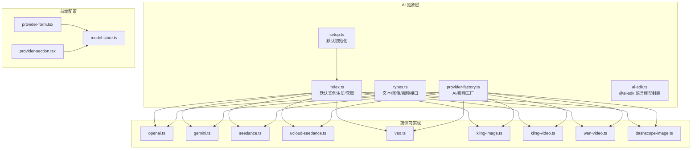
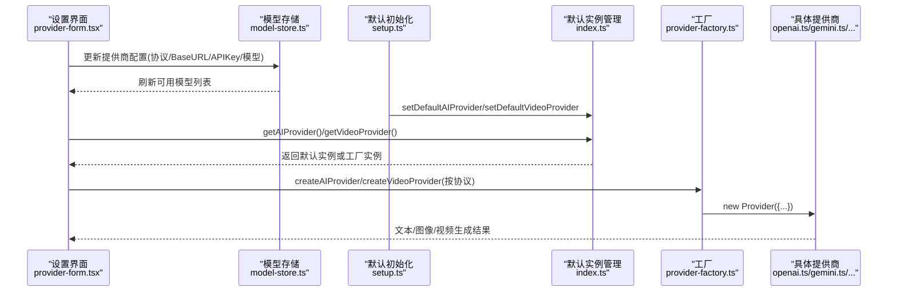
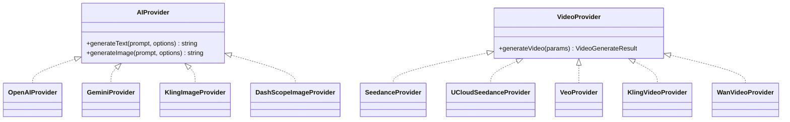

# AI提供商集成

<cite>
**本文引用的文件**
- [src/lib/ai/index.ts](file://src/lib/ai/index.ts)
- [src/lib/ai/setup.ts](file://src/lib/ai/setup.ts)
- [src/lib/ai/types.ts](file://src/lib/ai/types.ts)
- [src/lib/ai/provider-factory.ts](file://src/lib/ai/provider-factory.ts)
- [src/lib/ai/ai-sdk.ts](file://src/lib/ai/ai-sdk.ts)
- [src/lib/ai/providers/openai.ts](file://src/lib/ai/providers/openai.ts)
- [src/lib/ai/providers/gemini.ts](file://src/lib/ai/providers/gemini.ts)
- [src/lib/ai/providers/seedance.ts](file://src/lib/ai/providers/seedance.ts)
- [src/lib/ai/providers/ucloud-seedance.ts](file://src/lib/ai/providers/ucloud-seedance.ts)
- [src/lib/ai/providers/veo.ts](file://src/lib/ai/providers/veo.ts)
- [src/lib/ai/providers/kling-image.ts](file://src/lib/ai/providers/kling-image.ts)
- [src/lib/ai/providers/kling-video.ts](file://src/lib/ai/providers/kling-video.ts)
- [src/lib/ai/providers/wan-video.ts](file://src/lib/ai/providers/wan-video.ts)
- [src/lib/ai/providers/dashscope-image.ts](file://src/lib/ai/providers/dashscope-image.ts)
- [src/components/settings/provider-form.tsx](file://src/components/settings/provider-form.tsx)
- [src/components/settings/provider-section.tsx](file://src/components/settings/provider-section.tsx)
- [src/stores/model-store.ts](file://src/stores/model-store.ts)
- [docs/wechat-v0.2.4-ucloud-seedance.md](file://docs/wechat-v0.2.4-ucloud-seedance.md)
</cite>

## 目录
1. [简介](#简介)
2. [项目结构](#项目结构)
3. [核心组件](#核心组件)
4. [架构总览](#架构总览)
5. [详细组件分析](#详细组件分析)
6. [依赖关系分析](#依赖关系分析)
7. [性能与成本考量](#性能与成本考量)
8. [故障排查指南](#故障排查指南)
9. [结论](#结论)
10. [附录：新增AI提供商指南](#附录新增ai提供商指南)

## 简介
本文件系统性梳理 AIComicBuilder 的 AI 提供商集成方案，覆盖文本生成、图像生成与视频生成三大能力域。文档重点阐述以下内容：
- 各提供商（OpenAI、Google GenAI/Gemini、Seedance、UCloud Seedance、Veo、Kling、百炼 DashScope/Wan）的能力边界与差异
- 工厂模式实现（动态加载、参数传递、错误处理）
- 配置与使用流程（UI 表单、环境变量、默认初始化）
- 性能对比、成本考量与选型建议
- 新增提供商的步骤与最佳实践

## 项目结构
AI 集成相关代码主要集中在以下位置：
- 核心抽象与默认实例管理：src/lib/ai/index.ts、src/lib/ai/setup.ts
- 类型定义：src/lib/ai/types.ts
- 工厂与协议解析：src/lib/ai/provider-factory.ts、src/lib/ai/ai-sdk.ts
- 具体提供商实现：src/lib/ai/providers/*.ts
- 设置界面与模型存储：src/components/settings/*、src/stores/model-store.ts



图表来源
- [src/lib/ai/index.ts:1-39](file://src/lib/ai/index.ts#L1-L39)
- [src/lib/ai/setup.ts:1-31](file://src/lib/ai/setup.ts#L1-L31)
- [src/lib/ai/types.ts:1-53](file://src/lib/ai/types.ts#L1-L53)
- [src/lib/ai/provider-factory.ts:1-111](file://src/lib/ai/provider-factory.ts#L1-L111)
- [src/lib/ai/ai-sdk.ts:1-41](file://src/lib/ai/ai-sdk.ts#L1-L41)
- [src/components/settings/provider-form.tsx:1-238](file://src/components/settings/provider-form.tsx#L1-L238)
- [src/components/settings/provider-section.tsx:1-42](file://src/components/settings/provider-section.tsx#L1-L42)
- [src/stores/model-store.ts:79-112](file://src/stores/model-store.ts#L79-L112)

章节来源
- [src/lib/ai/index.ts:1-39](file://src/lib/ai/index.ts#L1-L39)
- [src/lib/ai/setup.ts:1-31](file://src/lib/ai/setup.ts#L1-L31)
- [src/lib/ai/types.ts:1-53](file://src/lib/ai/types.ts#L1-L53)
- [src/lib/ai/provider-factory.ts:1-111](file://src/lib/ai/provider-factory.ts#L1-L111)
- [src/lib/ai/ai-sdk.ts:1-41](file://src/lib/ai/ai-sdk.ts#L1-L41)
- [src/components/settings/provider-form.tsx:1-238](file://src/components/settings/provider-form.tsx#L1-L238)
- [src/components/settings/provider-section.tsx:1-42](file://src/components/settings/provider-section.tsx#L1-L42)
- [src/stores/model-store.ts:79-112](file://src/stores/model-store.ts#L79-L112)

## 核心组件
- 默认实例注册与获取：通过全局状态注册默认 AI/视频提供商，并支持按上传目录动态工厂化实例。
- 类型体系：统一抽象出 AIProvider（文本/图像）、VideoProvider（视频）及参数选项。
- 工厂与协议映射：根据协议字符串动态构造具体提供商实例，集中处理错误与参数透传。
- @ai-sdk 封装：对 OpenAI 与 Gemini 提供统一的语言模型创建入口。

章节来源
- [src/lib/ai/index.ts:11-39](file://src/lib/ai/index.ts#L11-L39)
- [src/lib/ai/types.ts:19-53](file://src/lib/ai/types.ts#L19-L53)
- [src/lib/ai/provider-factory.ts:27-104](file://src/lib/ai/provider-factory.ts#L27-L104)
- [src/lib/ai/ai-sdk.ts:13-31](file://src/lib/ai/ai-sdk.ts#L13-L31)

## 架构总览
下图展示了从 UI 配置到默认实例、再到具体提供商实现的调用链路与职责划分。



图表来源
- [src/components/settings/provider-form.tsx:55-238](file://src/components/settings/provider-form.tsx#L55-L238)
- [src/stores/model-store.ts:79-112](file://src/stores/model-store.ts#L79-L112)
- [src/lib/ai/setup.ts:8-31](file://src/lib/ai/setup.ts#L8-L31)
- [src/lib/ai/index.ts:11-39](file://src/lib/ai/index.ts#L11-L39)
- [src/lib/ai/provider-factory.ts:27-104](file://src/lib/ai/provider-factory.ts#L27-L104)
- [src/lib/ai/providers/openai.ts:7-25](file://src/lib/ai/providers/openai.ts#L7-L25)
- [src/lib/ai/providers/gemini.ts:6-20](file://src/lib/ai/providers/gemini.ts#L6-L20)
- [src/lib/ai/providers/seedance.ts:27-60](file://src/lib/ai/providers/seedance.ts#L27-L60)
- [src/lib/ai/providers/ucloud-seedance.ts:37-80](file://src/lib/ai/providers/ucloud-seedance.ts#L37-L80)
- [src/lib/ai/providers/veo.ts:30-70](file://src/lib/ai/providers/veo.ts#L30-L70)
- [src/lib/ai/providers/kling-image.ts:34-60](file://src/lib/ai/providers/kling-image.ts#L34-L60)
- [src/lib/ai/providers/kling-video.ts:59-85](file://src/lib/ai/providers/kling-video.ts#L59-L85)
- [src/lib/ai/providers/wan-video.ts:41-70](file://src/lib/ai/providers/wan-video.ts#L41-L70)
- [src/lib/ai/providers/dashscope-image.ts:94-120](file://src/lib/ai/providers/dashscope-image.ts#L94-L120)

## 详细组件分析

### 工厂模式与动态加载
- 协议到类的映射：工厂函数根据协议字符串返回对应提供商实例，支持文本/图像/视频三类。
- 参数透传：工厂接收 ProviderConfig，内部将 apiKey/baseUrl/modelId/uploadDir 等参数透传给具体提供商构造函数。
- 错误处理：遇到不支持的协议时抛出明确错误，便于定位配置问题。

```mermaid
flowchart TD
Start(["输入: ProviderConfig"]) --> CheckProto["检查 protocol 字段"]
CheckProto --> |openai| NewOAI["new OpenAIProvider(...)"]
CheckProto --> |gemini| NewGMI["new GeminiProvider(...)"]
CheckProto --> |seedance| NewSD["new SeedanceProvider(...)"]
CheckProto --> |ucloud-seedance| NewUS["new UCloudSeedanceProvider(...)"]
CheckProto --> |gemini(veo)| NewVEO["new VeoProvider(...)"]
CheckProto --> |kling(图像)| NewKI["new KlingImageProvider(...)"]
CheckProto --> |kling(视频)| NewKV["new KlingVideoProvider(...)"]
CheckProto --> |wan| NewWV["new WanVideoProvider(...)"]
CheckProto --> |dashscope| NewDSI["new DashScopeImageProvider(...)"]
CheckProto --> |其他| ThrowErr["抛出错误: 不支持的协议"]
NewOAI --> Ret["返回 AIProvider 实例"]
NewGMI --> Ret
NewSD --> RetV["返回 VideoProvider 实例"]
NewUS --> RetV
NewVEO --> RetV
NewKI --> Ret
NewKV --> RetV
NewWV --> RetV
NewDSI --> Ret
ThrowErr --> End(["结束"])
RetV --> End
Ret --> End
```

图表来源
- [src/lib/ai/provider-factory.ts:27-104](file://src/lib/ai/provider-factory.ts#L27-L104)

章节来源
- [src/lib/ai/provider-factory.ts:13-111](file://src/lib/ai/provider-factory.ts#L13-L111)

### 默认实例与初始化
- 环境变量驱动：根据 OPENAI_API_KEY、GEMINI_API_KEY、SEEDANCE_API_KEY 是否存在，分别设置默认 AI/视频提供商。
- 工厂化实例：默认实例可绑定一个工厂函数，按需传入 uploadDir 动态创建带上传目录的实例。
- 获取策略：优先使用带 uploadDir 的工厂实例；否则回退到默认实例；若均未设置则抛错。

章节来源
- [src/lib/ai/setup.ts:8-31](file://src/lib/ai/setup.ts#L8-L31)
- [src/lib/ai/index.ts:11-39](file://src/lib/ai/index.ts#L11-L39)

### 类型与参数规范
- 文本生成：支持 model、temperature、maxTokens、systemPrompt、图片输入（视觉模型）。
- 图像生成：支持 size、aspectRatio、quality、参考图与标签。
- 视频生成：支持首帧/尾帧或初始图两种模式，统一参数包含 prompt、duration、ratio、referenceImages 等。

章节来源
- [src/lib/ai/types.ts:1-53](file://src/lib/ai/types.ts#L1-L53)

### @ai-sdk 语言模型封装
- 统一入口：根据协议创建语言模型实例，屏蔽底层 SDK 差异。
- JSON 提取：提供辅助函数剥离代码块标记，便于解析结构化输出。

章节来源
- [src/lib/ai/ai-sdk.ts:13-41](file://src/lib/ai/ai-sdk.ts#L13-L41)

### 具体提供商能力与差异

#### OpenAI
- 能力：文本与图像生成（视觉模型支持图片输入）。
- 配置：支持自定义 baseURL 与模型 ID；默认模型可在构造时指定。
- 使用场景：通用文本理解、多模态图文生成。

章节来源
- [src/lib/ai/providers/openai.ts:7-25](file://src/lib/ai/providers/openai.ts#L7-L25)

#### Google GenAI / Gemini
- 能力：文本与图像生成；通过 @ai-sdk 封装统一语言模型创建。
- 配置：API Key 与模型 ID；适合与 @ai-sdk 生态配合。
- 使用场景：跨平台语言模型、结构化输出解析。

章节来源
- [src/lib/ai/providers/gemini.ts:6-20](file://src/lib/ai/providers/gemini.ts#L6-L20)
- [src/lib/ai/ai-sdk.ts:22-27](file://src/lib/ai/ai-sdk.ts#L22-L27)

#### Seedance（火山引擎）
- 能力：视频生成（首帧/尾帧或初始图模式）。
- 配置：API Key、Base URL、模型 ID；支持上传目录。
- 使用场景：中文场景下的高质量视频生成。

章节来源
- [src/lib/ai/providers/seedance.ts:27-60](file://src/lib/ai/providers/seedance.ts#L27-L60)

#### UCloud Seedance（ModelVerse）
- 能力：视频生成，支持 Seedance 1.5 Pro 与 2.0 模型。
- 配置：API Key、Base URL、模型 ID；支持上传目录。
- 使用场景：国内合规与高性价比视频生成。

章节来源
- [src/lib/ai/providers/ucloud-seedance.ts:37-80](file://src/lib/ai/providers/ucloud-seedance.ts#L37-L80)
- [docs/wechat-v0.2.4-ucloud-seedance.md:25-59](file://docs/wechat-v0.2.4-ucloud-seedance.md#L25-L59)

#### Veo（Gemini 视频）
- 能力：视频生成，基于 Veo 模型。
- 配置：API Key、Base URL、模型 ID；支持上传目录。
- 使用场景：与 Gemini 平台联动的视频生成。

章节来源
- [src/lib/ai/providers/veo.ts:30-70](file://src/lib/ai/providers/veo.ts#L30-L70)

#### Kling（图像/视频）
- 图像：支持 JWT Token 认证，将本地文件转为 base64 或远程 URL。
- 视频：支持 JWT Token 认证，轮询任务状态直至完成。
- 配置：Access Key、Secret Key、Base URL、模型 ID；支持上传目录。
- 使用场景：快速接入的图像与视频生成。

章节来源
- [src/lib/ai/providers/kling-image.ts:34-60](file://src/lib/ai/providers/kling-image.ts#L34-L60)
- [src/lib/ai/providers/kling-video.ts:59-85](file://src/lib/ai/providers/kling-video.ts#L59-L85)

#### 百炼（DashScope）- 图片
- 能力：仅图像生成；按模型家族自动推断尺寸与参数。
- 配置：API Key、Base URL、模型 ID；支持上传目录。
- 使用场景：阿里生态内的高质量图像生成。

章节来源
- [src/lib/ai/providers/dashscope-image.ts:94-120](file://src/lib/ai/providers/dashscope-image.ts#L94-L120)
- [src/lib/ai/providers/dashscope-image.ts:126-221](file://src/lib/ai/providers/dashscope-image.ts#L126-L221)

#### 百炼（Wan）- 视频
- 能力：视频生成。
- 配置：API Key、Base URL、模型 ID；支持上传目录。
- 使用场景：阿里生态内的视频生成。

章节来源
- [src/lib/ai/providers/wan-video.ts:41-70](file://src/lib/ai/providers/wan-video.ts#L41-L70)

### UI 配置与模型管理
- 协议选择：根据能力（文本/图像/视频）显示可用协议集合。
- 默认 Base URL：内置常见协议的默认 Base URL，便于一键填写。
- 模型列表：支持拉取与勾选模型，作为默认或特定项目使用。
- 存储与交互：通过 model-store 维护提供商列表、模型勾选状态与切换。

章节来源
- [src/components/settings/provider-form.tsx:26-49](file://src/components/settings/provider-form.tsx#L26-L49)
- [src/components/settings/provider-form.tsx:120-143](file://src/components/settings/provider-form.tsx#L120-L143)
- [src/components/settings/provider-form.tsx:206-238](file://src/components/settings/provider-form.tsx#L206-L238)
- [src/components/settings/provider-section.tsx:19-42](file://src/components/settings/provider-section.tsx#L19-L42)
- [src/stores/model-store.ts:79-112](file://src/stores/model-store.ts#L79-L112)

## 依赖关系分析
- 抽象层与实现解耦：types.ts 定义统一接口，index.ts 管理默认实例，provider-factory.ts 负责动态构造。
- 外部 SDK：OpenAI、@ai-sdk/google、@ai-sdk/openai 等。
- 文件系统：统一通过上传目录保存生成结果，便于后续处理与下载。



图表来源
- [src/lib/ai/types.ts:19-53](file://src/lib/ai/types.ts#L19-L53)
- [src/lib/ai/providers/openai.ts:7-25](file://src/lib/ai/providers/openai.ts#L7-L25)
- [src/lib/ai/providers/gemini.ts:6-20](file://src/lib/ai/providers/gemini.ts#L6-L20)
- [src/lib/ai/providers/seedance.ts:27-60](file://src/lib/ai/providers/seedance.ts#L27-L60)
- [src/lib/ai/providers/ucloud-seedance.ts:37-80](file://src/lib/ai/providers/ucloud-seedance.ts#L37-L80)
- [src/lib/ai/providers/veo.ts:30-70](file://src/lib/ai/providers/veo.ts#L30-L70)
- [src/lib/ai/providers/kling-image.ts:34-60](file://src/lib/ai/providers/kling-image.ts#L34-L60)
- [src/lib/ai/providers/kling-video.ts:59-85](file://src/lib/ai/providers/kling-video.ts#L59-L85)
- [src/lib/ai/providers/wan-video.ts:41-70](file://src/lib/ai/providers/wan-video.ts#L41-L70)
- [src/lib/ai/providers/dashscope-image.ts:94-120](file://src/lib/ai/providers/dashscope-image.ts#L94-L120)

## 性能与成本考量
- 性能特征（基于实现与文档）：
  - Seedance/UCloud Seedance：支持首帧/尾帧或初始图模式，具备任务轮询机制，适合中长视频生成。
  - Veo：基于 Gemini 平台，适合与 Google 生态协同。
  - Kling：图像与视频均支持 JWT Token 认证，视频生成采用轮询，适合快速集成。
  - 百炼（DashScope）：图片生成按模型家族自动推断尺寸，适合稳定输出质量。
  - 百炼（Wan）：视频生成面向阿里生态，适合统一平台内使用。
- 成本考量：
  - 不同提供商的计费模式与配额不同，建议结合项目预算与并发需求评估。
  - 优先使用默认初始化与环境变量配置，减少重复鉴权与网络往返。
- 选型建议：
  - 文本/图像：OpenAI 与 Gemini 均可；如需 @ai-sdk 统一封装可选 Gemini。
  - 视频：国内合规与高性价比可选 UCloud Seedance；需要与 Google 平台联动可选 Veo；快速集成可选 Kling。
  - 图片：阿里生态内可选 DashScope；通用场景可选 OpenAI/Gemini/Kling。

## 故障排查指南
- 未配置默认提供商
  - 现象：调用 getAIProvider()/getVideoProvider() 抛错。
  - 排查：确认是否已通过环境变量或显式 setDefault* 注册默认实例。
- 协议不支持
  - 现象：工厂创建时报“不支持的协议”。
  - 排查：核对 ProviderConfig.protocol 是否在支持列表中。
- 文件读取失败（Kling 视频）
  - 现象：提示帧文件不存在。
  - 排查：确认传入的本地路径或 URL 可访问且格式正确。
- 下载失败（DashScope 图片）
  - 现象：下载生成图片失败。
  - 排查：检查响应状态码与网络连通性，确认 Base URL 与 API Key 正确。

章节来源
- [src/lib/ai/index.ts:21-39](file://src/lib/ai/index.ts#L21-L39)
- [src/lib/ai/provider-factory.ts:58-60](file://src/lib/ai/provider-factory.ts#L58-L60)
- [src/lib/ai/providers/kling-video.ts:47-57](file://src/lib/ai/providers/kling-video.ts#L47-L57)
- [src/lib/ai/providers/dashscope-image.ts:204-209](file://src/lib/ai/providers/dashscope-image.ts#L204-L209)

## 结论
AIComicBuilder 通过统一的抽象层、工厂模式与默认实例管理，实现了对多家 AI 提供商的灵活集成。开发者可根据业务场景选择合适的提供商组合，并通过 UI 与环境变量快速完成配置与部署。对于新增提供商，遵循现有工厂与类型约定即可高效接入。

## 附录：新增AI提供商指南
- 步骤概览
  1) 在 providers 目录新增提供商类，实现 AIProvider 或 VideoProvider 接口。
  2) 在 provider-factory.ts 的 createAIProvider/createVideoProvider 中增加协议分支与构造逻辑。
  3) 在 UI provider-form.tsx 的协议选项中加入新协议，并设置默认 Base URL。
  4) 如需默认初始化，更新 setup.ts 的环境变量判断与 setDefault* 调用。
  5) 在 types.ts 中如有新增参数，完善接口定义并确保工厂与实现一致。
- 最佳实践
  - 明确定义错误处理与参数校验，避免运行期异常。
  - 统一上传目录策略，保证生成资源可检索与复用。
  - 对外暴露最小必要参数，隐藏第三方 SDK 细节。
  - 编写简要使用说明与配置示例，便于用户快速上手。

章节来源
- [src/lib/ai/provider-factory.ts:27-104](file://src/lib/ai/provider-factory.ts#L27-L104)
- [src/components/settings/provider-form.tsx:26-49](file://src/components/settings/provider-form.tsx#L26-L49)
- [src/lib/ai/setup.ts:8-31](file://src/lib/ai/setup.ts#L8-L31)
- [src/lib/ai/types.ts:19-53](file://src/lib/ai/types.ts#L19-L53)