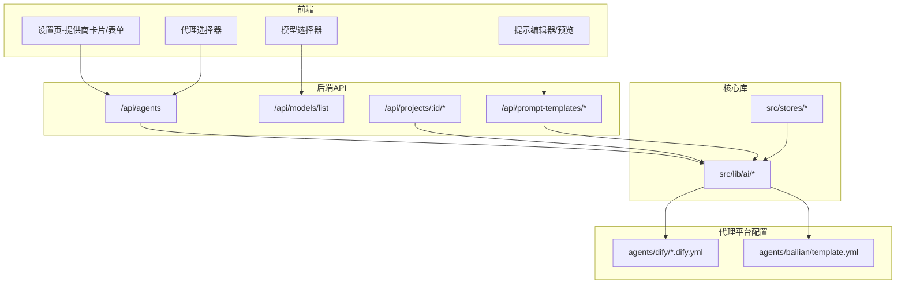
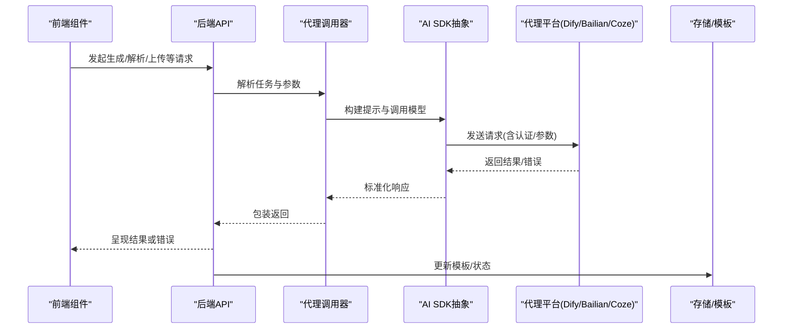
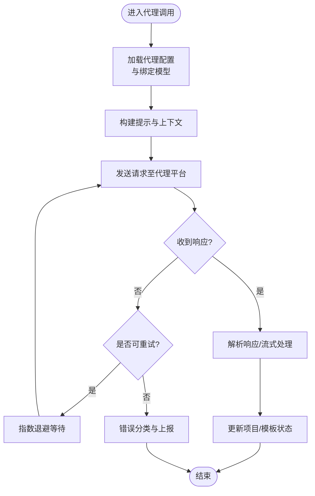
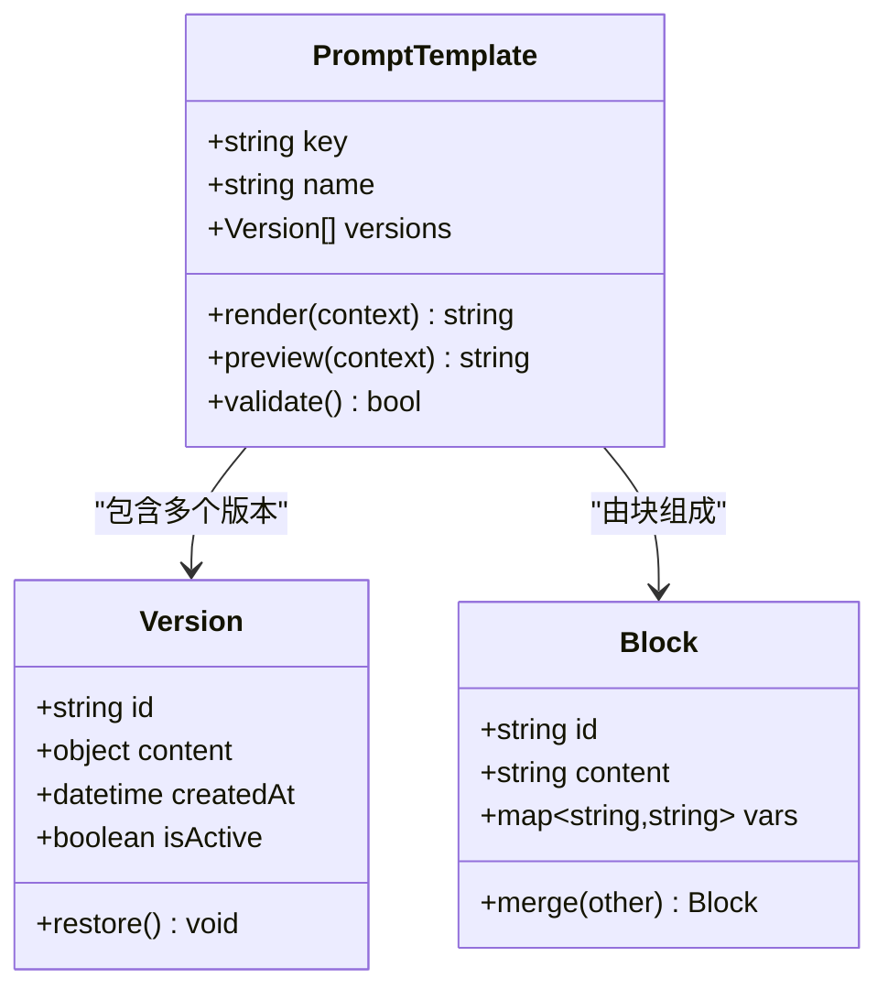
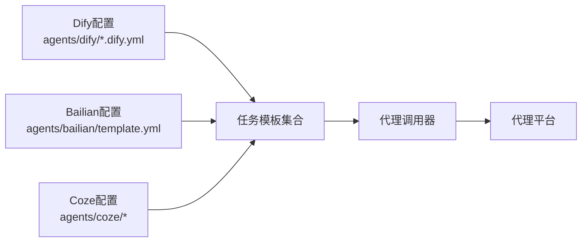
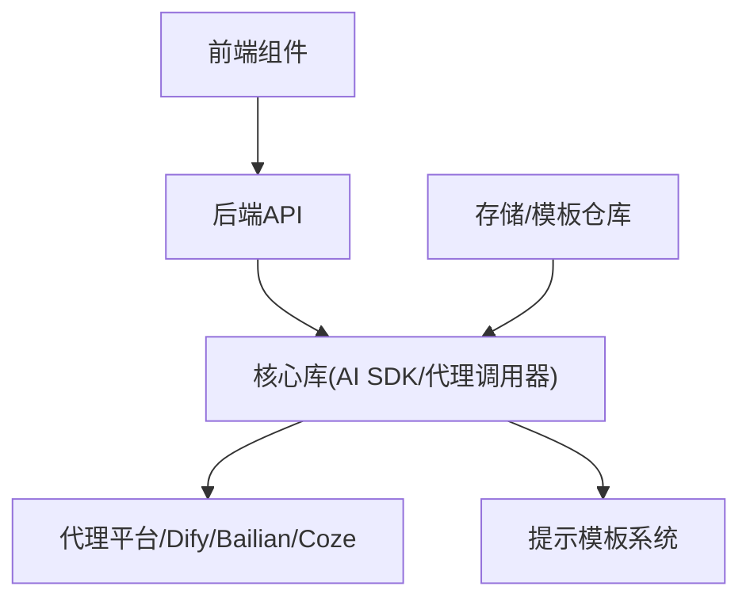

# AI服务集成

<cite>
**本文档引用的文件**
- [agent-caller.ts](file://src/lib/ai/agent-caller.ts)
- [ai-sdk.ts](file://src/lib/ai/ai-sdk.ts)
- [index.ts](file://src/lib/ai/index.ts)
- [model-limits.ts](file://src/lib/ai/model-limits.ts)
- [blocks.ts](file://src/lib/ai/prompts/blocks.ts)
- [character-extract.ts](file://src/lib/ai/prompts/character-extract.ts)
- [character-image.ts](file://src/lib/ai/prompts/character-image.ts)
- [frame-generate.ts](file://src/lib/ai/prompts/frame-generate.ts)
- [import-character-extract.ts](file://src/lib/ai/prompts/import-character-extract.ts)
- [template.yml](file://agents/bailian/template.yml)
- [character-extract.dify.yml](file://agents/dify/character-extract.dify.yml)
- [keyframe-prompts.dify.yml](file://agents/dify/keyframe-prompts.dify.yml)
- [ref-image-prompts.dify.yml](file://agents/dify/ref-image-prompts.dify.yml)
- [ref-video-prompts.dify.yml](file://agents/dify/ref-video-prompts.dify.yml)
- [script-generate.dify.yml](file://agents/dify/script-generate.dify.yml)
- [script-outline.dify.yml](file://agents/dify/script-outline.dify.yml)
- [script-parse.dify.yml](file://agents/dify/script-parse.dify.yml)
- [shot-split.dify.yml](file://agents/dify/shot-split.dify.yml)
- [video-prompts.dify.yml](file://agents/dify/video-prompts.dify.yml)
- [route.ts](file://src/app/api/agents/[id]/route.ts)
- [route.ts](file://src/app/api/models/list/route.ts)
- [route.ts](file://src/app/api/prompt-templates/[promptKey]/route.ts)
- [route.ts](file://src/app/api/prompt-templates/registry/route.ts)
- [route.ts](file://src/app/api/prompt-templates/validate/route.ts)
- [route.ts](file://src/app/api/projects/[id]/agent-bindings/route.ts)
- [route.ts](file://src/app/api/projects/[id]/characters/[characterId]/route.ts)
- [route.ts](file://src/app/api/projects/[id]/episodes/[episodeId]/route.ts)
- [route.ts](file://src/app/api/projects/[id]/shots/[shotId]/route.ts)
- [route.ts](file://src/app/api/projects/[id]/shots/[shotId]/assets/[assetId]/route.ts)
- [route.ts](file://src/app/api/projects/[id]/shots/[shotId]/upload/route.ts)
- [route.ts](file://src/app/api/projects/[id]/generate/route.ts)
- [route.ts](file://src/app/api/projects/[id]/import/generate/route.ts)
- [route.ts](file://src/app/api/projects/[id]/import/parse/route.ts)
- [route.ts](file://src/app/api/projects/[id]/import/split/route.ts)
- [route.ts](file://src/app/api/projects/[id]/mood-board/route.ts)
- [route.ts](file://src/app/api/projects/[id]/prompt-templates/route.ts)
- [route.ts](file://src/app/api/projects/[id]/prompt-templates/[promptKey]/route.ts)
- [route.ts](file://src/app/api/projects/[id]/prompt-templates/[promptKey]/versions/[vid]/restore/route.ts)
- [route.ts](file://src/app/api/projects/[id]/prompt-templates/[promptKey]/versions/route.ts)
- [route.ts](file://src/app/api/projects/[id]/prompt-templates/preview/route.ts)
- [route.ts](file://src/app/api/projects/[id]/prompt-templates/registry/route.ts)
- [route.ts](file://src/app/api/projects/[id]/prompt-templates/validate/route.ts)
- [route.ts](file://src/app/api/projects/[id]/prompt-templates/[promptKey]/versions/[vid]/restore/route.ts)
- [route.ts](file://src/app/api/projects/[id]/prompt-templates/[promptKey]/versions/route.ts)
- [route.ts](file://src/app/api/projects/[id]/prompt-templates/preview/route.ts)
- [route.ts](file://src/app/api/projects/[id]/prompt-templates/registry/route.ts)
- [route.ts](file://src/app/api/projects/[id]/prompt-templates/validate/route.ts)
- [route.ts](file://src/app/api/tasks/[id]/route.ts)
- [route.ts](file://src/app/api/uploads/[...path]/route.ts)
- [provider-section.tsx](file://src/components/settings/provider-section.tsx)
- [provider-form.tsx](file://src/components/settings/provider-form.tsx)
- [default-model-picker.tsx](file://src/components/settings/default-model-picker.tsx)
- [agent-picker.tsx](file://src/components/agent-picker.tsx)
- [ai-optimize-button.tsx](file://src/components/editor/ai-optimize-button.tsx)
- [model-selector.tsx](file://src/components/editor/model-selector.tsx)
- [prompt-editor.tsx](file://src/components/prompt-templates/prompt-editor.tsx)
- [prompt-preview.tsx](file://src/components/prompt-templates/prompt-preview.tsx)
- [prompt-drawer.tsx](file://src/components/prompt-templates/prompt-drawer.tsx)
- [prompt-templates-registry.ts](file://src/stores/prompt-template-store.ts)
- [agent-store.ts](file://src/stores/agent-store.ts)
- [model-store.ts](file://src/stores/model-store.ts)
- [episode-store.ts](file://src/stores/episode-store.ts)
- [project-store.ts](file://src/stores/project-store.ts)
- [bootstrap.ts](file://src/lib/bootstrap.ts)
- [proxy.ts](file://src/proxy.ts)
</cite>

## 目录
1. [简介](#简介)
2. [项目结构](#项目结构)
3. [核心组件](#核心组件)
4. [架构总览](#架构总览)
5. [详细组件分析](#详细组件分析)
6. [依赖关系分析](#依赖关系分析)
7. [性能考虑](#性能考虑)
8. [故障排除指南](#故障排除指南)
9. [结论](#结论)
10. [附录](#附录)

## 简介
本文件面向AIComicBuilder的AI服务集成，系统性阐述AI提供商接入、代理平台配置、提示模板系统与模型管理的设计与实现。文档覆盖OpenAI、Google GenAI、Dify、Bailian、Coze等平台的适配方式，解释代理调用机制、提示模板管理与模型配置流程，并提供性能优化建议与错误处理策略。同时，结合多模态AI服务（文本、图像、视频）的最佳实践，帮助开发者在保证质量的前提下提升生成效率与稳定性。

## 项目结构
AI服务集成主要分布在以下区域：
- 后端API层：位于src/app/api下，提供代理调用、模型列表、提示模板注册与校验、项目级AI工作流等接口。
- 前端组件层：位于src/components，包含AI提供商配置、默认模型选择、代理选择器、提示编辑器与预览等UI组件。
- 核心库层：位于src/lib/ai，封装AI SDK抽象、代理调用器、提示块与具体任务的提示工程、模型限额等。
- 代理平台配置：位于agents目录，包含Dify与Bailian的YAML配置文件，定义不同任务的提示模板与执行参数。
- 存储与状态：位于src/stores，管理提示模板仓库、代理与模型状态，以及项目级数据。

图表来源
- [index.ts](file://src/lib/ai/index.ts)
- [agent-caller.ts](file://src/lib/ai/agent-caller.ts)
- [route.ts](file://src/app/api/agents/[id]/route.ts)
- [route.ts](file://src/app/api/models/list/route.ts)
- [route.ts](file://src/app/api/projects/[id]/generate/route.ts)
- [route.ts](file://src/app/api/projects/[id]/prompt-templates/[promptKey]/route.ts)

章节来源
- [index.ts](file://src/lib/ai/index.ts)
- [agent-caller.ts](file://src/lib/ai/agent-caller.ts)
- [provider-section.tsx](file://src/components/settings/provider-section.tsx)
- [provider-form.tsx](file://src/components/settings/provider-form.tsx)
- [agent-picker.tsx](file://src/components/agent-picker.tsx)
- [model-selector.tsx](file://src/components/editor/model-selector.tsx)
- [prompt-editor.tsx](file://src/components/prompt-templates/prompt-editor.tsx)
- [prompt-preview.tsx](file://src/components/prompt-templates/prompt-preview.tsx)

## 核心组件
本节聚焦AI服务集成的核心模块：AI SDK抽象、代理调用器、提示模板系统与模型管理。

- AI SDK抽象与统一入口
  - 统一对外暴露AI能力，隐藏不同提供商差异，便于扩展与切换。
  - 提供模型列表查询、消息对话、工具调用等通用接口。
- 代理调用器
  - 负责将业务请求路由到具体代理平台（如Dify、Bailian、Coze），并处理响应与错误。
  - 支持并发控制、重试与超时策略，保障稳定性。
- 提示模板系统
  - 定义提示块（blocks）、任务专用提示（如角色提取、分镜生成、视频提示等）。
  - 支持模板版本化、预览、注册与校验，确保一致性与可追溯性。
- 模型管理
  - 维护模型限额、上下文窗口、成本与可用性信息，辅助前端选择与后端调度。

章节来源
- [ai-sdk.ts](file://src/lib/ai/ai-sdk.ts)
- [agent-caller.ts](file://src/lib/ai/agent-caller.ts)
- [blocks.ts](file://src/lib/ai/prompts/blocks.ts)
- [character-extract.ts](file://src/lib/ai/prompts/character-extract.ts)
- [frame-generate.ts](file://src/lib/ai/prompts/frame-generate.ts)
- [model-limits.ts](file://src/lib/ai/model-limits.ts)

## 架构总览
AI服务集成采用“前端组件 + 后端API + 核心库 + 代理平台配置”的分层设计。前端通过设置页配置提供商与默认模型，通过代理选择器选择目标代理；后端API接收请求，调用核心库进行提示工程与代理调用；代理平台配置文件定义具体任务的提示与参数；存储层负责模板与状态管理。

图表来源
- [route.ts](file://src/app/api/projects/[id]/generate/route.ts)
- [agent-caller.ts](file://src/lib/ai/agent-caller.ts)
- [ai-sdk.ts](file://src/lib/ai/ai-sdk.ts)
- [character-extract.dify.yml](file://agents/dify/character-extract.dify.yml)
- [template.yml](file://agents/bailian/template.yml)

## 详细组件分析

### AI SDK抽象与统一入口
- 设计要点
  - 将不同AI提供商的SDK统一封装，屏蔽差异，提供一致的调用接口。
  - 支持多模型族（文本/视觉/多模态）与工具调用，便于后续扩展。
- 关键职责
  - 模型列表查询、消息对话、流式输出、错误映射与重试策略。
- 复杂度与性能
  - 接口调用复杂度取决于提供商与网络延迟；建议缓存常用模型元数据，减少重复查询。

章节来源
- [ai-sdk.ts](file://src/lib/ai/ai-sdk.ts)
- [index.ts](file://src/lib/ai/index.ts)

### 代理调用器
- 设计要点
  - 根据任务类型选择对应代理平台与配置文件，组装提示与上下文。
  - 实现并发限制、超时控制与指数退避重试，提升鲁棒性。
- 关键职责
  - 代理绑定管理、任务路由、响应解析与错误传播。
- 错误处理
  - 对空响应、超时、鉴权失败、配额不足等情况进行分类处理与用户提示。

图表来源
- [agent-caller.ts](file://src/lib/ai/agent-caller.ts)
- [route.ts](file://src/app/api/projects/[id]/generate/route.ts)

章节来源
- [agent-caller.ts](file://src/lib/ai/agent-caller.ts)

### 提示模板系统
- 设计要点
  - 提示块（blocks）定义可复用的提示片段，支持变量注入与条件拼接。
  - 针对不同任务（角色提取、分镜拆分、视频提示等）提供专用模板。
  - 支持模板版本化、预览、注册与校验，确保一致性与可追溯性。
- 数据结构与复杂度
  - 模板以YAML/JSON形式存储，解析与渲染复杂度与模板长度线性相关。
  - 版本管理引入哈希校验，避免冲突与回滚。
- 最佳实践
  - 将通用规则抽取为提示块，减少重复；对敏感信息进行脱敏与最小化暴露。

图表来源
- [blocks.ts](file://src/lib/ai/prompts/blocks.ts)
- [character-extract.ts](file://src/lib/ai/prompts/character-extract.ts)
- [frame-generate.ts](file://src/lib/ai/prompts/frame-generate.ts)
- [route.ts](file://src/app/api/projects/[id]/prompt-templates/[promptKey]/route.ts)
- [route.ts](file://src/app/api/projects/[id]/prompt-templates/registry/route.ts)
- [route.ts](file://src/app/api/projects/[id]/prompt-templates/validate/route.ts)

章节来源
- [blocks.ts](file://src/lib/ai/prompts/blocks.ts)
- [character-extract.ts](file://src/lib/ai/prompts/character-extract.ts)
- [character-image.ts](file://src/lib/ai/prompts/character-image.ts)
- [frame-generate.ts](file://src/lib/ai/prompts/frame-generate.ts)
- [import-character-extract.ts](file://src/lib/ai/prompts/import-character-extract.ts)
- [route.ts](file://src/app/api/projects/[id]/prompt-templates/[promptKey]/route.ts)
- [route.ts](file://src/app/api/projects/[id]/prompt-templates/registry/route.ts)
- [route.ts](file://src/app/api/projects/[id]/prompt-templates/validate/route.ts)

### 模型管理
- 设计要点
  - 维护模型限额、上下文窗口、成本与可用性信息，辅助前端选择与后端调度。
  - 提供模型列表查询接口，支持按提供商与能力筛选。
- 关键职责
  - 模型可用性检查、限额校验、默认模型推荐。
- 性能与成本
  - 优先选择适合任务的轻量模型，避免不必要的大模型调用；对高频查询进行缓存。

章节来源
- [model-limits.ts](file://src/lib/ai/model-limits.ts)
- [route.ts](file://src/app/api/models/list/route.ts)

### 代理平台配置（Dify/Bailian/Coze）
- 设计要点
  - 通过YAML配置文件定义不同任务的提示模板与执行参数，便于版本化与复用。
  - 支持多任务模板（如角色提取、脚本生成、分镜拆分、视频提示等）。
- 配置结构
  - 包含任务标识、提示内容、参数映射、工具调用与输出格式约束。
- 使用场景
  - Dify：适合需要复杂工作流编排与多轮对话的任务。
  - Bailian：适合国内合规与特定行业场景。
  - Coze：适合快速搭建与迭代的聊天机器人与工作流。

图表来源
- [character-extract.dify.yml](file://agents/dify/character-extract.dify.yml)
- [keyframe-prompts.dify.yml](file://agents/dify/keyframe-prompts.dify.yml)
- [ref-image-prompts.dify.yml](file://agents/dify/ref-image-prompts.dify.yml)
- [ref-video-prompts.dify.yml](file://agents/dify/ref-video-prompts.dify.yml)
- [script-generate.dify.yml](file://agents/dify/script-generate.dify.yml)
- [script-outline.dify.yml](file://agents/dify/script-outline.dify.yml)
- [script-parse.dify.yml](file://agents/dify/script-parse.dify.yml)
- [shot-split.dify.yml](file://agents/dify/shot-split.dify.yml)
- [video-prompts.dify.yml](file://agents/dify/video-prompts.dify.yml)
- [template.yml](file://agents/bailian/template.yml)

章节来源
- [character-extract.dify.yml](file://agents/dify/character-extract.dify.yml)
- [keyframe-prompts.dify.yml](file://agents/dify/keyframe-prompts.dify.yml)
- [ref-image-prompts.dify.yml](file://agents/dify/ref-image-prompts.dify.yml)
- [ref-video-prompts.dify.yml](file://agents/dify/ref-video-prompts.dify.yml)
- [script-generate.dify.yml](file://agents/dify/script-generate.dify.yml)
- [script-outline.dify.yml](file://agents/dify/script-outline.dify.yml)
- [script-parse.dify.yml](file://agents/dify/script-parse.dify.yml)
- [shot-split.dify.yml](file://agents/dify/shot-split.dify.yml)
- [video-prompts.dify.yml](file://agents/dify/video-prompts.dify.yml)
- [template.yml](file://agents/bailian/template.yml)

### 前端组件与交互
- 设置页组件
  - 提供商卡片与表单用于配置与切换AI提供商；默认模型选择器用于指定默认推理模型。
- 代理选择器
  - 在项目内为不同任务绑定代理，支持动态切换与预览。
- 提示编辑器与预览
  - 支持模板编辑、变量注入与实时预览，便于调试与优化。
- AI优化按钮
  - 面向脚本与分镜等场景，一键触发AI优化建议。

章节来源
- [provider-section.tsx](file://src/components/settings/provider-section.tsx)
- [provider-form.tsx](file://src/components/settings/provider-form.tsx)
- [default-model-picker.tsx](file://src/components/settings/default-model-picker.tsx)
- [agent-picker.tsx](file://src/components/agent-picker.tsx)
- [ai-optimize-button.tsx](file://src/components/editor/ai-optimize-button.tsx)
- [prompt-editor.tsx](file://src/components/prompt-templates/prompt-editor.tsx)
- [prompt-preview.tsx](file://src/components/prompt-templates/prompt-preview.tsx)

## 依赖关系分析
- 组件耦合
  - 前端组件依赖后端API与存储；后端API依赖核心库与代理配置；核心库依赖AI SDK与提示模板。
- 外部依赖
  - 代理平台（Dify、Bailian、Coze）与AI提供商（OpenAI、Google GenAI等）作为外部服务集成点。
- 循环依赖
  - 通过清晰的分层与接口契约避免循环依赖；存储与模板通过只读访问核心库。

图表来源
- [index.ts](file://src/lib/ai/index.ts)
- [agent-caller.ts](file://src/lib/ai/agent-caller.ts)
- [route.ts](file://src/app/api/agents/[id]/route.ts)
- [prompt-templates-registry.ts](file://src/stores/prompt-template-store.ts)

章节来源
- [index.ts](file://src/lib/ai/index.ts)
- [agent-caller.ts](file://src/lib/ai/agent-caller.ts)
- [prompt-templates-registry.ts](file://src/stores/prompt-template-store.ts)

## 性能考虑
- 模型选择与成本控制
  - 优先选用适合任务的轻量模型；对高频任务启用缓存与批处理。
- 并发与限流
  - 对代理平台实施并发限制与队列化处理，避免过载。
- 流式输出与增量渲染
  - 利用流式输出提升用户体验，前端按片段增量渲染。
- 缓存与预热
  - 缓存模型元数据与常用模板；对热点代理接口进行预热。
- 上下文压缩
  - 对长上下文进行摘要与截断，保留关键信息。

## 故障排除指南
- 常见问题与处理
  - 鉴权失败：检查提供商密钥与代理绑定；确认网络可达性。
  - 超时与重试：启用指数退避与最大重试次数；对不可恢复错误直接反馈。
  - 配额不足：监控限额并切换备用模型或提供商；必要时暂停高成本任务。
  - 模板渲染异常：校验变量注入与版本一致性；使用预览功能定位问题。
- 日志与可观测性
  - 记录请求ID、耗时、错误码与重试次数；在前端提供错误汇总与重试按钮。
- 回滚与恢复
  - 模板版本化支持快速回滚；代理绑定变更需验证兼容性。

章节来源
- [agent-caller.ts](file://src/lib/ai/agent-caller.ts)
- [route.ts](file://src/app/api/projects/[id]/generate/route.ts)

## 结论
AIComicBuilder通过统一的AI SDK抽象、灵活的代理调用器、完善的提示模板系统与模型管理，实现了对多提供商与多任务场景的支持。配合前端组件与存储层，形成从配置、调用到治理的完整闭环。建议在生产环境中强化限流与缓存策略，完善错误分类与回滚机制，并持续优化提示模板与模型选择策略，以获得更稳定与高效的AI服务体验。

## 附录
- API与集成模式参考路径
  - 代理调用：[route.ts](file://src/app/api/agents/[id]/route.ts)
  - 模型列表：[route.ts](file://src/app/api/models/list/route.ts)
  - 项目生成：[route.ts](file://src/app/api/projects/[id]/generate/route.ts)
  - 提示模板注册/校验/预览：[route.ts](file://src/app/api/projects/[id]/prompt-templates/registry/route.ts)、[route.ts](file://src/app/api/projects/[id]/prompt-templates/validate/route.ts)、[route.ts](file://src/app/api/projects/[id]/prompt-templates/preview/route.ts)
  - 项目级资源操作（角色/分镜/素材）：[route.ts](file://src/app/api/projects/[id]/characters/[characterId]/route.ts)、[route.ts](file://src/app/api/projects/[id]/shots/[shotId]/route.ts)、[route.ts](file://src/app/api/projects/[id]/shots/[shotId]/assets/[assetId]/route.ts)、[route.ts](file://src/app/api/projects/[id]/shots/[shotId]/upload/route.ts)
- 代理平台配置参考路径
  - Dify任务模板：[character-extract.dify.yml](file://agents/dify/character-extract.dify.yml)、[script-generate.dify.yml](file://agents/dify/script-generate.dify.yml)、[shot-split.dify.yml](file://agents/dify/shot-split.dify.yml)、[video-prompts.dify.yml](file://agents/dify/video-prompts.dify.yml)
  - Bailian模板：[template.yml](file://agents/bailian/template.yml)
- 前端组件参考路径
  - 提示编辑器：[prompt-editor.tsx](file://src/components/prompt-templates/prompt-editor.tsx)
  - 提示预览：[prompt-preview.tsx](file://src/components/prompt-templates/prompt-preview.tsx)
  - 代理选择器：[agent-picker.tsx](file://src/components/agent-picker.tsx)
  - 默认模型选择器：[default-model-picker.tsx](file://src/components/settings/default-model-picker.tsx)
  - AI优化按钮：[ai-optimize-button.tsx](file://src/components/editor/ai-optimize-button.tsx)