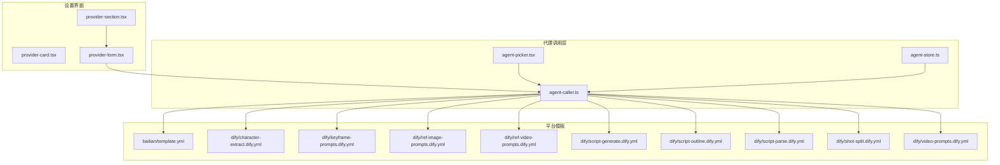
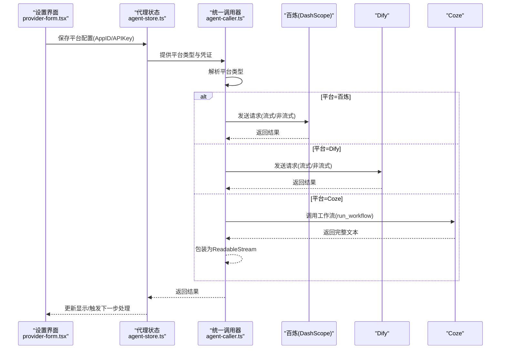
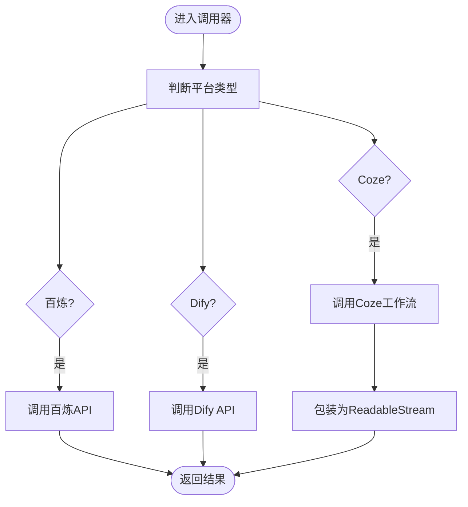
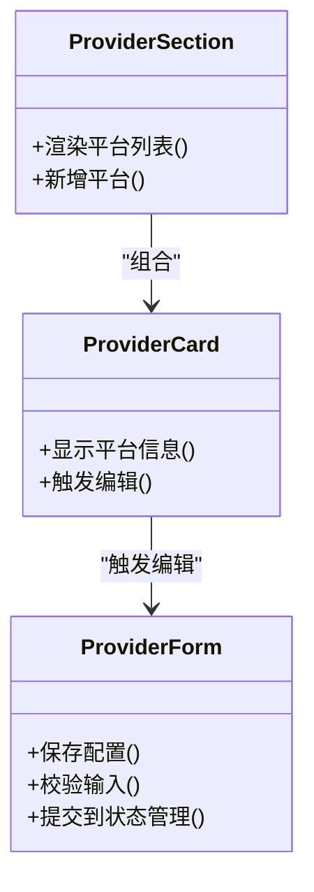
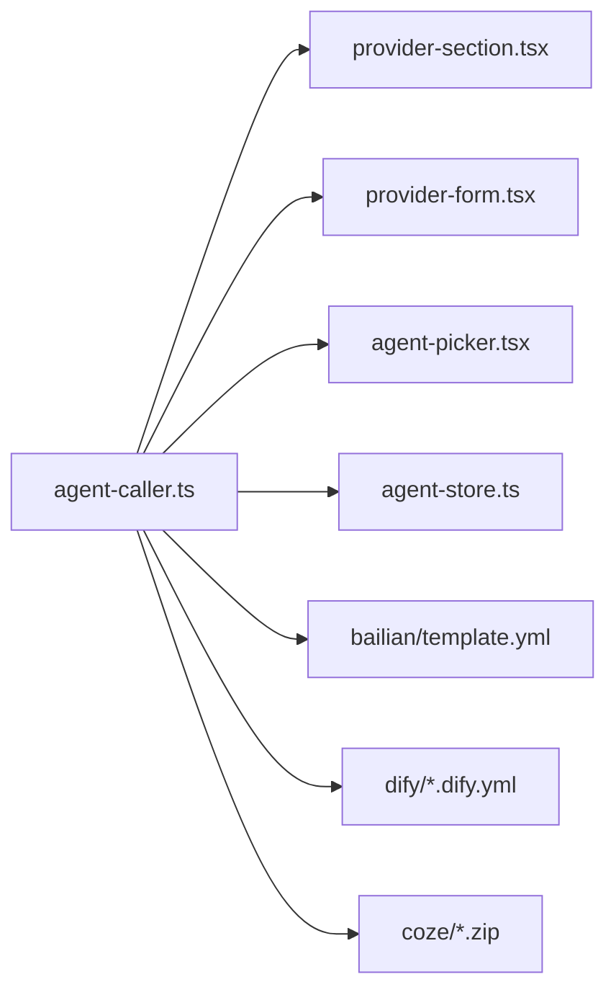
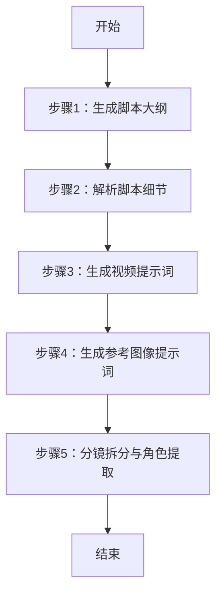

# 代理平台配置

<cite>
**本文档引用的文件**
- [agent-caller.ts](file://src/lib/ai/agent-caller.ts)
- [provider-section.tsx](file://src/components/settings/provider-section.tsx)
- [provider-card.tsx](file://src/components/settings/provider-card.tsx)
- [provider-form.tsx](file://src/components/settings/provider-form.tsx)
- [agent-picker.tsx](file://src/components/agent-picker.tsx)
- [agent-store.ts](file://src/stores/agent-store.ts)
- [template.yml](file://agents/bailian/template.yml)
- [character-extract.dify.yml](file://agents/dify/character-extract.dify.yml)
- [keyframe-prompts.dify.yml](file://agents/dify/keyframe-prompts.dify.yml)
- [ref-image-prompts.dify.yml](file://agents/dify/ref-image-prompts.dify.yml)
- [ref-video-prompts.dify.yml](file://agents/dify/ref-video-prompts.dify.yml)
- [script-generate.dify.yml](file://agents/dify/script-generate.dify.yml)
- [script-outline.dify.yml](file://agents/dify/script-outline.dify.yml)
- [script-parse.dify.yml](file://agents/dify/script-parse.dify.yml)
- [shot-split.dify.yml](file://agents/dify/shot-split.dify.yml)
- [video-prompts.dify.yml](file://agents/dify/video-prompts.dify.yml)
</cite>

## 目录
1. [简介](#简介)
2. [项目结构](#项目结构)
3. [核心组件](#核心组件)
4. [架构总览](#架构总览)
5. [详细组件分析](#详细组件分析)
6. [依赖关系分析](#依赖关系分析)
7. [性能考虑](#性能考虑)
8. [故障排除指南](#故障排除指南)
9. [结论](#结论)
10. [附录](#附录)

## 简介
本文件面向AIComicBuilder的代理平台配置，系统性说明如何在Dify、百炼（Bailian）、Coze等平台上完成智能体配置与调用，并解释统一代理调用机制、模板管理与参数传递流程。文档同时提供各平台特点、优势与适用场景、最佳实践与安全注意事项，以及通过代理平台实现复杂AI工作流与多步骤处理的方法。

## 项目结构
代理相关代码主要分布在以下位置：
- 统一代理调用层：src/lib/ai/agent-caller.ts
- 设置界面与表单：src/components/settings/
- 代理选择器：src/components/agent-picker.tsx
- 代理状态管理：src/stores/agent-store.ts
- 平台模板资源：agents/{bailian,dify,coze}/

**图表来源**
- [agent-caller.ts:1-209](file://src/lib/ai/agent-caller.ts#L1-L209)
- [provider-section.tsx](file://src/components/settings/provider-section.tsx)
- [provider-card.tsx](file://src/components/settings/provider-card.tsx)
- [provider-form.tsx](file://src/components/settings/provider-form.tsx)
- [agent-picker.tsx](file://src/components/agent-picker.tsx)
- [agent-store.ts](file://src/stores/agent-store.ts)
- [template.yml](file://agents/bailian/template.yml)
- [character-extract.dify.yml](file://agents/dify/character-extract.dify.yml)
- [keyframe-prompts.dify.yml](file://agents/dify/keyframe-prompts.dify.yml)
- [ref-image-prompts.dify.yml](file://agents/dify/ref-image-prompts.dify.yml)
- [ref-video-prompts.dify.yml](file://agents/dify/ref-video-prompts.dify.yml)
- [script-generate.dify.yml](file://agents/dify/script-generate.dify.yml)
- [script-outline.dify.yml](file://agents/dify/script-outline.dify.yml)
- [script-parse.dify.yml](file://agents/dify/script-parse.dify.yml)
- [shot-split.dify.yml](file://agents/dify/shot-split.dify.yml)
- [video-prompts.dify.yml](file://agents/dify/video-prompts.dify.yml)

**章节来源**
- [agent-caller.ts:1-209](file://src/lib/ai/agent-caller.ts#L1-L209)
- [provider-section.tsx](file://src/components/settings/provider-section.tsx)
- [provider-card.tsx](file://src/components/settings/provider-card.tsx)
- [provider-form.tsx](file://src/components/settings/provider-form.tsx)
- [agent-picker.tsx](file://src/components/agent-picker.tsx)
- [agent-store.ts](file://src/stores/agent-store.ts)
- [template.yml](file://agents/bailian/template.yml)
- [character-extract.dify.yml](file://agents/dify/character-extract.dify.yml)
- [keyframe-prompts.dify.yml](file://agents/dify/keyframe-prompts.dify.yml)
- [ref-image-prompts.dify.yml](file://agents/dify/ref-image-prompts.dify.yml)
- [ref-video-prompts.dify.yml](file://agents/dify/ref-video-prompts.dify.yml)
- [script-generate.dify.yml](file://agents/dify/script-generate.dify.yml)
- [script-outline.dify.yml](file://agents/dify/script-outline.dify.yml)
- [script-parse.dify.yml](file://agents/dify/script-parse.dify.yml)
- [shot-split.dify.yml](file://agents/dify/shot-split.dify.yml)
- [video-prompts.dify.yml](file://agents/dify/video-prompts.dify.yml)

## 核心组件
- 统一代理调用器：封装了对百炼、Dify、Coze三个平台的统一调用接口，支持流式与非流式两种模式。
- 平台配置模型：定义了平台类型、应用ID与API密钥等必要字段。
- 模板资源：各平台的智能体模板文件，用于描述提示词、参数与执行逻辑。
- 设置界面与表单：提供平台添加、编辑、删除与密钥管理的用户界面。
- 代理选择器与状态：在UI中选择当前项目绑定的代理平台与应用。

**章节来源**
- [agent-caller.ts:4-32](file://src/lib/ai/agent-caller.ts#L4-L32)
- [agent-caller.ts:14-32](file://src/lib/ai/agent-caller.ts#L14-L32)
- [agent-caller.ts:170-181](file://src/lib/ai/agent-caller.ts#L170-L181)
- [provider-form.tsx](file://src/components/settings/provider-form.tsx)
- [agent-picker.tsx](file://src/components/agent-picker.tsx)
- [agent-store.ts](file://src/stores/agent-store.ts)

## 架构总览
下图展示了从设置界面到代理调用层，再到各平台API的整体调用链路与数据流。

**图表来源**
- [agent-caller.ts:14-32](file://src/lib/ai/agent-caller.ts#L14-L32)
- [agent-caller.ts:170-181](file://src/lib/ai/agent-caller.ts#L170-L181)
- [provider-form.tsx](file://src/components/settings/provider-form.tsx)
- [agent-store.ts](file://src/stores/agent-store.ts)

## 详细组件分析

### 统一代理调用器（agent-caller.ts）
- 支持平台类型：百炼（bailian）、Dify（dify）、Coze（coze）。
- 流式调用：callAgentStream返回可读流，适用于实时输出与进度反馈。
- 非流式调用：callAgent返回完整字符串，适用于一次性结果。
- Coze特殊处理：由于run_workflow无原生SSE，采用全量文本包装为流的方式。
- 错误处理：遇到未知平台时抛出错误，便于上层捕获与提示。

**图表来源**
- [agent-caller.ts:14-32](file://src/lib/ai/agent-caller.ts#L14-L32)
- [agent-caller.ts:21-28](file://src/lib/ai/agent-caller.ts#L21-L28)

**章节来源**
- [agent-caller.ts:4-32](file://src/lib/ai/agent-caller.ts#L4-L32)
- [agent-caller.ts:14-32](file://src/lib/ai/agent-caller.ts#L14-L32)
- [agent-caller.ts:170-181](file://src/lib/ai/agent-caller.ts#L170-L181)

### 百炼（Bailian/DashScope）集成
- 调用地址：基于DashScope的应用完成接口，使用Bearer Token进行鉴权。
- 请求体：包含输入提示词prompt与空参数对象。
- 响应结构：包含状态码、输出文本与结束原因等字段。
- 使用场景：适合稳定、低延迟的文本生成任务；与项目模板配合实现角色提取、分镜拆分等。

**章节来源**
- [agent-caller.ts:193-209](file://src/lib/ai/agent-caller.ts#L193-L209)
- [agent-caller.ts:184-191](file://src/lib/ai/agent-caller.ts#L184-L191)

### Dify集成
- 模板文件：提供脚本生成、大纲生成、解析、分镜拆分、提示词生成等模板。
- 调用方式：与百炼类似，通过统一调用器进行请求转发。
- 适用场景：需要结构化提示词工程与多步骤工作流的任务，如视频提示词生成、参考图像提示词等。

**章节来源**
- [character-extract.dify.yml](file://agents/dify/character-extract.dify.yml)
- [script-generate.dify.yml](file://agents/dify/script-generate.dify.yml)
- [script-outline.dify.yml](file://agents/dify/script-outline.dify.yml)
- [script-parse.dify.yml](file://agents/dify/script-parse.dify.yml)
- [shot-split.dify.yml](file://agents/dify/shot-split.dify.yml)
- [video-prompts.dify.yml](file://agents/dify/video-prompts.dify.yml)
- [keyframe-prompts.dify.yml](file://agents/dify/keyframe-prompts.dify.yml)
- [ref-image-prompts.dify.yml](file://agents/dify/ref-image-prompts.dify.yml)
- [ref-video-prompts.dify.yml](file://agents/dify/ref-video-prompts.dify.yml)

### Coze集成
- 工作流调用：通过run_workflow接口提交任务，返回完整文本。
- 流式兼容：由于平台不支持原生SSE，统一调用器将结果包装为ReadableStream以保持接口一致性。
- 适用场景：需要可视化工作流编排与多节点协作的任务。

**章节来源**
- [agent-caller.ts:21-28](file://src/lib/ai/agent-caller.ts#L21-L28)

### 设置界面与表单
- provider-section.tsx：聚合平台配置入口，展示可用平台列表。
- provider-card.tsx：单个平台卡片，支持查看与编辑配置。
- provider-form.tsx：表单组件，负责收集AppID与APIKey并保存至状态管理。

**图表来源**
- [provider-section.tsx](file://src/components/settings/provider-section.tsx)
- [provider-card.tsx](file://src/components/settings/provider-card.tsx)
- [provider-form.tsx](file://src/components/settings/provider-form.tsx)

**章节来源**
- [provider-section.tsx](file://src/components/settings/provider-section.tsx)
- [provider-card.tsx](file://src/components/settings/provider-card.tsx)
- [provider-form.tsx](file://src/components/settings/provider-form.tsx)

### 代理选择器与状态管理
- agent-picker.tsx：在项目层面选择当前使用的代理平台与应用。
- agent-store.ts：集中管理代理配置、当前选中项与全局状态更新。

**章节来源**
- [agent-picker.tsx](file://src/components/agent-picker.tsx)
- [agent-store.ts](file://src/stores/agent-store.ts)

## 依赖关系分析
- 调用器依赖于平台模板与凭证配置，通过统一接口屏蔽平台差异。
- 设置界面与状态管理为调用器提供运行时参数。
- 各平台模板文件作为外部资源存在，调用器按需加载或由前端上传后使用。

**图表来源**
- [agent-caller.ts:1-209](file://src/lib/ai/agent-caller.ts#L1-L209)
- [provider-section.tsx](file://src/components/settings/provider-section.tsx)
- [provider-form.tsx](file://src/components/settings/provider-form.tsx)
- [agent-picker.tsx](file://src/components/agent-picker.tsx)
- [agent-store.ts](file://src/stores/agent-store.ts)
- [template.yml](file://agents/bailian/template.yml)
- [character-extract.dify.yml](file://agents/dify/character-extract.dify.yml)
- [script-generate.dify.yml](file://agents/dify/script-generate.dify.yml)
- [script-outline.dify.yml](file://agents/dify/script-outline.dify.yml)
- [script-parse.dify.yml](file://agents/dify/script-parse.dify.yml)
- [shot-split.dify.yml](file://agents/dify/shot-split.dify.yml)
- [video-prompts.dify.yml](file://agents/dify/video-prompts.dify.yml)
- [keyframe-prompts.dify.yml](file://agents/dify/keyframe-prompts.dify.yml)
- [ref-image-prompts.dify.yml](file://agents/dify/ref-image-prompts.dify.yml)
- [ref-video-prompts.dify.yml](file://agents/dify/ref-video-prompts.dify.yml)

**章节来源**
- [agent-caller.ts:1-209](file://src/lib/ai/agent-caller.ts#L1-L209)

## 性能考虑
- 流式输出优先：在支持SSE的平台（百炼、Dify）上使用流式接口，提升交互体验与首字节时间。
- Coze回退策略：当平台不支持SSE时，统一包装为ReadableStream，避免上层逻辑分支。
- 模板复用：通过共享模板减少重复请求与参数构造成本。
- 连接池与重试：建议在生产环境为第三方API配置合理的超时、重试与并发限制（可在调用器外层封装）。

## 故障排除指南
- 平台类型错误：当传入未知平台类型时会抛错，检查前端选择器与状态管理中的平台字段。
- 认证失败：百炼使用Bearer Token鉴权，确认API Key正确且未过期；Dify与Coze同样需要有效凭据。
- Coze无SSE：若出现无法实时流式输出，请确认已使用统一调用器的回退包装逻辑。
- 模板缺失：确保对应平台模板文件存在且路径正确，以便前端能够加载与使用。

**章节来源**
- [agent-caller.ts:29-31](file://src/lib/ai/agent-caller.ts#L29-L31)
- [agent-caller.ts:193-209](file://src/lib/ai/agent-caller.ts#L193-L209)

## 结论
通过统一代理调用器与平台模板资源，AIComicBuilder实现了对百炼、Dify、Coze的无缝集成。该架构既保证了跨平台一致性，又保留了各平台的特性与优势。结合设置界面与状态管理，用户可以灵活地配置与切换代理平台，构建从脚本生成到分镜拆分的完整AI工作流。

## 附录

### 平台对比与适用场景
- 百炼（DashScope）
  - 特点：稳定的文本生成能力，低延迟，易于集成。
  - 适用：角色提取、分镜拆分、基础提示词生成等常规任务。
- Dify
  - 特点：模板化工作流，结构化提示词工程，适合复杂多步骤任务。
  - 适用：脚本生成/解析、视频提示词工程、参考素材提示词生成。
- Coze
  - 特点：可视化工作流编排，多节点协作。
  - 适用：需要多步骤串联与条件控制的复杂流程。

### 最佳实践
- 凭证管理：将API Key存储在受控环境中，避免硬编码；在设置界面中提供加密存储选项。
- 参数传递：尽量复用模板中的参数结构，减少自定义字段，提高可维护性。
- 错误处理：在调用器外层增加统一的错误捕获与重试逻辑。
- 安全考虑：限制API Key权限范围，定期轮换；对敏感日志进行脱敏处理。

### 多步骤工作流示例（概念）
