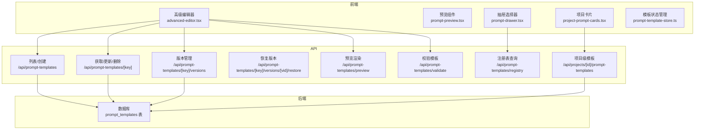
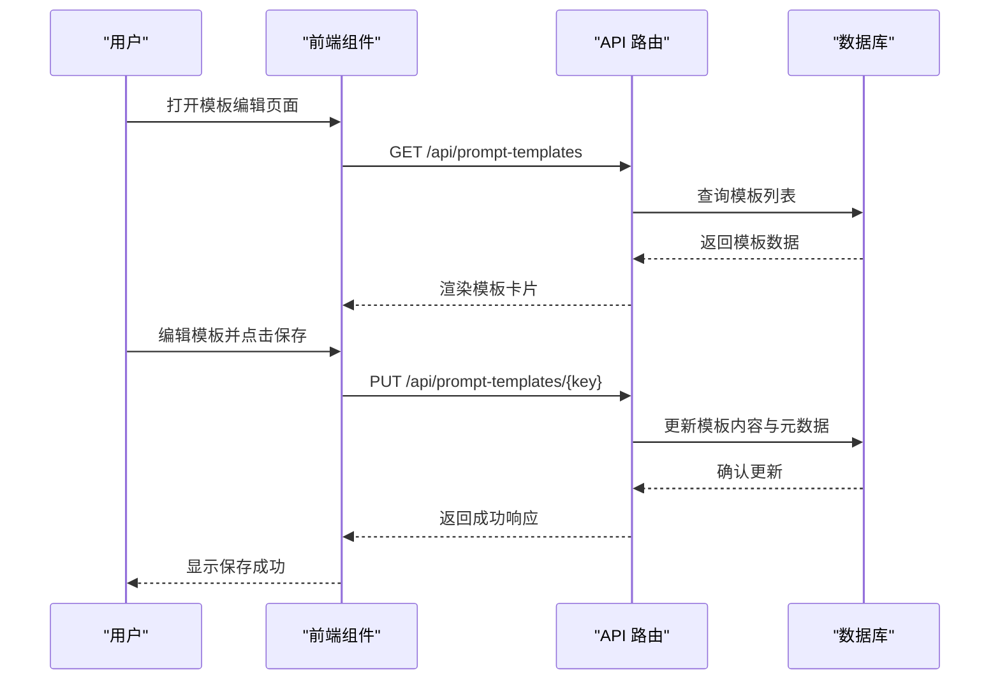
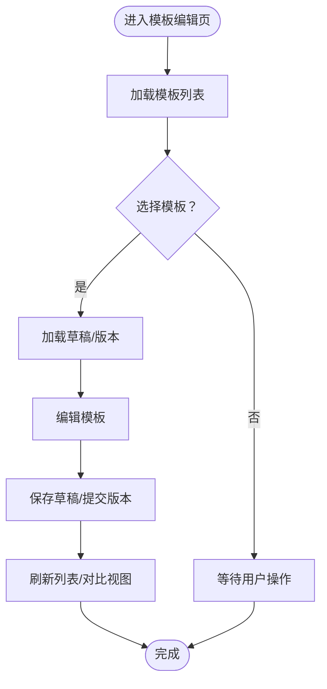
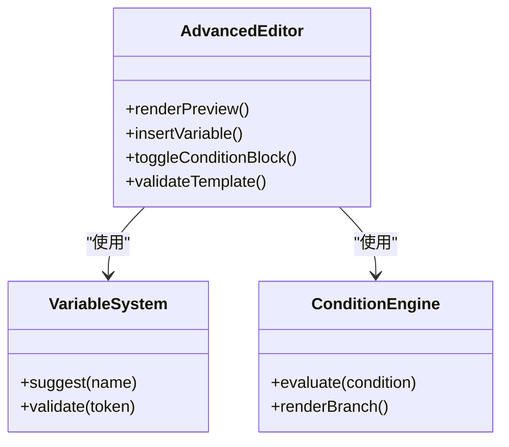
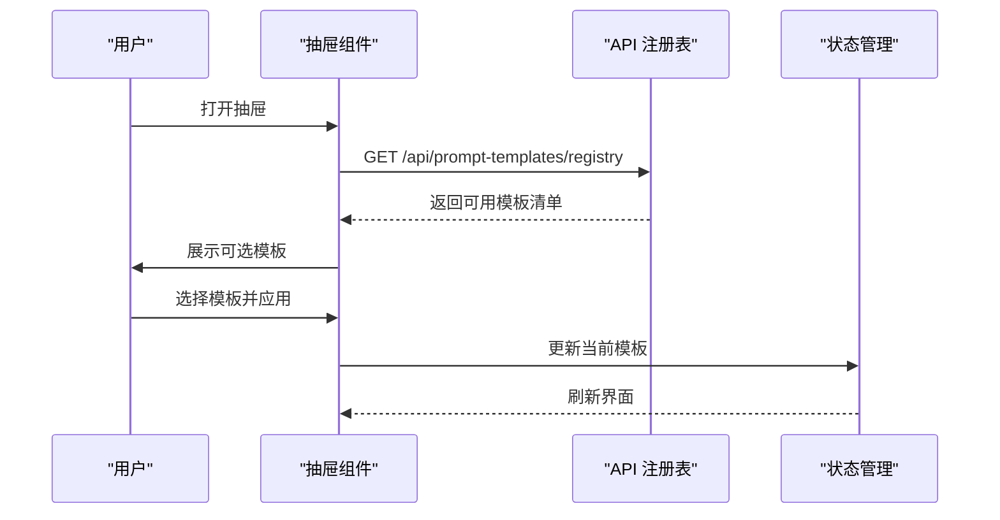
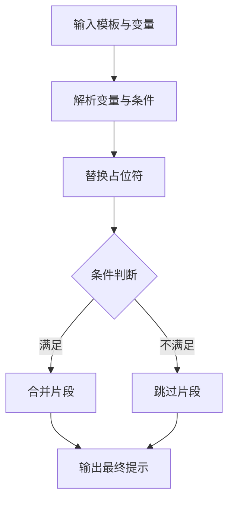
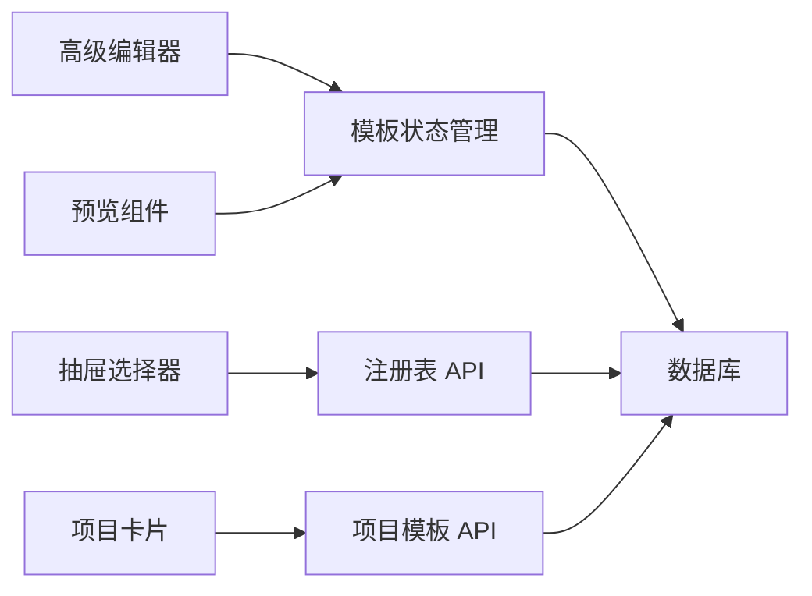
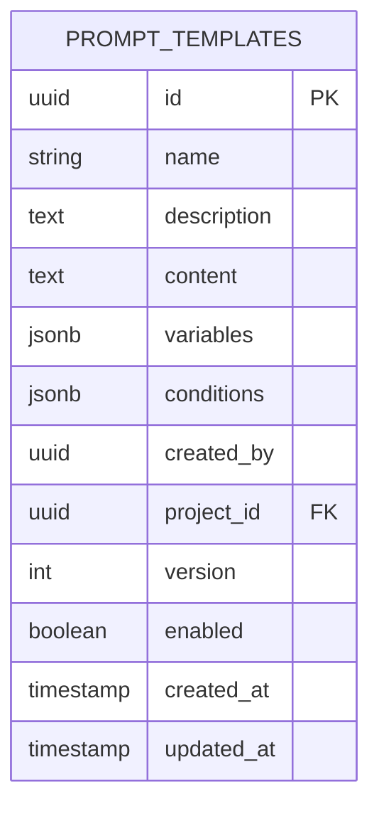
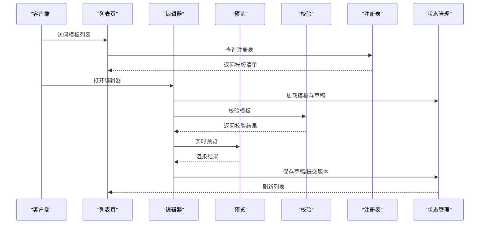

# 提示模板系统

<cite>
**本文档引用的文件**
- [prompt-template-store.ts](file://src/stores/prompt-template-store.ts)
- [advanced-editor.tsx](file://src/components/prompt-templates/advanced-editor.tsx)
- [preset-dialog.tsx](file://src/components/prompt-templates/preset-dialog.tsx)
- [project-prompt-cards.tsx](file://src/components/prompt-templates/project-prompt-cards.tsx)
- [prompt-drawer.tsx](file://src/components/prompt-templates/prompt-drawer.tsx)
- [prompt-edit-button.tsx](file://src/components/prompt-templates/prompt-edit-button.tsx)
- [prompt-editor.tsx](file://src/components/prompt-templates/prompt-editor.tsx)
- [prompt-preview.tsx](file://src/components/prompt-templates/prompt-preview.tsx)
- [slot-list.tsx](file://src/components/prompt-templates/slot-list.tsx)
- [route.ts](file://src/app/api/prompt-templates/route.ts)
- [route.ts](file://src/app/api/prompt-templates/[promptKey]/route.ts)
- [route.ts](file://src/app/api/prompt-templates/[promptKey]/versions/route.ts)
- [route.ts](file://src/app/api/prompt-templates/[promptKey]/versions/[vid]/restore/route.ts)
- [route.ts](file://src/app/api/prompt-templates/preview/route.ts)
- [route.ts](file://src/app/api/prompt-templates/registry/route.ts)
- [route.ts](file://src/app/api/prompt-templates/validate/route.ts)
- [route.ts](file://src/app/api/projects/[id]/prompt-templates/route.ts)
- [route.ts](file://src/app/api/projects/[id]/prompt-templates/[promptKey]/route.ts)
- [page.tsx](file://src/app/[locale]/project/[id]/prompts/page.tsx)
- [page.tsx](file://src/app/[locale]/settings/prompts/page.tsx)
- [0014_add_prompt_templates.sql](file://drizzle/migrations/0014_add_prompt_templates.sql)
- [0015_add_use_project_prompts.sql](file://drizzle/migrations/0015_add_use_project_prompts.sql)
- [template.yml](file://agents/bailian/template.yml)
- [character-extract.dify.yml](file://agents/dify/character-extract.dify.yml)
- [script-generate.dify.yml](file://agents/dify/script-generate.dify.yml)
- [video-prompts.dify.yml](file://agents/dify/video-prompts.dify.yml)
</cite>

## 目录
1. [简介](#简介)
2. [项目结构](#项目结构)
3. [核心组件](#核心组件)
4. [架构总览](#架构总览)
5. [详细组件分析](#详细组件分析)
6. [依赖关系分析](#依赖关系分析)
7. [性能考虑](#性能考虑)
8. [故障排除指南](#故障排除指南)
9. [结论](#结论)
10. [附录](#附录)

## 简介
本文件系统性阐述 AIComicBuilder 的提示模板（Prompt Templates）设计与实现，覆盖模板设计理念、存储机制、版本管理、变量系统、条件逻辑、动态内容生成、调试与性能监控、模板库构建与共享、以及与 AI 提供商的集成映射。目标是帮助开发者与内容创作者高效地创建、维护与复用高质量提示模板，提升生成式内容的一致性与可控性。

## 项目结构
提示模板系统由前端组件层、状态管理层、API 层与数据库层共同组成：
- 前端组件：提供模板编辑、预览、抽屉式选择、预设对话框等交互能力
- 状态管理：集中管理模板数据、当前选中模板、版本对比等
- API 层：提供模板 CRUD、版本管理、预览、注册表查询、校验等功能接口
- 数据库层：通过迁移脚本定义模板表结构及项目级开关字段

**图表来源**
- [advanced-editor.tsx](file://src/components/prompt-templates/advanced-editor.tsx)
- [prompt-preview.tsx](file://src/components/prompt-templates/prompt-preview.tsx)
- [prompt-drawer.tsx](file://src/components/prompt-templates/prompt-drawer.tsx)
- [project-prompt-cards.tsx](file://src/components/prompt-templates/project-prompt-cards.tsx)
- [prompt-template-store.ts](file://src/stores/prompt-template-store.ts)
- [route.ts](file://src/app/api/prompt-templates/route.ts)
- [route.ts](file://src/app/api/prompt-templates/[promptKey]/route.ts)
- [route.ts](file://src/app/api/prompt-templates/[promptKey]/versions/route.ts)
- [route.ts](file://src/app/api/prompt-templates/[promptKey]/versions/[vid]/restore/route.ts)
- [route.ts](file://src/app/api/prompt-templates/preview/route.ts)
- [route.ts](file://src/app/api/prompt-templates/registry/route.ts)
- [route.ts](file://src/app/api/prompt-templates/validate/route.ts)
- [route.ts](file://src/app/api/projects/[id]/prompt-templates/route.ts)
- [route.ts](file://src/app/api/projects/[id]/prompt-templates/[promptKey]/route.ts)

**章节来源**
- [advanced-editor.tsx](file://src/components/prompt-templates/advanced-editor.tsx)
- [prompt-template-store.ts](file://src/stores/prompt-template-store.ts)
- [route.ts](file://src/app/api/prompt-templates/route.ts)
- [route.ts](file://src/app/api/projects/[id]/prompt-templates/route.ts)

## 核心组件
- 模板状态管理：集中处理模板加载、切换、版本对比、草稿保存等
- 高级编辑器：支持变量占位符、条件块、动态内容拼接与实时预览
- 抽屉选择器：在项目内快速浏览与选择可用模板
- 预览组件：将变量与上下文代入模板，输出可执行的提示文本
- 预设对话框：批量应用预设配置到模板
- 版本管理：记录模板变更历史，支持回滚与对比

**章节来源**
- [prompt-template-store.ts](file://src/stores/prompt-template-store.ts)
- [advanced-editor.tsx](file://src/components/prompt-templates/advanced-editor.tsx)
- [prompt-drawer.tsx](file://src/components/prompt-templates/prompt-drawer.tsx)
- [prompt-preview.tsx](file://src/components/prompt-templates/prompt-preview.tsx)
- [preset-dialog.tsx](file://src/components/prompt-templates/preset-dialog.tsx)

## 架构总览
提示模板系统采用前后端分离的分层架构：
- 前端负责用户交互与模板编辑体验
- 后端提供 RESTful API，统一处理模板的增删改查、版本控制与校验
- 数据库存储模板元数据与内容，配合项目级开关实现模板共享与继承

**图表来源**
- [route.ts](file://src/app/api/prompt-templates/[promptKey]/route.ts)
- [route.ts](file://src/app/api/prompt-templates/route.ts)

## 详细组件分析

### 模板状态管理（Store）
- 职责：维护当前模板、草稿、版本列表、对比视图、错误状态
- 关键能力：模板切换、版本对比、本地草稿持久化、批量操作
- 性能：基于轻量状态更新，避免不必要的重渲染

**图表来源**
- [prompt-template-store.ts](file://src/stores/prompt-template-store.ts)

**章节来源**
- [prompt-template-store.ts](file://src/stores/prompt-template-store.ts)

### 高级编辑器（Advanced Editor）
- 变量系统：支持占位符语法，自动补全与类型提示
- 条件逻辑：允许嵌套条件块，按上下文动态启用/禁用片段
- 动态内容：根据场景、角色、镜头等上下文生成差异化提示
- 实时预览：边编辑边渲染，便于快速验证效果

**图表来源**
- [advanced-editor.tsx](file://src/components/prompt-templates/advanced-editor.tsx)

**章节来源**
- [advanced-editor.tsx](file://src/components/prompt-templates/advanced-editor.tsx)

### 抽屉选择器（Prompt Drawer）
- 功能：在项目内快速筛选、搜索与选择模板
- 交互：支持拖拽排序、一键应用、批量导入导出
- 集成：与注册表 API 对接，支持跨项目模板共享

**图表来源**
- [prompt-drawer.tsx](file://src/components/prompt-templates/prompt-drawer.tsx)
- [route.ts](file://src/app/api/prompt-templates/registry/route.ts)

**章节来源**
- [prompt-drawer.tsx](file://src/components/prompt-templates/prompt-drawer.tsx)
- [route.ts](file://src/app/api/prompt-templates/registry/route.ts)

### 预览组件（Prompt Preview）
- 输入：模板文本 + 上下文变量集合
- 处理：变量替换、条件分支渲染、片段拼接
- 输出：最终提示文本，支持复制与下载

**图表来源**
- [prompt-preview.tsx](file://src/components/prompt-templates/prompt-preview.tsx)

**章节来源**
- [prompt-preview.tsx](file://src/components/prompt-templates/prompt-preview.tsx)

### 项目级模板卡片（Project Prompt Cards）
- 展示：项目内可用模板、最近修改时间、使用频率
- 操作：一键应用、复制模板、切换项目级开关
- 继承：支持从全局模板继承并进行项目定制

**章节来源**
- [project-prompt-cards.tsx](file://src/components/prompt-templates/project-prompt-cards.tsx)

### 预设对话框（Preset Dialog）
- 功能：将一组预设参数注入模板变量，快速生成不同风格的提示
- 应用：适用于多风格角色设定、场景氛围、镜头语言等

**章节来源**
- [preset-dialog.tsx](file://src/components/prompt-templates/preset-dialog.tsx)

### 模板编辑按钮（Edit Button）
- 触发：在项目或设置页面打开模板编辑器
- 权限：结合项目所有权与角色控制访问

**章节来源**
- [prompt-edit-button.tsx](file://src/components/prompt-templates/prompt-edit-button.tsx)

### 模板编辑器（Editor）
- 基础功能：文本编辑、撤销重做、语法高亮
- 高级功能：变量插入器、条件块编辑器、版本对比面板

**章节来源**
- [prompt-editor.tsx](file://src/components/prompt-templates/prompt-editor.tsx)

### 插槽列表（Slot List）
- 作用：定义模板中的可插拔片段，支持模块化组合
- 优势：提高模板复用性，降低重复编写成本

**章节来源**
- [slot-list.tsx](file://src/components/prompt-templates/slot-list.tsx)

## 依赖关系分析
- 组件耦合：编辑器与状态管理强耦合，抽屉与注册表 API 弱耦合
- 外部依赖：API 路由依赖数据库；前端组件依赖状态管理与路由
- 循环依赖：无明显循环，职责边界清晰

**图表来源**
- [advanced-editor.tsx](file://src/components/prompt-templates/advanced-editor.tsx)
- [prompt-template-store.ts](file://src/stores/prompt-template-store.ts)
- [prompt-drawer.tsx](file://src/components/prompt-templates/prompt-drawer.tsx)
- [route.ts](file://src/app/api/prompt-templates/registry/route.ts)
- [route.ts](file://src/app/api/projects/[id]/prompt-templates/route.ts)

**章节来源**
- [prompt-template-store.ts](file://src/stores/prompt-template-store.ts)
- [route.ts](file://src/app/api/prompt-templates/registry/route.ts)
- [route.ts](file://src/app/api/projects/[id]/prompt-templates/route.ts)

## 性能考虑
- 渲染优化：编辑器采用虚拟滚动与增量渲染，减少大模板的重绘
- 预览延迟：预览计算加入防抖，避免频繁触发
- 缓存策略：已渲染的预览结果缓存于内存，支持快速切换
- 数据传输：API 分页返回模板列表，按需加载版本详情
- 并发控制：同一模板的多次保存合并为一次请求，避免冲突

## 故障排除指南
- 模板校验失败
  - 现象：保存时报错，提示变量缺失或语法错误
  - 排查：检查变量占位符是否闭合，条件块是否匹配
  - 处置：使用校验接口定位问题，修复后重试
- 预览为空
  - 现象：预览区域显示空白
  - 排查：确认变量是否已赋值，条件分支是否被过滤
  - 处置：补充变量或调整条件逻辑
- 版本回滚异常
  - 现象：无法恢复到指定版本
  - 排查：检查版本号是否存在，是否被删除
  - 处置：重新创建版本或联系管理员
- 项目模板不可见
  - 现象：项目内看不到模板
  - 排查：检查项目级开关是否开启
  - 处置：在项目设置中启用模板共享

**章节来源**
- [route.ts](file://src/app/api/prompt-templates/validate/route.ts)
- [route.ts](file://src/app/api/prompt-templates/[promptKey]/versions/[vid]/restore/route.ts)
- [0015_add_use_project_prompts.sql](file://drizzle/migrations/0015_add_use_project_prompts.sql)

## 结论
提示模板系统通过“状态管理 + 组件化编辑 + API 驱动 + 数据持久化”的架构，实现了模板的高效创建、灵活编辑、版本控制与跨项目共享。建议在实际使用中遵循变量命名规范、模块化拆分、条件逻辑最小化与持续校验的原则，以获得更稳定与可维护的模板体系。

## 附录

### 数据模型与表结构
- 表名：prompt_templates
- 字段概要：主键、名称、描述、内容、变量定义、条件规则、创建者、所属项目、版本号、是否启用、创建/更新时间
- 项目级开关：use_project_prompts 控制是否启用项目级模板共享

**图表来源**
- [0014_add_prompt_templates.sql](file://drizzle/migrations/0014_add_prompt_templates.sql)
- [0015_add_use_project_prompts.sql](file://drizzle/migrations/0015_add_use_project_prompts.sql)

### API 定义与流程
- 获取模板列表：GET /api/prompt-templates
- 创建模板：POST /api/prompt-templates
- 获取/更新/删除模板：GET/PUT/DELETE /api/prompt-templates/{promptKey}
- 版本管理：GET/POST /api/prompt-templates/{promptKey}/versions
- 恢复版本：POST /api/prompt-templates/{promptKey}/versions/{vid}/restore
- 预览渲染：POST /api/prompt-templates/preview
- 注册表查询：GET /api/prompt-templates/registry
- 校验模板：POST /api/prompt-templates/validate
- 项目级模板：GET/POST /api/projects/{id}/prompt-templates

**图表来源**
- [route.ts](file://src/app/api/prompt-templates/route.ts)
- [route.ts](file://src/app/api/prompt-templates/[promptKey]/route.ts)
- [route.ts](file://src/app/api/prompt-templates/preview/route.ts)
- [route.ts](file://src/app/api/prompt-templates/validate/route.ts)
- [route.ts](file://src/app/api/prompt-templates/registry/route.ts)
- [route.ts](file://src/app/api/projects/[id]/prompt-templates/route.ts)

### 模板变量系统与条件逻辑
- 变量系统
  - 占位符：以特定语法标识，支持类型与默认值
  - 自动补全：编辑时提供变量建议
  - 类型校验：运行时对变量进行类型与范围检查
- 条件逻辑
  - 块级条件：根据上下文启用/禁用片段
  - 嵌套条件：支持多层条件组合
  - 动态分支：依据变量值选择不同路径

**章节来源**
- [advanced-editor.tsx](file://src/components/prompt-templates/advanced-editor.tsx)
- [prompt-preview.tsx](file://src/components/prompt-templates/prompt-preview.tsx)

### 与 AI 提供商的集成
- Bailian 模板：提供基础提示模板样例，适配特定模型参数
- Dify 模板：涵盖角色提取、脚本生成、视频提示等专用模板
- 参数映射：将模板变量映射到各提供商的参数键，确保兼容性

**章节来源**
- [template.yml](file://agents/bailian/template.yml)
- [character-extract.dify.yml](file://agents/dify/character-extract.dify.yml)
- [script-generate.dify.yml](file://agents/dify/script-generate.dify.yml)
- [video-prompts.dify.yml](file://agents/dify/video-prompts.dify.yml)

### 模板优化策略与最佳实践
- 结构化设计：将复杂提示拆分为多个插槽，提升复用率
- 变量命名：采用语义化命名，明确变量用途与取值范围
- 条件最小化：尽量减少深层嵌套，提高可读性与可维护性
- 版本治理：每次重大修改创建新版本，保留历史记录
- 共享与继承：优先在项目内继承全局模板，再进行局部定制
- 测试驱动：通过预览与校验保证模板质量，建立回归测试

### 模板调试方法、性能监控与效果评估
- 调试方法
  - 使用预览接口逐步验证变量替换与条件分支
  - 通过版本对比快速定位问题引入点
  - 在不同上下文场景下进行 A/B 验证
- 性能监控
  - 监控预览渲染耗时与内存占用
  - 统计模板使用频率与成功率
- 效果评估
  - 建立模板评分体系（一致性、可读性、效果指标）
  - 收集用户反馈，持续迭代优化