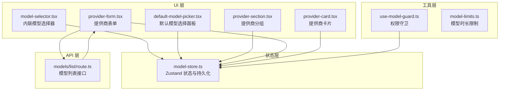
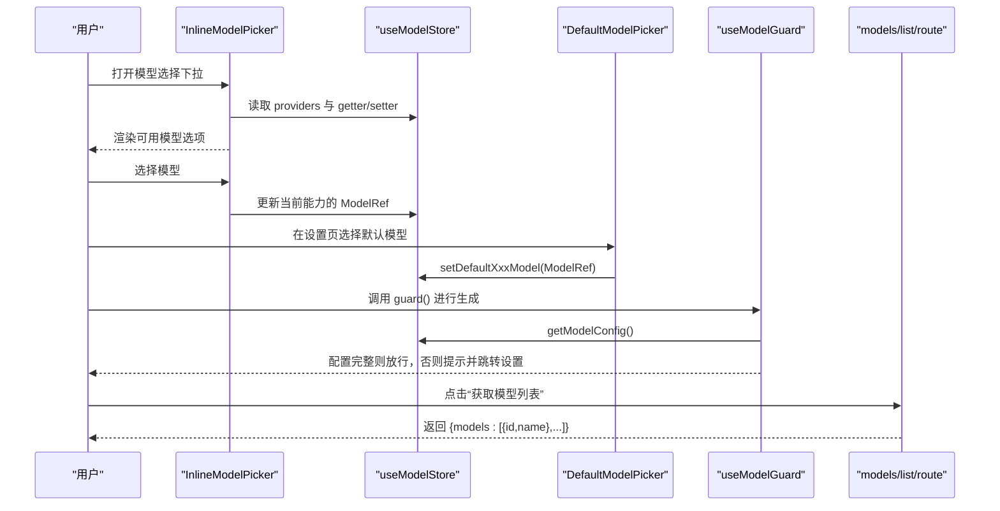
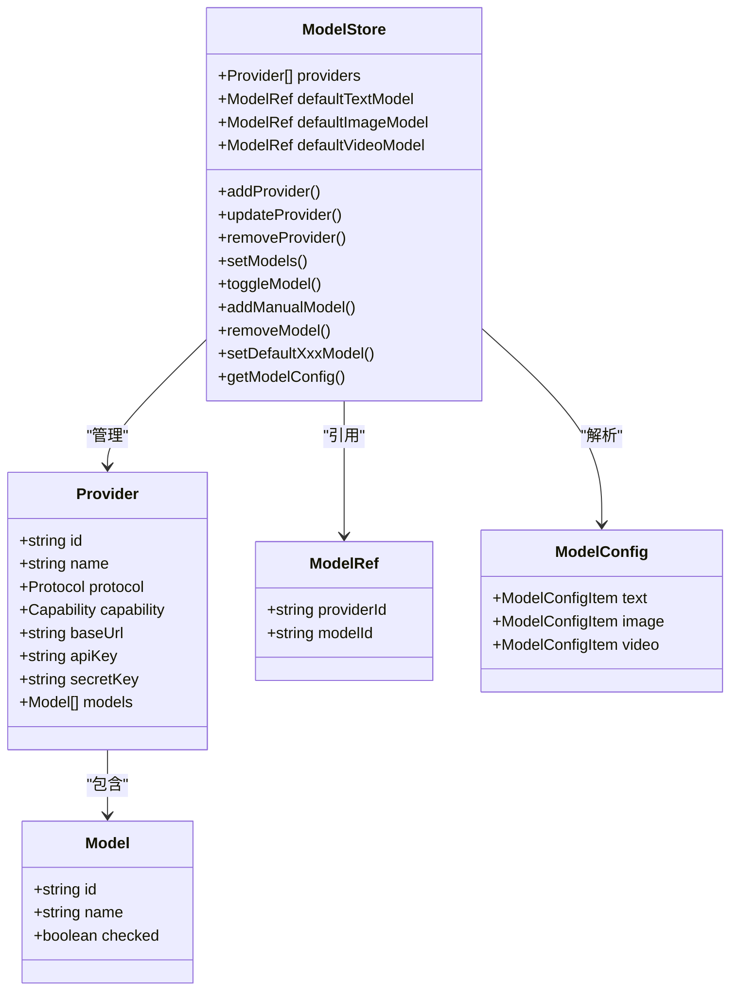
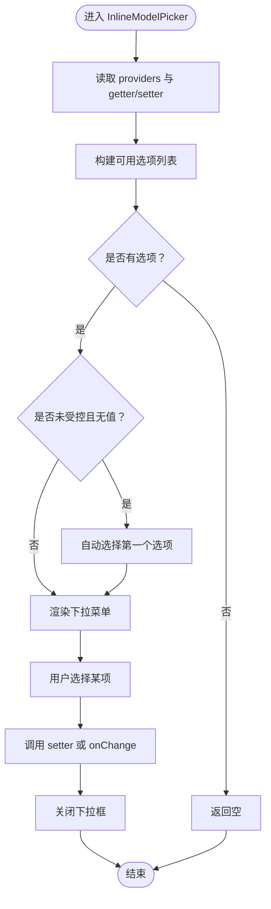
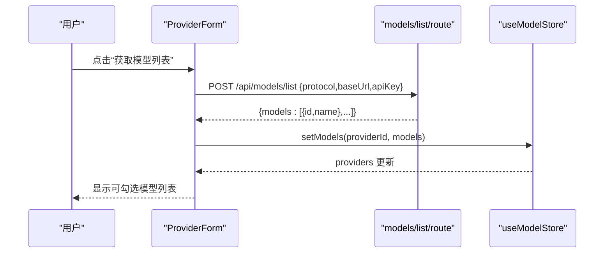
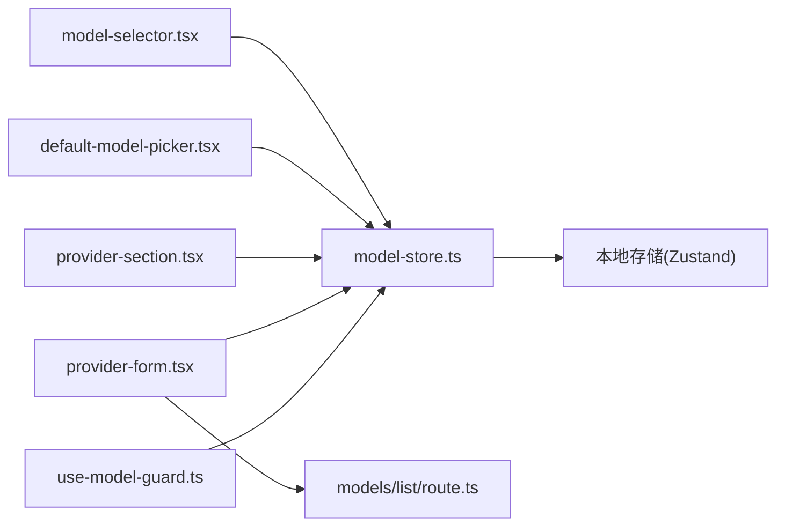

# 模型配置管理

<cite>
**本文档引用的文件**
- [model-store.ts](file://src/stores/model-store.ts)
- [model-selector.tsx](file://src/components/editor/model-selector.tsx)
- [default-model-picker.tsx](file://src/components/settings/default-model-picker.tsx)
- [provider-section.tsx](file://src/components/settings/provider-section.tsx)
- [provider-form.tsx](file://src/components/settings/provider-form.tsx)
- [provider-card.tsx](file://src/components/settings/provider-card.tsx)
- [use-model-guard.ts](file://src/hooks/use-model-guard.ts)
- [model-limits.ts](file://src/lib/ai/model-limits.ts)
- [route.ts](file://src/app/api/models/list/route.ts)
</cite>

## 目录
1. [简介](#简介)
2. [项目结构](#项目结构)
3. [核心组件](#核心组件)
4. [架构总览](#架构总览)
5. [详细组件分析](#详细组件分析)
6. [依赖关系分析](#依赖关系分析)
7. [性能考虑](#性能考虑)
8. [故障排除指南](#故障排除指南)
9. [结论](#结论)
10. [附录](#附录)

## 简介
本文件系统性阐述 AIComicBuilder 的模型配置管理体系，覆盖模型注册、配置与管理流程；默认模型选择机制、模型切换策略与版本控制；模型参数配置、性能优化与资源管理；模型缓存策略、预加载机制与内存管理；动态加载与卸载实现及权限控制；以及模型配置与项目设置的关系与继承机制。目标是帮助开发者与运营人员在不深入源码的前提下，理解并高效使用模型配置能力。

## 项目结构
模型配置相关代码主要分布在以下模块：
- 状态层：模型状态与持久化（Zustand）
- UI 层：模型选择器、默认模型选择面板、提供商配置界面
- 工具层：模型限制查询、权限守卫
- API 层：模型列表获取接口

图表来源
- [model-store.ts:1-198](file://src/stores/model-store.ts#L1-L198)
- [model-selector.tsx:31-104](file://src/components/editor/model-selector.tsx#L31-L104)
- [default-model-picker.tsx:71-134](file://src/components/settings/default-model-picker.tsx#L71-L134)
- [provider-section.tsx:19-42](file://src/components/settings/provider-section.tsx#L19-L42)
- [provider-form.tsx:66-104](file://src/components/settings/provider-form.tsx#L66-L104)
- [provider-card.tsx:14-20](file://src/components/settings/provider-card.tsx#L14-L20)
- [use-model-guard.ts:22-50](file://src/hooks/use-model-guard.ts#L22-L50)
- [model-limits.ts:38-63](file://src/lib/ai/model-limits.ts#L38-L63)
- [route.ts:122-138](file://src/app/api/models/list/route.ts#L122-L138)

章节来源
- [model-store.ts:1-198](file://src/stores/model-store.ts#L1-L198)
- [model-selector.tsx:31-104](file://src/components/editor/model-selector.tsx#L31-L104)
- [default-model-picker.tsx:71-134](file://src/components/settings/default-model-picker.tsx#L71-L134)
- [provider-section.tsx:19-42](file://src/components/settings/provider-section.tsx#L19-L42)
- [provider-form.tsx:66-104](file://src/components/settings/provider-form.tsx#L66-L104)
- [provider-card.tsx:14-20](file://src/components/settings/provider-card.tsx#L14-L20)
- [use-model-guard.ts:22-50](file://src/hooks/use-model-guard.ts#L22-L50)
- [model-limits.ts:38-63](file://src/lib/ai/model-limits.ts#L38-L63)
- [route.ts:122-138](file://src/app/api/models/list/route.ts#L122-L138)

## 核心组件
- 模型状态与持久化：统一管理提供商、模型、默认模型引用，并通过本地持久化确保跨会话一致性。
- 模型选择器：按能力维度（文本/图像/视频）筛选可用模型，支持自动选择与外部受控模式。
- 默认模型选择面板：为每种能力设置全局默认模型，便于生成流程快速调用。
- 提供商配置：支持添加/删除提供商、拉取模型列表、手动添加模型、勾选启用模型。
- 权限守卫：在执行 AI 生成前检查模型配置是否完整，缺失时提示跳转设置。
- 模型限制：根据模型 ID 推断最大支持视频时长，保障生成参数合理性。
- 模型列表 API：对接不同协议提供商，返回可用模型清单。

章节来源
- [model-store.ts:36-53](file://src/stores/model-store.ts#L36-L53)
- [model-selector.tsx:37-104](file://src/components/editor/model-selector.tsx#L37-L104)
- [default-model-picker.tsx:71-134](file://src/components/settings/default-model-picker.tsx#L71-L134)
- [provider-section.tsx:19-42](file://src/components/settings/provider-section.tsx#L19-L42)
- [provider-form.tsx:66-104](file://src/components/settings/provider-form.tsx#L66-L104)
- [use-model-guard.ts:22-50](file://src/hooks/use-model-guard.ts#L22-L50)
- [model-limits.ts:38-63](file://src/lib/ai/model-limits.ts#L38-L63)
- [route.ts:122-138](file://src/app/api/models/list/route.ts#L122-L138)

## 架构总览
模型配置管理采用“状态驱动 + UI 组件 + API 协同”的分层设计：
- 状态层负责数据与逻辑，持久化到本地存储；
- UI 层通过状态选择器读写状态，完成用户交互；
- 工具层提供权限校验与业务规则（如模型时长限制）；
- API 层作为外部提供商的桥接，返回标准化模型清单。

图表来源
- [model-selector.tsx:37-104](file://src/components/editor/model-selector.tsx#L37-L104)
- [default-model-picker.tsx:71-134](file://src/components/settings/default-model-picker.tsx#L71-L134)
- [use-model-guard.ts:22-50](file://src/hooks/use-model-guard.ts#L22-L50)
- [route.ts:122-138](file://src/app/api/models/list/route.ts#L122-L138)

## 详细组件分析

### 状态与持久化（model-store）
- 数据结构
  - Provider：包含协议、能力、基础地址、密钥、模型数组等
  - Model：包含 id/name/checked 等字段
  - ModelRef：指向具体 Provider 下的模型
  - ModelConfig：按能力聚合的最终可执行配置
- 关键操作
  - 添加/更新/移除提供商
  - 设置/切换模型列表与勾选状态
  - 设置默认模型引用
  - 解析默认模型为可执行配置
- 版本迁移
  - 支持 capability 字段从 capabilities 数组迁移
  - 兼容无版本历史数据的合并

图表来源
- [model-store.ts:8-53](file://src/stores/model-store.ts#L8-L53)

章节来源
- [model-store.ts:36-163](file://src/stores/model-store.ts#L36-L163)
- [model-store.ts:168-194](file://src/stores/model-store.ts#L168-L194)

### 模型选择器（InlineModelPicker）
- 功能要点
  - 基于能力过滤提供商与模型
  - 自动选择首个可用模型（非受控模式）
  - 外部受控模式允许父组件直接传入/监听变更
  - 支持多提供商场景的标签展示
- 交互流程
  - 读取 providers 与 getter/setter
  - 计算可用选项并渲染
  - 选择后触发 setter 或外部 onChange

图表来源
- [model-selector.tsx:37-104](file://src/components/editor/model-selector.tsx#L37-L104)

章节来源
- [model-selector.tsx:37-104](file://src/components/editor/model-selector.tsx#L37-L104)

### 默认模型选择面板（DefaultModelPicker）
- 功能要点
  - 分别为文本/图像/视频三种能力提供下拉选择
  - 选项来自已勾选的模型集合
  - 支持清空默认模型（设为 null）
- 使用场景
  - 生成流程中无需每次都弹出选择器，直接使用默认模型

章节来源
- [default-model-picker.tsx:71-134](file://src/components/settings/default-model-picker.tsx#L71-L134)

### 提供商配置（ProviderSection/ProviderForm/ProviderCard）
- 功能要点
  - 添加/删除提供商，设置默认协议与基础地址
  - 从 API 获取模型列表或手动添加模型
  - 勾选启用模型，形成可用选项集
- 交互流程
  - 点击“获取模型列表” -> 调用 /api/models/list -> 返回模型数组 -> 写入 Provider.models
  - 手动输入模型 ID -> 添加到 Provider.models 并勾选

图表来源
- [provider-form.tsx:66-104](file://src/components/settings/provider-form.tsx#L66-L104)
- [route.ts:122-138](file://src/app/api/models/list/route.ts#L122-L138)
- [model-store.ts:91-97](file://src/stores/model-store.ts#L91-L97)

章节来源
- [provider-section.tsx:19-42](file://src/components/settings/provider-section.tsx#L19-L42)
- [provider-form.tsx:66-104](file://src/components/settings/provider-form.tsx#L66-L104)
- [provider-card.tsx:14-20](file://src/components/settings/provider-card.tsx#L14-L20)

### 权限守卫（use-model-guard）
- 功能要点
  - 在生成入口处检查对应能力的默认模型是否配置
  - 若未配置，显示警告并引导至设置页面
  - 利用选择器模式避免无关状态变更导致的重渲染
- 适用范围
  - 文本/图像/视频三类生成处理器均可复用

章节来源
- [use-model-guard.ts:22-50](file://src/hooks/use-model-guard.ts#L22-L50)

### 模型限制（model-limits）
- 功能要点
  - 提供模型 ID 到最大支持视频时长的映射
  - 支持精确匹配、前缀匹配、家族子串匹配
  - 未知模型返回默认时长
- 应用场景
  - 生成参数校验、时长建议、资源预算估算

章节来源
- [model-limits.ts:38-63](file://src/lib/ai/model-limits.ts#L38-L63)

## 依赖关系分析
- 组件耦合
  - UI 组件仅依赖状态选择器读取/写入，低耦合高内聚
  - ProviderForm 与 API 路由存在直接网络依赖
- 状态依赖
  - 所有 UI 通过 useModelStore 的 getter/setter 访问状态
  - getModelConfig 将 ModelRef 解析为可执行配置
- 外部依赖
  - 不同协议提供商的模型列表接口
  - 浏览器本地存储（Zustand 持久化）

图表来源
- [model-selector.tsx:37-104](file://src/components/editor/model-selector.tsx#L37-L104)
- [default-model-picker.tsx:71-134](file://src/components/settings/default-model-picker.tsx#L71-L134)
- [provider-section.tsx:19-42](file://src/components/settings/provider-section.tsx#L19-L42)
- [provider-form.tsx:66-104](file://src/components/settings/provider-form.tsx#L66-L104)
- [use-model-guard.ts:22-50](file://src/hooks/use-model-guard.ts#L22-L50)
- [route.ts:122-138](file://src/app/api/models/list/route.ts#L122-L138)
- [model-store.ts:165-196](file://src/stores/model-store.ts#L165-L196)

章节来源
- [model-store.ts:165-196](file://src/stores/model-store.ts#L165-L196)

## 性能考虑
- 状态选择器模式
  - 通过选择器函数避免无关状态变化引发的重渲染，提升 UI 响应性
- 模型列表获取
  - 仅在需要时请求模型列表，避免频繁网络调用
  - 对错误进行降级处理，防止阻塞主流程
- 本地持久化
  - Zustand 持久化减少重复配置成本，但需注意迁移与兼容
- 模型限制缓存
  - 可在应用层对模型时长限制结果进行缓存，避免重复计算

## 故障排除指南
- 模型未配置
  - 现象：调用生成接口时报错或被权限守卫拦截
  - 处理：在设置页为对应能力配置默认模型
- 提供商未启用任何模型
  - 现象：模型选择器为空
  - 处理：在提供商表单中勾选至少一个模型
- 获取模型列表失败
  - 现象：点击“获取模型列表”后出现错误提示
  - 处理：检查协议、基础地址与密钥是否正确，确认网络可达
- 默认模型被移除
  - 现象：生成时报错或回退到空配置
  - 处理：重新在设置页选择默认模型

章节来源
- [use-model-guard.ts:29-49](file://src/hooks/use-model-guard.ts#L29-L49)
- [provider-form.tsx:66-104](file://src/components/settings/provider-form.tsx#L66-L104)

## 结论
本套模型配置体系以状态为中心，结合 UI 组件与 API 协同，实现了从“提供商配置—模型启用—默认模型选择—权限守卫—生成执行”的完整闭环。通过本地持久化与版本迁移，兼顾了易用性与稳定性；通过模型限制与权限守卫，提升了安全性与合理性。建议在实际部署中配合监控与日志，持续优化模型选择体验与生成性能。

## 附录

### 默认模型选择机制与切换策略
- 默认模型解析
  - 通过 getModelConfig 将 ModelRef 解析为 {protocol,baseUrl,apiKey,secretKey,modelId}
- 切换策略
  - UI 层支持受控与非受控两种模式，满足不同场景需求
  - 默认模型优先用于无显式指定的生成任务

章节来源
- [model-store.ts:144-163](file://src/stores/model-store.ts#L144-L163)
- [model-selector.tsx:37-104](file://src/components/editor/model-selector.tsx#L37-L104)
- [default-model-picker.tsx:71-134](file://src/components/settings/default-model-picker.tsx#L71-L134)

### 版本控制与迁移
- 版本号：2
- 迁移逻辑
  - capability 从 capabilities 数组迁移
  - 兼容无版本历史数据的合并

章节来源
- [model-store.ts:168-194](file://src/stores/model-store.ts#L168-L194)

### 模型参数配置与性能优化
- 参数来源
  - 协议、基础地址、密钥、模型 ID
- 性能优化建议
  - 合理设置默认模型，减少交互步骤
  - 使用模型限制进行时长约束，避免超时与资源浪费
  - 对频繁访问的状态使用选择器模式

章节来源
- [model-limits.ts:38-63](file://src/lib/ai/model-limits.ts#L38-L63)
- [use-model-guard.ts:22-50](file://src/hooks/use-model-guard.ts#L22-L50)

### 资源管理与内存管理
- 本地存储
  - Zustand 持久化占用浏览器存储空间，建议定期清理无效配置
- UI 渲染
  - 选择器模式降低重渲染频率，改善交互流畅度

章节来源
- [model-store.ts:165-196](file://src/stores/model-store.ts#L165-L196)

### 模型缓存策略与预加载机制
- 缓存策略
  - 模型列表获取结果可在应用层缓存，避免重复请求
- 预加载机制
  - 在进入项目页面时预取当前项目常用能力的默认模型信息

章节来源
- [provider-form.tsx:66-104](file://src/components/settings/provider-form.tsx#L66-L104)

### 动态加载与卸载
- 动态加载
  - 通过 ProviderForm 的“获取模型列表”实现按需加载
- 卸载/禁用
  - 通过 toggleModel 与 removeModel 控制模型启用状态与存在性

章节来源
- [model-store.ts:99-138](file://src/stores/model-store.ts#L99-L138)

### 权限控制
- 权限守卫
  - 在生成入口调用 guard()，若未配置默认模型则拦截并提示
- 项目设置关系
  - 默认模型属于全局设置，可在项目层面统一使用；如需差异化，可通过受控模式在组件内传入不同的 ModelRef

章节来源
- [use-model-guard.ts:22-50](file://src/hooks/use-model-guard.ts#L22-L50)
- [model-selector.tsx:37-104](file://src/components/editor/model-selector.tsx#L37-L104)