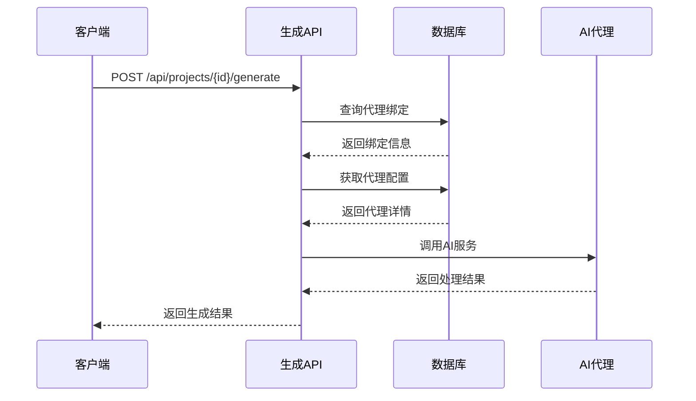
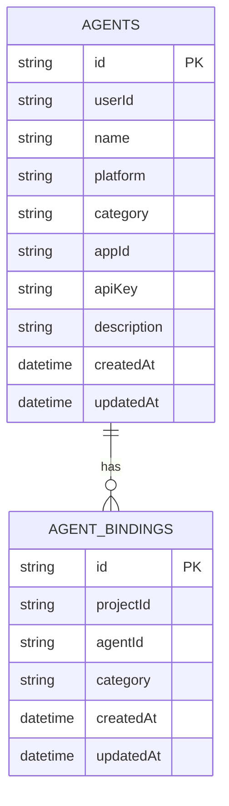
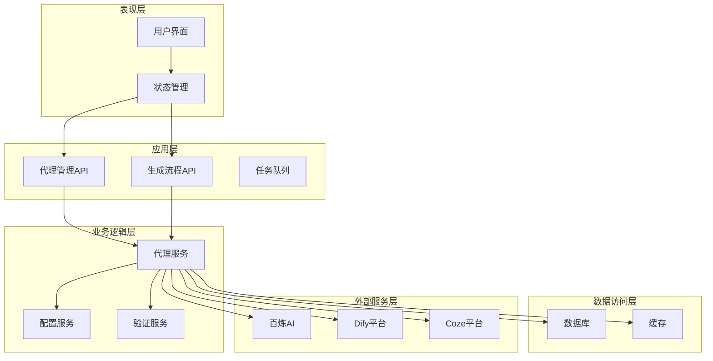
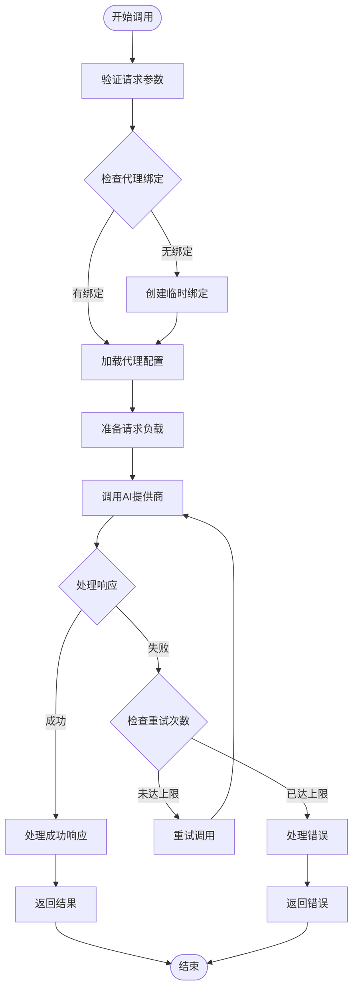
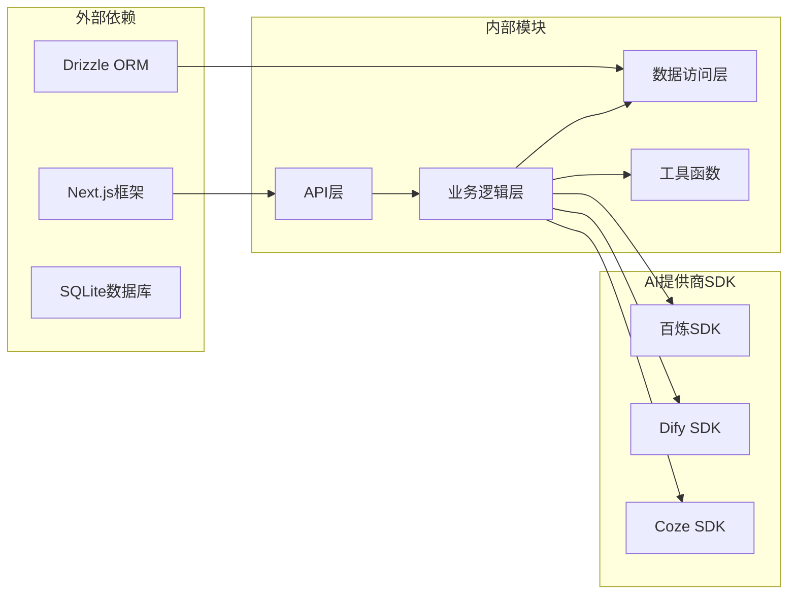

# AI代理集成API

<cite>
**本文档引用的文件**
- [src/app/api/agents/route.ts](file://src/app/api/agents/route.ts)
- [src/app/api/projects/[id]/generate/route.ts](file://src/app/api/projects/[id]/generate/route.ts)
- [src/lib/db/schema.ts](file://src/lib/db/schema.ts)
- [src/stores/agent-store.ts](file://src/stores/agent-store.ts)
- [agents/bailian/template.yml](file://agents/bailian/template.yml)
- [agents/coze/](file://agents/coze/)
- [agents/dify/](file://agents/dify/)
</cite>

## 目录
1. [简介](#简介)
2. [项目结构](#项目结构)
3. [核心组件](#核心组件)
4. [架构概览](#架构概览)
5. [详细组件分析](#详细组件分析)
6. [依赖关系分析](#依赖关系分析)
7. [性能考虑](#性能考虑)
8. [故障排除指南](#故障排除指南)
9. [结论](#结论)

## 简介

AIComicBuilder的AI代理集成API是一个完整的AI服务集成框架，支持多个AI提供商平台（如百炼、Dify、Coze）的统一管理和调用。该系统允许用户绑定不同类型的AI代理到特定的创作任务中，实现了灵活的AI服务选择和配置管理。

系统的核心功能包括：
- 多平台AI代理绑定管理
- 动态代理配置和切换
- 统一的代理调用接口
- 异步处理和错误重试机制
- 性能监控和优化

## 项目结构

AI代理系统主要分布在以下目录结构中：

```mermaid
graph TB
subgraph "API层"
AgentsAPI[代理管理API<br/>src/app/api/agents/route.ts]
GenerateAPI[生成流程API<br/>src/app/api/projects/[id]/generate/route.ts]
end
subgraph "数据层"
DBSchema[数据库模式<br/>src/lib/db/schema.ts]
AgentBindings[代理绑定表<br/>agent_bindings]
Agents[代理表<br/>agents]
end
subgraph "前端存储"
AgentStore[代理状态管理<br/>src/stores/agent-store.ts]
end
subgraph "AI提供商模板"
BailianTemplate[百炼模板<br/>agents/bailian/template.yml]
DifyTemplates[Dify模板集<br/>agents/dify/*.dify.yml]
CozeDir[Coze目录<br/>agents/coze/]
end
AgentsAPI --> DBSchema
GenerateAPI --> DBSchema
AgentStore --> AgentsAPI
GenerateAPI --> AgentBindings
GenerateAPI --> Agents
```

**图表来源**
- [src/app/api/agents/route.ts:1-54](file://src/app/api/agents/route.ts#L1-L54)
- [src/app/api/projects/[id]/generate/route.ts:147-193](file://src/app/api/projects/[id]/generate/route.ts#L147-L193)

**章节来源**
- [src/app/api/agents/route.ts:1-54](file://src/app/api/agents/route.ts#L1-L54)
- [src/app/api/projects/[id]/generate/route.ts:147-193](file://src/app/api/projects/[id]/generate/route.ts#L147-L193)

## 核心组件

### 代理管理API

代理管理API提供了完整的代理生命周期管理功能：

**代理创建接口**
- 支持多种代理类别：脚本大纲生成、脚本生成、脚本解析、角色提取、镜头分割、关键帧提示、视频提示、参考图像提示、参考视频提示
- 自动平台检测和默认值设置
- 数据验证和错误处理

**代理查询接口**
- 基于用户维度的代理列表查询
- 完整的代理信息返回

**章节来源**
- [src/app/api/agents/route.ts:8-54](file://src/app/api/agents/route.ts#L8-L54)

### 代理绑定管理

系统通过代理绑定机制实现项目与AI代理的关联：



**图表来源**
- [src/app/api/projects/[id]/generate/route.ts:153-170](file://src/app/api/projects/[id]/generate/route.ts#L153-L170)

**章节来源**
- [src/app/api/projects/[id]/generate/route.ts:153-170](file://src/app/api/projects/[id]/generate/route.ts#L153-L170)

### 数据模型设计

系统采用关系型数据库设计，包含以下核心表：



**图表来源**
- [src/lib/db/schema.ts:413](file://src/lib/db/schema.ts#L413)

**章节来源**
- [src/lib/db/schema.ts:413](file://src/lib/db/schema.ts#L413)

## 架构概览

AI代理系统的整体架构采用分层设计，确保了良好的可扩展性和维护性：



**图表来源**
- [src/app/api/agents/route.ts:1-54](file://src/app/api/agents/route.ts#L1-L54)
- [src/app/api/projects/[id]/generate/route.ts:147-193](file://src/app/api/projects/[id]/generate/route.ts#L147-L193)

## 详细组件分析

### 代理平台支持

系统当前支持三个主要的AI代理平台：

#### 百炼平台 (Bailian)
- 提供完整的模板配置文件
- 支持多种AI服务类型
- 集成在系统中的默认平台

#### Dify平台
- 包含多个专用模板文件
- 涵盖从脚本生成到视频提示的完整工作流
- 支持复杂的多步骤AI处理流程

#### Coze平台
- 作为独立的AI服务提供商
- 支持企业级AI应用集成

**章节来源**
- [agents/bailian/template.yml](file://agents/bailian/template.yml)
- [agents/coze/](file://agents/coze/)
- [agents/dify/](file://agents/dify/)

### 代理调用流程

AI代理的调用采用异步处理机制，确保系统的响应性和可靠性：



**图表来源**
- [src/app/api/projects/[id]/generate/route.ts:172-193](file://src/app/api/projects/[id]/generate/route.ts#L172-L193)

### 错误处理和重试机制

系统实现了多层次的错误处理和重试策略：

- **网络异常重试**：自动重试有限次数的网络请求
- **API限流处理**：检测并等待API限流恢复
- **代理不可用处理**：自动切换到备用代理或降级处理
- **超时处理**：设置合理的超时时间并优雅处理超时

**章节来源**
- [src/app/api/projects/[id]/generate/route.ts:172-193](file://src/app/api/projects/[id]/generate/route.ts#L172-L193)

### 性能监控

系统集成了全面的性能监控机制：

- **响应时间监控**：跟踪每个AI调用的响应时间
- **成功率统计**：统计不同代理的成功率和失败率
- **资源使用监控**：监控内存和CPU使用情况
- **错误日志记录**：详细的错误日志和调试信息

## 依赖关系分析

AI代理系统的依赖关系体现了清晰的分层架构：



**图表来源**
- [src/app/api/agents/route.ts:1-54](file://src/app/api/agents/route.ts#L1-L54)
- [src/lib/db/schema.ts:413](file://src/lib/db/schema.ts#L413)

**章节来源**
- [src/app/api/agents/route.ts:1-54](file://src/app/api/agents/route.ts#L1-L54)
- [src/lib/db/schema.ts:413](file://src/lib/db/schema.ts#L413)

## 性能考虑

### 优化策略

1. **连接池管理**：合理配置数据库连接池大小
2. **缓存策略**：使用Redis缓存常用配置和结果
3. **并发控制**：限制同时进行的AI调用数量
4. **资源清理**：及时释放不再使用的资源

### 扩展性设计

- **插件化架构**：支持新的AI提供商快速集成
- **配置驱动**：通过配置文件管理代理参数
- **异步处理**：避免阻塞主线程
- **水平扩展**：支持多实例部署

## 故障排除指南

### 常见问题及解决方案

**代理绑定失败**
- 检查代理配置是否正确
- 验证API密钥的有效性
- 确认代理类别与服务匹配

**调用超时**
- 检查网络连接状态
- 调整超时参数设置
- 监控AI提供商的服务状态

**权限错误**
- 验证用户身份认证
- 检查项目所有权
- 确认API访问权限

**章节来源**
- [src/app/api/agents/route.ts:28-35](file://src/app/api/agents/route.ts#L28-L35)
- [src/app/api/projects/[id]/generate/route.ts:184-186](file://src/app/api/projects/[id]/generate/route.ts#L184-L186)

## 结论

AIComicBuilder的AI代理集成API提供了一个完整、灵活且可扩展的AI服务集成解决方案。通过统一的代理管理接口、灵活的绑定机制和完善的错误处理策略，系统能够有效支持多种AI提供商的集成需求。

系统的主要优势包括：
- **统一接口**：所有AI提供商通过统一的接口进行调用
- **灵活配置**：支持动态配置和运行时切换
- **可靠保障**：完善的错误处理和重试机制
- **性能优化**：异步处理和资源管理优化
- **易于扩展**：插件化架构支持新提供商快速集成

未来可以进一步增强的功能包括：
- 更详细的性能监控指标
- 更智能的代理选择算法
- 更丰富的错误恢复策略
- 更完善的审计日志系统