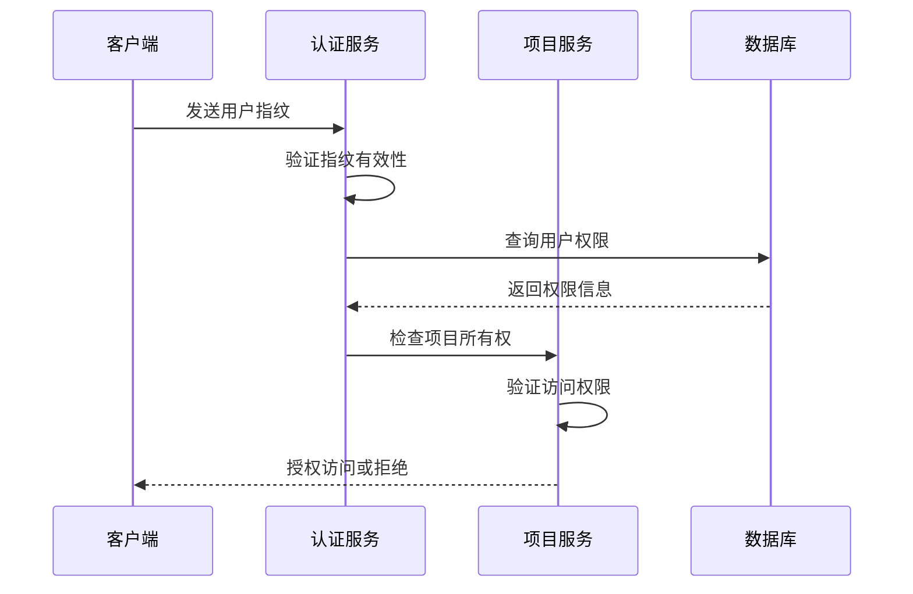
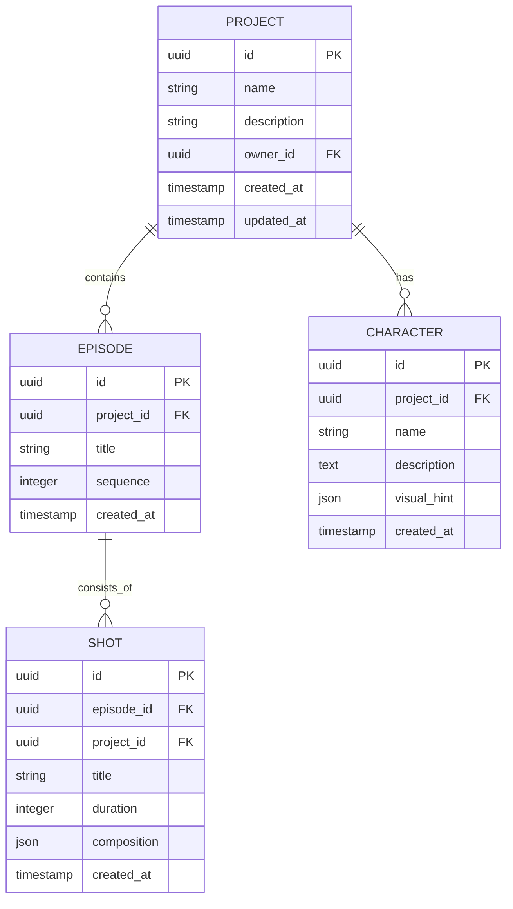
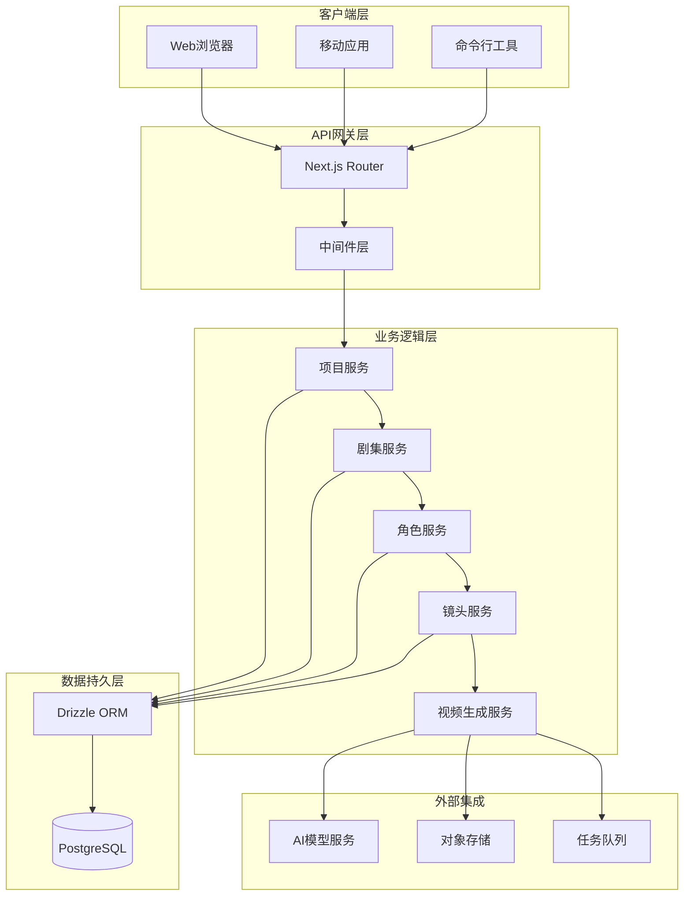
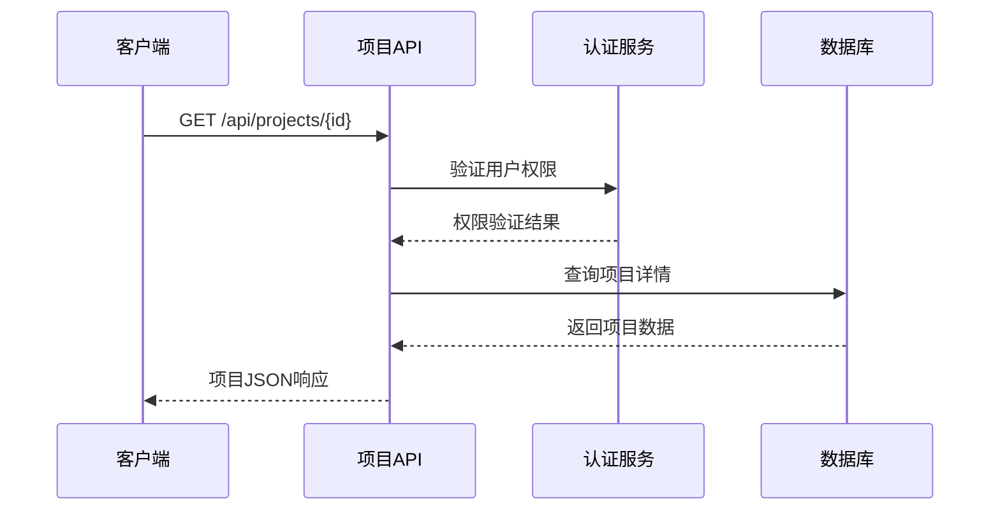
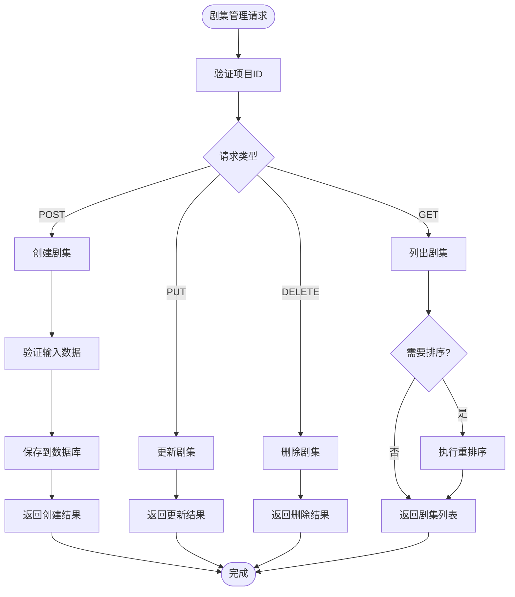
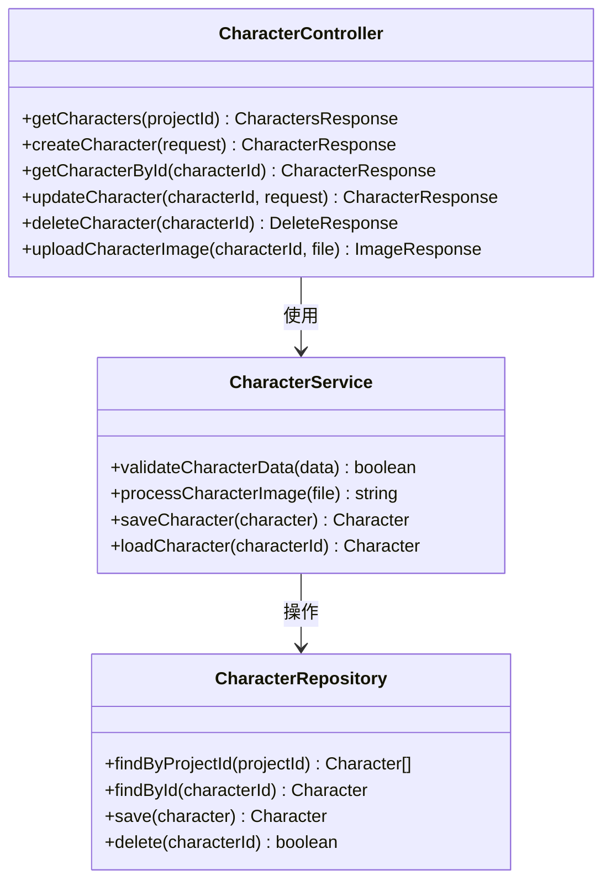
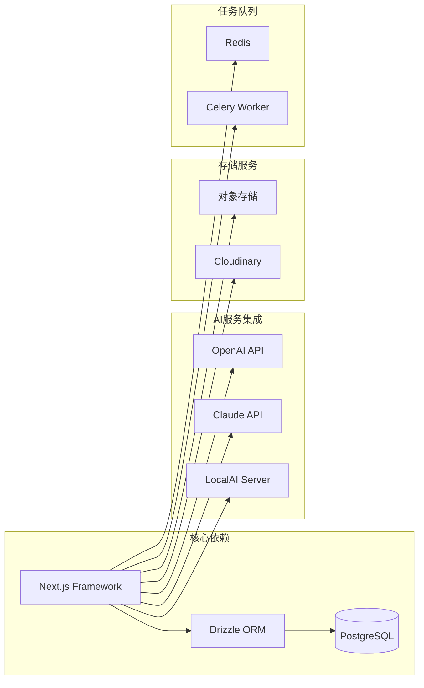
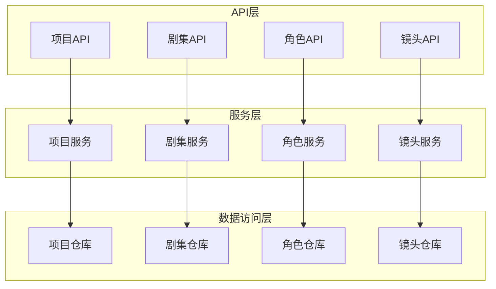
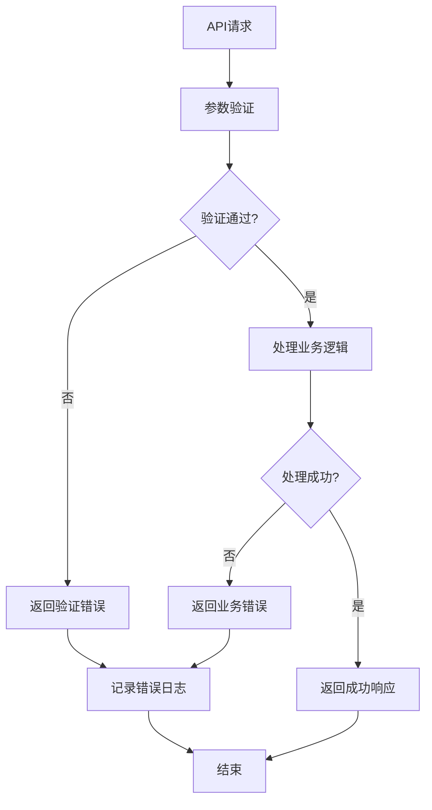

# API接口文档

<cite>
**本文档引用的文件**
- [src/app/api/projects/route.ts](file://src/app/api/projects/route.ts)
- [src/app/api/projects/[id]/route.ts](file://src/app/api/projects/[id]/route.ts)
- [src/app/api/projects/[id]/episodes/route.ts](file://src/app/api/projects/[id]/episodes/route.ts)
- [src/app/api/projects/[id]/episodes/[episodeId]/route.ts](file://src/app/api/projects/[id]/episodes/[episodeId]/route.ts)
- [src/app/api/projects/[id]/characters/route.ts](file://src/app/api/projects/[id]/characters/route.ts)
- [src/app/api/projects/[id]/characters/[characterId]/route.ts](file://src/app/api/projects/[id]/characters/[characterId]/route.ts)
- [src/app/api/projects/[id]/shots/route.ts](file://src/app/api/projects/[id]/shots/route.ts)
- [src/app/api/projects/[id]/shots/[shotId]/route.ts](file://src/app/api/projects/[id]/shots/[shotId]/route.ts)
- [src/app/api/projects/[id]/generate/route.ts](file://src/app/api/projects/[id]/generate/route.ts)
- [src/app/api/projects/[id]/download/route.ts](file://src/app/api/projects/[id]/download/route.ts)
- [src/app/api/projects/[id]/import/generate/route.ts](file://src/app/api/projects/[id]/import/generate/route.ts)
- [src/app/api/projects/[id]/import/logs/route.ts](file://src/app/api/projects/[id]/import/logs/route.ts)
- [src/app/api/projects/[id]/prompt-templates/[promptKey]/route.ts](file://src/app/api/projects/[id]/prompt-templates/[promptKey]/route.ts)
- [src/app/api/prompt-templates/[promptKey]/versions/[vid]/restore/route.ts](file://src/app/api/prompt-templates/[promptKey]/versions/[vid]/restore/route.ts)
- [src/app/api/agents/route.ts](file://src/app/api/agents/route.ts)
- [src/app/api/agents/[id]/route.ts](file://src/app/api/agents/[id]/route.ts)
- [src/app/api/models/list/route.ts](file://src/app/api/models/list/route.ts)
- [src/app/api/tasks/[id]/route.ts](file://src/app/api/tasks/[id]/route.ts)
- [src/app/api/uploads/[...path]/route.ts](file://src/app/api/uploads/[...path]/route.ts)
- [src/lib/assert-project-ownership.ts](file://src/lib/assert-project-ownership.ts)
- [src/lib/get-user-id.ts](file://src/lib/get-user-id.ts)
- [src/lib/bootstrap.ts](file://src/lib/bootstrap.ts)
- [src/lib/api-fetch.ts](file://src/lib/api-fetch.ts)
- [src/instrumentation.ts](file://src/instrumentation.ts)
- [src/proxy.ts](file://src/proxy.ts)
- [package.json](file://package.json)
- [drizzle.config.ts](file://drizzle.config.ts)
</cite>

## 目录
1. [简介](#简介)
2. [项目结构](#项目结构)
3. [核心组件](#核心组件)
4. [架构概览](#架构概览)
5. [详细组件分析](#详细组件分析)
6. [依赖关系分析](#依赖关系分析)
7. [性能考虑](#性能考虑)
8. [故障排除指南](#故障排除指南)
9. [结论](#结论)
10. [附录](#附录)

## 简介
AIComicBuilder是一个基于Next.js构建的AI漫画生成平台，提供从项目管理到视频生成的完整工作流程。本API文档详细记录了RESTful接口的设计规范、认证机制、错误处理策略以及性能优化建议。

## 项目结构
项目采用Next.js App Router架构，API路由位于`src/app/api/`目录下，按照功能模块进行组织：

```mermaid
graph TB
subgraph "API路由结构"
A[src/app/api/] --> B[agents/]
A --> C[models/]
A --> D[projects/]
A --> E[prompt-templates/]
A --> F[tasks/]
A --> G[uploads/]
D --> H[projects/[id]/]
H --> I[episodes/]
H --> J[characters/]
H --> K[shots/]
H --> L[generate/]
H --> M[import/]
end
subgraph "核心功能模块"
N[项目管理] --> O[剧集管理]
N --> P[角色管理]
N --> Q[视频生成]
N --> R[提示模板]
end
```

**图表来源**
- [src/app/api/projects/route.ts](file://src/app/api/projects/route.ts)
- [src/app/api/projects/[id]/episodes/route.ts](file://src/app/api/projects/[id]/episodes/route.ts)
- [src/app/api/projects/[id]/characters/route.ts](file://src/app/api/projects/[id]/characters/route.ts)

**章节来源**
- [src/app/api/projects/route.ts](file://src/app/api/projects/route.ts)
- [src/app/api/projects/[id]/route.ts](file://src/app/api/projects/[id]/route.ts)

## 核心组件

### 认证与授权机制
系统采用基于用户指纹的认证方式，通过`assert-project-ownership`中间件确保资源访问控制：



**图表来源**
- [src/lib/assert-project-ownership.ts](file://src/lib/assert-project-ownership.ts)
- [src/lib/get-user-id.ts](file://src/lib/get-user-id.ts)

### 数据模型架构
系统围绕项目、剧集、角色、镜头等核心实体构建：



**图表来源**
- [drizzle.config.ts](file://drizzle.config.ts)

**章节来源**
- [src/lib/assert-project-ownership.ts](file://src/lib/assert-project-ownership.ts)
- [src/lib/get-user-id.ts](file://src/lib/get-user-id.ts)

## 架构概览

### 整体架构设计


**图表来源**
- [src/app/api/projects/route.ts](file://src/app/api/projects/route.ts)
- [src/lib/bootstrap.ts](file://src/lib/bootstrap.ts)

## 详细组件分析

### 项目管理API

#### 项目创建与查询
- **HTTP方法**: POST, GET
- **URL模式**: `/api/projects`
- **请求参数**: 
  - POST: 项目名称、描述、所有者信息
  - GET: 分页参数、过滤条件
- **响应格式**: JSON项目对象数组或单个项目详情

#### 项目详情管理
- **HTTP方法**: GET, PUT, DELETE
- **URL模式**: `/api/projects/[id]`
- **路径参数**: `id` - 项目唯一标识符
- **认证要求**: 项目所有者或管理员



**图表来源**
- [src/app/api/projects/[id]/route.ts](file://src/app/api/projects/[id]/route.ts)

**章节来源**
- [src/app/api/projects/route.ts](file://src/app/api/projects/route.ts)
- [src/app/api/projects/[id]/route.ts](file://src/app/api/projects/[id]/route.ts)

### 剧集管理API

#### 剧集列表与创建
- **HTTP方法**: GET, POST
- **URL模式**: `/api/projects/[id]/episodes`
- **功能**: 获取项目所有剧集或创建新剧集

#### 剧集排序管理
- **HTTP方法**: POST
- **URL模式**: `/api/projects/[id]/episodes/reorder`
- **用途**: 批量更新剧集顺序

#### 单个剧集操作
- **HTTP方法**: GET, PUT, DELETE
- **URL模式**: `/api/projects/[id]/episodes/[episodeId]`



**图表来源**
- [src/app/api/projects/[id]/episodes/route.ts](file://src/app/api/projects/[id]/episodes/route.ts)
- [src/app/api/projects/[id]/episodes/reorder/route.ts](file://src/app/api/projects/[id]/episodes/reorder/route.ts)

**章节来源**
- [src/app/api/projects/[id]/episodes/route.ts](file://src/app/api/projects/[id]/episodes/route.ts)
- [src/app/api/projects/[id]/episodes/[episodeId]/route.ts](file://src/app/api/projects/[id]/episodes/[episodeId]/route.ts)

### 角色管理API

#### 角色列表与创建
- **HTTP方法**: GET, POST
- **URL模式**: `/api/projects/[id]/characters`

#### 角色图片上传
- **HTTP方法**: POST
- **URL模式**: `/api/projects/[id]/characters/[characterId]/upload`
- **用途**: 上传角色头像或参考图片

#### 角色详情管理
- **HTTP方法**: GET, PUT, DELETE
- **URL模式**: `/api/projects/[id]/characters/[characterId]`



**图表来源**
- [src/app/api/projects/[id]/characters/route.ts](file://src/app/api/projects/[id]/characters/route.ts)
- [src/app/api/projects/[id]/characters/[characterId]/route.ts](file://src/app/api/projects/[id]/characters/[characterId]/route.ts)

**章节来源**
- [src/app/api/projects/[id]/characters/route.ts](file://src/app/api/projects/[id]/characters/route.ts)
- [src/app/api/projects/[id]/characters/[characterId]/route.ts](file://src/app/api/projects/[id]/characters/[characterId]/route.ts)

### 镜头管理API

#### 镜头列表与创建
- **HTTP方法**: GET, POST
- **URL模式**: `/api/projects/[id]/shots`

#### 镜头资产管理
- **HTTP方法**: GET, POST
- **URL模式**: `/api/projects/[id]/shots/[shotId]/assets`
- **用途**: 管理镜头相关的参考图片和素材

#### 镜头详情管理
- **HTTP方法**: GET, PUT, DELETE
- **URL模式**: `/api/projects/[id]/shots/[shotId]`

**章节来源**
- [src/app/api/projects/[id]/shots/route.ts](file://src/app/api/projects/[id]/shots/route.ts)
- [src/app/api/projects/[id]/shots/[shotId]/route.ts](file://src/app/api/projects/[id]/shots/[shotId]/route.ts)

### 视频生成功能API

#### 生成任务创建
- **HTTP方法**: POST
- **URL模式**: `/api/projects/[id]/generate`
- **用途**: 启动视频生成任务

#### 下载链接获取
- **HTTP方法**: GET
- **URL模式**: `/api/projects/[id]/download`
- **用途**: 获取生成完成视频的下载链接

#### 导入功能API
- **HTTP方法**: POST
- **URL模式**: `/api/projects/[id]/import/generate`
- **用途**: 从外部源导入内容并生成视频

**章节来源**
- [src/app/api/projects/[id]/generate/route.ts](file://src/app/api/projects/[id]/generate/route.ts)
- [src/app/api/projects/[id]/download/route.ts](file://src/app/api/projects/[id]/download/route.ts)
- [src/app/api/projects/[id]/import/generate/route.ts](file://src/app/api/projects/[id]/import/generate/route.ts)

### 提示模板管理API

#### 模板版本控制
- **HTTP方法**: POST
- **URL模式**: `/api/prompt-templates/[promptKey]/versions/[vid]/restore`
- **用途**: 恢复指定版本的提示模板

#### 项目级模板管理
- **HTTP方法**: GET, POST, PUT, DELETE
- **URL模式**: `/api/projects/[id]/prompt-templates/[promptKey]`

**章节来源**
- [src/app/api/prompt-templates/[promptKey]/versions/[vid]/restore/route.ts](file://src/app/api/prompt-templates/[promptKey]/versions/[vid]/restore/route.ts)
- [src/app/api/projects/[id]/prompt-templates/[promptKey]/route.ts](file://src/app/api/projects/[id]/prompt-templates/[promptKey]/route.ts)

### AI代理管理API

#### 代理列表与创建
- **HTTP方法**: GET, POST
- **URL模式**: `/api/agents`

#### 代理配置管理
- **HTTP方法**: GET, PUT, DELETE
- **URL模式**: `/api/agents/[id]`

**章节来源**
- [src/app/api/agents/route.ts](file://src/app/api/agents/route.ts)
- [src/app/api/agents/[id]/route.ts](file://src/app/api/agents/[id]/route.ts)

### 系统工具API

#### 模型列表查询
- **HTTP方法**: GET
- **URL模式**: `/api/models/list`
- **用途**: 获取可用的AI模型列表

#### 任务状态查询
- **HTTP方法**: GET
- **URL模式**: `/api/tasks/[id]`
- **用途**: 查询异步任务执行状态

#### 文件上传处理
- **HTTP方法**: POST
- **URL模式**: `/api/uploads/[...path]`
- **用途**: 处理各种类型的文件上传

**章节来源**
- [src/app/api/models/list/route.ts](file://src/app/api/models/list/route.ts)
- [src/app/api/tasks/[id]/route.ts](file://src/app/api/tasks/[id]/route.ts)
- [src/app/api/uploads/[...path]/route.ts](file://src/app/api/uploads/[...path]/route.ts)

## 依赖关系分析

### 外部依赖关系


**图表来源**
- [package.json](file://package.json)

### 内部模块依赖


**图表来源**
- [src/app/api/projects/route.ts](file://src/app/api/projects/route.ts)

**章节来源**
- [package.json](file://package.json)

## 性能考虑

### 缓存策略
- **静态资源缓存**: 利用CDN缓存图片和视频文件
- **API响应缓存**: 对频繁查询的数据实施短期缓存
- **数据库查询优化**: 使用索引和连接池提高查询效率

### 异步处理
- **长任务队列**: 将视频生成等耗时操作放入后台队列
- **分批处理**: 支持批量导入和批量更新操作
- **进度跟踪**: 提供任务状态查询接口

### 资源管理
- **内存优化**: 及时释放大文件处理后的内存
- **并发控制**: 限制同时进行的生成任务数量
- **超时设置**: 为长时间运行的操作设置合理超时

## 故障排除指南

### 常见错误类型
- **认证失败**: 检查用户指纹是否有效
- **权限不足**: 验证项目所有权和用户角色
- **数据验证错误**: 确认请求参数格式正确
- **资源不存在**: 检查ID是否有效且存在

### 错误处理策略


**图表来源**
- [src/lib/api-fetch.ts](file://src/lib/api-fetch.ts)

### 监控指标
- **响应时间**: 关键API的平均响应时间
- **错误率**: 各类错误的发生频率
- **吞吐量**: 每秒处理的请求数
- **资源使用**: CPU、内存、存储使用情况

**章节来源**
- [src/lib/api-fetch.ts](file://src/lib/api-fetch.ts)
- [src/instrumentation.ts](file://src/instrumentation.ts)

## 结论
AIComicBuilder的API设计遵循RESTful原则，提供了完整的项目管理、剧集管理、角色管理和视频生成功能。通过合理的认证机制、错误处理策略和性能优化措施，确保了系统的稳定性和可扩展性。未来版本将继续完善API文档，提供更好的开发者体验。

## 附录

### 版本信息
- **当前版本**: v0.2.4
- **API版本**: v1.0
- **兼容性**: 向后兼容现有接口

### 安全最佳实践
- 始终验证用户权限
- 对敏感数据进行加密传输
- 实施适当的速率限制
- 定期更新依赖包

### 开发者指南
- 使用提供的SDK简化API调用
- 参考示例代码理解API使用方式
- 关注API变更通知
- 提供反馈帮助改进API设计