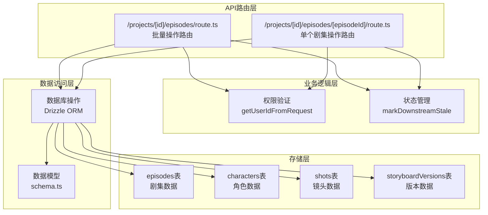
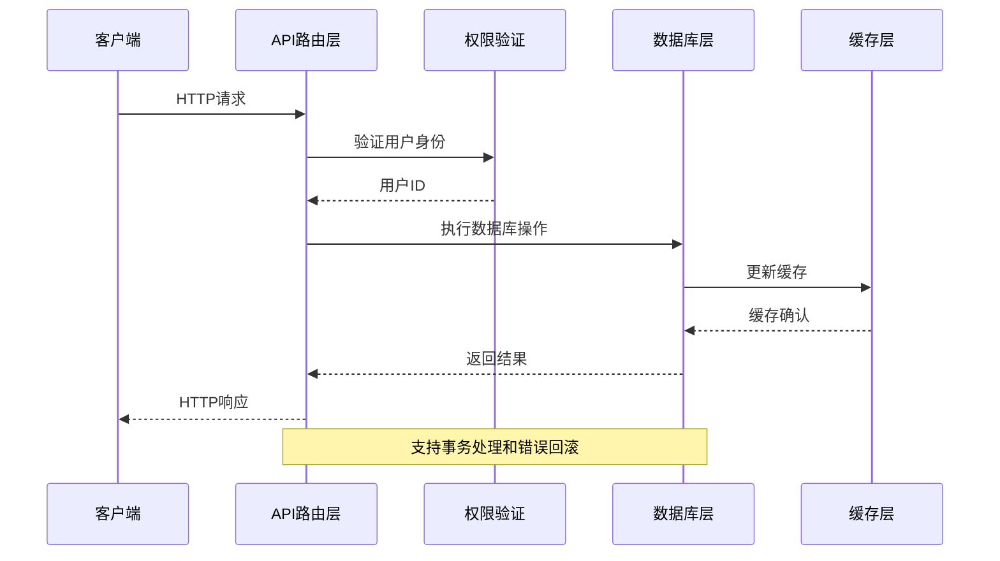
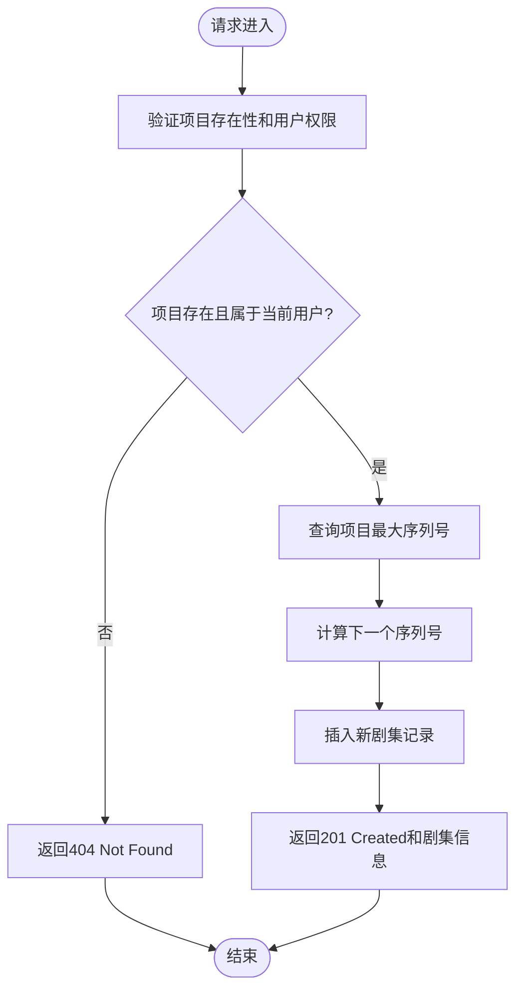
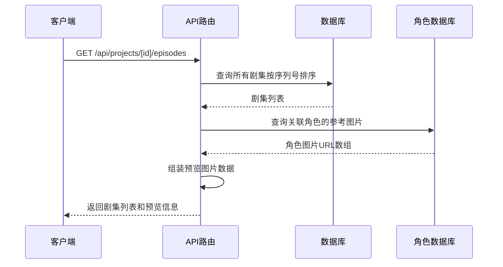
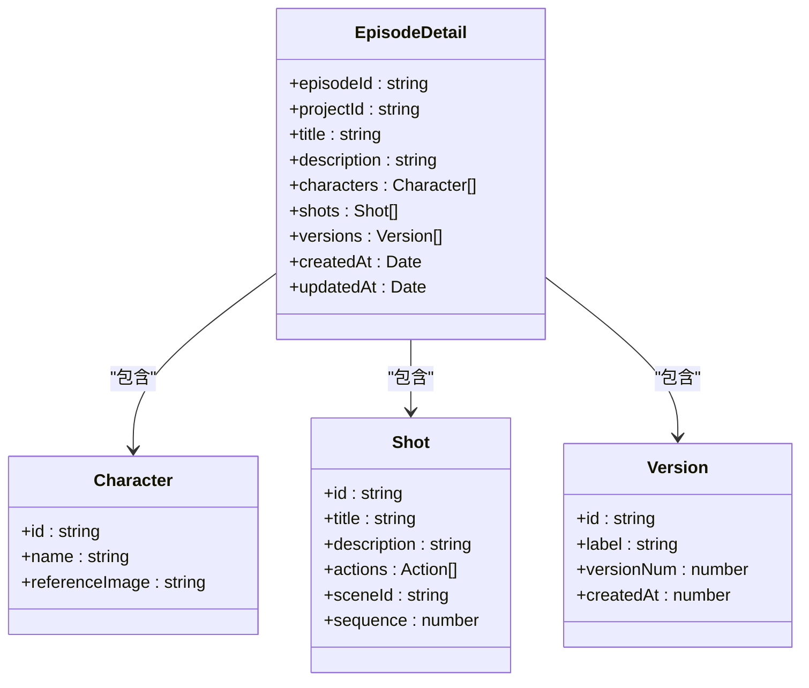
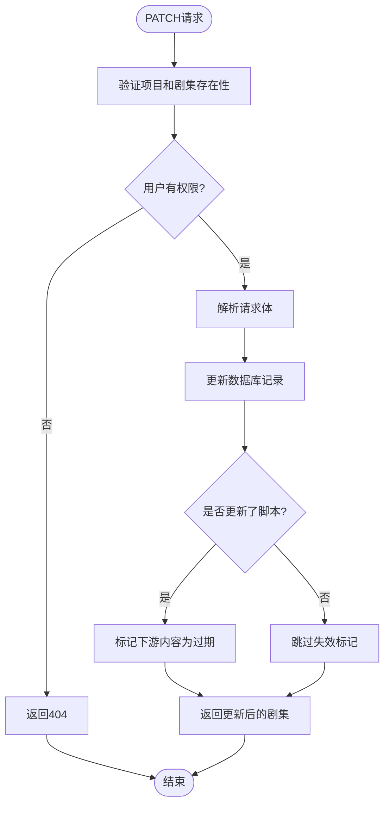
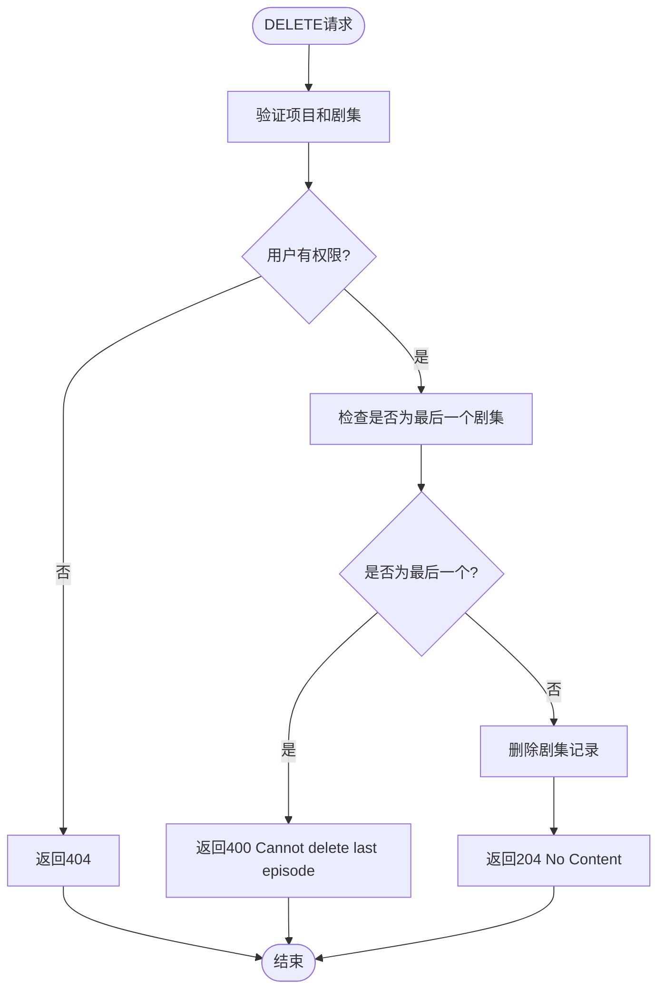
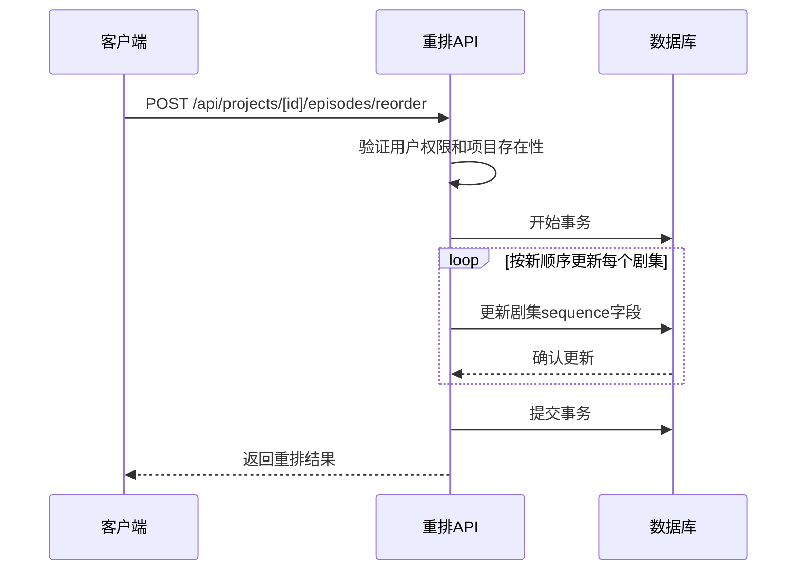
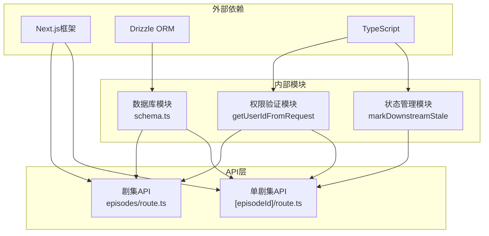

# 剧集管理API

<cite>
**本文档引用的文件**
- [src/app/api/projects/[id]/episodes/route.ts](file://src/app/api/projects/[id]/episodes/route.ts)
- [src/app/api/projects/[id]/episodes/[episodeId]/route.ts](file://src/app/api/projects/[id]/episodes/[episodeId]/route.ts)
- [src/lib/db/schema.ts](file://src/lib/db/schema.ts)
- [src/lib/staleness.ts](file://src/lib/staleness.ts)
- [src/lib/get-user-id.ts](file://src/lib/get-user-id.ts)
- [drizzle/0010_add_episodes.sql](file://drizzle/0010_add_episodes.sql)
- [drizzle/0013_add_episode_characters.sql](file://drizzle/0013_add_episode_characters.sql)
- [drizzle/0026_add_scenes_table.sql](file://drizzle/0026_add_scenes_table.sql)
- [drizzle/0027_add_shot_scene_id.sql](file://drizzle/0027_add_shot_scene_id.sql)
- [drizzle/0046_add_shot_actions.sql](file://drizzle/0046_add_shot_actions.sql)
- [drizzle/0052_add_agents.sql](file://drizzle/0052_add_agents.sql)
</cite>

## 目录
1. [简介](#简介)
2. [项目结构](#项目结构)
3. [核心组件](#核心组件)
4. [架构概览](#架构概览)
5. [详细组件分析](#详细组件分析)
6. [依赖关系分析](#依赖关系分析)
7. [性能考虑](#性能考虑)
8. [故障排除指南](#故障排除指南)
9. [结论](#结论)

## 简介

AIComicBuilder的剧集管理API是项目管理系统的核心组件，负责管理漫画项目的剧集生命周期。该API提供了完整的CRUD操作（创建、读取、更新、删除），支持剧集排序管理、批量重排功能，以及剧集级别的脚本生成、预览和导出接口。

剧集管理API基于Next.js App Router架构构建，采用TypeScript开发，使用Drizzle ORM进行数据库操作。系统通过严格的用户权限验证确保数据安全，并实现了智能的下游内容失效机制来维护数据一致性。

## 项目结构

剧集管理API位于Next.js应用的API路由层中，采用模块化设计：



**图表来源**
- [src/app/api/projects/[id]/episodes/route.ts](file://src/app/api/projects/[id]/episodes/route.ts#L1-L126)
- [src/app/api/projects/[id]/episodes/[episodeId]/route.ts](file://src/app/api/projects/[id]/episodes/[episodeId]/route.ts#L1-L261)

**章节来源**
- [src/app/api/projects/[id]/episodes/route.ts](file://src/app/api/projects/[id]/episodes/route.ts#L1-L126)
- [src/app/api/projects/[id]/episodes/[episodeId]/route.ts](file://src/app/api/projects/[id]/episodes/[episodeId]/route.ts#L1-L261)

## 核心组件

### 数据模型定义

剧集管理API基于以下核心数据模型：

#### 剧集表结构 (episodes)
| 字段名 | 类型 | 描述 | 约束 |
|--------|------|------|------|
| id | UUID | 剧集唯一标识符 | 主键 |
| projectId | UUID | 所属项目ID | 外键到projects |
| title | String | 剧集标题 | 必填 |
| description | Text | 剧集描述 | 可选 |
| keywords | Text | 关键词 | 可选 |
| idea | Text | 创意概念 | 可选 |
| script | Text | 脚本内容 | 可选 |
| outline | Text | 大纲 | 可选 |
| status | Enum | 状态(draft, processing, completed) | 默认draft |
| generationMode | Enum | 生成模式(keyframe, reference) | 可选 |
| targetDuration | Integer | 目标时长(秒) | 可选 |
| sequence | Integer | 排序序列号 | 必填 |
| finalVideoUrl | String | 最终视频URL | 可选 |
| createdAt | Timestamp | 创建时间 | 自动设置 |
| updatedAt | Timestamp | 更新时间 | 自动更新 |

#### 角色关联表 (episodeCharacters)
| 字段名 | 类型 | 描述 | 约束 |
|--------|------|------|------|
| episodeId | UUID | 剧集ID | 外键到episodes |
| characterId | UUID | 角色ID | 外键到characters |
| createdAt | Timestamp | 关联时间 | 自动设置 |

#### 镜头表结构 (shots)
| 字段名 | 类型 | 描述 | 约束 |
|--------|------|------|------|
| id | UUID | 镜头唯一标识符 | 主键 |
| episodeId | UUID | 所属剧集ID | 外键到episodes |
| title | String | 镜头标题 | 必填 |
| description | Text | 镜头描述 | 可选 |
| actions | JSON | 动作描述 | 可选 |
| sceneId | UUID | 场景ID | 可选 |
| sequence | Integer | 排序序列号 | 必填 |
| createdAt | Timestamp | 创建时间 | 自动设置 |
| updatedAt | Timestamp | 更新时间 | 自动更新 |

**章节来源**
- [drizzle/0010_add_episodes.sql](file://drizzle/0010_add_episodes.sql)
- [drizzle/0013_add_episode_characters.sql](file://drizzle/0013_add_episode_characters.sql)
- [drizzle/0026_add_scenes_table.sql](file://drizzle/0026_add_scenes_table.sql)
- [drizzle/0027_add_shot_scene_id.sql](file://drizzle/0027_add_shot_scene_id.sql)
- [drizzle/0046_add_shot_actions.sql](file://drizzle/0046_add_shot_actions.sql)

## 架构概览

剧集管理API采用分层架构设计，确保职责分离和代码可维护性：



**图表来源**
- [src/app/api/projects/[id]/episodes/route.ts](file://src/app/api/projects/[id]/episodes/route.ts#L91-L126)
- [src/app/api/projects/[id]/episodes/[episodeId]/route.ts](file://src/app/api/projects/[id]/episodes/[episodeId]/route.ts#L38-L174)

**章节来源**
- [src/app/api/projects/[id]/episodes/route.ts](file://src/app/api/projects/[id]/episodes/route.ts#L1-L126)
- [src/app/api/projects/[id]/episodes/[episodeId]/route.ts](file://src/app/api/projects/[id]/episodes/[episodeId]/route.ts#L1-L261)

## 详细组件分析

### 批量剧集管理API

#### 创建剧集 (POST /api/projects/[id]/episodes)
批量创建剧集API支持在指定项目中创建新的剧集条目。



**图表来源**
- [src/app/api/projects/[id]/episodes/route.ts](file://src/app/api/projects/[id]/episodes/route.ts#L91-L126)

#### 获取剧集列表 (GET /api/projects/[id]/episodes)
获取项目中的所有剧集，支持预览图片生成和排序。



**图表来源**
- [src/app/api/projects/[id]/episodes/route.ts](file://src/app/api/projects/[id]/episodes/route.ts#L60-L89)

**章节来源**
- [src/app/api/projects/[id]/episodes/route.ts](file://src/app/api/projects/[id]/episodes/route.ts#L60-L126)

### 单个剧集管理API

#### 获取剧集详情 (GET /api/projects/[id]/episodes/[episodeId])
获取单个剧集的详细信息，包括关联的角色、镜头和版本历史。



**图表来源**
- [src/app/api/projects/[id]/episodes/[episodeId]/route.ts](file://src/app/api/projects/[id]/episodes/[episodeId]/route.ts#L38-L174)

#### 更新剧集 (PATCH /api/projects/[id]/episodes/[episodeId])
更新剧集信息并处理下游内容失效。



**图表来源**
- [src/app/api/projects/[id]/episodes/[episodeId]/route.ts](file://src/app/api/projects/[id]/episodes/[episodeId]/route.ts#L176-L228)

#### 删除剧集 (DELETE /api/projects/[id]/episodes/[episodeId])
删除指定的剧集，包含安全检查防止删除最后一个剧集。



**图表来源**
- [src/app/api/projects/[id]/episodes/[episodeId]/route.ts](file://src/app/api/projects/[id]/episodes/[episodeId]/route.ts#L230-L261)

**章节来源**
- [src/app/api/projects/[id]/episodes/[episodeId]/route.ts](file://src/app/api/projects/[id]/episodes/[episodeId]/route.ts#L38-L261)

### 排序和重排功能

#### 批量重排 (POST /api/projects/[id]/episodes/reorder)
支持批量调整剧集的显示顺序，实现拖拽排序功能。



**图表来源**
- [src/app/api/projects/[id]/episodes/reorder/route.ts](file://src/app/api/projects/[id]/episodes/reorder/route.ts)

### 版本控制和历史记录

#### 版本管理
剧集支持多版本管理，通过storyboardVersions表跟踪每次修改的历史记录：

| 字段名 | 类型 | 描述 |
|--------|------|------|
| id | UUID | 版本唯一标识符 |
| episodeId | UUID | 关联的剧集ID |
| label | String | 版本标签 |
| versionNum | Integer | 版本号 |
| createdAt | Timestamp | 创建时间 |
| content | JSON | 版本内容快照 |

**章节来源**
- [src/app/api/projects/[id]/episodes/[episodeId]/route.ts](file://src/app/api/projects/[id]/episodes/[episodeId]/route.ts#L140-L173)

## 依赖关系分析

剧集管理API的依赖关系体现了清晰的分层架构：



**图表来源**
- [src/app/api/projects/[id]/episodes/route.ts](file://src/app/api/projects/[id]/episodes/route.ts#L1-L15)
- [src/app/api/projects/[id]/episodes/[episodeId]/route.ts](file://src/app/api/projects/[id]/episodes/[episodeId]/route.ts#L1-L15)

**章节来源**
- [src/lib/get-user-id.ts](file://src/lib/get-user-id.ts)
- [src/lib/staleness.ts](file://src/lib/staleness.ts)
- [src/lib/db/schema.ts](file://src/lib/db/schema.ts)

## 性能考虑

### 数据库优化策略

1. **索引优化**
   - 在episodes.projectId上建立索引以加速项目查询
   - 在episodes.sequence上建立索引以优化排序性能
   - 在episodeCharacters.episodeId和characterId上建立复合索引

2. **查询优化**
   - 使用SELECT只获取必要字段，避免SELECT *
   - 实施分页机制处理大量剧集数据
   - 使用连接查询减少N+1查询问题

3. **缓存策略**
   - 实现Redis缓存存储热门剧集数据
   - 设置适当的缓存失效策略
   - 支持条件GET请求减少不必要的数据传输

### 并发控制

系统采用以下并发控制机制：
- 数据库事务确保操作原子性
- 行级锁防止并发更新冲突
- 版本号机制检测并处理并发修改

## 故障排除指南

### 常见错误及解决方案

#### 404 Not Found
**症状**: 访问不存在的项目或剧集
**原因**: 项目ID或剧集ID无效，或用户无访问权限
**解决方案**: 验证ID有效性，检查用户权限

#### 400 Bad Request
**症状**: 删除最后一个剧集失败
**原因**: 系统不允许删除所有剧集
**解决方案**: 先创建新剧集再删除

#### 500 Internal Server Error
**症状**: 数据库操作失败
**原因**: 事务回滚，约束违反
**解决方案**: 检查输入数据格式，重试操作

### 调试建议

1. **启用详细日志**
   ```typescript
   // 在关键操作前后添加日志
   console.log('Processing episode update:', { episodeId, userId });
   ```

2. **监控数据库性能**
   - 监控慢查询
   - 分析索引使用情况
   - 跟踪内存使用

3. **API测试**
   - 使用Postman测试各种场景
   - 实施单元测试覆盖关键逻辑
   - 进行集成测试验证端到端流程

**章节来源**
- [src/app/api/projects/[id]/episodes/[episodeId]/route.ts](file://src/app/api/projects/[id]/episodes/[episodeId]/route.ts#L242-L257)

## 结论

AIComicBuilder的剧集管理API提供了完整而强大的剧集生命周期管理功能。通过清晰的架构设计、严格的数据验证和智能的状态管理，该API能够满足漫画制作项目的复杂需求。

主要优势包括：
- **完整的CRUD操作**：支持剧集的创建、读取、更新和删除
- **智能排序管理**：提供灵活的剧集排序和批量重排功能
- **版本控制**：完整的版本历史追踪和恢复机制
- **权限安全**：严格的用户权限验证和数据隔离
- **性能优化**：数据库索引优化和缓存策略

未来可以考虑的功能增强：
- 批量操作的进度跟踪
- 更细粒度的权限控制
- 增强的搜索和过滤功能
- 实时协作功能