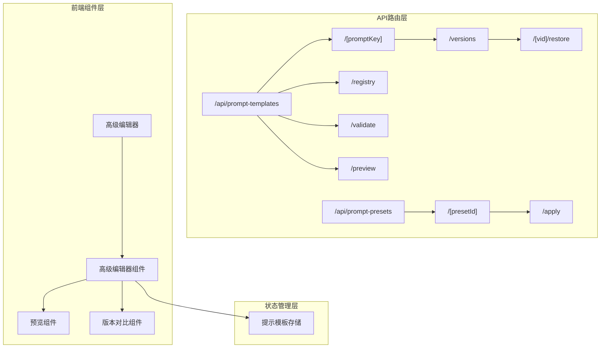
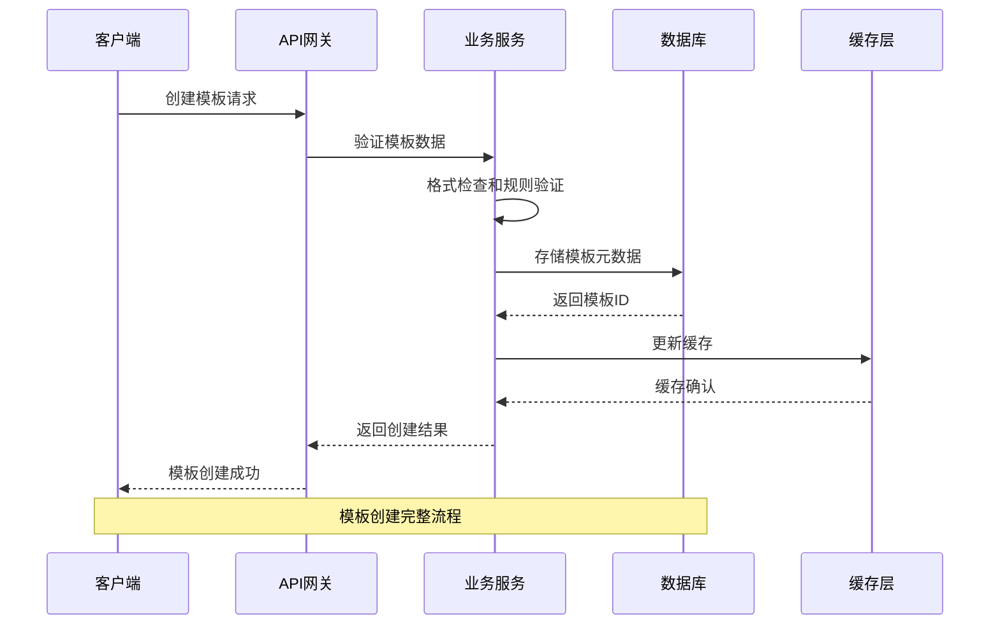
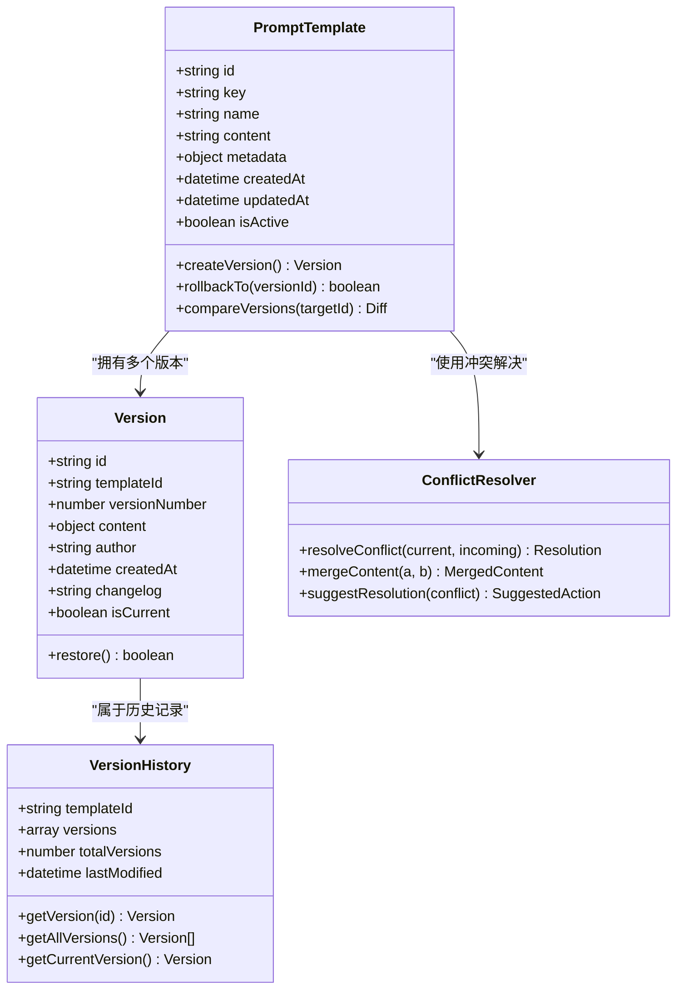
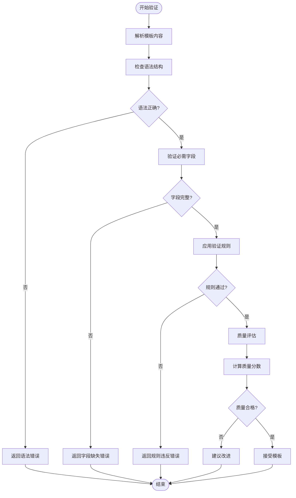
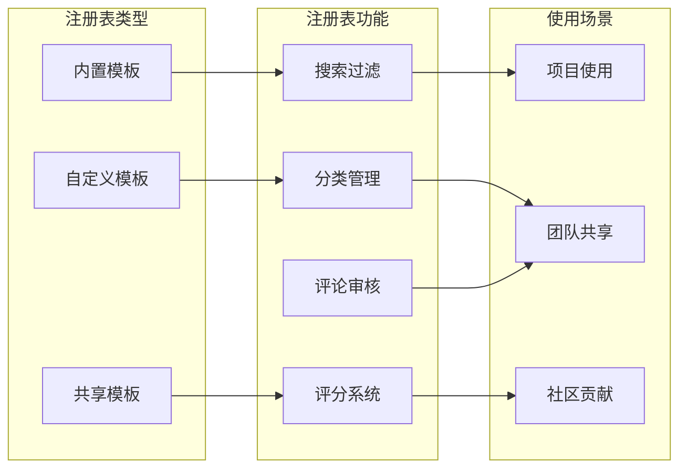
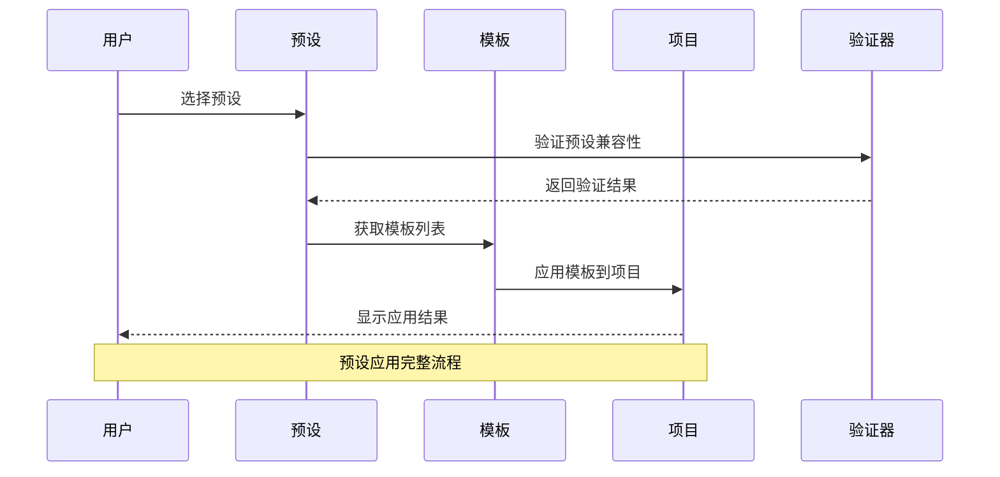
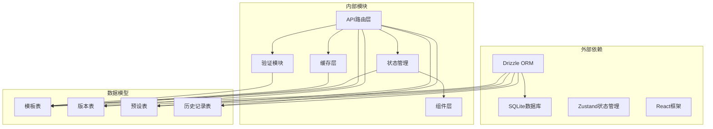

# 提示模板API

<cite>
**本文档引用的文件**
- [route.ts](file://src/app/api/prompt-templates/route.ts)
- [route.ts](file://src/app/api/prompt-templates/[promptKey]/route.ts)
- [route.ts](file://src/app/api/prompt-templates/registry/route.ts)
- [route.ts](file://src/app/api/prompt-templates/validate/route.ts)
- [route.ts](file://src/app/api/prompt-templates/preview/route.ts)
- [route.ts](file://src/app/api/prompt-templates/[promptKey]/versions/route.ts)
- [route.ts](file://src/app/api/prompt-templates/[promptKey]/versions/[vid]/restore/route.ts)
- [route.ts](file://src/app/api/prompt-presets/route.ts)
- [route.ts](file://src/app/api/prompt-presets/[presetId]/route.ts)
- [route.ts](file://src/app/api/prompt-presets/[presetId]/apply/route.ts)
- [prompt-template-store.ts](file://src/stores/prompt-template-store.ts)
- [advanced-editor.tsx](file://src/components/prompt-templates/advanced-editor.tsx)
- [prompt-editor.tsx](file://src/components/prompt-templates/prompt-editor.tsx)
- [prompt-preview.tsx](file://src/components/prompt-templates/prompt-preview.tsx)
- [version-compare.tsx](file://src/components/editor/version-compare.tsx)
- [0014_add_prompt_templates.sql](file://drizzle/migrations/0014_add_prompt_templates.sql)
- [0015_add_use_project_prompts.sql](file://drizzle/migrations/0015_add_use_project_prompts.sql)
</cite>

## 目录
1. [简介](#简介)
2. [项目结构](#项目结构)
3. [核心组件](#核心组件)
4. [架构概览](#架构概览)
5. [详细组件分析](#详细组件分析)
6. [依赖关系分析](#依赖关系分析)
7. [性能考虑](#性能考虑)
8. [故障排除指南](#故障排除指南)
9. [结论](#结论)
10. [附录](#附录)

## 简介
本文件为AIComicBuilder项目中提示模板管理API的完整技术文档。该系统支持模板的创建、编辑、版本管理与验证，涵盖模板注册表、预设应用以及自定义模板的全生命周期管理。文档详细说明了模板版本控制、回滚机制和冲突解决策略，同时提供了模板验证规则、格式检查和质量评估的处理流程，以及模板数据结构、字段定义和版本管理的技术规范。

## 项目结构
提示模板API位于Next.js App Router的API路由层，采用REST风格设计，结合前端组件与状态管理实现完整的模板管理功能。

**图表来源**
- [route.ts:1-200](file://src/app/api/prompt-templates/route.ts#L1-L200)
- [route.ts:1-200](file://src/app/api/prompt-templates/[promptKey]/route.ts#L1-L200)
- [route.ts:1-200](file://src/app/api/prompt-templates/registry/route.ts#L1-L200)
- [route.ts:1-200](file://src/app/api/prompt-templates/validate/route.ts#L1-L200)
- [route.ts:1-200](file://src/app/api/prompt-presets/route.ts#L1-L200)

**章节来源**
- [route.ts:1-200](file://src/app/api/prompt-templates/route.ts#L1-L200)
- [route.ts:1-200](file://src/app/api/prompt-templates/[promptKey]/route.ts#L1-L200)
- [route.ts:1-200](file://src/app/api/prompt-templates/registry/route.ts#L1-L200)
- [route.ts:1-200](file://src/app/api/prompt-templates/validate/route.ts#L1-L200)
- [route.ts:1-200](file://src/app/api/prompt-presets/route.ts#L1-L200)

## 核心组件
提示模板API由以下核心组件构成：

### 模板管理API
- **根路由**：提供模板列表查询、批量操作和全局配置
- **模板路由**：针对特定模板键值的操作接口
- **版本管理路由**：模板版本的创建、查询和回滚
- **注册表路由**：模板注册表的查询和管理
- **验证路由**：模板内容的格式验证和质量评估
- **预览路由**：模板渲染预览功能

### 预设管理API
- **预设根路由**：预设模板的创建、查询和管理
- **预设路由**：单个预设的详细信息操作
- **应用路由**：将预设应用到项目或场景

### 前端组件
- **高级编辑器**：提供富文本编辑和模板语法高亮
- **预览组件**：实时显示模板渲染效果
- **版本对比组件**：展示版本差异和变更历史
- **提示模板存储**：集中管理模板状态和数据流

**章节来源**
- [prompt-template-store.ts:1-200](file://src/stores/prompt-template-store.ts#L1-L200)
- [advanced-editor.tsx:1-200](file://src/components/prompt-templates/advanced-editor.tsx#L1-L200)
- [prompt-editor.tsx:1-200](file://src/components/prompt-templates/prompt-editor.tsx#L1-L200)
- [prompt-preview.tsx:1-200](file://src/components/prompt-templates/prompt-preview.tsx#L1-L200)
- [version-compare.tsx:1-200](file://src/components/editor/version-compare.tsx#L1-L200)

## 架构概览
提示模板系统采用分层架构设计，确保前后端分离和职责清晰。

**图表来源**
- [route.ts:1-200](file://src/app/api/prompt-templates/route.ts#L1-L200)
- [route.ts:1-200](file://src/app/api/prompt-templates/validate/route.ts#L1-L200)

系统架构特点：
- **分层设计**：API层、业务层、数据访问层职责明确
- **缓存策略**：热点模板数据缓存提升响应速度
- **异步处理**：复杂模板处理采用任务队列机制
- **版本隔离**：模板版本独立存储，避免相互影响

## 详细组件分析

### 模板版本控制系统
模板版本控制是系统的核心功能，支持多版本并行管理和精确回滚。

**图表来源**
- [route.ts:1-200](file://src/app/api/prompt-templates/[promptKey]/versions/route.ts#L1-L200)
- [route.ts:1-200](file://src/app/api/prompt-templates/[promptKey]/versions/[vid]/restore/route.ts#L1-L200)

#### 版本管理流程
1. **版本创建**：每次模板修改自动创建新版本
2. **版本标识**：使用时间戳和递增序列号作为版本标识
3. **版本存储**：版本内容与元数据分离存储
4. **版本切换**：支持快速版本间切换和比较

#### 冲突解决机制
- **自动合并**：相似内容的版本自动合并
- **手动干预**：复杂冲突需要人工确认
- **版本比较**：提供详细的差异分析报告
- **回滚保护**：防止意外的版本回滚操作

**章节来源**
- [route.ts:1-200](file://src/app/api/prompt-templates/[promptKey]/versions/route.ts#L1-L200)
- [route.ts:1-200](file://src/app/api/prompt-templates/[promptKey]/versions/[vid]/restore/route.ts#L1-L200)

### 模板验证系统
模板验证系统确保所有模板符合预定义的标准和规范。

**图表来源**
- [route.ts:1-200](file://src/app/api/prompt-templates/validate/route.ts#L1-L200)

#### 验证规则体系
- **语法验证**：检查模板语法是否符合规范
- **字段验证**：确保必需字段存在且格式正确
- **业务规则验证**：应用领域特定的业务逻辑规则
- **质量评估**：基于内容长度、复杂度等指标评估质量

#### 质量评估指标
- **完整性评分**：字段填充程度的量化评估
- **一致性检查**：模板内部逻辑的一致性验证
- **可读性分析**：模板表达的清晰度和易理解性
- **效率评估**：模板执行效率的潜在影响因素

**章节来源**
- [route.ts:1-200](file://src/app/api/prompt-templates/validate/route.ts#L1-L200)

### 模板注册表管理
模板注册表提供统一的模板发现和管理功能。

**图表来源**
- [route.ts:1-200](file://src/app/api/prompt-templates/registry/route.ts#L1-L200)

#### 注册表特性
- **模板分类**：按用途、风格、复杂度等维度分类
- **智能搜索**：支持关键词搜索和语义匹配
- **质量筛选**：基于评分和审核状态的筛选机制
- **版本兼容**：确保模板与当前系统版本兼容

#### 共享机制
- **权限控制**：区分公开、私有、团队可见等权限级别
- **版本同步**：自动同步模板的最新版本
- **使用统计**：跟踪模板的使用频率和效果
- **反馈收集**：收集用户对模板的评价和建议

**章节来源**
- [route.ts:1-200](file://src/app/api/prompt-templates/registry/route.ts#L1-L200)

### 预设应用系统
预设应用系统允许用户快速应用经过验证的模板组合。

**图表来源**
- [route.ts:1-200](file://src/app/api/prompt-presets/[presetId]/apply/route.ts#L1-L200)

#### 预设工作流程
1. **预设选择**：用户从可用预设中选择合适的组合
2. **兼容性检查**：验证预设与目标项目的兼容性
3. **模板提取**：获取预设中的所有模板定义
4. **批量应用**：将模板应用到项目中的相应位置
5. **结果确认**：显示应用结果和可能的冲突

#### 冲突处理策略
- **自动解决**：简单冲突自动按照优先级解决
- **用户确认**：复杂冲突需要用户手动选择解决方案
- **备份保留**：在应用前自动备份现有模板
- **回滚机制**：应用失败时自动回滚到之前状态

**章节来源**
- [route.ts:1-200](file://src/app/api/prompt-presets/[presetId]/apply/route.ts#L1-L200)

## 依赖关系分析

**图表来源**
- [prompt-template-store.ts:1-200](file://src/stores/prompt-template-store.ts#L1-L200)
- [0014_add_prompt_templates.sql:1-200](file://drizzle/migrations/0014_add_prompt_templates.sql#L1-L200)
- [0015_add_use_project_prompts.sql:1-200](file://drizzle/migrations/0015_add_use_project_prompts.sql#L1-L200)

### 数据模型设计
系统采用关系型数据库设计，确保数据一致性和查询效率。

#### 核心数据表结构
- **模板表**：存储模板基本信息和元数据
- **版本表**：记录模板的历史版本和变更
- **预设表**：管理模板组合和配置
- **历史记录表**：追踪所有模板操作和变更

#### 关系约束
- 外键约束确保数据完整性
- 唯一约束防止重复定义
- 约束检查保证数据有效性
- 触发器自动维护审计日志

**章节来源**
- [0014_add_prompt_templates.sql:1-200](file://drizzle/migrations/0014_add_prompt_templates.sql#L1-L200)
- [0015_add_use_project_prompts.sql:1-200](file://drizzle/migrations/0015_add_use_project_prompts.sql#L1-L200)

## 性能考虑
提示模板系统的性能优化策略包括：

### 缓存策略
- **模板缓存**：热门模板内容缓存减少数据库查询
- **版本缓存**：最近使用的版本缓存提升切换速度
- **预设缓存**：常用预设配置缓存降低加载时间
- **元数据缓存**：模板统计和索引信息缓存

### 查询优化
- **索引设计**：关键字段建立适当索引提升查询性能
- **批量操作**：支持批量模板操作减少网络往返
- **分页查询**：大量模板时采用分页避免内存溢出
- **延迟加载**：非关键信息延迟加载提升首屏速度

### 异步处理
- **后台验证**：复杂验证在后台异步执行
- **增量更新**：模板修改采用增量更新减少锁竞争
- **任务队列**：批量操作放入任务队列有序处理

## 故障排除指南

### 常见问题诊断
1. **模板加载失败**
   - 检查数据库连接状态
   - 验证模板文件完整性
   - 确认权限设置正确

2. **版本回滚异常**
   - 检查目标版本是否存在
   - 验证版本间的兼容性
   - 确认当前版本状态

3. **验证失败**
   - 查看具体错误信息
   - 检查模板语法
   - 验证必需字段

### 错误处理机制
- **异常捕获**：统一的异常处理和错误报告
- **重试机制**：网络错误的自动重试
- **降级策略**：服务不可用时的功能降级
- **监控告警**：关键错误的实时监控和告警

**章节来源**
- [route.ts:1-200](file://src/app/api/prompt-templates/route.ts#L1-L200)
- [route.ts:1-200](file://src/app/api/prompt-templates/[promptKey]/route.ts#L1-L200)

## 结论
AIComicBuilder的提示模板管理API提供了完整的模板生命周期管理能力，包括版本控制、验证、注册表管理和预设应用等功能。系统采用现代化的架构设计，确保了高性能、高可用性和良好的用户体验。通过标准化的数据结构和严格的验证机制，系统能够有效保证模板质量和一致性，为用户提供可靠的提示模板管理解决方案。

## 附录

### API接口规范
所有API接口均遵循RESTful设计原则，支持标准的HTTP方法和状态码。

#### 模板管理接口
- GET `/api/prompt-templates` - 获取模板列表
- POST `/api/prompt-templates` - 创建新模板
- GET `/api/prompt-templates/[promptKey]` - 获取模板详情
- PUT `/api/prompt-templates/[promptKey]` - 更新模板
- DELETE `/api/prompt-templates/[promptKey]` - 删除模板

#### 版本管理接口
- GET `/api/prompt-templates/[promptKey]/versions` - 获取版本列表
- POST `/api/prompt-templates/[promptKey]/versions` - 创建新版本
- GET `/api/prompt-templates/[promptKey]/versions/[vid]` - 获取指定版本
- POST `/api/prompt-templates/[promptKey]/versions/[vid]/restore` - 回滚到版本

#### 注册表接口
- GET `/api/prompt-templates/registry` - 获取注册表
- GET `/api/prompt-templates/registry/[category]` - 获取分类模板

#### 验证接口
- POST `/api/prompt-templates/validate` - 验证模板
- POST `/api/prompt-templates/preview` - 预览模板

#### 预设管理接口
- GET `/api/prompt-presets` - 获取预设列表
- POST `/api/prompt-presets` - 创建预设
- GET `/api/prompt-presets/[presetId]` - 获取预设详情
- POST `/api/prompt-presets/[presetId]/apply` - 应用预设

### 数据结构定义
模板对象包含以下核心字段：
- `id`: 模板唯一标识符
- `key`: 模板键值，用于标识和检索
- `name`: 模板显示名称
- `content`: 模板内容主体
- `metadata`: 模板元数据，包含描述、标签、作者等信息
- `createdAt`: 创建时间
- `updatedAt`: 最后更新时间
- `isActive`: 是否激活状态

版本对象包含：
- `versionNumber`: 版本号
- `content`: 版本内容
- `author`: 创建者
- `changelog`: 变更日志
- `isCurrent`: 是否为当前版本

### 技术规范
- **编码规范**：UTF-8编码，遵循TypeScript最佳实践
- **版本控制**：语义化版本管理，向后兼容性保证
- **安全标准**：输入验证、SQL注入防护、XSS防护
- **性能标准**：响应时间小于2秒，支持并发用户数≥100
- **可靠性标准**：系统可用性≥99.9%，数据持久化保证