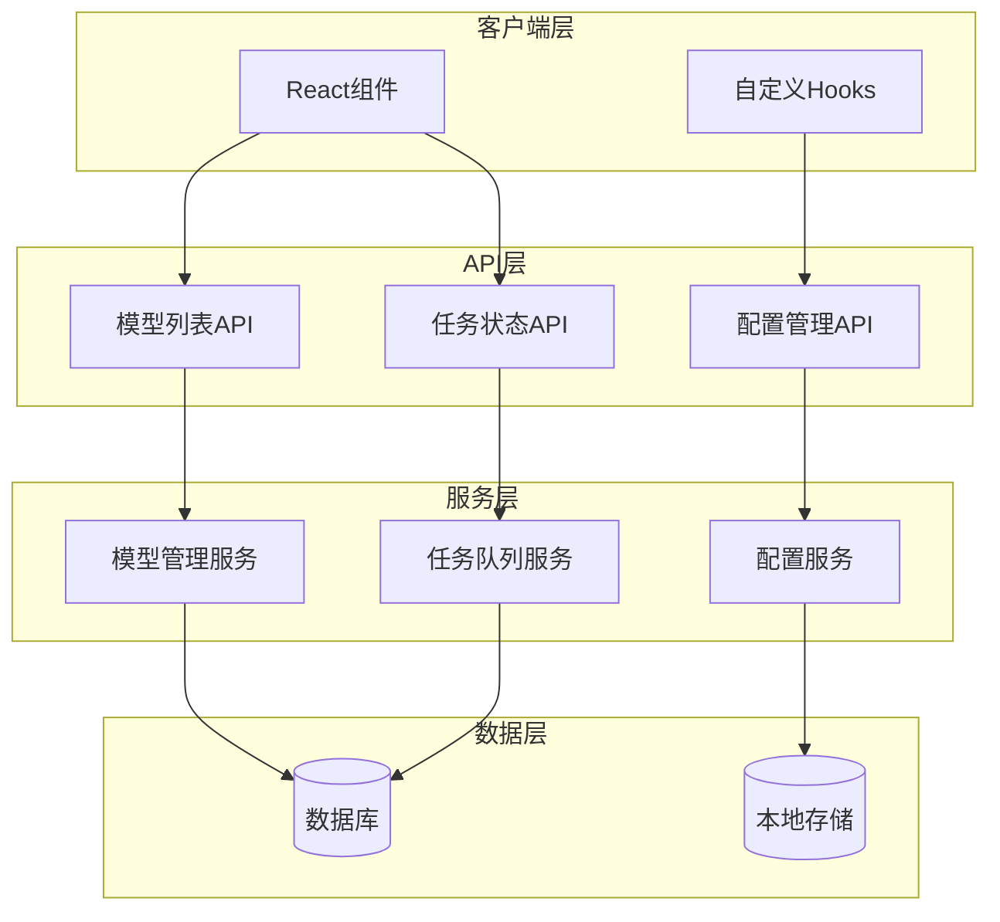
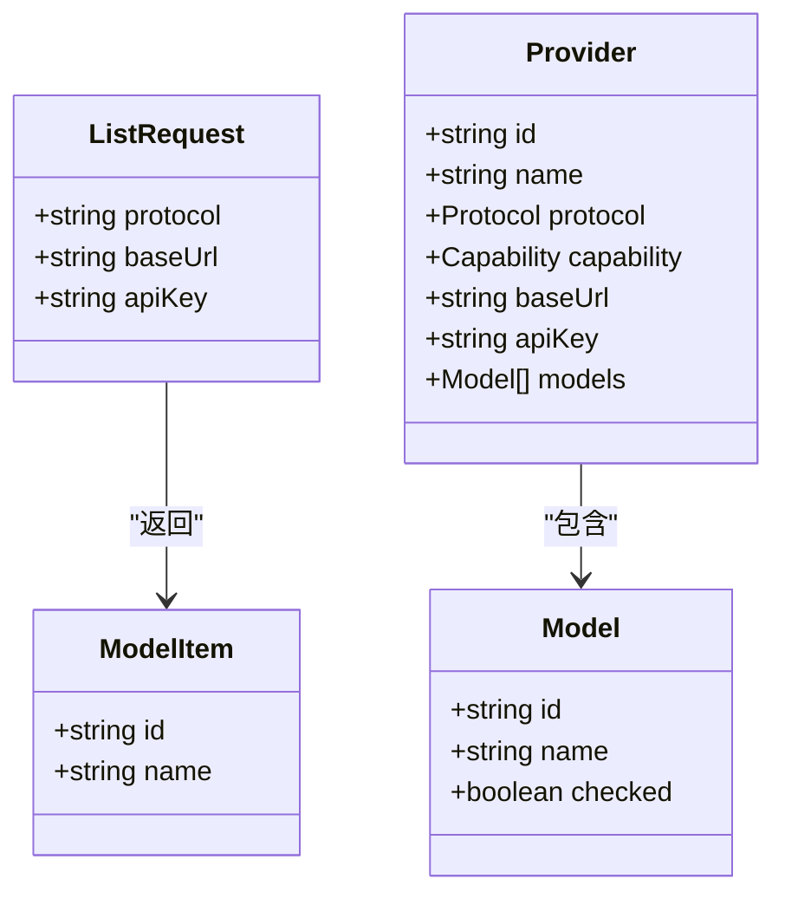
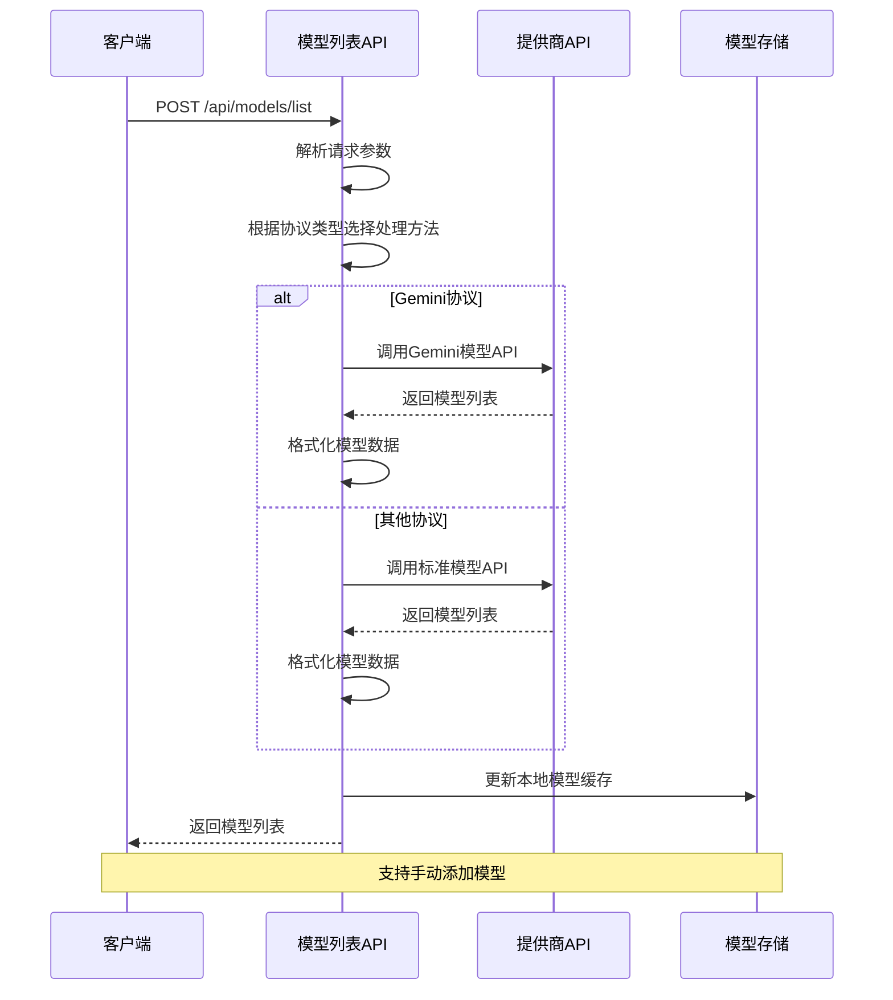
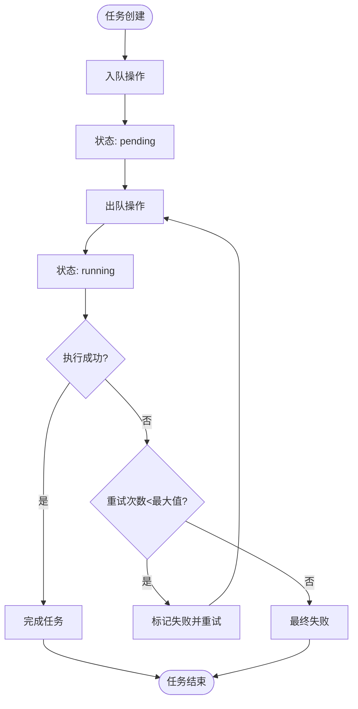
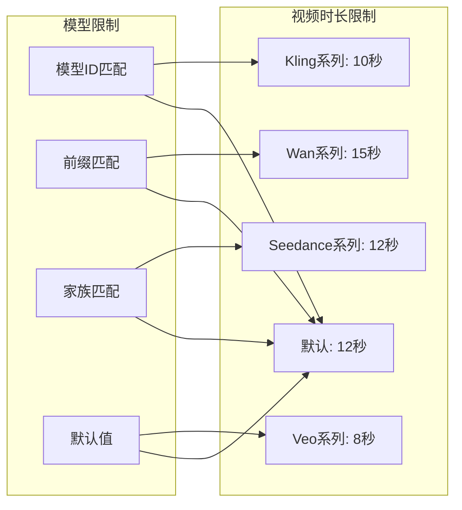
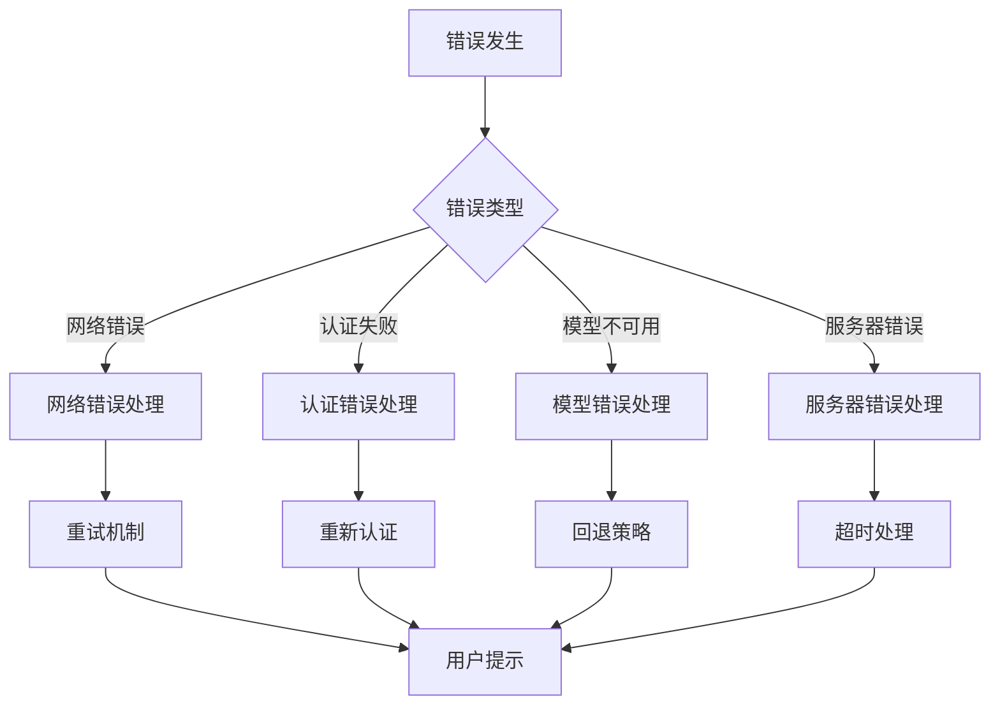

# 模型管理API

<cite>
**本文档引用的文件**
- [src/app/api/models/list/route.ts](file://src/app/api/models/list/route.ts)
- [src/app/api/tasks/[id]/route.ts](file://src/app/api/tasks/[id]/route.ts)
- [src/stores/model-store.ts](file://src/stores/model-store.ts)
- [src/lib/task-queue/queue.ts](file://src/lib/task-queue/queue.ts)
- [src/lib/task-queue/worker.ts](file://src/lib/task-queue/worker.ts)
- [src/lib/task-queue/types.ts](file://src/lib/task-queue/types.ts)
- [src/components/settings/default-model-picker.tsx](file://src/components/settings/default-model-picker.tsx)
- [src/components/editor/model-selector.tsx](file://src/components/editor/model-selector.tsx)
- [src/components/settings/provider-form.tsx](file://src/components/settings/provider-form.tsx)
- [src/hooks/use-model-guard.ts](file://src/hooks/use-model-guard.ts)
- [src/lib/ai/model-limits.ts](file://src/lib/ai/model-limits.ts)
- [src/lib/api-fetch.ts](file://src/lib/api-fetch.ts)
- [drizzle/meta/0000_snapshot.json](file://drizzle/meta/0000_snapshot.json)
</cite>

## 目录
1. [简介](#简介)
2. [项目结构](#项目结构)
3. [核心组件](#核心组件)
4. [架构概览](#架构概览)
5. [详细组件分析](#详细组件分析)
6. [依赖关系分析](#依赖关系分析)
7. [性能考虑](#性能考虑)
8. [故障排除指南](#故障排除指南)
9. [结论](#结论)

## 简介

AIComicBuilder的模型管理API为漫画生成系统提供了完整的AI模型生命周期管理能力。该系统支持多种AI模型提供商（OpenAI、Gemini、Seedance、Kling、Wan等），提供模型列表查询、任务状态跟踪和模型配置管理功能。

系统采用前后端分离架构，前端通过React组件管理用户界面，后端通过Next.js API路由处理业务逻辑，数据库使用Drizzle ORM进行数据持久化。核心特性包括：

- 多协议模型支持：统一管理不同AI提供商的模型
- 实时任务队列：异步处理复杂的漫画生成任务
- 配置管理：本地存储模型配置，支持默认模型设置
- 性能监控：基于模型ID的视频时长限制和使用统计
- 错误处理：完善的异常捕获和错误响应机制

## 项目结构

模型管理API相关的文件组织结构如下：

```mermaid
graph TB
subgraph "API层"
A[src/app/api/models/list/route.ts]
B[src/app/api/tasks/[id]/route.ts]
end
subgraph "状态管理"
C[src/stores/model-store.ts]
D[src/components/settings/default-model-picker.tsx]
E[src/components/editor/model-selector.tsx]
end
subgraph "任务队列"
F[src/lib/task-queue/queue.ts]
G[src/lib/task-queue/worker.ts]
H[src/lib/task-queue/types.ts]
end
subgraph "工具类"
I[src/lib/ai/model-limits.ts]
J[src/lib/api-fetch.ts]
K[src/hooks/use-model-guard.ts]
end
subgraph "数据库"
L[drizzle/meta/0000_snapshot.json]
end
A --> C
B --> F
C --> D
C --> E
F --> G
H --> G
I --> C
J --> A
```

**图表来源**
- [src/app/api/models/list/route.ts:1-139](file://src/app/api/models/list/route.ts#L1-L139)
- [src/stores/model-store.ts:1-198](file://src/stores/model-store.ts#L1-L198)
- [src/lib/task-queue/queue.ts:1-101](file://src/lib/task-queue/queue.ts#L1-L101)

**章节来源**
- [src/app/api/models/list/route.ts:1-139](file://src/app/api/models/list/route.ts#L1-L139)
- [src/stores/model-store.ts:1-198](file://src/stores/model-store.ts#L1-L198)

## 核心组件

### 模型列表API
提供统一的模型查询接口，支持多种AI提供商协议：

- **端点**: `POST /api/models/list`
- **功能**: 查询指定提供商的可用模型列表
- **支持协议**: OpenAI、Gemini、Seedance、Kling、Wan、DashScope
- **认证**: 支持Bearer Token和API Key两种认证方式

### 任务状态API
提供任务状态查询和管理功能：

- **端点**: `GET /api/tasks/[id]`
- **功能**: 获取特定任务的详细状态信息
- **权限控制**: 基于用户ID的访问验证
- **数据关联**: 自动关联项目信息

### 模型配置存储
基于Zustand的状态管理系统：

- **持久化存储**: 使用localStorage保存模型配置
- **默认模型**: 支持文本、图像、视频三种类型的默认模型设置
- **模型切换**: 动态启用/禁用模型
- **手动添加**: 支持手动输入模型ID

**章节来源**
- [src/app/api/models/list/route.ts:65-138](file://src/app/api/models/list/route.ts#L65-L138)
- [src/app/api/tasks/[id]/route.ts:7-28](file://src/app/api/tasks/[id]/route.ts#L7-L28)
- [src/stores/model-store.ts:36-163](file://src/stores/model-store.ts#L36-L163)

## 架构概览

系统采用分层架构设计，确保各组件职责清晰：



**图表来源**
- [src/app/api/models/list/route.ts:14-41](file://src/app/api/models/list/route.ts#L14-L41)
- [src/lib/task-queue/queue.ts:7-29](file://src/lib/task-queue/queue.ts#L7-L29)
- [src/stores/model-store.ts:55-163](file://src/stores/model-store.ts#L55-L163)

## 详细组件分析

### 模型列表查询组件

#### 数据结构定义



**图表来源**
- [src/app/api/models/list/route.ts:3-12](file://src/app/api/models/list/route.ts#L3-L12)
- [src/stores/model-store.ts:8-23](file://src/stores/model-store.ts#L8-L23)

#### 协议支持策略

系统支持以下AI模型提供商协议：

| 协议名称 | 特点 | 基础URL格式 | 认证方式 |
|---------|------|-------------|----------|
| OpenAI | 标准REST API | `https://api.openai.com` | Bearer Token |
| Gemini | Google AI平台 | `https://generativelanguage.googleapis.com` | API Key |
| Seedance | 企业级模型 | `https://dashscope.aliyuncs.com` | API Key |
| Kling | 视频生成 | `https://api.klingai.com` | Bearer Token |
| Wan | 文生视频 | `https://api.wangcai.com` | API Key |
| DashScope | 阿里云平台 | `https://dashscope.aliyuncs.com` | API Key |

#### API请求流程



**图表来源**
- [src/app/api/models/list/route.ts:65-132](file://src/app/api/models/list/route.ts#L65-L132)
- [src/components/settings/provider-form.tsx:68-97](file://src/components/settings/provider-form.tsx#L68-L97)

**章节来源**
- [src/app/api/models/list/route.ts:14-132](file://src/app/api/models/list/route.ts#L14-L132)
- [src/components/settings/provider-form.tsx:66-97](file://src/components/settings/provider-form.tsx#L66-L97)

### 任务状态管理组件

#### 任务队列架构



**图表来源**
- [src/lib/task-queue/queue.ts:31-92](file://src/lib/task-queue/queue.ts#L31-L92)

#### 数据库表结构

任务状态在数据库中的存储结构：

| 字段名 | 类型 | 描述 | 默认值 |
|--------|------|------|--------|
| id | text | 任务ID | 主键 |
| project_id | text | 项目ID | 外键 |
| type | text | 任务类型 | 必填 |
| status | text | 任务状态 | 'pending' |
| payload | text | 任务负载 | JSON序列化 |
| result | text | 执行结果 | JSON序列化 |
| error | text | 错误信息 | |
| retries | integer | 重试次数 | 0 |
| max_retries | integer | 最大重试次数 | 3 |
| created_at | integer | 创建时间 | 时间戳 |
| scheduled_at | integer | 预定执行时间 | 时间戳 |

**章节来源**
- [src/lib/task-queue/queue.ts:7-100](file://src/lib/task-queue/queue.ts#L7-L100)
- [drizzle/meta/0000_snapshot.json:340-417](file://drizzle/meta/0000_snapshot.json#L340-L417)

### 模型配置管理组件

#### 模型选择策略

系统提供多种模型选择策略：

1. **自动选择**: 当未指定模型时，自动选择第一个可用模型
2. **默认模型**: 用户可设置每种能力类型的默认模型
3. **手动选择**: 支持用户手动选择特定模型
4. **条件筛选**: 基于模型能力（文本/图像/视频）进行筛选

#### 性能指标实现



**图表来源**
- [src/lib/ai/model-limits.ts:1-63](file://src/lib/ai/model-limits.ts#L1-L63)

#### 使用统计功能

系统通过以下方式实现使用统计：

- **模型使用计数**: 跟踪每个模型的调用次数
- **任务执行统计**: 统计不同类型任务的执行情况
- **性能监控**: 监控模型响应时间和成功率
- **错误日志**: 记录模型调用过程中的错误信息

**章节来源**
- [src/stores/model-store.ts:144-163](file://src/stores/model-store.ts#L144-L163)
- [src/lib/ai/model-limits.ts:1-63](file://src/lib/ai/model-limits.ts#L1-L63)

### 错误处理技术规范

#### 错误分类与处理



**图表来源**
- [src/app/api/models/list/route.ts:133-137](file://src/app/api/models/list/route.ts#L133-L137)
- [src/lib/api-fetch.ts:3-8](file://src/lib/api-fetch.ts#L3-L8)

#### 调用频率限制

系统实现的频率限制策略：

- **令牌桶算法**: 控制API调用频率
- **滑动窗口**: 监控短时间内的调用次数
- **指数退避**: 失败时自动延长等待时间
- **并发控制**: 限制同时进行的任务数量

**章节来源**
- [src/lib/api-fetch.ts:10-24](file://src/lib/api-fetch.ts#L10-L24)
- [src/hooks/use-model-guard.ts:22-49](file://src/hooks/use-model-guard.ts#L22-L49)

## 依赖关系分析

### 组件间依赖关系

```mermaid
graph TB
subgraph "UI组件"
A[DefaultModelPicker]
B[InlineModelPicker]
C[ProviderForm]
end
subgraph "状态管理"
D[useModelStore]
E[model-store.ts]
end
subgraph "API层"
F[models/list/route.ts]
G[tasks/[id]/route.ts]
end
subgraph "任务队列"
H[queue.ts]
I[worker.ts]
J[types.ts]
end
subgraph "工具类"
K[use-model-guard.ts]
L[api-fetch.ts]
M[model-limits.ts]
end
A --> D
B --> D
C --> D
D --> E
F --> D
G --> H
H --> I
I --> J
K --> D
L --> F
M --> D
```

**图表来源**
- [src/components/settings/default-model-picker.tsx:71-133](file://src/components/settings/default-model-picker.tsx#L71-L133)
- [src/stores/model-store.ts:55-163](file://src/stores/model-store.ts#L55-L163)

### 外部依赖分析

系统主要依赖以下外部服务：

- **AI提供商API**: OpenAI、Gemini、Seedance、Kling等
- **数据库服务**: Drizzle ORM进行数据持久化
- **前端框架**: Next.js + React + TypeScript
- **状态管理**: Zustand + Zustand Persist中间件
- **任务队列**: 自研的异步任务处理系统

**章节来源**
- [src/lib/task-queue/index.ts:1-3](file://src/lib/task-queue/index.ts#L1-L3)
- [src/stores/model-store.ts:55-163](file://src/stores/model-store.ts#L55-L163)

## 性能考虑

### 模型选择优化

系统通过以下方式优化模型选择性能：

1. **本地缓存**: 使用localStorage缓存模型配置
2. **懒加载**: 按需加载模型列表
3. **智能预选**: 基于用户历史使用记录推荐模型
4. **并发控制**: 限制同时进行的API调用数量

### 任务调度优化

- **原子性操作**: 使用数据库事务确保任务状态一致性
- **轮询间隔**: 2秒轮询间隔平衡实时性和资源消耗
- **优先级队列**: 按创建时间排序处理待执行任务
- **错误恢复**: 自动重试机制提高任务成功率

### 内存管理

- **状态压缩**: 使用Zustand的持久化中间件减少内存占用
- **组件优化**: React.memo和useMemo避免不必要的重渲染
- **清理机制**: 组件卸载时自动清理事件监听器

## 故障排除指南

### 常见问题诊断

#### 模型列表获取失败

**症状**: `/api/models/list` 返回错误或空列表

**可能原因**:
1. API密钥配置错误
2. 网络连接问题
3. 提供商API限制
4. 浏览器跨域问题

**解决步骤**:
1. 验证API密钥格式和有效性
2. 检查网络连接状态
3. 查看提供商API文档确认支持的模型
4. 在浏览器开发者工具中检查CORS设置

#### 任务状态查询失败

**症状**: `/api/tasks/[id]` 返回404或无数据

**可能原因**:
1. 任务ID不存在
2. 用户权限不足
3. 数据库连接问题
4. 任务已过期被清理

**解决步骤**:
1. 确认任务ID的有效性
2. 检查用户登录状态
3. 验证数据库连接
4. 查看任务队列状态

#### 模型配置不生效

**症状**: 设置的默认模型在实际使用中不生效

**可能原因**:
1. 浏览器localStorage权限问题
2. Zustand状态同步延迟
3. 模型被意外禁用
4. 页面刷新导致状态丢失

**解决步骤**:
1. 检查浏览器隐私设置
2. 强制刷新页面重新加载状态
3. 确认模型处于启用状态
4. 清除浏览器缓存后重试

### 调试工具

系统提供的调试功能：

- **控制台日志**: 详细的API调用和错误日志
- **状态检查**: 检查当前模型配置状态
- **网络监控**: 监控API调用性能和错误率
- **错误追踪**: 记录详细的错误堆栈信息

**章节来源**
- [src/app/api/models/list/route.ts:25-34](file://src/app/api/models/list/route.ts#L25-L34)
- [src/app/api/tasks/[id]/route.ts:13-L15](file://src/app/api/tasks/[id]/route.ts#L13-L15)

## 结论

AIComicBuilder的模型管理API提供了完整而灵活的AI模型生命周期管理解决方案。系统通过模块化的架构设计，实现了多协议支持、任务队列管理和配置持久化等功能。

### 主要优势

1. **多协议兼容**: 统一接口支持多家AI提供商
2. **状态持久化**: 基于localStorage的配置管理
3. **异步处理**: 高效的任务队列系统
4. **错误处理**: 完善的异常捕获和恢复机制
5. **性能优化**: 智能缓存和资源管理

### 技术特色

- **零配置启动**: 自动检测和配置可用的模型
- **智能回退**: 模型不可用时的自动切换机制
- **实时监控**: 任务状态的实时跟踪和反馈
- **安全认证**: 多层次的访问控制和认证机制

该系统为漫画生成应用提供了强大的AI模型管理基础设施，支持从个人用户到企业级应用的各种使用场景。