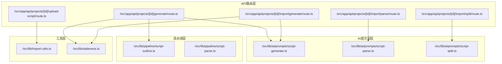
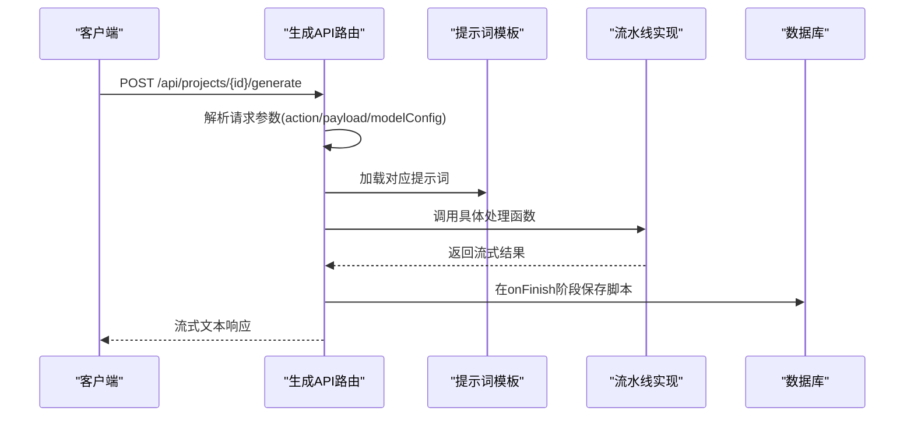
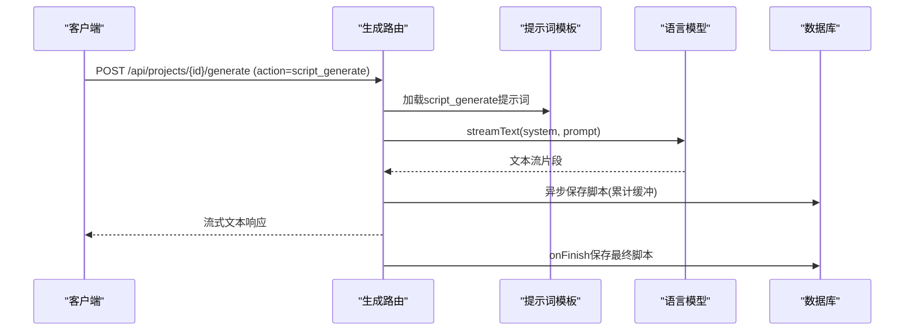
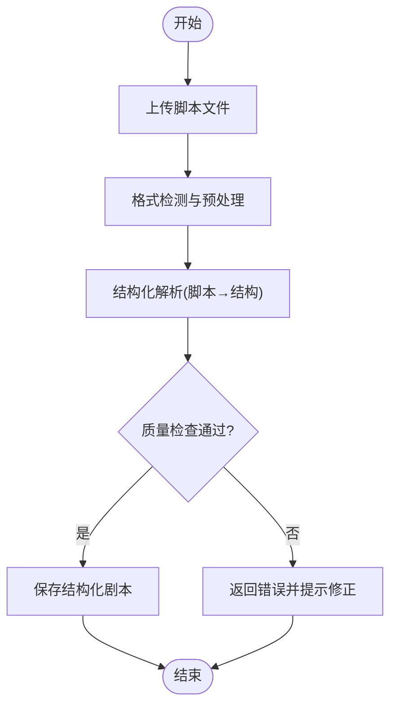
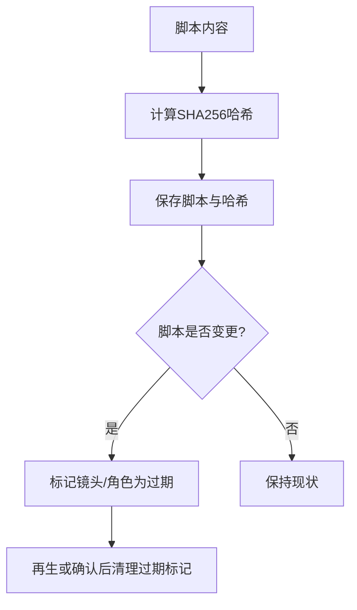
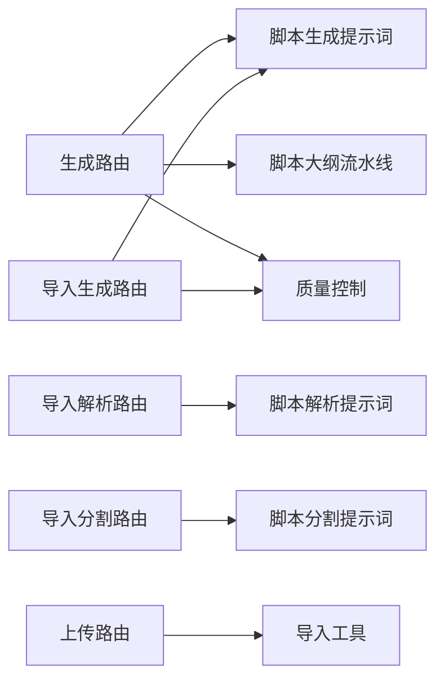

# 脚本生成API

<cite>
**本文档引用的文件**
- [src/app/api/projects/[id]/generate/route.ts](file://src/app/api/projects/[id]/generate/route.ts)
- [src/lib/ai/prompts/script-generate.ts](file://src/lib/ai/prompts/script-generate.ts)
- [src/lib/ai/prompts/script-parse.ts](file://src/lib/ai/prompts/script-parse.ts)
- [src/lib/ai/prompts/script-split.ts](file://src/lib/ai/prompts/script-split.ts)
- [src/lib/pipeline/script-outline.ts](file://src/lib/pipeline/script-outline.ts)
- [src/lib/pipeline/script-parse.ts](file://src/lib/pipeline/script-parse.ts)
- [src/app/api/projects/[id]/import/generate/route.ts](file://src/app/api/projects/[id]/import/generate/route.ts)
- [src/app/api/projects/[id]/import/parse/route.ts](file://src/app/api/projects/[id]/import/parse/route.ts)
- [src/app/api/projects/[id]/import/split/route.ts](file://src/app/api/projects/[id]/import/split/route.ts)
- [src/app/api/projects/[id]/upload-script/route.ts](file://src/app/api/projects/[id]/upload-script/route.ts)
- [src/lib/import-utils.ts](file://src/lib/import-utils.ts)
- [src/lib/staleness.ts](file://src/lib/staleness.ts)
</cite>

## 目录
1. [简介](#简介)
2. [项目结构](#项目结构)
3. [核心组件](#核心组件)
4. [架构概览](#架构概览)
5. [详细组件分析](#详细组件分析)
6. [依赖关系分析](#依赖关系分析)
7. [性能考虑](#性能考虑)
8. [故障排除指南](#故障排除指南)
9. [结论](#结论)
10. [附录](#附录)

## 简介
本文件为AIComicBuilder的脚本生成功能API提供全面技术文档，覆盖从智能脚本生成到导入解析、分割处理及上传管理的完整工作流程。重点记录以下能力：
- 智能脚本生成：基于创意构想与故事大纲生成详细剧本
- 导入解析：支持多种格式的脚本导入与结构化解析
- 分割处理：将连续脚本文本按镜头/场景进行智能分割
- 上传管理：本地脚本文件上传与数据库持久化
- 数据质量控制：脚本哈希校验与下游资产过期标记机制

该API采用流式响应设计，结合多模态大模型与专用提示词模板，确保生成内容的质量与一致性。

## 项目结构
脚本生成相关的核心文件分布于以下模块：
- API路由层：负责HTTP请求处理、参数校验与业务调度
- AI提示词层：提供脚本生成、解析、分割等专用提示词模板
- 流水线层：封装脚本大纲生成、解析与分割的具体实现逻辑
- 工具层：导入工具与脚本过期标记辅助函数

**图表来源**
- [src/app/api/projects/[id]/generate/route.ts](file://src/app/api/projects/[id]/generate/route.ts)
- [src/app/api/projects/[id]/import/generate/route.ts](file://src/app/api/projects/[id]/import/generate/route.ts)
- [src/app/api/projects/[id]/import/parse/route.ts](file://src/app/api/projects/[id]/import/parse/route.ts)
- [src/app/api/projects/[id]/import/split/route.ts](file://src/app/api/projects/[id]/import/split/route.ts)
- [src/app/api/projects/[id]/upload-script/route.ts](file://src/app/api/projects/[id]/upload-script/route.ts)
- [src/lib/ai/prompts/script-generate.ts](file://src/lib/ai/prompts/script-generate.ts)
- [src/lib/ai/prompts/script-parse.ts](file://src/lib/ai/prompts/script-parse.ts)
- [src/lib/ai/prompts/script-split.ts](file://src/lib/ai/prompts/script-split.ts)
- [src/lib/pipeline/script-outline.ts](file://src/lib/pipeline/script-outline.ts)
- [src/lib/pipeline/script-parse.ts](file://src/lib/pipeline/script-parse.ts)
- [src/lib/import-utils.ts](file://src/lib/import-utils.ts)
- [src/lib/staleness.ts](file://src/lib/staleness.ts)

**章节来源**
- [src/app/api/projects/[id]/generate/route.ts](file://src/app/api/projects/[id]/generate/route.ts)
- [src/app/api/projects/[id]/import/generate/route.ts](file://src/app/api/projects/[id]/import/generate/route.ts)
- [src/app/api/projects/[id]/import/parse/route.ts](file://src/app/api/projects/[id]/import/parse/route.ts)
- [src/app/api/projects/[id]/import/split/route.ts](file://src/app/api/projects/[id]/import/split/route.ts)
- [src/app/api/projects/[id]/upload-script/route.ts](file://src/app/api/projects/[id]/upload-script/route.ts)

## 核心组件
- 智能脚本生成器：接收创意构想与可选的大纲，调用语言模型生成详细剧本，并在流式输出过程中实时保存至数据库
- 导入解析器：将用户上传的脚本文本解析为结构化剧本数据，支持多轮对话与错误恢复
- 分割处理器：根据场景/镜头特征对连续文本进行智能分割，生成镜头级脚本片段
- 上传管理器：提供脚本文件上传接口，结合导入工具完成格式检测与预处理
- 质量控制：通过脚本哈希计算与下游资产过期标记，确保变更传播的一致性

**章节来源**
- [src/app/api/projects/[id]/generate/route.ts](file://src/app/api/projects/[id]/generate/route.ts)
- [src/lib/ai/prompts/script-generate.ts](file://src/lib/ai/prompts/script-generate.ts)
- [src/lib/ai/prompts/script-parse.ts](file://src/lib/ai/prompts/script-parse.ts)
- [src/lib/ai/prompts/script-split.ts](file://src/lib/ai/prompts/script-split.ts)
- [src/lib/pipeline/script-outline.ts](file://src/lib/pipeline/script-outline.ts)
- [src/lib/pipeline/script-parse.ts](file://src/lib/pipeline/script-parse.ts)
- [src/app/api/projects/[id]/import/generate/route.ts](file://src/app/api/projects/[id]/import/generate/route.ts)
- [src/app/api/projects/[id]/import/parse/route.ts](file://src/app/api/projects/[id]/import/parse/route.ts)
- [src/app/api/projects/[id]/import/split/route.ts](file://src/app/api/projects/[id]/import/split/route.ts)
- [src/app/api/projects/[id]/upload-script/route.ts](file://src/app/api/projects/[id]/upload-script/route.ts)
- [src/lib/import-utils.ts](file://src/lib/import-utils.ts)
- [src/lib/staleness.ts](file://src/lib/staleness.ts)

## 架构概览
整体架构采用“API路由 → 提示词模板 → 流水线实现 → 数据库”的分层设计，所有生成过程均以流式方式返回，提升用户体验与系统吞吐。

**图表来源**
- [src/app/api/projects/[id]/generate/route.ts](file://src/app/api/projects/[id]/generate/route.ts)
- [src/lib/ai/prompts/script-generate.ts](file://src/lib/ai/prompts/script-generate.ts)
- [src/lib/pipeline/script-outline.ts](file://src/lib/pipeline/script-outline.ts)

## 详细组件分析

### 组件A：智能脚本生成（script_generate）
- 功能概述：根据创意构想与可选大纲生成详细剧本，支持绑定外部智能体平台进行流式生成
- 关键流程：
  - 参数解析：action=script_generate，支持episodeId指定剧集或项目级生成
  - 提示词加载：使用script_generate提示词模板构建系统消息
  - 语言模型调用：通过streamText接口生成文本流
  - 实时保存：在流式传输过程中累积并最终保存至数据库
- 错误处理：捕获智能体调用异常，返回标准化错误信息

**图表来源**
- [src/app/api/projects/[id]/generate/route.ts](file://src/app/api/projects/[id]/generate/route.ts)
- [src/lib/ai/prompts/script-generate.ts](file://src/lib/ai/prompts/script-generate.ts)

**章节来源**
- [src/app/api/projects/[id]/generate/route.ts](file://src/app/api/projects/[id]/generate/route.ts)
- [src/lib/ai/prompts/script-generate.ts](file://src/lib/ai/prompts/script-generate.ts)

### 组件B：脚本大纲生成（script_outline）
- 功能概述：基于创意构想生成初步故事大纲，作为后续详细剧本生成的基础
- 关键流程：
  - 参数解析：action=script_outline，接收创意构想与可选世界设定上下文
  - 提示词加载：使用script_outline提示词模板
  - 语言模型调用：生成大纲文本流
  - 保存策略：与详细生成一致，在流式完成后写入数据库

**章节来源**
- [src/app/api/projects/[id]/generate/route.ts](file://src/app/api/projects/[id]/generate/route.ts)
- [src/lib/pipeline/script-outline.ts](file://src/lib/pipeline/script-outline.ts)

### 组件C：脚本导入与解析（import/parse）
- 功能概述：支持用户上传脚本文件，解析为结构化剧本数据
- 关键流程：
  - 文件上传：通过upload-script接口接收脚本文件
  - 格式检测：利用import-utils进行格式识别与预处理
  - 结构化解析：调用script-parse流水线，将文本转换为镜头/角色/对话结构
  - 错误恢复：解析失败时返回错误信息，允许用户修正后重试
- 输出规范：返回结构化剧本对象，包含场景、镜头、角色与对话等字段

**图表来源**
- [src/app/api/projects/[id]/upload-script/route.ts](file://src/app/api/projects/[id]/upload-script/route.ts)
- [src/lib/import-utils.ts](file://src/lib/import-utils.ts)
- [src/lib/pipeline/script-parse.ts](file://src/lib/pipeline/script-parse.ts)

**章节来源**
- [src/app/api/projects/[id]/upload-script/route.ts](file://src/app/api/projects/[id]/upload-script/route.ts)
- [src/lib/import-utils.ts](file://src/lib/import-utils.ts)
- [src/lib/pipeline/script-parse.ts](file://src/lib/pipeline/script-parse.ts)

### 组件D：脚本分割处理（import/split）
- 功能概述：将连续脚本文本按场景/镜头进行智能分割，生成镜头级脚本片段
- 关键流程：
  - 输入获取：从数据库读取原始脚本文本
  - 分割算法：基于场景标识、角色切换、对话边界等特征进行切分
  - 输出生成：返回镜头列表，每个镜头包含时间范围、画面描述与对话片段
- 质量控制：与导入解析配合，确保分割后的镜头符合视觉呈现要求

**章节来源**
- [src/app/api/projects/[id]/import/split/route.ts](file://src/app/api/projects/[id]/import/split/route.ts)
- [src/lib/ai/prompts/script-split.ts](file://src/lib/ai/prompts/script-split.ts)

### 组件E：脚本上传与持久化
- 功能概述：提供脚本文件上传接口，结合导入工具完成格式检测与预处理
- 关键流程：
  - 接收multipart/form-data，提取脚本文件
  - 调用import-utils进行格式识别与清洗
  - 将处理后的脚本存入数据库，供后续解析与分割使用

**章节来源**
- [src/app/api/projects/[id]/upload-script/route.ts](file://src/app/api/projects/[id]/upload-script/route.ts)
- [src/lib/import-utils.ts](file://src/lib/import-utils.ts)

### 组件F：质量控制与过期标记
- 功能概述：通过脚本哈希计算与下游资产过期标记，确保变更传播的一致性
- 关键流程：
  - 哈希计算：对脚本内容进行SHA256摘要，截取前16位作为标识
  - 过期标记：当脚本更新时，标记相关镜头与角色为“过期”
  - 清理机制：再生或手动确认后清除过期标记

**图表来源**
- [src/lib/staleness.ts](file://src/lib/staleness.ts)

**章节来源**
- [src/lib/staleness.ts](file://src/lib/staleness.ts)

## 依赖关系分析
- API路由依赖提示词模板与流水线实现，形成清晰的职责分离
- 质量控制模块独立存在，通过数据库更新影响下游资产状态
- 导入工具与上传接口紧密协作，确保输入数据的规范化

**图表来源**
- [src/app/api/projects/[id]/generate/route.ts](file://src/app/api/projects/[id]/generate/route.ts)
- [src/app/api/projects/[id]/import/generate/route.ts](file://src/app/api/projects/[id]/import/generate/route.ts)
- [src/app/api/projects/[id]/import/parse/route.ts](file://src/app/api/projects/[id]/import/parse/route.ts)
- [src/app/api/projects/[id]/import/split/route.ts](file://src/app/api/projects/[id]/import/split/route.ts)
- [src/app/api/projects/[id]/upload-script/route.ts](file://src/app/api/projects/[id]/upload-script/route.ts)
- [src/lib/ai/prompts/script-generate.ts](file://src/lib/ai/prompts/script-generate.ts)
- [src/lib/ai/prompts/script-parse.ts](file://src/lib/ai/prompts/script-parse.ts)
- [src/lib/ai/prompts/script-split.ts](file://src/lib/ai/prompts/script-split.ts)
- [src/lib/import-utils.ts](file://src/lib/import-utils.ts)
- [src/lib/staleness.ts](file://src/lib/staleness.ts)

**章节来源**
- [src/app/api/projects/[id]/generate/route.ts](file://src/app/api/projects/[id]/generate/route.ts)
- [src/app/api/projects/[id]/import/generate/route.ts](file://src/app/api/projects/[id]/import/generate/route.ts)
- [src/app/api/projects/[id]/import/parse/route.ts](file://src/app/api/projects/[id]/import/parse/route.ts)
- [src/app/api/projects/[id]/import/split/route.ts](file://src/app/api/projects/[id]/import/split/route.ts)
- [src/app/api/projects/[id]/upload-script/route.ts](file://src/app/api/projects/[id]/upload-script/route.ts)
- [src/lib/ai/prompts/script-generate.ts](file://src/lib/ai/prompts/script-generate.ts)
- [src/lib/ai/prompts/script-parse.ts](file://src/lib/ai/prompts/script-parse.ts)
- [src/lib/ai/prompts/script-split.ts](file://src/lib/ai/prompts/script-split.ts)
- [src/lib/import-utils.ts](file://src/lib/import-utils.ts)
- [src/lib/staleness.ts](file://src/lib/staleness.ts)

## 性能考虑
- 流式响应：所有生成接口采用流式文本响应，降低首字节延迟并提升交互体验
- 批量处理：导入解析支持批量文件处理，减少重复初始化开销
- 缓存策略：脚本哈希用于快速判断变更，避免不必要的下游重算
- 并发控制：建议在高并发场景下限制单次生成任务数量，防止资源争用

## 故障排除指南
- 生成失败：检查智能体平台配置与网络连通性；查看API路由中的错误捕获日志
- 解析异常：确认上传文件格式与编码；参考导入工具的格式检测规则
- 分割不准确：调整提示词模板中的场景识别规则；验证输入文本的结构完整性
- 保存失败：检查数据库连接与权限；关注onFinish回调中的异常信息

**章节来源**
- [src/app/api/projects/[id]/generate/route.ts](file://src/app/api/projects/[id]/generate/route.ts)
- [src/app/api/projects/[id]/import/parse/route.ts](file://src/app/api/projects/[id]/import/parse/route.ts)
- [src/lib/staleness.ts](file://src/lib/staleness.ts)

## 结论
脚本生成API通过清晰的分层设计与完善的质量控制机制，实现了从创意构想到结构化剧本的高效转化。其流式响应与智能体集成提升了生成效率与灵活性，而导入解析与分割处理则保证了内容的可编辑性与可视化适配性。建议在生产环境中结合缓存与并发控制策略，进一步提升系统稳定性与吞吐能力。

## 附录

### API接口清单
- 生成路由
  - 方法：POST
  - 路径：/api/projects/{id}/generate
  - 参数：action（script_outline/script_generate/script_parse/shot_split等）、payload、modelConfig、episodeId
  - 响应：流式文本或JSON错误信息
- 导入生成路由
  - 方法：POST
  - 路径：/api/projects/{id}/import/generate
  - 参数：同上
  - 响应：流式文本
- 导入解析路由
  - 方法：POST
  - 路径：/api/projects/{id}/import/parse
  - 参数：无固定payload，由导入工具决定
  - 响应：结构化剧本对象或错误信息
- 导入分割路由
  - 方法：POST
  - 路径：/api/projects/{id}/import/split
  - 参数：无固定payload，由导入工具决定
  - 响应：镜头列表或错误信息
- 上传脚本路由
  - 方法：POST
  - 路径：/api/projects/{id}/upload-script
  - 参数：multipart/form-data（含脚本文件）
  - 响应：上传结果与处理状态

**章节来源**
- [src/app/api/projects/[id]/generate/route.ts](file://src/app/api/projects/[id]/generate/route.ts)
- [src/app/api/projects/[id]/import/generate/route.ts](file://src/app/api/projects/[id]/import/generate/route.ts)
- [src/app/api/projects/[id]/import/parse/route.ts](file://src/app/api/projects/[id]/import/parse/route.ts)
- [src/app/api/projects/[id]/import/split/route.ts](file://src/app/api/projects/[id]/import/split/route.ts)
- [src/app/api/projects/[id]/upload-script/route.ts](file://src/app/api/projects/[id]/upload-script/route.ts)

### 数据模型与字段定义
- 剧本结构（示例字段）
  - 场景列表：包含场景编号、描述、时长等
  - 镜头列表：包含镜头编号、画面描述、对话片段、角色动作等
  - 角色信息：包含角色名称、出场次数、情感曲线等
  - 对话优化：包含台词调整建议、情感强度标注等
- 质量控制字段
  - 脚本哈希：用于快速比较脚本变更
  - 过期标记：标记镜头与角色是否需要重新生成

**章节来源**
- [src/lib/pipeline/script-parse.ts](file://src/lib/pipeline/script-parse.ts)
- [src/lib/staleness.ts](file://src/lib/staleness.ts)