# 角色管理API

<cite>
**本文档引用的文件**
- [角色列表获取](file://src/app/api/projects/[id]/characters/route.ts)
- [角色详情获取](file://src/app/api/projects/[id]/characters/[characterId]/route.ts)
- [角色更新](file://src/app/api/projects/[id]/characters/[characterId]/route.ts)
- [角色删除](file://src/app/api/projects/[id]/characters/[characterId]/route.ts)
- [角色图片上传](file://src/app/api/projects/[id]/characters/[characterId]/upload/route.ts)
- [角色服装管理](file://src/app/api/projects/[id]/characters/[characterId]/costumes/route.ts)
- [角色关系管理](file://src/app/api/projects/[id]/character-relations/route.ts)
- [角色关系详情](file://src/app/api/projects/[id]/character-relations/[relationId]/route.ts)
- [表情分析](file://src/app/api/projects/[id]/emotion-analysis/route.ts)
- [连续性检查](file://src/app/api/projects/[id]/continuity-check/route.ts)
- [角色导入](file://src/app/api/projects/[id]/import/characters/route.ts)
- [角色下载](file://src/app/api/projects/[id]/download/route.ts)
- [数据库模式定义](file://drizzle/0000_chemical_tyrannus.sql)
- [角色关系表](file://drizzle/0025_add_character_relations.sql)
- [角色图像历史](file://drizzle/0049_add_character_image_history.sql)
- [角色服装集合](file://drizzle/0041_add_costume_sets.sql)
- [角色身高体重](file://drizzle/0039_add_character_height_cm.sql)
- [角色身体类型](file://drizzle/0040_add_character_body_type.sql)
</cite>

## 目录
1. [简介](#简介)
2. [项目结构](#项目结构)
3. [核心组件](#核心组件)
4. [架构概览](#架构概览)
5. [详细组件分析](#详细组件分析)
6. [依赖关系分析](#依赖关系分析)
7. [性能考虑](#性能考虑)
8. [故障排除指南](#故障排除指南)
9. [结论](#结论)

## 简介

AIComicBuilder的角色管理API提供了完整的角色生命周期管理功能，包括角色创建、编辑、删除、图片上传、外观设计、服装管理和历史版本控制。该系统支持角色关系管理、表情分析和连续性检查，为漫画生成提供强大的角色数据支撑。

## 项目结构

角色管理API采用Next.js App Router结构，按照项目-角色-资源的层级组织：

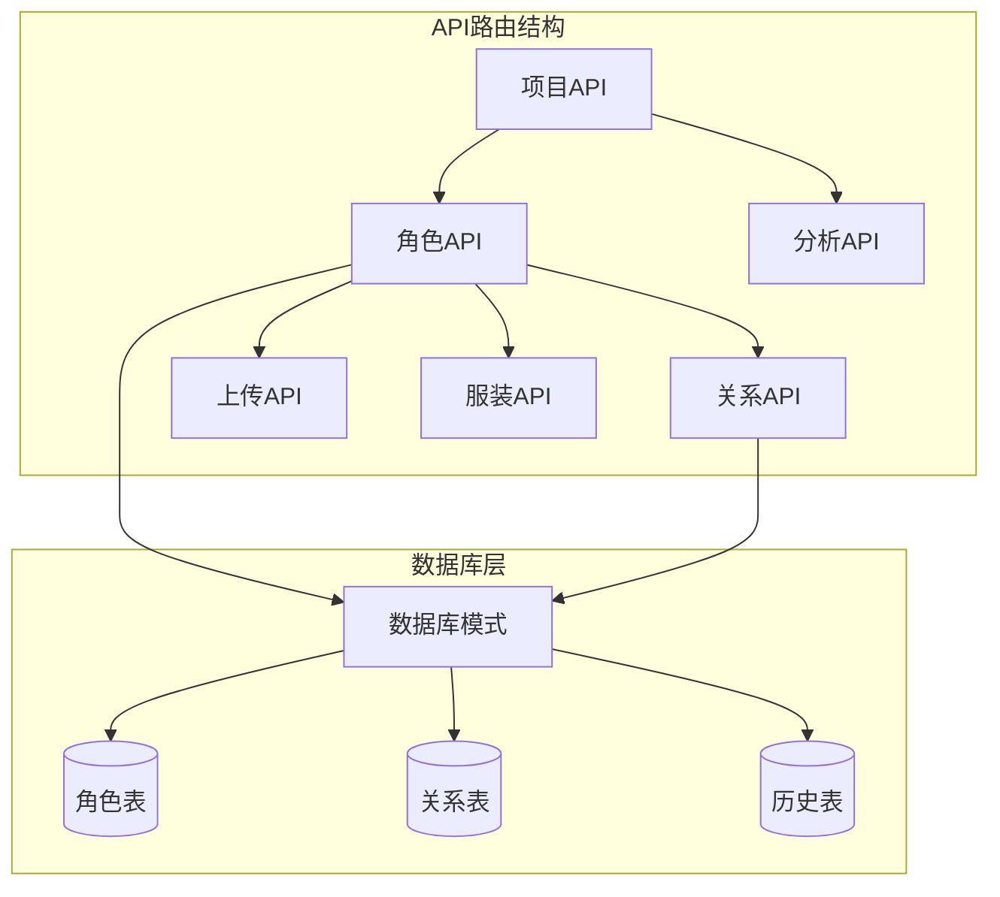

**图表来源**
- [角色列表获取:1-20](file://src/app/api/projects/[id]/characters/route.ts#L1-L20)
- [角色关系管理:1-21](file://src/app/api/projects/[id]/character-relations/route.ts#L1-L21)

**章节来源**
- [角色列表获取:1-20](file://src/app/api/projects/[id]/characters/route.ts#L1-L20)
- [角色关系管理:1-21](file://src/app/api/projects/[id]/character-relations/route.ts#L1-L21)

## 核心组件

### 数据模型架构

角色管理系统基于以下核心数据模型：

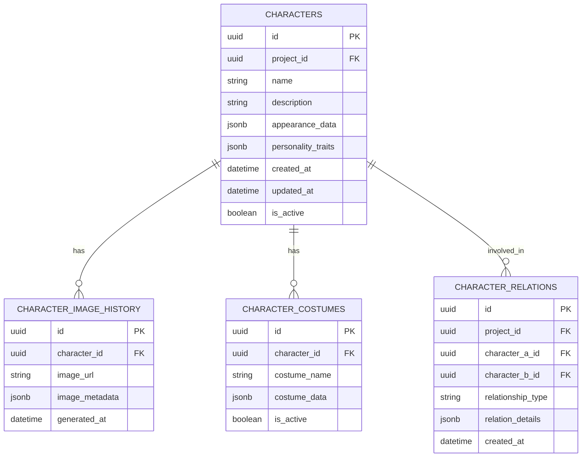

**图表来源**
- [数据库模式定义](file://drizzle/0000_chemical_tyrannus.sql)
- [角色关系表](file://drizzle/0025_add_character_relations.sql)
- [角色图像历史](file://drizzle/0049_add_character_image_history.sql)
- [角色服装集合](file://drizzle/0041_add_costume_sets.sql)

### 核心API接口

| 功能模块 | HTTP方法 | 路径 | 描述 |
|---------|---------|------|------|
| 角色列表 | GET | `/api/projects/[id]/characters` | 获取项目下所有角色 |
| 角色详情 | GET/PUT/DELETE | `/api/projects/[id]/characters/[characterId]` | 获取、更新、删除单个角色 |
| 图片上传 | POST | `/api/projects/[id]/characters/[characterId]/upload` | 上传角色图片 |
| 服装管理 | GET/POST/PUT/DELETE | `/api/projects/[id]/characters/[characterId]/costumes` | 管理角色服装 |
| 关系管理 | GET/POST/PUT/DELETE | `/api/projects/[id]/character-relations` | 管理角色关系 |
| 表情分析 | POST | `/api/projects/[id]/emotion-analysis` | 分析角色表情 |
| 连续性检查 | POST | `/api/projects/[id]/continuity-check` | 检查角色连续性 |

**章节来源**
- [角色列表获取:7-20](file://src/app/api/projects/[id]/characters/route.ts#L7-L20)
- [角色详情获取:1-100](file://src/app/api/projects/[id]/characters/[characterId]/route.ts#L1-L100)
- [角色图片上传:1-100](file://src/app/api/projects/[id]/characters/[characterId]/upload/route.ts#L1-L100)
- [角色服装管理:1-100](file://src/app/api/projects/[id]/characters/[characterId]/costumes/route.ts#L1-L100)
- [角色关系管理:8-21](file://src/app/api/projects/[id]/character-relations/route.ts#L8-L21)

## 架构概览

角色管理API采用分层架构设计，确保功能模块的清晰分离和可维护性：

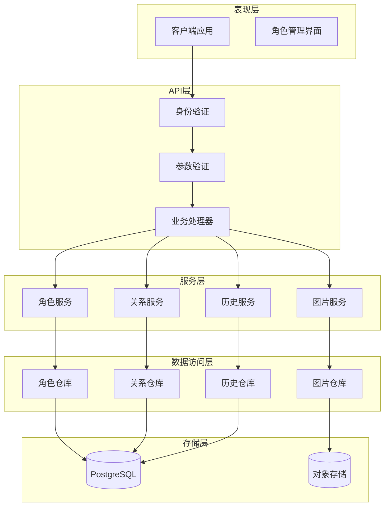

**图表来源**
- [角色列表获取:1-20](file://src/app/api/projects/[id]/characters/route.ts#L1-L20)
- [角色关系管理:1-21](file://src/app/api/projects/[id]/character-relations/route.ts#L1-L21)

## 详细组件分析

### 角色管理核心功能

#### 角色创建与编辑流程

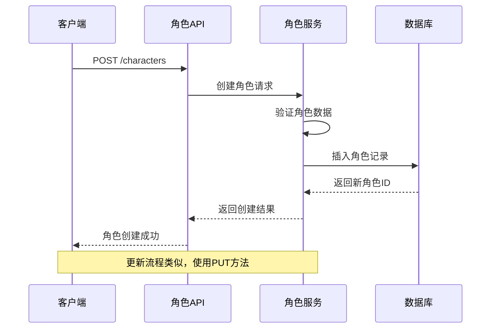

**图表来源**
- [角色详情获取:1-100](file://src/app/api/projects/[id]/characters/[characterId]/route.ts#L1-L100)

#### 角色图片上传处理

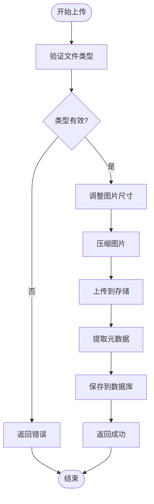

**图表来源**
- [角色图片上传:1-100](file://src/app/api/projects/[id]/characters/[characterId]/upload/route.ts#L1-L100)

**章节来源**
- [角色详情获取:1-100](file://src/app/api/projects/[id]/characters/[characterId]/route.ts#L1-L100)
- [角色图片上传:1-100](file://src/app/api/projects/[id]/characters/[characterId]/upload/route.ts#L1-L100)

### 角色外观设计系统

#### 外观数据结构

角色外观设计支持以下属性配置：

| 属性类别 | 字段名称 | 数据类型 | 描述 |
|---------|---------|---------|------|
| 基本信息 | name | string | 角色姓名 |
| 基本信息 | age | number | 角色年龄 |
| 身体特征 | height_cm | number | 身高(厘米) |
| 身体特征 | body_type | string | 身体类型 |
| 外观描述 | skin_tone | string | 肤色 |
| 外观描述 | hair_color | string | 发色 |
| 外观描述 | eye_color | string | 眼睛颜色 |
| 服装偏好 | preferred_colors | array | 偏好颜色 |
| 服装偏好 | clothing_style | string | 服装风格 |
| 性格特征 | personality_traits | object | 性格特征JSON |

**章节来源**
- [角色身高体重](file://drizzle/0039_add_character_height_cm.sql)
- [角色身体类型](file://drizzle/0040_add_character_body_type.sql)

### 服装管理系统

#### 服装数据模型

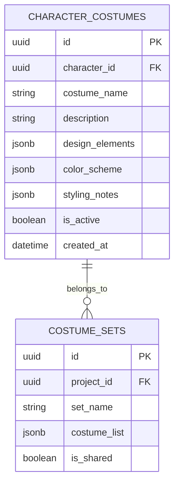

**图表来源**
- [角色服装集合](file://drizzle/0041_add_costume_sets.sql)

**章节来源**
- [角色服装管理:1-100](file://src/app/api/projects/[id]/characters/[characterId]/costumes/route.ts#L1-L100)

### 历史版本控制系统

#### 版本追踪机制

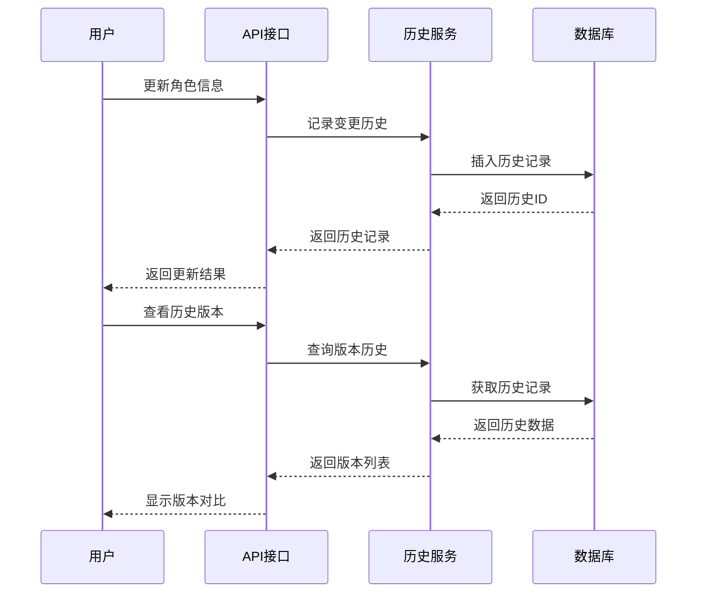

**图表来源**
- [角色图像历史](file://drizzle/0049_add_character_image_history.sql)

**章节来源**
- [角色图像历史](file://drizzle/0049_add_character_image_history.sql)

### 角色关系管理系统

#### 关系数据模型

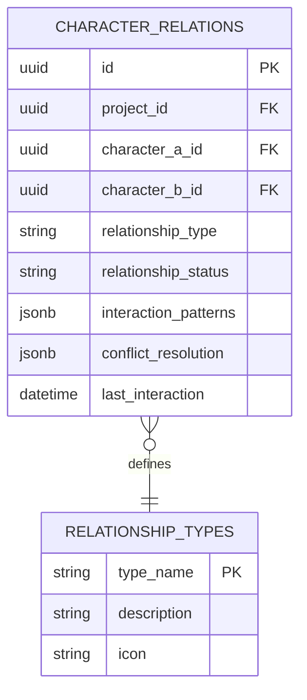

**图表来源**
- [角色关系表](file://drizzle/0025_add_character_relations.sql)

**章节来源**
- [角色关系管理:8-21](file://src/app/api/projects/[id]/character-relations/route.ts#L8-L21)
- [角色关系详情:1-100](file://src/app/api/projects/[id]/character-relations/[relationId]/route.ts#L1-L100)

### 表情分析与连续性检查

#### 表情分析流程

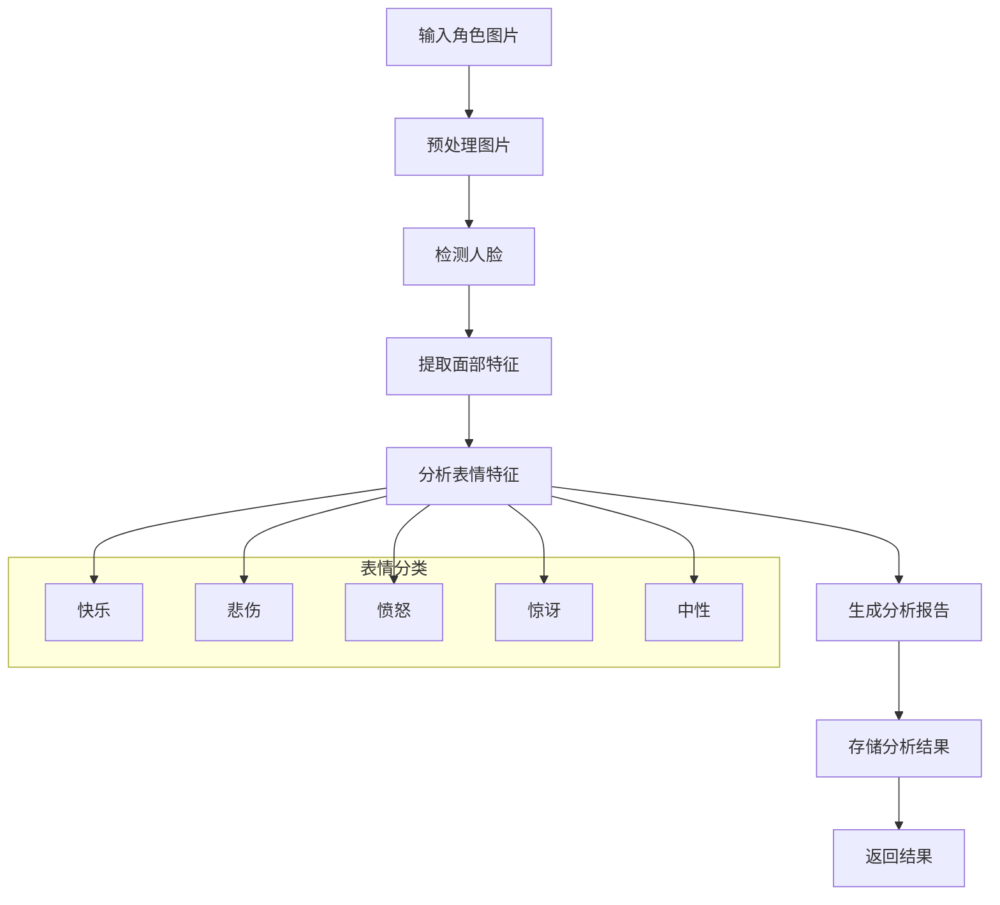

**图表来源**
- [表情分析:1-100](file://src/app/api/projects/[id]/emotion-analysis/route.ts#L1-L100)

**章节来源**
- [表情分析:1-100](file://src/app/api/projects/[id]/emotion-analysis/route.ts#L1-L100)

#### 连续性检查算法

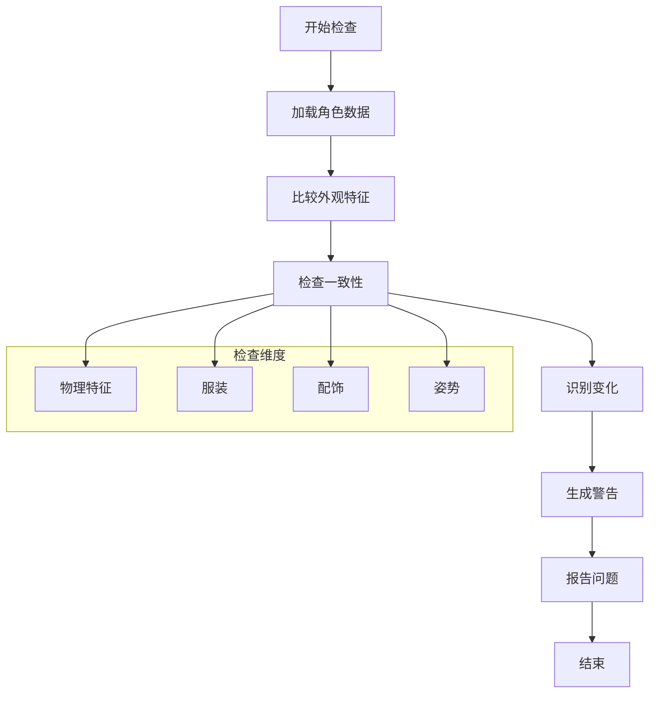

**图表来源**
- [连续性检查:1-100](file://src/app/api/projects/[id]/continuity-check/route.ts#L1-L100)

**章节来源**
- [连续性检查:1-100](file://src/app/api/projects/[id]/continuity-check/route.ts#L1-L100)

### 批量操作与导入导出

#### 导入流程

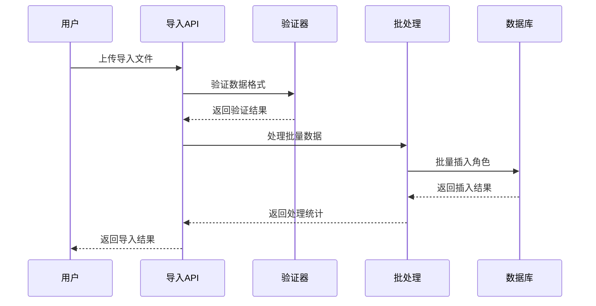

**图表来源**
- [角色导入:1-100](file://src/app/api/projects/[id]/import/characters/route.ts#L1-L100)

**章节来源**
- [角色导入:1-100](file://src/app/api/projects/[id]/import/characters/route.ts#L1-L100)
- [角色下载:1-100](file://src/app/api/projects/[id]/download/route.ts#L1-L100)

## 依赖关系分析

角色管理API的依赖关系体现了清晰的关注点分离：

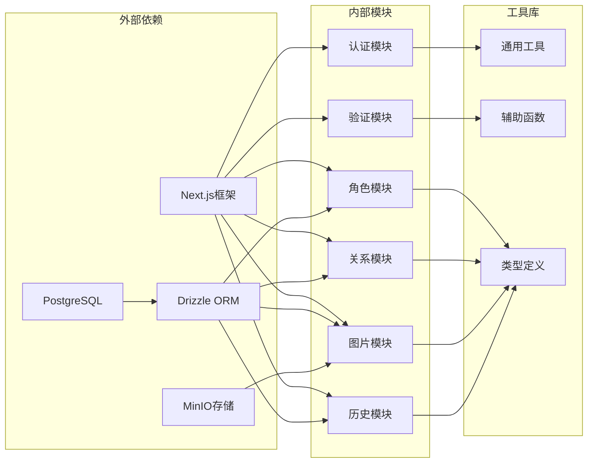

**图表来源**
- [角色列表获取:1-20](file://src/app/api/projects/[id]/characters/route.ts#L1-L20)
- [角色关系管理:1-21](file://src/app/api/projects/[id]/character-relations/route.ts#L1-L21)

**章节来源**
- [角色列表获取:1-20](file://src/app/api/projects/[id]/characters/route.ts#L1-L20)
- [角色关系管理:1-21](file://src/app/api/projects/[id]/character-relations/route.ts#L1-L21)

## 性能考虑

### 数据库优化策略

1. **索引优化**
   - 为项目ID建立复合索引
   - 为角色名称建立全文索引
   - 为关系类型建立分类索引

2. **查询优化**
   - 使用连接查询减少N+1问题
   - 实施分页查询处理大数据集
   - 缓存常用查询结果

3. **存储优化**
   - 图片按分辨率分级存储
   - 压缩历史数据减少存储空间
   - 实施数据归档策略

### API性能优化

1. **并发控制**
   - 实施请求限流防止滥用
   - 使用异步处理大文件上传
   - 实现批量操作队列

2. **缓存策略**
   - Redis缓存热点数据
   - CDN加速静态资源
   - 智能缓存失效机制

## 故障排除指南

### 常见问题及解决方案

| 问题类型 | 症状 | 可能原因 | 解决方案 |
|---------|------|---------|---------|
| 权限错误 | 403 Forbidden | 无项目访问权限 | 检查用户项目绑定 |
| 数据验证 | 400 Bad Request | 请求数据格式错误 | 验证JSON结构 |
| 文件上传 | 500 Internal Error | 存储空间不足 | 检查存储配额 |
| 数据库连接 | 503 Service Unavailable | 连接池耗尽 | 增加连接数配置 |
| 内存溢出 | 500 Internal Error | 大文件处理 | 实施流式处理 |

### 错误处理机制

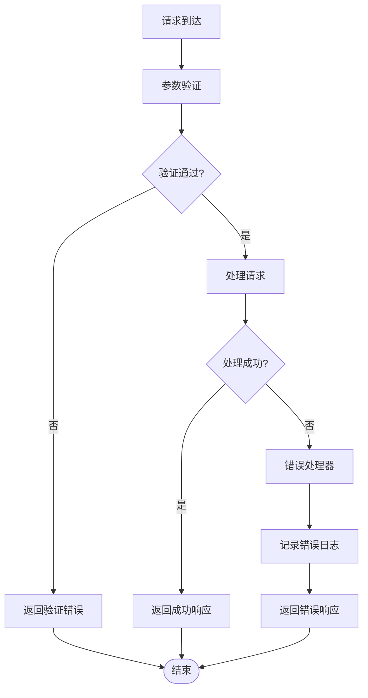

**章节来源**
- [角色列表获取:12-14](file://src/app/api/projects/[id]/characters/route.ts#L12-L14)
- [角色关系管理:13-14](file://src/app/api/projects/[id]/character-relations/route.ts#L13-L14)

## 结论

AIComicBuilder的角色管理API提供了完整的角色生命周期管理解决方案，具有以下特点：

1. **模块化设计**：清晰的分层架构确保了系统的可维护性和扩展性
2. **功能完整性**：覆盖角色管理的所有核心需求，包括外观设计、服装管理和历史版本控制
3. **性能优化**：采用多种优化策略确保系统在高负载下的稳定性
4. **安全性保障**：完善的权限控制和数据验证机制保护系统安全
5. **用户体验**：直观的API设计和详细的错误处理提升开发体验

该API为漫画生成系统提供了坚实的角色数据基础，支持复杂的角色关系管理和智能分析功能，是构建高质量AI漫画作品的重要基础设施。