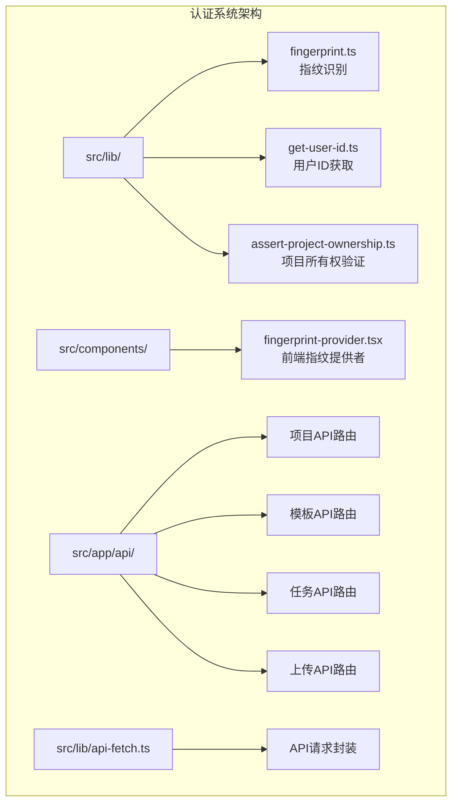
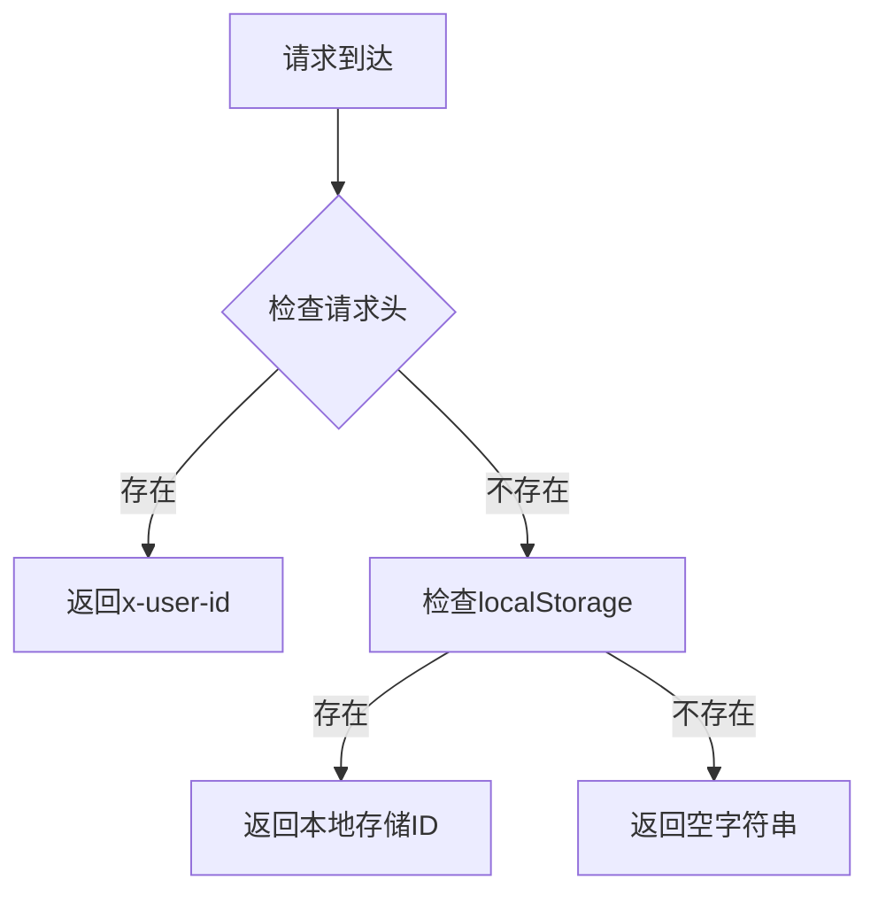
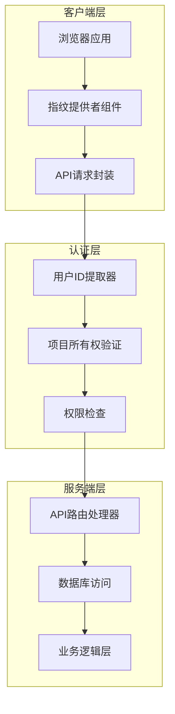
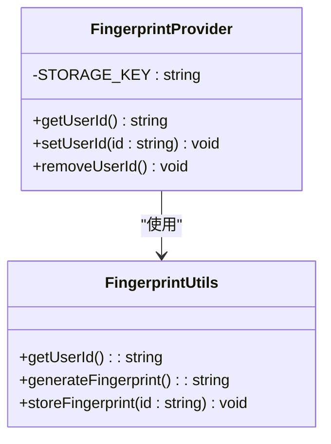
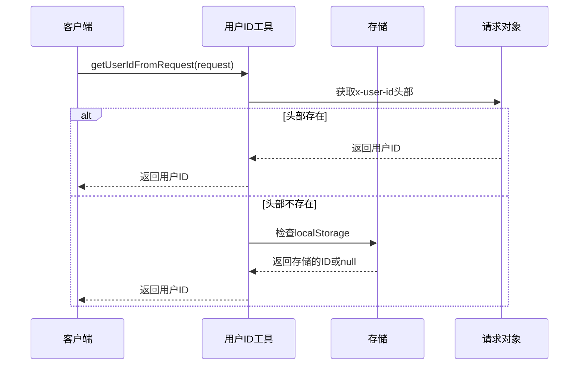
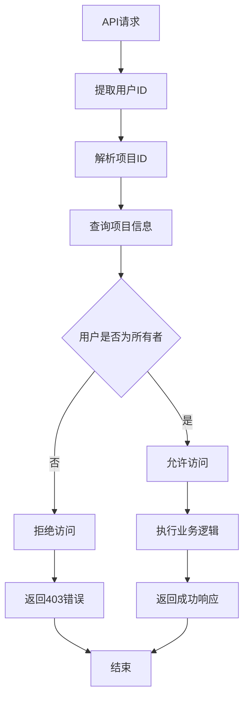
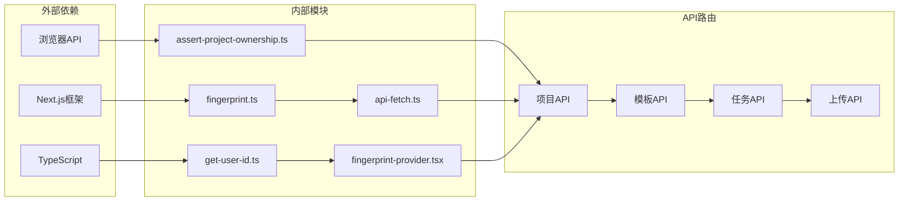

# 认证与授权API

<cite>
**本文档引用的文件**
- [fingerprint.ts](file://src/lib/fingerprint.ts)
- [get-user-id.ts](file://src/lib/get-user-id.ts)
- [assert-project-ownership.ts](file://src/lib/assert-project-ownership.ts)
- [fingerprint-provider.tsx](file://src/components/fingerprint-provider.tsx)
- [api-fetch.ts](file://src/lib/api-fetch.ts)
- [route.ts](file://src/app/api/projects/route.ts)
- [route.ts](file://src/app/api/projects/[id]/route.ts)
- [route.ts](file://src/app/api/projects/[id]/characters/route.ts)
- [route.ts](file://src/app/api/projects/[id]/episodes/route.ts)
- [route.ts](file://src/app/api/projects/[id]/shots/route.ts)
- [route.ts](file://src/app/api/prompt-templates/route.ts)
- [route.ts](file://src/app/api/prompt-templates/[promptKey]/route.ts)
- [route.ts](file://src/app/api/tasks/[id]/route.ts)
- [route.ts](file://src/app/api/uploads/[...path]/route.ts)
</cite>

## 目录
1. [简介](#简介)
2. [项目结构](#项目结构)
3. [核心组件](#核心组件)
4. [架构概览](#架构概览)
5. [详细组件分析](#详细组件分析)
6. [依赖关系分析](#依赖关系分析)
7. [性能考虑](#性能考虑)
8. [故障排除指南](#故障排除指南)
9. [结论](#结论)

## 简介

AIComicBuilder的认证与授权系统采用基于用户ID的简单认证机制，通过HTTP头部传递用户标识符来实现用户身份验证。该系统设计简洁，主要依赖于客户端指纹识别和服务器端的项目所有权验证来确保访问控制。

## 项目结构

认证与授权系统主要分布在以下目录中：

**图表来源**
- [fingerprint.ts:1-10](file://src/lib/fingerprint.ts#L1-L10)
- [get-user-id.ts:1-3](file://src/lib/get-user-id.ts#L1-L3)
- [fingerprint-provider.tsx](file://src/components/fingerprint-provider.tsx)

**章节来源**
- [fingerprint.ts:1-10](file://src/lib/fingerprint.ts#L1-L10)
- [get-user-id.ts:1-3](file://src/lib/get-user-id.ts#L1-L3)
- [fingerprint-provider.tsx](file://src/components/fingerprint-provider.tsx)

## 核心组件

### 指纹识别机制

系统使用localStorage存储用户唯一标识符，通过以下方式实现：

- **存储键名**: `ai_comic_uid`
- **存储位置**: 客户端浏览器localStorage
- **同步机制**: 由中间件设置cookie，FingerprintProvider同步到localStorage

### 用户ID获取

提供统一的用户ID获取接口：

**图表来源**
- [get-user-id.ts:1-3](file://src/lib/get-user-id.ts#L1-L3)

### 项目所有权验证

系统通过断言函数验证用户对项目的访问权限：

- 验证当前用户是否为项目所有者
- 拒绝非所有者的访问请求
- 提供统一的权限检查接口

**章节来源**
- [fingerprint.ts:1-10](file://src/lib/fingerprint.ts#L1-L10)
- [get-user-id.ts:1-3](file://src/lib/get-user-id.ts#L1-L3)
- [assert-project-ownership.ts](file://src/lib/assert-project-ownership.ts)

## 架构概览

**图表来源**
- [fingerprint-provider.tsx](file://src/components/fingerprint-provider.tsx)
- [api-fetch.ts](file://src/lib/api-fetch.ts)
- [assert-project-ownership.ts](file://src/lib/assert-project-ownership.ts)

## 详细组件分析

### 指纹识别组件

指纹识别组件负责在客户端生成和管理用户唯一标识符：

**图表来源**
- [fingerprint.ts:1-10](file://src/lib/fingerprint.ts#L1-L10)
- [fingerprint-provider.tsx](file://src/components/fingerprint-provider.tsx)

### 用户ID获取工具

用户ID获取工具提供统一的用户身份识别接口：

**图表来源**
- [get-user-id.ts:1-3](file://src/lib/get-user-id.ts#L1-L3)

### 权限控制系统

权限控制系统确保用户只能访问自己的项目资源：

**图表来源**
- [assert-project-ownership.ts](file://src/lib/assert-project-ownership.ts)

**章节来源**
- [fingerprint.ts:1-10](file://src/lib/fingerprint.ts#L1-L10)
- [get-user-id.ts:1-3](file://src/lib/get-user-id.ts#L1-L3)
- [assert-project-ownership.ts](file://src/lib/assert-project-ownership.ts)

### API路由认证

系统中的各个API路由都遵循统一的认证模式：

#### 项目相关API

| 路径 | 方法 | 功能 | 认证要求 |
|------|------|------|----------|
| `/api/projects` | GET/POST | 项目列表/创建 | 需要用户ID |
| `/api/projects/[id]` | GET/PUT/DELETE | 项目详情/更新/删除 | 需要项目所有权 |
| `/api/projects/[id]/characters` | GET/POST | 角色管理 | 需要项目所有权 |
| `/api/projects/[id]/episodes` | GET/POST | 剧集管理 | 需要项目所有权 |
| `/api/projects/[id]/shots` | GET/POST | 镜头管理 | 需要项目所有权 |

#### 模板相关API

| 路径 | 方法 | 功能 | 认证要求 |
|------|------|------|----------|
| `/api/prompt-templates` | GET/POST | 模板列表/创建 | 需要用户ID |
| `/api/prompt-templates/[key]` | GET/PUT/DELETE | 模板详情/更新/删除 | 需要模板所有权 |

#### 其他API

| 路径 | 方法 | 功能 | 认证要求 |
|------|------|------|----------|
| `/api/tasks/[id]` | GET | 任务状态查询 | 需要任务所有权 |
| `/api/uploads/[...path]` | POST | 文件上传 | 需要项目所有权 |

**章节来源**
- [route.ts](file://src/app/api/projects/route.ts)
- [route.ts](file://src/app/api/projects/[id]/route.ts)
- [route.ts](file://src/app/api/projects/[id]/characters/route.ts)
- [route.ts](file://src/app/api/projects/[id]/episodes/route.ts)
- [route.ts](file://src/app/api/projects/[id]/shots/route.ts)
- [route.ts](file://src/app/api/prompt-templates/route.ts)
- [route.ts](file://src/app/api/prompt-templates/[promptKey]/route.ts)
- [route.ts](file://src/app/api/tasks/[id]/route.ts)
- [route.ts](file://src/app/api/uploads/[...path]/route.ts)

## 依赖关系分析

**图表来源**
- [fingerprint.ts:1-10](file://src/lib/fingerprint.ts#L1-L10)
- [get-user-id.ts:1-3](file://src/lib/get-user-id.ts#L1-L3)
- [assert-project-ownership.ts](file://src/lib/assert-project-ownership.ts)
- [api-fetch.ts](file://src/lib/api-fetch.ts)
- [fingerprint-provider.tsx](file://src/components/fingerprint-provider.tsx)

**章节来源**
- [fingerprint.ts:1-10](file://src/lib/fingerprint.ts#L1-L10)
- [get-user-id.ts:1-3](file://src/lib/get-user-id.ts#L1-L3)
- [assert-project-ownership.ts](file://src/lib/assert-project-ownership.ts)
- [api-fetch.ts](file://src/lib/api-fetch.ts)

## 性能考虑

### 认证性能优化

1. **缓存策略**: 用户ID在localStorage中缓存，避免重复获取
2. **异步处理**: 认证检查采用异步方式，不影响主流程
3. **最小化网络请求**: 通过请求头传递用户ID，减少额外的认证请求

### 内存管理

- 合理使用localStorage，避免存储过多数据
- 及时清理过期的用户标识符
- 监控内存使用情况，防止内存泄漏

## 故障排除指南

### 常见认证问题

#### 问题1: 用户ID为空
**症状**: 所有API调用返回401错误
**解决方案**:
1. 检查浏览器是否支持localStorage
2. 验证中间件是否正确设置cookie
3. 确认FingerprintProvider组件正常工作

#### 问题2: 权限拒绝
**症状**: 访问项目资源返回403错误
**解决方案**:
1. 验证用户是否为项目所有者
2. 检查项目ID是否正确
3. 确认数据库中的所有权记录

#### 问题3: 跨域问题
**症状**: API请求被浏览器阻止
**解决方案**:
1. 配置正确的CORS设置
2. 确保请求头包含必要的认证信息
3. 验证域名配置

**章节来源**
- [fingerprint.ts:1-10](file://src/lib/fingerprint.ts#L1-L10)
- [get-user-id.ts:1-3](file://src/lib/get-user-id.ts#L1-L3)
- [assert-project-ownership.ts](file://src/lib/assert-project-ownership.ts)

## 结论

AIComicBuilder的认证与授权系统采用简洁而有效的设计，通过基于用户ID的简单认证机制实现了基本的访问控制需求。系统的主要优势包括：

1. **简单易用**: 基于HTTP头部的认证方式简单直观
2. **性能良好**: 使用localStorage缓存用户ID，减少网络开销
3. **扩展性强**: 统一的认证接口便于添加新的认证方式
4. **安全性**: 通过项目所有权验证确保资源访问安全

建议在未来版本中考虑添加更多高级认证功能，如API密钥管理、访问令牌刷新机制等，以满足更复杂的安全需求。