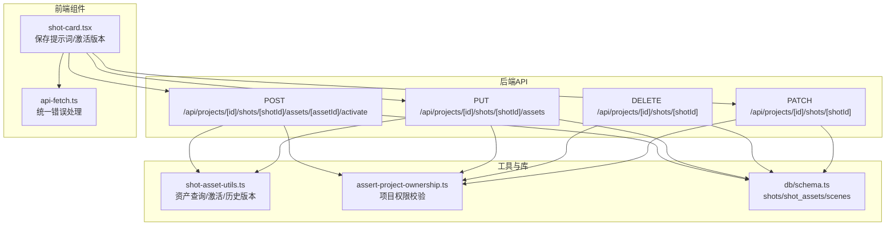
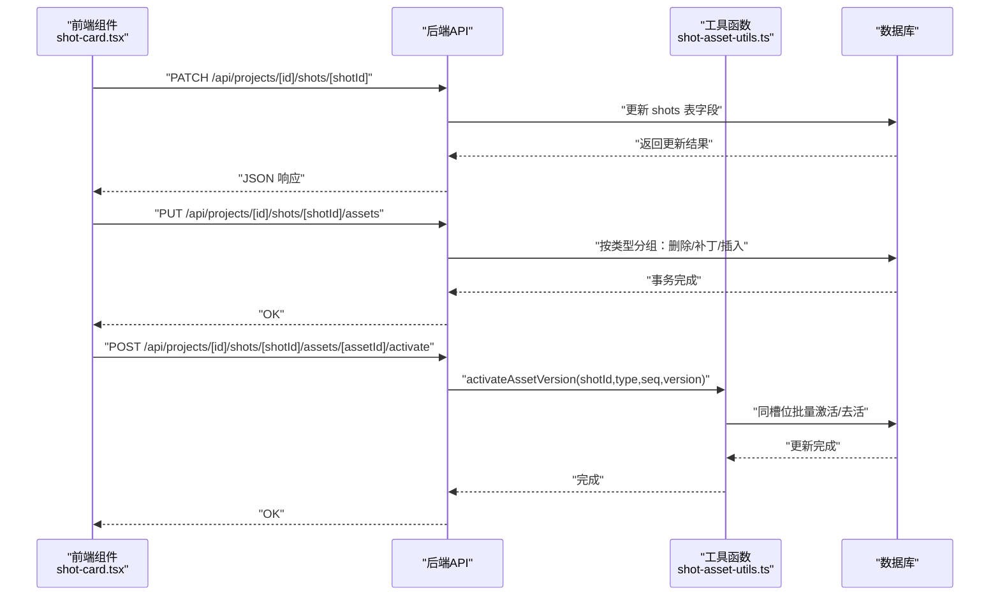
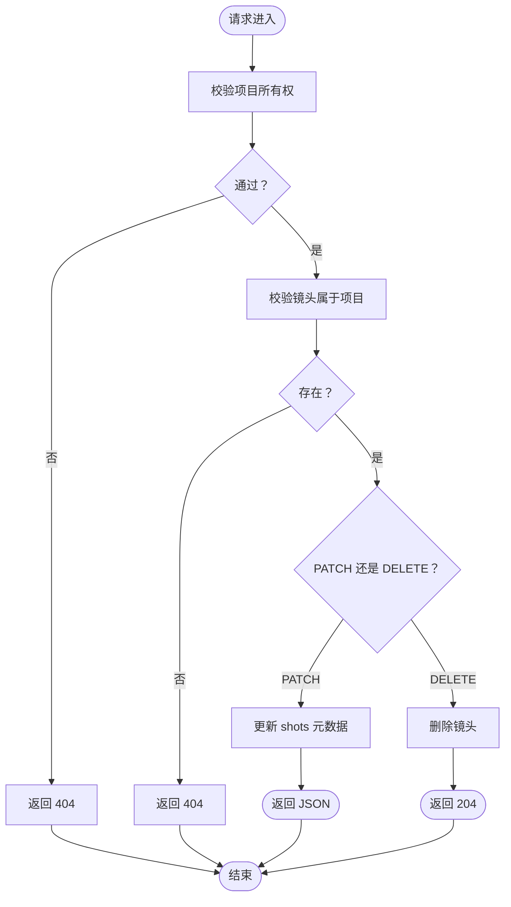
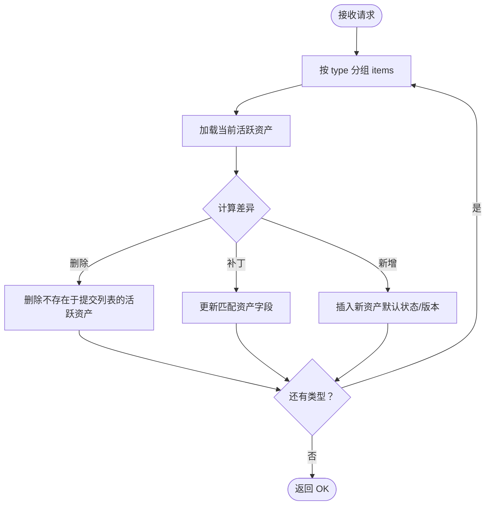
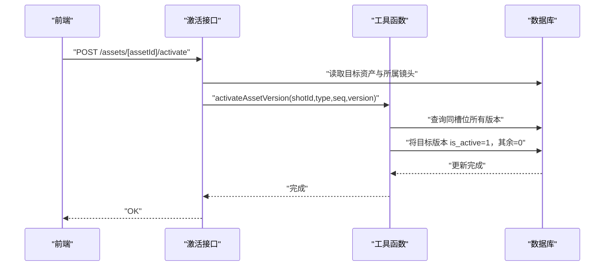
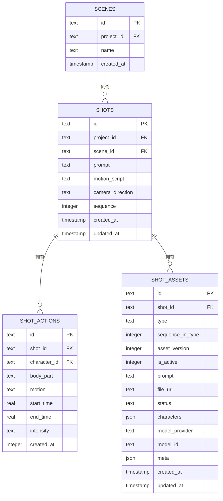
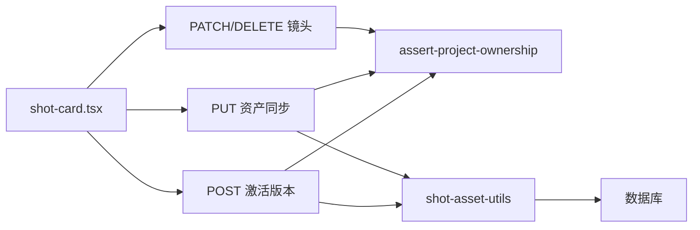

# 镜头管理API

<cite>
**本文档引用的文件**
- [src/app/api/projects/[id]/shots/[shotId]/assets/route.ts](file://src/app/api/projects/[id]/shots/[shotId]/assets/route.ts)
- [src/app/api/projects/[id]/shots/[shotId]/route.ts](file://src/app/api/projects/[id]/shots/[shotId]/route.ts)
- [src/app/api/projects/[id]/shots/[shotId]/assets/[assetId]/activate/route.ts](file://src/app/api/projects/[id]/shots/[shotId]/assets/[assetId]/activate/route.ts)
- [src/lib/shot-asset-utils.ts](file://src/lib/shot-asset-utils.ts)
- [src/lib/api-fetch.ts](file://src/lib/api-fetch.ts)
- [src/components/editor/shot-card.tsx](file://src/components/editor/shot-card.tsx)
- [drizzle/0027_add_shot_scene_id.sql](file://drizzle/0027_add_shot_scene_id.sql)
- [drizzle/0046_add_shot_actions.sql](file://drizzle/0046_add_shot_actions.sql)
- [drizzle/0005_add_scene_ref_frame.sql](file://drizzle/0005_add_scene_ref_frame.sql)
- [src/app/api/projects/[id]/generate/route.ts](file://src/app/api/projects/[id]/generate/route.ts)
</cite>

## 目录
1. [简介](#简介)
2. [项目结构](#项目结构)
3. [核心组件](#核心组件)
4. [架构总览](#架构总览)
5. [详细组件分析](#详细组件分析)
6. [依赖关系分析](#依赖关系分析)
7. [性能考虑](#性能考虑)
8. [故障排除指南](#故障排除指南)
9. [结论](#结论)
10. [附录](#附录)

## 简介
本文件系统性梳理 AIComicBuilder 的镜头（Shot）管理 API，覆盖以下能力：
- 镜头元数据的创建、编辑与删除
- 镜头资产的上传、同步、激活与版本切换
- 镜头与场景（Scene）的映射关系
- 动作设计（Shot Actions）与关键帧管理
- 镜头状态管理、过期标记与性能优化的后端实现思路
- 镜头数据结构、字段定义与关联关系

该文档面向开发者与产品人员，既提供代码级实现细节，也给出可操作的流程图与最佳实践建议。

## 项目结构
与镜头管理直接相关的后端路由集中在 `src/app/api/projects/[id]/shots` 下，前端交互组件位于 `src/components/editor`，数据库模式变更在 `drizzle` 目录中维护。

图表来源
- [src/app/api/projects/[id]/shots/[shotId]/route.ts](file://src/app/api/projects/[id]/shots/[shotId]/route.ts#L15-L84)
- [src/app/api/projects/[id]/shots/[shotId]/assets/route.ts](file://src/app/api/projects/[id]/shots/[shotId]/assets/route.ts#L1-L142)
- [src/app/api/projects/[id]/shots/[shotId]/assets/[assetId]/activate/route.ts](file://src/app/api/projects/[id]/shots/[shotId]/assets/[assetId]/activate/route.ts#L1-L55)
- [src/lib/shot-asset-utils.ts:48-285](file://src/lib/shot-asset-utils.ts#L48-L285)
- [src/components/editor/shot-card.tsx:465-511](file://src/components/editor/shot-card.tsx#L465-L511)
- [src/lib/api-fetch.ts:1-24](file://src/lib/api-fetch.ts#L1-L24)

章节来源
- [src/app/api/projects/[id]/shots/[shotId]/route.ts](file://src/app/api/projects/[id]/shots/[shotId]/route.ts#L1-L99)
- [src/app/api/projects/[id]/shots/[shotId]/assets/route.ts](file://src/app/api/projects/[id]/shots/[shotId]/assets/route.ts#L1-L142)
- [src/app/api/projects/[id]/shots/[shotId]/assets/[assetId]/activate/route.ts](file://src/app/api/projects/[id]/shots/[shotId]/assets/[assetId]/activate/route.ts#L1-L55)
- [src/lib/shot-asset-utils.ts:48-285](file://src/lib/shot-asset-utils.ts#L48-L285)
- [src/components/editor/shot-card.tsx:465-511](file://src/components/editor/shot-card.tsx#L465-L511)
- [src/lib/api-fetch.ts:1-24](file://src/lib/api-fetch.ts#L1-L24)

## 核心组件
- 镜头元数据管理：支持 PATCH 更新镜头元数据，DELETE 删除镜头；仅更新 shots 表字段，不涉及资产。
- 镜头资产同步：PUT 批量同步指定类型的资产列表，按类型分组进行补丁、插入与删除，确保与提交内容一致。
- 资产激活与版本切换：POST 激活特定资产版本，使同一“镜头+类型+序列”槽位只保留一个活跃版本。
- 工具函数：提供资产查询、历史版本检索、版本激活等通用能力。
- 前端集成：通过统一的 api-fetch 错误处理，调用后端接口完成保存与版本切换。

章节来源
- [src/app/api/projects/[id]/shots/[shotId]/route.ts](file://src/app/api/projects/[id]/shots/[shotId]/route.ts#L15-L99)
- [src/app/api/projects/[id]/shots/[shotId]/assets/route.ts](file://src/app/api/projects/[id]/shots/[shotId]/assets/route.ts#L1-L142)
- [src/app/api/projects/[id]/shots/[shotId]/assets/[assetId]/activate/route.ts](file://src/app/api/projects/[id]/shots/[shotId]/assets/[assetId]/activate/route.ts#L1-L55)
- [src/lib/shot-asset-utils.ts:48-285](file://src/lib/shot-asset-utils.ts#L48-L285)
- [src/lib/api-fetch.ts:1-24](file://src/lib/api-fetch.ts#L1-L24)

## 架构总览
下图展示从 UI 到后端 API 再到数据库的调用链路，以及资产版本管理的关键路径。

图表来源
- [src/components/editor/shot-card.tsx:465-511](file://src/components/editor/shot-card.tsx#L465-L511)
- [src/app/api/projects/[id]/shots/[shotId]/route.ts](file://src/app/api/projects/[id]/shots/[shotId]/route.ts#L15-L99)
- [src/app/api/projects/[id]/shots/[shotId]/assets/route.ts](file://src/app/api/projects/[id]/shots/[shotId]/assets/route.ts#L1-L142)
- [src/app/api/projects/[id]/shots/[shotId]/assets/[assetId]/activate/route.ts](file://src/app/api/projects/[id]/shots/[shotId]/assets/[assetId]/activate/route.ts#L1-L55)
- [src/lib/shot-asset-utils.ts:249-275](file://src/lib/shot-asset-utils.ts#L249-L275)

## 详细组件分析

### 镜头元数据管理
- PATCH 更新镜头元数据：仅允许更新 shots 表中的元数据字段，不涉及资产表。
- DELETE 删除镜头：校验项目所有权与镜头归属后执行删除。

图表来源
- [src/app/api/projects/[id]/shots/[shotId]/route.ts](file://src/app/api/projects/[id]/shots/[shotId]/route.ts#L15-L99)

章节来源
- [src/app/api/projects/[id]/shots/[shotId]/route.ts](file://src/app/api/projects/[id]/shots/[shotId]/route.ts#L15-L99)

### 镜头资产同步（上传与批量更新）
- 请求体：按资产类型分组的数组，每项可包含 id（已有资产）、type、sequenceInType、prompt、characters、fileUrl、status。
- 同步逻辑：
  - 对每个类型分组：
    - 删除：若现有活跃资产不在提交列表中，则删除。
    - 补丁：对已存在资产按需更新 prompt/characters/fileUrl/status/sequenceInType。
    - 插入：对无 id 的新条目插入默认状态与版本。
- 返回：统一返回成功响应。

图表来源
- [src/app/api/projects/[id]/shots/[shotId]/assets/route.ts](file://src/app/api/projects/[id]/shots/[shotId]/assets/route.ts#L1-L142)

章节来源
- [src/app/api/projects/[id]/shots/[shotId]/assets/route.ts](file://src/app/api/projects/[id]/shots/[shotId]/assets/route.ts#L1-L142)

### 资产激活与版本控制
- 单条资产激活：POST 将目标资产设为活跃，同时将同槽位其他版本去活。
- 版本历史：同一“镜头+类型+序列”槽位可有多版本资产，通过版本号区分。
- 历史查询：可获取某槽位全部历史版本，用于 UI 上的历史版本切换。

图表来源
- [src/app/api/projects/[id]/shots/[shotId]/assets/[assetId]/activate/route.ts](file://src/app/api/projects/[id]/shots/[shotId]/assets/[assetId]/activate/route.ts#L1-L55)
- [src/lib/shot-asset-utils.ts:249-275](file://src/lib/shot-asset-utils.ts#L249-L275)

章节来源
- [src/app/api/projects/[id]/shots/[shotId]/assets/[assetId]/activate/route.ts](file://src/app/api/projects/[id]/shots/[shotId]/assets/[assetId]/activate/route.ts#L1-L55)
- [src/lib/shot-asset-utils.ts:48-285](file://src/lib/shot-asset-utils.ts#L48-L285)

### 前端集成与错误处理
- 统一错误处理：api-fetch 在响应非 OK 时抛出 ApiError，并尝试解析错误消息。
- 前端调用示例：保存关键帧提示词、同步资产列表、按资产 ID 激活版本。

章节来源
- [src/lib/api-fetch.ts:1-24](file://src/lib/api-fetch.ts#L1-L24)
- [src/components/editor/shot-card.tsx:465-511](file://src/components/editor/shot-card.tsx#L465-L511)

### 数据模型与关联关系
- 镜头（shots）与场景（scenes）：shots 表新增 scene_id 外键，指向 scenes.id，断开时置空。
- 场景参考帧：shots 新增 scene_ref_frame 字段，用于场景级参考帧。
- 动作设计（shot_actions）：描述镜头内角色的动作参数，如身体部位、运动、强度、起止时间等。
- 资产（shot_assets）：按类型与序列存储资产，支持多版本与活跃标记。

图表来源
- [drizzle/0027_add_shot_scene_id.sql:1-1](file://drizzle/0027_add_shot_scene_id.sql#L1-L1)
- [drizzle/0005_add_scene_ref_frame.sql:1-1](file://drizzle/0005_add_scene_ref_frame.sql#L1-L1)
- [drizzle/0046_add_shot_actions.sql:1-11](file://drizzle/0046_add_shot_actions.sql#L1-L11)

章节来源
- [drizzle/0027_add_shot_scene_id.sql:1-1](file://drizzle/0027_add_shot_scene_id.sql#L1-L1)
- [drizzle/0005_add_scene_ref_frame.sql:1-1](file://drizzle/0005_add_scene_ref_frame.sql#L1-L1)
- [drizzle/0046_add_shot_actions.sql:1-11](file://drizzle/0046_add_shot_actions.sql#L1-L11)

### 关键帧与动作设计管理
- 关键帧提示词生成：在项目生成流程中，针对每个镜头构建关键帧提示词请求，结合角色与视觉风格，由文本模型生成关键帧提示词。
- 动作设计字段：包括角色、身体部位、运动、起止时间、强度等，用于指导动画或视频生成。

章节来源
- [src/app/api/projects/[id]/generate/route.ts](file://src/app/api/projects/[id]/generate/route.ts#L3806-L3840)

## 依赖关系分析
- 权限校验：所有镜头相关路由均依赖项目所有权校验，防止越权访问。
- 数据一致性：资产同步采用“按类型分组”的原子化策略，确保提交列表与数据库状态一致。
- 版本控制：通过资产版本号与活跃标记实现版本切换，避免并发写冲突。
- 前后端协作：前端通过统一的 api-fetch 抽象处理错误，保证一致的用户体验。

图表来源
- [src/components/editor/shot-card.tsx:465-511](file://src/components/editor/shot-card.tsx#L465-L511)
- [src/app/api/projects/[id]/shots/[shotId]/route.ts](file://src/app/api/projects/[id]/shots/[shotId]/route.ts#L15-L99)
- [src/app/api/projects/[id]/shots/[shotId]/assets/route.ts](file://src/app/api/projects/[id]/shots/[shotId]/assets/route.ts#L1-L142)
- [src/app/api/projects/[id]/shots/[shotId]/assets/[assetId]/activate/route.ts](file://src/app/api/projects/[id]/shots/[shotId]/assets/[assetId]/activate/route.ts#L1-L55)
- [src/lib/shot-asset-utils.ts:48-285](file://src/lib/shot-asset-utils.ts#L48-L285)

## 性能考虑
- 并发生成：关键帧提示词生成采用并发策略，每个镜头一次 LLM 调用，整体提升吞吐。
- 批量同步：资产同步按类型分组，减少多次往返与锁竞争。
- 版本切换：激活版本仅更新少量行，避免全表扫描。
- 建议：
  - 控制单次资产同步数量，避免超大批次导致锁等待。
  - 使用合理的序列号与类型分组，降低查询范围。
  - 对频繁读取的活跃资产建立合适索引（如按 shot_id/type/sequence_in_type 组合索引）。

章节来源
- [src/app/api/projects/[id]/generate/route.ts](file://src/app/api/projects/[id]/generate/route.ts#L3812-L3816)

## 故障排除指南
- 404 未找到：通常表示项目或镜头不存在，检查路径参数与权限校验。
- 400 资产不属于镜头：激活时若资产 shotId 与镜头不匹配，返回错误。
- 非 OK 响应：统一由 api-fetch 抛出 ApiError，前端捕获并显示错误消息。
- 资产未更新：确认是否通过资产同步接口提交了正确的类型与序列，以及是否遗漏 id 导致被当作新增而非更新。

章节来源
- [src/app/api/projects/[id]/shots/[shotId]/assets/[assetId]/activate/route.ts](file://src/app/api/projects/[id]/shots/[shotId]/assets/[assetId]/activate/route.ts#L31-L45)
- [src/lib/api-fetch.ts:10-24](file://src/lib/api-fetch.ts#L10-L24)

## 结论
本镜头管理 API 以“镜头元数据 + 资产类型分组同步 + 版本化激活”为核心，实现了从创建、编辑、删除到资产上传与版本控制的完整闭环。配合场景映射与动作设计，能够支撑从脚本到分镜再到生成的关键帧工作流。建议在生产环境中关注并发与索引策略，确保高负载下的稳定性与性能。

## 附录

### API 定义概览
- PATCH /api/projects/[id]/shots/[shotId]
  - 作用：更新镜头元数据（非资产字段）
  - 权限：项目所有权校验
- DELETE /api/projects/[id]/shots/[shotId]
  - 作用：删除镜头
  - 权限：项目所有权校验
- PUT /api/projects/[id]/shots/[shotId]/assets
  - 作用：按类型同步资产列表（删除/补丁/插入）
  - 请求体：按类型分组的资产数组
- POST /api/projects/[id]/shots/[shotId]/assets/[assetId]/activate
  - 作用：激活指定资产版本，切换同槽位历史版本

章节来源
- [src/app/api/projects/[id]/shots/[shotId]/route.ts](file://src/app/api/projects/[id]/shots/[shotId]/route.ts#L15-L99)
- [src/app/api/projects/[id]/shots/[shotId]/assets/route.ts](file://src/app/api/projects/[id]/shots/[shotId]/assets/route.ts#L1-L142)
- [src/app/api/projects/[id]/shots/[shotId]/assets/[assetId]/activate/route.ts](file://src/app/api/projects/[id]/shots/[shotId]/assets/[assetId]/activate/route.ts#L1-L55)