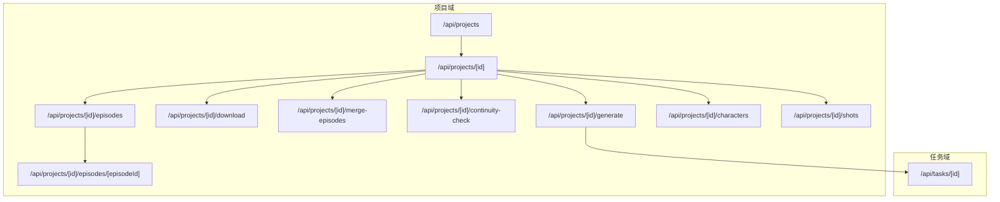
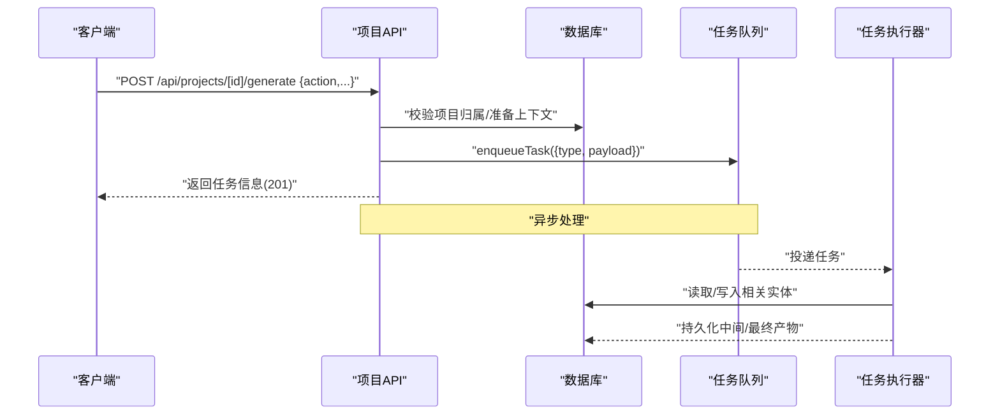
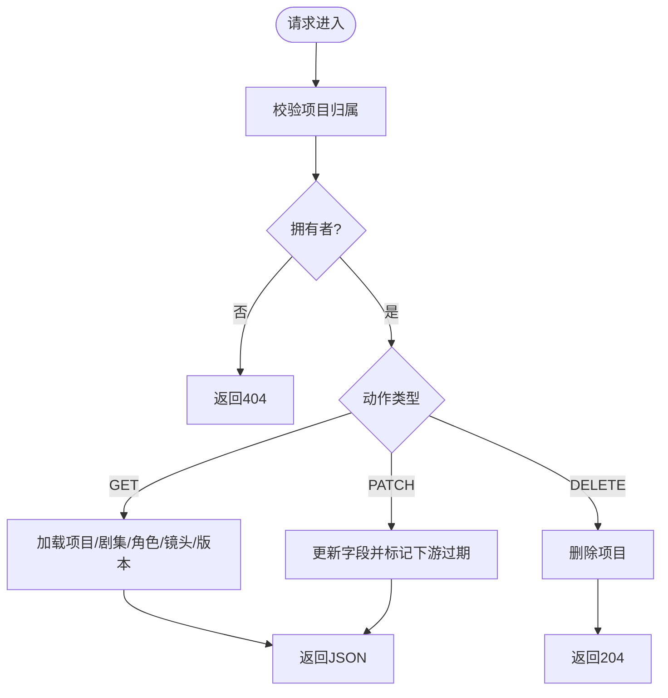
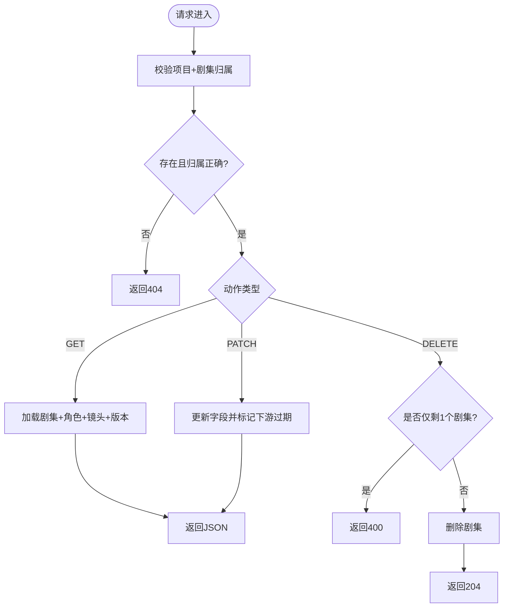
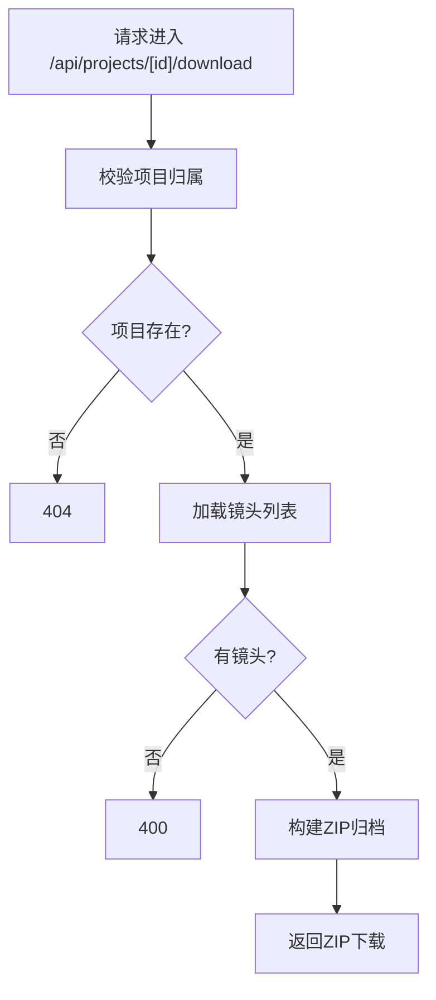
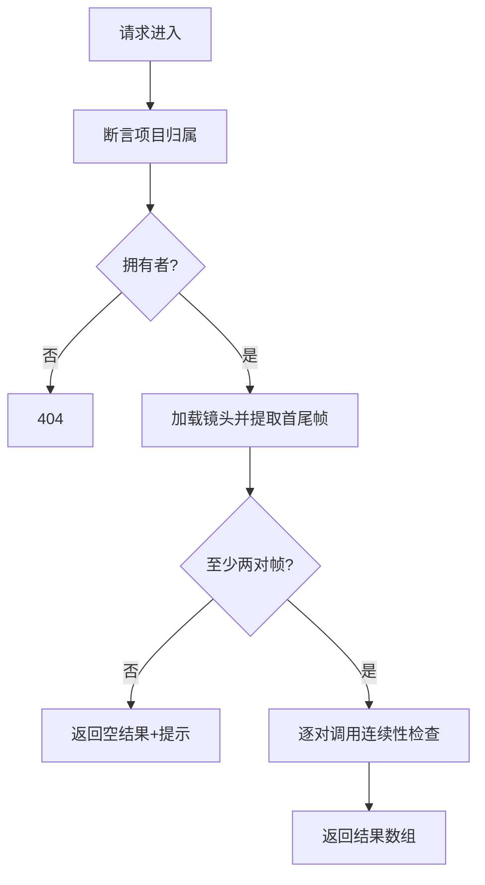
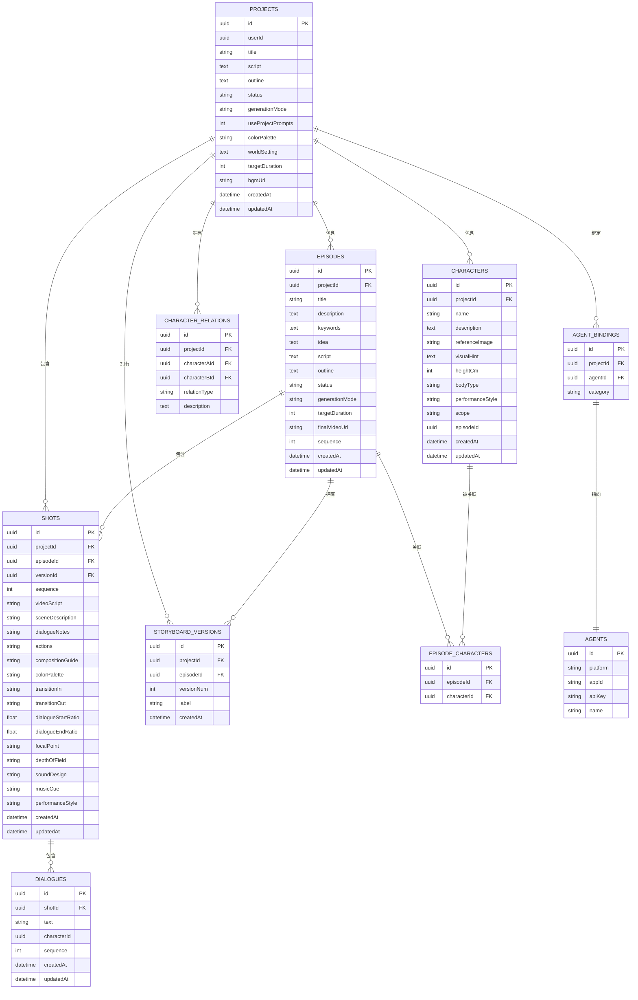

# 项目管理API

<cite>
**本文档引用的文件**
- [src/app/api/projects/route.ts](file://src/app/api/projects/route.ts)
- [src/app/api/projects/[id]/route.ts](file://src/app/api/projects/[id]/route.ts)
- [src/app/api/projects/[id]/episodes/route.ts](file://src/app/api/projects/[id]/episodes/route.ts)
- [src/app/api/projects/[id]/episodes/[episodeId]/route.ts](file://src/app/api/projects/[id]/episodes/[episodeId]/route.ts)
- [src/app/api/projects/[id]/generate/route.ts](file://src/app/api/projects/[id]/generate/route.ts)
- [src/app/api/projects/[id]/download/route.ts](file://src/app/api/projects/[id]/download/route.ts)
- [src/app/api/projects/[id]/merge-episodes/route.ts](file://src/app/api/projects/[id]/merge-episodes/route.ts)
- [src/app/api/projects/[id]/continuity-check/route.ts](file://src/app/api/projects/[id]/continuity-check/route.ts)
- [src/app/api/projects/[id]/characters/route.ts](file://src/app/api/projects/[id]/characters/route.ts)
- [src/app/api/projects/[id]/shots/route.ts](file://src/app/api/projects/[id]/shots/route.ts)
- [src/app/api/tasks/[id]/route.ts](file://src/app/api/tasks/[id]/route.ts)
</cite>

## 目录
1. [简介](#简介)
2. [项目结构](#项目结构)
3. [核心组件](#核心组件)
4. [架构总览](#架构总览)
5. [详细组件分析](#详细组件分析)
6. [依赖关系分析](#依赖关系分析)
7. [性能考量](#性能考量)
8. [故障排查指南](#故障排查指南)
9. [结论](#结论)
10. [附录](#附录)

## 简介
本文件面向AIComicBuilder的“项目管理API”，系统化梳理项目全生命周期的CRUD操作、异步生成流程、状态管理与元数据、导入导出与合并剧集、连续性检查等能力，并给出最佳实践建议。读者可据此快速理解API端点、请求/响应结构、错误处理策略与扩展路径。

## 项目结构
项目采用Next.js App Router风格的API路由组织方式，按资源域划分：
- 项目级路由：/api/projects
- 剧集级路由：/api/projects/[id]/episodes
- 生成与任务：/api/projects/[id]/generate、/api/tasks/[id]
- 导出与合并：/api/projects/[id]/download、/api/projects/[id]/merge-episodes
- 连续性检查：/api/projects/[id]/continuity-check
- 元数据子资源：characters、shots等



图表来源
- [src/app/api/projects/route.ts](file://src/app/api/projects/route.ts)
- [src/app/api/projects/[id]/route.ts](file://src/app/api/projects/[id]/route.ts)
- [src/app/api/projects/[id]/episodes/route.ts](file://src/app/api/projects/[id]/episodes/route.ts)
- [src/app/api/projects/[id]/episodes/[episodeId]/route.ts](file://src/app/api/projects/[id]/episodes/[episodeId]/route.ts)
- [src/app/api/projects/[id]/generate/route.ts](file://src/app/api/projects/[id]/generate/route.ts)
- [src/app/api/projects/[id]/download/route.ts](file://src/app/api/projects/[id]/download/route.ts)
- [src/app/api/projects/[id]/merge-episodes/route.ts](file://src/app/api/projects/[id]/merge-episodes/route.ts)
- [src/app/api/projects/[id]/continuity-check/route.ts](file://src/app/api/projects/[id]/continuity-check/route.ts)
- [src/app/api/projects/[id]/characters/route.ts](file://src/app/api/projects/[id]/characters/route.ts)
- [src/app/api/projects/[id]/shots/route.ts](file://src/app/api/projects/[id]/shots/route.ts)
- [src/app/api/tasks/[id]/route.ts](file://src/app/api/tasks/[id]/route.ts)

章节来源
- [src/app/api/projects/route.ts:1-35](file://src/app/api/projects/route.ts#L1-L35)
- [src/app/api/projects/[id]/route.ts:1-196](file://src/app/api/projects/[id]/route.ts#L1-L196)

## 核心组件
- 项目CRUD
  - 列表与创建：GET/POST /api/projects
  - 读取、更新、删除：GET/PATCH/DELETE /api/projects/[id]
- 剧集CRUD
  - 列表与创建：GET/POST /api/projects/[id]/episodes
  - 读取、更新、删除：GET/PATCH/DELETE /api/projects/[id]/episodes/[episodeId]
- 生成与任务
  - 异步生成入口：POST /api/projects/[id]/generate
  - 任务查询：GET /api/tasks/[id]
- 导出与合并
  - 导出：GET /api/projects/[id]/download
  - 合并剧集：POST /api/projects/[id]/merge-episodes
- 连续性检查
  - 连续性校验：POST /api/projects/[id]/continuity-check
- 元数据子资源
  - 角色列表：GET /api/projects/[id]/characters
  - 镜头列表：GET /api/projects/[id]/shots

章节来源
- [src/app/api/projects/route.ts:8-34](file://src/app/api/projects/route.ts#L8-L34)
- [src/app/api/projects/[id]/route.ts:16-195](file://src/app/api/projects/[id]/route.ts#L16-L195)
- [src/app/api/projects/[id]/episodes/route.ts:16-126](file://src/app/api/projects/[id]/episodes/route.ts#L16-L126)
- [src/app/api/projects/[id]/episodes/[episodeId]/route.ts:38-261](file://src/app/api/projects/[id]/episodes/[episodeId]/route.ts#L38-L261)
- [src/app/api/projects/[id]/generate/route.ts:172-307](file://src/app/api/projects/[id]/generate/route.ts#L172-L307)
- [src/app/api/tasks/[id]/route.ts:7-28](file://src/app/api/tasks/[id]/route.ts#L7-L28)
- [src/app/api/projects/[id]/download/route.ts:10-120](file://src/app/api/projects/[id]/download/route.ts#L10-L120)
- [src/app/api/projects/[id]/merge-episodes/route.ts:8-79](file://src/app/api/projects/[id]/merge-episodes/route.ts#L8-L79)
- [src/app/api/projects/[id]/continuity-check/route.ts:10-69](file://src/app/api/projects/[id]/continuity-check/route.ts#L10-L69)
- [src/app/api/projects/[id]/characters/route.ts:7-20](file://src/app/api/projects/[id]/characters/route.ts#L7-L20)
- [src/app/api/projects/[id]/shots/route.ts:7-41](file://src/app/api/projects/[id]/shots/route.ts#L7-L41)

## 架构总览
下图展示项目API的关键交互：客户端通过REST端点调用，服务端进行权限校验、数据库读写与异步任务编排；生成类请求进入任务队列，最终由任务消费者执行具体工作流。



图表来源
- [src/app/api/projects/[id]/generate/route.ts:299-306](file://src/app/api/projects/[id]/generate/route.ts#L299-L306)
- [src/app/api/tasks/[id]/route.ts:7-28](file://src/app/api/tasks/[id]/route.ts#L7-L28)

## 详细组件分析

### 项目CRUD
- 列表与创建
  - GET /api/projects：按用户维度列出项目，按创建时间倒序
  - POST /api/projects：创建新项目，必填标题，脚本可选
- 读取、更新、删除
  - GET /api/projects/[id]：支持版本参数，返回项目+剧集+角色+镜头+版本历史
  - PATCH /api/projects/[id]：可更新标题、创意、脚本、大纲、状态、生成模式、是否使用项目模板、调色板、世界观、目标时长、背景音乐等
  - DELETE /api/projects/[id]：删除项目



图表来源
- [src/app/api/projects/[id]/route.ts:8-195](file://src/app/api/projects/[id]/route.ts#L8-L195)

章节来源
- [src/app/api/projects/route.ts:8-34](file://src/app/api/projects/route.ts#L8-L34)
- [src/app/api/projects/[id]/route.ts:16-195](file://src/app/api/projects/[id]/route.ts#L16-L195)

### 剧集CRUD
- 列表与创建
  - GET /api/projects/[id]/episodes：按序列号升序返回剧集，并为卡片预览收集帧图或角色参考图
  - POST /api/projects/[id]/episodes：创建新剧集，自动分配下一序列号
- 读取、更新、删除
  - GET /api/projects/[id]/episodes/[episodeId]：支持版本参数，返回剧集+角色+镜头+版本历史
  - PATCH /api/projects/[id]/episodes/[episodeId]：可更新标题、描述、关键词、创意、脚本、大纲、状态、生成模式、目标时长
  - DELETE /api/projects/[id]/episodes/[episodeId]：若为最后一个剧集则拒绝删除



图表来源
- [src/app/api/projects/[id]/episodes/route.ts:16-126](file://src/app/api/projects/[id]/episodes/route.ts#L16-L126)
- [src/app/api/projects/[id]/episodes/[episodeId]/route.ts:16-261](file://src/app/api/projects/[id]/episodes/[episodeId]/route.ts#L16-L261)

章节来源
- [src/app/api/projects/[id]/episodes/route.ts:16-126](file://src/app/api/projects/[id]/episodes/route.ts#L16-L126)
- [src/app/api/projects/[id]/episodes/[episodeId]/route.ts:38-261](file://src/app/api/projects/[id]/episodes/[episodeId]/route.ts#L38-L261)

### 生成与任务（异步）
- 入口
  - POST /api/projects/[id]/generate：根据action分派到不同生成流程，如脚本大纲、剧本生成、解析、角色抽取、分镜拆分、关键帧提示词、视频生成、拼接等
  - 对于图像/视频生成类动作，统一入队任务，返回任务信息
- 任务查询
  - GET /api/tasks/[id]：按用户维度查询任务详情

```mermaid
sequenceDiagram
participant C as "客户端"
participant Gen as "生成接口"
participant Q as "任务队列"
participant T as "任务执行器"
C->>Gen : "POST /api/projects/[id]/generate {action,payload,modelConfig}"
alt "需要入队的任务"
Gen->>Q : "enqueueTask(...)"
Gen-->>C : "返回任务信息(201)"
else "即时流式/同步处理"
Gen-->>C : "直接返回结果/流"
end
Note over Gen,Q,T : "后续由任务执行器完成实际生成"
```

图表来源
- [src/app/api/projects/[id]/generate/route.ts:172-307](file://src/app/api/projects/[id]/generate/route.ts#L172-L307)
- [src/app/api/tasks/[id]/route.ts:7-28](file://src/app/api/tasks/[id]/route.ts#L7-L28)

章节来源
- [src/app/api/projects/[id]/generate/route.ts:172-307](file://src/app/api/projects/[id]/generate/route.ts#L172-L307)
- [src/app/api/tasks/[id]/route.ts:7-28](file://src/app/api/tasks/[id]/route.ts#L7-L28)

### 导出与合并
- 导出
  - GET /api/projects/[id]/download：打包项目内所有镜头资产（首帧、尾帧、视频、场景参考帧、参考视频、角色参考图）、最终视频为ZIP下载
- 合并剧集
  - POST /api/projects/[id]/merge-episodes：合并多个剧集的最终视频为一个视频



图表来源
- [src/app/api/projects/[id]/download/route.ts:10-120](file://src/app/api/projects/[id]/download/route.ts#L10-L120)

章节来源
- [src/app/api/projects/[id]/download/route.ts:10-120](file://src/app/api/projects/[id]/download/route.ts#L10-L120)
- [src/app/api/projects/[id]/merge-episodes/route.ts:8-79](file://src/app/api/projects/[id]/merge-episodes/route.ts#L8-L79)

### 连续性检查
- POST /api/projects/[id]/continuity-check：对相邻镜头的首尾帧进行连续性校验，返回每对镜头的通过情况与问题列表



图表来源
- [src/app/api/projects/[id]/continuity-check/route.ts:10-69](file://src/app/api/projects/[id]/continuity-check/route.ts#L10-L69)

章节来源
- [src/app/api/projects/[id]/continuity-check/route.ts:10-69](file://src/app/api/projects/[id]/continuity-check/route.ts#L10-L69)

### 元数据子资源
- 角色列表：GET /api/projects/[id]/characters
- 镜头列表：GET /api/projects/[id]/shots（含对白）

章节来源
- [src/app/api/projects/[id]/characters/route.ts:7-20](file://src/app/api/projects/[id]/characters/route.ts#L7-L20)
- [src/app/api/projects/[id]/shots/route.ts:7-41](file://src/app/api/projects/[id]/shots/route.ts#L7-L41)

## 依赖关系分析
- 权限与归属
  - 多数端点通过用户ID校验项目归属，未通过则返回404
- 数据模型
  - 项目、剧集、角色、镜头、对白、版本、任务等核心实体通过Drizzle ORM访问
- 异步任务
  - 生成类请求统一入队，任务执行器负责实际生成与持久化
- 资源关联
  - 剧集与角色通过中间表关联；镜头与版本、资产版本、对白强关联



图表来源
- [src/app/api/projects/[id]/route.ts:1-L196](file://src/app/api/projects/[id]/route.ts#L1-L196)
- [src/app/api/projects/[id]/episodes/[episodeId]/route.ts:1-L174](file://src/app/api/projects/[id]/episodes/[episodeId]/route.ts#L1-L174)
- [src/app/api/projects/[id]/generate/route.ts:1-L307](file://src/app/api/projects/[id]/generate/route.ts#L1-L307)

## 性能考量
- 批量加载与去重
  - 在读取项目/剧集时，对镜头资产采用批量查询并按镜头聚合，避免N+1查询
- 版本历史渲染
  - 为UI渲染版本历史箭头与切换，会加载所有版本的资产，注意在大项目上可能产生较多I/O
- 导出ZIP
  - 归档前先检查是否存在镜头，避免空归档；对文件存在性进行判断后再添加
- 生成流式
  - 部分生成流程采用流式输出，边生成边返回，减少等待时间
- 任务队列
  - 图像/视频生成类动作统一入队，避免阻塞请求线程，提升吞吐

章节来源
- [src/app/api/projects/[id]/route.ts:55-L104](file://src/app/api/projects/[id]/route.ts#L55-L104)
- [src/app/api/projects/[id]/episodes/[episodeId]/route.ts:101-L150](file://src/app/api/projects/[id]/episodes/[episodeId]/route.ts#L101-L150)
- [src/app/api/projects/[id]/download/route.ts:47-L101](file://src/app/api/projects/[id]/download/route.ts#L47-L101)
- [src/app/api/projects/[id]/generate/route.ts:375-L401](file://src/app/api/projects/[id]/generate/route.ts#L375-L401)

## 故障排查指南
- 404 未找到
  - 项目或剧集不存在、非项目拥有者访问、任务不存在
- 400 参数错误
  - 合并剧集时缺少至少两个剧集、剧集无最终视频
- 422 智能体输出校验失败
  - 某些智能体输出格式不符合预期，需检查平台/应用配置与提示词
- 500 合并失败
  - 视频拼接过程异常，检查输入视频路径与编码环境

章节来源
- [src/app/api/projects/[id]/route.ts:24-L26](file://src/app/api/projects/[id]/route.ts#L24-L26)
- [src/app/api/projects/[id]/episodes/[episodeId]/route.ts:242-L244](file://src/app/api/projects/[id]/episodes/[episodeId]/route.ts#L242-L244)
- [src/app/api/projects/[id]/merge-episodes/route.ts:28-L33](file://src/app/api/projects/[id]/merge-episodes/route.ts#L28-L33)
- [src/app/api/projects/[id]/merge-episodes/route.ts:54-L60](file://src/app/api/projects/[id]/merge-episodes/route.ts#L54-L60)
- [src/app/api/projects/[id]/generate/route.ts:24-L29](file://src/app/api/projects/[id]/generate/route.ts#L24-L29)
- [src/app/api/projects/[id]/merge-episodes/route.ts:72-L78](file://src/app/api/projects/[id]/merge-episodes/route.ts#L72-L78)

## 结论
本API围绕“项目—剧集—镜头”三层结构提供完整的CRUD与元数据管理，结合异步任务机制支撑大规模生成工作流。通过版本控制、连续性检查与导出合并能力，形成从创作到成品的一体化管线。建议在生产环境中配合任务监控、超时与重试策略，确保生成稳定性与用户体验。

## 附录

### API定义与示例路径
- 项目
  - GET /api/projects → [src/app/api/projects/route.ts:8-16](file://src/app/api/projects/route.ts#L8-L16)
  - POST /api/projects → [src/app/api/projects/route.ts:18-34](file://src/app/api/projects/route.ts#L18-L34)
  - GET /api/projects/[id] → [src/app/api/projects/[id]/route.ts:16-L125](file://src/app/api/projects/[id]/route.ts#L16-L125)
  - PATCH /api/projects/[id] → [src/app/api/projects/[id]/route.ts:127-L179](file://src/app/api/projects/[id]/route.ts#L127-L179)
  - DELETE /api/projects/[id] → [src/app/api/projects/[id]/route.ts:181-L195](file://src/app/api/projects/[id]/route.ts#L181-L195)
- 剧集
  - GET /api/projects/[id]/episodes → [src/app/api/projects/[id]/episodes/route.ts:16-L89](file://src/app/api/projects/[id]/episodes/route.ts#L16-L89)
  - POST /api/projects/[id]/episodes → [src/app/api/projects/[id]/episodes/route.ts:91-L126](file://src/app/api/projects/[id]/episodes/route.ts#L91-L126)
  - GET /api/projects/[id]/episodes/[episodeId] → [src/app/api/projects/[id]/episodes/[episodeId]/route.ts:38-L174](file://src/app/api/projects/[id]/episodes/[episodeId]/route.ts#L38-L174)
  - PATCH /api/projects/[id]/episodes/[episodeId] → [src/app/api/projects/[id]/episodes/[episodeId]/route.ts:176-L228](file://src/app/api/projects/[id]/episodes/[episodeId]/route.ts#L176-L228)
  - DELETE /api/projects/[id]/episodes/[episodeId] → [src/app/api/projects/[id]/episodes/[episodeId]/route.ts:230-L261](file://src/app/api/projects/[id]/episodes/[episodeId]/route.ts#L230-L261)
- 生成与任务
  - POST /api/projects/[id]/generate → [src/app/api/projects/[id]/generate/route.ts:172-L307](file://src/app/api/projects/[id]/generate/route.ts#L172-L307)
  - GET /api/tasks/[id] → [src/app/api/tasks/[id]/route.ts:7-L28](file://src/app/api/tasks/[id]/route.ts#L7-L28)
- 导出与合并
  - GET /api/projects/[id]/download → [src/app/api/projects/[id]/download/route.ts:10-L120](file://src/app/api/projects/[id]/download/route.ts#L10-L120)
  - POST /api/projects/[id]/merge-episodes → [src/app/api/projects/[id]/merge-episodes/route.ts:8-L79](file://src/app/api/projects/[id]/merge-episodes/route.ts#L8-L79)
- 连续性检查
  - POST /api/projects/[id]/continuity-check → [src/app/api/projects/[id]/continuity-check/route.ts:10-L69](file://src/app/api/projects/[id]/continuity-check/route.ts#L10-L69)
- 元数据子资源
  - GET /api/projects/[id]/characters → [src/app/api/projects/[id]/characters/route.ts:7-L20](file://src/app/api/projects/[id]/characters/route.ts#L7-L20)
  - GET /api/projects/[id]/shots → [src/app/api/projects/[id]/shots/route.ts:7-L41](file://src/app/api/projects/[id]/shots/route.ts#L7-L41)