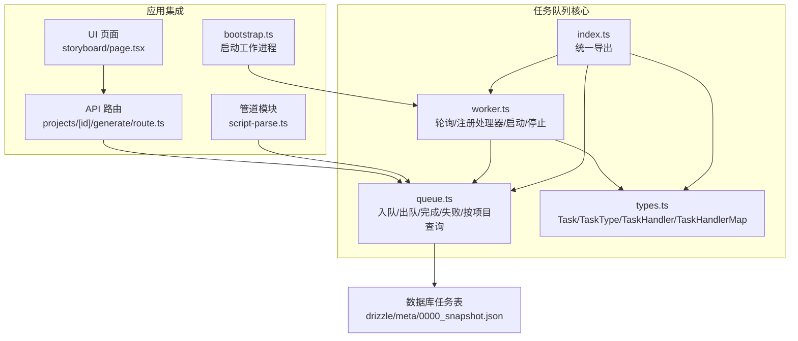
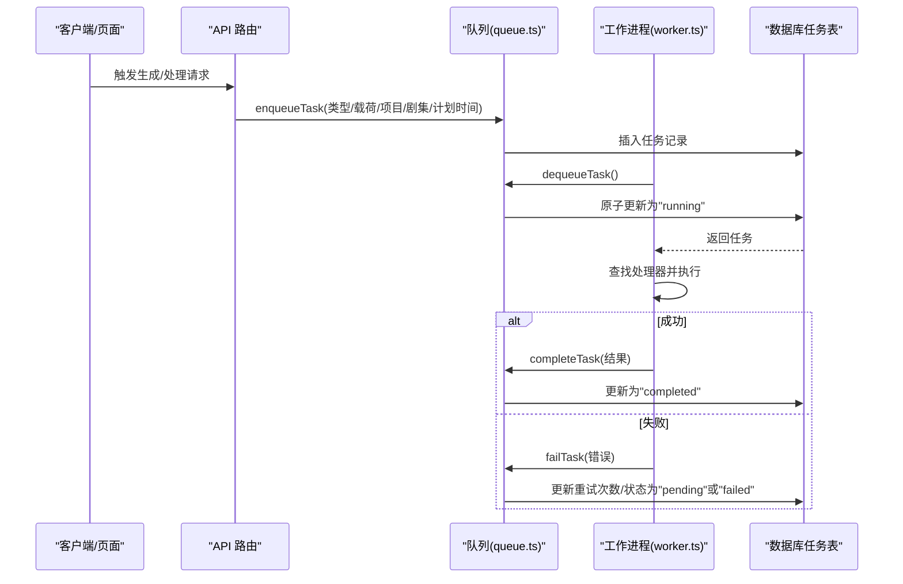
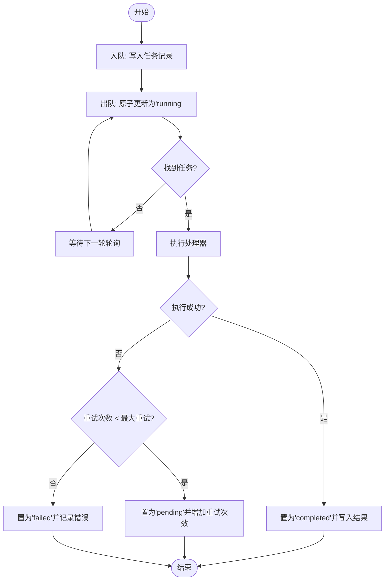
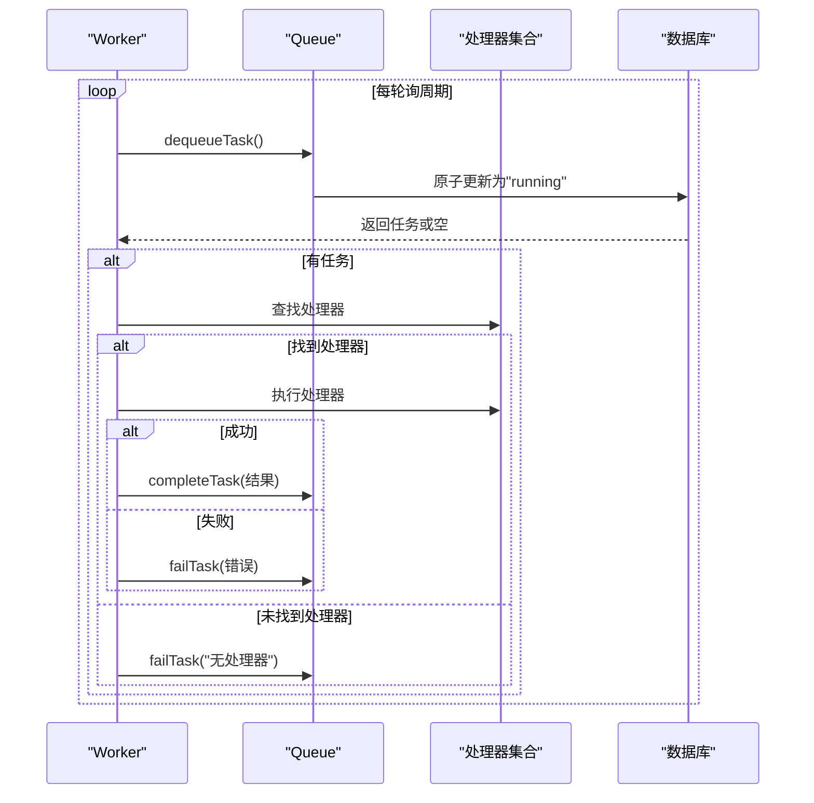
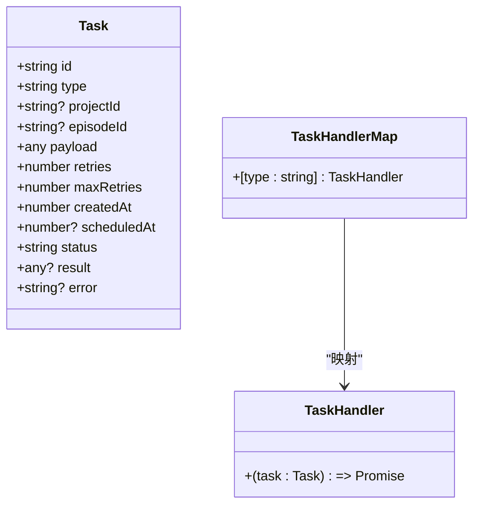
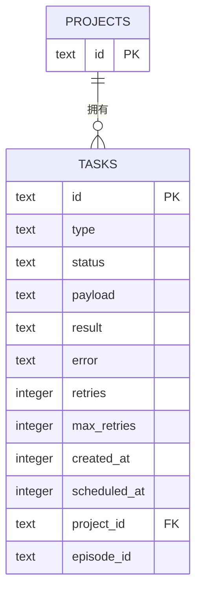
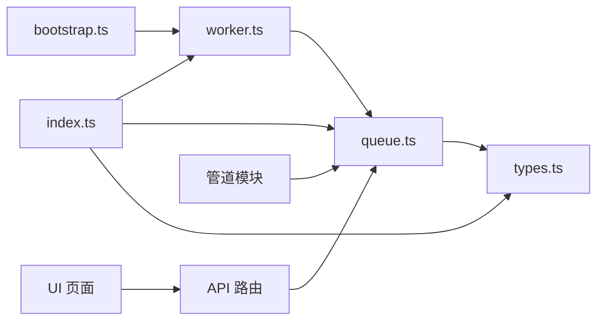

# 任务队列系统

<cite>
**本文引用的文件**
- [src/lib/task-queue/index.ts](file://src/lib/task-queue/index.ts)
- [src/lib/task-queue/queue.ts](file://src/lib/task-queue/queue.ts)
- [src/lib/task-queue/worker.ts](file://src/lib/task-queue/worker.ts)
- [src/lib/task-queue/types.ts](file://src/lib/task-queue/types.ts)
- [drizzle/meta/0000_snapshot.json](file://drizzle/meta/0000_snapshot.json)
- [src/lib/bootstrap.ts](file://src/lib/bootstrap.ts)
- [src/app/api/projects/[id]/generate/route.ts](file://src/app/api/projects/[id]/generate/route.ts)
- [src/lib/pipeline/script-parse.ts](file://src/lib/pipeline/script-parse.ts)
- [src/app/[locale]/project/[id]/episodes/[episodeId]/storyboard/page.tsx](file://src/app/[locale]/project/[id]/episodes/[episodeId]/storyboard/page.tsx)
</cite>

## 目录
1. [简介](#简介)
2. [项目结构](#项目结构)
3. [核心组件](#核心组件)
4. [架构总览](#架构总览)
5. [详细组件分析](#详细组件分析)
6. [依赖关系分析](#依赖关系分析)
7. [性能与并发控制](#性能与并发控制)
8. [故障排除指南](#故障排除指南)
9. [结论](#结论)
10. [附录](#附录)

## 简介
本文件系统性阐述 AIComicBuilder 的任务队列系统，覆盖异步任务处理机制、工作进程管理、错误恢复策略、任务调度与优先级、并发控制、状态跟踪与进度监控、性能优化、分布式与负载均衡建议、实际使用示例与配置指南。该系统基于数据库驱动的任务表，通过轻量级工作进程轮询拉取任务并执行，具备基础的重试与失败降级能力。

## 项目结构
任务队列相关代码集中在 src/lib/task-queue 目录，对外通过 index.ts 统一导出，内部由 queue.ts（入队/出队/完成/失败）、worker.ts（工作进程轮询与处理）、types.ts（类型定义）组成；数据库模式在 drizzle 元数据中定义了任务表结构；应用层通过 API 路由或管道模块调用入队接口；前端页面提供批量任务进度展示。

**图表来源**
- [src/lib/task-queue/index.ts:1-3](file://src/lib/task-queue/index.ts#L1-L3)
- [src/lib/task-queue/queue.ts:1-100](file://src/lib/task-queue/queue.ts#L1-L100)
- [src/lib/task-queue/worker.ts:1-56](file://src/lib/task-queue/worker.ts#L1-L56)
- [src/lib/task-queue/types.ts:1-10](file://src/lib/task-queue/types.ts#L1-L10)
- [drizzle/meta/0000_snapshot.json:344-450](file://drizzle/meta/0000_snapshot.json#L344-L450)
- [src/lib/bootstrap.ts:1-30](file://src/lib/bootstrap.ts#L1-L30)
- [src/app/api/projects/[id]/generate/route.ts](file://src/app/api/projects/[id]/generate/route.ts#L290-L310)
- [src/lib/pipeline/script-parse.ts:35-45](file://src/lib/pipeline/script-parse.ts#L35-L45)
- [src/app/[locale]/project/[id]/episodes/[episodeId]/storyboard/page.tsx](file://src/app/[locale]/project/[id]/episodes/[episodeId]/storyboard/page.tsx#L1046-L1072)

**章节来源**
- [src/lib/task-queue/index.ts:1-3](file://src/lib/task-queue/index.ts#L1-L3)
- [src/lib/task-queue/queue.ts:1-100](file://src/lib/task-queue/queue.ts#L1-L100)
- [src/lib/task-queue/worker.ts:1-56](file://src/lib/task-queue/worker.ts#L1-L56)
- [src/lib/task-queue/types.ts:1-10](file://src/lib/task-queue/types.ts#L1-L10)
- [drizzle/meta/0000_snapshot.json:344-450](file://drizzle/meta/0000_snapshot.json#L344-L450)
- [src/lib/bootstrap.ts:1-30](file://src/lib/bootstrap.ts#L1-L30)
- [src/app/api/projects/[id]/generate/route.ts](file://src/app/api/projects/[id]/generate/route.ts#L290-L310)
- [src/lib/pipeline/script-parse.ts:35-45](file://src/lib/pipeline/script-parse.ts#L35-L45)
- [src/app/[locale]/project/[id]/episodes/[episodeId]/storyboard/page.tsx](file://src/app/[locale]/project/[id]/episodes/[episodeId]/storyboard/page.tsx#L1046-L1072)

## 核心组件
- 队列操作（queue.ts）
  - 入队：生成任务 ID，写入类型、项目/剧集关联、载荷、最大重试次数、计划执行时间等字段。
  - 出队：原子性地将首个“待处理”且满足“未定时或已到期”的任务标记为“运行中”，避免竞争条件。
  - 完成：将任务置为“已完成”，写入结果。
  - 失败：根据重试次数阈值决定将任务置回“待处理”或标记为“失败”，并记录错误信息。
  - 查询：按项目 ID 查询任务列表，按创建时间升序排列。
- 工作进程（worker.ts）
  - 注册处理器：建立任务类型到处理函数的映射。
  - 轮询：固定周期轮询数据库出队任务，执行对应处理器，成功则完成，失败则进入失败流程。
  - 生命周期：启动/停止，避免重复启动。
- 类型定义（types.ts）
  - Task：数据库任务记录的推断类型。
  - TaskType：任务类型枚举（来自数据库表的 type 字段）。
  - TaskHandler：单个任务处理函数签名。
  - TaskHandlerMap：任务类型到处理函数的映射。
- 统一导出（index.ts）
  - 导出队列操作、工作进程控制与类型。

**章节来源**
- [src/lib/task-queue/queue.ts:7-100](file://src/lib/task-queue/queue.ts#L7-L100)
- [src/lib/task-queue/worker.ts:9-56](file://src/lib/task-queue/worker.ts#L9-L56)
- [src/lib/task-queue/types.ts:1-10](file://src/lib/task-queue/types.ts#L1-L10)
- [src/lib/task-queue/index.ts:1-3](file://src/lib/task-queue/index.ts#L1-L3)

## 架构总览
任务从 API 或管道模块入队，工作进程周期性轮询数据库获取任务并执行，处理器负责具体业务逻辑，完成后更新任务状态。前端页面可展示批量任务进度。

**图表来源**
- [src/app/api/projects/[id]/generate/route.ts](file://src/app/api/projects/[id]/generate/route.ts#L290-L310)
- [src/lib/task-queue/queue.ts:7-100](file://src/lib/task-queue/queue.ts#L7-L100)
- [src/lib/task-queue/worker.ts:13-44](file://src/lib/task-queue/worker.ts#L13-L44)
- [drizzle/meta/0000_snapshot.json:344-450](file://drizzle/meta/0000_snapshot.json#L344-L450)

## 详细组件分析

### 队列操作（queue.ts）
- 入队参数
  - 必填：任务类型
  - 可选：项目 ID、载荷、最大重试次数、计划执行时间、剧集 ID
- 出队策略
  - 使用原子 UPDATE ... WHERE 子查询，确保同一时刻只有一个工作进程能“认领”到该任务，避免竞态。
  - 条件：状态为“待处理”，且满足“未设置计划时间”或“计划时间已到达”。
  - 排序：按创建时间升序，保证先入先出。
- 完成/失败
  - 完成：写入结果并置为“已完成”。
  - 失败：计算新重试次数，小于最大重试则置回“待处理”，否则标记为“失败”。

**图表来源**
- [src/lib/task-queue/queue.ts:31-92](file://src/lib/task-queue/queue.ts#L31-L92)

**章节来源**
- [src/lib/task-queue/queue.ts:7-100](file://src/lib/task-queue/queue.ts#L7-L100)

### 工作进程（worker.ts）
- 轮询周期：固定毫秒级轮询间隔，避免忙等。
- 处理流程：根据任务类型查找处理器，执行后完成或失败；异常被捕获并记录。
- 生命周期：幂等启动/停止，防止重复启动。

**图表来源**
- [src/lib/task-queue/worker.ts:13-44](file://src/lib/task-queue/worker.ts#L13-L44)
- [src/lib/task-queue/queue.ts:31-92](file://src/lib/task-queue/queue.ts#L31-L92)

**章节来源**
- [src/lib/task-queue/worker.ts:1-56](file://src/lib/task-queue/worker.ts#L1-L56)

### 类型系统（types.ts）
- Task：数据库任务记录的类型别名。
- TaskType：任务类型的字面量联合（来自数据库表的 type 字段）。
- TaskHandler：单个任务处理函数签名。
- TaskHandlerMap：任务类型到处理函数的映射。

**图表来源**
- [src/lib/task-queue/types.ts:1-10](file://src/lib/task-queue/types.ts#L1-L10)
- [drizzle/meta/0000_snapshot.json:344-450](file://drizzle/meta/0000_snapshot.json#L344-L450)

**章节来源**
- [src/lib/task-queue/types.ts:1-10](file://src/lib/task-queue/types.ts#L1-L10)

### 数据库模式（drizzle 元数据）
- 关键字段
  - id、type、status、payload、result、error、retries、maxRetries、createdAt、scheduledAt、projectId、episodeId
- 默认值与约束
  - status 默认“待处理”
  - retries 默认 0
  - maxRetries 默认 3
- 外键
  - 任务表对项目表存在外键约束（级联删除）

**图表来源**
- [drizzle/meta/0000_snapshot.json:344-450](file://drizzle/meta/0000_snapshot.json#L344-L450)

**章节来源**
- [drizzle/meta/0000_snapshot.json:344-450](file://drizzle/meta/0000_snapshot.json#L344-L450)

### 应用集成点
- 启动工作进程
  - 在引导文件中启动工作进程，确保服务启动即开始消费任务。
- API 路由
  - 生成接口通过入队触发后续处理。
- 管道模块
  - 解析脚本等步骤通过入队将子任务拆分，便于异步执行与进度追踪。
- 前端进度展示
  - 批量任务进度条显示已完成/总数与失败数量。

**章节来源**
- [src/lib/bootstrap.ts:1-30](file://src/lib/bootstrap.ts#L1-L30)
- [src/app/api/projects/[id]/generate/route.ts](file://src/app/api/projects/[id]/generate/route.ts#L290-L310)
- [src/lib/pipeline/script-parse.ts:35-45](file://src/lib/pipeline/script-parse.ts#L35-L45)
- [src/app/[locale]/project/[id]/episodes/[episodeId]/storyboard/page.tsx](file://src/app/[locale]/project/[id]/episodes/[episodeId]/storyboard/page.tsx#L1046-L1072)

## 依赖关系分析
- 组件耦合
  - worker 依赖 queue 的出队/完成/失败接口。
  - queue 依赖数据库访问与 Drizzle ORM。
  - index.ts 提供统一入口，降低上层模块直接依赖具体实现。
- 外部依赖
  - 数据库驱动的任务表。
  - Drizzle ORM 的查询与更新语法。
- 潜在循环依赖
  - 当前结构清晰，无明显循环导入。

**图表来源**
- [src/lib/task-queue/index.ts:1-3](file://src/lib/task-queue/index.ts#L1-L3)
- [src/lib/task-queue/queue.ts:1-100](file://src/lib/task-queue/queue.ts#L1-L100)
- [src/lib/task-queue/worker.ts:1-56](file://src/lib/task-queue/worker.ts#L1-L56)
- [src/lib/task-queue/types.ts:1-10](file://src/lib/task-queue/types.ts#L1-L10)
- [src/lib/bootstrap.ts:1-30](file://src/lib/bootstrap.ts#L1-L30)
- [src/app/api/projects/[id]/generate/route.ts](file://src/app/api/projects/[id]/generate/route.ts#L290-L310)
- [src/lib/pipeline/script-parse.ts:35-45](file://src/lib/pipeline/script-parse.ts#L35-L45)
- [src/app/[locale]/project/[id]/episodes/[episodeId]/storyboard/page.tsx](file://src/app/[locale]/project/[id]/episodes/[episodeId]/storyboard/page.tsx#L1046-L1072)

**章节来源**
- [src/lib/task-queue/index.ts:1-3](file://src/lib/task-queue/index.ts#L1-L3)
- [src/lib/task-queue/queue.ts:1-100](file://src/lib/task-queue/queue.ts#L1-L100)
- [src/lib/task-queue/worker.ts:1-56](file://src/lib/task-queue/worker.ts#L1-L56)
- [src/lib/task-queue/types.ts:1-10](file://src/lib/task-queue/types.ts#L1-L10)
- [src/lib/bootstrap.ts:1-30](file://src/lib/bootstrap.ts#L1-L30)
- [src/app/api/projects/[id]/generate/route.ts](file://src/app/api/projects/[id]/generate/route.ts#L290-L310)
- [src/lib/pipeline/script-parse.ts:35-45](file://src/lib/pipeline/script-parse.ts#L35-L45)
- [src/app/[locale]/project/[id]/episodes/[episodeId]/storyboard/page.tsx](file://src/app/[locale]/project/[id]/episodes/[episodeId]/storyboard/page.tsx#L1046-L1072)

## 性能与并发控制
- 轮询间隔
  - 固定轮询间隔平衡吞吐与延迟，可根据任务规模调整。
- 原子认领
  - 出队采用原子 UPDATE 子查询，避免多实例同时取出同一任务，减少竞争。
- 并发度
  - 单实例工作进程串行处理，可通过部署多个工作进程实例实现水平扩展。
- 重试与退避
  - 当前实现按固定次数重试，未内置指数退避；可在处理器内实现或引入退避策略。
- 数据库压力
  - 高频轮询可能带来数据库压力，建议：
    - 合理增大轮询间隔
    - 对高频任务进行限流或合并
    - 使用数据库连接池与索引优化
- 进度与可观测性
  - 建议在处理器中上报进度事件，前端轮询或 SSE 推送实时进度。

[本节为通用性能建议，不直接分析具体文件]

## 故障排除指南
- 无处理器注册
  - 现象：任务被标记为失败，错误信息提示未注册处理器。
  - 排查：确认已在工作进程启动后注册相应任务类型的处理器。
- 任务长时间处于“运行中”
  - 现象：任务未完成也未失败。
  - 排查：检查处理器是否抛出未捕获异常；确认工作进程正常运行。
- 重试过多仍失败
  - 现象：任务最终标记为“失败”。
  - 排查：查看错误字段，定位具体失败原因；必要时人工干预或清理脏数据。
- 轮询无任务
  - 现象：工作进程持续空转。
  - 排查：确认入队成功、任务状态为“待处理”、计划时间未过期；检查轮询间隔与数据库连通性。
- 前端进度不更新
  - 现象：批量进度条不动。
  - 排查：确认后端正确维护任务状态与结果；前端轮询或事件推送是否生效。

**章节来源**
- [src/lib/task-queue/worker.ts:13-27](file://src/lib/task-queue/worker.ts#L13-L27)
- [src/lib/task-queue/queue.ts:62-92](file://src/lib/task-queue/queue.ts#L62-L92)

## 结论
该任务队列系统以数据库为中心，通过原子认领与固定轮询实现简单可靠的异步任务处理。其优势在于实现简洁、易于部署与调试；局限在于缺乏内置优先级、调度算法与分布式协调。结合本文的性能与扩展建议，可在现有基础上进一步完善为生产级任务平台。

[本节为总结性内容，不直接分析具体文件]

## 附录

### 实际使用示例
- 在 API 中入队
  - 示例路径：[src/app/api/projects/[id]/generate/route.ts](file://src/app/api/projects/[id]/generate/route.ts#L290-L310)
- 在管道模块中入队
  - 示例路径：[src/lib/pipeline/script-parse.ts:35-45](file://src/lib/pipeline/script-parse.ts#L35-L45)
- 启动工作进程
  - 示例路径：[src/lib/bootstrap.ts:1-30](file://src/lib/bootstrap.ts#L1-L30)

**章节来源**
- [src/app/api/projects/[id]/generate/route.ts](file://src/app/api/projects/[id]/generate/route.ts#L290-L310)
- [src/lib/pipeline/script-parse.ts:35-45](file://src/lib/pipeline/script-parse.ts#L35-L45)
- [src/lib/bootstrap.ts:1-30](file://src/lib/bootstrap.ts#L1-L30)

### 配置指南
- 重试策略
  - 通过入队参数设置最大重试次数；失败时自动累加重试计数。
- 计划执行
  - 通过计划时间字段实现延时任务；出队会忽略未到时间的任务。
- 并发与扩展
  - 通过部署多个工作进程实例实现水平扩展；注意处理器幂等性与资源隔离。
- 监控与日志
  - 建议在处理器中记录关键事件与耗时指标；前端轮询任务状态以展示进度。

**章节来源**
- [src/lib/task-queue/queue.ts:7-29](file://src/lib/task-queue/queue.ts#L7-L29)
- [src/lib/task-queue/worker.ts:4-56](file://src/lib/task-queue/worker.ts#L4-L56)

### 分布式与负载均衡
- 多实例部署
  - 启动多个工作进程实例，共享同一数据库；原子认领机制天然避免重复执行。
- 负载均衡
  - 通过任务类型划分处理器职责，或按项目/剧集分区；结合外部消息队列可实现更精细的负载均衡。
- 一致性与幂等
  - 处理器应设计为幂等，避免重复执行导致副作用。

[本节为概念性建议，不直接分析具体文件]