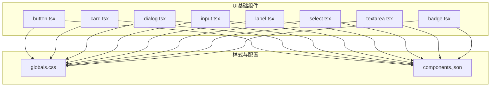
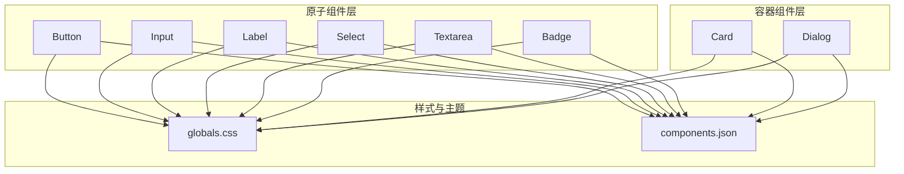
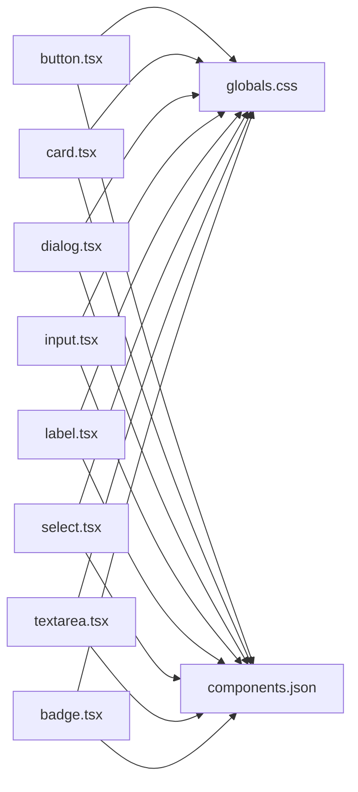

# UI基础组件

<cite>
**本文引用的文件**
- [src/components/ui/button.tsx](file://src/components/ui/button.tsx)
- [src/components/ui/card.tsx](file://src/components/ui/card.tsx)
- [src/components/ui/dialog.tsx](file://src/components/ui/dialog.tsx)
- [src/components/ui/input.tsx](file://src/components/ui/input.tsx)
- [src/components/ui/label.tsx](file://src/components/ui/label.tsx)
- [src/components/ui/select.tsx](file://src/components/ui/select.tsx)
- [src/components/ui/textarea.tsx](file://src/components/ui/textarea.tsx)
- [src/components/ui/badge.tsx](file://src/components/ui/badge.tsx)
- [src/app/globals.css](file://src/app/globals.css)
- [components.json](file://components.json)
</cite>

## 目录
1. [简介](#简介)
2. [项目结构](#项目结构)
3. [核心组件](#核心组件)
4. [架构总览](#架构总览)
5. [详细组件分析](#详细组件分析)
6. [依赖关系分析](#依赖关系分析)
7. [性能考虑](#性能考虑)
8. [故障排除指南](#故障排除指南)
9. [结论](#结论)
10. [附录](#附录)

## 简介
本章节面向AIComicBuilder的UI基础组件，系统性梳理按钮、卡片、对话框、输入框、标签、选择器、文本域与徽章等通用组件的视觉外观、行为与交互模式；记录各组件的属性（props）、事件处理、插槽与可定制选项；提供响应式设计与无障碍合规建议；说明组件状态变化、动画与过渡处理；覆盖样式自定义与主题支持；并总结组件间组合模式与最佳实践。

## 项目结构
UI基础组件集中于src/components/ui目录下，采用按功能分层的组织方式：基础原子组件（button、input、label、select、textarea、badge）与复合容器组件（card、dialog）。全局样式位于src/app/globals.css，组件库配置在components.json中，用于统一Tailwind与组件变体。

**图表来源**
- [src/components/ui/button.tsx](file://src/components/ui/button.tsx)
- [src/components/ui/card.tsx](file://src/components/ui/card.tsx)
- [src/components/ui/dialog.tsx](file://src/components/ui/dialog.tsx)
- [src/components/ui/input.tsx](file://src/components/ui/input.tsx)
- [src/components/ui/label.tsx](file://src/components/ui/label.tsx)
- [src/components/ui/select.tsx](file://src/components/ui/select.tsx)
- [src/components/ui/textarea.tsx](file://src/components/ui/textarea.tsx)
- [src/components/ui/badge.tsx](file://src/components/ui/badge.tsx)
- [src/app/globals.css](file://src/app/globals.css)
- [components.json](file://components.json)

**章节来源**
- [src/components/ui/button.tsx](file://src/components/ui/button.tsx)
- [src/components/ui/card.tsx](file://src/components/ui/card.tsx)
- [src/components/ui/dialog.tsx](file://src/components/ui/dialog.tsx)
- [src/components/ui/input.tsx](file://src/components/ui/input.tsx)
- [src/components/ui/label.tsx](file://src/components/ui/label.tsx)
- [src/components/ui/select.tsx](file://src/components/ui/select.tsx)
- [src/components/ui/textarea.tsx](file://src/components/ui/textarea.tsx)
- [src/components/ui/badge.tsx](file://src/components/ui/badge.tsx)
- [src/app/globals.css](file://src/app/globals.css)
- [components.json](file://components.json)

## 核心组件
本节概述各基础UI组件的职责与典型用法，便于快速定位与集成。

- 按钮（Button）
  - 角色：触发操作、强调主次动作
  - 关键特性：尺寸、外观变体、禁用态、加载态、图标支持
  - 典型场景：提交表单、打开对话框、执行删除或确认操作
- 卡片（Card）
  - 角色：内容分组与信息展示容器
  - 关键特性：标题区、内容区、底部区、阴影与圆角
  - 典型场景：角色卡、剧本文案块、设置项容器
- 对话框（Dialog）
  - 角色：模态交互与重要提示
  - 关键特性：打开/关闭控制、遮罩层、焦点管理、键盘交互
  - 典型场景：确认删除、项目创建、参数配置
- 输入框（Input）
  - 角色：接收用户文本输入
  - 关键特性：类型（文本/密码/数字等）、占位符、校验反馈、清空按钮
  - 典型场景：用户名/邮箱输入、数值调节、搜索框
- 标签（Label）
  - 角色：为表单控件提供语义化说明
  - 关键特性：点击关联、辅助文本、错误态样式
  - 典型场景：与输入框/选择器配对使用
- 选择器（Select）
  - 角色：从预设集合中选择单一值
  - 关键特性：触发器、下拉列表、选中态、可搜索（可选）
  - 典型场景：模型选择、生成参数切换
- 文本域（Textarea）
  - 角色：多行文本输入
  - 关键特性：自动高度、字数统计、禁用/只读
  - 典型场景：描述文本、备注、长文案编辑
- 徽章（Badge）
  - 角色：状态标识与轻量信息展示
  - 关键特性：颜色变体、形状、动态状态
  - 典型场景：任务状态、标签分类、计数

**章节来源**
- [src/components/ui/button.tsx](file://src/components/ui/button.tsx)
- [src/components/ui/card.tsx](file://src/components/ui/card.tsx)
- [src/components/ui/dialog.tsx](file://src/components/ui/dialog.tsx)
- [src/components/ui/input.tsx](file://src/components/ui/input.tsx)
- [src/components/ui/label.tsx](file://src/components/ui/label.tsx)
- [src/components/ui/select.tsx](file://src/components/ui/select.tsx)
- [src/components/ui/textarea.tsx](file://src/components/ui/textarea.tsx)
- [src/components/ui/badge.tsx](file://src/components/ui/badge.tsx)

## 架构总览
UI基础组件遵循“原子组件+容器组件”的分层设计，通过共享样式与变体系统实现一致的视觉语言与交互体验。组件间通过明确的props接口与事件回调进行解耦，支持组合与复用。

**图表来源**
- [src/components/ui/button.tsx](file://src/components/ui/button.tsx)
- [src/components/ui/input.tsx](file://src/components/ui/input.tsx)
- [src/components/ui/label.tsx](file://src/components/ui/label.tsx)
- [src/components/ui/select.tsx](file://src/components/ui/select.tsx)
- [src/components/ui/textarea.tsx](file://src/components/ui/textarea.tsx)
- [src/components/ui/badge.tsx](file://src/components/ui/badge.tsx)
- [src/components/ui/card.tsx](file://src/components/ui/card.tsx)
- [src/components/ui/dialog.tsx](file://src/components/ui/dialog.tsx)
- [src/app/globals.css](file://src/app/globals.css)
- [components.json](file://components.json)

## 详细组件分析

### 按钮（Button）
- 视觉外观
  - 支持主按钮、次按钮、危险按钮、幽灵按钮、文本按钮等变体
  - 支持尺寸（默认/小/大）与禁用态
  - 支持加载态与图标前置/后置
- 行为与交互
  - 点击事件回调（onClick），支持阻止默认行为
  - 键盘可访问：Enter/Space激活
  - 鼠标悬停、按下、聚焦态反馈
- 属性（props）
  - variant?: 主题变体字符串
  - size?: 尺寸字符串
  - disabled?: 布尔禁用
  - loading?: 布尔加载
  - leftIcon/rightIcon?: 图标名称或ReactNode
  - onClick?: (event) => void
  - className?: 字符串
  - children?: ReactNode
- 事件处理
  - onClick：处理用户点击；在loading时应避免重复触发
- 插槽与自定义
  - 通过className扩展样式；通过leftIcon/rightIcon插入图标
- 使用示例
  - 提交表单按钮：使用主变体与loading态
  - 删除按钮：使用危险变体
  - 打开对话框：使用主变体，绑定onClick
- 响应式设计
  - 在窄屏下优先保证可点击区域与文字清晰度
- 无障碍合规
  - 禁用态保持可聚焦但不可激活；提供aria-disabled或禁用原生button
- 动画与过渡
  - hover/focus/active态过渡时间建议150ms内
- 样式自定义与主题
  - 通过变体类名与Tailwind工具类组合；在components.json中注册新变体
- 组合模式与最佳实践
  - 与Dialog组合：先按钮后对话框，确保焦点管理
  - 与Form组合：在onSubmit中设置loading防止重复提交

**章节来源**
- [src/components/ui/button.tsx](file://src/components/ui/button.tsx)

### 卡片（Card）
- 视觉外观
  - 头部（title/subtitle）、主体（content）、底部（actions）
  - 圆角、阴影、边框与背景色
- 行为与交互
  - 可展开/折叠（可选）
  - 内容溢出时提供滚动或折叠入口
- 属性（props）
  - title?: 字符串
  - subtitle?: 字符串
  - children?: ReactNode
  - footer?: ReactNode
  - collapsible?: 布尔
  - defaultCollapsed?: 布尔
  - className?: 字符串
- 事件处理
  - 展开/收起回调（可选）
- 插槽与自定义
  - 通过footer插槽放置操作按钮
- 使用示例
  - 角色信息卡片：头部显示角色名，主体展示描述，底部放置编辑/删除
- 响应式设计
  - 移动端压缩内边距，避免横向滚动
- 无障碍合规
  - 标题使用h3以上语义标签；必要时提供aria-expanded
- 动画与过渡
  - 折叠动画建议使用height过渡与ease-in-out
- 样式自定义与主题
  - 通过className覆盖背景与阴影；在components.json中注册新变体
- 组合模式与最佳实践
  - 与Button组合：在footer中放置操作按钮
  - 与Dialog组合：作为对话框内的内容容器

**章节来源**
- [src/components/ui/card.tsx](file://src/components/ui/card.tsx)

### 对话框（Dialog）
- 视觉外观
  - 背景遮罩、居中弹窗、关闭按钮、标题与内容区
- 行为与交互
  - open/onOpenChange受控控制
  - ESC关闭、点击遮罩关闭（可配置）
  - Tab顺序与焦点锁定
- 属性（props）
  - open: 布尔
  - onOpenChange: (open) => void
  - children: ReactNode
  - className?: 字符串
- 事件处理
  - onOpenChange：同步外部状态；关闭时清理内部焦点
- 插槽与自定义
  - 通过className扩展尺寸与布局
- 使用示例
  - 确认删除：在内容区说明后果，在底部放置确认/取消按钮
- 响应式设计
  - 弹窗宽度自适应，最大宽度限制；移动端全屏或接近全屏
- 无障碍合规
  - 设置aria-modal=true；首次渲染后将焦点移入对话框；返回焦点
- 动画与过渡
  - 遮罩fade与弹窗slide-up或zoom-in，持续约200ms
- 样式自定义与主题
  - 通过className与Tailwind工具类调整尺寸与阴影
- 组合模式与最佳实践
  - 与Button组合：按钮触发open=true
  - 与Form组合：在确认按钮上设置loading

**章节来源**
- [src/components/ui/dialog.tsx](file://src/components/ui/dialog.tsx)

### 输入框（Input）
- 视觉外观
  - 普通输入、带清除按钮、带前缀/后缀、禁用态
- 行为与交互
  - onChange/onBlur/onFocus回调
  - 清除按钮：双击或点击清除当前值
  - 数字输入：限制输入范围与步进
- 属性（props）
  - type?: 文本/密码/数字/搜索等
  - value?: 字符串
  - onChange?: (value) => void
  - placeholder?: 字符串
  - disabled?: 布尔
  - clearable?: 布尔
  - prefix?: ReactNode
  - suffix?: ReactNode
  - className?: 字符串
- 事件处理
  - onChange：防抖/节流处理长文本输入
- 插槽与自定义
  - 通过prefix/suffix插入图标或单位
- 使用示例
  - 用户名输入：普通输入，必填校验
  - 密码输入：type=password，强度提示
- 响应式设计
  - 在移动端增大触摸目标尺寸
- 无障碍合规
  - 必填字段提供aria-required；错误时aria-invalid
- 动画与过渡
  - 校验失败时轻微shake或边框高亮
- 样式自定义与主题
  - 通过className与Tailwind工具类统一边框与圆角
- 组合模式与最佳实践
  - 与Label组合：label htmlFor指向该input
  - 与Button组合：提交按钮disabled绑定校验结果

**章节来源**
- [src/components/ui/input.tsx](file://src/components/ui/input.tsx)

### 标签（Label）
- 视觉外观
  - 正常、错误、禁用态
- 行为与交互
  - 点击关联到对应控件（如Input/Select）
- 属性（props）
  - children: ReactNode
  - htmlFor?: 字符串（关联控件ID）
  - className?: 字符串
- 事件处理
  - 点击：触发关联控件聚焦
- 插槽与自定义
  - 通过className扩展样式
- 使用示例
  - 与Input配合：Label htmlFor="username"
- 响应式设计
  - 移动端保证点击区域
- 无障碍合规
  - 必须与表单控件建立显式关联
- 动画与过渡
  - 错误态高亮过渡
- 样式自定义与主题
  - 通过className与Tailwind工具类控制颜色与字体
- 组合模式与最佳实践
  - 与Input/Select/Textarea组合使用

**章节来源**
- [src/components/ui/label.tsx](file://src/components/ui/label.tsx)

### 选择器（Select）
- 视觉外观
  - 触发器、下拉面板、选中态、可选搜索
- 行为与交互
  - 打开/关闭、键盘导航（上下、回车、ESC）、点击外部关闭
  - 选中项高亮与回填
- 属性（props）
  - value?: 任意值
  - onValueChange?: (value) => void
  - children: ReactNode（SelectItem）
  - placeholder?: 字符串
  - disabled?: 布尔
  - searchable?: 布尔
  - className?: 字符串
- 事件处理
  - onValueChange：处理选中值；避免在受控模式下产生闪烁
- 插槽与自定义
  - SelectItem作为子项；可通过className扩展面板样式
- 使用示例
  - 模型选择：多个选项，回填当前值
- 响应式设计
  - 下拉面板自适应宽度；移动端全宽
- 无障碍合规
  - 设置aria-expanded；键盘导航符合ARIA规范
- 动画与过渡
  - 下拉面板fade与slide，持续约150ms
- 样式自定义与主题
  - 通过className与Tailwind工具类统一边框与阴影
- 组合模式与最佳实践
  - 与Label组合：label htmlFor指向Select触发器
  - 与Form组合：在提交时校验必选项

**章节来源**
- [src/components/ui/select.tsx](file://src/components/ui/select.tsx)

### 文本域（Textarea）
- 视觉外观
  - 自动高度、字数统计、禁用/只读
- 行为与交互
  - onChange/onBlur/onFocus回调
  - 自动高度：根据内容行数调整高度
- 属性（props）
  - value?: 字符串
  - onChange?: (value) => void
  - placeholder?: 字符串
  - disabled?: 布尔
  - readOnly?: 布尔
  - autoSize?: 布尔
  - maxLength?: 数字
  - rows?: 数字
  - className?: 字符串
- 事件处理
  - onChange：限制长度与格式
- 插槽与自定义
  - 通过rows/autoSize控制高度；通过maxLength限制字符数
- 使用示例
  - 描述文本：autoSize启用，提供字数统计
- 响应式设计
  - 移动端增大触摸目标，避免键盘遮挡
- 无障碍合规
  - 必填字段提供aria-required；错误时aria-invalid
- 动画与过渡
  - resize与placeholder过渡
- 样式自定义与主题
  - 通过className与Tailwind工具类统一边框与圆角
- 组合模式与最佳实践
  - 与Button组合：提交按钮disabled绑定校验结果

**章节来源**
- [src/components/ui/textarea.tsx](file://src/components/ui/textarea.tsx)

### 徽章（Badge）
- 视觉外观
  - 形状（圆形/矩形/点状）、颜色变体（成功/警告/错误/信息）
- 行为与交互
  - 显示数值或状态；支持动画
- 属性（props）
  - count?: 数字
  - max?: 数字
  - dot?: 布尔
  - color?: 颜色字符串
  - className?: 字符串
- 事件处理
  - 点击回调（可选）
- 插槽与自定义
  - 通过className扩展样式
- 使用示例
  - 任务计数：count=5，dot=false
- 响应式设计
  - 移动端紧凑显示
- 无障碍合规
  - 数值变化时提供aria-label
- 动画与过渡
  - 数值变化时淡入淡出或缩放
- 样式自定义与主题
  - 通过color与className组合
- 组合模式与最佳实践
  - 与Button/Menu组合：作为通知徽标

**章节来源**
- [src/components/ui/badge.tsx](file://src/components/ui/badge.tsx)

## 依赖关系分析
UI基础组件依赖全局样式与组件库配置，形成统一的主题与变体体系。

**图表来源**
- [src/components/ui/button.tsx](file://src/components/ui/button.tsx)
- [src/components/ui/card.tsx](file://src/components/ui/card.tsx)
- [src/components/ui/dialog.tsx](file://src/components/ui/dialog.tsx)
- [src/components/ui/input.tsx](file://src/components/ui/input.tsx)
- [src/components/ui/label.tsx](file://src/components/ui/label.tsx)
- [src/components/ui/select.tsx](file://src/components/ui/select.tsx)
- [src/components/ui/textarea.tsx](file://src/components/ui/textarea.tsx)
- [src/components/ui/badge.tsx](file://src/components/ui/badge.tsx)
- [src/app/globals.css](file://src/app/globals.css)
- [components.json](file://components.json)

**章节来源**
- [src/app/globals.css](file://src/app/globals.css)
- [components.json](file://components.json)

## 性能考虑
- 渲染优化
  - 避免在父组件频繁重渲染导致子组件重渲染；使用memo或浅比较
  - 大列表使用虚拟化（如需要）
- 事件处理
  - 输入类组件使用防抖/节流；按钮点击在loading期间禁用
- 样式与主题
  - 合理使用Tailwind工具类，避免过度嵌套；通过变体减少CSS数量
- 动画与过渡
  - 控制动画时长与缓动函数；移动端适当降低动画复杂度

## 故障排除指南
- 焦点与键盘交互
  - Dialog关闭后需返回焦点；Select下拉面板关闭后恢复焦点
- 表单验证
  - Input/Textarea/Select在提交时统一校验；错误态通过aria-invalid标注
- 响应式问题
  - 移动端弹窗全屏或接近全屏；输入框被键盘遮挡时滚动至可视区域
- 可访问性
  - 所有交互元素具备可聚焦能力；提供必要的aria-label/aria-describedby

**章节来源**
- [src/components/ui/dialog.tsx](file://src/components/ui/dialog.tsx)
- [src/components/ui/select.tsx](file://src/components/ui/select.tsx)
- [src/components/ui/input.tsx](file://src/components/ui/input.tsx)
- [src/components/ui/textarea.tsx](file://src/components/ui/textarea.tsx)

## 结论
AIComicBuilder的UI基础组件以简洁、一致、可组合为核心设计原则，通过统一的样式与变体体系实现跨页面的一致体验。遵循本文档的属性、事件、插槽、自定义选项与最佳实践，可在保证可访问性与响应式适配的前提下高效构建复杂界面。

## 附录
- 组件变体与主题扩展
  - 在components.json中注册新的变体类名；在globals.css中补充对应样式
- 响应式断点建议
  - 移动端（≤768px）：紧凑间距、全宽弹窗、增大点击目标
  - 平板（769px–1024px）：适度压缩、保留关键信息
  - 桌面端（>1024px）：标准间距与布局
- 无障碍清单
  - 所有交互元素具备可聚焦能力
  - 表单控件与Label正确关联
  - 对话框设置aria-modal与焦点管理
  - 错误态提供aria-live提示