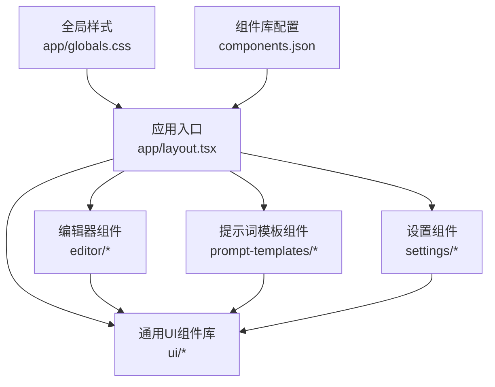
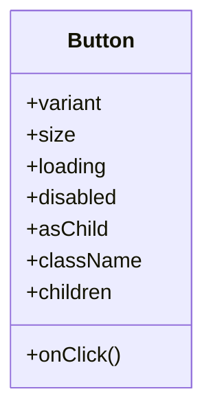
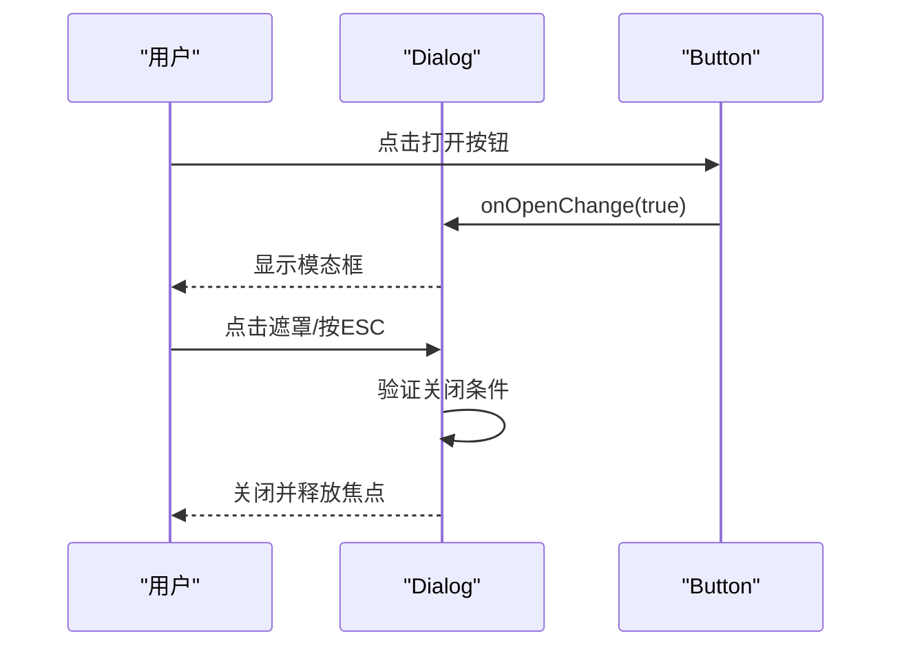
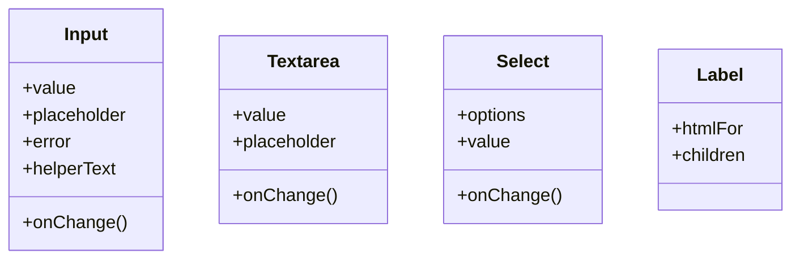
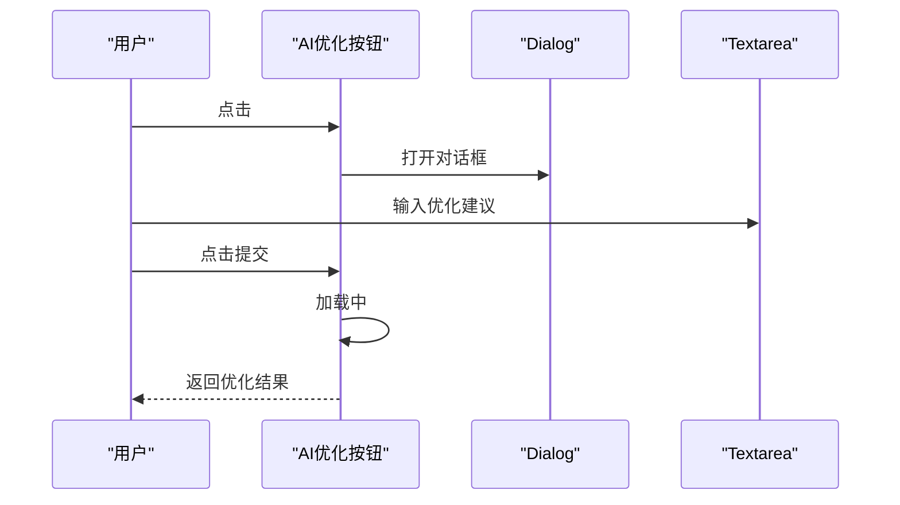
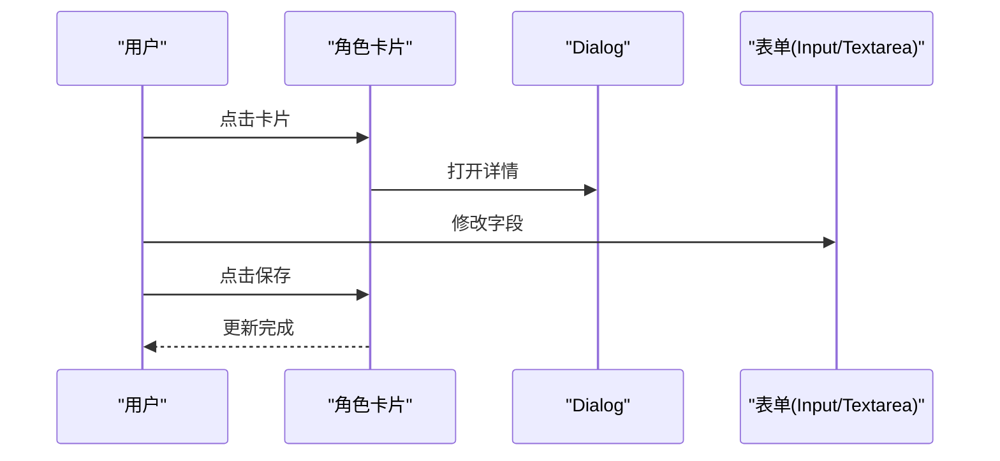
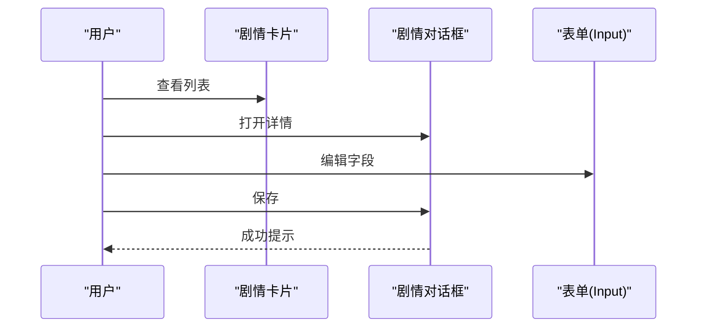
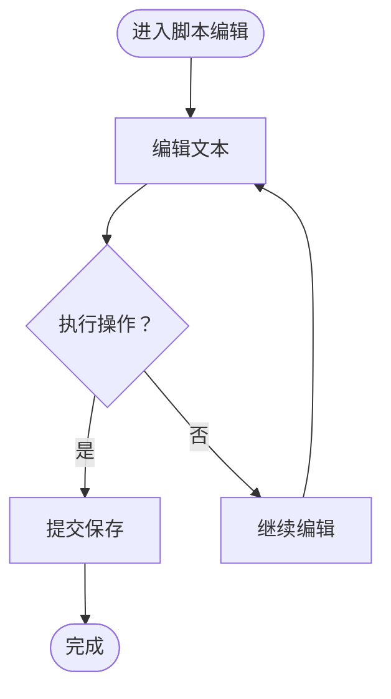
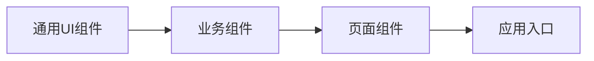

# 前端组件架构

<cite>
**本文档引用的文件**
- [button.tsx](file://src/components/ui/button.tsx)
- [input.tsx](file://src/components/ui/input.tsx)
- [dialog.tsx](file://src/components/ui/dialog.tsx)
- [card.tsx](file://src/components/ui/card.tsx)
- [badge.tsx](file://src/components/ui/badge.tsx)
- [label.tsx](file://src/components/ui/label.tsx)
- [select.tsx](file://src/components/ui/select.tsx)
- [textarea.tsx](file://src/components/ui/textarea.tsx)
- [ai-optimize-button.tsx](file://src/components/editor/ai-optimize-button.tsx)
- [character-card.tsx](file://src/components/editor/character-card.tsx)
- [episode-card.tsx](file://src/components/editor/episode-card.tsx)
- [episode-dialog.tsx](file://src/components/editor/episode-dialog.tsx)
- [script-editor.tsx](file://src/components/editor/script-editor.tsx)
- [shot-card.tsx](file://src/components/editor/shot-card.tsx)
- [video-ratio-picker.tsx](file://src/components/editor/video-ratio-picker.tsx)
- [model-selector.tsx](file://src/components/editor/model-selector.tsx)
- [project-nav.tsx](file://src/components/editor/project-nav.tsx)
- [emotion-curve.tsx](file://src/components/editor/emotion-curve.tsx)
- [prompt-drawer.tsx](file://src/components/prompt-templates/prompt-drawer.tsx)
- [advanced-editor.tsx](file://src/components/prompt-templates/advanced-editor.tsx)
- [preset-dialog.tsx](file://src/components/prompt-templates/preset-dialog.tsx)
- [prompt-preview.tsx](file://src/components/prompt-templates/prompt-preview.tsx)
- [slot-list.tsx](file://src/components/prompt-templates/slot-list.tsx)
- [agent-section.tsx](file://src/components/settings/agent-section.tsx)
- [provider-section.tsx](file://src/components/settings/provider-section.tsx)
- [default-model-picker.tsx](file://src/components/settings/default-model-picker.tsx)
- [create-project-dialog.tsx](file://src/components/create-project-dialog.tsx)
- [project-card.tsx](file://src/components/project-card.tsx)
- [layout.tsx](file://src/app/layout.tsx)
- [globals.css](file://src/app/globals.css)
- [package.json](file://package.json)
</cite>

## 目录
1. [简介](#简介)
2. [项目结构](#项目结构)
3. [核心组件](#核心组件)
4. [架构总览](#架构总览)
5. [详细组件分析](#详细组件分析)
6. [依赖关系分析](#依赖关系分析)
7. [性能考虑](#性能考虑)
8. [故障排除指南](#故障排除指南)
9. [结论](#结论)
10. [附录](#附录)

## 简介
本文件系统性梳理 AIComicBuilder 的前端组件架构，聚焦于可复用 UI 组件与业务场景组件的设计与实现，覆盖视觉外观、行为与交互模式、属性/事件/插槽/自定义选项、响应式设计与无障碍合规、状态管理与动画过渡、样式定制与主题支持、跨浏览器兼容性与性能优化，以及组件组合与集成模式。目标是帮助开发者快速理解并高效扩展组件体系。

## 项目结构
项目采用基于功能域的分层组织：应用入口与布局位于 app 目录，通用 UI 组件位于 components/ui，编辑器相关组件位于 components/editor，提示词模板组件位于 components/prompt-templates，设置相关组件位于 components/settings。全局样式在 app/globals.css 中统一注入，组件库入口由 components.json 指定。

```mermaid
graph TB
subgraph "应用层"
L["app/layout.tsx"]
G["app/globals.css"]
end
subgraph "通用UI组件"
B["ui/button.tsx"]
I["ui/input.tsx"]
D["ui/dialog.tsx"]
C["ui/card.tsx"]
S["ui/select.tsx"]
T["ui/textarea.tsx"]
Lb["ui/label.tsx"]
Ba["ui/badge.tsx"]
end
subgraph "编辑器组件"
E1["editor/ai-optimize-button.tsx"]
E2["editor/character-card.tsx"]
E3["editor/episode-card.tsx"]
E4["editor/episode-dialog.tsx"]
E5["editor/script-editor.tsx"]
E6["editor/shot-card.tsx"]
E7["editor/video-ratio-picker.tsx"]
E8["editor/model-selector.tsx"]
E9["editor/project-nav.tsx"]
E10["editor/emotion-curve.tsx"]
end
subgraph "提示词模板组件"
P1["prompt-templates/prompt-drawer.tsx"]
P2["prompt-templates/advanced-editor.tsx"]
P3["prompt-templates/preset-dialog.tsx"]
P4["prompt-templates/prompt-preview.tsx"]
P5["prompt-templates/slot-list.tsx"]
end
subgraph "设置组件"
Se1["settings/agent-section.tsx"]
Se2["settings/provider-section.tsx"]
Se3["settings/default-model-picker.tsx"]
end
subgraph "其他"
O1["create-project-dialog.tsx"]
O2["project-card.tsx"]
end
L --> B
L --> I
L --> D
L --> C
L --> S
L --> T
L --> Lb
L --> Ba
E1 --> B
E1 --> D
E1 --> T
E2 --> B
E2 --> D
E2 --> I
E2 --> T
E3 --> B
E4 --> B
E4 --> I
E5 --> T
E5 --> B
E6 --> B
E7 --> B
E8 --> B
E9 --> B
E10 --> B
P1 --> B
P2 --> T
P2 --> B
P3 --> B
P3 --> I
P4 --> B
P5 --> B
Se1 --> B
Se2 --> B
Se2 --> I
Se3 --> B
O1 --> B
O1 --> I
O1 --> Lb
O2 --> B
```

图表来源
- [layout.tsx:1-200](file://src/app/layout.tsx#L1-L200)
- [button.tsx:1-200](file://src/components/ui/button.tsx#L1-L200)
- [dialog.tsx:1-200](file://src/components/ui/dialog.tsx#L1-L200)
- [input.tsx:1-200](file://src/components/ui/input.tsx#L1-L200)
- [textarea.tsx:1-200](file://src/components/ui/textarea.tsx#L1-L200)
- [ai-optimize-button.tsx:1-200](file://src/components/editor/ai-optimize-button.tsx#L1-L200)
- [character-card.tsx:1-200](file://src/components/editor/character-card.tsx#L1-L200)
- [episode-dialog.tsx:1-200](file://src/components/editor/episode-dialog.tsx#L1-L200)
- [prompt-drawer.tsx:1-200](file://src/components/prompt-templates/prompt-drawer.tsx#L1-L200)
- [preset-dialog.tsx:1-200](file://src/components/prompt-templates/preset-dialog.tsx#L1-L200)

章节来源
- [layout.tsx:1-200](file://src/app/layout.tsx#L1-L200)
- [globals.css:1-200](file://src/app/globals.css#L1-L200)

## 核心组件
本节概述通用 UI 组件库（Button、Input、Dialog、Card、Select、Textarea、Label、Badge）的职责与协作方式，这些组件是所有业务组件的基础。

- Button：提供多种尺寸、变体与禁用态，用于触发操作与导航。
- Input：基础输入框，支持受控/非受控、错误状态与辅助文本。
- Dialog：模态对话框容器，包含标题、内容与底部操作区。
- Card：卡片容器，常用于信息分组与内容区块展示。
- Select：下拉选择器，支持单选与多选（按需启用）。
- Textarea：多行文本输入，适用于长文本编辑。
- Label：标签组件，配合表单控件提升可访问性。
- Badge：徽标，用于标记状态或数量。

这些组件通过一致的样式变量与主题系统实现统一风格，并在业务组件中被广泛复用以保证一致性与可维护性。

章节来源
- [button.tsx:1-200](file://src/components/ui/button.tsx#L1-L200)
- [input.tsx:1-200](file://src/components/ui/input.tsx#L1-L200)
- [dialog.tsx:1-200](file://src/components/ui/dialog.tsx#L1-L200)
- [card.tsx:1-200](file://src/components/ui/card.tsx#L1-L200)
- [select.tsx:1-200](file://src/components/ui/select.tsx#L1-L200)
- [textarea.tsx:1-200](file://src/components/ui/textarea.tsx#L1-L200)
- [label.tsx:1-200](file://src/components/ui/label.tsx#L1-L200)
- [badge.tsx:1-200](file://src/components/ui/badge.tsx#L1-L200)

## 架构总览
组件架构遵循“通用 UI 组件 + 场景化业务组件”的分层设计。通用 UI 组件提供基础能力，业务组件在不同页面与流程中组合使用，形成完整的创作工作流。

图表来源
- [layout.tsx:1-200](file://src/app/layout.tsx#L1-L200)
- [globals.css:1-200](file://src/app/globals.css#L1-L200)

## 详细组件分析

### Button 组件
- 视觉外观：支持主按钮、次按钮、幽灵按钮、危险按钮等变体；提供小、中、大三种尺寸；在悬停、按下、禁用状态下有明确反馈。
- 行为与交互：点击事件通过 onClick 回调暴露；支持 loading 态；可作为链接或按钮标签渲染。
- 属性（Props）：variant、size、loading、disabled、asChild、className、onClick 等。
- 事件：onClick。
- 插槽/自定义：无具名插槽；可通过 children 自定义图标或文本。
- 使用示例路径：[ai-optimize-button.tsx:1-200](file://src/components/editor/ai-optimize-button.tsx#L1-L200)、[episode-dialog.tsx:1-200](file://src/components/editor/episode-dialog.tsx#L1-L200)、[create-project-dialog.tsx:1-200](file://src/components/create-project-dialog.tsx#L1-L200)。

图表来源
- [button.tsx:1-200](file://src/components/ui/button.tsx#L1-L200)

章节来源
- [button.tsx:1-200](file://src/components/ui/button.tsx#L1-L200)
- [ai-optimize-button.tsx:1-200](file://src/components/editor/ai-optimize-button.tsx#L1-L200)
- [episode-dialog.tsx:1-200](file://src/components/editor/episode-dialog.tsx#L1-L200)
- [create-project-dialog.tsx:1-200](file://src/components/create-project-dialog.tsx#L1-L200)

### Dialog 组件
- 视觉外观：模态遮罩、居中卡片、标题栏、内容区与操作区；支持 ESC 关闭与点击背景关闭。
- 行为与交互：通过 isOpen 控制显隐；支持键盘交互（Tab 切换焦点、Shift+Tab 循环）；关闭时自动释放焦点。
- 属性（Props）：isOpen、onOpenChange、title、children、className。
- 事件：onOpenChange。
- 插槽/自定义：无具名插槽；通过 children 传入标题与内容。
- 使用示例路径：[ai-optimize-button.tsx:1-200](file://src/components/editor/ai-optimize-button.tsx#L1-L200)、[character-card.tsx:1-200](file://src/components/editor/character-card.tsx#L1-L200)。

图表来源
- [dialog.tsx:1-200](file://src/components/ui/dialog.tsx#L1-L200)
- [ai-optimize-button.tsx:1-200](file://src/components/editor/ai-optimize-button.tsx#L1-L200)

章节来源
- [dialog.tsx:1-200](file://src/components/ui/dialog.tsx#L1-L200)
- [ai-optimize-button.tsx:1-200](file://src/components/editor/ai-optimize-button.tsx#L1-L200)
- [character-card.tsx:1-200](file://src/components/editor/character-card.tsx#L1-L200)

### Input/Textarea/Select/Label 组件
- Input：基础文本输入，支持受控值、占位符、错误状态与辅助文本。
- Textarea：多行文本输入，适用于脚本与说明编辑。
- Select：下拉选择器，支持选项渲染与受控/非受控模式。
- Label：与表单控件配对使用，提升可访问性。
- 使用示例路径：[episode-dialog.tsx:1-200](file://src/components/editor/episode-dialog.tsx#L1-L200)、[create-project-dialog.tsx:1-200](file://src/components/create-project-dialog.tsx#L1-L200)、[character-card.tsx:1-200](file://src/components/editor/character-card.tsx#L1-L200)。

图表来源
- [input.tsx:1-200](file://src/components/ui/input.tsx#L1-L200)
- [textarea.tsx:1-200](file://src/components/ui/textarea.tsx#L1-L200)
- [select.tsx:1-200](file://src/components/ui/select.tsx#L1-L200)
- [label.tsx:1-200](file://src/components/ui/label.tsx#L1-L200)

章节来源
- [input.tsx:1-200](file://src/components/ui/input.tsx#L1-L200)
- [textarea.tsx:1-200](file://src/components/ui/textarea.tsx#L1-L200)
- [select.tsx:1-200](file://src/components/ui/select.tsx#L1-L200)
- [label.tsx:1-200](file://src/components/ui/label.tsx#L1-L200)
- [episode-dialog.tsx:1-200](file://src/components/editor/episode-dialog.tsx#L1-L200)
- [create-project-dialog.tsx:1-200](file://src/components/create-project-dialog.tsx#L1-L200)
- [character-card.tsx:1-200](file://src/components/editor/character-card.tsx#L1-L200)

### 编辑器场景组件

#### AI 优化按钮（AI Optimize Button）
- 功能：触发 AI 优化流程，弹出对话框输入上下文，提交后返回结果。
- 交互：点击按钮 -> 打开对话框 -> 输入优化建议 -> 提交 -> 加载中 -> 结果展示。
- 属性/事件：无特定 props；通过回调与外部状态联动。
- 使用示例路径：[ai-optimize-button.tsx:1-200](file://src/components/editor/ai-optimize-button.tsx#L1-L200)。

图表来源
- [ai-optimize-button.tsx:1-200](file://src/components/editor/ai-optimize-button.tsx#L1-L200)
- [dialog.tsx:1-200](file://src/components/ui/dialog.tsx#L1-L200)
- [textarea.tsx:1-200](file://src/components/ui/textarea.tsx#L1-L200)

章节来源
- [ai-optimize-button.tsx:1-200](file://src/components/editor/ai-optimize-button.tsx#L1-L200)

#### 角色卡片（Character Card）
- 功能：展示与编辑角色信息，支持弹窗详情与表单输入。
- 交互：点击卡片 -> 弹出详情对话框 -> 编辑字段 -> 保存。
- 使用示例路径：[character-card.tsx:1-200](file://src/components/editor/character-card.tsx#L1-L200)。

图表来源
- [character-card.tsx:1-200](file://src/components/editor/character-card.tsx#L1-L200)
- [dialog.tsx:1-200](file://src/components/ui/dialog.tsx#L1-L200)
- [input.tsx:1-200](file://src/components/ui/input.tsx#L1-L200)
- [textarea.tsx:1-200](file://src/components/ui/textarea.tsx#L1-L200)

章节来源
- [character-card.tsx:1-200](file://src/components/editor/character-card.tsx#L1-L200)

#### 剧情卡片与对话框（Episode Card & Episode Dialog）
- 功能：展示剧情概要与详情，支持编辑与保存。
- 交互：列表卡片 -> 点击进入详情 -> 编辑字段 -> 保存。
- 使用示例路径：[episode-card.tsx:1-200](file://src/components/editor/episode-card.tsx#L1-L200)、[episode-dialog.tsx:1-200](file://src/components/editor/episode-dialog.tsx#L1-L200)。

图表来源
- [episode-card.tsx:1-200](file://src/components/editor/episode-card.tsx#L1-L200)
- [episode-dialog.tsx:1-200](file://src/components/editor/episode-dialog.tsx#L1-L200)
- [input.tsx:1-200](file://src/components/ui/input.tsx#L1-L200)

章节来源
- [episode-card.tsx:1-200](file://src/components/editor/episode-card.tsx#L1-L200)
- [episode-dialog.tsx:1-200](file://src/components/editor/episode-dialog.tsx#L1-L200)

#### 脚本编辑器（Script Editor）
- 功能：多行文本编辑，支持快捷操作与提交。
- 交互：输入/粘贴 -> 操作按钮 -> 提交保存。
- 使用示例路径：[script-editor.tsx:1-200](file://src/components/editor/script-editor.tsx#L1-L200)。

图表来源
- [script-editor.tsx:1-200](file://src/components/editor/script-editor.tsx#L1-L200)
- [textarea.tsx:1-200](file://src/components/ui/textarea.tsx#L1-L200)

章节来源
- [script-editor.tsx:1-200](file://src/components/editor/script-editor.tsx#L1-L200)

#### 分镜卡片（Shot Card）
- 功能：展示分镜信息与操作按钮。
- 交互：点击卡片 -> 操作按钮 -> 导航/生成。
- 使用示例路径：[shot-card.tsx:1-200](file://src/components/editor/shot-card.tsx#L1-L200)。

章节来源
- [shot-card.tsx:1-200](file://src/components/editor/shot-card.tsx#L1-L200)

#### 视频比例选择器（Video Ratio Picker）
- 功能：选择视频宽高比，影响渲染输出。
- 交互：点击选项 -> 应用到当前场景。
- 使用示例路径：[video-ratio-picker.tsx:1-200](file://src/components/editor/video-ratio-picker.tsx#L1-L200)。

章节来源
- [video-ratio-picker.tsx:1-200](file://src/components/editor/video-ratio-picker.tsx#L1-L200)

#### 模型选择器（Model Selector）
- 功能：选择生成模型，影响后续生成策略。
- 交互：从下拉菜单选择 -> 更新全局或场景模型。
- 使用示例路径：[model-selector.tsx:1-200](file://src/components/editor/model-selector.tsx#L1-L200)。

章节来源
- [model-selector.tsx:1-200](file://src/components/editor/model-selector.tsx#L1-L200)

#### 项目导航（Project Nav）
- 功能：在项目内进行页面跳转与状态切换。
- 交互：点击导航项 -> 切换路由 -> 更新面包屑。
- 使用示例路径：[project-nav.tsx:1-200](file://src/components/editor/project-nav.tsx#L1-L200)。

章节来源
- [project-nav.tsx:1-200](file://src/components/editor/project-nav.tsx#L1-L200)

#### 情绪曲线（Emotion Curve）
- 功能：可视化情绪变化曲线，辅助脚本节奏控制。
- 交互：拖拽点位 -> 实时更新曲线 -> 同步到脚本。
- 使用示例路径：[emotion-curve.tsx:1-200](file://src/components/editor/emotion-curve.tsx#L1-L200)。

章节来源
- [emotion-curve.tsx:1-200](file://src/components/editor/emotion-curve.tsx#L1-L200)

### 提示词模板组件

#### 提示词抽屉（Prompt Drawer）
- 功能：侧边抽屉展示提示词模板集合，支持展开/收起。
- 交互：点击抽屉开关 -> 展示模板列表 -> 选择模板 -> 应用到编辑器。
- 使用示例路径：[prompt-drawer.tsx:1-200](file://src/components/prompt-templates/prompt-drawer.tsx#L1-L200)。

章节来源
- [prompt-drawer.tsx:1-200](file://src/components/prompt-templates/prompt-drawer.tsx#L1-L200)

#### 高级编辑器（Advanced Editor）
- 功能：复杂提示词结构编辑，支持变量与占位符。
- 交互：编辑内容 -> 预览 -> 应用 -> 保存版本。
- 使用示例路径：[advanced-editor.tsx:1-200](file://src/components/prompt-templates/advanced-editor.tsx#L1-L200)。

章节来源
- [advanced-editor.tsx:1-200](file://src/components/prompt-templates/advanced-editor.tsx#L1-L200)

#### 预设对话框（Preset Dialog）
- 功能：管理预设模板，支持新增、编辑、删除。
- 交互：打开对话框 -> 操作预设 -> 确认变更。
- 使用示例路径：[preset-dialog.tsx:1-200](file://src/components/prompt-templates/preset-dialog.tsx#L1-L200)。

章节来源
- [preset-dialog.tsx:1-200](file://src/components/prompt-templates/preset-dialog.tsx#L1-L200)

#### 预览与插槽列表（Preview & Slot List）
- 功能：预览最终提示词并展示可替换插槽。
- 交互：渲染预览 -> 高亮插槽 -> 点击编辑。
- 使用示例路径：[prompt-preview.tsx:1-200](file://src/components/prompt-templates/prompt-preview.tsx#L1-L200)、[slot-list.tsx:1-200](file://src/components/prompt-templates/slot-list.tsx#L1-L200)。

章节来源
- [prompt-preview.tsx:1-200](file://src/components/prompt-templates/prompt-preview.tsx#L1-L200)
- [slot-list.tsx:1-200](file://src/components/prompt-templates/slot-list.tsx#L1-L200)

### 设置组件

#### 代理设置（Agent Section）
- 功能：配置代理平台与绑定关系。
- 交互：填写表单 -> 保存 -> 生效。
- 使用示例路径：[agent-section.tsx:1-200](file://src/components/settings/agent-section.tsx#L1-L200)。

章节来源
- [agent-section.tsx:1-200](file://src/components/settings/agent-section.tsx#L1-L200)

#### 提供商设置（Provider Section）
- 功能：管理模型提供商配置。
- 交互：添加/编辑提供商 -> 验证配置 -> 保存。
- 使用示例路径：[provider-section.tsx:1-200](file://src/components/settings/provider-section.tsx#L1-L200)。

章节来源
- [provider-section.tsx:1-200](file://src/components/settings/provider-section.tsx#L1-L200)

#### 默认模型选择器（Default Model Picker）
- 功能：选择默认生成模型。
- 交互：从下拉菜单选择 -> 应用到新项目。
- 使用示例路径：[default-model-picker.tsx:1-200](file://src/components/settings/default-model-picker.tsx#L1-L200)。

章节来源
- [default-model-picker.tsx:1-200](file://src/components/settings/default-model-picker.tsx#L1-L200)

### 其他业务组件

#### 创建项目对话框（Create Project Dialog）
- 功能：创建新项目，收集基本信息。
- 交互：填写表单 -> 提交 -> 跳转到项目页。
- 使用示例路径：[create-project-dialog.tsx:1-200](file://src/components/create-project-dialog.tsx#L1-L200)。

章节来源
- [create-project-dialog.tsx:1-200](file://src/components/create-project-dialog.tsx#L1-L200)

#### 项目卡片（Project Card）
- 功能：展示项目列表，支持进入详情。
- 交互：点击卡片 -> 跳转到项目仪表盘。
- 使用示例路径：[project-card.tsx:1-200](file://src/components/project-card.tsx#L1-L200)。

章节来源
- [project-card.tsx:1-200](file://src/components/project-card.tsx#L1-L200)

## 依赖关系分析
- 低耦合：通用 UI 组件独立封装，业务组件仅通过 props 与回调交互，避免直接依赖具体实现。
- 可复用：Button、Dialog、Input 等在多个业务场景重复使用，减少重复开发。
- 可测试：组件接口清晰，便于单元测试与集成测试。
- 可扩展：通过 variants/size/classNames 支持主题与样式扩展。

图表来源
- [button.tsx:1-200](file://src/components/ui/button.tsx#L1-L200)
- [dialog.tsx:1-200](file://src/components/ui/dialog.tsx#L1-L200)
- [ai-optimize-button.tsx:1-200](file://src/components/editor/ai-optimize-button.tsx#L1-L200)
- [episode-dialog.tsx:1-200](file://src/components/editor/episode-dialog.tsx#L1-L200)

## 性能考虑
- 渲染优化：使用 React.memo 或类似机制缓存稳定组件；避免不必要的重渲染。
- 事件处理：统一事件委托与防抖；长列表使用虚拟滚动。
- 图片与资源：懒加载图片与资源；压缩与 CDN 加速。
- 样式：提取公共样式，减少重复类名；CSS-in-JS 注意样式抖动。
- 体积控制：按需引入组件与图标；Tree Shaking 生效。
- 浏览器兼容：使用 PostCSS 与 autoprefixer；polyfill 按需加载。

## 故障排除指南
- 对话框无法关闭：检查 isOpen 与 onOpenChange 是否正确传递；确认 ESC 与遮罩点击事件是否被阻止。
- 表单校验失败：检查 Input/Textarea 的 error 与 helperText 是否正确设置；确保 Label 的 htmlFor 与控件 id 匹配。
- 按钮点击无响应：确认 disabled 与 loading 状态；检查 onClick 是否被覆盖。
- 提示词模板不生效：核对抽屉开关状态与模板应用逻辑；检查插槽替换是否完整。
- 主题样式异常：检查全局样式注入顺序与 CSS 变量覆盖链路。

章节来源
- [dialog.tsx:1-200](file://src/components/ui/dialog.tsx#L1-L200)
- [input.tsx:1-200](file://src/components/ui/input.tsx#L1-L200)
- [button.tsx:1-200](file://src/components/ui/button.tsx#L1-L200)
- [prompt-drawer.tsx:1-200](file://src/components/prompt-templates/prompt-drawer.tsx#L1-L200)

## 结论
AIComicBuilder 的前端组件体系以通用 UI 组件为核心，围绕编辑器、提示词模板与设置三大场景构建了高内聚、低耦合的组件生态。通过清晰的属性/事件/插槽约定、一致的样式与主题系统、完善的可访问性与响应式设计，实现了良好的开发体验与用户体验。建议在后续迭代中持续完善组件文档、测试覆盖率与性能监控，以支撑更大规模的业务演进。

## 附录
- 组件库配置：components.json 定义了组件库入口与别名映射。
- 全局样式：globals.css 注入全局变量与基础样式，确保组件一致性。
- 依赖清单：package.json 记录了构建与运行时依赖，包括 UI 框架与工具链。

章节来源
- [package.json:1-200](file://package.json#L1-L200)
- [globals.css:1-200](file://src/app/globals.css#L1-L200)