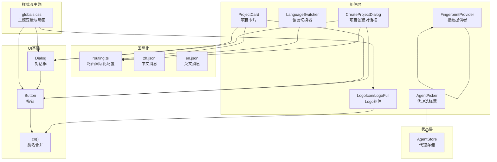
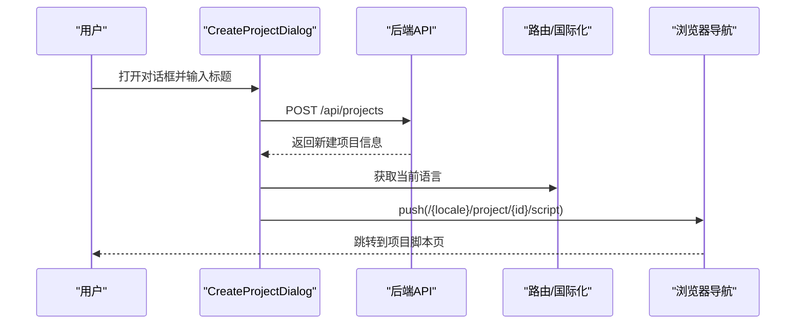
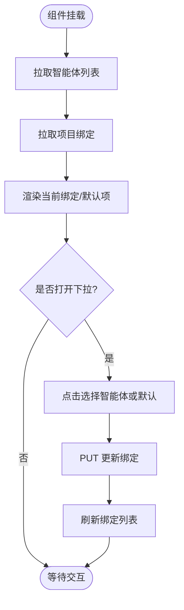
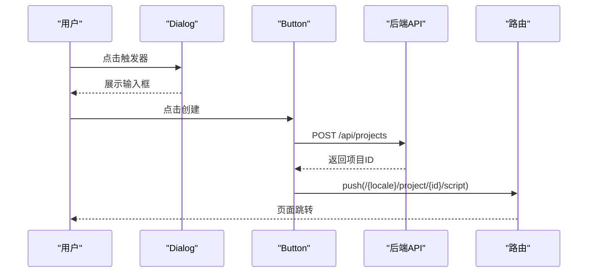
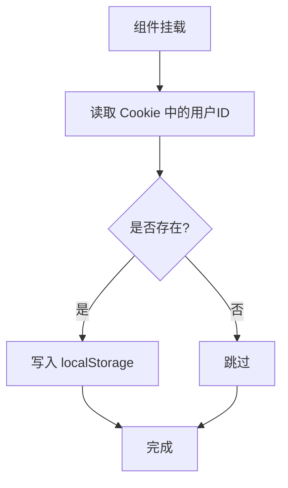
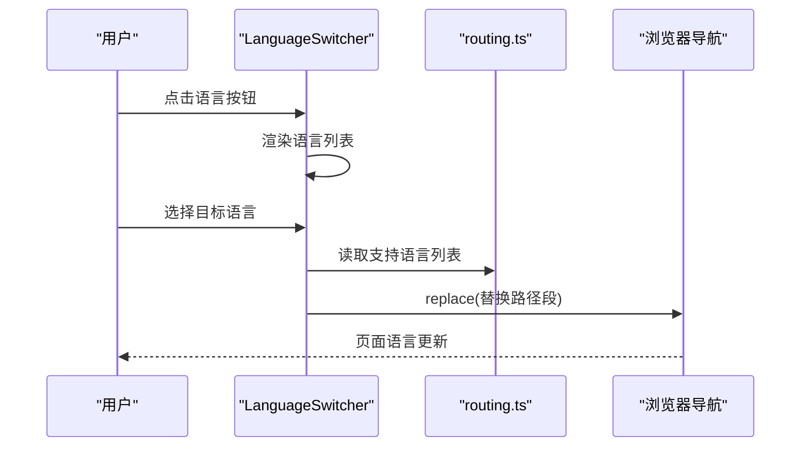
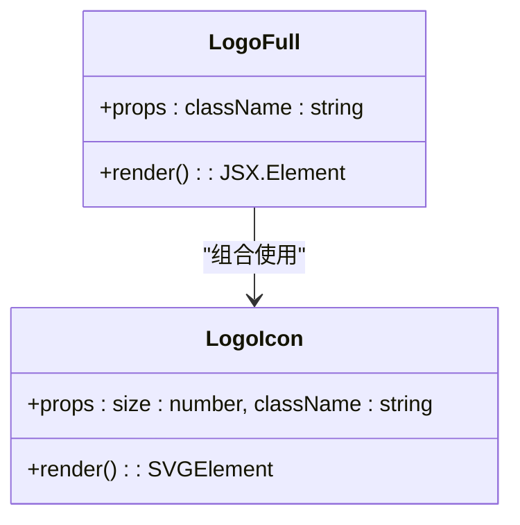
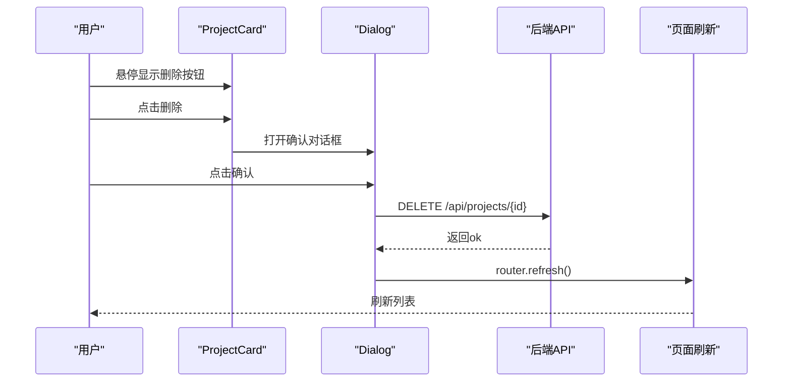
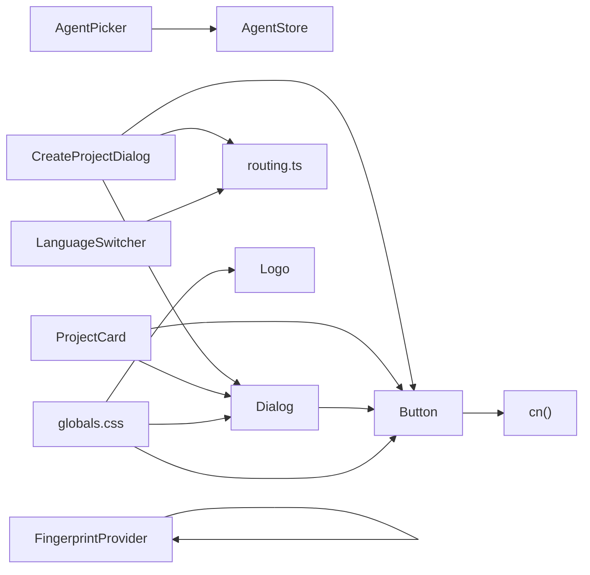

# 工具组件

<cite>
**本文引用的文件**
- [agent-picker.tsx](file://src/components/agent-picker.tsx)
- [create-project-dialog.tsx](file://src/components/create-project-dialog.tsx)
- [fingerprint-provider.tsx](file://src/components/fingerprint-provider.tsx)
- [language-switcher.tsx](file://src/components/language-switcher.tsx)
- [logo.tsx](file://src/components/logo.tsx)
- [project-card.tsx](file://src/components/project-card.tsx)
- [agent-store.ts](file://src/stores/agent-store.ts)
- [routing.ts](file://src/i18n/routing.ts)
- [zh.json](file://messages/zh.json)
- [en.json](file://messages/en.json)
- [button.tsx](file://src/components/ui/button.tsx)
- [dialog.tsx](file://src/components/ui/dialog.tsx)
- [utils.ts](file://src/lib/utils.ts)
- [globals.css](file://src/app/globals.css)
- [layout.tsx](file://src/app/layout.tsx)
</cite>

## 目录
1. [引言](#引言)
2. [项目结构](#项目结构)
3. [核心组件](#核心组件)
4. [架构总览](#架构总览)
5. [详细组件分析](#详细组件分析)
6. [依赖分析](#依赖分析)
7. [性能考量](#性能考量)
8. [故障排查指南](#故障排查指南)
9. [结论](#结论)
10. [附录](#附录)

## 引言
本文件聚焦于 AIComicBuilder 的工具组件，包括代理选择器、项目创建对话框、指纹提供者、语言切换器、Logo 组件与项目卡片。文档从实现与用途出发，梳理通用性设计与可复用性考虑，说明配置项与扩展机制，阐述与全局状态与路由系统的集成方式，并给出定制与主题适配方法以及国际化支持与本地化处理策略。

## 项目结构
工具组件位于 src/components 下，围绕“设置/仪表盘/项目”等页面提供交互与展示能力；状态管理通过 Zustand 存储在 src/stores 中；国际化资源位于 messages 目录；UI 基础组件封装在 src/components/ui；全局样式与主题变量在 src/app/globals.css 中定义。

图表来源
- [agent-picker.tsx:1-103](file://src/components/agent-picker.tsx#L1-L103)
- [create-project-dialog.tsx:1-89](file://src/components/create-project-dialog.tsx#L1-L89)
- [fingerprint-provider.tsx:1-32](file://src/components/fingerprint-provider.tsx#L1-L32)
- [language-switcher.tsx:1-77](file://src/components/language-switcher.tsx#L1-L77)
- [logo.tsx:1-52](file://src/components/logo.tsx#L1-L52)
- [project-card.tsx:1-149](file://src/components/project-card.tsx#L1-L149)
- [agent-store.ts:1-56](file://src/stores/agent-store.ts#L1-L56)
- [routing.ts:1-7](file://src/i18n/routing.ts#L1-L7)
- [button.tsx:1-58](file://src/components/ui/button.tsx#L1-L58)
- [dialog.tsx:1-153](file://src/components/ui/dialog.tsx#L1-L153)
- [utils.ts:1-7](file://src/lib/utils.ts#L1-L7)
- [globals.css:1-248](file://src/app/globals.css#L1-L248)

章节来源
- [agent-picker.tsx:1-103](file://src/components/agent-picker.tsx#L1-L103)
- [create-project-dialog.tsx:1-89](file://src/components/create-project-dialog.tsx#L1-L89)
- [fingerprint-provider.tsx:1-32](file://src/components/fingerprint-provider.tsx#L1-L32)
- [language-switcher.tsx:1-77](file://src/components/language-switcher.tsx#L1-L77)
- [logo.tsx:1-52](file://src/components/logo.tsx#L1-L52)
- [project-card.tsx:1-149](file://src/components/project-card.tsx#L1-L149)
- [agent-store.ts:1-56](file://src/stores/agent-store.ts#L1-L56)
- [routing.ts:1-7](file://src/i18n/routing.ts#L1-L7)
- [button.tsx:1-58](file://src/components/ui/button.tsx#L1-L58)
- [dialog.tsx:1-153](file://src/components/ui/dialog.tsx#L1-L153)
- [utils.ts:1-7](file://src/lib/utils.ts#L1-L7)
- [globals.css:1-248](file://src/app/globals.css#L1-L248)

## 核心组件
- 代理选择器：按项目与类别动态绑定智能体，支持默认与具体智能体选择，具备下拉菜单与外部点击关闭。
- 项目创建对话框：弹窗输入项目标题，调用后端接口创建项目并跳转至相应语言路径的项目页。
- 指纹提供者：在客户端初始化时同步中间件设置的用户指纹到本地存储，供后续请求读取。
- 语言切换器：在多语言之间切换，更新路径段以保持路由国际化一致。
- Logo 组件：提供矢量图标与完整品牌标识，支持尺寸与类名定制。
- 项目卡片：展示项目标题、状态、创建时间，支持删除确认与跳转至项目详情页。

章节来源
- [agent-picker.tsx:13-102](file://src/components/agent-picker.tsx#L13-L102)
- [create-project-dialog.tsx:20-88](file://src/components/create-project-dialog.tsx#L20-L88)
- [fingerprint-provider.tsx:12-31](file://src/components/fingerprint-provider.tsx#L12-L31)
- [language-switcher.tsx:23-76](file://src/components/language-switcher.tsx#L23-L76)
- [logo.tsx:12-51](file://src/components/logo.tsx#L12-L51)
- [project-card.tsx:46-148](file://src/components/project-card.tsx#L46-L148)

## 架构总览
工具组件与全局状态、国际化、UI 基础库及主题系统协同工作，形成统一的交互与展示体系。

图表来源
- [create-project-dialog.tsx:28-43](file://src/components/create-project-dialog.tsx#L28-L43)
- [routing.ts:1-7](file://src/i18n/routing.ts#L1-L7)

## 详细组件分析

### 代理选择器（AgentPicker）
- 功能要点
  - 初始化时拉取可用智能体与项目绑定，支持按类别筛选。
  - 提供默认与具体智能体的选择入口，高亮当前绑定。
  - 外部点击自动收起下拉菜单，避免遮挡。
- 状态与存储
  - 使用 AgentStore 进行智能体列表、绑定查询与更新。
- 国际化
  - 使用 next-intl 的翻译函数渲染默认智能体文案。
- 主题与样式
  - 使用 CSS 变量与 Tailwind 类控制边框、背景、文字颜色与悬停态。
- 可复用性
  - 通过 projectId 与 category 参数解耦，可在不同页面复用。
- 扩展机制
  - 支持新增智能体类别，过滤条件可按 category 扩展。
  - 可注入更多属性（如禁用态、只读态）以适配复杂场景。

图表来源
- [agent-picker.tsx:19-31](file://src/components/agent-picker.tsx#L19-L31)
- [agent-picker.tsx:33-35](file://src/components/agent-picker.tsx#L33-L35)
- [agent-picker.tsx:54-99](file://src/components/agent-picker.tsx#L54-L99)
- [agent-store.ts:30-54](file://src/stores/agent-store.ts#L30-L54)

章节来源
- [agent-picker.tsx:13-102](file://src/components/agent-picker.tsx#L13-L102)
- [agent-store.ts:16-55](file://src/stores/agent-store.ts#L16-L55)

### 项目创建对话框（CreateProjectDialog）
- 功能要点
  - 对话框触发器渲染“新建项目”按钮。
  - 输入校验与加载态控制，提交后清空输入并跳转。
  - 使用 next-intl 获取当前语言，确保路由正确。
- UI 基础
  - 基于 Dialog 封装，包含标题、内容区与底部按钮。
  - 按钮组件提供多种变体与尺寸。
- 国际化
  - 使用 useTranslations 渲染多语言文案。
- 路由集成
  - 通过 useRouter 与 useLocale 计算目标路径并跳转。
- 错误处理
  - 标题为空时不发起请求；加载期间禁用按钮。

图表来源
- [create-project-dialog.tsx:46-88](file://src/components/create-project-dialog.tsx#L46-L88)
- [dialog.tsx:9-79](file://src/components/ui/dialog.tsx#L9-L79)
- [button.tsx:42-57](file://src/components/ui/button.tsx#L42-L57)

章节来源
- [create-project-dialog.tsx:20-88](file://src/components/create-project-dialog.tsx#L20-L88)
- [dialog.tsx:1-153](file://src/components/ui/dialog.tsx#L1-L153)
- [button.tsx:1-58](file://src/components/ui/button.tsx#L1-L58)

### 指纹提供者（FingerprintProvider）
- 功能要点
  - 在客户端启动时从 Cookie 读取用户指纹并同步到 localStorage。
  - 保证后续 apiFetch 能通过 getUserId 正常读取用户身份。
- 安全与一致性
  - 仅在首次请求由中间件设置 Cookie 后执行同步，避免重复写入。
- 可复用性
  - 作为根级 Provider 包裹应用，全局生效。

图表来源
- [fingerprint-provider.tsx:17-28](file://src/components/fingerprint-provider.tsx#L17-L28)

章节来源
- [fingerprint-provider.tsx:12-31](file://src/components/fingerprint-provider.tsx#L12-L31)

### 语言切换器（LanguageSwitcher）
- 功能要点
  - 列表渲染路由支持的语言，当前语言高亮并显示勾选标记。
  - 点击切换后替换路径段并更新路由。
  - 外部点击自动收起下拉菜单。
- 国际化
  - 使用 routing.locales 与本地映射表控制显示语言标签。
- 路由集成
  - 通过 usePathname 与 useRouter 替换路径段实现语言切换。

图表来源
- [language-switcher.tsx:23-76](file://src/components/language-switcher.tsx#L23-L76)
- [routing.ts:3-6](file://src/i18n/routing.ts#L3-L6)

章节来源
- [language-switcher.tsx:23-76](file://src/components/language-switcher.tsx#L23-L76)
- [routing.ts:1-7](file://src/i18n/routing.ts#L1-L7)

### Logo 组件（LogoIcon/LogoFull）
- 功能要点
  - LogoIcon 提供矢量图标，支持 size 与 className 自定义。
  - LogoFull 组合图标与品牌文字，便于在导航与标题栏使用。
- 主题适配
  - 使用当前色（currentColor）与主题变量，适配浅/深色模式。
- 可复用性
  - 通过 props 控制尺寸与容器类名，适用于多种布局场景。

图表来源
- [logo.tsx:12-51](file://src/components/logo.tsx#L12-L51)

章节来源
- [logo.tsx:12-51](file://src/components/logo.tsx#L12-L51)
- [globals.css:54-156](file://src/app/globals.css#L54-L156)

### 项目卡片（ProjectCard）
- 功能要点
  - 展示项目标题、状态徽标、创建时间与跳转链接。
  - 悬停显示删除按钮，点击弹出确认对话框。
  - 删除成功后刷新当前页面。
- 国际化
  - 使用 useTranslations 渲染状态文案与通用文案。
  - 创建时间通过 useLocale 格式化。
- UI 基础
  - 基于 Dialog 封装删除确认对话框。
  - 按钮组件用于确认与取消操作。
- 错误处理
  - 删除过程中禁用按钮，finally 中清理状态。

图表来源
- [project-card.tsx:53-67](file://src/components/project-card.tsx#L53-L67)
- [project-card.tsx:124-145](file://src/components/project-card.tsx#L124-L145)
- [dialog.tsx:9-79](file://src/components/ui/dialog.tsx#L9-L79)
- [button.tsx:42-57](file://src/components/ui/button.tsx#L42-L57)

章节来源
- [project-card.tsx:46-148](file://src/components/project-card.tsx#L46-L148)
- [dialog.tsx:1-153](file://src/components/ui/dialog.tsx#L1-L153)
- [button.tsx:1-58](file://src/components/ui/button.tsx#L1-L58)

## 依赖分析
- 组件间耦合
  - AgentPicker 依赖 AgentStore，耦合于状态与 API。
  - ProjectCard 依赖 Dialog/Button 与 API，耦合于 UI 基础与网络请求。
  - CreateProjectDialog 依赖 Dialog/Button 与路由国际化。
  - LanguageSwitcher 依赖 routing.ts 与路由 API。
  - FingerprintProvider 依赖 Cookie 与 localStorage。
- 外部依赖
  - next-intl 提供翻译与路由国际化。
  - Base UI 提供 Dialog/Button 原语。
  - Tailwind/CSS 变量提供主题与动画。
- 循环依赖
  - 当前文件未见循环依赖迹象。

图表来源
- [agent-picker.tsx:14-15](file://src/components/agent-picker.tsx#L14-L15)
- [agent-store.ts:1-2](file://src/stores/agent-store.ts#L1-L2)
- [create-project-dialog.tsx:5-18](file://src/components/create-project-dialog.tsx#L5-L18)
- [dialog.tsx:3-7](file://src/components/ui/dialog.tsx#L3-L7)
- [button.tsx:3-6](file://src/components/ui/button.tsx#L3-L6)
- [routing.ts:1-7](file://src/i18n/routing.ts#L1-L7)
- [project-card.tsx:11-19](file://src/components/project-card.tsx#L11-L19)
- [fingerprint-provider.tsx:17-27](file://src/components/fingerprint-provider.tsx#L17-L27)
- [utils.ts:4-6](file://src/lib/utils.ts#L4-L6)
- [globals.css:1-48](file://src/app/globals.css#L1-L48)

章节来源
- [agent-picker.tsx:13-102](file://src/components/agent-picker.tsx#L13-L102)
- [create-project-dialog.tsx:20-88](file://src/components/create-project-dialog.tsx#L20-L88)
- [project-card.tsx:46-148](file://src/components/project-card.tsx#L46-L148)
- [language-switcher.tsx:23-76](file://src/components/language-switcher.tsx#L23-L76)
- [fingerprint-provider.tsx:12-31](file://src/components/fingerprint-provider.tsx#L12-L31)
- [agent-store.ts:16-55](file://src/stores/agent-store.ts#L16-L55)
- [routing.ts:1-7](file://src/i18n/routing.ts#L1-L7)
- [dialog.tsx:1-153](file://src/components/ui/dialog.tsx#L1-L153)
- [button.tsx:1-58](file://src/components/ui/button.tsx#L1-L58)
- [utils.ts:1-7](file://src/lib/utils.ts#L1-L7)
- [globals.css:1-248](file://src/app/globals.css#L1-L248)

## 性能考量
- 渲染优化
  - 下拉菜单仅在打开时渲染，减少不必要的 DOM 结构。
  - 项目卡片状态徽标使用 CSS 动画实现，避免重排。
- 网络请求
  - 代理绑定与项目创建均采用异步请求，配合加载态避免重复提交。
- 样式与主题
  - 使用 CSS 变量与 Tailwind 类，减少运行时计算与样式抖动。
- 国际化
  - 文案通过 next-intl 缓存，避免重复解析。

## 故障排查指南
- 代理选择器无选项
  - 检查 AgentStore 是否成功拉取智能体列表与绑定。
  - 确认项目 ID 与类别参数传入正确。
- 项目创建失败
  - 检查请求头 Content-Type 与请求体字段。
  - 确认路由语言段与目标路径拼接逻辑。
- 语言切换无效
  - 检查 routing.locales 是否包含目标语言。
  - 确认 usePathname 返回的路径段可替换。
- 指纹未同步
  - 检查 Cookie 中是否存在 ai_comic_uid。
  - 确认 localStorage 写入成功且未被清理。
- 删除项目不生效
  - 检查 DELETE 请求返回状态码与响应体。
  - 确认 router.refresh() 触发页面刷新。

章节来源
- [agent-store.ts:30-54](file://src/stores/agent-store.ts#L30-L54)
- [create-project-dialog.tsx:28-43](file://src/components/create-project-dialog.tsx#L28-L43)
- [routing.ts:3-6](file://src/i18n/routing.ts#L3-L6)
- [fingerprint-provider.tsx:17-28](file://src/components/fingerprint-provider.tsx#L17-L28)
- [project-card.tsx:56-67](file://src/components/project-card.tsx#L56-L67)

## 结论
上述工具组件以简洁的职责划分与稳定的依赖关系，实现了代理绑定、项目创建、用户指纹同步、语言切换、品牌展示与项目管理等核心功能。通过 next-intl 与路由国际化、Zustand 状态管理、Base UI 与 Tailwind 主题系统，组件具备良好的可复用性与可扩展性，适合在多语言、多项目场景下持续演进。

## 附录
- 配置选项与扩展建议
  - 代理选择器：支持新增类别与平台，可通过 AgentStore 的 fetchAgents/fetchBindings 扩展。
  - 项目创建对话框：可增加必填校验、输入长度限制与错误提示。
  - 语言切换器：可增加语言偏好持久化与回退策略。
  - 项目卡片：可扩展更多状态与操作按钮，增强批量管理能力。
- 主题适配方法
  - 使用 CSS 变量覆盖主题令牌，确保在浅/深色模式下一致呈现。
  - 通过 cn() 合并类名，避免样式冲突。
- 国际化支持
  - 在 messages 目录新增语言文件，更新 routing.ts 的 locales 列表。
  - 组件内使用 useTranslations 与 useLocale 获取文案与日期格式化。