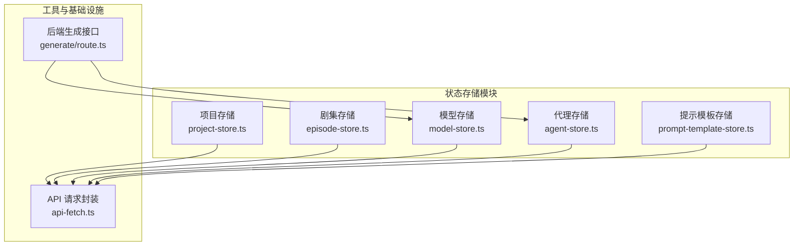
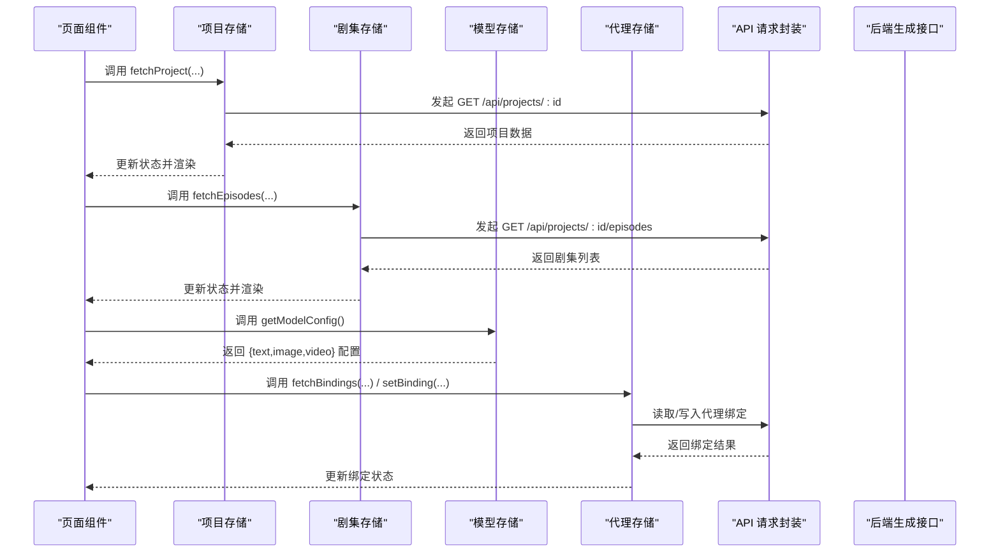
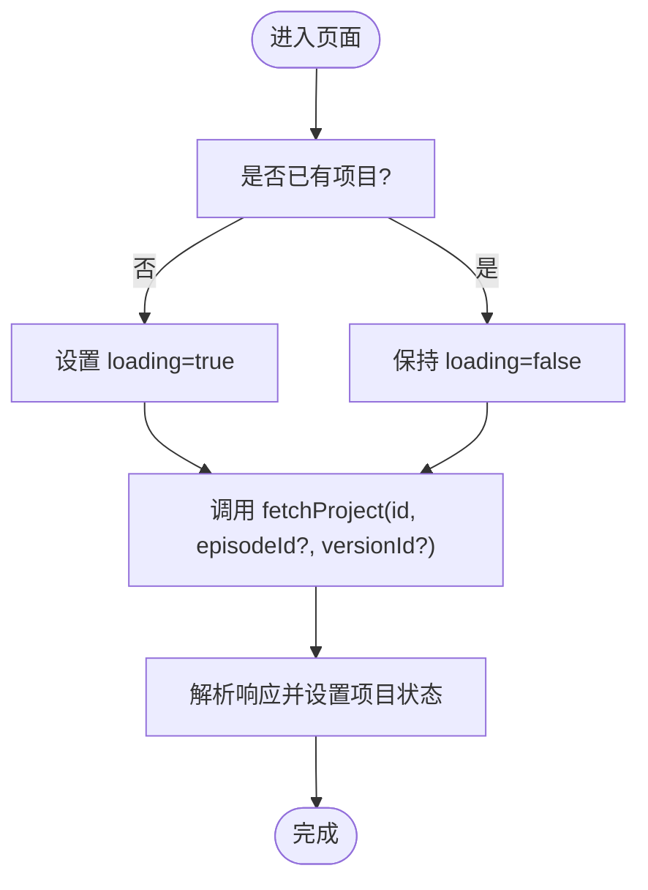
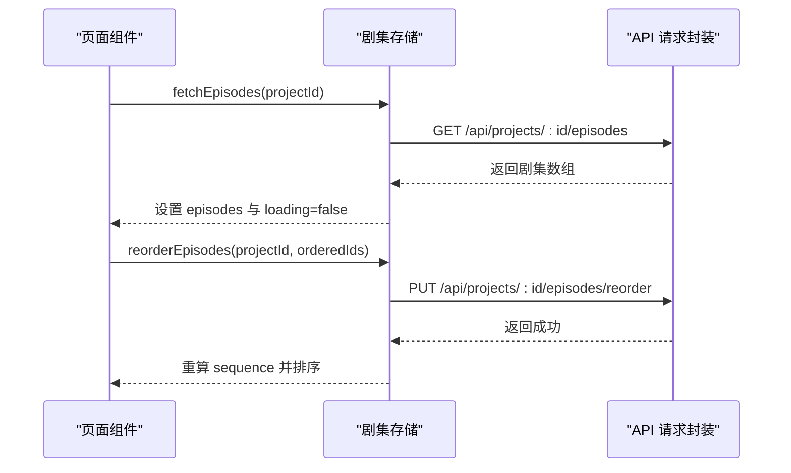
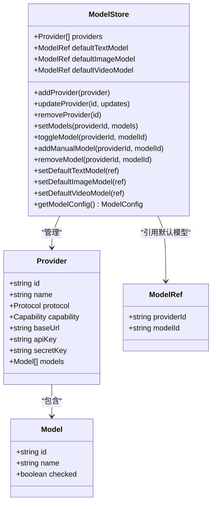
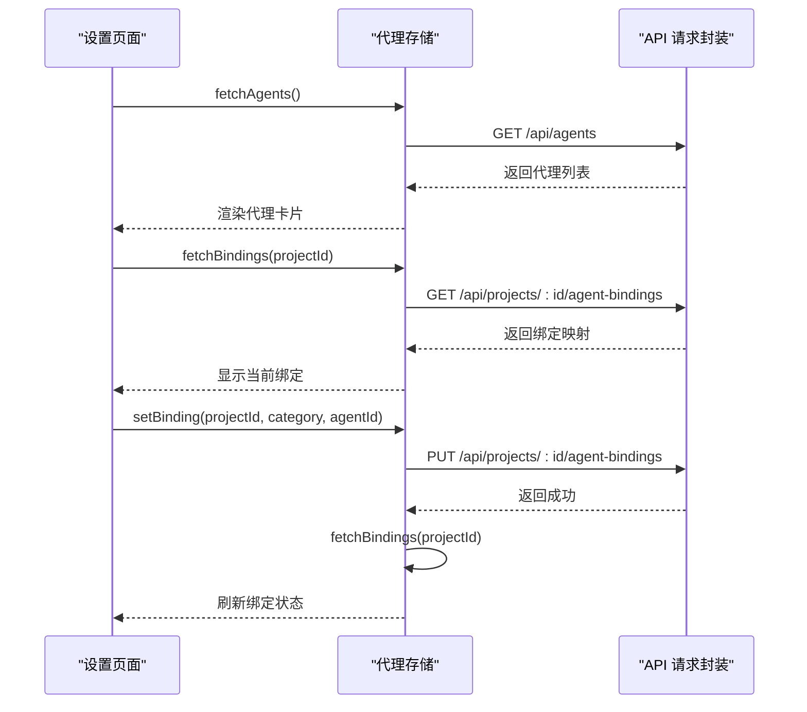
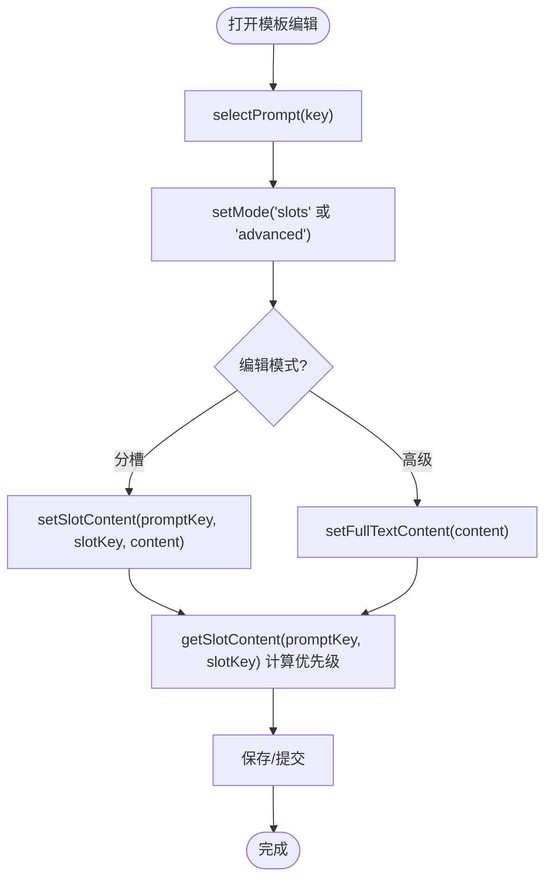
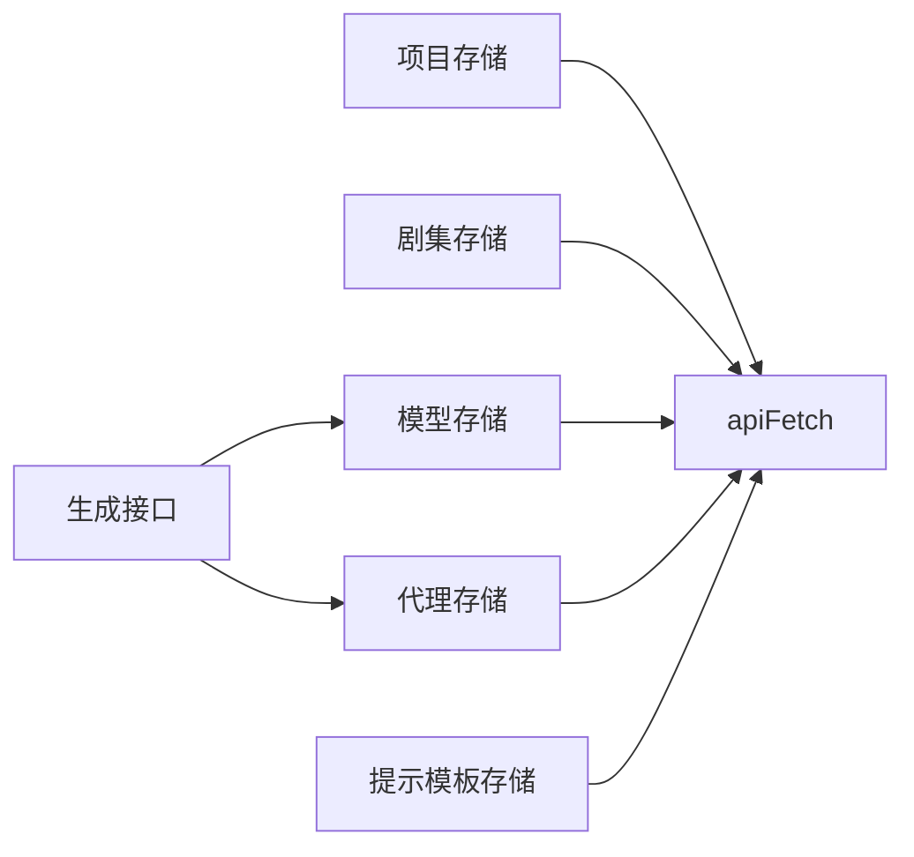

# 状态管理组件

<cite>
**本文引用的文件**
- [project-store.ts](file://src/stores/project-store.ts)
- [episode-store.ts](file://src/stores/episode-store.ts)
- [model-store.ts](file://src/stores/model-store.ts)
- [agent-store.ts](file://src/stores/agent-store.ts)
- [prompt-template-store.ts](file://src/stores/prompt-template-store.ts)
- [api-fetch.ts](file://src/lib/api-fetch.ts)
- [route.ts（生成接口）](file://src/app/api/projects/[id]/generate/route.ts)
</cite>

## 目录
1. [简介](#简介)
2. [项目结构](#项目结构)
3. [核心组件](#核心组件)
4. [架构总览](#架构总览)
5. [详细组件分析](#详细组件分析)
6. [依赖关系分析](#依赖关系分析)
7. [性能考量](#性能考量)
8. [故障排查指南](#故障排查指南)
9. [结论](#结论)
10. [附录](#附录)

## 简介
本文件系统性梳理 AIComicBuilder 的前端状态管理组件，覆盖项目存储、剧集存储、模型存储、代理存储与提示模板存储五大模块。文档从架构设计、数据结构、数据流与组件通信机制入手，结合使用示例与最佳实践，帮助开发者快速理解并正确使用 Zustand 状态管理方案；同时给出持久化与迁移策略、并发处理与错误状态管理建议。

## 项目结构
状态管理相关代码集中于 src/stores 目录，采用“按领域划分”的模块化组织方式：每个 store 文件独立封装一个业务域的状态与动作，通过 create 创建 Zustand store，并在需要时引入持久化中间件或外部 API 工具。

图表来源
- [project-store.ts:1-257](file://src/stores/project-store.ts#L1-L257)
- [episode-store.ts:1-100](file://src/stores/episode-store.ts#L1-L100)
- [model-store.ts:1-198](file://src/stores/model-store.ts#L1-L198)
- [agent-store.ts:1-56](file://src/stores/agent-store.ts#L1-L56)
- [prompt-template-store.ts:1-152](file://src/stores/prompt-template-store.ts#L1-L152)
- [api-fetch.ts](file://src/lib/api-fetch.ts)
- [route.ts（生成接口）:172-193](file://src/app/api/projects/[id]/generate/route.ts#L172-L193)

章节来源
- [project-store.ts:1-257](file://src/stores/project-store.ts#L1-L257)
- [episode-store.ts:1-100](file://src/stores/episode-store.ts#L1-L100)
- [model-store.ts:1-198](file://src/stores/model-store.ts#L1-L198)
- [agent-store.ts:1-56](file://src/stores/agent-store.ts#L1-L56)
- [prompt-template-store.ts:1-152](file://src/stores/prompt-template-store.ts#L1-L152)
- [api-fetch.ts](file://src/lib/api-fetch.ts)
- [route.ts（生成接口）:172-193](file://src/app/api/projects/[id]/generate/route.ts#L172-L193)

## 核心组件
- 项目存储（Project Store）
  - 职责：加载/更新项目级数据（含角色、分镜、版本等），支持按剧集维度切换与版本回溯。
  - 关键字段：项目对象、当前剧集 ID、加载状态、获取项目动作。
  - 数据访问辅助：提供安全读取与历史版本查询函数，屏蔽资产字段缺失场景。
- 剧集存储（Episode Store）
  - 职责：管理剧集列表、创建/删除/更新、重排顺序。
  - 关键字段：剧集数组、加载状态、获取/增删改/排序动作。
- 模型存储（Model Store）
  - 职责：维护多提供商模型配置、默认模型选择、持久化存储与迁移。
  - 关键字段：提供商列表、三类默认模型引用、解析模型配置的动作。
  - 持久化：使用 persist 中间件，带版本迁移与合并逻辑。
- 代理存储（Agent Store）
  - 职责：拉取可用代理清单、查询/设置项目绑定。
  - 关键字段：代理列表、绑定映射、加载状态、获取/设置动作。
- 提示模板存储（Prompt Template Store）
  - 职责：注册表、选中项、编辑模式、本地编辑、服务器覆盖、脏检查与分类过滤。
  - 关键字段：注册表、选中键、编辑态、覆盖态、模式、过滤器、计算派生值的动作。

章节来源
- [project-store.ts:195-257](file://src/stores/project-store.ts#L195-L257)
- [episode-store.ts:4-33](file://src/stores/episode-store.ts#L4-L33)
- [model-store.ts:36-53](file://src/stores/model-store.ts#L36-L53)
- [agent-store.ts:16-23](file://src/stores/agent-store.ts#L16-L23)
- [prompt-template-store.ts:19-61](file://src/stores/prompt-template-store.ts#L19-L61)

## 架构总览
Zustand 在本项目中的定位是轻量、可组合的前端状态中心，各 store 之间低耦合，通过统一的 apiFetch 封装进行后端交互。生成流程中，后端接口会读取模型与代理绑定配置，从而驱动生成任务。

图表来源
- [project-store.ts:219-257](file://src/stores/project-store.ts#L219-L257)
- [episode-store.ts:35-99](file://src/stores/episode-store.ts#L35-L99)
- [model-store.ts:55-164](file://src/stores/model-store.ts#L55-L164)
- [agent-store.ts:25-55](file://src/stores/agent-store.ts#L25-L55)
- [api-fetch.ts](file://src/lib/api-fetch.ts)
- [route.ts（生成接口）:172-193](file://src/app/api/projects/[id]/generate/route.ts#L172-L193)

## 详细组件分析

### 项目存储（Project Store）
- 设计要点
  - 使用 create 定义 store，包含项目对象、加载状态与当前剧集 ID。
  - 提供 fetchProject 异步加载，支持按剧集与版本参数。
  - 提供 updateIdea/updateScript/setProject 等局部更新动作。
  - 提供一组资产访问辅助函数，确保在乐观更新与部分加载场景下安全读取。
- 数据结构
  - 角色、对白、分镜、资产、版本等嵌套结构，资产类型通过枚举区分。
- 并发与错误
  - 首次加载设置 loading；版本切换不改变 loading 状态，避免子树卸载。
  - 未显式抛错，建议在调用方捕获异常并降级显示。
- 使用示例路径
  - 页面中订阅项目状态与加载状态，触发 fetchProject。
  - 在操作完成后回调 fetchProject 刷新视图。

图表来源
- [project-store.ts:224-239](file://src/stores/project-store.ts#L224-L239)

章节来源
- [project-store.ts:1-257](file://src/stores/project-store.ts#L1-L257)

### 剧集存储（Episode Store）
- 设计要点
  - 维护剧集列表与加载状态。
  - 支持创建、删除、更新、重排等动作，重排通过服务端排序后本地重新计算序列。
- 数据结构
  - 剧集对象包含标题、序号、状态、生成模式、预览图等。
- 并发与错误
  - 所有异步动作均设置 loading；错误需在调用方处理。
- 使用示例路径
  - 页面初始化调用 fetchEpisodes。
  - 拖拽排序后调用 reorderEpisodes，随后根据返回的新顺序更新本地状态。

图表来源
- [episode-store.ts:35-99](file://src/stores/episode-store.ts#L35-L99)

章节来源
- [episode-store.ts:1-100](file://src/stores/episode-store.ts#L1-L100)

### 模型存储（Model Store）
- 设计要点
  - 提供提供商 CRUD、模型启用/禁用、手动添加模型、删除模型、默认模型设置。
  - getModelConfig 将默认引用解析为可直接用于生成的配置对象。
  - 使用 persist 中间件，支持版本迁移与合并，兼容旧版存储格式。
- 数据结构
  - Provider 包含协议、能力、基础地址与密钥；Model 为可选列表；ModelRef 作为默认模型引用。
- 并发与错误
  - 动作均为纯前端更新；持久化失败不影响运行，但可能丢失配置。
- 使用示例路径
  - 设置默认文本/图像/视频模型，供生成流程读取。
  - 在设置页添加/删除提供商与模型。

图表来源
- [model-store.ts:8-53](file://src/stores/model-store.ts#L8-L53)
- [model-store.ts:55-164](file://src/stores/model-store.ts#L55-L164)

章节来源
- [model-store.ts:1-198](file://src/stores/model-store.ts#L1-L198)

### 代理存储（Agent Store）
- 设计要点
  - 获取代理清单与项目绑定，支持设置绑定。
  - 绑定变更后自动刷新本地绑定状态。
- 数据结构
  - AgentInfo 表示可用代理；AgentBinding 表示项目到代理的映射。
- 并发与错误
  - 读取/设置绑定时设置 loading；网络异常需在调用方处理。
- 使用示例路径
  - 在项目设置页展示代理列表与当前绑定，允许用户切换。

图表来源
- [agent-store.ts:25-55](file://src/stores/agent-store.ts#L25-L55)

章节来源
- [agent-store.ts:1-56](file://src/stores/agent-store.ts#L1-L56)

### 提示模板存储（Prompt Template Store）
- 设计要点
  - 注册表（Registry）来自服务端；当前选中模板与槽位；编辑模式（分槽/高级全文）。
  - 支持本地编辑（editedSlots）、服务器覆盖（serverOverrides）与优先级计算。
  - 脏检查与分类过滤，便于保存与浏览。
- 数据结构
  - PromptMeta 描述模板元信息与槽位；SlotMeta 描述槽位键、名称、默认内容与可编辑性。
- 并发与错误
  - 本地编辑与服务器覆盖相互独立；优先级为本地 > 服务器覆盖 > 默认。
- 使用示例路径
  - 选择模板后进入编辑模式，支持逐槽修改或整体替换。

图表来源
- [prompt-template-store.ts:63-152](file://src/stores/prompt-template-store.ts#L63-L152)

章节来源
- [prompt-template-store.ts:1-152](file://src/stores/prompt-template-store.ts#L1-L152)

## 依赖关系分析
- 组件内聚与耦合
  - 各 store 自成体系，内部方法仅依赖自身状态与 apiFetch。
  - 项目/剧集存储依赖 apiFetch 进行后端交互；模型/代理/模板存储同样依赖 apiFetch。
- 外部依赖
  - apiFetch：统一的请求封装，负责鉴权、错误处理与响应解析。
  - 后端生成接口：读取模型与代理绑定，驱动生成任务。
- 循环依赖
  - 无直接循环依赖；store 之间通过 UI 层协调调用。

图表来源
- [project-store.ts:1-3](file://src/stores/project-store.ts#L1-L3)
- [episode-store.ts:1-3](file://src/stores/episode-store.ts#L1-L3)
- [model-store.ts:1-4](file://src/stores/model-store.ts#L1-L4)
- [agent-store.ts:1-3](file://src/stores/agent-store.ts#L1-L3)
- [prompt-template-store.ts:1](file://src/stores/prompt-template-store.ts#L1)
- [route.ts（生成接口）:172-193](file://src/app/api/projects/[id]/generate/route.ts#L172-L193)

章节来源
- [project-store.ts:1-3](file://src/stores/project-store.ts#L1-L3)
- [episode-store.ts:1-3](file://src/stores/episode-store.ts#L1-L3)
- [model-store.ts:1-4](file://src/stores/model-store.ts#L1-L4)
- [agent-store.ts:1-3](file://src/stores/agent-store.ts#L1-L3)
- [prompt-template-store.ts:1](file://src/stores/prompt-template-store.ts#L1)
- [route.ts（生成接口）:172-193](file://src/app/api/projects/[id]/generate/route.ts#L172-L193)

## 性能考量
- 状态粒度
  - 将大型对象拆分为多个 store，降低无关渲染。
- 选择器优化
  - 使用 Zustand 的选择器写法（如 useModelStore(s => s.getModelConfig)）减少订阅范围。
- 加载状态
  - 首次加载设置 loading，避免重复请求；版本切换不触发全量重绘。
- 持久化
  - 模型存储使用持久化中间件，注意只保存必要字段，避免存储过大。
- 并发控制
  - 对同一资源的多次请求应去抖/节流，或在 store 内部做幂等处理。

## 故障排查指南
- 网络错误
  - 若 fetchAgents/fetchEpisodes/fetchProject 等动作失败，检查 apiFetch 的错误分支与网络状态。
- 状态不同步
  - 确认在 setBinding 后调用了 fetchBindings 刷新；在更新项目后调用 fetchProject。
- 模型配置为空
  - 检查 getModelConfig 是否返回空；确认已设置默认模型并持久化成功。
- 服务器覆盖未生效
  - 确认 setServerOverrides 正确传入；getSlotContent 的优先级逻辑为本地 > 服务器覆盖 > 默认。
- 版本迁移问题
  - 模型存储具备迁移与合并逻辑；若出现字段缺失，检查持久化键名与版本号。

章节来源
- [agent-store.ts:37-54](file://src/stores/agent-store.ts#L37-L54)
- [episode-store.ts:39-98](file://src/stores/episode-store.ts#L39-L98)
- [project-store.ts:224-239](file://src/stores/project-store.ts#L224-L239)
- [model-store.ts:165-196](file://src/stores/model-store.ts#L165-L196)
- [prompt-template-store.ts:113-134](file://src/stores/prompt-template-store.ts#L113-L134)

## 结论
本项目采用轻量、可组合的 Zustand 架构管理前端状态，围绕项目、剧集、模型、代理与提示模板五大域构建清晰的 store。通过统一的 apiFetch 与后端接口协作，实现了高效的数据流与良好的扩展性。建议在后续迭代中进一步完善错误边界与加载态提示，并持续优化状态选择器与持久化策略。

## 附录
- 最佳实践
  - 使用选择器订阅最小状态片段，避免不必要的重渲染。
  - 对外暴露动作而非直接 set，保证状态更新路径一致。
  - 对关键配置（如模型）使用持久化中间件，并编写迁移逻辑。
  - 在 UI 层对 loading 与错误进行统一兜底，提升用户体验。
- 状态订阅与更新示例（路径）
  - 订阅项目状态与加载状态：[project-store.ts:219-257](file://src/stores/project-store.ts#L219-L257)
  - 订阅剧集列表与加载状态：[episode-store.ts:35-99](file://src/stores/episode-store.ts#L35-L99)
  - 订阅模型配置：[model-store.ts:55-164](file://src/stores/model-store.ts#L55-L164)
  - 订阅代理绑定：[agent-store.ts:25-55](file://src/stores/agent-store.ts#L25-L55)
  - 订阅模板编辑态：[prompt-template-store.ts:63-152](file://src/stores/prompt-template-store.ts#L63-L152)
- 状态持久化与恢复策略
  - 模型存储持久化键名与版本迁移：[model-store.ts:165-196](file://src/stores/model-store.ts#L165-L196)
- 并发处理与错误状态管理
  - 统一的 loading 管理与错误处理入口：[agent-store.ts:37-54](file://src/stores/agent-store.ts#L37-L54)，[episode-store.ts:39-98](file://src/stores/episode-store.ts#L39-L98)，[project-store.ts:224-239](file://src/stores/project-store.ts#L224-L239)
- 生成流程与状态联动
  - 后端生成接口读取模型与代理绑定：[route.ts（生成接口）:172-193](file://src/app/api/projects/[id]/generate/route.ts#L172-L193)