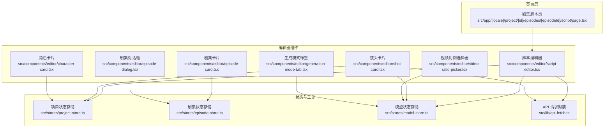
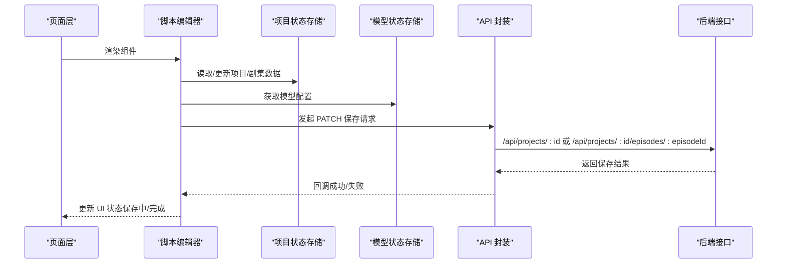
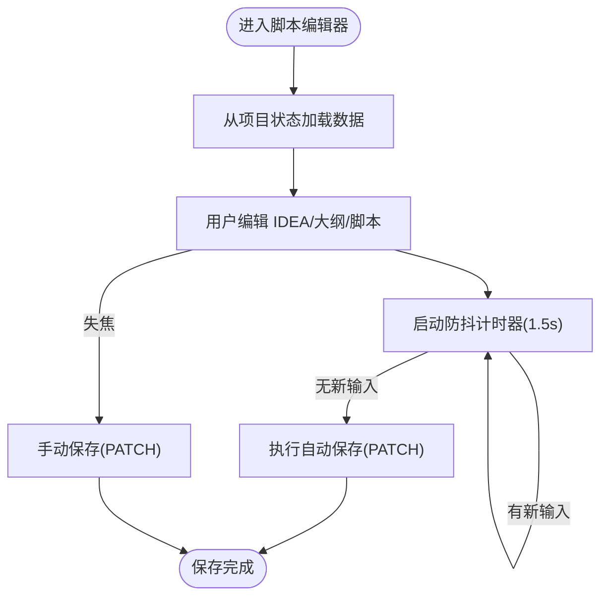
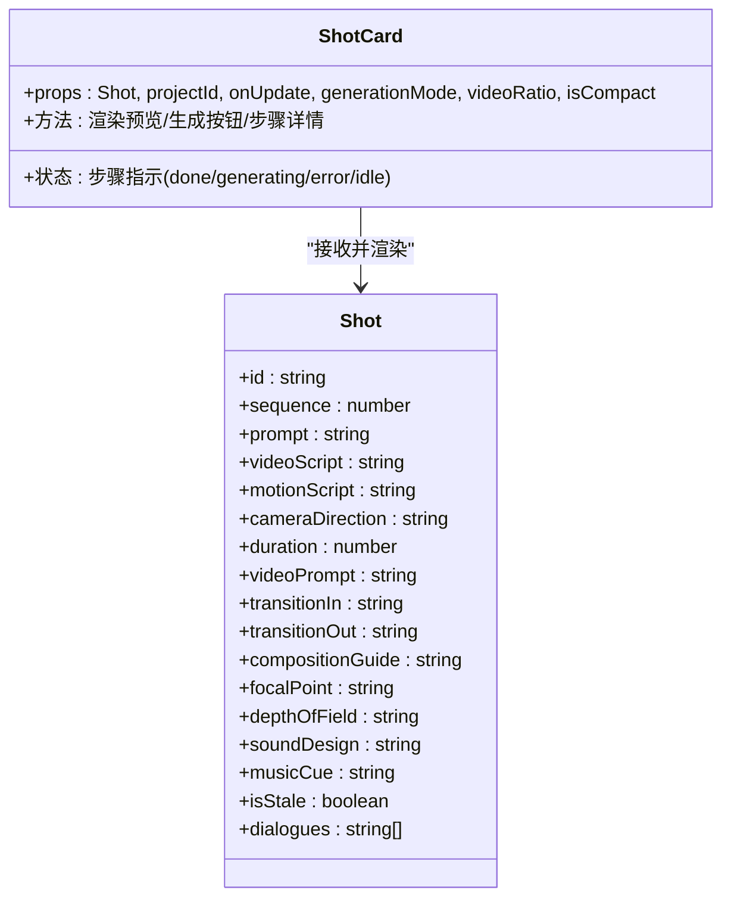
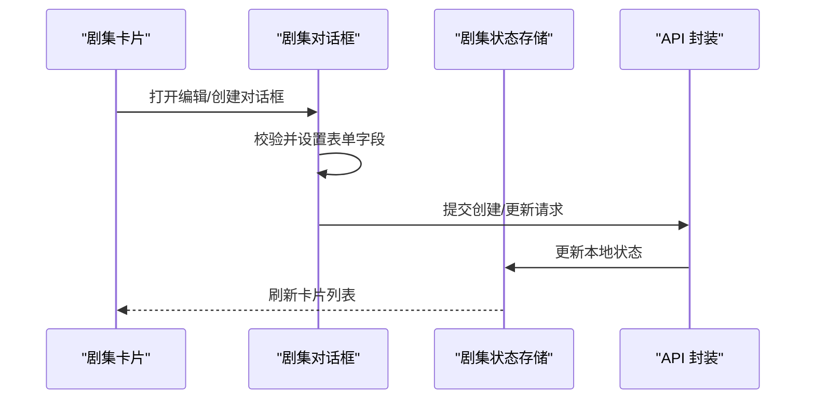
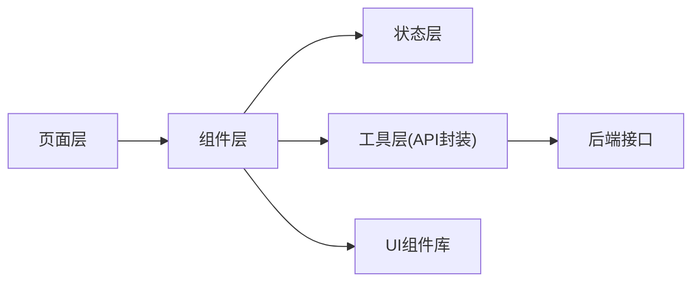

# 编辑器组件

<cite>
**本文引用的文件**
- [script-editor.tsx](file://src/components/editor/script-editor.tsx)
- [episode-card.tsx](file://src/components/editor/episode-card.tsx)
- [episode-dialog.tsx](file://src/components/editor/episode-dialog.tsx)
- [shot-card.tsx](file://src/components/editor/shot-card.tsx)
- [video-ratio-picker.tsx](file://src/components/editor/video-ratio-picker.tsx)
- [generation-mode-tab.tsx](file://src/components/editor/generation-mode-tab.tsx)
- [character-card.tsx](file://src/components/editor/character-card.tsx)
- [page.tsx](file://src/app/[locale]/project/[id]/episodes/[episodeId]/script/page.tsx)
- [project-store.ts](file://src/stores/project-store.ts)
- [episode-store.ts](file://src/stores/episode-store.ts)
- [model-store.ts](file://src/stores/model-store.ts)
- [api-fetch.ts](file://src/lib/api-fetch.ts)
- [task_plan.md](file://task_plan.md)
- [card.tsx](file://src/components/ui/card.tsx)
</cite>

## 目录
1. [简介](#简介)
2. [项目结构](#项目结构)
3. [核心组件](#核心组件)
4. [架构总览](#架构总览)
5. [详细组件分析](#详细组件分析)
6. [依赖关系分析](#依赖关系分析)
7. [性能考量](#性能考量)
8. [故障排查指南](#故障排查指南)
9. [结论](#结论)
10. [附录](#附录)

## 简介
本章节面向“AIComicBuilder”的编辑器组件，系统性梳理脚本编辑器、镜头卡片、剧集卡片、角色卡片、生成模式标签、视频比例选择器等核心编辑功能组件的实现细节与使用模式；记录组件间的数据流、状态管理与事件传递机制；说明与后端 API 的交互方式与数据同步策略；给出可定制化选项与扩展点；并总结用户体验优化与性能考虑。

## 项目结构
编辑器相关组件主要位于 src/components/editor 下，配合 src/stores 中的状态存储、src/lib 中的 API 工具以及页面路由层进行编排。页面层负责将组件挂载到具体路由路径，例如剧集脚本页。

图表来源
- [page.tsx:1-5](file://src/app/[locale]/project/[id]/episodes/[episodeId]/script/page.tsx#L1-L5)
- [script-editor.tsx:1-363](file://src/components/editor/script-editor.tsx#L1-L363)
- [shot-card.tsx:95-214](file://src/components/editor/shot-card.tsx#L95-L214)
- [episode-card.tsx:1-73](file://src/components/editor/episode-card.tsx#L1-L73)
- [episode-dialog.tsx:1-44](file://src/components/editor/episode-dialog.tsx#L1-L44)
- [video-ratio-picker.tsx](file://src/components/editor/video-ratio-picker.tsx)
- [generation-mode-tab.tsx](file://src/components/editor/generation-mode-tab.tsx)
- [character-card.tsx](file://src/components/editor/character-card.tsx)
- [project-store.ts](file://src/stores/project-store.ts)
- [episode-store.ts](file://src/stores/episode-store.ts)
- [model-store.ts](file://src/stores/model-store.ts)
- [api-fetch.ts](file://src/lib/api-fetch.ts)

章节来源
- [page.tsx:1-5](file://src/app/[locale]/project/[id]/episodes/[episodeId]/script/page.tsx#L1-L5)
- [script-editor.tsx:1-363](file://src/components/editor/script-editor.tsx#L1-L363)
- [shot-card.tsx:95-214](file://src/components/editor/shot-card.tsx#L95-L214)
- [episode-card.tsx:1-73](file://src/components/editor/episode-card.tsx#L1-L73)
- [episode-dialog.tsx:1-44](file://src/components/editor/episode-dialog.tsx#L1-L44)
- [video-ratio-picker.tsx](file://src/components/editor/video-ratio-picker.tsx)
- [generation-mode-tab.tsx](file://src/components/editor/generation-mode-tab.tsx)
- [character-card.tsx](file://src/components/editor/character-card.tsx)
- [project-store.ts](file://src/stores/project-store.ts)
- [episode-store.ts](file://src/stores/episode-store.ts)
- [model-store.ts](file://src/stores/model-store.ts)
- [api-fetch.ts](file://src/lib/api-fetch.ts)

## 核心组件
- 脚本编辑器：支持 IDEA/大纲/脚本三段式内容编辑与自动生成，内置防抖自动保存、滚动行为与生成状态管理。
- 镜头卡片：展示单个镜头的多步骤生成状态与预览，支持关键帧/参考视频两种生成模式切换，支持批量生成控制与视频比例参数透传。
- 剧集卡片：展示剧集概览、处理状态、关键词与预览轮播，提供编辑/删除/播放等操作入口。
- 角色卡片：承载角色信息与视觉提示，支持上传与版本化管理（在角色模块中使用）。
- 生成模式标签：用于标识当前镜头处于“关键帧”或“参考视频”生成模式。
- 视频比例选择器：统一选择视频输出比例，供页面级状态管理并通过 props 下发至卡片生成按钮。

章节来源
- [script-editor.tsx:17-363](file://src/components/editor/script-editor.tsx#L17-L363)
- [shot-card.tsx:173-214](file://src/components/editor/shot-card.tsx#L173-L214)
- [episode-card.tsx:23-73](file://src/components/editor/episode-card.tsx#L23-L73)
- [character-card.tsx](file://src/components/editor/character-card.tsx)
- [generation-mode-tab.tsx](file://src/components/editor/generation-mode-tab.tsx)
- [video-ratio-picker.tsx](file://src/components/editor/video-ratio-picker.tsx)

## 架构总览
编辑器组件围绕“页面层 → 组件层 → 状态层 → 工具层 → 后端 API”的链路组织。页面层负责路由与容器渲染，组件层负责具体业务交互，状态层集中管理项目/剧集/模型等数据，工具层封装 API 请求，后端通过 /api/* 接口提供 CRUD 与生成任务。

图表来源
- [page.tsx:1-5](file://src/app/[locale]/project/[id]/episodes/[episodeId]/script/page.tsx#L1-L5)
- [script-editor.tsx:46-67](file://src/components/editor/script-editor.tsx#L46-L67)
- [project-store.ts](file://src/stores/project-store.ts)
- [model-store.ts](file://src/stores/model-store.ts)
- [api-fetch.ts](file://src/lib/api-fetch.ts)

## 详细组件分析

### 脚本编辑器（ScriptEditor）
- 功能要点
  - IDEA/大纲/脚本三段内容的输入与持久化，支持自动保存与手动保存。
  - 自动生成脚本与大纲，带生成状态指示与滚动行为。
  - 内置模型选择器与提示模板编辑入口。
- 数据流与状态
  - 从项目状态存储读取/写入 idea、script、outline。
  - 使用防抖定时器实现“最后一次按键1.5秒后保存”，并支持失焦触发保存。
  - 生成过程中禁用输入并显示加载态，完成后滚动到底部。
- 与后端交互
  - PATCH 请求保存项目或剧集级别数据，URL 根据是否存在当前剧集 ID 自动选择。
  - 错误捕获并记录日志，不阻断用户操作。
- 可定制化与扩展
  - 支持通过提示模板键覆盖默认生成逻辑。
  - 可接入不同 Agent 进行生成。
- 用户体验
  - 保存状态与生成状态可视化反馈。
  - 文本区域高度适配，支持自动滚动与只读态透明度。

图表来源
- [script-editor.tsx:43-67](file://src/components/editor/script-editor.tsx#L43-L67)

章节来源
- [script-editor.tsx:17-363](file://src/components/editor/script-editor.tsx#L17-L363)
- [page.tsx:1-5](file://src/app/[locale]/project/[id]/episodes/[episodeId]/script/page.tsx#L1-L5)

### 镜头卡片（ShotCard）
- 功能要点
  - 展示镜头序列号、提示词、分镜脚本、运动脚本、摄影指导、转场、构图、焦点、景深、音效、音乐等字段。
  - 多步骤状态指示（完成/生成中/错误/待定），支持展开/折叠查看。
  - 关键帧与参考视频两种生成模式，依据模式动态选择首帧/末帧或参考视频 URL。
  - 支持批量生成开关透传（如批量生成帧/视频提示词/视频）。
- 数据流与状态
  - 通过 props 接收镜头数据与回调函数，内部根据数据计算状态与预览资源。
  - 生成模式与视频比例通过 props 传入，影响最终生成按钮的行为与参数。
- 与后端交互
  - 生成流程通过后端任务队列触发，卡片仅展示状态与预览链接。
- 可定制化与扩展
  - 支持扩展更多摄影/音效/音乐字段，或增加新的生成步骤。
  - 通过 generationMode 与 videoRatio 参数扩展不同工作流。

图表来源
- [shot-card.tsx:95-214](file://src/components/editor/shot-card.tsx#L95-L214)

章节来源
- [shot-card.tsx:95-214](file://src/components/editor/shot-card.tsx#L95-L214)
- [task_plan.md:67-72](file://task_plan.md#L67-L72)

### 剧集卡片（EpisodeCard）与剧集对话框（EpisodeDialog）
- 功能要点
  - 剧集卡片：展示剧集标题、关键词、状态（草稿/处理中/完成）、预览轮播、播放入口与操作菜单。
  - 剧集对话框：提供创建/编辑剧集的表单，支持标题、描述、关键词输入与提交。
- 数据流与状态
  - 剧集卡片内部维护菜单开合与预览轮播索引状态。
  - 对话框内部维护表单字段与提交状态，并在打开时重置默认值。
- 与后端交互
  - 通过状态存储与 API 工具进行增删改查与播放预览。
- 可定制化与扩展
  - 可扩展更多元数据字段（如目标时长、BGM 等）。
  - 可替换预览图片轮播策略。

图表来源
- [episode-card.tsx:23-73](file://src/components/editor/episode-card.tsx#L23-L73)
- [episode-dialog.tsx:24-44](file://src/components/editor/episode-dialog.tsx#L24-L44)
- [episode-store.ts](file://src/stores/episode-store.ts)
- [api-fetch.ts](file://src/lib/api-fetch.ts)

章节来源
- [episode-card.tsx:1-73](file://src/components/editor/episode-card.tsx#L1-L73)
- [episode-dialog.tsx:1-44](file://src/components/editor/episode-dialog.tsx#L1-L44)

### 角色卡片（CharacterCard）
- 功能要点
  - 展示角色基础信息与视觉提示，支持上传与版本化管理。
- 数据流与状态
  - 通过项目状态存储与角色相关 API 进行读写。
- 与后端交互
  - 上传与历史记录通过后端接口完成。
- 可定制化与扩展
  - 可扩展角色属性（身高、体型、服装集合等）以增强生成一致性。

章节来源
- [character-card.tsx](file://src/components/editor/character-card.tsx)

### 生成模式标签（GenerationModeTab）与视频比例选择器（VideoRatioPicker）
- 功能要点
  - 生成模式标签：标识当前镜头处于“关键帧”或“参考视频”模式。
  - 视频比例选择器：统一选择视频输出比例，页面级状态管理并通过 props 下发。
- 数据流与状态
  - 模式与比例通过页面状态管理，再以 props 传入卡片生成按钮，确保全局一致。
- 可定制化与扩展
  - 可新增更多生成模式（如“动作优先”、“风格迁移”等）。
  - 可扩展更多视频比例选项。

章节来源
- [generation-mode-tab.tsx](file://src/components/editor/generation-mode-tab.tsx)
- [video-ratio-picker.tsx](file://src/components/editor/video-ratio-picker.tsx)
- [task_plan.md:67-72](file://task_plan.md#L67-L72)

## 依赖关系分析
- 组件耦合
  - 页面层与组件层松耦合，通过 props 传参与回调解耦。
  - 组件层与状态层通过 hooks 访问，避免直接依赖具体实现。
  - 组件层与工具层通过 API 封装间接通信，便于替换与测试。
- 外部依赖
  - 后端接口：/api/projects/:id、/api/projects/:id/episodes/:episodeId 等。
  - 国际化与 UI 组件库：next-intl、lucide-react、自定义 UI 组件库。
- 潜在循环依赖
  - 当前结构以“页面 → 组件 → 状态/工具 → API → 后端”单向依赖为主，未见循环。

图表来源
- [script-editor.tsx:1-363](file://src/components/editor/script-editor.tsx#L1-L363)
- [episode-card.tsx:1-73](file://src/components/editor/episode-card.tsx#L1-L73)
- [api-fetch.ts](file://src/lib/api-fetch.ts)
- [project-store.ts](file://src/stores/project-store.ts)
- [episode-store.ts](file://src/stores/episode-store.ts)
- [model-store.ts](file://src/stores/model-store.ts)

章节来源
- [script-editor.tsx:1-363](file://src/components/editor/script-editor.tsx#L1-L363)
- [episode-card.tsx:1-73](file://src/components/editor/episode-card.tsx#L1-L73)
- [api-fetch.ts](file://src/lib/api-fetch.ts)
- [project-store.ts](file://src/stores/project-store.ts)
- [episode-store.ts](file://src/stores/episode-store.ts)
- [model-store.ts](file://src/stores/model-store.ts)

## 性能考量
- 自动保存防抖：减少频繁网络请求，提升响应流畅度。
- 按需渲染：卡片组件按需展开步骤详情，避免一次性渲染大量 DOM。
- 预览轮播：仅在存在预览且无最终视频时启用，降低不必要的轮询。
- 状态最小化：页面级统一管理模式与比例，避免重复计算与状态分散。
- 图片懒加载：预览图片采用懒加载策略，减少首屏压力。

## 故障排查指南
- 自动保存失败
  - 现象：保存状态持续显示“保存中”。
  - 排查：检查网络请求是否被拦截、后端返回状态码与错误信息。
  - 参考路径：[script-editor.tsx:46-67](file://src/components/editor/script-editor.tsx#L46-L67)
- 生成按钮不可用
  - 现象：生成按钮禁用或加载态异常。
  - 排查：确认 IDEA 是否为空、模型是否可用、生成状态是否冲突。
  - 参考路径：[script-editor.tsx:328-340](file://src/components/editor/script-editor.tsx#L328-L340)
- 预览不刷新
  - 现象：更新后预览仍显示旧图。
  - 排查：确认项目/剧集状态已刷新、URL 是否失效或缓存问题。
  - 参考路径：[shot-card.tsx:205-212](file://src/components/editor/shot-card.tsx#L205-L212)
- 剧集轮播卡顿
  - 现象：轮播切换卡顿或停止。
  - 排查：检查预览图片数量与尺寸、是否已生成最终视频。
  - 参考路径：[episode-card.tsx:52-59](file://src/components/editor/episode-card.tsx#L52-L59)

章节来源
- [script-editor.tsx:46-67](file://src/components/editor/script-editor.tsx#L46-L67)
- [episode-card.tsx:52-59](file://src/components/editor/episode-card.tsx#L52-L59)
- [shot-card.tsx:205-212](file://src/components/editor/shot-card.tsx#L205-L212)

## 结论
编辑器组件通过清晰的分层设计与状态管理，实现了从脚本到镜头再到剧集的完整创作闭环。页面级统一的模式与比例管理保证了全局一致性；组件化的卡片设计提升了可扩展性与复用性；与后端 API 的解耦使得生成与持久化流程稳定可控。建议后续在角色与场景维度进一步完善元数据体系，并引入更细粒度的任务状态回退与重试机制。

## 附录
- 集成模式
  - 页面层：在路由中引入对应编辑器组件作为根节点。
  - 状态层：通过项目/剧集/模型状态存储集中管理数据。
  - 工具层：统一使用 API 封装进行请求与错误处理。
- 最佳实践
  - 保持 props 向下传递，避免跨层级访问状态。
  - 对生成类操作添加明确的加载态与错误态反馈。
  - 对大文本/长列表采用虚拟化或分页策略。