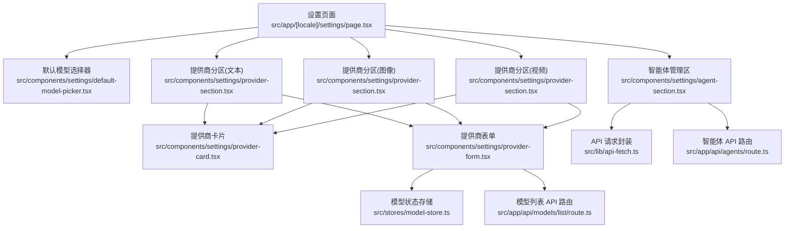
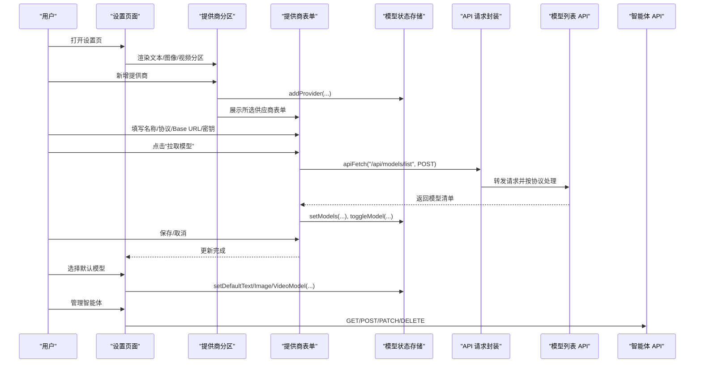
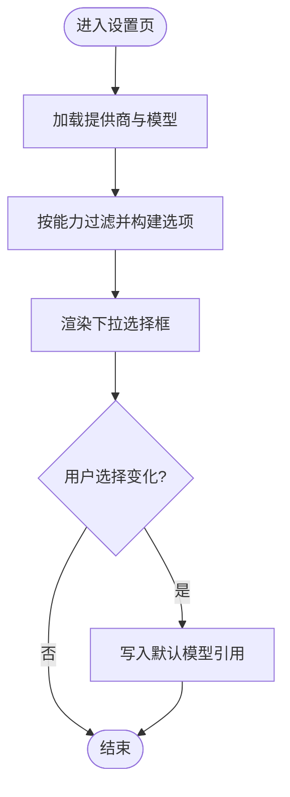
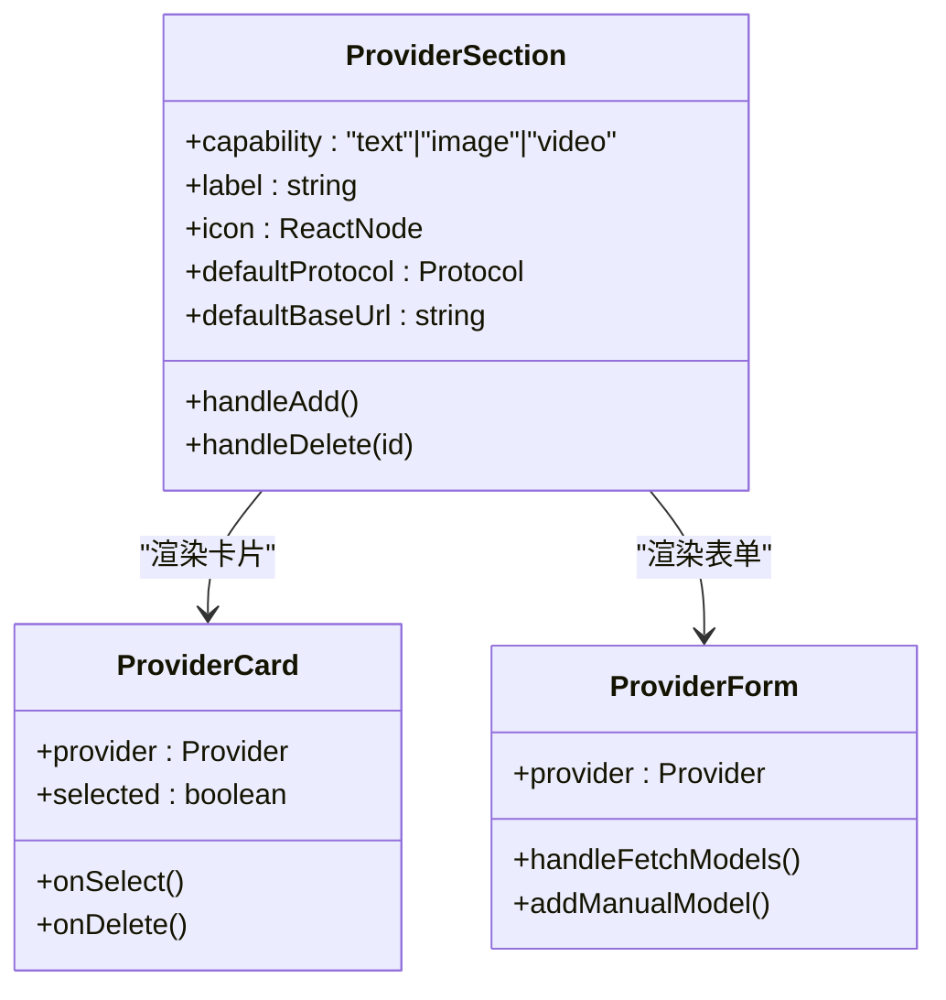
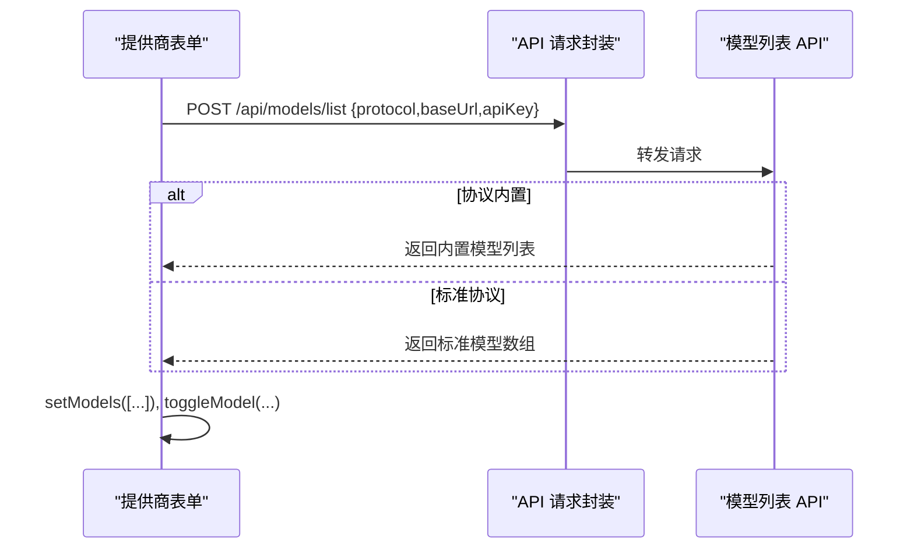
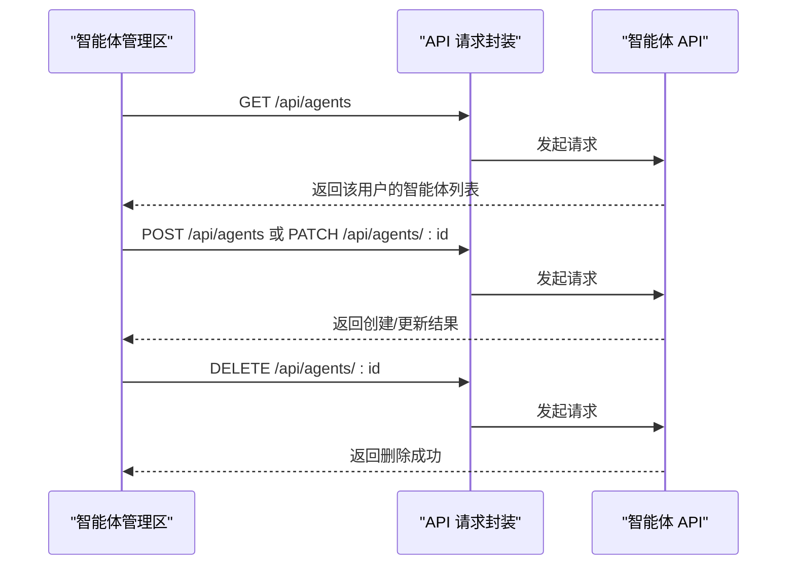
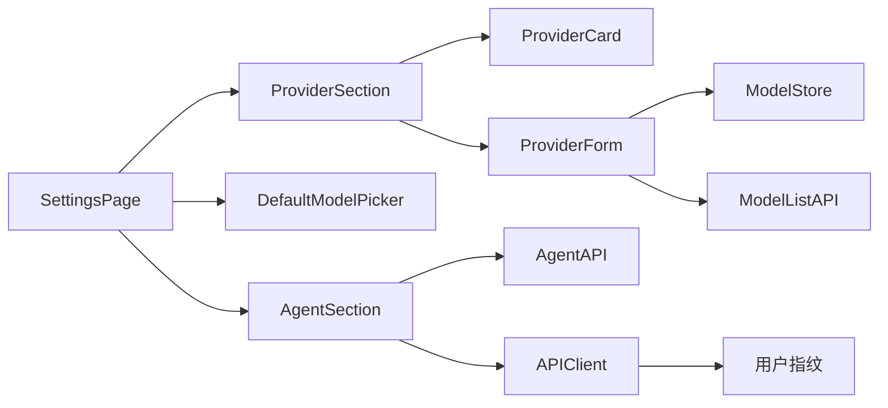

# 设置组件

<cite>
**本文引用的文件**
- [设置页面](file://src/app/[locale]/settings/page.tsx)
- [默认模型选择器](file://src/components/settings/default-model-picker.tsx)
- [提供商卡片](file://src/components/settings/provider-card.tsx)
- [提供商表单](file://src/components/settings/provider-form.tsx)
- [提供商分区](file://src/components/settings/provider-section.tsx)
- [智能体管理区](file://src/components/settings/agent-section.tsx)
- [模型状态存储](file://src/stores/model-store.ts)
- [API 请求封装](file://src/lib/api-fetch.ts)
- [智能体 API 路由](file://src/app/api/agents/route.ts)
- [模型列表 API 路由](file://src/app/api/models/list/route.ts)
- [英文消息资源](file://messages/en.json)
</cite>

## 目录
1. [简介](#简介)
2. [项目结构](#项目结构)
3. [核心组件](#核心组件)
4. [架构总览](#架构总览)
5. [组件详解](#组件详解)
6. [依赖关系分析](#依赖关系分析)
7. [性能与可用性考量](#性能与可用性考量)
8. [故障排查指南](#故障排查指南)
9. [结论](#结论)
10. [附录](#附录)

## 简介
本文件系统性梳理 AIComicBuilder 的“设置”配置体系，覆盖以下关键能力：
- 代理设置：智能体（Agent）的平台、分类、凭证与生命周期管理
- AI 提供商设置：多协议（OpenAI、Gemini、Seedance/UCloud、Kling、Wan、百炼等）的接入与模型清单获取
- 提供商卡片与表单：可视化选择、配置与模型勾选
- 默认模型选择器：按文本/图像/视频三类分别设定默认模型
- 配置持久化：本地状态持久化与迁移策略
- 安全与权限：用户隔离、敏感字段可见性与错误处理

## 项目结构
设置页面聚合多个配置区域：
- 默认模型选择
- 提示词模板入口
- 智能体管理
- 文本模型提供商
- 图像模型提供商
- 视频模型提供商

图表来源
- [设置页面:12-97](file://src/app/[locale]/settings/page.tsx#L12-L97)
- [默认模型选择器:71-133](file://src/components/settings/default-model-picker.tsx#L71-L133)
- [提供商卡片:14-69](file://src/components/settings/provider-card.tsx#L14-L69)
- [提供商表单:55-369](file://src/components/settings/provider-form.tsx#L55-L369)
- [提供商分区:19-102](file://src/components/settings/provider-section.tsx#L19-L102)
- [智能体管理区:48-376](file://src/components/settings/agent-section.tsx#L48-L376)
- [模型状态存储:55-197](file://src/stores/model-store.ts#L55-L197)
- [API 请求封装:10-24](file://src/lib/api-fetch.ts#L10-L24)
- [智能体 API 路由:8-54](file://src/app/api/agents/route.ts#L8-L54)
- [模型列表 API 路由:65-138](file://src/app/api/models/list/route.ts#L65-L138)

章节来源
- [设置页面:12-97](file://src/app/[locale]/settings/page.tsx#L12-L97)

## 核心组件
- 默认模型选择器：按能力类型展示已启用模型，支持清空与变更
- 提供商分区：按能力划分供应商集合，支持新增、选择与删除
- 提供商卡片：展示供应商基础信息与已勾选模型数量
- 提供商表单：配置名称、协议、Base URL、密钥、拉取模型、手动添加模型、搜索与勾选
- 智能体管理区：平台、分类、凭证与描述的增删改查，支持密码显隐

章节来源
- [默认模型选择器:71-133](file://src/components/settings/default-model-picker.tsx#L71-L133)
- [提供商分区:19-102](file://src/components/settings/provider-section.tsx#L19-L102)
- [提供商卡片:14-69](file://src/components/settings/provider-card.tsx#L14-L69)
- [提供商表单:55-369](file://src/components/settings/provider-form.tsx#L55-L369)
- [智能体管理区:48-376](file://src/components/settings/agent-section.tsx#L48-L376)

## 架构总览
设置模块采用“前端状态 + 后端 API”的双层设计：
- 前端状态：Zustand + 持久化，管理提供商列表、默认模型引用与模型清单
- 后端 API：统一通过封装的请求函数携带用户指纹头；智能体数据持久化到数据库；模型列表通过协议适配器拉取

图表来源
- [设置页面:68-92](file://src/app/[locale]/settings/page.tsx#L68-L92)
- [提供商分区:33-50](file://src/components/settings/provider-section.tsx#L33-L50)
- [提供商表单:68-97](file://src/components/settings/provider-form.tsx#L68-L97)
- [模型状态存储:63-142](file://src/stores/model-store.ts#L63-L142)
- [API 请求封装:10-24](file://src/lib/api-fetch.ts#L10-L24)
- [模型列表 API 路由:65-138](file://src/app/api/models/list/route.ts#L65-L138)
- [智能体管理区:58-126](file://src/components/settings/agent-section.tsx#L58-L126)
- [智能体 API 路由:8-54](file://src/app/api/agents/route.ts#L8-L54)

## 组件详解

### 默认模型选择器
- 功能要点
  - 分别针对文本、图像、视频三类能力，列出当前已勾选的模型
  - 支持清空与选择新的默认模型引用
  - 通过模型存储的“默认引用”字段持久化
- 数据结构
  - 引用类型：包含提供商 ID 与模型 ID
  - 存储位置：模型状态存储中的默认字段
- 处理逻辑
  - 选项生成：遍历提供商与其已勾选模型，拼装“提供商名/模型名”
  - 选择回调：将选中项转换为引用对象并写入状态
- 使用建议
  - 仅勾选已启用且稳定的模型
  - 不同能力的默认值应独立维护，避免混用

图表来源
- [默认模型选择器:83-103](file://src/components/settings/default-model-picker.tsx#L83-L103)
- [模型状态存储:144-163](file://src/stores/model-store.ts#L144-L163)

章节来源
- [默认模型选择器:71-133](file://src/components/settings/default-model-picker.tsx#L71-L133)
- [模型状态存储:36-53](file://src/stores/model-store.ts#L36-L53)

### 提供商分区
- 功能要点
  - 按能力（文本/图像/视频）筛选与展示提供商
  - 支持新增空白提供商、选择已有提供商、删除提供商
  - 与表单联动，选中后渲染对应表单
- 协议与默认 Base URL
  - 文本：默认 OpenAI 与 https://api.openai.com
  - 图像/视频：默认 Kling 与 https://api.klingai.com
- 删除影响
  - 删除提供商时会清理其作为默认模型引用的情况

图表来源
- [提供商分区:19-102](file://src/components/settings/provider-section.tsx#L19-L102)
- [提供商卡片:14-69](file://src/components/settings/provider-card.tsx#L14-L69)
- [提供商表单:55-369](file://src/components/settings/provider-form.tsx#L55-L369)

章节来源
- [提供商分区:19-102](file://src/components/settings/provider-section.tsx#L19-L102)

### 提供商卡片
- 功能要点
  - 展示供应商首字母徽标、协议与已勾选模型数量
  - 支持键盘与鼠标交互选中
  - 卡片右上角提供删除按钮（悬停可见）
- 交互细节
  - 选中态高亮与阴影
  - 删除事件冒泡阻止，避免误触卡片选择

章节来源
- [提供商卡片:14-69](file://src/components/settings/provider-card.tsx#L14-L69)

### 提供商表单
- 功能要点
  - 名称与协议选择：协议按钮组自动切换默认 Base URL
  - Base URL 与密钥：支持密码显隐；Kling 使用 AK/SK 两段式密钥
  - 拉取模型：调用后端接口，按协议解析模型清单并写入状态
  - 手动添加模型：输入模型 ID 即可加入清单
  - 搜索与勾选：支持关键词过滤与复选框勾选
  - 错误提示：网络异常或鉴权失败时显示错误信息
- 协议与 Base URL 映射
  - 文本：OpenAI、Gemini
  - 图像：OpenAI、Gemini、Kling、百炼（图片）
  - 视频：Seedance/UCloud、Gemini（Veo）、Kling、百炼（视频）
- 特殊处理
  - 模型列表 API 对特定协议内置返回固定模型集
  - 其他协议根据 Base URL 自动拼接 /v1/models 并按标准格式解析

图表来源
- [提供商表单:68-97](file://src/components/settings/provider-form.tsx#L68-L97)
- [模型列表 API 路由:65-138](file://src/app/api/models/list/route.ts#L65-L138)
- [API 请求封装:10-24](file://src/lib/api-fetch.ts#L10-L24)

章节来源
- [提供商表单:55-369](file://src/components/settings/provider-form.tsx#L55-L369)
- [模型列表 API 路由:14-138](file://src/app/api/models/list/route.ts#L14-L138)

### 智能体管理区
- 功能要点
  - 平台与分类枚举：支持 Bailian、Coze 等平台与多种任务分类
  - 表单校验：名称、应用 ID、API Key 为必填
  - 列表展示：支持密码显隐、编辑与删除
  - 生命周期：新增、修改、删除均通过后端 API 完成
- 权限与安全
  - 所有请求附加用户指纹头，后端按用户隔离数据
  - 敏感字段支持显隐切换，避免泄露

图表来源
- [智能体管理区:58-126](file://src/components/settings/agent-section.tsx#L58-L126)
- [智能体 API 路由:8-54](file://src/app/api/agents/route.ts#L8-L54)
- [API 请求封装:10-24](file://src/lib/api-fetch.ts#L10-L24)

章节来源
- [智能体管理区:48-376](file://src/components/settings/agent-section.tsx#L48-L376)
- [智能体 API 路由:8-54](file://src/app/api/agents/route.ts#L8-L54)

## 依赖关系分析
- 组件耦合
  - 设置页面聚合多个子组件，彼此低耦合，通过状态存储共享数据
  - 提供商表单与模型状态存储双向依赖：读取与写入
  - 智能体管理区与后端 API 强耦合，前端负责校验与交互
- 外部依赖
  - 模型列表 API 对多家协议进行适配，内部维护协议差异
  - 用户指纹用于后端数据隔离，前端通过封装统一注入

图表来源
- [设置页面:12-97](file://src/app/[locale]/settings/page.tsx#L12-L97)
- [提供商分区:19-102](file://src/components/settings/provider-section.tsx#L19-L102)
- [提供商表单:55-369](file://src/components/settings/provider-form.tsx#L55-L369)
- [默认模型选择器:71-133](file://src/components/settings/default-model-picker.tsx#L71-L133)
- [智能体管理区:48-376](file://src/components/settings/agent-section.tsx#L48-L376)
- [模型状态存储:55-197](file://src/stores/model-store.ts#L55-L197)
- [API 请求封装:10-24](file://src/lib/api-fetch.ts#L10-L24)
- [智能体 API 路由:8-54](file://src/app/api/agents/route.ts#L8-L54)
- [模型列表 API 路由:65-138](file://src/app/api/models/list/route.ts#L65-L138)

章节来源
- [模型状态存储:55-197](file://src/stores/model-store.ts#L55-L197)
- [API 请求封装:10-24](file://src/lib/api-fetch.ts#L10-L24)

## 性能与可用性考量
- 模型拉取
  - 仅在必要时触发，避免频繁请求
  - 对内置协议直接返回，减少网络往返
- 状态持久化
  - 使用持久化中间件，迁移逻辑兼容旧版本字段
- 表单交互
  - 搜索与勾选采用前端过滤，响应迅速
  - 密钥显隐避免重复输入与误泄露
- 错误处理
  - 网络错误与鉴权失败均有明确提示
  - 智能体操作失败静默处理，避免阻塞界面

## 故障排查指南
- 无法拉取模型
  - 检查 Base URL 与密钥是否正确
  - 确认协议与内置模型映射是否匹配
  - 查看错误提示与网络日志
- 智能体保存失败
  - 确认必填字段齐全
  - 检查分类是否在允许范围内
  - 查看后端返回的错误信息
- 默认模型无效
  - 确认提供商仍存在且模型仍勾选
  - 如删除了提供商，需重新选择默认模型

章节来源
- [提供商表单:262-266](file://src/components/settings/provider-form.tsx#L262-L266)
- [智能体 API 路由:28-35](file://src/app/api/agents/route.ts#L28-L35)
- [模型状态存储:144-163](file://src/stores/model-store.ts#L144-L163)

## 结论
设置组件围绕“状态存储 + API 适配 + 用户交互”形成闭环，既保证了灵活性（多协议、多能力），又兼顾了易用性（可视化卡片、显隐切换、内置模型）。通过持久化与迁移策略确保配置稳定延续，配合后端用户隔离与错误提示提升安全性与可靠性。

## 附录

### 配置项数据结构与验证规则
- 模型引用
  - 字段：providerId、modelId
  - 来源：提供商表单勾选后的默认值
- 提供商
  - 字段：id、name、protocol、capability、baseUrl、apiKey、secretKey、models
  - models：id、name、checked
- 智能体
  - 字段：id、name、platform、category、appId、apiKey、description
  - 平台枚举：bailian、coze
  - 分类枚举：script_outline、script_generate、script_parse、character_extract、shot_split、keyframe_prompts、video_prompts、ref_image_prompts、ref_video_prompts
  - 必填：name、category、appId、apiKey

章节来源
- [模型状态存储:8-34](file://src/stores/model-store.ts#L8-L34)
- [智能体管理区:11-37](file://src/components/settings/agent-section.tsx#L11-L37)

### 配置流程示例
- 添加文本模型提供商
  - 在“文本模型”分区点击“新增”，填写名称与协议，选择 OpenAI/Gemini
  - 填写 Base URL 与 API Key，点击“拉取模型”，勾选所需模型
  - 在“默认模型选择”中设置默认文本模型
- 添加图像/视频提供商
  - 在对应分区新增，选择协议（如 Kling、百炼），填写 Base URL 与密钥
  - 拉取模型后勾选，再设置为默认图像/视频模型
- 管理智能体
  - 点击“新增智能体”，填写平台、分类、应用 ID 与密钥
  - 编辑或删除智能体，注意分类合法性

章节来源
- [设置页面:68-92](file://src/app/[locale]/settings/page.tsx#L68-L92)
- [提供商表单:68-97](file://src/components/settings/provider-form.tsx#L68-L97)
- [智能体管理区:91-126](file://src/components/settings/agent-section.tsx#L91-L126)

### 安全性与权限控制
- 用户隔离
  - 所有请求自动附加用户指纹头，后端按用户维度查询与写入
- 敏感信息
  - 密钥支持显隐切换，避免误泄露
  - 智能体列表中密钥仅部分可见
- 错误处理
  - 非 2xx 响应抛出带状态码的错误，前端捕获并提示

章节来源
- [API 请求封装:10-24](file://src/lib/api-fetch.ts#L10-L24)
- [智能体 API 路由:8-14](file://src/app/api/agents/route.ts#L8-L14)
- [智能体管理区:328-347](file://src/components/settings/agent-section.tsx#L328-L347)

### 国际化与文案
- 设置页面与各组件使用统一的设置命名空间文案
- 英文资源文件包含设置相关键位，便于扩展其他语言

章节来源
- [设置页面:12-40](file://src/app/[locale]/settings/page.tsx#L12-L40)
- [英文消息资源:273-350](file://messages/en.json#L273-L350)