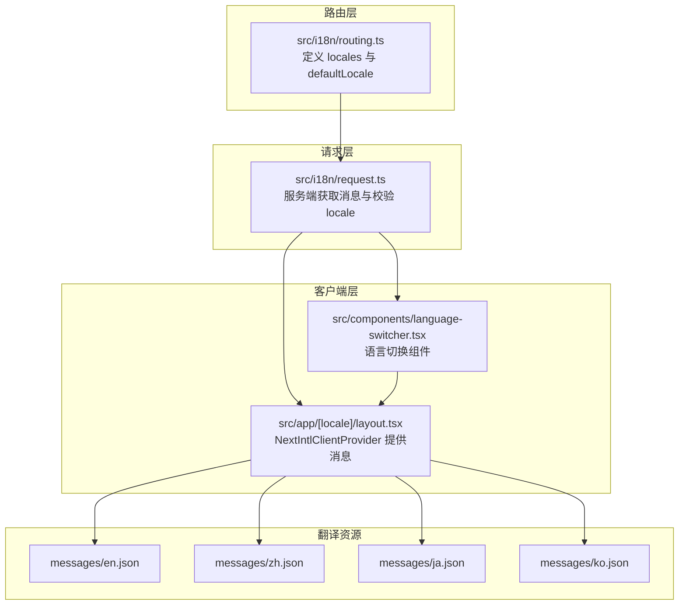
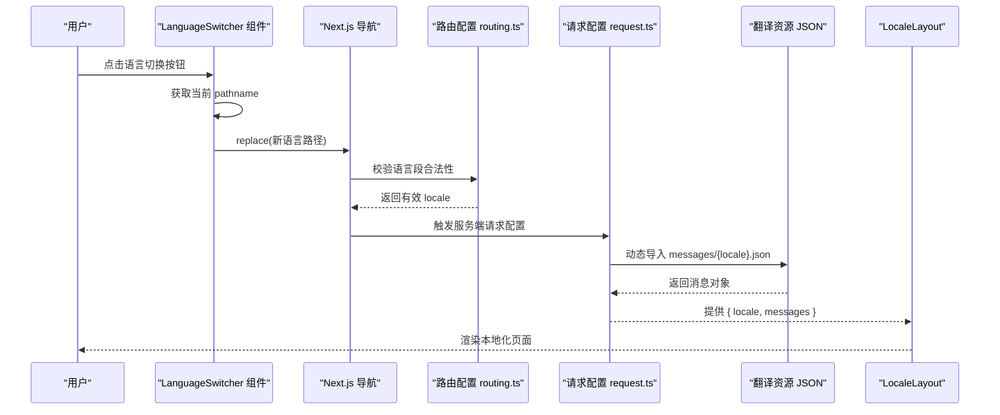
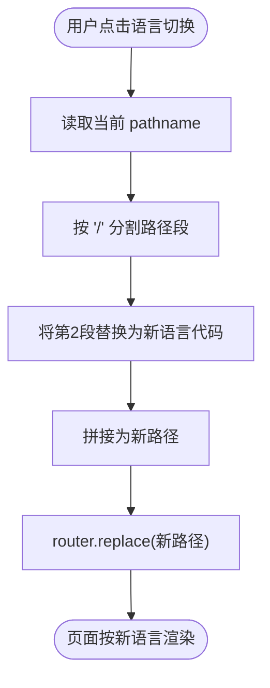
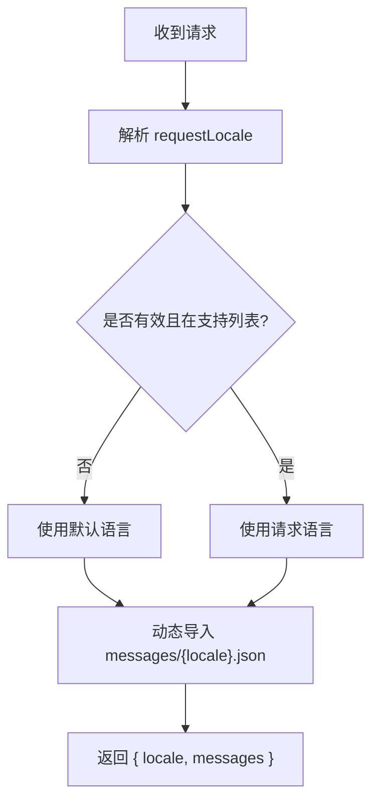
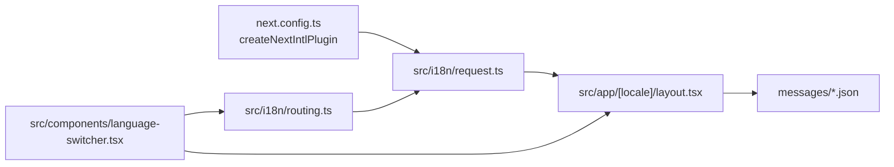

# 国际化支持

<cite>
**本文档引用的文件**
- [messages/en.json](file://messages/en.json)
- [messages/zh.json](file://messages/zh.json)
- [messages/ja.json](file://messages/ja.json)
- [messages/ko.json](file://messages/ko.json)
- [src/i18n/routing.ts](file://src/i18n/routing.ts)
- [src/i18n/request.ts](file://src/i18n/request.ts)
- [src/app/[locale]/layout.tsx](file://src/app/[locale]/layout.tsx)
- [src/components/language-switcher.tsx](file://src/components/language-switcher.tsx)
- [next.config.ts](file://next.config.ts)
- [src/lib/ai/prompts/video-generate.ts](file://src/lib/ai/prompts/video-generate.ts)
</cite>

## 目录
1. [简介](#简介)
2. [项目结构](#项目结构)
3. [核心组件](#核心组件)
4. [架构总览](#架构总览)
5. [详细组件分析](#详细组件分析)
6. [依赖关系分析](#依赖关系分析)
7. [性能考量](#性能考量)
8. [故障排除指南](#故障排除指南)
9. [结论](#结论)
10. [附录](#附录)

## 简介
本文件系统性梳理 AIComicBuilder 的国际化（i18n）支持，覆盖多语言配置、翻译资源管理、文化适配策略、next-intl 框架集成、路由国际化与语言切换机制、翻译键值管理、动态内容本地化、日期时间格式化、新增语言支持步骤与最佳实践、翻译质量保证与维护策略，以及 RTL 语言支持与无障碍国际化考虑。

## 项目结构
AIComicBuilder 的国际化能力以 next-intl 为核心，采用“路由 + 请求配置 + 翻译资源”的三层结构：
- 路由层：在路径中嵌入语言代码，声明支持的语言集合与默认语言
- 请求层：服务端请求配置，按客户端请求语言加载对应 JSON 翻译资源
- 客户端层：NextIntlClientProvider 提供消息上下文，语言切换组件负责导航跳转

图表来源
- [src/i18n/routing.ts:1-7](file://src/i18n/routing.ts#L1-L7)
- [src/i18n/request.ts:1-16](file://src/i18n/request.ts#L1-L16)
- [src/app/[locale]/layout.tsx](file://src/app/[locale]/layout.tsx#L33-L65)
- [src/components/language-switcher.tsx:1-77](file://src/components/language-switcher.tsx#L1-L77)
- [messages/en.json:1-520](file://messages/en.json#L1-L520)
- [messages/zh.json:1-522](file://messages/zh.json#L1-L522)
- [messages/ja.json:1-520](file://messages/ja.json#L1-L520)
- [messages/ko.json:1-520](file://messages/ko.json#L1-L520)

章节来源
- [src/i18n/routing.ts:1-7](file://src/i18n/routing.ts#L1-L7)
- [src/i18n/request.ts:1-16](file://src/i18n/request.ts#L1-L16)
- [src/app/[locale]/layout.tsx](file://src/app/[locale]/layout.tsx#L33-L65)
- [src/components/language-switcher.tsx:1-77](file://src/components/language-switcher.tsx#L1-L77)
- [messages/en.json:1-520](file://messages/en.json#L1-L520)
- [messages/zh.json:1-522](file://messages/zh.json#L1-L522)
- [messages/ja.json:1-520](file://messages/ja.json#L1-L520)
- [messages/ko.json:1-520](file://messages/ko.json#L1-L520)

## 核心组件
- 路由国际化配置：定义支持的语言列表与默认语言，确保路径中语言段合法
- 服务端请求配置：根据客户端请求语言加载对应 JSON 翻译资源，校验并回退默认语言
- 客户端布局：通过 NextIntlClientProvider 注入消息上下文，使组件可访问本地化内容
- 语言切换组件：在客户端渲染语言选择器，更新路径中的语言段并跳转

章节来源
- [src/i18n/routing.ts:1-7](file://src/i18n/routing.ts#L1-L7)
- [src/i18n/request.ts:1-16](file://src/i18n/request.ts#L1-L16)
- [src/app/[locale]/layout.tsx](file://src/app/[locale]/layout.tsx#L33-L65)
- [src/components/language-switcher.tsx:1-77](file://src/components/language-switcher.tsx#L1-L77)

## 架构总览
以下序列图展示从用户发起语言切换到页面渲染的完整流程：

图表来源
- [src/components/language-switcher.tsx:40-45](file://src/components/language-switcher.tsx#L40-L45)
- [src/i18n/routing.ts:3-6](file://src/i18n/routing.ts#L3-L6)
- [src/i18n/request.ts:4-15](file://src/i18n/request.ts#L4-L15)
- [src/app/[locale]/layout.tsx](file://src/app/[locale]/layout.tsx#L40-L46)
- [messages/en.json:1-520](file://messages/en.json#L1-L520)

## 详细组件分析

### 路由国际化与语言切换机制
- 路由配置：在路径段中嵌入语言代码，支持 zh、en、ja、ko；默认语言为 zh
- 语言切换：组件读取当前 pathname，替换第二段（语言段），调用 router.replace 实现无刷新跳转
- 客户端校验：LocaleLayout 在服务端渲染阶段再次校验语言段是否在支持列表内，否则触发 404

图表来源
- [src/components/language-switcher.tsx:40-45](file://src/components/language-switcher.tsx#L40-L45)
- [src/app/[locale]/layout.tsx](file://src/app/[locale]/layout.tsx#L42-L44)

章节来源
- [src/i18n/routing.ts:3-6](file://src/i18n/routing.ts#L3-L6)
- [src/components/language-switcher.tsx:1-77](file://src/components/language-switcher.tsx#L1-L77)
- [src/app/[locale]/layout.tsx](file://src/app/[locale]/layout.tsx#L33-L65)

### 服务端请求配置与消息加载
- 请求配置：getRequestConfig 接收 requestLocale，若无效则回退至默认语言
- 动态导入：按 locale 动态导入对应 JSON 文件，确保仅加载所需语言资源
- 消息注入：返回 { locale, messages }，供客户端布局注入

图表来源
- [src/i18n/request.ts:4-15](file://src/i18n/request.ts#L4-L15)

章节来源
- [src/i18n/request.ts:1-16](file://src/i18n/request.ts#L1-L16)

### 客户端布局与消息提供
- 布局职责：校验语言段合法性，获取消息，通过 NextIntlClientProvider 注入
- 字体与主题：统一注入 Google Fonts 变量与暗色主题类
- Hydration：使用 suppressHydrationWarning 处理 SSR/CSR 差异

章节来源
- [src/app/[locale]/layout.tsx](file://src/app/[locale]/layout.tsx#L33-L65)

### 翻译资源管理与键值组织
- 资源文件：按语言划分 JSON 文件，键空间按功能域分组（如 common、dashboard、project 等）
- 占位符与复数：资源中广泛使用占位符（如 {count}、{title}），便于动态替换
- 文化适配：不同语言对术语、标点、格式有差异，需在资源中分别维护

章节来源
- [messages/en.json:1-520](file://messages/en.json#L1-L520)
- [messages/zh.json:1-522](file://messages/zh.json#L1-L522)
- [messages/ja.json:1-520](file://messages/ja.json#L1-L520)
- [messages/ko.json:1-520](file://messages/ko.json#L1-L520)

### 动态内容本地化与日期时间格式化
- 动态内容：通过占位符与条件逻辑实现动态文案（如工作流计数、状态提示）
- 日期时间：建议在业务层使用 Intl.DateTimeFormat 或第三方库进行本地化格式化，避免硬编码格式
- 数字与货币：同样建议使用 Intl.NumberFormat 进行本地化处理

[本节为通用指导，不直接分析具体文件]

### next-intl 框架集成与配置
- 插件启用：next.config.ts 中通过 createNextIntlPlugin 指定请求配置路径
- 客户端提供：LocaleLayout 使用 NextIntlClientProvider 注入消息
- 路由驱动：路由层定义语言集合，确保路径与消息一致

章节来源
- [next.config.ts:1-16](file://next.config.ts#L1-L16)
- [src/app/[locale]/layout.tsx](file://src/app/[locale]/layout.tsx#L58-L59)
- [src/i18n/routing.ts:1-7](file://src/i18n/routing.ts#L1-L7)

### 文化适配策略与语言检测
- 语言检测：在 AI 生成提示词模块中，通过字符集特征判断语言并切换标签与标点
- 术语一致性：同一术语在不同语言中保持一致含义，避免跨语言歧义
- 标点与排版：遵循目标语言的标点与排版规范（如中文使用中文标点）

章节来源
- [src/lib/ai/prompts/video-generate.ts:5-44](file://src/lib/ai/prompts/video-generate.ts#L5-L44)

## 依赖关系分析
- next-intl/plugin → next.config.ts
- routing.ts → request.ts → LocaleLayout → messages/*.json
- language-switcher.tsx → routing.ts → LocaleLayout

图表来源
- [next.config.ts:3-5](file://next.config.ts#L3-L5)
- [src/i18n/request.ts:1-16](file://src/i18n/request.ts#L1-L16)
- [src/i18n/routing.ts:1-7](file://src/i18n/routing.ts#L1-L7)
- [src/app/[locale]/layout.tsx](file://src/app/[locale]/layout.tsx#L33-L65)
- [src/components/language-switcher.tsx:1-77](file://src/components/language-switcher.tsx#L1-L77)
- [messages/en.json:1-520](file://messages/en.json#L1-L520)

章节来源
- [next.config.ts:1-16](file://next.config.ts#L1-L16)
- [src/i18n/request.ts:1-16](file://src/i18n/request.ts#L1-L16)
- [src/i18n/routing.ts:1-7](file://src/i18n/routing.ts#L1-L7)
- [src/app/[locale]/layout.tsx](file://src/app/[locale]/layout.tsx#L33-L65)
- [src/components/language-switcher.tsx:1-77](file://src/components/language-switcher.tsx#L1-L77)

## 性能考量
- 按需加载：服务端动态导入对应语言 JSON，避免一次性加载全部资源
- 缓存策略：浏览器与 CDN 可缓存静态资源；服务端可结合缓存头减少重复加载
- 路由校验：在服务端与客户端均进行语言段校验，防止无效路径导致的错误渲染
- 组件懒加载：语言切换组件按需渲染，减少初始负载

[本节为通用指导，不直接分析具体文件]

## 故障排除指南
- 访问未知语言路径：LocaleLayout 将触发 404，检查路由配置与路径段
- 语言切换无效：确认 language-switcher.tsx 是否正确替换路径第二段，router.replace 是否生效
- 消息缺失：检查对应 messages/{locale}.json 是否存在且键空间完整
- 默认语言回退：若请求语言无效，将回退至默认语言，确认 request.ts 的校验逻辑

章节来源
- [src/app/[locale]/layout.tsx](file://src/app/[locale]/layout.tsx#L42-L44)
- [src/i18n/request.ts:7-9](file://src/i18n/request.ts#L7-L9)
- [src/components/language-switcher.tsx:40-45](file://src/components/language-switcher.tsx#L40-L45)

## 结论
AIComicBuilder 的国际化方案以 next-intl 为基础，通过路由嵌入语言段、服务端按需加载翻译资源、客户端提供消息上下文与语言切换组件，实现了清晰、可扩展的多语言支持。现有资源覆盖 zh、en、ja、ko 四种语言，具备良好的可维护性与扩展性。建议在后续迭代中完善 RTL 语言支持与无障碍国际化，并持续优化翻译质量与维护流程。

## 附录

### 新增语言支持步骤与最佳实践
- 步骤
  1) 在 messages 目录新增 {lang}.json，复制现有语言结构，逐项翻译
  2) 在 routing.ts 的 locales 列表中加入新语言代码
  3) 在 request.ts 的动态导入路径中确保可被动态解析
  4) 在语言切换组件的 localeLabels/localeFullLabels 中补充显示标签
  5) 在 LocaleLayout 中确保路由校验逻辑仍有效
  6) 测试：验证路径切换、消息加载、占位符渲染与文化适配
- 最佳实践
  - 键空间分组：按功能域组织键，避免散乱
  - 占位符命名：使用语义化名称，便于翻译与复用
  - 文化适配：尊重目标语言的标点、排版与术语习惯
  - 版本控制：统一提交翻译文件，建立评审流程

章节来源
- [src/i18n/routing.ts:3-6](file://src/i18n/routing.ts#L3-L6)
- [src/i18n/request.ts:13-13](file://src/i18n/request.ts#L13-L13)
- [src/components/language-switcher.tsx:9-21](file://src/components/language-switcher.tsx#L9-L21)
- [messages/en.json:1-520](file://messages/en.json#L1-L520)
- [messages/zh.json:1-522](file://messages/zh.json#L1-L522)
- [messages/ja.json:1-520](file://messages/ja.json#L1-L520)
- [messages/ko.json:1-520](file://messages/ko.json#L1-L520)

### 翻译质量保证与维护策略
- 质量保证
  - 术语表：建立跨语言术语对照表，确保一致性
  - 上下文审查：翻译时关注上下文与交互语境
  - 用户反馈：收集真实使用场景下的反馈并迭代
- 维护策略
  - 版本追踪：随产品版本同步更新翻译键与值
  - 自动化校验：在 CI 中校验 JSON 语法与键完整性
  - 评审流程：引入多人评审与自动化测试

[本节为通用指导，不直接分析具体文件]

### RTL 语言支持与无障碍国际化考虑
- RTL 支持
  - 样式适配：为 RTL 语言提供独立样式或 CSS 变量切换
  - 文本方向：使用 dir="rtl" 并调整布局与对齐方式
  - 输入与排版：确保输入框、菜单与弹层在 RTL 下行为正常
- 无障碍国际化
  - 屏幕阅读器：确保本地化文案对读屏器友好，语序自然
  - 键盘导航：在多语言环境下保持一致的键盘操作体验
  - 对比度与字体：确保不同语言下的可读性与对比度满足无障碍标准

[本节为通用指导，不直接分析具体文件]