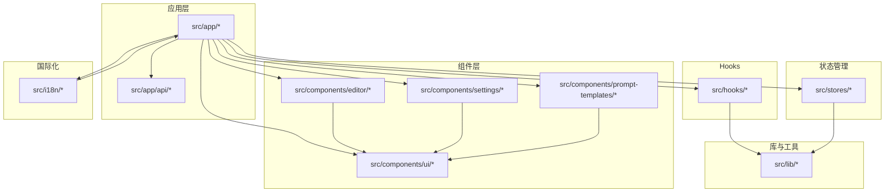
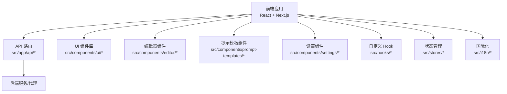
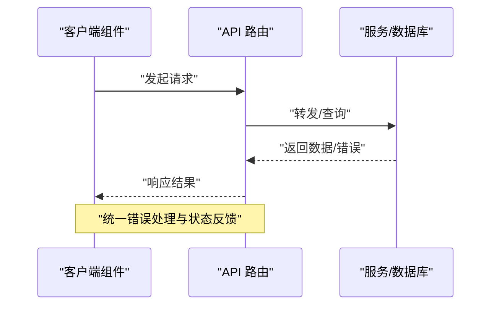
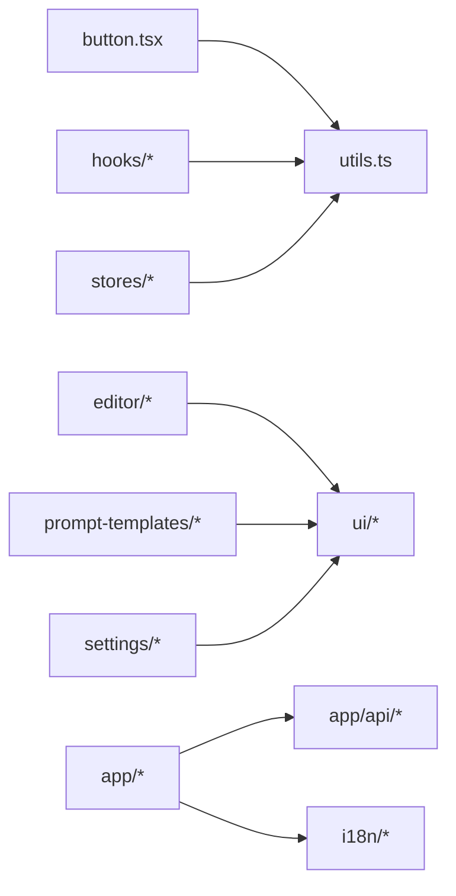

# 代码规范与约定

<cite>
**本文引用的文件**
- [tsconfig.json](file://tsconfig.json)
- [eslint.config.mjs](file://eslint.config.mjs)
- [package.json](file://package.json)
- [next.config.ts](file://next.config.ts)
- [components.json](file://components.json)
- [src/app/layout.tsx](file://src/app/layout.tsx)
- [src/components/ui/button.tsx](file://src/components/ui/button.tsx)
- [src/hooks/use-model-guard.ts](file://src/hooks/use-model-guard.ts)
- [src/lib/utils.ts](file://src/lib/utils.ts)
- [src/stores/project-store.ts](file://src/stores/project-store.ts)
- [src/stores/episode-store.ts](file://src/stores/episode-store.ts)
- [src/lib/api-fetch.ts](file://src/lib/api-fetch.ts)
- [src/lib/bootstrap.ts](file://src/lib/bootstrap.ts)
- [src/app/api/projects/[id]/route.ts](file://src/app/api/projects/[id]/route.ts)
- [src/app/api/tasks/[id]/route.ts](file://src/app/api/tasks/[id]/route.ts)
- [src/i18n/routing.ts](file://src/i18n/routing.ts)
</cite>

## 目录
1. [引言](#引言)
2. [项目结构](#项目结构)
3. [核心组件](#核心组件)
4. [架构总览](#架构总览)
5. [详细组件分析](#详细组件分析)
6. [依赖关系分析](#依赖关系分析)
7. [性能考虑](#性能考虑)
8. [故障排查指南](#故障排查指南)
9. [结论](#结论)
10. [附录](#附录)

## 引言
本文件为 AIComicBuilder 的代码规范与约定文档，面向前端与全栈开发团队，统一 TypeScript 配置、ESLint 规则、代码格式化标准、命名约定、文件组织与模块导入规范；并给出 React 组件编写规范、Hook 使用约定、状态管理最佳实践、注释标准、错误处理模式与性能优化准则；最后覆盖 Git 提交信息格式、分支命名规范与代码审查检查清单。

## 项目结构
项目采用 Next.js App Router 结构，按功能域划分目录：
- src/app：页面路由与服务端逻辑（App Router 路由器）
- src/components：可复用 UI 组件与业务组件
- src/hooks：自定义 Hook
- src/lib：通用库函数、工具与服务封装
- src/stores：状态管理（基于本地状态与简单 Store 模式）
- src/i18n：国际化路由与请求处理
- 根级配置：tsconfig.json、eslint.config.mjs、next.config.ts、components.json 等

图表来源
- [src/app/layout.tsx](file://src/app/layout.tsx)
- [src/components/ui/button.tsx](file://src/components/ui/button.tsx)
- [src/hooks/use-model-guard.ts](file://src/hooks/use-model-guard.ts)
- [src/lib/utils.ts](file://src/lib/utils.ts)
- [src/stores/project-store.ts](file://src/stores/project-store.ts)
- [src/stores/episode-store.ts](file://src/stores/episode-store.ts)
- [src/i18n/routing.ts](file://src/i18n/routing.ts)

章节来源
- [src/app/layout.tsx](file://src/app/layout.tsx)
- [src/i18n/routing.ts](file://src/i18n/routing.ts)

## 核心组件
- TypeScript 配置：启用严格类型检查、路径映射、ESLint 集成等
- ESLint 配置：统一规则集，支持 React Hooks、Next.js、TypeScript 等插件
- Next.js 配置：构建与运行时行为控制
- 组件系统：基于 Radix UI 的可组合 UI 组件
- 自定义 Hook：如模型访问守卫
- 状态管理：轻量 Store 与本地状态结合
- 国际化：基于 App Router 的多语言路由

章节来源
- [tsconfig.json](file://tsconfig.json)
- [eslint.config.mjs](file://eslint.config.mjs)
- [next.config.ts](file://next.config.ts)
- [components.json](file://components.json)

## 架构总览
应用采用分层架构：
- 表现层：React 组件与 UI 库
- 业务层：编辑器组件、提示模板、设置组件
- 工具层：API 封装、工具函数、国际化
- 数据层：本地 Store 与后端接口

图表来源
- [src/app/api/projects/[id]/route.ts](file://src/app/api/projects/[id]/route.ts)
- [src/lib/api-fetch.ts](file://src/lib/api-fetch.ts)
- [src/stores/project-store.ts](file://src/stores/project-store.ts)
- [src/i18n/routing.ts](file://src/i18n/routing.ts)

## 详细组件分析

### TypeScript 配置规范
- 严格模式：开启严格空值检查、严格函数类型等
- 路径映射：通过 baseUrl 与 paths 实现清晰的模块别名
- 编译目标：ES2020+，模块系统为 ESNext
- JSX：保留 JSX 并指定 React JSX 运行时
- ESLint 集成：确保 TS 文件在 ESLint 中被正确处理
- 类型声明：第三方库类型缺失时，优先在 src/types 下补充

章节来源
- [tsconfig.json](file://tsconfig.json)

### ESLint 规则与格式化标准
- 规则集：使用官方推荐规则，启用 React Hooks、Next.js、TypeScript 支持
- 插件：react-hooks、@typescript-eslint、import、unused-imports 等
- 格式化：Prettier 与 ESLint 协同，统一缩进、引号、尾逗号等
- 忽略文件：.gitignore 与根目录忽略策略保持一致
- 命令：提供 lint 与 fix 脚本，CI 中强制执行

章节来源
- [eslint.config.mjs](file://eslint.config.mjs)
- [package.json](file://package.json)

### 命名约定
- 文件：组件文件使用 PascalCase.tsx，工具函数使用小驼峰命名
- 变量/函数：小驼峰；常量使用 UPPER_SNAKE_CASE
- 接口/类型：PascalCase；泛型使用单字母或简短语义名称
- 组件：PascalCase；UI 组件前缀 ui- 或无前缀但位于 ui 目录
- Hook：useXxx 形式，返回值明确
- Store：Store 后缀，如 project-store
- 路由：App Router 下使用方括号表示动态段，如 [id]

章节来源
- [src/components/ui/button.tsx](file://src/components/ui/button.tsx)
- [src/hooks/use-model-guard.ts](file://src/hooks/use-model-guard.ts)
- [src/stores/project-store.ts](file://src/stores/project-store.ts)
- [src/app/api/projects/[id]/route.ts](file://src/app/api/projects/[id]/route.ts)

### 文件组织与模块导入规范
- 功能域优先：按功能域分目录（editor、prompt-templates、settings、ui）
- 相对导入：同一功能域内使用相对路径
- 组件别名：通过 tsconfig 路径映射简化导入
- 外部依赖：统一在顶部导入，避免分散
- UI 组件：从 src/components/ui 导入，避免直接复制粘贴

章节来源
- [tsconfig.json](file://tsconfig.json)
- [src/components/ui/button.tsx](file://src/components/ui/button.tsx)

### React 组件编写规范
- 函数组件：优先使用函数组件与 Hooks
- Props：使用 TypeScript 接口定义，必要时提供默认值
- 渲染：避免在渲染中进行重计算，使用 useMemo/useCallback
- 事件：事件处理器稳定化，避免闭包陷阱
- 错误边界：在页面级包裹错误边界，捕获子树异常
- 性能：拆分大组件，使用 React.lazy 与 Suspense

章节来源
- [src/components/ui/button.tsx](file://src/components/ui/button.tsx)
- [src/lib/utils.ts](file://src/lib/utils.ts)

### 自定义 Hook 使用约定
- 命名：useXxx，返回值明确且单一职责
- 依赖：显式声明依赖数组，避免遗漏
- 稳定性：复杂逻辑抽取到外部工具函数，Hook 内仅做状态与副作用
- 测试：为关键 Hook 提供单元测试

章节来源
- [src/hooks/use-model-guard.ts](file://src/hooks/use-model-guard.ts)

### 状态管理最佳实践
- Store 设计：Store 以不可变更新为主，集中式状态与局部状态结合
- 作用域：全局 Store 仅存放跨页面共享状态
- 更新：通过 Action 方法更新，避免直接修改
- 订阅：组件通过 Selector 订阅所需字段，减少重渲染
- 异步：异步操作通过中间件或工具函数封装，保持 Store 纯净

章节来源
- [src/stores/project-store.ts](file://src/stores/project-store.ts)
- [src/stores/episode-store.ts](file://src/stores/episode-store.ts)

### API 与数据流
- 路由：App Router 下的 API 路由，遵循 [param] 命名
- 请求封装：统一使用 api-fetch，处理错误与重试
- 任务：任务 ID 对应的任务路由独立维护
- 上传：上传路由支持通配符路径

图表来源
- [src/app/api/projects/[id]/route.ts](file://src/app/api/projects/[id]/route.ts)
- [src/lib/api-fetch.ts](file://src/lib/api-fetch.ts)

章节来源
- [src/app/api/projects/[id]/route.ts](file://src/app/api/projects/[id]/route.ts)
- [src/app/api/tasks/[id]/route.ts](file://src/app/api/tasks/[id]/route.ts)
- [src/lib/api-fetch.ts](file://src/lib/api-fetch.ts)

### 国际化与布局
- 布局：根布局负责全局样式与 Provider 包裹
- 路由：多语言路由通过 App Router 实现
- 请求：国际化请求处理在 i18n 层完成

章节来源
- [src/app/layout.tsx](file://src/app/layout.tsx)
- [src/i18n/routing.ts](file://src/i18n/routing.ts)

## 依赖关系分析
- 组件依赖：编辑器与提示模板依赖 UI 组件库
- 工具依赖：组件与 Store 依赖工具函数
- 状态依赖：页面组件依赖 Store 与 Hook
- 国际化依赖：路由与页面依赖国际化配置

图表来源
- [src/components/ui/button.tsx](file://src/components/ui/button.tsx)
- [src/lib/utils.ts](file://src/lib/utils.ts)
- [src/stores/project-store.ts](file://src/stores/project-store.ts)
- [src/stores/episode-store.ts](file://src/stores/episode-store.ts)
- [src/app/api/projects/[id]/route.ts](file://src/app/api/projects/[id]/route.ts)
- [src/i18n/routing.ts](file://src/i18n/routing.ts)

## 性能考虑
- 渲染优化：合理使用 memo、useMemo、useCallback，避免不必要的重渲染
- 资源加载：图片与媒体资源懒加载，视频与脚本按需加载
- 状态粒度：细化 Store 字段，降低订阅范围
- 批处理：批量更新状态，合并多次变更
- 缓存：利用浏览器缓存与服务端缓存策略
- 分支：大组件拆分，使用 React.lazy 与 Suspense

## 故障排查指南
- 类型错误：检查 tsconfig 配置与类型声明，确保类型安全
- ESLint 报错：根据规则逐项修复，必要时在文件级别禁用特定规则
- API 错误：统一在 api-fetch 中处理错误，记录状态码与消息
- 国际化问题：核对路由与语言切换逻辑
- 构建失败：检查 next.config 与依赖版本兼容性

章节来源
- [eslint.config.mjs](file://eslint.config.mjs)
- [src/lib/api-fetch.ts](file://src/lib/api-fetch.ts)
- [src/i18n/routing.ts](file://src/i18n/routing.ts)

## 结论
本规范统一了 AIComicBuilder 的开发约定，涵盖类型系统、代码质量、组件设计、状态管理与国际化等方面。建议在团队内定期回顾与更新，确保代码一致性与可维护性。

## 附录

### TypeScript 配置要点
- 严格模式与路径映射
- 编译目标与 JSX 运行时
- ESLint 集成与类型检查

章节来源
- [tsconfig.json](file://tsconfig.json)

### ESLint 与格式化
- 规则集与插件
- Prettier 集成
- 本地与 CI 执行

章节来源
- [eslint.config.mjs](file://eslint.config.mjs)
- [package.json](file://package.json)

### 命名与导入
- 文件与变量命名
- 组件与 Hook 命名
- 模块导入路径

章节来源
- [src/components/ui/button.tsx](file://src/components/ui/button.tsx)
- [src/hooks/use-model-guard.ts](file://src/hooks/use-model-guard.ts)
- [tsconfig.json](file://tsconfig.json)

### React 组件与 Hook
- 函数组件与 Hooks 使用
- 渲染与事件优化
- 自定义 Hook 规范

章节来源
- [src/components/ui/button.tsx](file://src/components/ui/button.tsx)
- [src/hooks/use-model-guard.ts](file://src/hooks/use-model-guard.ts)
- [src/lib/utils.ts](file://src/lib/utils.ts)

### 状态管理
- Store 设计与更新
- 订阅与异步处理
- 作用域与性能

章节来源
- [src/stores/project-store.ts](file://src/stores/project-store.ts)
- [src/stores/episode-store.ts](file://src/stores/episode-store.ts)

### API 与数据流
- App Router API 路由
- 请求封装与错误处理
- 任务与上传路由

章节来源
- [src/app/api/projects/[id]/route.ts](file://src/app/api/projects/[id]/route.ts)
- [src/app/api/tasks/[id]/route.ts](file://src/app/api/tasks/[id]/route.ts)
- [src/lib/api-fetch.ts](file://src/lib/api-fetch.ts)

### 国际化与布局
- 根布局与样式
- 多语言路由
- 请求处理

章节来源
- [src/app/layout.tsx](file://src/app/layout.tsx)
- [src/i18n/routing.ts](file://src/i18n/routing.ts)

### Git 提交与审查
- 提交信息格式：type(scope): subject
- 分支命名：feat/xxx、fix/xxx、docs/xxx、refactor/xxx
- 代码审查清单：类型安全、可读性、性能、测试覆盖率、破坏性变更说明

[本节为通用实践建议，不直接分析具体文件，故无章节来源]