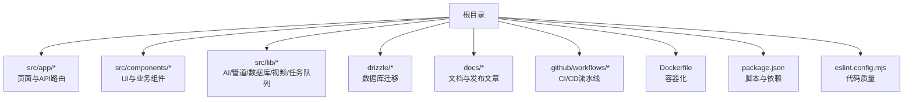
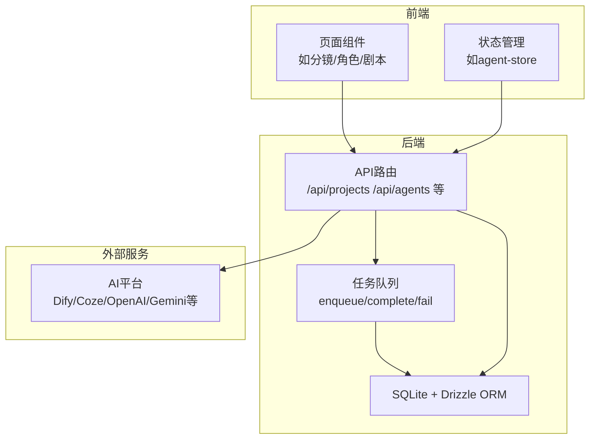
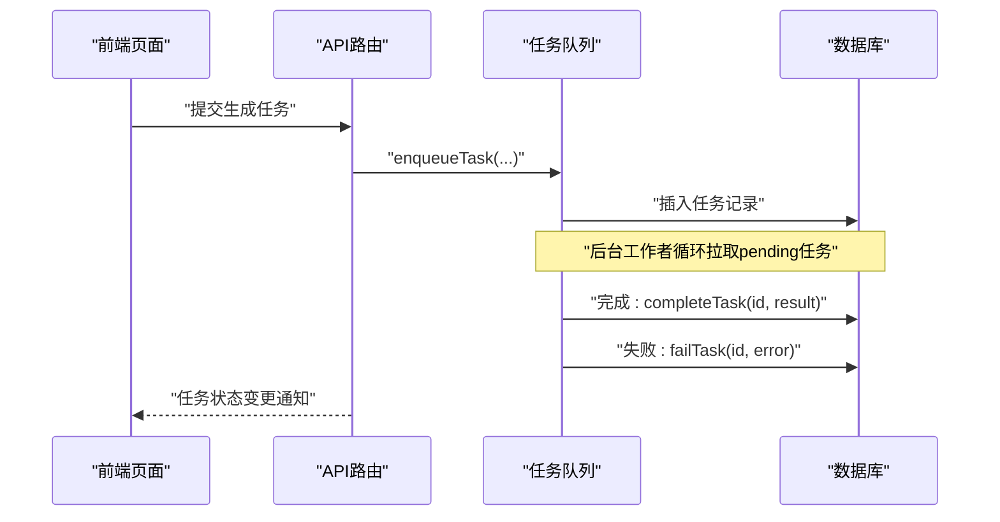
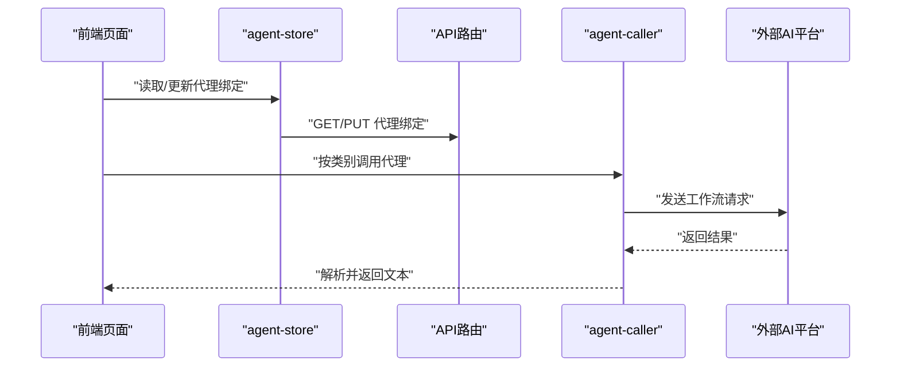
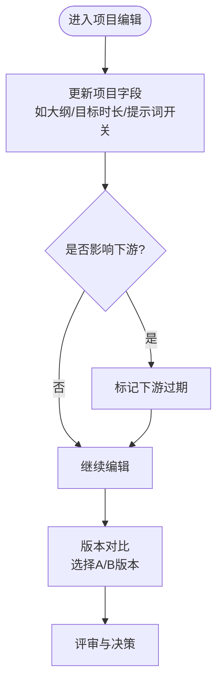
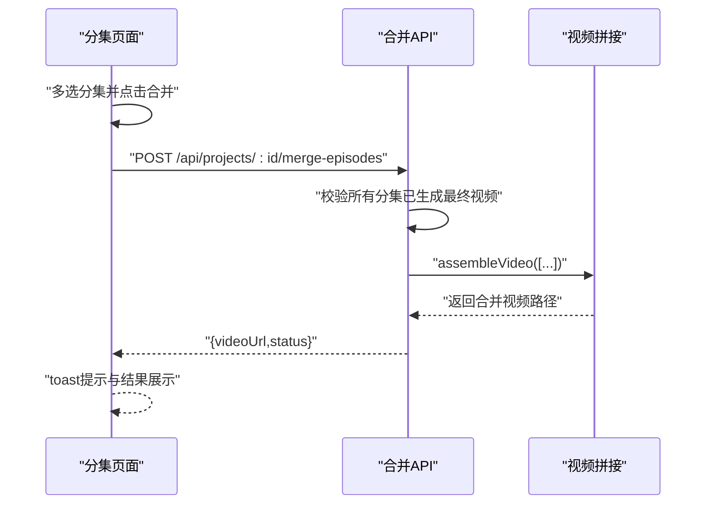
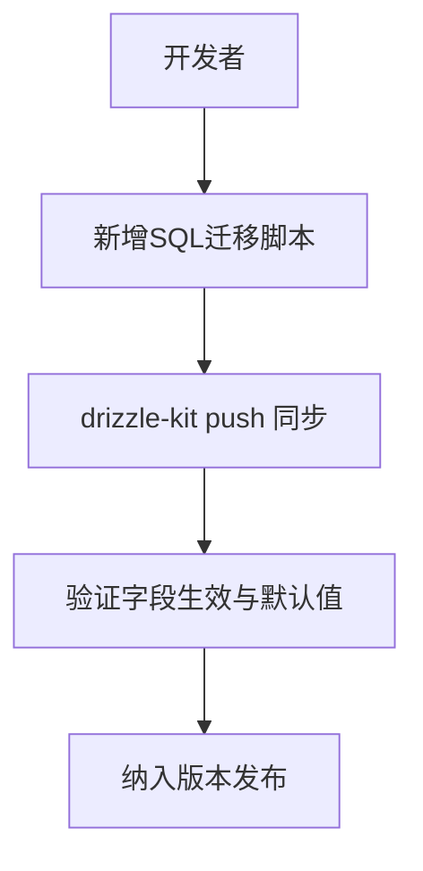
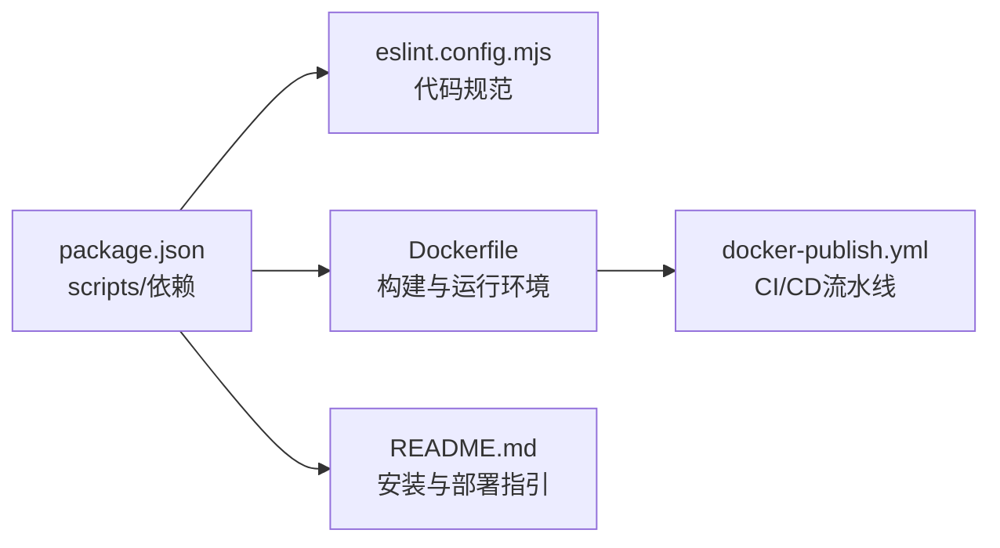

# 开发工作流程

<cite>
**本文引用的文件**
- [package.json](file://package.json)
- [Dockerfile](file://Dockerfile)
- [.github/workflows/docker-publish.yml](file://.github/workflows/docker-publish.yml)
- [README.md](file://README.md)
- [task_plan.md](file://task_plan.md)
- [eslint.config.mjs](file://eslint.config.mjs)
- [src/lib/task-queue/queue.ts](file://src/lib/task-queue/queue.ts)
- [src/lib/task-queue/index.ts](file://src/lib/task-queue/index.ts)
- [src/stores/agent-store.ts](file://src/stores/agent-store.ts)
- [src/app/api/projects/[id]/route.ts](file://src/app/api/projects/[id]/route.ts)
- [src/app/api/projects/[id]/merge-episodes/route.ts](file://src/app/api/projects/[id]/merge-episodes/route.ts)
- [src/app/[locale]/project/[id]/episodes/page.tsx](file://src/app/[locale]/project/[id]/episodes/page.tsx)
- [src/components/editor/version-compare.tsx](file://src/components/editor/version-compare.tsx)
- [src/lib/ai/agent-caller.ts](file://src/lib/ai/agent-caller.ts)
- [drizzle/0015_add_use_project_prompts.sql](file://drizzle/0015_add_use_project_prompts.sql)
- [drizzle/0023_add_project_outline.sql](file://drizzle/0023_add_project_outline.sql)
- [drizzle/0032_add_project_target_duration.sql](file://drizzle/0032_add_project_target_duration.sql)
</cite>

## 目录
1. [引言](#引言)
2. [项目结构](#项目结构)
3. [核心组件](#核心组件)
4. [架构总览](#架构总览)
5. [详细组件分析](#详细组件分析)
6. [依赖关系分析](#依赖关系分析)
7. [性能考虑](#性能考虑)
8. [故障排查指南](#故障排查指南)
9. [结论](#结论)
10. [附录](#附录)

## 引言
本文件面向AIComicBuilder团队，提供从需求分析到部署上线的完整开发工作流程指导。内容覆盖分支策略、合并请求流程与代码审查标准；功能开发模板、重构流程与依赖更新规范；持续集成配置、自动化测试与部署流水线；版本管理、发布日志与回滚策略；以及团队协作工具使用、会议规范与进度跟踪方法。目标是帮助新成员快速融入，同时为长期维护提供一致、可追溯的工作范式。

## 项目结构
AIComicBuilder采用Next.js 16 App Router组织前端路由与页面，后端API通过app/api路由暴露，数据库迁移脚本位于drizzle目录，容器化与CI/CD通过Dockerfile与GitHub Actions实现。项目使用pnpm作为包管理器，ESLint配置遵循Next.js官方规则并自定义忽略项。

图表来源
- [README.md:156-180](file://README.md#L156-L180)
- [package.json:1-60](file://package.json#L1-L60)
- [Dockerfile:1-41](file://Dockerfile#L1-L41)
- [.github/workflows/docker-publish.yml:1-54](file://.github/workflows/docker-publish.yml#L1-L54)

章节来源
- [README.md:156-180](file://README.md#L156-L180)
- [package.json:1-60](file://package.json#L1-L60)

## 核心组件
- 任务队列与后台处理：通过任务表驱动异步生成，支持重试与失败标记，保障生成流程稳定性。
- 代理绑定与调用：支持多种AI平台（Dify、Coze等），按分类动态绑定，统一输出解析与错误处理。
- 项目与版本管理：项目字段扩展（大纲、目标时长、是否使用项目级提示词等），版本对比与多版本并行迭代。
- 合并与导出：分集合并、视频拼接与下载，保证最终产物质量与一致性。

章节来源
- [src/lib/task-queue/queue.ts:49-100](file://src/lib/task-queue/queue.ts#L49-L100)
- [src/lib/ai/agent-caller.ts:300-379](file://src/lib/ai/agent-caller.ts#L300-L379)
- [src/app/api/projects/[id]/route.ts:153-195](file://src/app/api/projects/[id]/route.ts#L153-L195)
- [src/components/editor/version-compare.tsx:51-84](file://src/components/editor/version-compare.tsx#L51-L84)
- [src/app/api/projects/[id]/merge-episodes/route.ts:54-79](file://src/app/api/projects/[id]/merge-episodes/route.ts#L54-L79)

## 架构总览
下图展示了从前端页面到API、数据库与外部AI服务的整体交互路径，以及任务队列与后台工作者的角色定位。

图表来源
- [src/stores/agent-store.ts:1-55](file://src/stores/agent-store.ts#L1-L55)
- [src/app/api/projects/[id]/route.ts:153-195](file://src/app/api/projects/[id]/route.ts#L153-L195)
- [src/lib/task-queue/queue.ts:49-100](file://src/lib/task-queue/queue.ts#L49-L100)
- [src/lib/ai/agent-caller.ts:300-379](file://src/lib/ai/agent-caller.ts#L300-L379)

## 详细组件分析

### 任务队列与后台处理
- 设计要点
  - 任务状态：pending/completed/failed，带重试次数上限。
  - 失败策略：超过最大重试则标记失败，否则恢复为pending并增加重试计数。
  - 查询接口：按项目查询任务，按创建时间排序，便于前端展示。
- 关键流程
  - 入队：业务侧调用入队接口，写入任务表。
  - 执行：后台工作者拉取任务并执行，完成后更新状态或失败。
  - 前端：轮询或订阅任务状态，驱动UI反馈。

图表来源
- [src/lib/task-queue/queue.ts:49-100](file://src/lib/task-queue/queue.ts#L49-L100)
- [src/lib/task-queue/index.ts:1-3](file://src/lib/task-queue/index.ts#L1-L3)

章节来源
- [src/lib/task-queue/queue.ts:49-100](file://src/lib/task-queue/queue.ts#L49-L100)
- [src/lib/task-queue/index.ts:1-3](file://src/lib/task-queue/index.ts#L1-L3)

### 代理绑定与调用
- 设计要点
  - 支持按项目维度为不同生成阶段绑定代理（如脚本大纲、角色提取、分镜拆分等）。
  - 统一调用不同平台（Dify/Coze等），解析输出并做JSON提取与校验。
- 关键流程
  - 获取/设置代理绑定：GET/PUT /api/projects/:id/agent-bindings。
  - 调用代理：根据绑定类别选择对应平台，发送请求并解析响应。

图表来源
- [src/stores/agent-store.ts:1-55](file://src/stores/agent-store.ts#L1-L55)
- [src/app/api/projects/[id]/agent-bindings/route.ts:1-39](file://src/app/api/projects/[id]/agent-bindings/route.ts#L1-L39)
- [src/lib/ai/agent-caller.ts:300-379](file://src/lib/ai/agent-caller.ts#L300-L379)

章节来源
- [src/stores/agent-store.ts:1-55](file://src/stores/agent-store.ts#L1-L55)
- [src/app/api/projects/[id]/agent-bindings/route.ts:1-39](file://src/app/api/projects/[id]/agent-bindings/route.ts#L1-L39)
- [src/lib/ai/agent-caller.ts:300-379](file://src/lib/ai/agent-caller.ts#L300-L379)

### 项目与版本管理
- 设计要点
  - 项目字段扩展：大纲、目标时长、是否使用项目级提示词等，影响下游生成行为。
  - 版本对比：提供双栏对比选择器，便于评审与回归验证。
- 关键流程
  - 更新项目元数据：PUT /api/projects/:id，必要时标记下游“过期”以触发再生成。
  - 版本对比：选择两个版本，渲染差异内容。

图表来源
- [src/app/api/projects/[id]/route.ts:153-195](file://src/app/api/projects/[id]/route.ts#L153-L195)
- [src/components/editor/version-compare.tsx:51-84](file://src/components/editor/version-compare.tsx#L51-L84)

章节来源
- [src/app/api/projects/[id]/route.ts:153-195](file://src/app/api/projects/[id]/route.ts#L153-L195)
- [src/components/editor/version-compare.tsx:51-84](file://src/components/editor/version-compare.tsx#L51-L84)

### 分集合并与导出
- 设计要点
  - 合并前校验：必须所有选中分集均已生成最终视频。
  - 合并执行：调用视频拼接函数，返回合并后的视频URL。
  - 前端交互：多选分集，点击合并，toast反馈结果。
- 关键流程

图表来源
- [src/app/[locale]/project/[id]/episodes/page.tsx:88-130](file://src/app/[locale]/project/[id]/episodes/page.tsx#L88-L130)
- [src/app/api/projects/[id]/merge-episodes/route.ts:54-79](file://src/app/api/projects/[id]/merge-episodes/route.ts#L54-L79)

章节来源
- [src/app/[locale]/project/[id]/episodes/page.tsx:88-130](file://src/app/[locale]/project/[id]/episodes/page.tsx#L88-L130)
- [src/app/api/projects/[id]/merge-episodes/route.ts:54-79](file://src/app/api/projects/[id]/merge-episodes/route.ts#L54-L79)

### 数据库迁移与版本演进
- 设计要点
  - 迁移脚本按序号递增，新增列用于增强项目元数据（如大纲、目标时长、是否使用项目提示词）。
  - 使用Drizzle Kit进行迁移管理，配合锁文件锁定依赖版本。
- 关键流程
  - 新增字段：在drizzle目录添加SQL脚本，执行drizzle-kit push同步至数据库。
  - 回滚：通过版本号与journal记录进行回溯（需谨慎评估影响范围）。

图表来源
- [drizzle/0015_add_use_project_prompts.sql:1-1](file://drizzle/0015_add_use_project_prompts.sql#L1-L1)
- [drizzle/0023_add_project_outline.sql:1-1](file://drizzle/0023_add_project_outline.sql#L1-L1)
- [drizzle/0032_add_project_target_duration.sql:1-1](file://drizzle/0032_add_project_target_duration.sql#L1-L1)

章节来源
- [drizzle/0015_add_use_project_prompts.sql:1-1](file://drizzle/0015_add_use_project_prompts.sql#L1-L1)
- [drizzle/0023_add_project_outline.sql:1-1](file://drizzle/0023_add_project_outline.sql#L1-L1)
- [drizzle/0032_add_project_target_duration.sql:1-1](file://drizzle/0032_add_project_target_duration.sql#L1-L1)

## 依赖关系分析
- 包管理与脚本
  - 使用pnpm管理依赖，提供dev/build/start/lint等常用脚本。
  - pnpm配置仅构建特定原生依赖，减少CI/CD复杂度。
- ESLint配置
  - 基于Next.js官方配置，自定义忽略目录，确保构建产物与临时目录不被扫描。
- 容器化与部署
  - Dockerfile分阶段构建，安装FFmpeg与中日韩字体以支持字幕烧录。
  - GitHub Actions在推送到main或打标签时构建并推送镜像，同时为标签创建Release。

图表来源
- [package.json:1-60](file://package.json#L1-L60)
- [eslint.config.mjs:1-18](file://eslint.config.mjs#L1-L18)
- [Dockerfile:1-41](file://Dockerfile#L1-L41)
- [.github/workflows/docker-publish.yml:1-54](file://.github/workflows/docker-publish.yml#L1-L54)
- [README.md:67-136](file://README.md#L67-L136)

章节来源
- [package.json:1-60](file://package.json#L1-L60)
- [eslint.config.mjs:1-18](file://eslint.config.mjs#L1-L18)
- [Dockerfile:1-41](file://Dockerfile#L1-L41)
- [.github/workflows/docker-publish.yml:1-54](file://.github/workflows/docker-publish.yml#L1-L54)
- [README.md:67-136](file://README.md#L67-L136)

## 性能考虑
- 任务队列与并发
  - 控制并发数量，避免外部AI平台限流；对失败任务进行指数退避与最大重试限制。
- 前端渲染
  - 使用轻量状态管理与懒加载组件，减少初始渲染压力。
- 视频处理
  - 合理设置分辨率与码率，避免超大文件导致内存与IO瓶颈。
- 数据库
  - 为高频查询字段建立索引，定期清理过期任务与无用资产。

## 故障排查指南
- 任务失败
  - 检查任务表中的retries与error字段，定位具体失败原因；必要时人工干预或重试。
- 代理调用异常
  - 核对代理绑定类别与密钥配置；查看agent-caller的错误日志与响应解析。
- 合并失败
  - 确认所选分集均已生成最终视频；检查assembleVideo的输入路径与权限。
- CI/CD问题
  - 查看Actions日志与缓存命中情况；核对Docker Hub凭据与镜像标签规则。

章节来源
- [src/lib/task-queue/queue.ts:49-100](file://src/lib/task-queue/queue.ts#L49-L100)
- [src/lib/ai/agent-caller.ts:300-379](file://src/lib/ai/agent-caller.ts#L300-L379)
- [src/app/api/projects/[id]/merge-episodes/route.ts:54-79](file://src/app/api/projects/[id]/merge-episodes/route.ts#L54-L79)
- [.github/workflows/docker-publish.yml:1-54](file://.github/workflows/docker-publish.yml#L1-L54)

## 结论
本文档提供了AIComicBuilder从需求到上线的全生命周期工作流程，明确了分支与合并策略、代码审查标准、功能开发模板、重构流程、依赖更新规范、CI/CD配置、版本管理与回滚策略，以及团队协作与进度跟踪方法。建议团队在实践中持续完善流程文档，结合实际问题不断优化效率与质量。

## 附录

### 分支策略与合并请求流程
- 分支命名
  - feature/功能主题
  - fix/修复主题
  - hotfix/紧急修复
  - refactor/重构主题
- 合并请求（MR）
  - 必须关联任务单与设计文档链接。
  - 至少一名审查者批准，且无待处理评论。
  - 本地通过ESLint与构建检查后再合并。
- 合并方式
  - 主分支使用rebase或squash以保持历史整洁；hotfix可直接merge。

### 代码审查标准
- 可读性：变量与函数命名清晰，注释简洁有效。
- 正确性：边界条件与异常路径覆盖充分，单元/集成测试通过。
- 性能：避免不必要的重渲染与重复计算，合理使用缓存。
- 安全：敏感信息不硬编码，输入校验与权限控制到位。
- 兼容性：变更影响面评估，必要时提供迁移脚本或降级方案。

### 功能开发模板
- 需求与设计
  - 明确目标、约束与验收标准；产出设计稿或原型。
- 开发
  - 新增API路由或组件，补充类型定义与错误处理。
  - 编写单元/集成测试，确保覆盖率达标。
- 测试
  - 本地运行ESLint与构建；在测试环境验证端到端流程。
- 文档
  - 更新README或相关文档；补充发布说明。
- 上线
  - 创建分支并发起MR；通过审查后合并；打标签并触发CI/CD。

### 重构流程
- 评估影响：列出受影响模块与调用链。
- 小步快跑：拆分为多个小PR，逐步替换旧实现。
- 兼容过渡：提供过渡期的兼容层与迁移脚本。
- 回归验证：运行全量测试，关注性能与稳定性指标。

### 依赖更新规范
- 定期扫描安全漏洞与过期依赖。
- 优先更新开发依赖，再更新运行时依赖。
- 在隔离分支中验证更新，确保构建与测试通过。
- 记录更新日志与风险评估。

### 持续集成与部署
- CI
  - 触发条件：push到feature/hotfix分支或PR更新。
  - 步骤：安装依赖、ESLint、构建、测试、打包工件。
- CD
  - 触发条件：推送到main或打标签。
  - 步骤：构建镜像、推送Docker Hub、创建Release（标签时）。

章节来源
- [.github/workflows/docker-publish.yml:1-54](file://.github/workflows/docker-publish.yml#L1-L54)
- [package.json:1-60](file://package.json#L1-L60)
- [eslint.config.mjs:1-18](file://eslint.config.mjs#L1-L18)

### 版本管理与发布日志
- 版本号
  - 语义化版本：主版本.次版本.修订号；破坏性变更提升主版本。
- 发布日志
  - 记录新增功能、修复问题、性能改进与已知问题。
- 回滚策略
  - 保留最近N个版本镜像；回滚时切换镜像标签并重建容器。
  - 若涉及数据库变更，准备回滚迁移脚本与数据备份。

章节来源
- [.github/workflows/docker-publish.yml:48-54](file://.github/workflows/docker-publish.yml#L48-L54)
- [README.md:87-136](file://README.md#L87-L136)

### 团队协作工具与进度跟踪
- 协作工具
  - 代码托管：GitHub（Issues/MRs/Projects）。
  - 实时沟通：即时通讯群组与视频会议。
- 会议规范
  - 站会：每日同步进展与阻塞项。
  - 规划会：明确迭代目标与任务分解。
  - 回顾会：总结经验教训与改进点。
- 进度跟踪
  - 使用项目看板（待办/进行/完成）可视化任务流转。
  - 关键里程碑设置检查点，定期评审交付物。