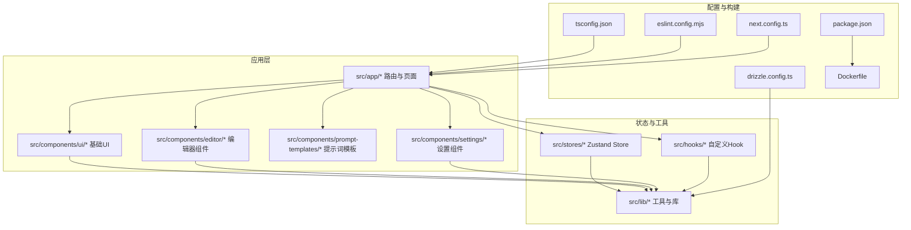
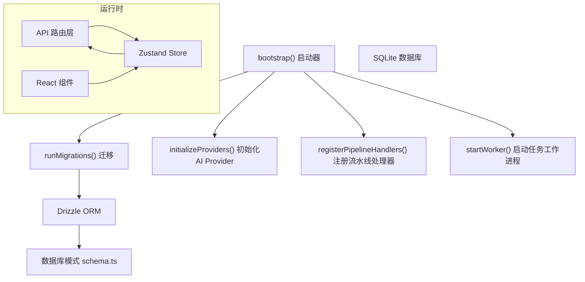
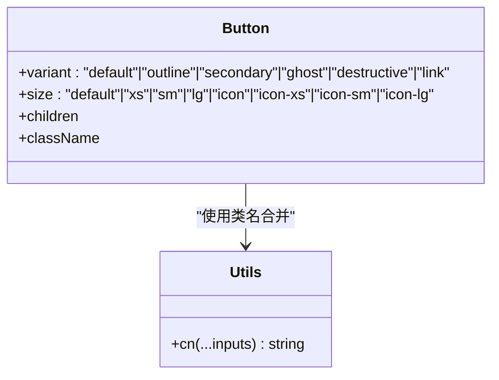
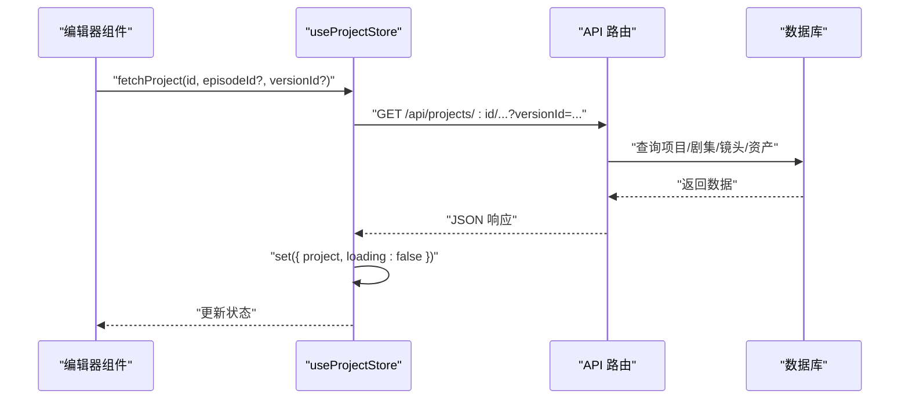
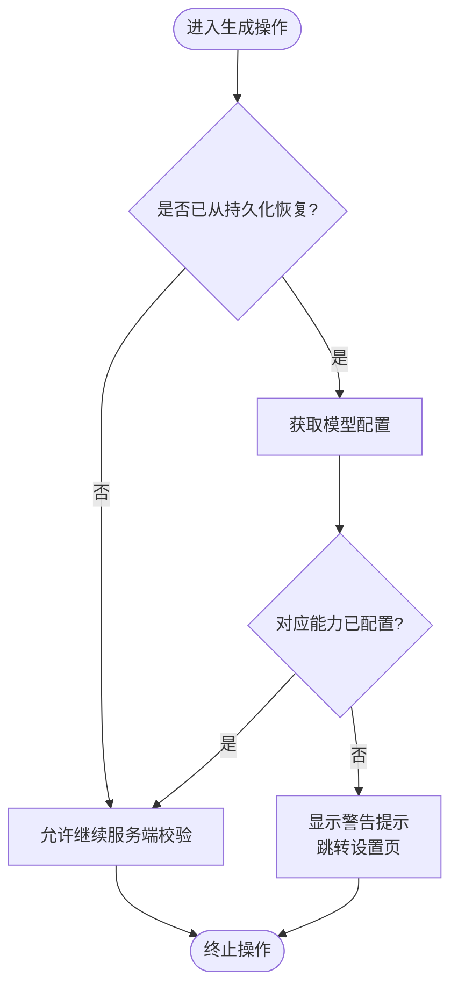
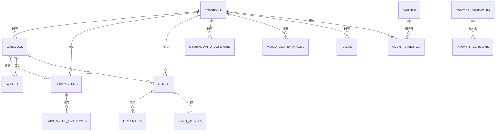
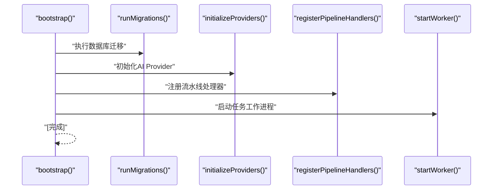
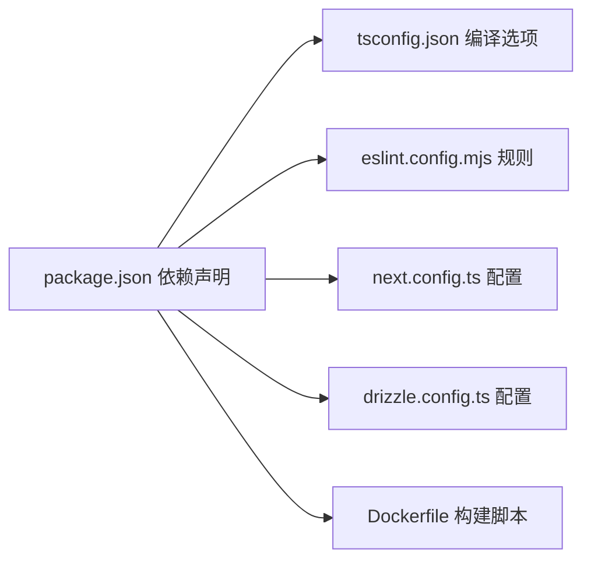

# 开发者指南

<cite>
**本文引用的文件**
- [package.json](file://package.json)
- [tsconfig.json](file://tsconfig.json)
- [eslint.config.mjs](file://eslint.config.mjs)
- [next.config.ts](file://next.config.ts)
- [drizzle.config.ts](file://drizzle.config.ts)
- [Dockerfile](file://Dockerfile)
- [src/app/layout.tsx](file://src/app/layout.tsx)
- [src/components/ui/button.tsx](file://src/components/ui/button.tsx)
- [src/lib/utils.ts](file://src/lib/utils.ts)
- [src/stores/project-store.ts](file://src/stores/project-store.ts)
- [src/hooks/use-model-guard.ts](file://src/hooks/use-model-guard.ts)
- [src/lib/db/schema.ts](file://src/lib/db/schema.ts)
- [src/lib/bootstrap.ts](file://src/lib/bootstrap.ts)
- [src/lib/api-fetch.ts](file://src/lib/api-fetch.ts)
- [.github/workflows/docker-publish.yml](file://.github/workflows/docker-publish.yml)
- [task_plan.md](file://task_plan.md)
- [docs/v0.2.0-release-article.md](file://docs/v0.2.0-release-article.md)
- [docs/wechat-v0.2.4-ucloud-seedance.md](file://docs/wechat-v0.2.4-ucloud-seedance.md)
- [messages/zh.json](file://messages/zh.json)
</cite>

## 目录
1. [简介](#简介)
2. [项目结构](#项目结构)
3. [核心组件](#核心组件)
4. [架构总览](#架构总览)
5. [详细组件分析](#详细组件分析)
6. [依赖关系分析](#依赖关系分析)
7. [性能考虑](#性能考虑)
8. [故障排查指南](#故障排查指南)
9. [结论](#结论)
10. [附录](#附录)

## 简介
本指南面向AIComicBuilder的开发者，提供从环境搭建到日常开发、测试与发布的完整流程说明。内容覆盖代码规范与约定、贡献指南、测试策略与调试技巧；详细说明TypeScript配置、ESLint规则与组件设计原则；记录开发工作流、代码评审标准与发布流程；包含调试工具使用、性能分析与内存泄漏检测方法；提供新功能开发模板与最佳实践，并涵盖团队协作工具与文档维护指南。

## 项目结构
项目采用Next.js应用结构，前端UI组件位于src/components与src/app目录，业务逻辑与数据层位于src/lib，状态管理基于zustand（src/stores），国际化通过next-intl插件集成，数据库使用Drizzle ORM与SQLite。

**图表来源**
- [src/app/layout.tsx:1-8](file://src/app/layout.tsx#L1-L8)
- [src/components/ui/button.tsx:1-58](file://src/components/ui/button.tsx#L1-L58)
- [src/lib/utils.ts:1-7](file://src/lib/utils.ts#L1-L7)
- [src/stores/project-store.ts:1-257](file://src/stores/project-store.ts#L1-L257)
- [src/hooks/use-model-guard.ts:1-51](file://src/hooks/use-model-guard.ts#L1-L51)
- [src/lib/db/schema.ts:1-424](file://src/lib/db/schema.ts#L1-L424)
- [tsconfig.json:1-35](file://tsconfig.json#L1-L35)
- [eslint.config.mjs:1-19](file://eslint.config.mjs#L1-L19)
- [next.config.ts:1-16](file://next.config.ts#L1-L16)
- [drizzle.config.ts:1-11](file://drizzle.config.ts#L1-L11)
- [package.json:1-60](file://package.json#L1-L60)
- [Dockerfile:1-41](file://Dockerfile#L1-L41)

**章节来源**
- [src/app/layout.tsx:1-8](file://src/app/layout.tsx#L1-L8)
- [src/components/ui/button.tsx:1-58](file://src/components/ui/button.tsx#L1-L58)
- [src/lib/utils.ts:1-7](file://src/lib/utils.ts#L1-L7)
- [src/stores/project-store.ts:1-257](file://src/stores/project-store.ts#L1-L257)
- [src/hooks/use-model-guard.ts:1-51](file://src/hooks/use-model-guard.ts#L1-L51)
- [src/lib/db/schema.ts:1-424](file://src/lib/db/schema.ts#L1-L424)
- [tsconfig.json:1-35](file://tsconfig.json#L1-L35)
- [eslint.config.mjs:1-19](file://eslint.config.mjs#L1-L19)
- [next.config.ts:1-16](file://next.config.ts#L1-L16)
- [drizzle.config.ts:1-11](file://drizzle.config.ts#L1-L11)
- [package.json:1-60](file://package.json#L1-L60)
- [Dockerfile:1-41](file://Dockerfile#L1-L41)

## 核心组件
- 组件体系：基础UI组件（如按钮）采用变体与尺寸系统，结合Tailwind合并工具实现一致的视觉与交互体验。
- 状态管理：项目使用Zustand管理全局状态，Store提供项目数据拉取、更新与版本切换等能力。
- 国际化：通过next-intl插件与多语言消息文件实现i18n支持。
- 数据层：Drizzle ORM + SQLite，统一建模与迁移管理；提供丰富的实体关系（项目、剧集、角色、镜头、资产、任务等）。
- 工具与安全：封装API请求与错误处理，提供用户指纹识别头注入；启动时执行数据库迁移、AI Provider初始化、流水线注册与任务队列工作进程启动。

**章节来源**
- [src/components/ui/button.tsx:1-58](file://src/components/ui/button.tsx#L1-L58)
- [src/lib/utils.ts:1-7](file://src/lib/utils.ts#L1-L7)
- [src/stores/project-store.ts:1-257](file://src/stores/project-store.ts#L1-L257)
- [src/lib/db/schema.ts:1-424](file://src/lib/db/schema.ts#L1-L424)
- [src/lib/bootstrap.ts:1-26](file://src/lib/bootstrap.ts#L1-L26)
- [src/lib/api-fetch.ts:1-25](file://src/lib/api-fetch.ts#L1-L25)

## 架构总览
下图展示应用启动、数据访问与任务处理的整体架构：

**图表来源**
- [src/lib/bootstrap.ts:1-26](file://src/lib/bootstrap.ts#L1-L26)
- [src/lib/db/schema.ts:1-424](file://src/lib/db/schema.ts#L1-L424)
- [drizzle.config.ts:1-11](file://drizzle.config.ts#L1-L11)

## 详细组件分析

### 组件设计与UI系统
- 变体与尺寸：按钮组件通过cva定义多种变体与尺寸，结合cn工具进行类名合并，确保一致的视觉与交互反馈。
- 设计原则：遵循语义化与可访问性，聚焦可见焦点、禁用态与图标尺寸一致性；通过CSS变量与主题系统保持风格统一。

**图表来源**
- [src/components/ui/button.tsx:1-58](file://src/components/ui/button.tsx#L1-L58)
- [src/lib/utils.ts:1-7](file://src/lib/utils.ts#L1-L7)

**章节来源**
- [src/components/ui/button.tsx:1-58](file://src/components/ui/button.tsx#L1-L58)
- [src/lib/utils.ts:1-7](file://src/lib/utils.ts#L1-L7)

### 状态管理与数据流
- Store职责：集中管理项目数据、加载状态、当前剧集与版本选择；提供异步拉取与本地更新方法。
- 数据访问辅助：提供安全读取与历史版本查询函数，保证在乐观更新与部分数据场景下的健壮性。
- API集成：通过封装的apiFetch自动注入用户标识，统一错误处理。

**图表来源**
- [src/stores/project-store.ts:219-239](file://src/stores/project-store.ts#L219-L239)
- [src/lib/api-fetch.ts:10-24](file://src/lib/api-fetch.ts#L10-L24)

**章节来源**
- [src/stores/project-store.ts:1-257](file://src/stores/project-store.ts#L1-L257)
- [src/lib/api-fetch.ts:1-25](file://src/lib/api-fetch.ts#L1-L25)

### 模型守卫与权限控制
- 守卫机制：在AI生成入口调用守卫函数，若模型未配置则弹出提示并引导至设置页。
- 国际化提示：根据能力类型映射不同提示文案，提升用户体验。

**图表来源**
- [src/hooks/use-model-guard.ts:22-49](file://src/hooks/use-model-guard.ts#L22-L49)

**章节来源**
- [src/hooks/use-model-guard.ts:1-51](file://src/hooks/use-model-guard.ts#L1-L51)

### 数据库模式与实体关系
- 实体覆盖：项目、剧集、角色、场景、镜头、资产、对话、导入日志、提示词模板/版本/预设、角色关系、角色服装、情绪曲线、任务、代理与绑定等。
- 关系设计：外键约束与级联删除保障数据一致性；资产表统一承载图像与视频产物，区分生成模式与版本控制。

**图表来源**
- [src/lib/db/schema.ts:1-424](file://src/lib/db/schema.ts#L1-L424)

**章节来源**
- [src/lib/db/schema.ts:1-424](file://src/lib/db/schema.ts#L1-L424)

### 启动流程与运行时
- 启动顺序：迁移 -> AI Provider初始化 -> 流水线处理器注册 -> 任务工作进程启动。
- 构建与部署：Next.js输出standalone，Docker镜像内含FFmpeg与字体，生产环境变量默认值明确。

**图表来源**
- [src/lib/bootstrap.ts:8-25](file://src/lib/bootstrap.ts#L8-L25)

**章节来源**
- [src/lib/bootstrap.ts:1-26](file://src/lib/bootstrap.ts#L1-L26)
- [next.config.ts:7-13](file://next.config.ts#L7-L13)
- [Dockerfile:25-40](file://Dockerfile#L25-L40)

## 依赖关系分析
- 构建与运行：Next.js 16、TypeScript 5、Tailwind CSS v4、shadcn组件体系。
- 数据库：Drizzle ORM + better-sqlite3，配合drizzle-kit进行迁移管理。
- AI与多媒体：ai SDK、OpenAI、Google GenAI、ffmpeg等。
- 国际化：next-intl，配套i18n插件与消息文件。
- 包管理：pnpm，针对原生依赖的特殊配置。

**图表来源**
- [package.json:11-59](file://package.json#L11-L59)
- [tsconfig.json:2-24](file://tsconfig.json#L2-L24)
- [eslint.config.mjs:1-19](file://eslint.config.mjs#L1-L19)
- [next.config.ts:1-16](file://next.config.ts#L1-L16)
- [drizzle.config.ts:1-11](file://drizzle.config.ts#L1-L11)
- [Dockerfile:1-41](file://Dockerfile#L1-L41)

**章节来源**
- [package.json:1-60](file://package.json#L1-L60)
- [tsconfig.json:1-35](file://tsconfig.json#L1-L35)
- [eslint.config.mjs:1-19](file://eslint.config.mjs#L1-L19)
- [next.config.ts:1-16](file://next.config.ts#L1-L16)
- [drizzle.config.ts:1-11](file://drizzle.config.ts#L1-L11)
- [Dockerfile:1-41](file://Dockerfile#L1-L41)

## 性能考虑
- 构建优化：启用增量编译与隔离模块，严格模式减少运行时错误；Turbopack根路径配置便于开发加速。
- 样式与类名：使用Tailwind合并工具避免重复样式与类名冲突，降低渲染成本。
- 状态粒度：Store采用选择器模式避免无关重渲染；对大型列表与复杂对象进行局部更新。
- 多媒体处理：容器内预装FFmpeg与字体，减少运行时安装开销；按需生成与缓存产物。
- 数据访问：统一通过封装的apiFetch注入用户标识，减少重复头部设置；对失败响应进行降级处理。

**章节来源**
- [tsconfig.json:7-15](file://tsconfig.json#L7-L15)
- [src/lib/utils.ts:4-6](file://src/lib/utils.ts#L4-L6)
- [src/hooks/use-model-guard.ts:26-27](file://src/hooks/use-model-guard.ts#L26-L27)
- [src/lib/api-fetch.ts:10-24](file://src/lib/api-fetch.ts#L10-L24)
- [Dockerfile:6-7](file://Dockerfile#L6-L7)

## 故障排查指南
- API错误处理：封装ApiError并在非OK响应时抛出，优先解析后端错误消息，便于定位问题。
- 用户标识：确保apiFetch正确注入x-user-id，避免鉴权或数据归属问题。
- 启动异常：检查bootstrap各步骤日志输出，确认数据库迁移、AI Provider初始化与任务工作进程均已成功启动。
- 国际化：核对next-intl插件与消息文件路径，确保翻译键与界面一致。
- Docker构建：确认FFmpeg与字体依赖已安装，环境变量（DATABASE_URL、UPLOAD_DIR等）已正确设置。

**章节来源**
- [src/lib/api-fetch.ts:3-24](file://src/lib/api-fetch.ts#L3-L24)
- [src/lib/bootstrap.ts:12-24](file://src/lib/bootstrap.ts#L12-L24)
- [next.config.ts:5](file://next.config.ts#L5)
- [messages/zh.json](file://messages/zh.json)

## 结论
本指南提供了从环境到部署的全链路开发指引，强调了TypeScript与ESLint的强约束、组件设计的一致性、状态管理的清晰边界以及数据库模式的完整性。建议在日常开发中严格遵循规范与流程，持续完善测试与文档，确保系统的稳定性与可扩展性。

## 附录

### 代码规范与约定
- TypeScript
  - 严格模式开启，禁止隐式any；显式类型注解与联合/交叉类型使用。
  - 路径别名@/*指向src，统一导入路径。
  - 禁止输出JS，使用ESNext模块与bundler解析。
- ESLint
  - 基于eslint-config-next的core-web-vitals与typescript规则，自定义忽略项覆盖默认忽略。
- 组件设计
  - 使用cva定义变体与尺寸，统一类名合并与焦点可见性。
  - 小而专一的组件职责，必要时拆分子组件。
- 状态管理
  - Store仅存放必要状态，避免跨域耦合；使用选择器避免不必要重渲染。
- 数据访问
  - 所有API请求通过封装的apiFetch，统一注入用户标识与错误处理。
- 国际化
  - 使用next-intl插件与消息文件，确保文案键一致与可维护性。

**章节来源**
- [tsconfig.json:2-24](file://tsconfig.json#L2-L24)
- [eslint.config.mjs:5-16](file://eslint.config.mjs#L5-L16)
- [src/components/ui/button.tsx:7-40](file://src/components/ui/button.tsx#L7-L40)
- [src/lib/utils.ts:4-6](file://src/lib/utils.ts#L4-L6)
- [src/stores/project-store.ts:219-239](file://src/stores/project-store.ts#L219-L239)
- [src/lib/api-fetch.ts:10-24](file://src/lib/api-fetch.ts#L10-L24)
- [next.config.ts:5](file://next.config.ts#L5)

### 贡献指南
- 分支策略：主分支保护，功能开发在特性分支，修复hotfix分支。
- 提交规范：遵循约定式提交，简明描述变更类型与范围。
- 代码评审：至少一名维护者评审，关注可读性、性能与安全性。
- 测试要求：新增功能需配套单元/集成测试，覆盖率目标逐步提升。
- 文档同步：变更涉及用户行为或API时，同步更新README与内部文档。

### 测试策略与调试技巧
- 单元测试：针对Store选择器、工具函数与纯计算逻辑编写测试。
- 集成测试：模拟API响应与数据库状态，验证端到端流程。
- 调试工具：浏览器开发者工具断点、React DevTools、Redux DevTools（如适用）、网络面板与性能面板。
- 日志与追踪：在关键路径添加结构化日志，便于定位问题。
- 内存泄漏检测：使用浏览器内存快照对比长时运行前后差异，排查未释放的事件监听与定时器。

### 开发工作流
- 新功能开发模板
  1) 设计：确定组件/Store/API需求，绘制数据流草图。
  2) 路由与页面：在src/app下创建路由与页面骨架。
  3) 组件：在src/components中实现UI与交互。
  4) 状态：在src/stores中新增或修改Store。
  5) 数据：在src/lib/db中补充Schema与DAO；在src/app/api中实现路由。
  6) 国际化：在messages中新增翻译键。
  7) 测试：补充单元/集成测试。
  8) 文档：更新相关文档与README片段。
  9) 提交与评审：遵循提交规范，发起PR并等待评审。
- 代码评审标准
  - 正确性：逻辑正确、边界条件覆盖、错误处理完备。
  - 可维护性：命名清晰、注释充分、模块化良好。
  - 性能：避免不必要的重渲染与重复计算。
  - 安全性：输入校验、鉴权与敏感信息处理。
- 发布流程
  - 本地构建与测试：pnpm build与静态检查。
  - Docker镜像：基于Dockerfile构建，确保FFmpeg与字体可用。
  - CI/CD：GitHub Actions触发镜像发布，制品推送至仓库。
  - 部署：在目标环境设置DATABASE_URL与UPLOAD_DIR，启动容器。

**章节来源**
- [.github/workflows/docker-publish.yml](file://.github/workflows/docker-publish.yml)
- [Dockerfile:1-41](file://Dockerfile#L1-L41)
- [task_plan.md](file://task_plan.md)
- [docs/v0.2.0-release-article.md](file://docs/v0.2.0-release-article.md)
- [docs/wechat-v0.2.4-ucloud-seedance.md](file://docs/wechat-v0.2.4-ucloud-seedance.md)

### 团队协作工具与文档维护
- 版本与发布：参考发布文章与微信公告，统一对外口径。
- 文档维护：Markdown文档集中于docs目录，遵循统一标题层级与引用格式；重要变更在发布文章中同步说明。
- 消息与国际化：messages目录按语言维护，确保文案一致性与可翻译性。

**章节来源**
- [docs/v0.2.0-release-article.md](file://docs/v0.2.0-release-article.md)
- [docs/wechat-v0.2.4-ucloud-seedance.md](file://docs/wechat-v0.2.4-ucloud-seedance.md)
- [messages/zh.json](file://messages/zh.json)