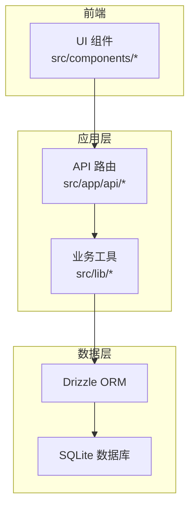
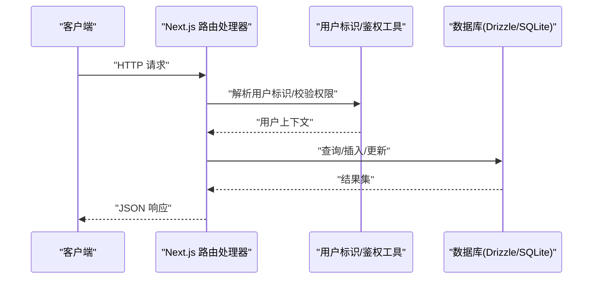
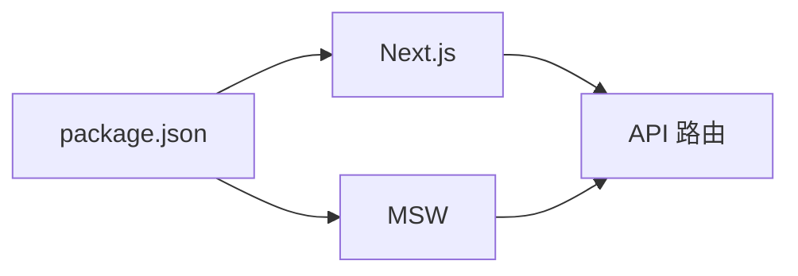

# 测试策略

<cite>
**本文引用的文件**
- [package.json](file://package.json)
- [pnpm-lock.yaml](file://pnpm-lock.yaml)
- [src/lib/db/index.ts](file://src/lib/db/index.ts)
- [src/app/api/projects/route.ts](file://src/app/api/projects/route.ts)
- [src/app/api/agents/route.ts](file://src/app/api/agents/route.ts)
- [src/app/api/agents/[id]/route.ts](file://src/app/api/agents/[id]/route.ts)
- [src/app/api/uploads/[...path]/route.ts](file://src/app/api/uploads/[...path]/route.ts)
- [src/lib/assert-project-ownership.ts](file://src/lib/assert-project-ownership.ts)
- [src/lib/api-fetch.ts](file://src/lib/api-fetch.ts)
- [src/components/ui/select.tsx](file://src/components/ui/select.tsx)
- [src/components/editor/version-compare.tsx](file://src/components/editor/version-compare.tsx)
- [.github/workflows/docker-publish.yml](file://.github/workflows/docker-publish.yml)
</cite>

## 目录
1. [引言](#引言)
2. [项目结构](#项目结构)
3. [核心组件](#核心组件)
4. [架构总览](#架构总览)
5. [详细组件分析](#详细组件分析)
6. [依赖分析](#依赖分析)
7. [性能考虑](#性能考虑)
8. [故障排查指南](#故障排查指南)
9. [结论](#结论)
10. [附录](#附录)

## 引言
本测试策略文档面向 AIComicBuilder 项目，旨在建立覆盖单元测试、集成测试与端到端测试的完整测试体系。文档明确测试框架与工具选型、测试数据管理、Mock 策略、覆盖率目标、数据库测试最佳实践、API 测试要点、以及在 CI/CD 中的执行流程建议，并补充性能、安全与兼容性测试方案。

## 项目结构
AIComicBuilder 基于 Next.js 应用，采用 App Router 路由组织页面与 API。后端逻辑集中在 src/app/api 下的路由处理器中；数据访问通过 Drizzle ORM 连接 SQLite；前端组件位于 src/components；业务工具与库位于 src/lib。

图表来源
- [src/app/api/projects/route.ts:1-34](file://src/app/api/projects/route.ts#L1-L34)
- [src/lib/db/index.ts:46-186](file://src/lib/db/index.ts#L46-L186)

章节来源
- [src/app/api/projects/route.ts:1-34](file://src/app/api/projects/route.ts#L1-L34)
- [src/lib/db/index.ts:46-186](file://src/lib/db/index.ts#L46-L186)

## 核心组件
- API 路由：负责请求解析、鉴权断言、调用业务工具与数据库操作，返回标准化响应。
- 数据库层：通过 Drizzle ORM 访问 SQLite，提供迁移、表存在性检查、基线迁移等能力。
- 前端组件：包含 UI 组件与编辑器组件，用于用户交互与内容展示。
- 工具模块：如用户标识注入、API 请求封装、权限断言等。

章节来源
- [src/app/api/projects/route.ts:1-34](file://src/app/api/projects/route.ts#L1-L34)
- [src/lib/db/index.ts:46-186](file://src/lib/db/index.ts#L46-L186)
- [src/lib/assert-project-ownership.ts:1-21](file://src/lib/assert-project-ownership.ts#L1-L21)
- [src/lib/api-fetch.ts:1-24](file://src/lib/api-fetch.ts#L1-L24)
- [src/components/ui/select.tsx:1-44](file://src/components/ui/select.tsx#L1-L44)
- [src/components/editor/version-compare.tsx:51-84](file://src/components/editor/version-compare.tsx#L51-L84)

## 架构总览
下图展示了从浏览器到数据库的典型请求链路，包括鉴权、路由处理、数据库访问与响应返回。

图表来源
- [src/app/api/projects/route.ts:1-34](file://src/app/api/projects/route.ts#L1-L34)
- [src/lib/assert-project-ownership.ts:1-21](file://src/lib/assert-project-ownership.ts#L1-L21)
- [src/lib/db/index.ts:46-186](file://src/lib/db/index.ts#L46-L186)

## 详细组件分析

### 单元测试策略
- 目标：验证函数级行为、边界条件、错误分支与纯函数逻辑。
- 覆盖范围：
  - 工具函数：如用户标识、API 请求封装、权限断言等。
  - 数据库辅助：表/列存在性判断、迁移基线逻辑等。
  - 组件内部逻辑：如版本对比组件的选择逻辑。
- Mock 策略：
  - 使用轻量 Mock（如 jest.fn 或原生代理）模拟外部依赖（如数据库连接、网络请求）。
  - 对 Drizzle 操作进行最小化替身，确保仅断言调用序列与参数。
- 复杂度与性能：
  - 单元测试应快速、可重复，避免真实 IO。
- 覆盖率要求：
  - 关键路径与分支覆盖率不低于 80%，核心工具不低于 90%。

章节来源
- [src/lib/api-fetch.ts:1-24](file://src/lib/api-fetch.ts#L1-L24)
- [src/lib/assert-project-ownership.ts:1-21](file://src/lib/assert-project-ownership.ts#L1-L21)
- [src/lib/db/index.ts:57-133](file://src/lib/db/index.ts#L57-L133)
- [src/components/editor/version-compare.tsx:51-84](file://src/components/editor/version-compare.tsx#L51-L84)

### 集成测试策略
- 目标：验证模块间协作、API 路由与数据库交互、中间件与鉴权链路。
- 覆盖范围：
  - API 路由：GET/POST/DELETE 等方法对 agents、projects、uploads 等资源的端点。
  - 权限断言：assert-project-ownership 在路由中的正确调用。
  - 数据库迁移与基线：runMigrations 的执行与 __drizzle_migrations 表一致性。
- Mock 策略：
  - 使用内存数据库或临时 SQLite 文件，配合 Drizzle migrator 执行迁移。
  - 使用测试服务器启动 Next.js 路由，避免真实生产环境依赖。
- 覆盖率要求：
  - 接口契约与关键业务流程覆盖率不低于 85%。

章节来源
- [src/app/api/agents/route.ts:1-54](file://src/app/api/agents/route.ts#L1-L54)
- [src/app/api/agents/[id]/route.ts](file://src/app/api/agents/[id]/route.ts#L46-L64)
- [src/app/api/projects/route.ts:1-34](file://src/app/api/projects/route.ts#L1-L34)
- [src/app/api/uploads/[...path]/route.ts](file://src/app/api/uploads/[...path]/route.ts#L1-L41)
- [src/lib/assert-project-ownership.ts:1-21](file://src/lib/assert-project-ownership.ts#L1-L21)
- [src/lib/db/index.ts:156-172](file://src/lib/db/index.ts#L156-L172)

### 端到端测试策略
- 目标：验证真实用户场景下的完整工作流（如创建项目、上传素材、生成脚本与分镜）。
- 覆盖范围：
  - 用户登录态与路由导航。
  - 文件上传与访问控制（防止目录穿越）。
  - 代理与模型绑定的配置与持久化。
- 工具建议：
  - 使用 Playwright 或 Cypress 进行跨浏览器验证。
  - 使用 MSW 在测试环境中拦截与伪造 API 响应。
- 覆盖率要求：
  - 关键用户旅程覆盖率不低于 80%。

章节来源
- [src/app/api/uploads/[...path]/route.ts](file://src/app/api/uploads/[...path]/route.ts#L1-L41)
- [src/app/api/agents/route.ts:1-54](file://src/app/api/agents/route.ts#L1-L54)
- [pnpm-lock.yaml:3350-3359](file://pnpm-lock.yaml#L3350-L3359)

### API 测试最佳实践
- 路由职责清晰：每个路由只处理单一资源的 CRUD 操作。
- 鉴权与校验：统一从请求中提取用户标识，必要时断言资源归属。
- 错误处理：对缺失字段、非法分类、未找到等场景返回明确状态码与错误信息。
- 内容类型与安全：对上传文件进行 MIME 类型映射与目录穿越防护。

章节来源
- [src/app/api/agents/route.ts:17-54](file://src/app/api/agents/route.ts#L17-L54)
- [src/app/api/projects/route.ts:8-34](file://src/app/api/projects/route.ts#L8-L34)
- [src/app/api/uploads/[...path]/route.ts](file://src/app/api/uploads/[...path]/route.ts#L16-L41)
- [src/lib/assert-project-ownership.ts:10-21](file://src/lib/assert-project-ownership.ts#L10-L21)

### 数据库测试最佳实践
- 迁移与基线：在测试前执行迁移，或对现有 schema 进行基线记录以保证一致性。
- 事务与隔离：使用事务包裹测试用例，失败回滚，避免污染共享数据库。
- 结果断言：针对表存在性、列存在性、迁移历史表条目数进行断言。
- 性能：避免在测试中执行大量数据写入，必要时使用内存数据库或临时文件。

章节来源
- [src/lib/db/index.ts:81-172](file://src/lib/db/index.ts#L81-L172)

### 组件测试最佳实践
- UI 组件：对受控组件（如 Select）的状态变化与渲染结果进行断言。
- 编辑器组件：对版本选择、比较逻辑进行输入输出验证。
- 可访问性：结合 axe-core 进行基础可访问性扫描。

章节来源
- [src/components/ui/select.tsx:1-44](file://src/components/ui/select.tsx#L1-L44)
- [src/components/editor/version-compare.tsx:51-84](file://src/components/editor/version-compare.tsx#L51-L84)

### Mock 策略
- 网络层：使用 MSW 拦截 fetch，按路由定义返回固定响应或动态生成。
- 数据库层：使用 Drizzle 提供的测试连接或内存数据库，替换全局 db 实例。
- 文件系统：对上传目录进行沙箱化，限制读写范围，防止真实文件系统污染。

章节来源
- [pnpm-lock.yaml:3350-3359](file://pnpm-lock.yaml#L3350-L3359)
- [src/lib/db/index.ts:46-55](file://src/lib/db/index.ts#L46-L55)

### 测试数据管理
- 固定种子：为关键测试提供稳定的数据种子，便于复现。
- 清理策略：测试结束后清理临时数据与文件，保持环境干净。
- 安全性：避免在测试数据中使用真实密钥或敏感信息。

### CI/CD 中的测试执行流程
- 触发条件：在 PR 与主干推送时自动运行单元与集成测试。
- 步骤建议：
  - 安装依赖与构建。
  - 启动内存数据库或临时 SQLite。
  - 执行单元测试与集成测试，收集覆盖率报告。
  - 可选：运行端到端测试（在专用作业中）。
  - 上传覆盖率与测试日志。
- Docker 发布工作流可作为参考模板，结合测试步骤扩展。

章节来源
- [.github/workflows/docker-publish.yml](file://.github/workflows/docker-publish.yml)

## 依赖分析
- 测试相关依赖：
  - MSW：用于服务端请求拦截与伪造。
  - Next.js：提供路由与运行时环境，便于集成测试。
- 间接影响：Playwright 等端测工具在 peerDependencies 中声明，可在 CI 中按需启用。

图表来源
- [package.json](file://package.json)
- [pnpm-lock.yaml:3402-3421](file://pnpm-lock.yaml#L3402-L3421)
- [pnpm-lock.yaml:3350-3359](file://pnpm-lock.yaml#L3350-L3359)

章节来源
- [package.json](file://package.json)
- [pnpm-lock.yaml:3402-3421](file://pnpm-lock.yaml#L3402-L3421)
- [pnpm-lock.yaml:3350-3359](file://pnpm-lock.yaml#L3350-L3359)

## 性能考虑
- 单元测试：避免任何真实 IO，使用 Mock 与替身。
- 集成测试：使用内存数据库或临时文件，减少磁盘 IO。
- 端到端测试：控制并发与重试次数，优先在无头模式下运行。
- 覆盖率：关注热点路径与慢速路径，识别潜在瓶颈。

## 故障排查指南
- API 返回 403/404：检查上传路由的目录穿越防护与路径解析逻辑。
- 权限错误：确认用户标识是否正确注入，断言资源归属是否生效。
- 数据库异常：检查迁移是否成功执行，__drizzle_migrations 是否存在且一致。
- 端到端失败：核对 MSW 拦截规则与响应体结构，确保与路由期望一致。

章节来源
- [src/app/api/uploads/[...path]/route.ts](file://src/app/api/uploads/[...path]/route.ts#L23-L32)
- [src/lib/assert-project-ownership.ts:10-21](file://src/lib/assert-project-ownership.ts#L10-L21)
- [src/lib/db/index.ts:156-172](file://src/lib/db/index.ts#L156-L172)

## 结论
通过分层测试策略与严格的 Mock、数据与 CI 流程规范，AIComicBuilder 可在开发早期发现缺陷、保障 API 与数据库交互的稳定性，并提升整体交付质量。建议持续迭代测试覆盖面与执行效率，结合性能与安全指标优化测试策略。

## 附录
- 覆盖率目标建议：
  - 单元测试：关键路径与分支 ≥ 80%，工具模块 ≥ 90%。
  - 集成测试：接口契约与核心流程 ≥ 85%。
  - 端到端测试：关键用户旅程 ≥ 80%。
- 安全测试：对上传路由进行目录穿越与恶意文件检测；对鉴权头进行冒用测试。
- 兼容性测试：在主流浏览器与 Node.js 版本上验证端到端流程。