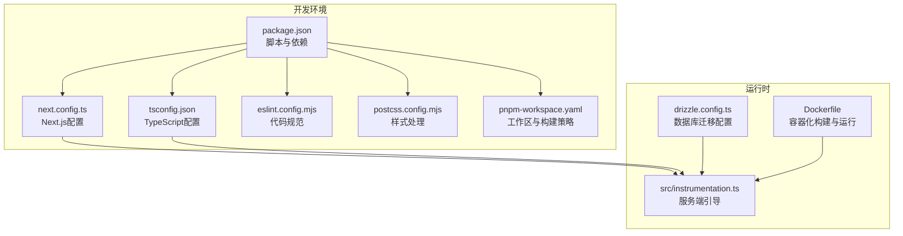
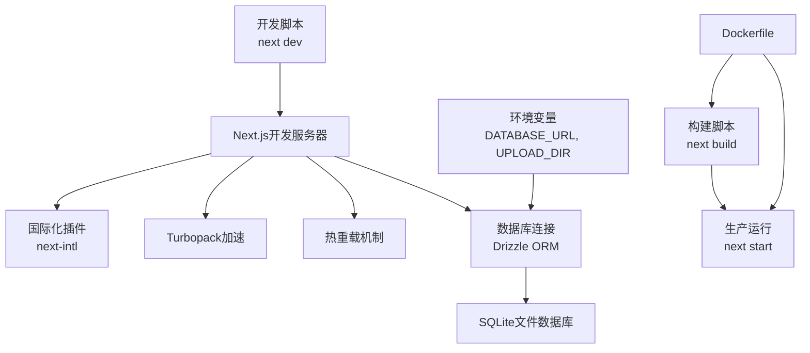
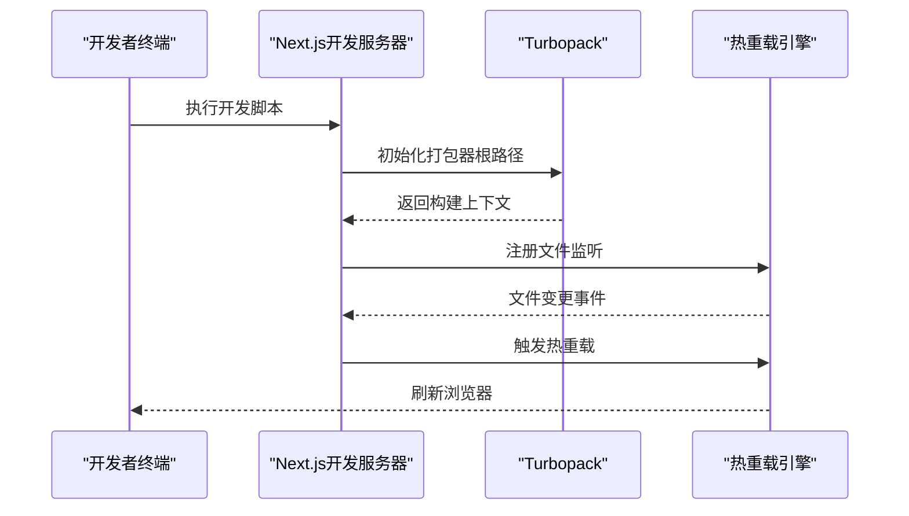
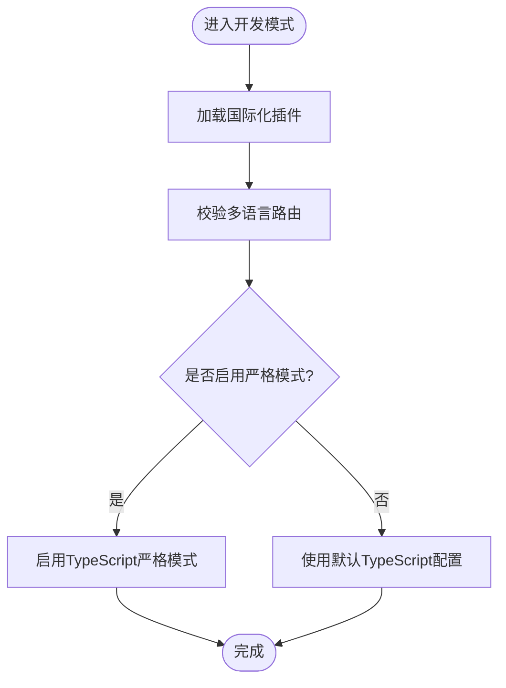
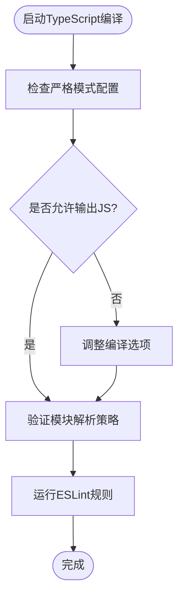
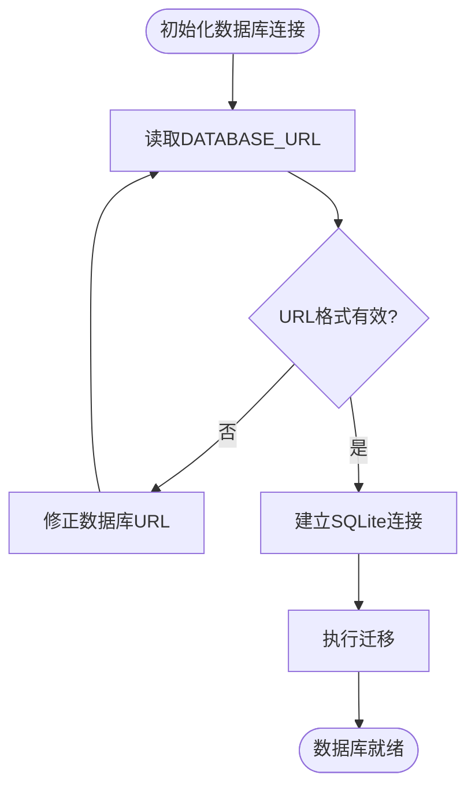
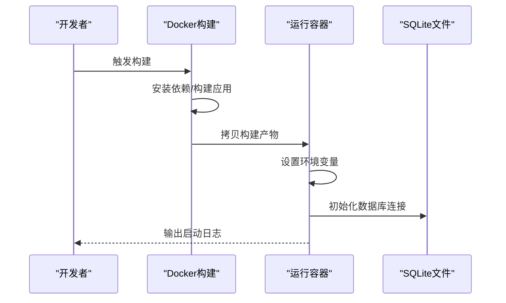
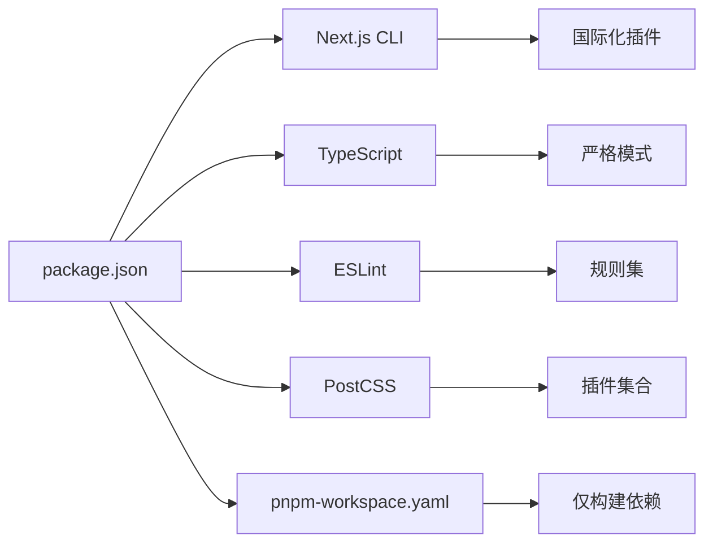

# 调试与开发工具

<cite>
**本文档引用的文件**
- [next.config.ts](file://next.config.ts)
- [package.json](file://package.json)
- [tsconfig.json](file://tsconfig.json)
- [Dockerfile](file://Dockerfile)
- [drizzle.config.ts](file://drizzle.config.ts)
- [eslint.config.mjs](file://eslint.config.mjs)
- [postcss.config.mjs](file://postcss.config.mjs)
- [pnpm-workspace.yaml](file://pnpm-workspace.yaml)
- [instrumentation.ts](file://src/instrumentation.ts)
</cite>

## 目录
1. [简介](#简介)
2. [项目结构](#项目结构)
3. [核心组件](#核心组件)
4. [架构概览](#架构概览)
5. [详细组件分析](#详细组件分析)
6. [依赖分析](#依赖分析)
7. [性能考虑](#性能考虑)
8. [故障排除指南](#故障排除指南)
9. [结论](#结论)
10. [附录](#附录)

## 简介
本文件面向AIComicBuilder项目的调试与开发团队，系统性梳理Next.js开发服务器配置、热重载机制、调试模式设置，以及浏览器开发者工具、Node.js调试器、TypeScript编译问题排查、数据库连接调试等关键主题。同时提供性能分析、内存泄漏检测、网络请求监控、Docker容器调试、日志分析与错误追踪的实践方案，帮助开发者快速定位问题并提升开发效率。

## 项目结构
AIComicBuilder采用Next.js应用框架，结合Drizzle ORM进行SQLite数据库管理，并通过Docker进行容器化部署。开发脚本、构建配置与类型检查规则集中于根目录配置文件中，便于统一管理和调试。

**图表来源**
- [package.json:1-60](file://package.json#L1-L60)
- [next.config.ts:1-16](file://next.config.ts#L1-L16)
- [tsconfig.json:1-35](file://tsconfig.json#L1-L35)
- [eslint.config.mjs:1-19](file://eslint.config.mjs#L1-L19)
- [postcss.config.mjs:1-8](file://postcss.config.mjs#L1-L8)
- [pnpm-workspace.yaml:1-12](file://pnpm-workspace.yaml#L1-L12)
- [drizzle.config.ts:1-11](file://drizzle.config.ts#L1-L11)
- [instrumentation.ts:1-8](file://src/instrumentation.ts#L1-L8)
- [Dockerfile:1-41](file://Dockerfile#L1-L41)

**章节来源**
- [package.json:1-60](file://package.json#L1-L60)
- [next.config.ts:1-16](file://next.config.ts#L1-L16)
- [tsconfig.json:1-35](file://tsconfig.json#L1-L35)
- [eslint.config.mjs:1-19](file://eslint.config.mjs#L1-L19)
- [postcss.config.mjs:1-8](file://postcss.config.mjs#L1-L8)
- [pnpm-workspace.yaml:1-12](file://pnpm-workspace.yaml#L1-L12)
- [drizzle.config.ts:1-11](file://drizzle.config.ts#L1-L11)
- [instrumentation.ts:1-8](file://src/instrumentation.ts#L1-L8)
- [Dockerfile:1-41](file://Dockerfile#L1-L41)

## 核心组件
- 开发服务器与热重载：通过开发脚本启动Next.js开发服务器，支持热重载与TypeScript增量编译。
- 国际化插件：集成国际化插件以支持多语言路由与本地化资源加载。
- Turbopack加速：启用Turbopack作为打包器根路径，提升开发体验。
- 服务器外部包：配置SQLite驱动为外部包，避免在构建阶段编译原生模块。
- 数据库配置：Drizzle配置指向SQLite数据库URL，支持迁移与Schema定义。
- 容器化运行：Dockerfile定义多阶段构建流程，生产环境暴露3000端口并设置默认数据库路径。

**章节来源**
- [package.json:5-10](file://package.json#L5-L10)
- [next.config.ts:5-15](file://next.config.ts#L5-L15)
- [drizzle.config.ts:3-10](file://drizzle.config.ts#L3-L10)
- [Dockerfile:25-40](file://Dockerfile#L25-L40)

## 架构概览
下图展示从开发到生产的整体流程，包括开发服务器、国际化、数据库与容器化运行的关键节点。

**图表来源**
- [package.json:5-8](file://package.json#L5-L8)
- [next.config.ts:5-15](file://next.config.ts#L5-L15)
- [drizzle.config.ts:7-9](file://drizzle.config.ts#L7-L9)
- [Dockerfile:25-40](file://Dockerfile#L25-L40)

**章节来源**
- [package.json:5-8](file://package.json#L5-L8)
- [next.config.ts:5-15](file://next.config.ts#L5-L15)
- [drizzle.config.ts:7-9](file://drizzle.config.ts#L7-L9)
- [Dockerfile:25-40](file://Dockerfile#L25-L40)

## 详细组件分析

### Next.js开发服务器与热重载
- 启动命令：开发脚本直接调用Next.js开发服务器，支持实时刷新与错误提示。
- 热重载机制：基于文件变更触发模块重新加载，保持状态与路由不变。
- Turbopack加速：设置打包器根路径，减少冷启动时间，提升迭代速度。
- 外部包配置：将原生模块依赖标记为外部包，避免构建失败或编译耗时。

**图表来源**
- [package.json:6](file://package.json#L6)
- [next.config.ts:10-12](file://next.config.ts#L10-L12)

**章节来源**
- [package.json:6](file://package.json#L6)
- [next.config.ts:10-12](file://next.config.ts#L10-L12)

### 调试模式设置与国际化
- 调试模式：开发脚本默认启用调试输出；如需更严格模式可调整TypeScript严格选项。
- 国际化：插件配置指向本地化请求处理器，确保路由与资源按语言正确加载。
- 路由与本地化：结合多语言路由约定，验证页面与资源加载路径。

**图表来源**
- [next.config.ts:5](file://next.config.ts#L5)
- [tsconfig.json:7-8](file://tsconfig.json#L7-L8)

**章节来源**
- [next.config.ts:5](file://next.config.ts#L5)
- [tsconfig.json:7-8](file://tsconfig.json#L7-L8)

### 浏览器开发者工具使用技巧
- Elements面板：检查动态UI元素与类名变化，配合热重载观察组件渲染差异。
- Network面板：监控API请求、静态资源与国际化资源加载，识别慢请求与重复加载。
- Performance面板：录制交互过程，分析主线程占用与重排重绘热点。
- Memory面板：定期快照对比，定位未释放对象与闭包泄漏。
- Redux DevTools（如使用）：检查状态树变更、动作序列与异步流程。

[本节为通用工具说明，不直接分析具体源码文件]

### React DevTools与Redux DevTools配置
- React DevTools：安装浏览器扩展后，在开发环境下自动连接，查看组件树、Props与状态。
- Redux DevTools：若项目使用状态管理库，可在开发工具中查看动作与状态历史，辅助调试异步逻辑。

[本节为通用工具说明，不直接分析具体源码文件]

### Node.js调试器
- 远程调试：在开发脚本中添加调试参数，使用VS Code或Chrome DevTools附加进程。
- 断点设置：在服务端引导入口与API路由中设置断点，逐步执行并检查上下文。
- 环境变量：通过环境变量控制日志级别与功能开关，便于隔离问题场景。

**章节来源**
- [instrumentation.ts:1-8](file://src/instrumentation.ts#L1-L8)

### TypeScript编译问题排查
- 编译选项：严格模式、增量编译与模块解析策略影响编译性能与错误提示。
- 类型检查：结合ESLint规则，确保类型安全与代码质量。
- 增量构建：利用增量编译减少全量检查时间，提升迭代效率。

**图表来源**
- [tsconfig.json:7-13](file://tsconfig.json#L7-L13)
- [eslint.config.mjs:1-19](file://eslint.config.mjs#L1-L19)

**章节来源**
- [tsconfig.json:7-13](file://tsconfig.json#L7-L13)
- [eslint.config.mjs:1-19](file://eslint.config.mjs#L1-L19)

### 数据库连接调试方法
- 配置项：数据库URL来自环境变量，支持本地文件数据库与自定义路径。
- Schema与迁移：Drizzle配置指向Schema文件，迁移输出目录与方言固定为SQLite。
- 连接测试：在开发环境中打印连接信息与查询结果，确认权限与路径正确。

**图表来源**
- [drizzle.config.ts:7-10](file://drizzle.config.ts#L7-L10)
- [Dockerfile:37-38](file://Dockerfile#L37-L38)

**章节来源**
- [drizzle.config.ts:7-10](file://drizzle.config.ts#L7-L10)
- [Dockerfile:37-38](file://Dockerfile#L37-L38)

### 性能分析工具与内存泄漏检测
- Performance面板：录制用户交互，分析长任务与帧时间，定位渲染瓶颈。
- Memory面板：使用堆快照对比，识别未释放对象与循环引用。
- Network面板：分析资源加载顺序与缓存命中率，优化静态资源与API响应。
- 服务端性能：在服务端引导中加入性能计数器，记录关键路径耗时。

[本节为通用工具说明，不直接分析具体源码文件]

### 网络请求监控方案
- API路由：通过Next.js API路由统一处理请求与响应，便于拦截与记录。
- 中间件：在请求进入时记录URL、方法与头信息，异常时输出错误上下文。
- 缓存策略：合理设置缓存头与ETag，减少重复请求。

[本节为通用工具说明，不直接分析具体源码文件]

### Docker容器调试
- 多阶段构建：分离依赖安装、构建与运行阶段，便于定位构建问题。
- 环境变量：生产环境设置端口、主机地址与数据库路径，确保容器内可访问。
- 日志输出：在容器标准输出中记录启动信息与错误栈，便于远程诊断。

**图表来源**
- [Dockerfile:10-40](file://Dockerfile#L10-L40)

**章节来源**
- [Dockerfile:10-40](file://Dockerfile#L10-L40)

### 日志分析与错误追踪
- 服务端引导：在服务端运行时注册引导函数，集中初始化与错误捕获。
- 错误边界：在前端组件中实现错误边界，捕获并上报渲染错误。
- 异常上报：对API错误与数据库异常进行结构化日志记录，包含时间戳、路径与堆栈。

**章节来源**
- [instrumentation.ts:1-8](file://src/instrumentation.ts#L1-L8)

## 依赖分析
- 开发脚本：统一通过Next.js CLI启动开发服务器，支持热重载与国际化。
- 类型系统：TypeScript严格模式与增量编译提升开发体验与稳定性。
- 包管理：pnpm工作区与仅构建依赖列表，减少不必要的原生模块编译。
- 样式与规范：PostCSS与ESLint配置保证样式一致性与代码质量。

**图表来源**
- [package.json:5-10](file://package.json#L5-L10)
- [tsconfig.json:7-13](file://tsconfig.json#L7-L13)
- [eslint.config.mjs:1-19](file://eslint.config.mjs#L1-L19)
- [postcss.config.mjs:1-8](file://postcss.config.mjs#L1-L8)
- [pnpm-workspace.yaml:5-12](file://pnpm-workspace.yaml#L5-L12)

**章节来源**
- [package.json:5-10](file://package.json#L5-L10)
- [tsconfig.json:7-13](file://tsconfig.json#L7-L13)
- [eslint.config.mjs:1-19](file://eslint.config.mjs#L1-L19)
- [postcss.config.mjs:1-8](file://postcss.config.mjs#L1-L8)
- [pnpm-workspace.yaml:5-12](file://pnpm-workspace.yaml#L5-L12)

## 性能考虑
- 开发体验：启用Turbopack与严格TypeScript配置，平衡编译速度与类型安全。
- 资源优化：合理拆分静态资源与API请求，减少首屏阻塞。
- 内存管理：定期清理事件监听与定时器，避免闭包持有导致的内存泄漏。
- 数据库性能：使用事务批量写入与索引优化，降低I/O开销。

[本节提供一般性指导，不直接分析具体源码文件]

## 故障排除指南
- 开发服务器无法启动
  - 检查端口占用与环境变量，确认开发脚本可用。
  - 查看国际化插件配置是否正确加载。
- 热重载失效
  - 确认文件监听正常，Turbopack根路径设置正确。
  - 清理缓存后重启开发服务器。
- TypeScript编译错误
  - 关注严格模式下的新增错误，逐项修复类型不匹配。
  - 检查模块解析策略与路径映射。
- 数据库连接失败
  - 校验数据库URL与文件权限，确认SQLite文件存在且可读写。
  - 在容器环境中检查挂载卷与路径映射。
- Docker构建失败
  - 按阶段排查依赖安装、构建与复制步骤，关注原生模块编译。
  - 使用仅构建依赖策略减少编译时间。

**章节来源**
- [package.json:5-10](file://package.json#L5-L10)
- [next.config.ts:5-15](file://next.config.ts#L5-L15)
- [tsconfig.json:7-13](file://tsconfig.json#L7-L13)
- [drizzle.config.ts:7-10](file://drizzle.config.ts#L7-L10)
- [Dockerfile:10-40](file://Dockerfile#L10-L40)

## 结论
通过系统化的开发服务器配置、热重载机制、国际化与数据库调试方案，以及容器化与日志追踪实践，AIComicBuilder能够在开发阶段快速定位问题并稳定交付。建议团队在日常工作中结合本文档提供的工具与流程，持续优化开发体验与系统稳定性。

## 附录
- 快速参考
  - 开发：执行开发脚本启动Next.js开发服务器。
  - 构建：执行构建脚本生成生产包。
  - 运行：执行启动脚本在生产环境运行。
  - 调试：在服务端引导与API路由中设置断点，结合浏览器开发者工具定位问题。
  - 数据库：通过Drizzle配置与环境变量管理SQLite连接。
  - 容器：使用Dockerfile进行多阶段构建与运行。

**章节来源**
- [package.json:5-8](file://package.json#L5-L8)
- [instrumentation.ts:1-8](file://src/instrumentation.ts#L1-L8)
- [drizzle.config.ts:7-10](file://drizzle.config.ts#L7-L10)
- [Dockerfile:25-40](file://Dockerfile#L25-L40)