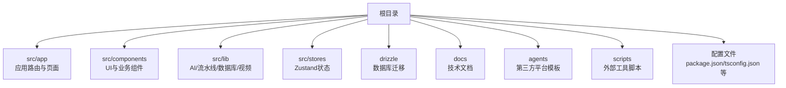
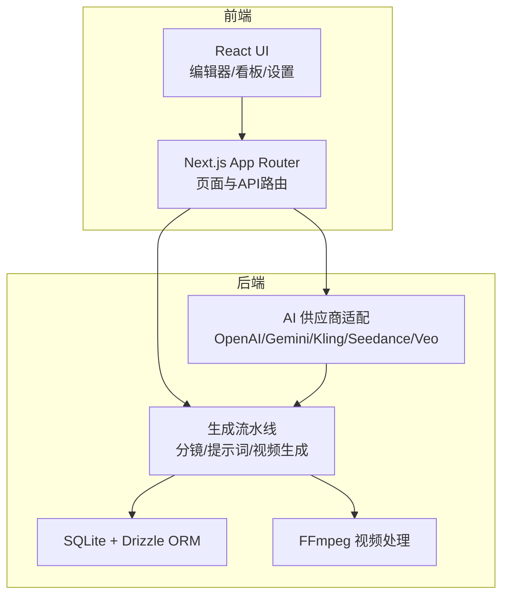
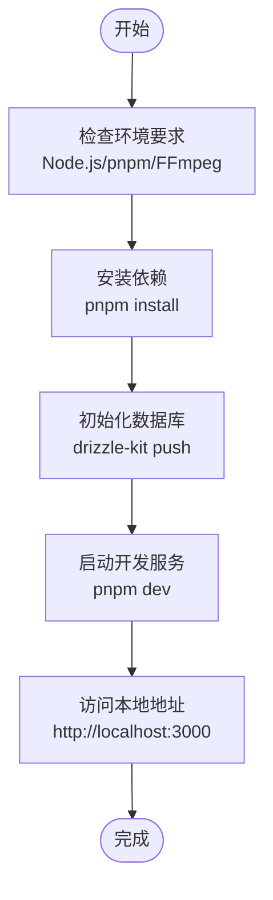
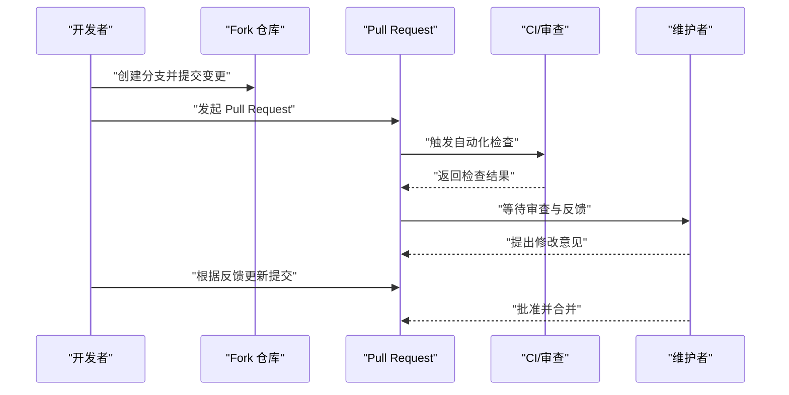
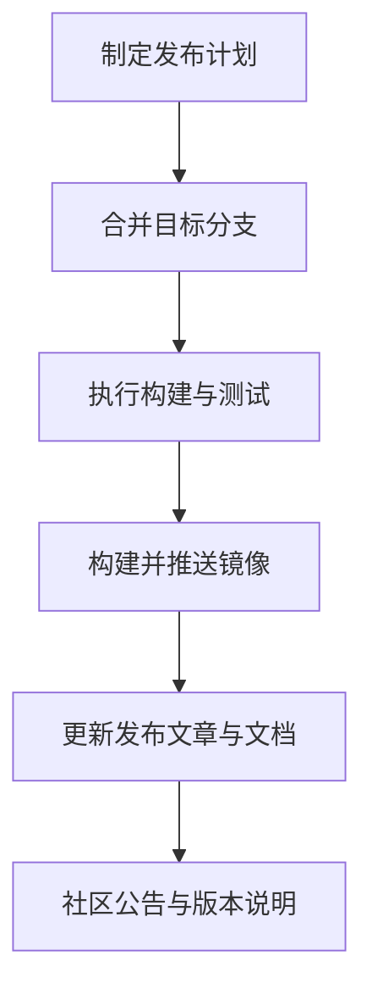
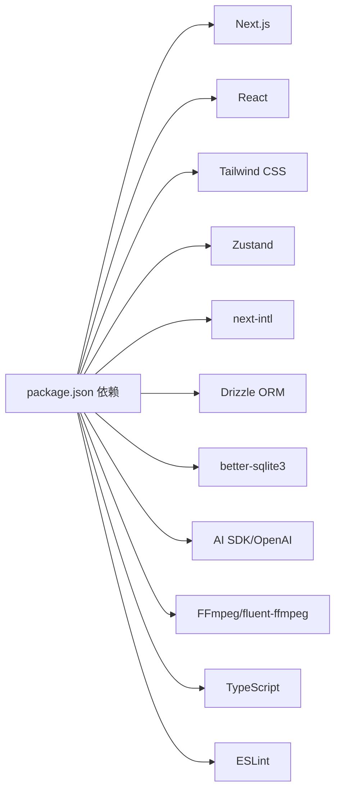

# 贡献指南

<cite>
**本文引用的文件**
- [package.json](file://package.json)
- [README.md](file://README.md)
- [.dockerignore](file://.dockerignore)
- [Dockerfile](file://Dockerfile)
- [drizzle.config.ts](file://drizzle.config.ts)
- [tsconfig.json](file://tsconfig.json)
- [eslint.config.mjs](file://eslint.config.mjs)
- [pnpm-workspace.yaml](file://pnpm-workspace.yaml)
- [task_plan.md](file://task_plan.md)
</cite>

## 目录
1. [简介](#简介)
2. [项目结构](#项目结构)
3. [核心组件](#核心组件)
4. [架构总览](#架构总览)
5. [详细组件分析](#详细组件分析)
6. [依赖分析](#依赖分析)
7. [性能考虑](#性能考虑)
8. [故障排除指南](#故障排除指南)
9. [结论](#结论)
10. [附录](#附录)

## 简介
本贡献指南面向希望参与 AIComicBuilder 项目开发的贡献者，覆盖从环境搭建、依赖安装、本地运行，到提交变更、发起 Pull Request 的完整流程；同时提供问题报告模板、功能请求流程、代码贡献标准、测试要求、文档更新规范以及版本发布流程。项目采用 Next.js App Router 架构，前端使用 React 19、Tailwind CSS 4、Zustand 状态管理，后端集成 SQLite + Drizzle ORM，并通过 FFmpeg 进行视频处理。

## 项目结构
- 核心目录与职责概览
  - src/app：Next.js 应用路由层，包含国际化路由、仪表盘、项目编辑器、API 路由等
  - src/components：UI 组件与业务组件（编辑器、设置、提示词模板等）
  - src/lib：AI 供应商适配、生成流水线、数据库、视频处理等核心逻辑
  - src/stores：Zustand 状态管理
  - drizzle：数据库迁移脚本与元数据
  - docs：技术文档与发布文章
  - agents：第三方平台（如 Dify、Coze、百炼）的提示词模板
  - scripts：外部工具脚本（如视频渲染脚本）

- 关键配置文件
  - package.json：项目依赖与脚本命令
  - tsconfig.json：TypeScript 编译配置
  - eslint.config.mjs：ESLint 规则
  - drizzle.config.ts：Drizzle ORM 配置
  - pnpm-workspace.yaml：pnpm 工作区配置
  - Dockerfile/.dockerignore：容器化部署相关

**章节来源**
- [README.md:156-180](file://README.md#L156-L180)
- [package.json:1-60](file://package.json#L1-L60)

## 核心组件
- 开发与运行脚本
  - 开发模式：用于本地热重载开发
  - 构建模式：生产构建
  - 启动模式：生产服务器启动
  - Lint：代码质量检查
- 依赖管理
  - 包管理器：pnpm
  - 仅构建依赖：better-sqlite3
- TypeScript 与 ESLint
  - TypeScript 编译配置
  - ESLint 规则配置
- 数据库与迁移
  - Drizzle ORM 配置与迁移脚本
- 容器化
  - Dockerfile 与 .dockerignore

**章节来源**
- [package.json:5-10](file://package.json#L5-L10)
- [package.json:41-45](file://package.json#L41-L45)
- [tsconfig.json](file://tsconfig.json)
- [eslint.config.mjs](file://eslint.config.mjs)
- [drizzle.config.ts](file://drizzle.config.ts)
- [.dockerignore](file://.dockerignore)
- [Dockerfile](file://Dockerfile)

## 架构总览
AIComicBuilder 的整体架构围绕“剧本输入 → 解析 → 角色提取 → 分镜 → 参考帧/首尾帧 → 视频提示词 → 视频生成 → 合成”的流水线展开。前端通过 Next.js App Router 提供交互界面，后端 API 路由负责协调 AI 供应商与视频处理流程，数据库使用 SQLite 并通过 Drizzle ORM 管理。

**图表来源**
- [README.md:45-58](file://README.md#L45-L58)
- [README.md:138-154](file://README.md#L138-L154)

## 详细组件分析

### 开发环境搭建与本地运行
- 环境要求
  - Node.js 18+
  - pnpm
  - FFmpeg（视频合成功能需要）
- 安装依赖
  - 使用 pnpm 安装项目依赖
- 初始化数据库
  - 使用 Drizzle Kit 推送数据库迁移
- 启动服务
  - 开发模式启动应用
  - 访问本地端口查看界面
- Docker 部署（可选）
  - 支持容器快速启动与数据卷挂载
  - 支持 docker-compose 方式编排

**章节来源**
- [README.md:61-86](file://README.md#L61-L86)
- [README.md:87-122](file://README.md#L87-L122)
- [package.json:6-10](file://package.json#L6-L10)
- [drizzle.config.ts](file://drizzle.config.ts)

### Fork 与 Pull Request 流程
- Fork 仓库
  - 在 GitHub 上 Fork 主仓库至个人账号
- 创建分支
  - 建议以 feat/fix/docs/refactor/... 前缀命名
- 提交变更
  - 遵循代码风格与提交信息规范
  - 通过 Lint 检查
- 发起 PR
  - 清晰描述变更内容、动机与影响范围
  - 关联相关 Issue
- 审查与合并
  - 维护者审查与反馈
  - 修改后重新推送

**章节来源**
- [README.md:19](file://README.md#L19)

### 问题报告与功能请求
- 问题报告模板建议
  - 环境信息：操作系统、Node.js 版本、pnpm 版本、浏览器
  - 复现步骤：清晰的操作顺序与预期/实际结果
  - 日志与截图：错误日志、界面截图、视频/图片资源路径
  - 影响范围：是否影响特定功能模块或数据
- 功能请求流程
  - 在 Issue 中描述需求背景、使用场景与期望行为
  - 讨论可行性与实现方案
  - 通过 PR 实现并补充测试与文档

**章节来源**
- [README.md:4](file://README.md#L4)

### 代码贡献标准
- 代码风格
  - 使用 TypeScript 与 ESLint 规则
  - 统一命名约定与文件组织
- 提交信息
  - 使用清晰语义化的提交信息（feat/fix/docs/chore 等前缀）
- 分支策略
  - 优先从主分支拉取最新变更，避免长期分支
- 测试要求
  - 单元测试与集成测试（如有）
  - 端到端测试（如涉及 UI 或 API）
  - 本地验证通过后再提交 PR

**章节来源**
- [eslint.config.mjs](file://eslint.config.mjs)
- [tsconfig.json](file://tsconfig.json)

### 文档更新规范
- 文档类型
  - 技术文档：位于 docs/ 目录
  - API 文档：位于 docs/api/ 目录
  - 发布文章：版本发布相关文章
- 更新流程
  - 在 PR 中同步更新相关文档
  - 保持文档与代码变更一致
  - 如有破坏性变更，需标注兼容性说明

**章节来源**
- [README.md:182-189](file://README.md#L182-L189)

### 版本发布流程
- 版本规划
  - 参考任务计划与里程碑
- 发布准备
  - 合并目标分支、更新变更日志
  - 运行构建与测试
- 容器发布
  - Dockerfile 与 .dockerignore 已配置
  - 可通过 CI 工作流自动发布镜像（如存在）
- 文档与公告
  - 发布文章与演示视频同步更新

**章节来源**
- [task_plan.md](file://task_plan.md)
- [Dockerfile](file://Dockerfile)
- [.dockerignore](file://.dockerignore)

## 依赖分析
- 前端与框架
  - Next.js 16、React 19、Tailwind CSS 4、Zustand
- 国际化
  - next-intl
- 数据库与 ORM
  - better-sqlite3、Drizzle ORM
- AI 与多媒体
  - AI SDK（OpenAI、Google）、OpenAI SDK、FFmpeg（fluent-ffmpeg）
- 开发工具
  - TypeScript、ESLint、drizzle-kit

**图表来源**
- [package.json:11-58](file://package.json#L11-L58)

**章节来源**
- [package.json:11-58](file://package.json#L11-L58)

## 性能考虑
- 本地开发
  - 使用 pnpm 减少磁盘占用与安装时间
  - 合理拆分组件与懒加载，减少首屏负担
- 数据库
  - 使用 Drizzle ORM 管理迁移，避免复杂 SQL
  - SQLite 适合开发与小规模数据，生产可评估迁移方案
- 视频处理
  - FFmpeg 作为外部依赖，确保路径正确与权限充足
  - 合理设置并发与缓存策略，避免阻塞主线程
- 代码质量
  - 通过 ESLint 与 TypeScript 提升可维护性与稳定性

**章节来源**
- [README.md:61-66](file://README.md#L61-L66)
- [package.json:41-45](file://package.json#L41-L45)

## 故障排除指南
- 依赖安装失败
  - 确认 pnpm 版本与 Node.js 版本满足要求
  - 清理缓存后重试安装
- 数据库初始化失败
  - 确认 Drizzle Kit 可用且数据库文件可写
  - 检查 drizzle.config.ts 配置
- FFmpeg 相关错误
  - 确保系统已安装 FFmpeg 并加入 PATH
  - 检查权限与磁盘空间
- 开发服务器无法启动
  - 查看端口占用情况
  - 清理临时文件与缓存后重启
- Docker 运行异常
  - 检查镜像标签与数据卷挂载路径
  - 查看容器日志定位问题

**章节来源**
- [README.md:61-86](file://README.md#L61-L86)
- [README.md:87-122](file://README.md#L87-L122)
- [drizzle.config.ts](file://drizzle.config.ts)

## 结论
本贡献指南提供了从环境搭建到版本发布的全流程规范，帮助贡献者高效参与项目开发。请在提交变更前遵循代码风格与测试要求，并在 PR 中清晰描述变更内容与影响范围。感谢对 AIComicBuilder 的关注与贡献！

## 附录
- 社区与沟通
  - 社区交流渠道：[https://linux.do/](https://linux.do/)
- 维护者联系方式
  - 请通过 Issue 或社区渠道联系维护团队
- 许可证
  - 项目采用 Apache License 2.0

**章节来源**
- [README.md:4](file://README.md#L4)
- [README.md:245-247](file://README.md#L245-L247)