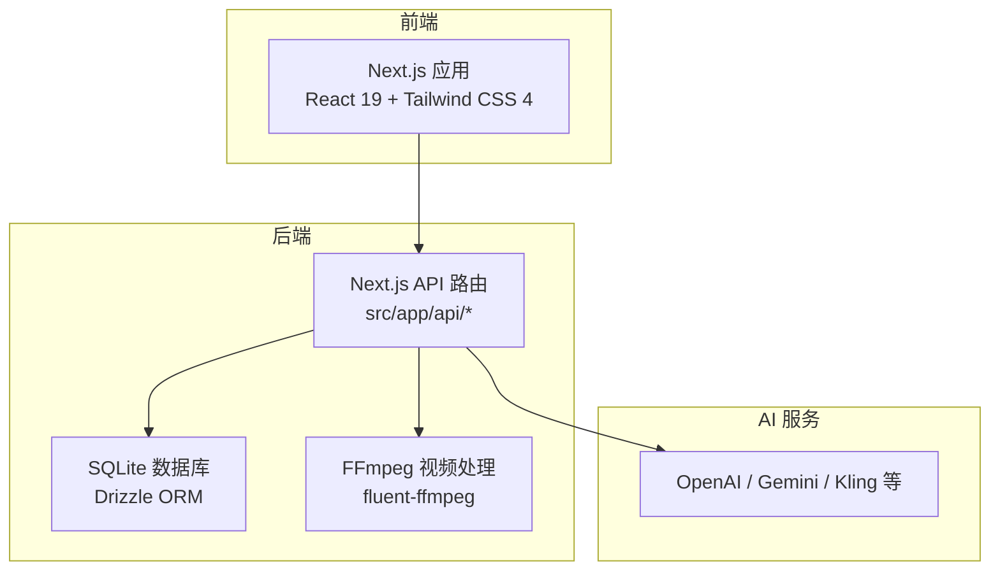
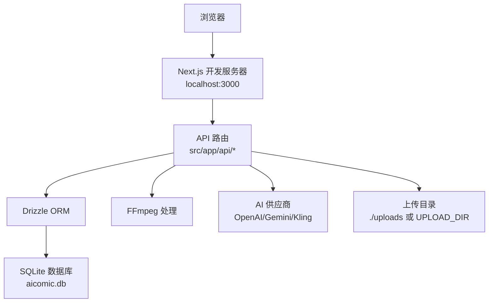
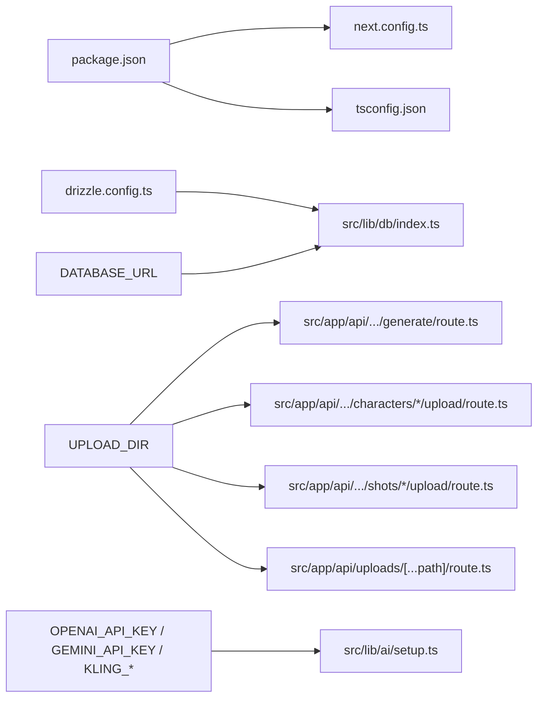

# 快速开始

<cite>
**本文引用的文件**
- [package.json](file://package.json)
- [README.md](file://README.md)
- [Dockerfile](file://Dockerfile)
- [drizzle.config.ts](file://drizzle.config.ts)
- [next.config.ts](file://next.config.ts)
- [tsconfig.json](file://tsconfig.json)
- [src/lib/db/index.ts](file://src/lib/db/index.ts)
- [src/lib/ai/setup.ts](file://src/lib/ai/setup.ts)
- [src/app/api/projects/[id]/generate/route.ts](file://src/app/api/projects/[id]/generate/route.ts)
- [src/app/api/projects/[id]/characters/[characterId]/upload/route.ts](file://src/app/api/projects/[id]/characters/[characterId]/upload/route.ts)
- [src/app/api/projects/[id]/shots/[shotId]/upload/route.ts](file://src/app/api/projects/[id]/shots/[shotId]/upload/route.ts)
- [src/app/api/uploads/[...path]/route.ts](file://src/app/api/uploads/[...path]/route.ts)
</cite>

## 目录
1. 引言
2. 项目结构
3. 核心组件
4. 架构总览
5. 详细组件分析
6. 依赖关系分析
7. 性能注意事项
8. 故障排除指南
9. 结论
10. 附录

## 引言
本指南面向首次接触 AIComicBuilder 的开发者与使用者，帮助你在本地快速搭建开发环境、完成数据库初始化、启动开发服务器，并进行基础功能验证。文档同时覆盖常见问题排查与性能建议，确保你能顺利上手并高效使用。

## 项目结构
AIComicBuilder 是基于 Next.js 16 App Router 的全栈应用，采用 TypeScript、SQLite + Drizzle ORM 进行数据持久化，前端使用 React 19、Tailwind CSS 4、Base UI 与 Zustand 状态管理。项目通过 pnpm 管理依赖，Drizzle Kit 进行数据库迁移，FFmpeg 用于视频合成与处理。

**章节来源**
- [README.md:156-180](file://README.md#L156-L180)

## 核心组件
- 包管理与脚本
  - 使用 pnpm 管理依赖与构建，提供 dev/build/start/lint 脚本。
- 数据库与迁移
  - 使用 SQLite + Drizzle ORM；通过 drizzle.config.ts 指定 schema 与输出目录；默认 DATABASE_URL 指向本地文件数据库。
- 视频处理
  - 通过 fluent-ffmpeg 与 FFmpeg 执行视频合成、字幕烧录等操作。
- AI 供应商集成
  - 通过 AI SDK 支持 OpenAI、Gemini、Kling 等供应商；API 会读取环境变量中的密钥与模型参数。
- 上传与资源存储
  - 默认上传目录为 ./uploads，可通过环境变量 UPLOAD_DIR 覆盖。

**章节来源**
- [package.json:1-60](file://package.json#L1-L60)
- [drizzle.config.ts:1-11](file://drizzle.config.ts#L1-L11)
- [next.config.ts:1-16](file://next.config.ts#L1-L16)
- [tsconfig.json:1-35](file://tsconfig.json#L1-L35)

## 架构总览
下图展示了本地开发环境的关键交互：浏览器访问 Next.js 开发服务器，API 路由调用 Drizzle ORM 访问 SQLite，必要时调用 FFmpeg 处理视频，以及通过 AI SDK 调用外部模型供应商。

**图表来源**
- [next.config.ts:1-16](file://next.config.ts#L1-L16)
- [drizzle.config.ts:1-11](file://drizzle.config.ts#L1-L11)
- [src/lib/db/index.ts](file://src/lib/db/index.ts)
- [src/app/api/projects/[id]/generate/route.ts](file://src/app/api/projects/[id]/generate/route.ts)

## 详细组件分析

### 环境与依赖要求
- Node.js 版本
  - 项目在 README 中声明需要 Node.js 18+，Dockerfile 使用 node:20-alpine，建议使用 Node.js 18+。
- 包管理工具
  - 使用 pnpm；Dockerfile 中通过 corepack 启用并激活 pnpm。
- 视频处理依赖
  - FFmpeg（含字幕烧录与 CJK 字体支持）是视频合成功能的必要依赖。
- 数据库
  - SQLite + Drizzle ORM；默认数据库文件路径为 ./data/aicomic.db（或通过 DATABASE_URL 指定）。
- 其他运行时依赖
  - better-sqlite3 二进制需正确编译；pnpm 配置仅构建该依赖以避免平台兼容性问题。

**章节来源**
- [README.md:61-66](file://README.md#L61-L66)
- [Dockerfile:1-41](file://Dockerfile#L1-L41)
- [drizzle.config.ts:7-9](file://drizzle.config.ts#L7-L9)
- [package.json:41-45](file://package.json#L41-L45)

### 本地开发环境搭建步骤
- 步骤 1：克隆仓库
  - 使用 Git 克隆项目至本地。
- 步骤 2：安装依赖
  - 在项目根目录执行 pnpm install 安装依赖。
- 步骤 3：初始化数据库
  - 执行 pnpm drizzle-kit push 完成数据库迁移与初始化。
- 步骤 4：配置环境变量
  - 以下为常用环境变量（建议在本地 .env 文件中配置）：
    - DATABASE_URL：数据库连接字符串，默认指向本地 SQLite 文件。
    - OPENAI_API_KEY / GEMINI_API_KEY / KLIN* 系列密钥：用于调用相应 AI 供应商。
    - UPLOAD_DIR：上传与生成资源的存储目录，默认 ./uploads。
  - 说明：项目在多处路由与 AI 提供者中读取上述环境变量，确保生成与上传功能正常。
- 步骤 5：启动开发服务器
  - 执行 pnpm dev 启动 Next.js 开发服务器，默认监听 http://localhost:3000。
- 步骤 6：验证
  - 在浏览器打开 http://localhost:3000，进入项目列表页，创建或导入一个项目，尝试生成首尾帧或视频片段，确认流程可走通。

**章节来源**
- [README.md:67-86](file://README.md#L67-L86)
- [drizzle.config.ts:7-9](file://drizzle.config.ts#L7-L9)
- [src/lib/ai/setup.ts](file://src/lib/ai/setup.ts)
- [src/lib/db/index.ts](file://src/lib/db/index.ts)
- [src/app/api/projects/[id]/generate/route.ts](file://src/app/api/projects/[id]/generate/route.ts)

### 开发服务器启动方法
- 使用 pnpm dev 启动开发服务器，Next.js 会在本地提供热重载与调试能力。
- 若需自定义端口或主机名，可在环境变量中设置 PORT/HOSTNAME（Dockerfile 中已给出示例）。

**章节来源**
- [README.md:79-85](file://README.md#L79-L85)
- [Dockerfile:35-38](file://Dockerfile#L35-L38)

### 基本使用示例
- 创建项目并导入剧本
  - 在项目列表页新建项目，选择“导入剧本”，上传 TXT/DOCX/PDF，等待 AI 解析与分集。
- 角色与分镜
  - 在角色管理页查看 AI 提取的角色信息；在分镜面板中查看 AI 生成的镜头列表。
- 生成与预览
  - 在预览页触发视频生成与合成，完成后下载最终视频或打包资源。

**章节来源**
- [README.md:24-44](file://README.md#L24-L44)

## 依赖关系分析
- 包管理与构建
  - package.json 定义了核心依赖与 devDependencies；next.config.ts 启用国际化插件与外部包配置；tsconfig.json 指定路径别名与编译选项。
- 数据层
  - drizzle.config.ts 指定 schema 与输出目录；src/lib/db/index.ts 读取 DATABASE_URL 并建立连接。
- 上传与资源
  - 多个 API 路由读取 UPLOAD_DIR 环境变量，决定上传与生成资源的保存位置。
- AI 供应商
  - src/lib/ai/setup.ts 与各提供者类读取对应 API Key 与模型参数，确保生成请求可用。

**图表来源**
- [package.json:1-60](file://package.json#L1-L60)
- [next.config.ts:1-16](file://next.config.ts#L1-L16)
- [tsconfig.json:1-35](file://tsconfig.json#L1-L35)
- [drizzle.config.ts:1-11](file://drizzle.config.ts#L1-L11)
- [src/lib/db/index.ts](file://src/lib/db/index.ts)
- [src/app/api/projects/[id]/generate/route.ts](file://src/app/api/projects/[id]/generate/route.ts)
- [src/app/api/projects/[id]/characters/[characterId]/upload/route.ts](file://src/app/api/projects/[id]/characters/[characterId]/upload/route.ts)
- [src/app/api/projects/[id]/shots/[shotId]/upload/route.ts](file://src/app/api/projects/[id]/shots/[shotId]/upload/route.ts)
- [src/app/api/uploads/[...path]/route.ts](file://src/app/api/uploads/[...path]/route.ts)
- [src/lib/ai/setup.ts](file://src/lib/ai/setup.ts)

**章节来源**
- [package.json:1-60](file://package.json#L1-L60)
- [drizzle.config.ts:1-11](file://drizzle.config.ts#L1-L11)
- [next.config.ts:1-16](file://next.config.ts#L1-L16)
- [tsconfig.json:1-35](file://tsconfig.json#L1-L35)

## 性能注意事项
- 本地开发时启用 pnpm 与 Next.js 的热重载，减少冷启动时间。
- SQLite 在小规模数据下性能良好，若并发较高或数据量增大，建议评估迁移至更强大的数据库。
- FFmpeg 处理视频时占用 CPU，建议在空闲时段执行批量生成，或使用更高性能的机器。
- 上传与生成资源较多时，合理规划 UPLOAD_DIR 的磁盘空间与 IO 性能。

## 故障排除指南
- 无法启动开发服务器
  - 确认 Node.js 版本满足要求（18+），并使用 pnpm 安装依赖。
  - 检查端口是否被占用，或调整 PORT/HOSTNAME 环境变量。
- 数据库初始化失败
  - 确保已执行 pnpm drizzle-kit push；检查 DATABASE_URL 是否有效，或在本地创建 ./data 目录。
- FFmpeg 相关错误
  - 确认系统已安装 FFmpeg（含字幕烧录与 CJK 字体支持），并在 PATH 中可用。
- 上传目录权限或路径问题
  - 确认 UPLOAD_DIR 指向的目录存在且具备读写权限；如使用相对路径，注意工作目录。
- AI 供应商调用失败
  - 检查对应 API Key 是否正确配置；确认网络可达与额度充足。
- Docker 环境启动后无法访问
  - 确认容器映射了 3000 端口，且 HOSTNAME/PORT 已正确设置；检查卷挂载的数据与上传目录。

**章节来源**
- [README.md:61-66](file://README.md#L61-L66)
- [README.md:87-129](file://README.md#L87-L129)
- [Dockerfile:35-38](file://Dockerfile#L35-L38)
- [drizzle.config.ts:7-9](file://drizzle.config.ts#L7-L9)
- [src/lib/db/index.ts](file://src/lib/db/index.ts)
- [src/app/api/projects/[id]/generate/route.ts](file://src/app/api/projects/[id]/generate/route.ts)

## 结论
通过本快速开始指南，你可以在本地完成环境准备、依赖安装、数据库初始化与开发服务器启动，并进行基础的功能验证。遇到问题时，可依据故障排除章节逐步定位与解决。随着项目推进，建议进一步完善环境变量与部署配置，确保生成流水线稳定运行。

## 附录
- 常用命令
  - 安装依赖：pnpm install
  - 初始化数据库：pnpm drizzle-kit push
  - 启动开发：pnpm dev
  - 构建生产：pnpm build
- 关键环境变量
  - DATABASE_URL：数据库连接（默认 file:./data/aicomic.db）
  - OPENAI_API_KEY / GEMINI_API_KEY / KLIN*：AI 供应商密钥
  - UPLOAD_DIR：上传与生成资源目录（默认 ./uploads）