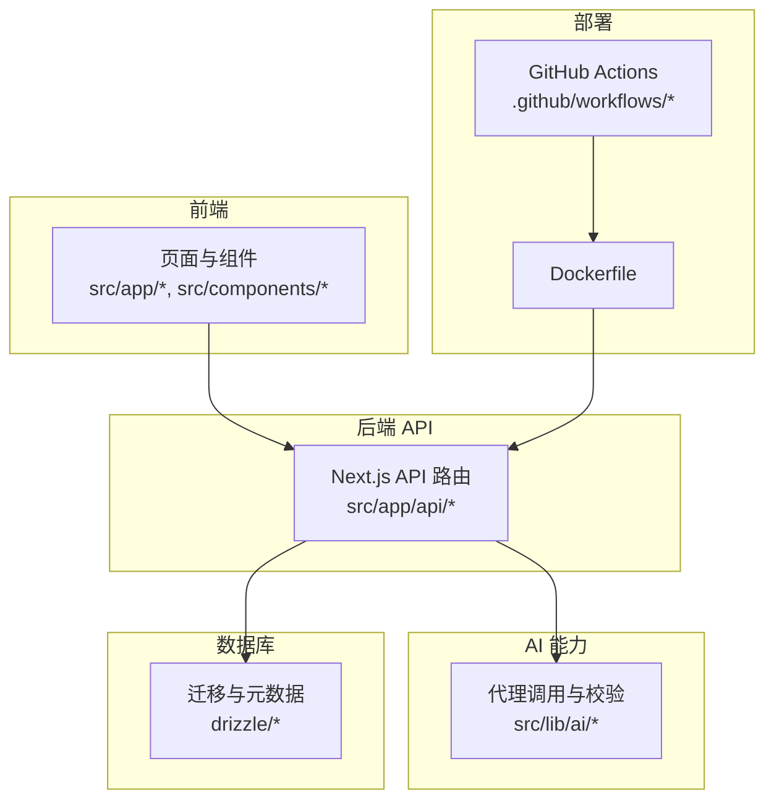
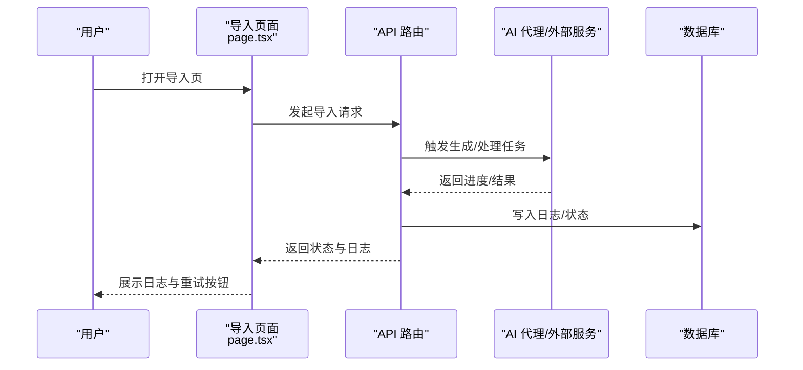
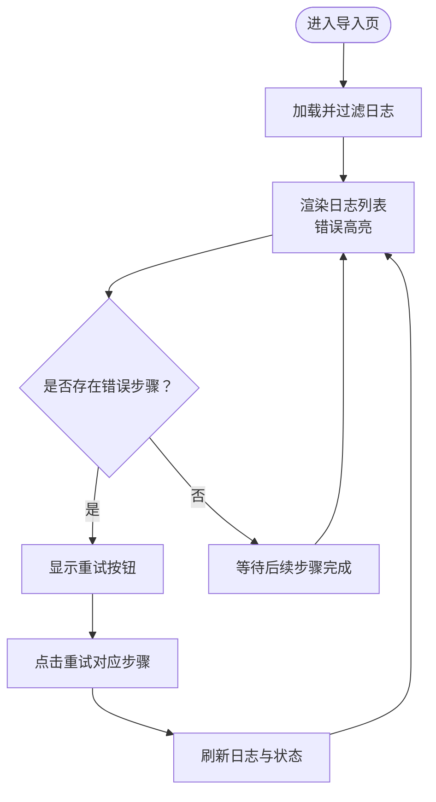
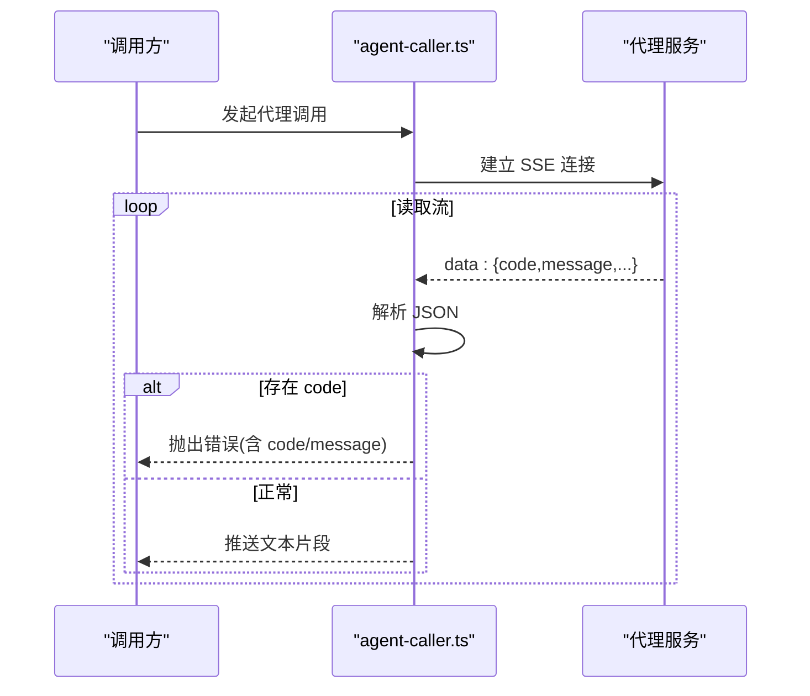
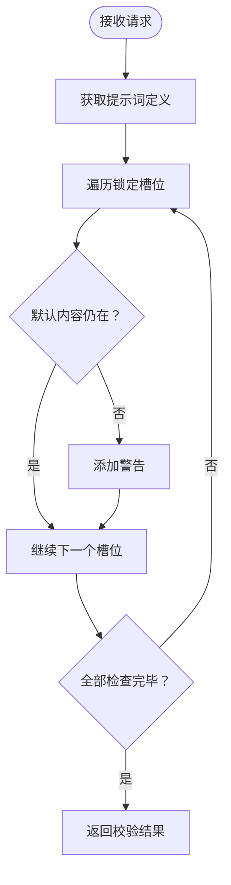
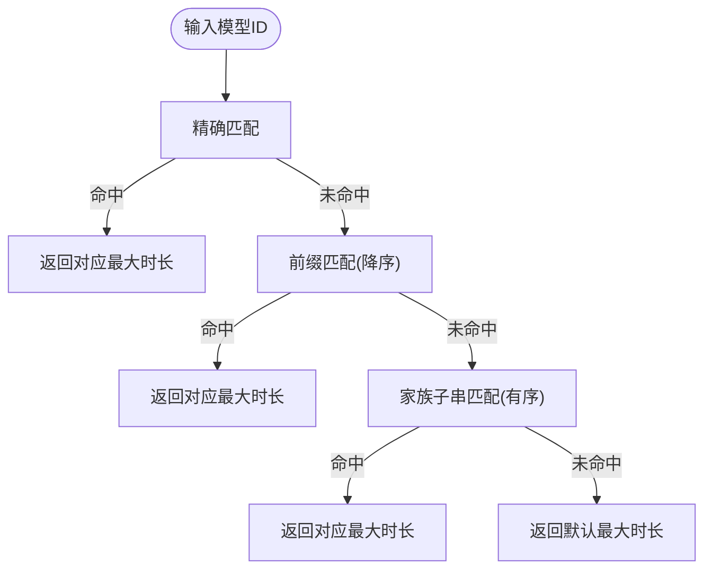
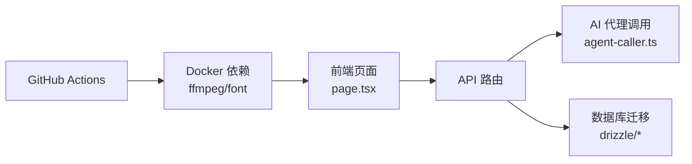

# 故障排除

<cite>
**本文引用的文件**
- [Dockerfile](file://Dockerfile)
- [docker-publish.yml](file://.github/workflows/docker-publish.yml)
- [page.tsx](file://src/app/[locale]/project/[id]/import/page.tsx)
- [agent-caller.ts](file://src/lib/ai/agent-caller.ts)
- [validate/route.ts](file://src/app/api/prompt-templates/validate/route.ts)
- [provider-form.tsx](file://src/components/settings/provider-form.tsx)
- [provider-section.tsx](file://src/components/settings/provider-section.tsx)
- [agent-section.tsx](file://src/components/settings/agent-section.tsx)
- [model-limits.ts](file://src/lib/ai/model-limits.ts)
- [ucloud-seedance.ts](file://src/lib/ai/providers/ucloud-seedance.ts)
- [0031_add_world_setting.sql](file://drizzle/0031_add_world_setting.sql)
- [_journal.json](file://drizzle/meta/_journal.json)
</cite>

## 目录
1. [简介](#简介)
2. [项目结构](#项目结构)
3. [核心组件](#核心组件)
4. [架构总览](#架构总览)
5. [详细组件分析](#详细组件分析)
6. [依赖分析](#依赖分析)
7. [性能考虑](#性能考虑)
8. [故障排除指南](#故障排除指南)
9. [结论](#结论)
10. [附录](#附录)

## 简介
本指南面向 AIComicBuilder 的使用者与维护者，提供系统化的故障排除方法与实践建议。内容覆盖安装与部署问题、运行时错误、性能瓶颈、集成与配置故障、日志与错误码解析、根因定位方法、性能优化与资源监控、社区支持与问题上报流程，以及安全与紧急修复指引。

## 项目结构
AIComicBuilder 前后端采用 Next.js 应用模式，核心由以下部分组成：
- 前端页面与组件：位于 src/app 与 src/components，负责用户交互、导入流程、提示词模板校验、模型与代理配置等。
- 后端 API：位于 src/app/api 下，提供项目管理、生成任务、提示词模板验证、上传与下载等接口。
- AI 能力与代理调用：位于 src/lib/ai，封装不同平台（如百炼、UCloud Seedance）的调用逻辑与输出校验。
- 数据库迁移与版本控制：drizzle 目录下包含 SQL 迁移与元数据记录。
- 部署与发布：Dockerfile 定义容器镜像构建；GitHub Actions 工作流用于镜像构建与发布。

图表来源
- [Dockerfile](file://Dockerfile)
- [.github/workflows/docker-publish.yml](file://.github/workflows/docker-publish.yml)

章节来源
- [Dockerfile](file://Dockerfile)
- [.github/workflows/docker-publish.yml](file://.github/workflows/docker-publish.yml)

## 核心组件
- 导入流程与日志展示：导入页面提供步骤化日志与重试按钮，便于定位失败步骤。
- AI 代理调用与错误传播：代理调用器解析 SSE 流，提取错误码并抛出可读异常。
- 提示词模板校验：后端对锁定槽位进行完整性检查，返回警告以避免意外行为。
- 模型能力限制：根据模型 ID 或家族匹配最大时长，防止超限生成。
- 供应商与代理配置：提供模型供应商与代理的增删改查界面与表单。
- UCloud Seedance 任务轮询：带重试与状态判断，失败或过期时抛出明确错误。
- 数据库迁移与版本：通过迁移脚本与元数据记录版本演进。

章节来源
- [page.tsx](file://src/app/[locale]/project/[id]/import/page.tsx)
- [agent-caller.ts](file://src/lib/ai/agent-caller.ts)
- [validate/route.ts](file://src/app/api/prompt-templates/validate/route.ts)
- [model-limits.ts](file://src/lib/ai/model-limits.ts)
- [provider-form.tsx](file://src/components/settings/provider-form.tsx)
- [provider-section.tsx](file://src/components/settings/provider-section.tsx)
- [agent-section.tsx](file://src/components/settings/agent-section.tsx)
- [ucloud-seedance.ts](file://src/lib/ai/providers/ucloud-seedance.ts)
- [0031_add_world_setting.sql](file://drizzle/0031_add_world_setting.sql)
- [_journal.json](file://drizzle/meta/_journal.json)

## 架构总览
AIComicBuilder 的运行链路从浏览器发起请求到 Next.js API，再由 API 调用 AI 代理或外部服务，最终写入数据库并返回结果。导入流程中，前端实时渲染日志并允许按步骤重试。

图表来源
- [page.tsx](file://src/app/[locale]/project/[id]/import/page.tsx)

## 详细组件分析

### 组件一：导入流程与日志展示
- 功能要点
  - 步骤化日志：按 step 分段显示，错误项高亮。
  - 失败重试：当任一步骤出现错误且非历史模式时，显示重试按钮。
  - 自动滚动：日志区域底部挂载 ref，确保最新日志可见。
- 典型问题
  - 日志不更新：检查前端是否正确订阅日志事件与滚动逻辑。
  - 重试无效：确认后端对应步骤的可恢复性与幂等性。
- 诊断路径
  - 查看导入页日志渲染与重试按钮条件分支。
  - 对照后端日志接口与任务状态更新。

图表来源
- [page.tsx](file://src/app/[locale]/project/[id]/import/page.tsx)

章节来源
- [page.tsx](file://src/app/[locale]/project/[id]/import/page.tsx)

### 组件二：AI 代理调用与错误传播
- 功能要点
  - SSE 流解析：逐行解析 data 字段，提取 JSON 并转发文本片段。
  - 错误码处理：当响应 JSON 包含 code 时，构造可读错误并中断流。
  - 输出校验：对不同类别的代理输出进行结构校验，抛出格式化异常。
- 典型问题
  - 百炼智能体报错：出现 code 与 message，需结合平台文档排查。
  - 输出非 JSON：代理返回格式不符合预期，需调整提示词或代理配置。
- 诊断路径
  - 捕获代理调用器抛出的错误，查看错误消息中的 code 与 message。
  - 使用输出校验函数定位具体类别与字段缺失。

图表来源
- [agent-caller.ts](file://src/lib/ai/agent-caller.ts)

章节来源
- [agent-caller.ts](file://src/lib/ai/agent-caller.ts)

### 组件三：提示词模板校验
- 功能要点
  - 锁定槽位完整性：遍历定义中的不可编辑槽位，检查编辑后文本是否仍包含默认内容。
  - 警告集合：若发现被修改或移除，返回警告数组，供前端提示。
- 典型问题
  - 保存时报“锁定槽位内容被修改”：需恢复默认内容或评估变更影响。
- 诊断路径
  - 对比编辑前后的完整文本，确认锁定槽位是否被意外改动。
  - 若业务允许，评估是否需要放宽校验策略。

图表来源
- [validate/route.ts](file://src/app/api/prompt-templates/validate/route.ts)

章节来源
- [validate/route.ts](file://src/app/api/prompt-templates/validate/route.ts)

### 组件四：模型能力限制与最大时长
- 功能要点
  - 匹配策略：精确匹配、前缀匹配、家族子串匹配，最后回退到默认最大时长。
- 典型问题
  - 生成超时或被截断：检查当前模型 ID 是否命中了更严格的限制。
- 诊断路径
  - 根据实际模型 ID 查询匹配规则，确认限制值来源。

图表来源
- [model-limits.ts](file://src/lib/ai/model-limits.ts)

章节来源
- [model-limits.ts](file://src/lib/ai/model-limits.ts)

### 组件五：供应商与代理配置
- 功能要点
  - 供应商增删改查：通过 ProviderSection 与 ProviderForm 管理不同能力的模型供应商。
  - 代理管理：AgentSection 支持列出、新增、编辑代理，绑定到项目分类。
- 典型问题
  - 无法保存密钥：检查表单字段映射与后端接口参数一致性。
  - 代理不可用：确认平台、AppId、ApiKey 配置正确。
- 诊断路径
  - 对照前端表单字段与后端接口定义，核对必填项与类型。

章节来源
- [provider-section.tsx](file://src/components/settings/provider-section.tsx)
- [provider-form.tsx](file://src/components/settings/provider-form.tsx)
- [agent-section.tsx](file://src/components/settings/agent-section.tsx)

### 组件六：UCloud Seedance 任务轮询
- 功能要点
  - 轮询策略：固定间隔重试，最多若干次；成功返回首个 URL，失败/过期抛出明确错误，超时统一报错。
- 典型问题
  - 任务长时间 Pending：检查网络连通性与鉴权头。
  - Success 但无 URL：服务端返回结构异常，需核查上游实现。
- 诊断路径
  - 查看轮询日志与最终状态，定位是在哪一步骤失败或超时。

章节来源
- [ucloud-seedance.ts](file://src/lib/ai/providers/ucloud-seedance.ts)

## 依赖分析
- 前端与后端耦合点
  - 导入页通过 API 获取日志与状态，UI 与后端路由强相关。
  - 提示词模板校验前后端协作，前端负责编辑，后端负责校验与警告。
- 外部依赖
  - Dockerfile 中声明 Node 与 ffmpeg/font 依赖，影响视频处理与字幕渲染。
  - GitHub Actions 工作流负责镜像构建与发布标签管理。

图表来源
- [Dockerfile](file://Dockerfile)
- [.github/workflows/docker-publish.yml](file://.github/workflows/docker-publish.yml)

章节来源
- [Dockerfile](file://Dockerfile)
- [.github/workflows/docker-publish.yml](file://.github/workflows/docker-publish.yml)

## 性能考虑
- 生成时长限制
  - 使用模型能力限制模块，依据模型 ID 或家族设置最大时长，避免超时与资源浪费。
- 日志与 UI 渲染
  - 导入页对日志进行分步渲染与自动滚动，建议在大量日志场景下启用虚拟滚动或分页。
- 外部服务轮询
  - UCloud Seedance 轮询应设置合理间隔与上限，避免频繁请求导致限流或资源占用过高。
- 部署与资源
  - Dockerfile 中 ffmpeg 与字体依赖用于字幕烧录与多语言显示，确保容器资源充足。

章节来源
- [model-limits.ts](file://src/lib/ai/model-limits.ts)
- [page.tsx](file://src/app/[locale]/project/[id]/import/page.tsx)
- [ucloud-seedance.ts](file://src/lib/ai/providers/ucloud-seedance.ts)
- [Dockerfile](file://Dockerfile)

## 故障排除指南

### 一、安装与部署问题
- 症状
  - 容器启动失败或端口不可访问。
- 诊断
  - 检查 Dockerfile 中的环境变量与暴露端口。
  - 确认 GitHub Actions 工作流是否成功推送镜像。
- 处理
  - 重新构建镜像并检查日志；确认 HOSTNAME、PORT、DATABASE_URL、UPLOAD_DIR 等环境变量。
  - 如使用反向代理，请确保端口映射与健康检查配置正确。

章节来源
- [Dockerfile](file://Dockerfile)
- [.github/workflows/docker-publish.yml](file://.github/workflows/docker-publish.yml)

### 二、运行时错误
- 百炼智能体错误
  - 症状：代理调用器抛出包含 code 与 message 的错误。
  - 诊断：查看错误消息中的 code 与 message，结合平台文档定位问题。
  - 处理：修正提示词、参数或代理配置；必要时降低并发或切换模型。
- SSE 流异常
  - 症状：流中断或解析失败。
  - 诊断：检查代理服务返回格式与网络稳定性。
  - 处理：增加重试与超时保护，完善错误回调。
- UCloud Seedance 任务失败
  - 症状：任务状态为 Failure/Expired 或超时。
  - 诊断：查看轮询日志与最终状态；确认鉴权头与任务 ID。
  - 处理：检查上游服务可用性与配额；适当延长超时阈值。

章节来源
- [agent-caller.ts](file://src/lib/ai/agent-caller.ts)
- [ucloud-seedance.ts](file://src/lib/ai/providers/ucloud-seedance.ts)

### 三、性能问题
- 生成时间过长
  - 检查模型能力限制是否过严；评估任务复杂度与并发。
- 日志渲染卡顿
  - 对大量日志启用虚拟化或分页；减少每帧日志数量。
- 外部服务延迟
  - 优化轮询间隔与重试策略；增加缓存与本地化存储。

章节来源
- [model-limits.ts](file://src/lib/ai/model-limits.ts)
- [page.tsx](file://src/app/[locale]/project/[id]/import/page.tsx)
- [ucloud-seedance.ts](file://src/lib/ai/providers/ucloud-seedance.ts)

### 四、集成与配置故障
- 供应商配置无效
  - 症状：保存后仍提示未配置或鉴权失败。
  - 诊断：核对前端表单字段与后端接口参数；检查密钥可见性开关。
  - 处理：恢复默认值并逐步验证；确认网络可达性。
- 代理绑定失败
  - 症状：项目分类无法绑定代理或绑定后不生效。
  - 诊断：检查后端绑定接口与数据库写入逻辑。
  - 处理：清理旧绑定并重新插入；确认分类与 agentId 一致。

章节来源
- [provider-form.tsx](file://src/components/settings/provider-form.tsx)
- [provider-section.tsx](file://src/components/settings/provider-section.tsx)
- [agent-section.tsx](file://src/components/settings/agent-section.tsx)

### 五、数据库与迁移
- 症状：功能异常或字段缺失。
- 诊断：检查迁移脚本与元数据记录，确认当前版本。
- 处理：执行缺失的迁移；回滚或重放迁移以修复不一致。

章节来源
- [0031_add_world_setting.sql](file://drizzle/0031_add_world_setting.sql)
- [_journal.json](file://drizzle/meta/_journal.json)

### 六、日志分析与根因定位
- 日志入口
  - 导入页日志区域与重试按钮，便于快速定位失败步骤。
- 错误码与消息
  - 百炼智能体错误：包含 code 与 message，优先据此排查。
  - UCloud Seedance：根据任务状态与错误消息定位。
- 建议流程
  - 记录时间戳与步骤号；抓取前后端日志；复现最小化场景；对比迁移版本。

章节来源
- [page.tsx](file://src/app/[locale]/project/[id]/import/page.tsx)
- [agent-caller.ts](file://src/lib/ai/agent-caller.ts)
- [ucloud-seedance.ts](file://src/lib/ai/providers/ucloud-seedance.ts)

### 七、安全与紧急修复
- 安全建议
  - 严格管理密钥与令牌；启用 HTTPS；限制 API 访问范围。
- 紧急修复
  - 快速回滚至稳定版本；临时禁用问题功能；发布热修复补丁。
- 社区支持与问题上报
  - 在仓库提交 Issue，附带：环境信息、复现步骤、日志摘要、错误码与截图。

章节来源
- [Dockerfile](file://Dockerfile)
- [.github/workflows/docker-publish.yml](file://.github/workflows/docker-publish.yml)

## 结论
通过系统化的日志与错误码分析、明确的诊断路径与修复流程，可显著缩短故障定位时间并提升系统稳定性。建议在生产环境中持续监控关键指标、保留详尽日志，并建立标准化的回滚与热修复机制。

## 附录

### A. 常见错误码与含义
- 百炼智能体错误
  - 形态：包含 code 与 message 的 JSON。
  - 处理：根据 code 定位平台侧问题；修正参数或提示词。
- UCloud Seedance
  - 成功：返回任务 URL。
  - 失败/过期：抛出明确错误，需检查上游服务与鉴权。
  - 超时：超过轮询上限仍未完成。

章节来源
- [agent-caller.ts](file://src/lib/ai/agent-caller.ts)
- [ucloud-seedance.ts](file://src/lib/ai/providers/ucloud-seedance.ts)

### B. 资源使用监控建议
- CPU/内存：容器层面采集；对视频处理密集场景建议扩容。
- I/O：关注磁盘空间与上传目录容量。
- 网络：外部服务调用的 RTT 与成功率。

### C. 社区支持与问题报告流程
- 提交 Issue 时请包含：
  - 环境信息（操作系统、Node 版本、Docker 版本）
  - 复现步骤与期望/实际结果
  - 关键日志与错误码
  - 相关配置截图或最小化配置