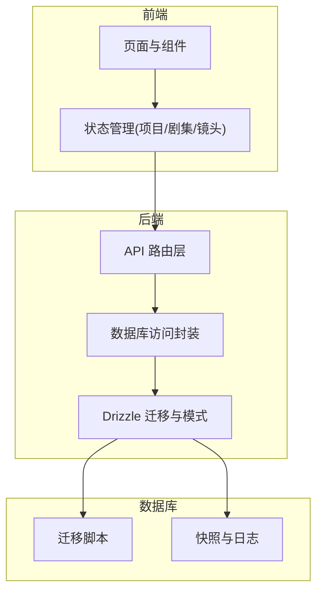
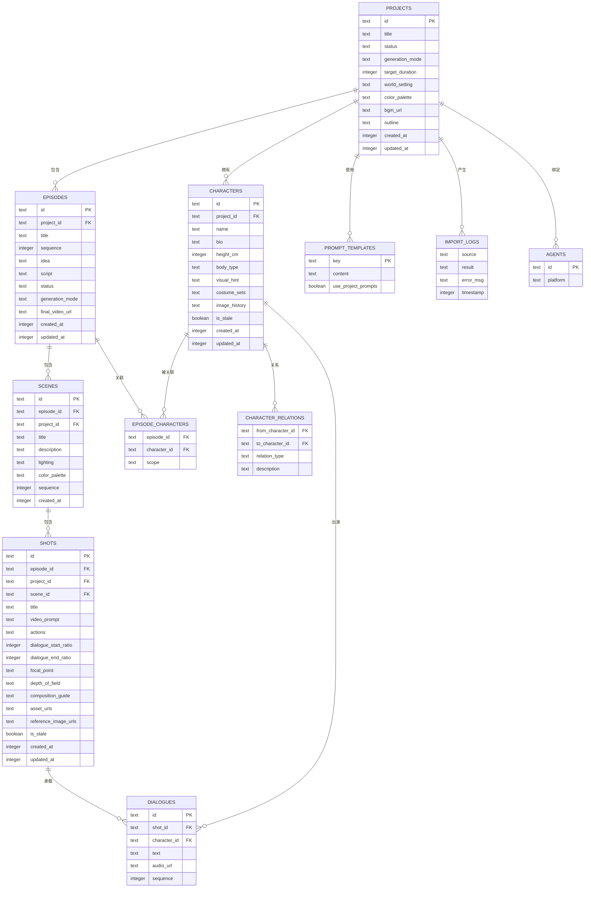
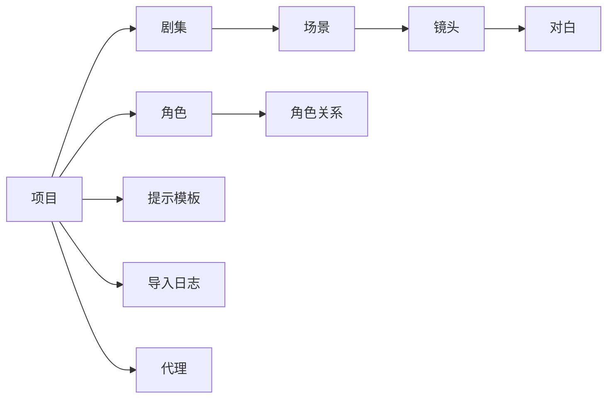

# 业务数据模型

<cite>
**本文引用的文件**
- [0010_add_episodes.sql](file://drizzle/0010_add_episodes.sql)
- [0026_add_scenes_table.sql](file://drizzle/0026_add_scenes_table.sql)
- [0013_add_episode_characters.sql](file://drizzle/0013_add_episode_characters.sql)
- [0025_add_character_relations.sql](file://drizzle/0025_add_character_relations.sql)
- [0048_add_shot_reference_images.sql](file://drizzle/0048_add_shot_reference_images.sql)
- [0050_add_shot_assets.sql](file://drizzle/0050_add_shot_assets.sql)
- [0049_add_character_image_history.sql](file://drizzle/0049_add_character_image_history.sql)
- [0000_snapshot.json](file://drizzle/meta/0000_snapshot.json)
- [0006_add_video_script.sql](file://drizzle/0006_add_video_script.sql)
- [0014_add_prompt_templates.sql](file://drizzle/0014_add_prompt_templates.sql)
- [0015_add_use_project_prompts.sql](file://drizzle/0015_add_use_project_prompts.sql)
- [0023_add_project_outline.sql](file://drizzle/0023_add_project_outline.sql)
- [0024_add_episode_outline.sql](file://drizzle/0024_add_episode_outline.sql)
- [0032_add_project_target_duration.sql](file://drizzle/0032_add_project_target_duration.sql)
- [0033_add_episode_target_duration.sql](file://drizzle/0033_add_episode_target_duration.sql)
- [0039_add_character_height_cm.sql](file://drizzle/0039_add_character_height_cm.sql)
- [0040_add_character_body_type.sql](file://drizzle/0040_add_character_body_type.sql)
- [0041_add_costume_sets.sql](file://drizzle/0041_add_costume_sets.sql)
- [0042_add_shot_costume_overrides.sql](file://drizzle/0042_add_shot_costume_overrides.sql)
- [0043_add_project_bgm_url.sql](file://drizzle/0043_add_project_bgm_url.sql)
- [0044_add_episode_bgm_url.sql](file://drizzle/0044_add_episode_bgm_url.sql)
- [0045_add_mood_board.sql](file://drizzle/0045_add_mood_board.sql)
- [0046_add_shot_actions.sql](file://drizzle/0046_add_shot_actions.sql)
- [0036_add_sound_design.sql](file://drizzle/0036_add_sound_design.sql)
- [0037_add_music_cue.sql](file://drizzle/0037_add_music_cue.sql)
- [0038_add_performance_style.sql](file://drizzle/0038_add_performance_style.sql)
- [0029_add_project_color_palette.sql](file://drizzle/0029_add_project_color_palette.sql)
- [0030_add_episode_color_palette.sql](file://drizzle/0030_add_episode_color_palette.sql)
- [0020_add_shot_is_stale.sql](file://drizzle/0020_add_shot_is_stale.sql)
- [0021_add_character_is_stale.sql](file://drizzle/0021_add_character_is_stale.sql)
- [0012_add_import_logs.sql](file://drizzle/0012_add_import_logs.sql)
- [0052_add_agents.sql](file://drizzle/0052_add_agents.sql)
- [0053_add_agent_platform.sql](file://drizzle/0053_add_agent_platform.sql)
- [0007_add_storyboard_versions.sql](file://drizzle/0007_add_storyboard_versions.sql)
- [0008_add_video_prompt.sql](file://drizzle/0008_add_video_prompt.sql)
- [0009_add_character_visual_hint.sql](file://drizzle/0009_add_character_visual_hint.sql)
- [0016_add_transition_in.sql](file://drizzle/0016_add_transition_in.sql)
- [0017_add_transition_out.sql](file://drizzle/0017_add_transition_out.sql)
- [0018_add_dialogue_start_ratio.sql](file://drizzle/0018_add_dialogue_start_ratio.sql)
- [0019_add_dialogue_end_ratio.sql](file://drizzle/0019_add_dialogue_end_ratio.sql)
- [0021_add_character_is_stale.sql](file://drizzle/0021_add_character_is_stale.sql)
- [0022_add_episode_script_hash.sql](file://drizzle/0022_add_episode_script_hash.sql)
- [0027_add_shot_scene_id.sql](file://drizzle/0027_add_shot_scene_id.sql)
- [0028_add_composition_guide.sql](file://drizzle/0028_add_composition_guide.sql)
- [0031_add_world_setting.sql](file://drizzle/0031_add_world_setting.sql)
- [0034_add_focal_point.sql](file://drizzle/0034_add_focal_point.sql)
- [0035_add_depth_of_field.sql](file://drizzle/0035_add_depth_of_field.sql)
- [0047_add_prompt_ab_tests.sql](file://drizzle/0047_add_prompt_ab_tests.sql)
- [0051_drop_legacy_shot_columns.sql](file://drizzle/0051_drop_legacy_shot_columns.sql)
- [0001_add_user_id.sql](file://drizzle/0001_add_user_id.sql)
- [0002_add_generation_mode.sql](file://drizzle/0002_add_generation_mode.sql)
- [0003_add_reference_video_url.sql](file://drizzle/0003_add_reference_video_url.sql)
- [0004_add_last_frame_url.sql](file://drizzle/0004_add_last_frame_url.sql)
- [0005_add_scene_ref_frame.sql](file://drizzle/0005_add_scene_ref_frame.sql)
- [0011_add_episode_description_keywords.sql](file://drizzle/0011_add_episode_description_keywords.sql)
- [0049_add_character_image_history.sql](file://drizzle/0049_add_character_image_history.sql)
- [0050_add_shot_assets.sql](file://drizzle/0050_add_shot_assets.sql)
- [0048_add_shot_reference_images.sql](file://drizzle/0048_add_shot_reference_images.sql)
- [0026_add_scenes_table.sql](file://drizzle/0026_add_scenes_table.sql)
- [0010_add_episodes.sql](file://drizzle/0010_add_episodes.sql)
- [0013_add_episode_characters.sql](file://drizzle/0013_add_episode_characters.sql)
- [0025_add_character_relations.sql](file://drizzle/0025_add_character_relations.sql)
- [0000_snapshot.json](file://drizzle/meta/0000_snapshot.json)
</cite>

## 目录
1. 引言
2. 项目结构
3. 核心组件
4. 架构总览
5. 详细组件分析
6. 依赖分析
7. 性能考虑
8. 故障排除指南
9. 结论
10. 附录

## 引言
本文件面向AIComicBuilder的业务数据模型，系统化梳理项目、剧集、角色、镜头、场景等核心业务实体的数据结构与关系，明确业务规则与数据库层面的约束实现方式，覆盖数据生命周期（创建、更新、删除、归档）、一致性校验、数据质量与治理、以及备份与恢复策略。文档同时提供数据字典与术语表，帮助非技术读者快速理解业务概念。

## 项目结构
AIComicBuilder采用前后端分离架构，业务数据通过Drizzle ORM进行迁移与建模。数据库模式以“迁移脚本”形式演进，每个迁移脚本负责添加或变更特定表与字段，逐步构建完整的业务数据模型。核心目录与文件如下：
- drizzle：存放数据库迁移脚本与快照元数据
- src/app/api：后端API路由层，承载业务写操作与查询入口
- src/lib/db：数据库访问层封装
- src/stores：前端状态管理，驱动UI与后端交互

图示来源
- [0010_add_episodes.sql:1-41](file://drizzle/0010_add_episodes.sql#L1-L41)
- [0026_add_scenes_table.sql:1-11](file://drizzle/0026_add_scenes_table.sql#L1-L11)
- [0013_add_episode_characters.sql](file://drizzle/0013_add_episode_characters.sql)
- [0025_add_character_relations.sql](file://drizzle/0025_add_character_relations.sql)
- [0048_add_shot_reference_images.sql](file://drizzle/0048_add_shot_reference_images.sql)
- [0050_add_shot_assets.sql](file://drizzle/0050_add_shot_assets.sql)
- [0049_add_character_image_history.sql](file://drizzle/0049_add_character_image_history.sql)
- [0000_snapshot.json](file://drizzle/meta/0000_snapshot.json)

章节来源
- [0010_add_episodes.sql:1-41](file://drizzle/0010_add_episodes.sql#L1-L41)
- [0026_add_scenes_table.sql:1-11](file://drizzle/0026_add_scenes_table.sql#L1-L11)

## 核心组件
本节从数据库层面定义核心业务实体及其关键属性，并说明业务规则与约束如何在数据库中落地。

- 项目（Projects）
  - 关键字段：标识、标题、状态、创作模式、目标时长、世界设定、配色方案、BGM、概要、创建/更新时间等
  - 约束：主键；外键关联到用户（通过迁移脚本添加）；默认值与非空约束
  - 业务规则：项目是所有其他实体的根容器；目标时长用于生成流程控制；世界设定与配色影响角色与场景风格

- 剧集（Episodes）
  - 关键字段：标识、所属项目、标题、序号、创意、脚本、状态、生成模式、最终视频URL、创建/更新时间
  - 约束：主键；外键指向项目；序列号唯一性；默认值与非空约束
  - 业务规则：剧集是脚本与镜头组织的基本单元；状态驱动工作流；生成模式决定生成策略

- 场景（Scenes）
  - 关键字段：标识、所属剧集、所属项目、标题、描述、灯光、配色、序列、创建时间
  - 约束：主键；外键指向剧集与项目；序列号排序；默认值与非空约束
  - 业务规则：场景是镜头的上层容器；灯光与配色影响视觉风格；序列号决定顺序

- 镜头（Shots）
  - 关键字段：标识、所属剧集、所属项目、场景、标题、分镜提示、动作、对白比例、焦点、景深、组合指导、生成参数、资产与参考图、是否陈旧
  - 约束：主键；多外键（剧集、项目、场景）；默认值与非空约束
  - 业务规则：镜头是生成与渲染的最小单元；对白比例与动作影响音频与动画；焦点与景深影响视觉效果

- 角色（Characters）
  - 关键字段：标识、所属项目、名称、简介、身高、体型、外观提示、服装集合、图像历史、关系、是否陈旧
  - 约束：主键；外键指向项目；默认值与非空约束
  - 业务规则：角色贯穿剧集与镜头；身高与体型参与生成参数；外观提示与服装集合影响视觉风格

- 剧集-角色关联（Episode_Characters）
  - 关键字段：剧集、角色、作用范围（主线/客串）
  - 约束：联合主键；外键级联删除
  - 业务规则：限定角色在剧集中的作用范围

- 角色关系（Character_Relations）
  - 关键字段：来源角色、目标角色、关系类型、描述
  - 约束：外键级联删除；唯一性约束
  - 业务规则：刻画角色间关系网络

- 对白（Dialogues）
  - 关键字段：标识、镜头、角色、文本、音频、顺序
  - 约束：主键；外键级联删除；默认值与非空约束
  - 业务规则：对白驱动音频合成与口型同步

- 提示模板（Prompt_Templates）
  - 关键字段：模板键、内容、是否使用项目模板
  - 约束：主键；默认值与非空约束
  - 业务规则：统一生成提示词规范

- 导入日志（Import_Logs）
  - 关键字段：导入来源、结果、错误信息、时间戳
  - 约束：默认值与非空约束
  - 业务规则：审计与排障

- 代理（Agents）
  - 关键字段：代理标识、平台、绑定配置
  - 约束：主键；默认值与非空约束
  - 业务规则：统一外部服务接入

章节来源
- [0010_add_episodes.sql:1-41](file://drizzle/0010_add_episodes.sql#L1-L41)
- [0026_add_scenes_table.sql:1-11](file://drizzle/0026_add_scenes_table.sql#L1-L11)
- [0013_add_episode_characters.sql](file://drizzle/0013_add_episode_characters.sql)
- [0025_add_character_relations.sql](file://drizzle/0025_add_character_relations.sql)
- [0048_add_shot_reference_images.sql](file://drizzle/0048_add_shot_reference_images.sql)
- [0050_add_shot_assets.sql](file://drizzle/0050_add_shot_assets.sql)
- [0049_add_character_image_history.sql](file://drizzle/0049_add_character_image_history.sql)
- [0000_snapshot.json](file://drizzle/meta/0000_snapshot.json)

## 架构总览
下图展示核心业务实体之间的关系与依赖，体现“项目—剧集—场景—镜头—角色”的层级结构，以及对白、提示模板、导入日志、代理等支撑实体。

图示来源
- [0010_add_episodes.sql:1-41](file://drizzle/0010_add_episodes.sql#L1-L41)
- [0026_add_scenes_table.sql:1-11](file://drizzle/0026_add_scenes_table.sql#L1-L11)
- [0013_add_episode_characters.sql](file://drizzle/0013_add_episode_characters.sql)
- [0025_add_character_relations.sql](file://drizzle/0025_add_character_relations.sql)
- [0048_add_shot_reference_images.sql](file://drizzle/0048_add_shot_reference_images.sql)
- [0050_add_shot_assets.sql](file://drizzle/0050_add_shot_assets.sql)
- [0049_add_character_image_history.sql](file://drizzle/0049_add_character_image_history.sql)
- [0000_snapshot.json](file://drizzle/meta/0000_snapshot.json)

## 详细组件分析

### 项目（Projects）
- 数据模型要点
  - 主键标识、标题、状态、生成模式、目标时长、世界设定、配色方案、BGM、概要、创建/更新时间
  - 外键扩展：用户ID（迁移脚本添加），确保归属关系
- 业务规则与约束
  - 目标时长用于生成流程控制；世界设定与配色影响角色与场景风格
  - 默认值与非空约束保障基本完整性
- 生命周期
  - 创建：初始化字段与默认值
  - 更新：状态流转与元数据变更
  - 删除：级联删除剧集、角色、场景、镜头等子资源
- 一致性与质量
  - 使用默认值与非空约束；外键确保归属正确
- 术语
  - 项目：故事创作的顶层容器，承载剧集、角色、场景、镜头等

章节来源
- [0032_add_project_target_duration.sql](file://drizzle/0032_add_project_target_duration.sql)
- [0031_add_world_setting.sql](file://drizzle/0031_add_world_setting.sql)
- [0029_add_project_color_palette.sql](file://drizzle/0029_add_project_color_palette.sql)
- [0043_add_project_bgm_url.sql](file://drizzle/0043_add_project_bgm_url.sql)
- [0023_add_project_outline.sql](file://drizzle/0023_add_project_outline.sql)
- [0001_add_user_id.sql](file://drizzle/0001_add_user_id.sql)
- [0002_add_generation_mode.sql](file://drizzle/0002_add_generation_mode.sql)

### 剧集（Episodes）
- 数据模型要点
  - 主键标识、所属项目、标题、序号、创意、脚本、状态、生成模式、最终视频URL、创建/更新时间
  - 序列号唯一性与默认值
- 业务规则与约束
  - 剧集是脚本与镜头组织的基本单元；状态驱动工作流；生成模式决定生成策略
  - 外键指向项目，确保归属正确
- 生命周期
  - 创建：默认状态与生成模式；回填脚本与创意
  - 更新：状态与脚本变更；脚本哈希用于一致性校验
  - 删除：级联删除镜头、场景等
- 一致性与质量
  - 脚本哈希用于变更检测；序列号唯一性避免重排冲突
- 术语
  - 剧集：单个故事段落，包含脚本与镜头编排

章节来源
- [0010_add_episodes.sql:1-41](file://drizzle/0010_add_episodes.sql#L1-L41)
- [0022_add_episode_script_hash.sql](file://drizzle/0022_add_episode_script_hash.sql)
- [0033_add_episode_target_duration.sql](file://drizzle/0033_add_episode_target_duration.sql)
- [0024_add_episode_outline.sql](file://drizzle/0024_add_episode_outline.sql)
- [0016_add_transition_in.sql](file://drizzle/0016_add_transition_in.sql)
- [0017_add_transition_out.sql](file://drizzle/0017_add_transition_out.sql)

### 场景（Scenes）
- 数据模型要点
  - 主键标识、所属剧集、所属项目、标题、描述、灯光、配色、序列、创建时间
  - 外键级联删除，序列号排序
- 业务规则与约束
  - 场景是镜头的上层容器；灯光与配色影响视觉风格；序列号决定顺序
- 生命周期
  - 创建：默认标题与序列；回填项目ID
  - 更新：灯光与配色变更；序列重排
  - 删除：级联删除镜头
- 一致性与质量
  - 外键确保归属；序列号唯一性避免重复

章节来源
- [0026_add_scenes_table.sql:1-11](file://drizzle/0026_add_scenes_table.sql#L1-L11)
- [0028_add_composition_guide.sql](file://drizzle/0028_add_composition_guide.sql)
- [0029_add_project_color_palette.sql](file://drizzle/0029_add_project_color_palette.sql)
- [0030_add_episode_color_palette.sql](file://drizzle/0030_add_episode_color_palette.sql)

### 镜头（Shots）
- 数据模型要点
  - 主键标识、所属剧集、所属项目、场景、标题、分镜提示、动作、对白比例、焦点、景深、组合指导、生成参数、资产与参考图、是否陈旧
  - 外键级联删除；默认值与非空约束
- 业务规则与约束
  - 镜头是生成与渲染的最小单元；对白比例与动作影响音频与动画；焦点与景深影响视觉效果
  - 参考图与资产支持生成与审核
- 生命周期
  - 创建：默认提示词与参数；回填场景与项目
  - 更新：对白比例、动作、焦点、景深、提示词变更；标记陈旧触发重新生成
  - 删除：级联删除对白与资产
- 一致性与质量
  - 是否陈旧字段用于缓存失效与重生成；对白比例区间校验
- 术语
  - 镜头：单个画面的分镜单元，承载动作、对白与视觉参数

章节来源
- [0018_add_dialogue_start_ratio.sql](file://drizzle/0018_add_dialogue_start_ratio.sql)
- [0019_add_dialogue_end_ratio.sql](file://drizzle/0019_add_dialogue_end_ratio.sql)
- [0034_add_focal_point.sql](file://drizzle/0034_add_focal_point.sql)
- [0035_add_depth_of_field.sql](file://drizzle/0035_add_depth_of_field.sql)
- [0028_add_composition_guide.sql](file://drizzle/0028_add_composition_guide.sql)
- [0046_add_shot_actions.sql](file://drizzle/0046_add_shot_actions.sql)
- [0048_add_shot_reference_images.sql](file://drizzle/0048_add_shot_reference_images.sql)
- [0050_add_shot_assets.sql](file://drizzle/0050_add_shot_assets.sql)
- [0020_add_shot_is_stale.sql](file://drizzle/0020_add_shot_is_stale.sql)

### 角色（Characters）
- 数据模型要点
  - 主键标识、所属项目、名称、简介、身高、体型、外观提示、服装集合、图像历史、关系、是否陈旧
  - 外键级联删除；默认值与非空约束
- 业务规则与约束
  - 角色贯穿剧集与镜头；身高与体型参与生成参数；外观提示与服装集合影响视觉风格
- 生命周期
  - 创建：默认外观提示与服装集合
  - 更新：身高、体型、外观提示、服装集合变更；图像历史记录版本
  - 删除：级联删除关系与图像历史
- 一致性与质量
  - 身高与体型字段用于生成参数校验；外观提示与服装集合用于风格一致性
- 术语
  - 角色：故事人物，具有外观、行为与关系属性

章节来源
- [0039_add_character_height_cm.sql](file://drizzle/0039_add_character_height_cm.sql)
- [0040_add_character_body_type.sql](file://drizzle/0040_add_character_body_type.sql)
- [0009_add_character_visual_hint.sql](file://drizzle/0009_add_character_visual_hint.sql)
- [0041_add_costume_sets.sql](file://drizzle/0041_add_costume_sets.sql)
- [0049_add_character_image_history.sql](file://drizzle/0049_add_character_image_history.sql)
- [0021_add_character_is_stale.sql](file://drizzle/0021_add_character_is_stale.sql)

### 剧集-角色关联（Episode_Characters）
- 数据模型要点
  - 联合主键（剧集、角色）、作用范围（主线/客串）
  - 外键级联删除
- 业务规则与约束
  - 限定角色在剧集中的作用范围，避免无关角色出现在分镜中
- 一致性与质量
  - 联合主键避免重复关联；作用范围枚举约束

章节来源
- [0013_add_episode_characters.sql](file://drizzle/0013_add_episode_characters.sql)

### 角色关系（Character_Relations）
- 数据模型要点
  - 来源角色、目标角色、关系类型、描述
  - 外键级联删除；唯一性约束
- 业务规则与约束
  - 刻画角色间关系网络，支持剧情连贯性检查
- 一致性与质量
  - 唯一性约束避免重复关系；外键确保存在性

章节来源
- [0025_add_character_relations.sql](file://drizzle/0025_add_character_relations.sql)

### 对白（Dialogues）
- 数据模型要点
  - 主键标识、镜头、角色、文本、音频、顺序
  - 外键级联删除；默认值与非空约束
- 业务规则与约束
  - 对白驱动音频合成与口型同步；顺序决定播放顺序
- 生命周期
  - 创建：默认顺序；回填镜头与角色
  - 更新：文本与音频变更；顺序重排
  - 删除：级联删除
- 一致性与质量
  - 外键确保存在性；顺序字段用于排序一致性

章节来源
- [0006_add_video_script.sql](file://drizzle/0006_add_video_script.sql)
- [0008_add_video_prompt.sql](file://drizzle/0008_add_video_prompt.sql)

### 提示模板（Prompt_Templates）
- 数据模型要点
  - 模板键、内容、是否使用项目模板
  - 主键；默认值与非空约束
- 业务规则与约束
  - 统一生成提示词规范，支持项目级复用
- 一致性与质量
  - 主键唯一性；布尔字段控制模板使用策略

章节来源
- [0014_add_prompt_templates.sql](file://drizzle/0014_add_prompt_templates.sql)
- [0015_add_use_project_prompts.sql](file://drizzle/0015_add_use_project_prompts.sql)

### 导入日志（Import_Logs）
- 数据模型要点
  - 导入来源、结果、错误信息、时间戳
  - 默认值与非空约束
- 业务规则与约束
  - 审计与排障，记录导入过程与异常
- 一致性与质量
  - 时间戳用于排序与追踪

章节来源
- [0012_add_import_logs.sql](file://drizzle/0012_add_import_logs.sql)

### 代理（Agents）
- 数据模型要点
  - 代理标识、平台、绑定配置
  - 主键；默认值与非空约束
- 业务规则与约束
  - 统一外部服务接入，支持多平台绑定
- 一致性与质量
  - 平台字段用于路由与鉴权

章节来源
- [0052_add_agents.sql](file://drizzle/0052_add_agents.sql)
- [0053_add_agent_platform.sql](file://drizzle/0053_add_agent_platform.sql)

## 依赖分析
- 外键依赖链
  - 项目 → 剧集 → 场景 → 镜头
  - 项目 → 角色（通过关联表）
  - 镜头 → 对白
  - 角色 → 关系
- 级联删除
  - 所有子实体均设置级联删除，确保父实体删除时清理子资源
- 冲突与环依赖
  - 当前模式无循环依赖；角色关系表通过唯一性约束避免重复关系

图示来源
- [0010_add_episodes.sql:1-41](file://drizzle/0010_add_episodes.sql#L1-L41)
- [0026_add_scenes_table.sql:1-11](file://drizzle/0026_add_scenes_table.sql#L1-L11)
- [0013_add_episode_characters.sql](file://drizzle/0013_add_episode_characters.sql)
- [0025_add_character_relations.sql](file://drizzle/0025_add_character_relations.sql)
- [0048_add_shot_reference_images.sql](file://drizzle/0048_add_shot_reference_images.sql)
- [0050_add_shot_assets.sql](file://drizzle/0050_add_shot_assets.sql)
- [0049_add_character_image_history.sql](file://drizzle/0049_add_character_image_history.sql)
- [0000_snapshot.json](file://drizzle/meta/0000_snapshot.json)

章节来源
- [0010_add_episodes.sql:1-41](file://drizzle/0010_add_episodes.sql#L1-L41)
- [0026_add_scenes_table.sql:1-11](file://drizzle/0026_add_scenes_table.sql#L1-L11)
- [0013_add_episode_characters.sql](file://drizzle/0013_add_episode_characters.sql)
- [0025_add_character_relations.sql](file://drizzle/0025_add_character_relations.sql)
- [0048_add_shot_reference_images.sql](file://drizzle/0048_add_shot_reference_images.sql)
- [0050_add_shot_assets.sql](file://drizzle/0050_add_shot_assets.sql)
- [0049_add_character_image_history.sql](file://drizzle/0049_add_character_image_history.sql)
- [0000_snapshot.json](file://drizzle/meta/0000_snapshot.json)

## 性能考虑
- 索引与查询优化
  - 外键字段（项目ID、剧集ID、场景ID）建议建立索引以提升连接与过滤性能
  - 排序字段（序列号、创建时间）可配合复合索引优化分页与排序
- 写入性能
  - 批量导入与并行生成任务需注意外键约束带来的锁竞争，建议分批提交与事务合并
- 缓存与陈旧标记
  - “是否陈旧”字段用于触发重生成，减少无效计算；结合哈希值进行变更检测
- 存储与归档
  - 大体量资产与参考图建议分层存储与压缩，定期清理过期版本

## 故障排除指南
- 常见问题与处理
  - 外键约束失败：检查父实体是否存在、ID格式是否正确
  - 级联删除导致数据丢失：确认删除前备份或归档
  - 陈旧标记未生效：检查是否正确更新“是否陈旧”字段与触发器
  - 导入失败：查看导入日志表的错误信息与时间戳
- 审计与追踪
  - 使用导入日志与快照元数据定位问题；对比迁移脚本与当前模式差异
- 回滚与修复
  - 通过迁移脚本回滚到上一个稳定版本；必要时重建缺失表结构

章节来源
- [0012_add_import_logs.sql](file://drizzle/0012_add_import_logs.sql)
- [0000_snapshot.json](file://drizzle/meta/0000_snapshot.json)

## 结论
AIComicBuilder的业务数据模型围绕“项目—剧集—场景—镜头—角色”构建，通过外键与级联删除确保数据完整性，借助默认值、枚举与哈希等机制保障一致性与可追溯性。建议在生产环境中完善索引、缓存与归档策略，强化数据治理与备份恢复能力，持续优化生成与渲染性能。

## 附录

### 数据字典与术语表
- 项目（Project）：故事创作的顶层容器，承载剧集、角色、场景、镜头等
- 剧集（Episode）：单个故事段落，包含脚本与镜头编排
- 场景（Scene）：镜头的上层容器，定义灯光、配色与顺序
- 镜头（Shot）：单个画面的分镜单元，承载动作、对白与视觉参数
- 角色（Character）：故事人物，具有外观、行为与关系属性
- 剧集-角色关联（Episode_Characters）：限定角色在剧集中的作用范围
- 角色关系（Character_Relations）：刻画角色间关系网络
- 对白（Dialogues）：驱动音频合成与口型同步
- 提示模板（Prompt_Templates）：统一生成提示词规范
- 导入日志（Import_Logs）：审计与排障记录
- 代理（Agents）：外部服务接入与绑定
- 陈旧标记（is_stale）：触发重生成的缓存失效标志
- 脚本哈希（script_hash）：变更检测与一致性校验

### 数据生命周期管理
- 创建：初始化字段与默认值；回填外键与关联数据
- 更新：状态、元数据、参数变更；触发一致性校验与陈旧标记
- 删除：级联删除子资源；保留导入日志与审计信息
- 归档：对不再活跃的项目与剧集进行只读归档，保留查询能力

### 数据质量保证与治理
- 约束与校验：主键、外键、默认值、枚举、检查约束
- 一致性：哈希校验、序列号唯一性、陈旧标记
- 审计：导入日志、快照元数据、迁移脚本版本控制
- 治理：模板化提示词、角色与场景风格约束、跨实体关系唯一性

### 备份与恢复策略
- 备份
  - 结构备份：导出迁移脚本与快照元数据
  - 数据备份：定期导出关键表（项目、剧集、角色、镜头、对白、模板、日志）
  - 资产备份：独立存储大体量资产与参考图，定期校验完整性
- 恢复
  - 快速恢复：按迁移脚本顺序执行，回滚到上一个稳定版本
  - 完整恢复：先恢复结构，再恢复数据，最后校验一致性与完整性