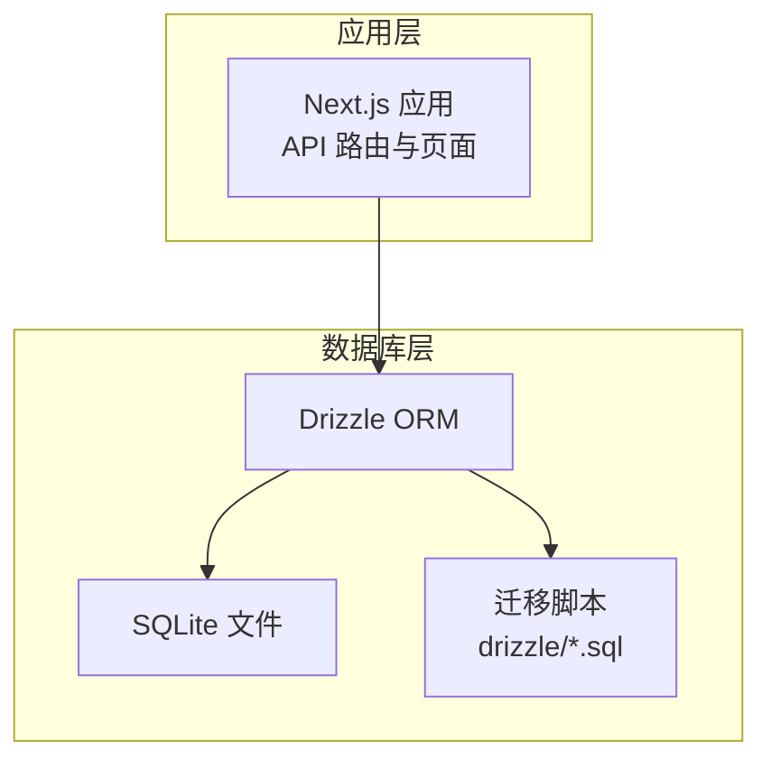
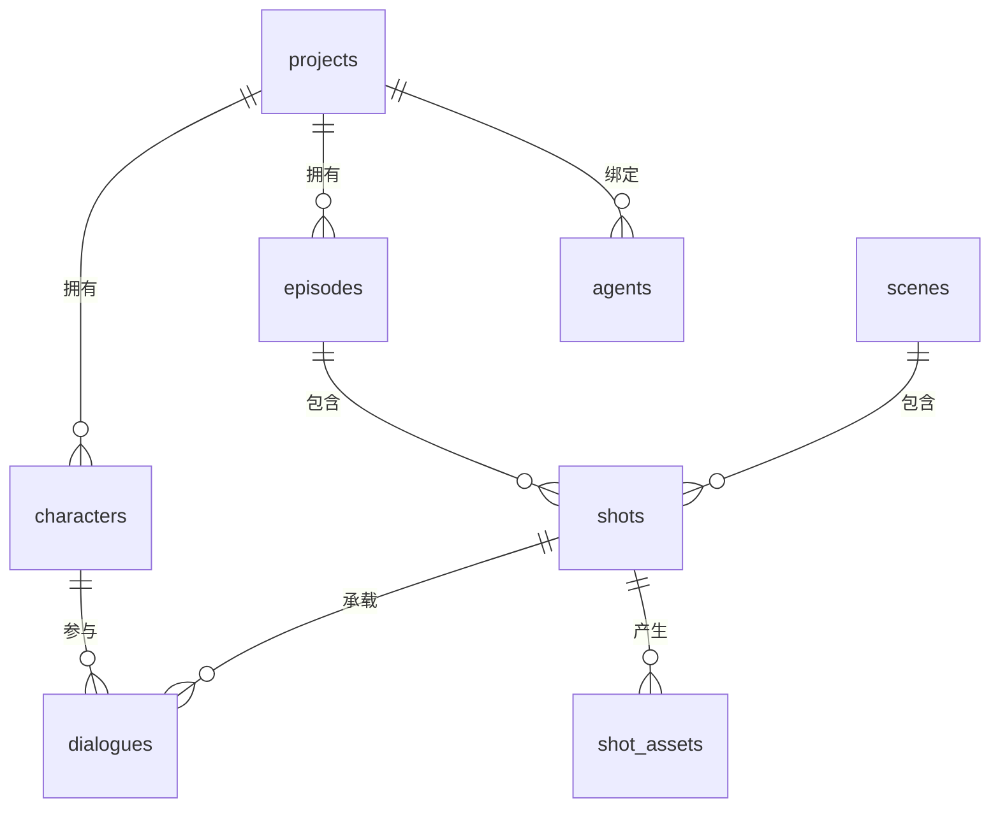
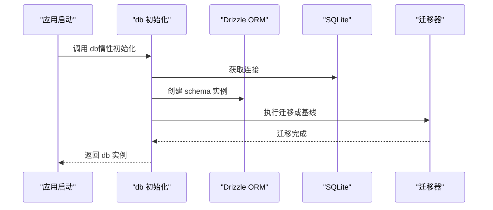

# 数据库架构

<cite>
**本文引用的文件**
- [drizzle.config.ts](file://drizzle.config.ts)
- [0000_chemical_tyrannus.sql](file://drizzle/0000_chemical_tyrannus.sql)
- [0010_add_episodes.sql](file://drizzle/0010_add_episodes.sql)
- [0013_add_episode_characters.sql](file://drizzle/0013_add_episode_characters.sql)
- [0026_add_scenes_table.sql](file://drizzle/0026_add_scenes_table.sql)
- [0050_add_shot_assets.sql](file://drizzle/0050_add_shot_assets.sql)
- [0052_add_agents.sql](file://drizzle/0052_add_agents.sql)
- [0053_add_agent_platform.sql](file://drizzle/0053_add_agent_platform.sql)
- [0000_snapshot.json](file://drizzle/meta/0000_snapshot.json)
- [index.ts](file://src/lib/db/index.ts)
</cite>

## 目录
1. [简介](#简介)
2. [项目结构](#项目结构)
3. [核心组件](#核心组件)
4. [架构总览](#架构总览)
5. [详细组件分析](#详细组件分析)
6. [依赖分析](#依赖分析)
7. [性能考虑](#性能考虑)
8. [故障排除指南](#故障排除指南)
9. [结论](#结论)
10. [附录](#附录)

## 简介
本文件系统性梳理 AIComicBuilder 的数据库架构与表结构设计，覆盖核心实体（projects、episodes、characters、shots、scenes、dialogues、shot_assets、agents 等）的字段定义、数据类型、约束条件、索引策略、默认值与校验规则，并解释实体间的关系与外键约束。同时提供 ER 图与架构图，标注字段级注释与业务含义，给出典型示例数据与使用场景，帮助开发者与产品人员快速理解与维护数据库。

## 项目结构
数据库相关实现采用 Drizzle ORM + SQLite 的本地化方案，通过迁移脚本逐步演进数据库结构。迁移文件位于 drizzle 目录，配置文件 drizzle.config.ts 指定 schema 与输出路径；运行时通过 src/lib/db/index.ts 初始化连接、执行迁移并暴露统一的 db 访问接口。

图表来源
- [drizzle.config.ts](file://drizzle.config.ts)
- [index.ts](file://src/lib/db/index.ts)

章节来源
- [drizzle.config.ts](file://drizzle.config.ts)
- [index.ts](file://src/lib/db/index.ts)

## 核心组件
本节概述数据库中的关键实体及其职责边界：
- projects：项目根实体，承载全局设定、状态与元信息
- episodes：项目分集，按顺序组织剧情与生成任务
- characters：角色，支持主/客串范围与视觉提示
- scenes：镜头场景，承载构图、焦点、景深等视觉参数
- shots：镜头单元，连接场景、分集与资产
- dialogues：对白，绑定镜头与角色，支持音频与序列
- shot_assets：镜头资产，存储生成资源与引用图像
- agents：智能体配置，支持平台扩展
- agent_bindings：项目到智能体的绑定关系

章节来源
- [0010_add_episodes.sql](file://drizzle/0010_add_episodes.sql)
- [0013_add_episode_characters.sql](file://drizzle/0013_add_episode_characters.sql)
- [0026_add_scenes_table.sql](file://drizzle/0026_add_scenes_table.sql)
- [0050_add_shot_assets.sql](file://drizzle/0050_add_shot_assets.sql)
- [0052_add_agents.sql](file://drizzle/0052_add_agents.sql)
- [0053_add_agent_platform.sql](file://drizzle/0053_add_agent_platform.sql)

## 架构总览
下图展示核心实体间的层级关系与外键约束，体现从项目到分集、再到镜头与资产的完整链路。

图表来源
- [0010_add_episodes.sql](file://drizzle/0010_add_episodes.sql)
- [0013_add_episode_characters.sql](file://drizzle/0013_add_episode_characters.sql)
- [0026_add_scenes_table.sql](file://drizzle/0026_add_scenes_table.sql)
- [0050_add_shot_assets.sql](file://drizzle/0050_add_shot_assets.sql)
- [0052_add_agents.sql](file://drizzle/0052_add_agents.sql)
- [0053_add_agent_platform.sql](file://drizzle/0053_add_agent_platform.sql)

## 详细组件分析

### projects 表
- 字段与类型
  - id：主键，文本标识
  - user_id：用户标识（用于权限归属）
  - idea：项目创意摘要
  - script：项目脚本
  - world_setting：世界观设定
  - status：项目状态
  - generation_mode：生成模式
  - final_video_url：最终视频链接
  - created_at / updated_at：时间戳
  - 其他扩展列：如目标时长、配色板、BGM 等（见后续迁移）
- 约束与默认值
  - 主键 id
  - 外键 user_id 可选（取决于具体实现）
  - 默认值与校验在迁移中逐步添加
- 业务含义
  - 项目级元数据与生成配置的根容器
- 示例数据
  - id: "proj-uuid"
  - user_id: "user-uuid"
  - idea: "太空歌剧题材"
  - script: "第一集大纲..."
  - status: "draft"
  - generation_mode: "keyframe"
  - created_at: 1700000000
  - updated_at: 1700000000
- 使用场景
  - 创建新项目、导入旧项目、设置生成模式与导出成品

章节来源
- [0000_chemical_tyrannus.sql](file://drizzle/0000_chemical_tyrannus.sql)
- [0000_snapshot.json](file://drizzle/meta/0000_snapshot.json)

### episodes 表
- 字段与类型
  - id：主键
  - project_id：外键关联 projects
  - title：标题
  - sequence：排序序号
  - idea/script/status/generation_mode/final_video_url：沿用项目级字段
  - created_at / updated_at：时间戳
- 约束与默认值
  - 主键 id
  - 外键 project_id 引用 projects(id)，删除级联
  - 默认 generation_mode 与 status
- 业务含义
  - 将项目拆分为多集，便于分步生成与管理
- 示例数据
  - id: "ep-uuid"
  - project_id: "proj-uuid"
  - title: "第1集"
  - sequence: 1
  - status: "draft"
  - created_at: 1700000000
  - updated_at: 1700000000
- 使用场景
  - 新建分集、重排顺序、回填历史数据

章节来源
- [0010_add_episodes.sql](file://drizzle/0010_add_episodes.sql)
- [0000_snapshot.json](file://drizzle/meta/0000_snapshot.json)

### characters 表
- 字段与类型
  - id：主键
  - project_id：外键 projects
  - scope：角色范围（主/客串），带 CHECK 约束
  - 其他扩展列：身高、体型、视觉提示等（见后续迁移）
- 约束与默认值
  - 主键 id
  - 外键 project_id 引用 projects(id)，删除级联
  - scope 默认值与枚举校验
- 业务含义
  - 角色维度的数据与范围控制
- 示例数据
  - id: "char-uuid"
  - project_id: "proj-uuid"
  - scope: "main"
- 使用场景
  - 添加角色、区分主客串、角色关系建立

章节来源
- [0010_add_episodes.sql](file://drizzle/0010_add_episodes.sql)
- [0013_add_episode_characters.sql](file://drizzle/0013_add_episode_characters.sql)
- [0000_snapshot.json](file://drizzle/meta/0000_snapshot.json)

### scenes 表
- 字段与类型
  - id：主键
  - project_id：外键 projects
  - title/description：场景描述
  - color_palette/world_setting/target_duration 等：扩展字段（见后续迁移）
- 约束与默认值
  - 主键 id
  - 外键 project_id 引用 projects(id)，删除级联
- 业务含义
  - 场景级视觉与风格参数的载体
- 示例数据
  - id: "scene-uuid"
  - project_id: "proj-uuid"
  - title: "太空站内部"
- 使用场景
  - 定义场景风格、配色、目标时长等

章节来源
- [0026_add_scenes_table.sql](file://drizzle/0026_add_scenes_table.sql)
- [0000_snapshot.json](file://drizzle/meta/0000_snapshot.json)

### shots 表
- 字段与类型
  - id：主键
  - episode_id：外键 episodes
  - scene_id：可选外键 scenes
  - title/description/note：镜头描述
  - actions：动作集合（见后续迁移）
  - target_duration：目标时长
  - composition_guide/focal_point/depth_of_field/sound_design/music_cue/performance_style 等：扩展字段（见后续迁移）
  - is_stale：过期标记（见后续迁移）
- 约束与默认值
  - 主键 id
  - 外键 episode_id 引用 episodes(id)，删除级联
  - 外键 scene_id 引用 scenes(id)，可空
- 业务含义
  - 镜头级生成参数与动作编排
- 示例数据
  - id: "shot-uuid"
  - episode_id: "ep-uuid"
  - scene_id: "scene-uuid"
  - title: "特写：主角表情"
  - target_duration: 3
- 使用场景
  - 镜头规划、动作标注、参数下发

章节来源
- [0026_add_scenes_table.sql](file://drizzle/0026_add_scenes_table.sql)
- [0050_add_shot_assets.sql](file://drizzle/0050_add_shot_assets.sql)
- [0000_snapshot.json](file://drizzle/meta/0000_snapshot.json)

### dialogues 表
- 字段与类型
  - id：主键
  - shot_id：外键 shots
  - character_id：外键 characters
  - text：对白内容
  - audio_url：音频链接
  - sequence：对白顺序（默认 0）
- 约束与默认值
  - 主键 id
  - 外键 shot_id 引用 shots(id)，删除级联
  - 外键 character_id 引用 characters(id)，删除级联
  - sequence 默认 0
- 业务含义
  - 对白与角色、镜头的绑定，支持音频集成
- 示例数据
  - id: "dlg-uuid"
  - shot_id: "shot-uuid"
  - character_id: "char-uuid"
  - text: "我们得离开这里。"
  - sequence: 1
- 使用场景
  - 对白生成与配音、对白排序

章节来源
- [0000_snapshot.json](file://drizzle/meta/0000_snapshot.json)

### shot_assets 表
- 字段与类型
  - id：主键
  - shot_id：外键 shots
  - url：资源地址
  - type：资源类型
  - metadata：元数据 JSON
  - created_at：时间戳
- 约束与默认值
  - 主键 id
  - 外键 shot_id 引用 shots(id)，删除级联
- 业务含义
  - 存储镜头生成产物与中间资源
- 示例数据
  - id: "asset-uuid"
  - shot_id: "shot-uuid"
  - url: "https://cdn.example.com/frame_001.png"
  - type: "image"
  - created_at: 1700000000
- 使用场景
  - 保存关键帧、参考图、视频片段等

章节来源
- [0050_add_shot_assets.sql](file://drizzle/0050_add_shot_assets.sql)
- [0000_snapshot.json](file://drizzle/meta/0000_snapshot.json)

### agents 表
- 字段与类型
  - id：主键
  - name：名称
  - config：配置 JSON
  - platform：平台（见后续迁移）
  - created_at / updated_at：时间戳
- 约束与默认值
  - 主键 id
  - platform 建议带枚举校验（见后续迁移）
- 业务含义
  - 智能体抽象，支持多平台扩展
- 示例数据
  - id: "agent-uuid"
  - name: "Coze-ScriptAgent"
  - platform: "coze"
- 使用场景
  - 绑定项目智能体、切换生成管线

章节来源
- [0052_add_agents.sql](file://drizzle/0052_add_agents.sql)
- [0053_add_agent_platform.sql](file://drizzle/0053_add_agent_platform.sql)
- [0000_snapshot.json](file://drizzle/meta/0000_snapshot.json)

### agent_bindings 表
- 字段与类型
  - id：主键
  - project_id：外键 projects
  - agent_id：外键 agents
  - binding_config：绑定配置 JSON
  - created_at / updated_at：时间戳
- 约束与默认值
  - 主键 id
  - 外键 project_id 引用 projects(id)，删除级联
  - 外键 agent_id 引用 agents(id)，删除级联
- 业务含义
  - 项目与智能体的绑定关系
- 示例数据
  - id: "binding-uuid"
  - project_id: "proj-uuid"
  - agent_id: "agent-uuid"
- 使用场景
  - 为项目选择并绑定智能体

章节来源
- [0052_add_agents.sql](file://drizzle/0052_add_agents.sql)
- [0000_snapshot.json](file://drizzle/meta/0000_snapshot.json)

## 依赖分析
- 运行时初始化
  - 通过 src/lib/db/index.ts 创建 SQLite 连接，加载 Drizzle schema 并执行迁移
  - 支持基线迁移（针对已有 schema 且无迁移历史的情况）
- 迁移与版本
  - 迁移脚本位于 drizzle 目录，按序号递增命名
  - 通过 __drizzle_migrations 表记录已执行迁移
- 外键与级联
  - 多处删除级联（CASCADE）确保删除父实体时清理子实体
  - 架构快照（0000_snapshot.json）明确外键关系与默认值

图表来源
- [index.ts](file://src/lib/db/index.ts)

章节来源
- [index.ts](file://src/lib/db/index.ts)
- [0000_snapshot.json](file://drizzle/meta/0000_snapshot.json)

## 性能考虑
- 索引策略
  - 当前快照未显示显式索引，建议在高频查询字段上建立索引（如 projects.user_id、episodes.project_id、shots.episode_id、dialogues.shot_id/character_id、shot_assets.shot_id）
- 查询优化
  - 使用 JOIN 时限定必要字段，避免 SELECT *
  - 对分页与排序字段（如 sequence、created_at）建立复合索引
- 写入优化
  - 批量插入迁移与回填数据（如 episodes 回填 shots.episode_id）
  - 合理使用事务减少提交开销

## 故障排除指南
- 迁移失败
  - 检查 __drizzle_migrations 是否存在且与当前迁移一致
  - 若检测到现有 schema 但无迁移历史，将触发基线迁移流程
- 外键约束错误
  - 删除父实体前先清理子实体，或确认 CASCADE 策略是否符合预期
- 字段缺失
  - 某些扩展字段（如 agents.platform）可能在旧版本不存在，需等待迁移执行

章节来源
- [index.ts](file://src/lib/db/index.ts)
- [0000_snapshot.json](file://drizzle/meta/0000_snapshot.json)

## 结论
本数据库架构以 Drizzle ORM + SQLite 为基础，通过增量迁移逐步完善表结构与字段能力。核心实体围绕“项目—分集—镜头—资产”展开，辅以角色、场景与智能体绑定，满足漫画/短视频生成的全流程数据需求。建议后续补充索引、完善字段校验与默认值，并持续通过迁移演进功能边界。

## 附录
- 字段级注释与业务含义
  - user_id：用户标识，用于权限与归属
  - idea/script：创意与脚本内容，支持回填与导出
  - status/generation_mode：项目与分集状态与生成模式
  - target_duration：目标时长，用于节奏控制
  - color_palette/world_setting：风格与设定参数
  - composition_guide/focal_point/depth_of_field：构图与摄影参数
  - sound_design/music_cue/performance_style：音效与表演风格
  - actions：镜头动作集合
  - audio_url：对白音频链接
  - sequence：对白与排序序号
  - is_stale：过期标记，用于脏数据识别
  - platform：智能体平台标识
  - binding_config：绑定配置 JSON
- 示例数据使用场景
  - 项目导入：回填 projects.idea/script/status
  - 分集生成：基于 episodes.sequence 排序生成
  - 镜头参数：shots.target_duration + scenes.color_palette
  - 对白合成：dialogues.text + audio_url
  - 资产归档：shot_assets.url/type/metadata
  - 智能体绑定：agent_bindings.project_id → agent_id