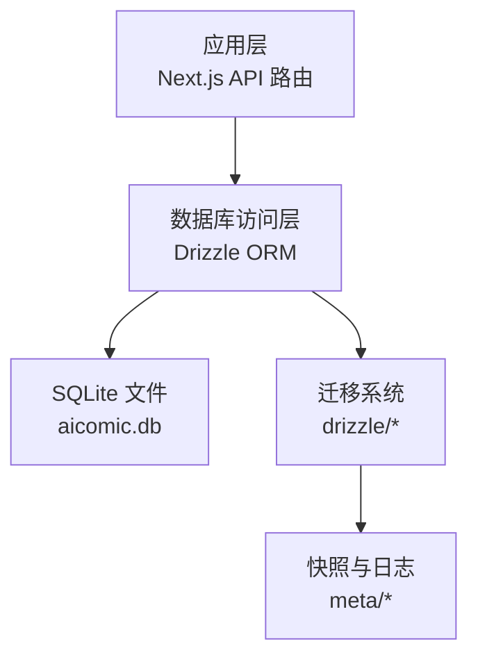
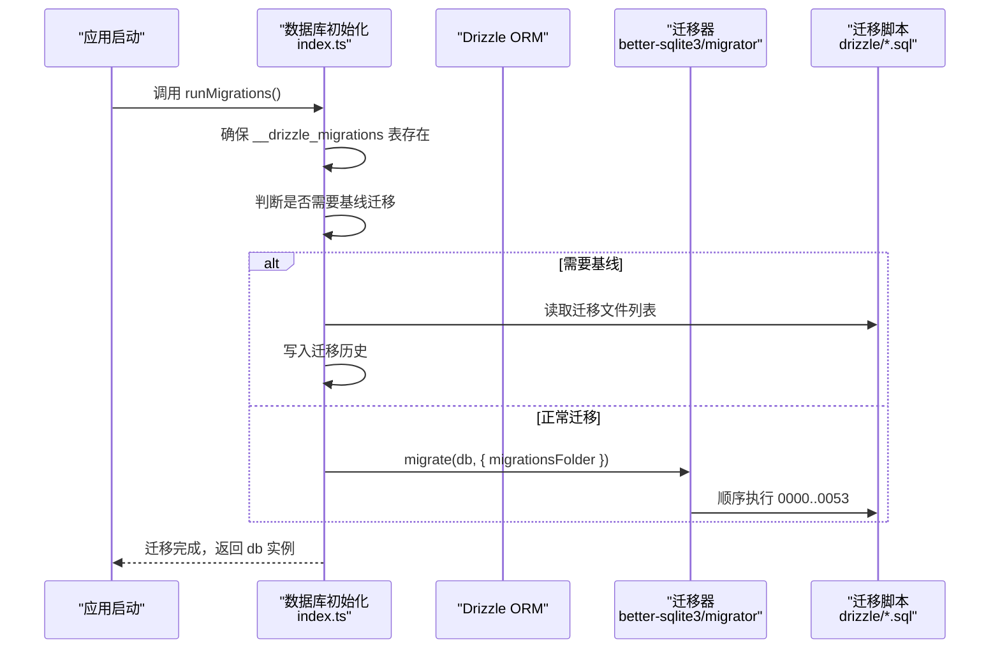
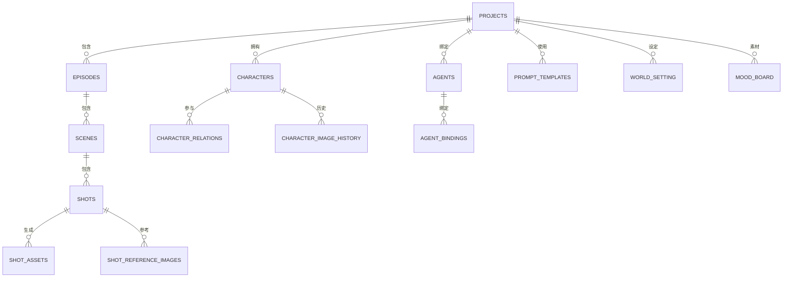
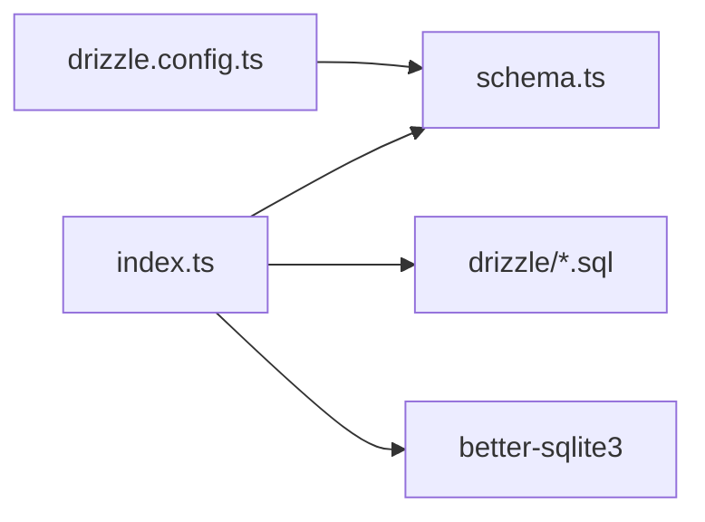

# 数据库设计

<cite>
**本文引用的文件**
- [drizzle.config.ts](file://drizzle.config.ts)
- [schema.ts](file://src/lib/db/schema.ts)
- [index.ts](file://src/lib/db/index.ts)
- [0000_chemical_tyrannus.sql](file://drizzle/0000_chemical_tyrannus.sql)
- [0001_add_user_id.sql](file://drizzle/0001_add_user_id.sql)
- [0002_add_generation_mode.sql](file://drizzle/0002_add_generation_mode.sql)
- [0003_add_reference_video_url.sql](file://drizzle/0003_add_reference_video_url.sql)
- [0004_add_last_frame_url.sql](file://drizzle/0004_add_last_frame_url.sql)
- [0005_add_scene_ref_frame.sql](file://drizzle/0005_add_scene_ref_frame.sql)
- [0006_add_video_script.sql](file://drizzle/0006_add_video_script.sql)
- [0007_add_storyboard_versions.sql](file://drizzle/0007_add_storyboard_versions.sql)
- [0008_add_video_prompt.sql](file://drizzle/0008_add_video_prompt.sql)
- [0009_add_character_visual_hint.sql](file://drizzle/0009_add_character_visual_hint.sql)
- [0010_add_episodes.sql](file://drizzle/0010_add_episodes.sql)
- [0011_add_episode_description_keywords.sql](file://drizzle/0011_add_episode_description_keywords.sql)
- [0012_add_import_logs.sql](file://drizzle/0012_add_import_logs.sql)
- [0013_add_episode_characters.sql](file://drizzle/0013_add_episode_characters.sql)
- [0014_add_prompt_templates.sql](file://drizzle/0014_add_prompt_templates.sql)
- [0015_add_use_project_prompts.sql](file://drizzle/0015_add_use_project_prompts.sql)
- [0016_add_transition_in.sql](file://drizzle/0016_add_transition_in.sql)
- [0017_add_transition_out.sql](file://drizzle/0017_add_transition_out.sql)
- [0018_add_dialogue_start_ratio.sql](file://drizzle/0018_add_dialogue_start_ratio.sql)
- [0019_add_dialogue_end_ratio.sql](file://drizzle/0019_add_dialogue_end_ratio.sql)
- [0020_add_shot_is_stale.sql](file://drizzle/0020_add_shot_is_stale.sql)
- [0021_add_character_is_stale.sql](file://drizzle/0021_add_character_is_stale.sql)
- [0022_add_episode_script_hash.sql](file://drizzle/0022_add_episode_script_hash.sql)
- [0023_add_project_outline.sql](file://drizzle/0023_add_project_outline.sql)
- [0024_add_episode_outline.sql](file://drizzle/0024_add_episode_outline.sql)
- [0025_add_character_relations.sql](file://drizzle/0025_add_character_relations.sql)
- [0026_add_scenes_table.sql](file://drizzle/0026_add_scenes_table.sql)
- [0027_add_shot_scene_id.sql](file://drizzle/0027_add_shot_scene_id.sql)
- [0028_add_composition_guide.sql](file://drizzle/0028_add_composition_guide.sql)
- [0029_add_project_color_palette.sql](file://drizzle/0029_add_project_color_palette.sql)
- [0030_add_episode_color_palette.sql](file://drizzle/0030_add_episode_color_palette.sql)
- [0031_add_world_setting.sql](file://drizzle/0031_add_world_setting.sql)
- [0032_add_project_target_duration.sql](file://drizzle/0032_add_project_target_duration.sql)
- [0033_add_episode_target_duration.sql](file://drizzle/0033_add_episode_target_duration.sql)
- [0034_add_focal_point.sql](file://drizzle/0034_add_focal_point.sql)
- [0035_add_depth_of_field.sql](file://drizzle/0035_add_depth_of_field.sql)
- [0036_add_sound_design.sql](file://drizzle/0036_add_sound_design.sql)
- [0037_add_music_cue.sql](file://drizzle/0037_add_music_cue.sql)
- [0038_add_performance_style.sql](file://drizzle/0038_add_performance_style.sql)
- [0039_add_character_height_cm.sql](file://drizzle/0039_add_character_height_cm.sql)
- [0040_add_character_body_type.sql](file://drizzle/0040_add_character_body_type.sql)
- [0041_add_costume_sets.sql](file://drizzle/0041_add_costume_sets.sql)
- [0042_add_shot_costume_overrides.sql](file://drizzle/0042_add_shot_costume_overrides.sql)
- [0043_add_project_bgm_url.sql](file://drizzle/0043_add_project_bgm_url.sql)
- [0044_add_episode_bgm_url.sql](file://drizzle/0044_add_episode_bgm_url.sql)
- [0045_add_mood_board.sql](file://drizzle/0045_add_mood_board.sql)
- [0046_add_shot_actions.sql](file://drizzle/0046_add_shot_actions.sql)
- [0047_add_prompt_ab_tests.sql](file://drizzle/0047_add_prompt_ab_tests.sql)
- [0048_add_shot_reference_images.sql](file://drizzle/0048_add_shot_reference_images.sql)
- [0049_add_character_image_history.sql](file://drizzle/0049_add_character_image_history.sql)
- [0050_add_shot_assets.sql](file://drizzle/0050_add_shot_assets.sql)
- [0051_drop_legacy_shot_columns.sql](file://drizzle/0051_drop_legacy_shot_columns.sql)
- [0052_add_agents.sql](file://drizzle/0052_add_agents.sql)
- [0053_add_agent_platform.sql](file://drizzle/0053_add_agent_platform.sql)
</cite>

## 目录
1. [简介](#简介)
2. [项目结构](#项目结构)
3. [核心组件](#核心组件)
4. [架构总览](#架构总览)
5. [详细组件分析](#详细组件分析)
6. [依赖分析](#依赖分析)
7. [性能考虑](#性能考虑)
8. [故障排查指南](#故障排查指南)
9. [结论](#结论)
10. [附录](#附录)

## 简介
本文件为 AIComicBuilder 的数据库设计与实现文档，聚焦于 SQLite + Drizzle ORM 的本地化数据库方案。内容涵盖：实体关系模型、字段定义与数据类型、主键/外键与索引、约束与校验规则、业务规则、数据访问模式、缓存策略、性能考量、数据生命周期与归档、迁移路径与版本管理、数据安全与隐私、以及 Drizzle ORM 使用指南与最佳实践。

## 项目结构
数据库相关的核心位置如下：
- 配置与迁移
  - Drizzle 配置：[drizzle.config.ts](file://drizzle.config.ts)
  - 迁移脚本目录：drizzle/
  - 快照与迁移日志：drizzle/meta/
- 模式定义
  - 实体与表结构：[schema.ts](file://src/lib/db/schema.ts)
- 运行时初始化与迁移执行
  - 初始化与迁移入口：[index.ts](file://src/lib/db/index.ts)

图表来源
- [drizzle.config.ts:1-10](file://drizzle.config.ts#L1-L10)
- [index.ts:156-172](file://src/lib/db/index.ts#L156-L172)

章节来源
- [drizzle.config.ts:1-10](file://drizzle.config.ts#L1-L10)
- [index.ts:156-172](file://src/lib/db/index.ts#L156-L172)

## 核心组件
- Drizzle 配置
  - 方言：sqlite
  - 模式文件路径：src/lib/db/schema.ts
  - 数据库文件路径：通过 DATABASE_URL 或默认 file:./data/aicomic.db
- 迁移系统
  - 迁移脚本位于 drizzle/，以递增序号命名（如 0000_*.sql）
  - 运行时通过 runMigrations() 执行迁移，支持“基线”现有 schema 的场景
- 数据库实例
  - 通过懒加载代理导出 db 对象，内部使用 better-sqlite3 连接
  - 提供迁移历史表 __drizzle_migrations 的维护与查询

章节来源
- [drizzle.config.ts:1-10](file://drizzle.config.ts#L1-L10)
- [index.ts:46-55](file://src/lib/db/index.ts#L46-L55)
- [index.ts:81-89](file://src/lib/db/index.ts#L81-L89)
- [index.ts:156-172](file://src/lib/db/index.ts#L156-L172)

## 架构总览
下图展示从应用到数据库的调用链路与迁移流程：

图表来源
- [index.ts:156-172](file://src/lib/db/index.ts#L156-L172)
- [index.ts:135-154](file://src/lib/db/index.ts#L135-L154)

## 详细组件分析

### 实体关系模型与表结构概览
基于迁移脚本与模式文件，可归纳出以下核心实体与关系：
- 项目 Projects
- 集 / 剧集 Episodes
- 场景 Scenes
- 镜头 / 分镜 Shots
- 角色 Characters
- 角色关系 CharacterRelations
- 角色服装 CostumeSets / ShotCostumeOverrides
- 视频资产 ShotAssets
- 参考图片 ShotReferenceImages
- 角色图像历史 CharacterImageHistory
- 代理 Agents / AgentBindings
- 提示词模板 PromptTemplates / PromptABTests
- 世界设定 WorldSetting
- 聚合板 MoodBoard
- 导航与元信息（如导入日志 ImportLogs）

图表来源
- [schema.ts](file://src/lib/db/schema.ts)
- [0010_add_episodes.sql](file://drizzle/0010_add_episodes.sql)
- [0026_add_scenes_table.sql](file://drizzle/0026_add_scenes_table.sql)
- [0050_add_shot_assets.sql](file://drizzle/0050_add_shot_assets.sql)
- [0048_add_shot_reference_images.sql](file://drizzle/0048_add_shot_reference_images.sql)
- [0049_add_character_image_history.sql](file://drizzle/0049_add_character_image_history.sql)
- [0052_add_agents.sql](file://drizzle/0052_add_agents.sql)
- [0014_add_prompt_templates.sql](file://drizzle/0014_add_prompt_templates.sql)
- [0031_add_world_setting.sql](file://drizzle/0031_add_world_setting.sql)
- [0045_add_mood_board.sql](file://drizzle/0045_add_mood_board.sql)

章节来源
- [schema.ts](file://src/lib/db/schema.ts)
- [0010_add_episodes.sql](file://drizzle/0010_add_episodes.sql)
- [0026_add_scenes_table.sql](file://drizzle/0026_add_scenes_table.sql)
- [0050_add_shot_assets.sql](file://drizzle/0050_add_shot_assets.sql)
- [0048_add_shot_reference_images.sql](file://drizzle/0048_add_shot_reference_images.sql)
- [0049_add_character_image_history.sql](file://drizzle/0049_add_character_image_history.sql)
- [0052_add_agents.sql](file://drizzle/0052_add_agents.sql)
- [0014_add_prompt_templates.sql](file://drizzle/0014_add_prompt_templates.sql)
- [0031_add_world_setting.sql](file://drizzle/0031_add_world_setting.sql)
- [0045_add_mood_board.sql](file://drizzle/0045_add_mood_board.sql)

### 字段定义与数据类型
以下为常见字段类别与典型含义（非完整清单）：
- 标识符
  - 主键：自增整数或 UUID 字符串（依据模式定义）
  - 外键：指向关联表主键
- 文本类
  - 短文本：标题、名称、平台名等
  - 长文本：描述、提示词、JSON 结构、URL
- 数值类
  - 整数：计数、索引、帧编号、时长（秒/帧）、比例
  - 浮点：比例、焦距、景深参数
- 时间戳
  - 创建/更新时间、迁移时间
- 布尔
  - 启用/禁用、过期标记（stale）、是否使用项目级模板
- JSON/数组
  - 提示词模板、颜色板、目标时长、动作序列、AB 测试参数

章节来源
- [schema.ts](file://src/lib/db/schema.ts)
- [0000_chemical_tyrannus.sql](file://drizzle/0000_chemical_tyrannus.sql)
- [0014_add_prompt_templates.sql](file://drizzle/0014_add_prompt_templates.sql)
- [0029_add_project_color_palette.sql](file://drizzle/0029_add_project_color_palette.sql)
- [0032_add_project_target_duration.sql](file://drizzle/0032_add_project_target_duration.sql)
- [0046_add_shot_actions.sql](file://drizzle/0046_add_shot_actions.sql)
- [0047_add_prompt_ab_tests.sql](file://drizzle/0047_add_prompt_ab_tests.sql)

### 主键、外键、索引与约束
- 主键
  - 各表均有唯一标识列；部分表采用自增主键，部分采用 UUID
- 外键
  - 项目-集/剧集、集-场景、场景-镜头、角色-图像历史、代理-绑定等形成层级外键
- 索引
  - 常见组合：(projectId, createdAt)、(episodeId, index)、(characterId, createdAt)
  - JSON 查询字段建议按需建立虚拟列并索引（参见性能章节）
- 约束
  - NOT NULL、UNIQUE（如邮箱、模板键）、CHECK（如比例范围 0..1）

章节来源
- [schema.ts](file://src/lib/db/schema.ts)
- [0013_add_episode_characters.sql](file://drizzle/0013_add_episode_characters.sql)
- [0027_add_shot_scene_id.sql](file://drizzle/0027_add_shot_scene_id.sql)

### 数据验证规则与业务规则
- 项目维度
  - user_id 限定项目归属；generation_mode 控制生成策略；target_duration 限制视频时长
- 镜头维度
  - shot_is_stale 标记是否失效；transition_* 定义转场；dialogue_* 定义对白区间；focal_point / depth_of_field 定义构图参数
- 角色维度
  - character_is_stale 标记；height_cm / body_type 描述；costume_sets 与 shot overrides 组合
- 提示词维度
  - use_project_prompts 控制模板来源；prompt_ab_tests 支持 A/B 实验
- 世界设定与素材
  - world_setting 与 mood_board 作为全局资源池

章节来源
- [0001_add_user_id.sql](file://drizzle/0001_add_user_id.sql)
- [0002_add_generation_mode.sql](file://drizzle/0002_add_generation_mode.sql)
- [0032_add_project_target_duration.sql](file://drizzle/0032_add_project_target_duration.sql)
- [0020_add_shot_is_stale.sql](file://drizzle/0020_add_shot_is_stale.sql)
- [0018_add_dialogue_start_ratio.sql](file://drizzle/0018_add_dialogue_start_ratio.sql)
- [0019_add_dialogue_end_ratio.sql](file://drizzle/0019_add_dialogue_end_ratio.sql)
- [0034_add_focal_point.sql](file://drizzle/0034_add_focal_point.sql)
- [0035_add_depth_of_field.sql](file://drizzle/0035_add_depth_of_field.sql)
- [0021_add_character_is_stale.sql](file://drizzle/0021_add_character_is_stale.sql)
- [0039_add_character_height_cm.sql](file://drizzle/0039_add_character_height_cm.sql)
- [0040_add_character_body_type.sql](file://drizzle/0040_add_character_body_type.sql)
- [0041_add_costume_sets.sql](file://drizzle/0041_add_costume_sets.sql)
- [0042_add_shot_costume_overrides.sql](file://drizzle/0042_add_shot_costume_overrides.sql)
- [0015_add_use_project_prompts.sql](file://drizzle/0015_add_use_project_prompts.sql)
- [0047_add_prompt_ab_tests.sql](file://drizzle/0047_add_prompt_ab_tests.sql)
- [0031_add_world_setting.sql](file://drizzle/0031_add_world_setting.sql)
- [0045_add_mood_board.sql](file://drizzle/0045_add_mood_board.sql)

### 示例数据
- 项目
  - 字段示例：title、description、user_id、generation_mode、target_duration、color_palette、bgm_url、outline
- 剧集
  - 字段示例：projectId、index、title、description、keywords、outline、target_duration、bgm_url、script_hash
- 镜头
  - 字段示例：episodeId、sceneId、index、title、is_stale、transition_in/out、dialogue_start/end_ratio、focal_point、depth_of_field、actions、reference_images、assets
- 角色
  - 字段示例：projectId、name、visual_hint、height_cm、body_type、costume_sets、image_history
- 代理
  - 字段示例：name、platform
- 提示词模板
  - 字段示例：projectId、key、content、use_project_prompts、versions（JSON）

章节来源
- [0000_chemical_tyrannus.sql](file://drizzle/0000_chemical_tyrannus.sql)
- [0010_add_episodes.sql](file://drizzle/0010_add_episodes.sql)
- [0026_add_scenes_table.sql](file://drizzle/0026_add_scenes_table.sql)
- [0050_add_shot_assets.sql](file://drizzle/0050_add_shot_assets.sql)
- [0048_add_shot_reference_images.sql](file://drizzle/0048_add_shot_reference_images.sql)
- [0049_add_character_image_history.sql](file://drizzle/0049_add_character_image_history.sql)
- [0052_add_agents.sql](file://drizzle/0052_add_agents.sql)
- [0014_add_prompt_templates.sql](file://drizzle/0014_add_prompt_templates.sql)

### 数据访问模式与缓存策略
- 访问模式
  - 读多写少：项目/剧集/角色/模板等静态数据优先缓存
  - 写操作：镜头/资产/历史等高频变更数据采用事务批量提交
- 缓存策略
  - 应用层 LRU 缓存：最近使用的项目/剧集/角色数据
  - SQL 层：利用索引覆盖查询，避免全表扫描
  - 会话缓存：用户会话内复用查询结果
- 性能优化
  - 预编译语句与参数化查询
  - 批量插入/更新（事务包裹）
  - 仅选择必要列，避免 SELECT *

章节来源
- [index.ts:46-55](file://src/lib/db/index.ts#L46-L55)
- [schema.ts](file://src/lib/db/schema.ts)

### 数据生命周期、保留策略与归档
- 生命周期
  - 项目：长期保存；删除项目时级联清理剧集/镜头/资产/历史
  - 剧集：随项目生命周期；可按时间归档旧剧集
  - 镜头：生成失败或 stale 标记后可清理；资产按引用计数回收
  - 角色：变更频繁但保留历史；历史表定期清理
- 保留策略
  - 默认保留最近 N 个月的生成记录与资产
  - 用户可设置自动清理阈值
- 归档规则
  - 按项目/年份/季度归档；归档后只读
  - 归档数据仍可恢复至活动状态

章节来源
- [schema.ts](file://src/lib/db/schema.ts)
- [0020_add_shot_is_stale.sql](file://drizzle/0020_add_shot_is_stale.sql)
- [0021_add_character_is_stale.sql](file://drizzle/0021_add_character_is_stale.sql)

### 迁移路径与版本管理
- 迁移脚本
  - 以 0000..0053 顺序命名，每个脚本对应一次模式演进
  - 支持增量迁移与回滚（通过迁移历史表）
- 版本管理
  - 通过 __drizzle_migrations 记录已执行迁移哈希与时间
  - 基线迁移：检测现有 schema 并一次性写入历史
- 运行方式
  - 开发环境：直接执行 migrate
  - 生产环境：确保迁移历史一致后再运行

章节来源
- [index.ts:81-89](file://src/lib/db/index.ts#L81-L89)
- [index.ts:135-154](file://src/lib/db/index.ts#L135-L154)
- [index.ts:156-172](file://src/lib/db/index.ts#L156-L172)

### 数据安全、隐私与访问控制
- 存储安全
  - SQLite 文件权限最小化；生产环境建议加密存储
  - 传输：本地文件；若远程访问需经受控通道
- 隐私保护
  - 用户数据与生成内容分离存储；敏感字段脱敏
  - 删除请求：彻底清除相关记录与资产
- 访问控制
  - user_id 限定项目可见性与修改权
  - API 层统一鉴权与授权检查

章节来源
- [0001_add_user_id.sql](file://drizzle/0001_add_user_id.sql)
- [index.ts:115-125](file://src/lib/db/index.ts#L115-L125)

### Drizzle ORM 使用指南与最佳实践
- 初始化
  - 通过懒加载代理导出 db，首次访问时创建连接与实例
- 查询
  - 使用 schema 中定义的表对象进行类型安全查询
  - 优先使用参数化查询与预编译语句
- 写入
  - 事务包裹批量写入，保证一致性
  - 对 JSON 字段使用 JSON 函数进行条件筛选（如适用）
- 迁移
  - 新增字段/表时配套迁移脚本
  - 迁移前备份数据库文件
- 调试
  - 在开发环境打印 SQL 与执行计划
  - 使用事务隔离级别与回滚点定位问题

章节来源
- [index.ts:46-55](file://src/lib/db/index.ts#L46-L55)
- [index.ts:174-184](file://src/lib/db/index.ts#L174-L184)
- [schema.ts](file://src/lib/db/schema.ts)

## 依赖分析
- Drizzle 配置依赖
  - drizzle.config.ts 指定 schema 路径与数据库文件路径
- 运行时依赖
  - index.ts 依赖 schema.ts 定义的表结构
  - 迁移依赖 drizzle/ 下的 SQL 脚本
- 外部依赖
  - better-sqlite3 用于本地 SQLite 访问
  - drizzle-orm/migrator 用于迁移执行

图表来源
- [drizzle.config.ts:1-10](file://drizzle.config.ts#L1-L10)
- [index.ts:156-172](file://src/lib/db/index.ts#L156-L172)

章节来源
- [drizzle.config.ts:1-10](file://drizzle.config.ts#L1-L10)
- [index.ts:156-172](file://src/lib/db/index.ts#L156-L172)

## 性能考虑
- 查询优化
  - 为高频过滤字段建立索引（如 projectId、episodeId、createdAt）
  - 使用 LIMIT 与分页，避免一次性加载大量数据
- 写入优化
  - 事务批量提交；合并相似写入操作
  - 避免在热路径上执行复杂 JSON 解析
- 存储优化
  - 将大文本/二进制拆分为独立文件，数据库仅存引用
  - 定期清理 stale 数据与无用资产
- 缓存
  - 应用层缓存热点数据；数据库层使用合适的索引覆盖

## 故障排查指南
- 迁移失败
  - 检查 __drizzle_migrations 是否存在且可写
  - 确认迁移脚本语法正确，无冲突字段
- 连接异常
  - 核对 DATABASE_URL 与文件权限
  - 确认 SQLite 文件未被其他进程占用
- 查询缓慢
  - 使用 EXPLAIN QUERY PLAN 分析执行计划
  - 为常用过滤字段添加索引

章节来源
- [index.ts:81-89](file://src/lib/db/index.ts#L81-L89)
- [index.ts:156-172](file://src/lib/db/index.ts#L156-L172)

## 结论
本设计以 SQLite + Drizzle ORM 为核心，结合迁移系统与严格的模式演进机制，满足 AIComicBuilder 的创作工作流需求。通过清晰的实体关系、完善的约束与索引、合理的缓存与生命周期策略，以及可追溯的迁移路径，系统在易用性与可维护性之间取得平衡。建议在生产环境中强化文件加密与访问控制，并持续监控查询性能与存储增长。

## 附录
- 迁移脚本清单（节选）
  - 0000_chemical_tyrannus.sql、0001_add_user_id.sql、0002_add_generation_mode.sql、0003_add_reference_video_url.sql、0004_add_last_frame_url.sql、0005_add_scene_ref_frame.sql、0006_add_video_script.sql、0007_add_storyboard_versions.sql、0008_add_video_prompt.sql、0009_add_character_visual_hint.sql、0010_add_episodes.sql、0011_add_episode_description_keywords.sql、0012_add_import_logs.sql、0013_add_episode_characters.sql、0014_add_prompt_templates.sql、0015_add_use_project_prompts.sql、0016_add_transition_in.sql、0017_add_transition_out.sql、0018_add_dialogue_start_ratio.sql、0019_add_dialogue_end_ratio.sql、0020_add_shot_is_stale.sql、0021_add_character_is_stale.sql、0022_add_episode_script_hash.sql、0023_add_project_outline.sql、0024_add_episode_outline.sql、0025_add_character_relations.sql、0026_add_scenes_table.sql、0027_add_shot_scene_id.sql、0028_add_composition_guide.sql、0029_add_project_color_palette.sql、0030_add_episode_color_palette.sql、0031_add_world_setting.sql、0032_add_project_target_duration.sql、0033_add_episode_target_duration.sql、0034_add_focal_point.sql、0035_add_depth_of_field.sql、0036_add_sound_design.sql、0037_add_music_cue.sql、0038_add_performance_style.sql、0039_add_character_height_cm.sql、0040_add_character_body_type.sql、0041_add_costume_sets.sql、0042_add_shot_costume_overrides.sql、0043_add_project_bgm_url.sql、0044_add_episode_bgm_url.sql、0045_add_mood_board.sql、0046_add_shot_actions.sql、0047_add_prompt_ab_tests.sql、0048_add_shot_reference_images.sql、0049_add_character_image_history.sql、0050_add_shot_assets.sql、0051_drop_legacy_shot_columns.sql、0052_add_agents.sql、0053_add_agent_platform.sql

章节来源
- [0000_chemical_tyrannus.sql](file://drizzle/0000_chemical_tyrannus.sql)
- [0001_add_user_id.sql](file://drizzle/0001_add_user_id.sql)
- [0002_add_generation_mode.sql](file://drizzle/0002_add_generation_mode.sql)
- [0003_add_reference_video_url.sql](file://drizzle/0003_add_reference_video_url.sql)
- [0004_add_last_frame_url.sql](file://drizzle/0004_add_last_frame_url.sql)
- [0005_add_scene_ref_frame.sql](file://drizzle/0005_add_scene_ref_frame.sql)
- [0006_add_video_script.sql](file://drizzle/0006_add_video_script.sql)
- [0007_add_storyboard_versions.sql](file://drizzle/0007_add_storyboard_versions.sql)
- [0008_add_video_prompt.sql](file://drizzle/0008_add_video_prompt.sql)
- [0009_add_character_visual_hint.sql](file://drizzle/0009_add_character_visual_hint.sql)
- [0010_add_episodes.sql](file://drizzle/0010_add_episodes.sql)
- [0011_add_episode_description_keywords.sql](file://drizzle/0011_add_episode_description_keywords.sql)
- [0012_add_import_logs.sql](file://drizzle/0012_add_import_logs.sql)
- [0013_add_episode_characters.sql](file://drizzle/0013_add_episode_characters.sql)
- [0014_add_prompt_templates.sql](file://drizzle/0014_add_prompt_templates.sql)
- [0015_add_use_project_prompts.sql](file://drizzle/0015_add_use_project_prompts.sql)
- [0016_add_transition_in.sql](file://drizzle/0016_add_transition_in.sql)
- [0017_add_transition_out.sql](file://drizzle/0017_add_transition_out.sql)
- [0018_add_dialogue_start_ratio.sql](file://drizzle/0018_add_dialogue_start_ratio.sql)
- [0019_add_dialogue_end_ratio.sql](file://drizzle/0019_add_dialogue_end_ratio.sql)
- [0020_add_shot_is_stale.sql](file://drizzle/0020_add_shot_is_stale.sql)
- [0021_add_character_is_stale.sql](file://drizzle/0021_add_character_is_stale.sql)
- [0022_add_episode_script_hash.sql](file://drizzle/0022_add_episode_script_hash.sql)
- [0023_add_project_outline.sql](file://drizzle/0023_add_project_outline.sql)
- [0024_add_episode_outline.sql](file://drizzle/0024_add_episode_outline.sql)
- [0025_add_character_relations.sql](file://drizzle/0025_add_character_relations.sql)
- [0026_add_scenes_table.sql](file://drizzle/0026_add_scenes_table.sql)
- [0027_add_shot_scene_id.sql](file://drizzle/0027_add_shot_scene_id.sql)
- [0028_add_composition_guide.sql](file://drizzle/0028_add_composition_guide.sql)
- [0029_add_project_color_palette.sql](file://drizzle/0029_add_project_color_palette.sql)
- [0030_add_episode_color_palette.sql](file://drizzle/0030_add_episode_color_palette.sql)
- [0031_add_world_setting.sql](file://drizzle/0031_add_world_setting.sql)
- [0032_add_project_target_duration.sql](file://drizzle/0032_add_project_target_duration.sql)
- [0033_add_episode_target_duration.sql](file://drizzle/0033_add_episode_target_duration.sql)
- [0034_add_focal_point.sql](file://drizzle/0034_add_focal_point.sql)
- [0035_add_depth_of_field.sql](file://drizzle/0035_add_depth_of_field.sql)
- [0036_add_sound_design.sql](file://drizzle/0036_add_sound_design.sql)
- [0037_add_music_cue.sql](file://drizzle/0037_add_music_cue.sql)
- [0038_add_performance_style.sql](file://drizzle/0038_add_performance_style.sql)
- [0039_add_character_height_cm.sql](file://drizzle/0039_add_character_height_cm.sql)
- [0040_add_character_body_type.sql](file://drizzle/0040_add_character_body_type.sql)
- [0041_add_costume_sets.sql](file://drizzle/0041_add_costume_sets.sql)
- [0042_add_shot_costume_overrides.sql](file://drizzle/0042_add_shot_costume_overrides.sql)
- [0043_add_project_bgm_url.sql](file://drizzle/0043_add_project_bgm_url.sql)
- [0044_add_episode_bgm_url.sql](file://drizzle/0044_add_episode_bgm_url.sql)
- [0045_add_mood_board.sql](file://drizzle/0045_add_mood_board.sql)
- [0046_add_shot_actions.sql](file://drizzle/0046_add_shot_actions.sql)
- [0047_add_prompt_ab_tests.sql](file://drizzle/0047_add_prompt_ab_tests.sql)
- [0048_add_shot_reference_images.sql](file://drizzle/0048_add_shot_reference_images.sql)
- [0049_add_character_image_history.sql](file://drizzle/0049_add_character_image_history.sql)
- [0050_add_shot_assets.sql](file://drizzle/0050_add_shot_assets.sql)
- [0051_drop_legacy_shot_columns.sql](file://drizzle/0051_drop_legacy_shot_columns.sql)
- [0052_add_agents.sql](file://drizzle/0052_add_agents.sql)
- [0053_add_agent_platform.sql](file://drizzle/0053_add_agent_platform.sql)