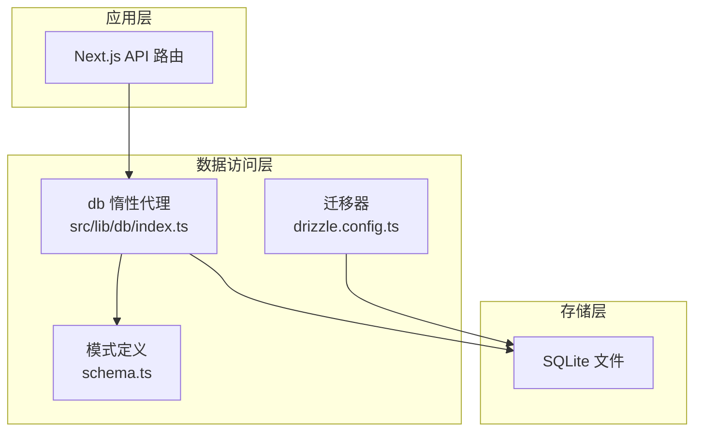
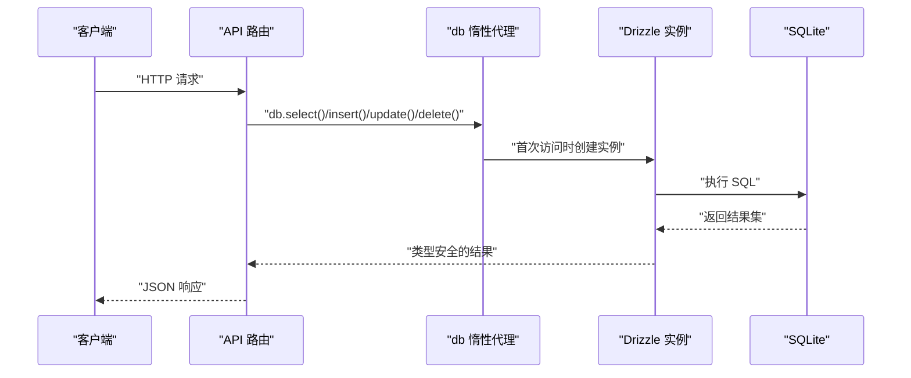
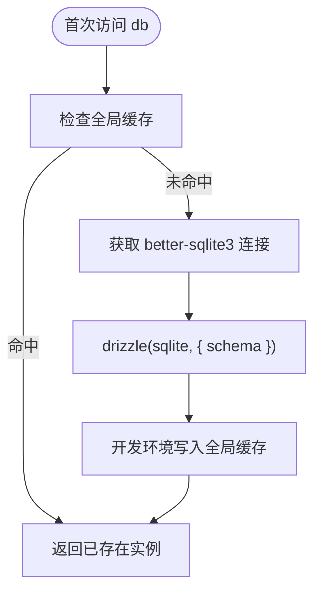
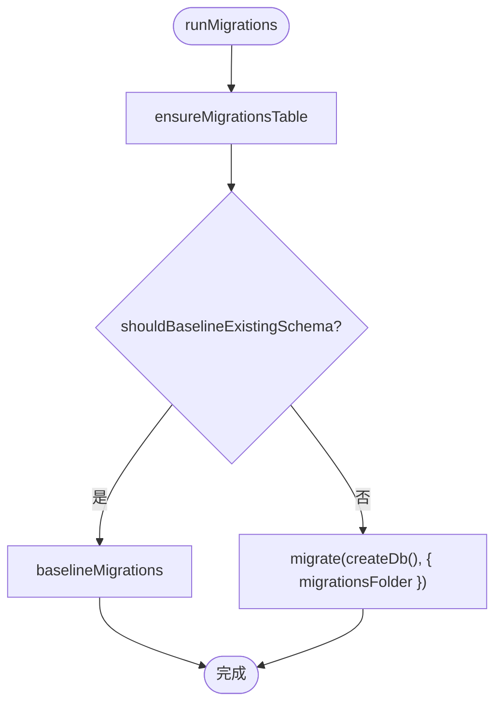
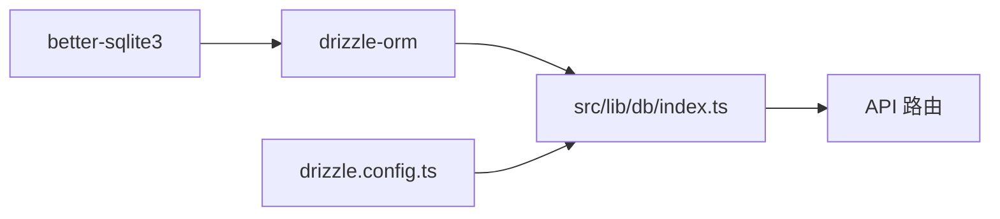

# 数据访问模式

<cite>
**本文引用的文件**
- [src/lib/db/index.ts](file://src/lib/db/index.ts)
- [drizzle.config.ts](file://drizzle.config.ts)
- [src/app/api/agents/[id]/route.ts](file://src/app/api/agents/[id]/route.ts)
- [src/app/api/agents/route.ts](file://src/app/api/agents/route.ts)
- [src/app/api/projects/[id]/characters/[characterId]/route.ts](file://src/app/api/projects/[id]/characters/[characterId]/route.ts)
- [src/app/api/projects/[id]/characters/[characterId]/upload/route.ts](file://src/app/api/projects/[id]/characters/[characterId]/upload/route.ts)
- [src/app/api/projects/[id]/character-relations/route.ts](file://src/app/api/projects/[id]/character-relations/route.ts)
- [src/app/api/projects/[id]/agent-bindings/route.ts](file://src/app/api/projects/[id]/agent-bindings/route.ts)
- [src/lib/api-fetch.ts](file://src/lib/api-fetch.ts)
</cite>

## 目录
1. [简介](#简介)
2. [项目结构](#项目结构)
3. [核心组件](#核心组件)
4. [架构总览](#架构总览)
5. [详细组件分析](#详细组件分析)
6. [依赖关系分析](#依赖关系分析)
7. [性能考量](#性能考量)
8. [故障排查指南](#故障排查指南)
9. [结论](#结论)
10. [附录](#附录)

## 简介
本文件系统性梳理 AIComicBuilder 的数据访问层设计与实现，重点围绕 Drizzle ORM 在 SQLite 上的使用方式、查询模式、事务处理、迁移策略、错误处理与性能优化等主题展开。文档以“可读性优先”的原则组织内容，既面向具备一定技术背景的读者，也尽量降低理解门槛。

## 项目结构
数据访问层的核心由以下部分组成：
- 数据库连接与初始化：通过一个惰性代理导出统一的 db 实例，确保在首次访问时才建立连接与实例。
- 迁移与版本控制：基于 Drizzle 的迁移器对 SQLite 数据库进行版本化管理，并支持对既有 schema 的基线迁移。
- 模式定义与表结构：通过 schema 文件集中声明各业务表及字段约束，供 Drizzle 生成类型安全的查询。
- API 路由中的 CRUD 与复杂查询：在 Next.js App Router 的 API 路由中直接使用 db 执行增删改查与关联查询。
- 错误处理：统一的 ApiError 类型用于包装 HTTP 响应错误，便于前端一致处理。

图表来源
- [src/lib/db/index.ts:174-186](file://src/lib/db/index.ts#L174-L186)
- [drizzle.config.ts:1-10](file://drizzle.config.ts#L1-10)

章节来源
- [src/lib/db/index.ts:46-55](file://src/lib/db/index.ts#L46-L55)
- [drizzle.config.ts:1-10](file://drizzle.config.ts#L1-L10)

## 核心组件
- db 惰性代理：对外暴露统一的 db 导出，内部在首次属性访问时创建 Drizzle 实例，避免重复初始化与全局污染。
- 连接与实例：使用 better-sqlite3 驱动创建连接，结合 schema 定义构建类型安全的查询对象。
- 迁移管理：内置迁移表检查、既有 schema 基线、迁移执行流程，保证数据库结构演进可控。
- API 集成：在 API 路由中直接使用 db 进行 CRUD、条件查询、多表关联与事务包裹。

章节来源
- [src/lib/db/index.ts:46-55](file://src/lib/db/index.ts#L46-L55)
- [src/lib/db/index.ts:156-172](file://src/lib/db/index.ts#L156-L172)
- [src/lib/db/index.ts:174-186](file://src/lib/db/index.ts#L174-L186)

## 架构总览
下图展示了从 API 请求到数据库访问的整体路径，以及迁移与模式的关系：

图表来源
- [src/lib/db/index.ts:174-186](file://src/lib/db/index.ts#L174-L186)
- [src/app/api/agents/[id]/route.ts:42-43](file://src/app/api/agents/[id]/route.ts#L42-L43)

## 详细组件分析

### 数据库连接与初始化
- 惰性代理：db 是一个 Proxy 对象，首次访问属性时调用 createDb 创建 Drizzle 实例；开发环境将实例挂载到全局对象以避免热重载导致的重复初始化。
- 连接创建：getSqlite 获取 better-sqlite3 连接，drizzle(sqlite, { schema }) 绑定 schema，形成类型安全的查询接口。
- 全局缓存：仅在非生产环境设置全局缓存，避免内存泄漏与状态污染。

图表来源
- [src/lib/db/index.ts:46-55](file://src/lib/db/index.ts#L46-L55)
- [src/lib/db/index.ts:174-186](file://src/lib/db/index.ts#L174-L186)

章节来源
- [src/lib/db/index.ts:46-55](file://src/lib/db/index.ts#L46-L55)
- [src/lib/db/index.ts:174-186](file://src/lib/db/index.ts#L174-L186)

### 迁移与版本控制
- 迁移表保障：确保存在 "__drizzle_migrations" 表，记录已应用的迁移哈希与时间戳。
- 基线迁移：当检测到现有 schema 但无迁移历史时，扫描迁移目录并将所有迁移记录一次性写入迁移表，避免重复执行。
- 正常迁移：调用 migrate 函数执行增量迁移，保持数据库结构与代码一致。

图表来源
- [src/lib/db/index.ts:156-172](file://src/lib/db/index.ts#L156-L172)
- [src/lib/db/index.ts:135-154](file://src/lib/db/index.ts#L135-L154)
- [src/lib/db/index.ts:127-133](file://src/lib/db/index.ts#L127-L133)

章节来源
- [src/lib/db/index.ts:81-89](file://src/lib/db/index.ts#L81-L89)
- [src/lib/db/index.ts:91-99](file://src/lib/db/index.ts#L91-L99)
- [src/lib/db/index.ts:101-113](file://src/lib/db/index.ts#L101-L113)
- [src/lib/db/index.ts:115-125](file://src/lib/db/index.ts#L115-L125)
- [src/lib/db/index.ts:127-133](file://src/lib/db/index.ts#L127-L133)
- [src/lib/db/index.ts:135-154](file://src/lib/db/index.ts#L135-L154)
- [src/lib/db/index.ts:156-172](file://src/lib/db/index.ts#L156-L172)

### 查询模式与事务处理
- 基础 CRUD：
  - 插入：使用 db.insert(table).values(...) 执行单条或多条插入。
  - 查询：db.select().from(table).where(...) 支持链式条件组合。
  - 更新：db.update(table).set({...}).where(...)。
  - 删除：db.delete(table).where(...)。
- 复杂查询与关联：
  - 多表关联：在 schema 中定义外键后，可在查询中通过 join 或子查询实现跨表检索。
  - 条件组合：使用 and/or 等逻辑运算符组合复杂 where 条件。
- 事务处理：
  - 使用 sqlite.transaction 包裹多个写操作，确保原子性与一致性。
  - 在迁移基线阶段，通过事务批量写入迁移记录，避免部分失败导致的状态不一致。

示例参考（路径）
- [src/app/api/agents/route.ts:38](file://src/app/api/agents/route.ts#L38)
- [src/app/api/agents/[id]/route.ts:42](file://src/app/api/agents/[id]/route.ts#L42)
- [src/app/api/agents/[id]/route.ts:53](file://src/app/api/agents/[id]/route.ts#L53)
- [src/app/api/projects/[id]/characters/[characterId]/route.ts:50](file://src/app/api/projects/[id]/characters/[characterId]/route.ts#L50)
- [src/app/api/projects/[id]/characters/[characterId]/upload/route.ts:55](file://src/app/api/projects/[id]/characters/[characterId]/upload/route.ts#L55)
- [src/app/api/projects/[id]/character-relations/route.ts:55](file://src/app/api/projects/[id]/character-relations/route.ts#L55)
- [src/app/api/projects/[id]/agent-bindings/route.ts:42](file://src/app/api/projects/[id]/agent-bindings/route.ts#L42)

章节来源
- [src/app/api/agents/route.ts:38](file://src/app/api/agents/route.ts#L38)
- [src/app/api/agents/[id]/route.ts:42](file://src/app/api/agents/[id]/route.ts#L42)
- [src/app/api/agents/[id]/route.ts:53](file://src/app/api/agents/[id]/route.ts#L53)
- [src/app/api/projects/[id]/characters/[characterId]/route.ts:50](file://src/app/api/projects/[id]/characters/[characterId]/route.ts#L50)
- [src/app/api/projects/[id]/characters/[characterId]/upload/route.ts:55](file://src/app/api/projects/[id]/characters/[characterId]/upload/route.ts#L55)
- [src/app/api/projects/[id]/character-relations/route.ts:55](file://src/app/api/projects/[id]/character-relations/route.ts#L55)
- [src/app/api/projects/[id]/agent-bindings/route.ts:42](file://src/app/api/projects/[id]/agent-bindings/route.ts#L42)

### 错误处理与异常管理
- 统一错误类型：ApiError 封装 HTTP 状态码与消息，便于前端一致捕获与展示。
- API 层错误：在 API 路由中对 db 查询结果进行校验（如资源不存在），返回标准错误响应。
- 建议实践：
  - 对外部请求统一使用 apiFetch 并抛出 ApiError，避免泄露底层细节。
  - 在事务中捕获异常并回滚，确保数据一致性。
  - 对于关键写操作，先做幂等性检查与前置校验，减少失败重试成本。

示例参考（路径）
- [src/lib/api-fetch.ts:3](file://src/lib/api-fetch.ts#L3)
- [src/lib/api-fetch.ts:10](file://src/lib/api-fetch.ts#L10)
- [src/app/api/agents/[id]/route.ts:58](file://src/app/api/agents/[id]/route.ts#L58)

章节来源
- [src/lib/api-fetch.ts:3](file://src/lib/api-fetch.ts#L3)
- [src/lib/api-fetch.ts:10](file://src/lib/api-fetch.ts#L10)
- [src/app/api/agents/[id]/route.ts:58](file://src/app/api/agents/[id]/route.ts#L58)

### 分页、排序与过滤
- 分页：通过 limit/offset 或游标分页（建议）实现高效分页；在高频查询场景中配合索引提升性能。
- 排序：使用 orderBy 结合字段升/降序控制输出顺序。
- 过滤：使用 where 与 and/or 组合多维条件；对常用过滤字段建立索引以加速查询。
- 注意：在大结果集上避免一次性全量查询，优先使用投影列与分页策略。

（本节为通用指导，不直接分析具体文件）

### 缓存策略与数据预加载
- 应用级缓存：在 API 层对热点数据进行短期缓存（如角色信息、场景概览），结合 ETag/Last-Modified 实现条件请求。
- 预加载：在一次查询中通过 join 或子查询一次性拉取关联数据，减少 N+1 查询风险。
- 写后失效：对写操作采用写后失效策略，确保读取到最新数据。

（本节为通用指导，不直接分析具体文件）

### 查询优化技巧与性能调优
- 索引策略：为频繁过滤与排序字段建立索引；避免在索引列上使用函数或隐式转换。
- 查询投影：仅选择需要的列，减少网络与解析开销。
- 事务批处理：将多次写操作放入单个事务，降低锁竞争与日志写入次数。
- 迁移优化：在迁移中避免长事务与大表重建；必要时拆分为多步迁移。

（本节为通用指导，不直接分析具体文件）

## 依赖关系分析
- 外部依赖：better-sqlite3 提供高性能 SQLite 驱动；drizzle-orm 提供类型安全的查询 DSL 与迁移工具。
- 内部耦合：API 路由直接依赖 db 导出；db 依赖 schema 定义；迁移配置依赖 drizzle.config.ts。

图表来源
- [src/lib/db/index.ts:49-50](file://src/lib/db/index.ts#L49-L50)
- [drizzle.config.ts:1-10](file://drizzle.config.ts#L1-L10)

章节来源
- [src/lib/db/index.ts:49-50](file://src/lib/db/index.ts#L49-L50)
- [drizzle.config.ts:1-10](file://drizzle.config.ts#L1-L10)

## 性能考量
- 连接池：SQLite 不适用传统连接池，建议通过惰性代理与全局缓存减少实例创建开销。
- 事务边界：合理划分事务范围，避免长时间持有写锁。
- 索引与统计：定期分析查询计划，为热点字段建立合适索引。
- I/O 优化：将数据库文件置于高性能磁盘；避免频繁 fsync。

（本节为通用指导，不直接分析具体文件）

## 故障排查指南
- 迁移失败：检查 "__drizzle_migrations" 表是否存在；确认迁移文件完整性；必要时手动清理并重新基线。
- 查询异常：核对 schema 定义与查询字段是否匹配；检查 where 条件与逻辑运算符使用。
- 写入冲突：在并发场景下使用事务包裹；对关键写操作增加唯一性约束与幂等判断。
- 错误上报：统一使用 ApiError 包装 HTTP 错误，便于前端统一处理与用户提示。

章节来源
- [src/lib/db/index.ts:81-89](file://src/lib/db/index.ts#L81-L89)
- [src/lib/db/index.ts:156-172](file://src/lib/db/index.ts#L156-L172)
- [src/lib/api-fetch.ts:10](file://src/lib/api-fetch.ts#L10)

## 结论
AIComicBuilder 的数据访问层以 Drizzle ORM 为核心，结合 better-sqlite3 驱动与类型安全的 schema，实现了简洁而可靠的 CRUD、复杂查询与事务处理能力。通过惰性代理与迁移基线机制，系统在开发与生产环境中均具备良好的稳定性与可维护性。建议在后续迭代中持续完善索引策略、缓存与预加载方案，并加强单元与集成测试覆盖，以进一步提升性能与可靠性。

## 附录

### 单元测试与集成测试指南
- 单元测试（推荐）：
  - 针对 db 查询逻辑编写独立测试，使用内存 SQLite 或临时文件作为测试数据库。
  - 使用事务包裹每个测试用例，确保隔离性与可重复性。
  - 对关键查询添加断言，验证返回结构、排序与过滤行为。
- 集成测试（推荐）：
  - 在 Next.js 测试框架中模拟 API 路由，注入 mock db 实例，验证端到端流程。
  - 覆盖典型 CRUD 场景、关联查询与事务回滚路径。
- 建议工具：
  - 使用 better-sqlite3 的内存模式进行快速测试。
  - 使用测试数据库快照与迁移脚本，确保测试环境与生产一致。

（本节为通用指导，不直接分析具体文件）