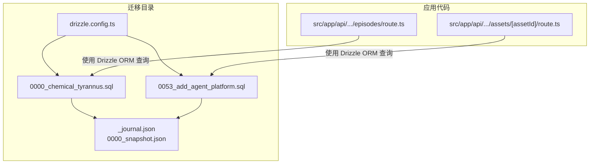
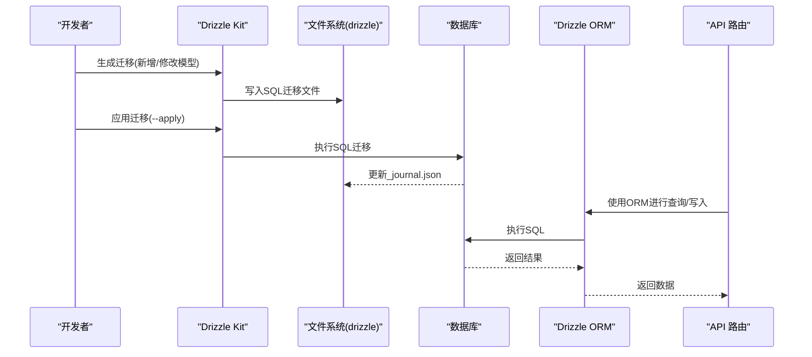
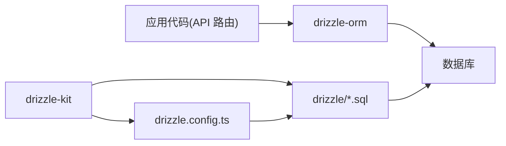

# 迁移管理

<cite>
**本文引用的文件**
- [drizzle.config.ts](file://drizzle.config.ts)
- [package.json](file://package.json)
- [0000_chemical_tyrannus.sql](file://drizzle/0000_chemical_tyrannus.sql)
- [0053_add_agent_platform.sql](file://drizzle/0053_add_agent_platform.sql)
- [_journal.json](file://drizzle/meta/_journal.json)
- [0000_snapshot.json](file://drizzle/meta/0000_snapshot.json)
- [route.ts](file://src/app/api/projects/[id]/episodes/route.ts)
- [route.ts](file://src/app/api/projects/[id]/shots/[shotId]/assets/[assetId]/route.ts)
</cite>

## 目录
1. [简介](#简介)
2. [项目结构](#项目结构)
3. [核心组件](#核心组件)
4. [架构总览](#架构总览)
5. [详细组件分析](#详细组件分析)
6. [依赖关系分析](#依赖关系分析)
7. [性能考量](#性能考量)
8. [故障排查指南](#故障排查指南)
9. [结论](#结论)
10. [附录](#附录)

## 简介
本文件面向AIComicBuilder的数据库迁移管理，系统性阐述基于Drizzle Migrator的迁移工作流与最佳实践。内容覆盖迁移文件命名与版本号规则、变更内容与执行顺序、迁移脚本编写规范、常用命令与操作流程、回滚策略与数据备份建议、生产环境安全措施与注意事项、错误处理与故障恢复机制，以及迁移测试与验证方法。读者可据此在开发与生产环境中安全、可控地演进数据库结构。

## 项目结构
AIComicBuilder采用Drizzle Kit生成并管理迁移文件，迁移目录位于drizzle下，包含按序号命名的SQL迁移文件与元数据文件（用于记录已应用的迁移状态）。迁移配置集中在drizzle.config.ts中，定义输出目录、驱动与目标数据库等参数；Drizzle ORM在业务层通过API路由与数据库交互。

图表来源
- [drizzle.config.ts](file://drizzle.config.ts)
- [_journal.json](file://drizzle/meta/_journal.json)
- [0000_chemical_tyrannus.sql](file://drizzle/0000_chemical_tyrannus.sql)
- [0053_add_agent_platform.sql](file://drizzle/0053_add_agent_platform.sql)
- [route.ts](file://src/app/api/projects/[id]/episodes/route.ts)
- [route.ts](file://src/app/api/projects/[id]/shots/[shotId]/assets/[assetId]/route.ts)

章节来源
- [drizzle.config.ts](file://drizzle.config.ts)
- [package.json](file://package.json)

## 核心组件
- 迁移配置与工具链
  - drizzle.config.ts：定义迁移输出目录、驱动、目标数据库等，是迁移生成与执行的入口配置。
  - drizzle-kit：用于生成迁移、检查迁移状态、应用迁移。
  - drizzle-orm：在应用层进行类型化查询与事务控制，确保迁移后数据访问的正确性。
- 迁移文件与元数据
  - SQL迁移文件：以四位递增序号开头的SQL脚本，描述单次结构变更。
  - 元数据文件：_journal.json记录已应用迁移的版本与时间戳；0000_snapshot.json保存初始快照，便于对比与回溯。
- 应用集成
  - API路由通过drizzle-orm连接数据库，执行查询与写入，确保迁移后的数据一致性。

章节来源
- [drizzle.config.ts](file://drizzle.config.ts)
- [package.json](file://package.json)
- [_journal.json](file://drizzle/meta/_journal.json)
- [0000_snapshot.json](file://drizzle/meta/0000_snapshot.json)

## 架构总览
下图展示从迁移生成到应用执行的关键路径，以及元数据如何保障迁移状态的可追踪性。

图表来源
- [drizzle.config.ts](file://drizzle.config.ts)
- [_journal.json](file://drizzle/meta/_journal.json)
- [0000_chemical_tyrannus.sql](file://drizzle/0000_chemical_tyrannus.sql)
- [0053_add_agent_platform.sql](file://drizzle/0053_add_agent_platform.sql)
- [route.ts](file://src/app/api/projects/[id]/episodes/route.ts)

## 详细组件分析

### 迁移文件命名与版本号规则
- 命名格式：四位递增序号 + 下划线 + 简短描述。例如0000_chemical_tyrannus.sql、0053_add_agent_platform.sql。
- 版本号：序号严格递增，确保迁移的确定性执行顺序。
- 变更粒度：每个SQL文件仅承载一次结构或数据变更，避免跨文件耦合。
- 执行顺序：按序号从小到大依次执行，_journal.json记录已应用版本，防止重复执行。

章节来源
- [0000_chemical_tyrannus.sql](file://drizzle/0000_chemical_tyrannus.sql)
- [0053_add_agent_platform.sql](file://drizzle/0053_add_agent_platform.sql)
- [_journal.json](file://drizzle/meta/_journal.json)

### 迁移脚本编写规范与最佳实践
- 单一职责：每个迁移文件聚焦一个明确的变更点，避免多表联动导致的复杂性。
- 幂等性：尽量使用条件判断与存在性检查，避免重复执行引发异常。
- 向后兼容：新增列时提供默认值或允许NULL，必要时分步迁移数据。
- 事务边界：长流程迁移建议拆分为多个小迁移，降低锁竞争与失败风险。
- 回滚准备：对破坏性变更（如删除列）保留备份策略或逆向迁移。
- 文档化：在SQL注释中简述变更目的、影响范围与注意事项。

### 迁移命令使用指南与常见操作
- 生成迁移：基于模型变更自动生成SQL迁移文件。
- 应用迁移：将未应用的迁移按序号执行至数据库。
- 检查状态：查看当前数据库版本与待应用迁移列表。
- 重置/清理：在受控环境下清理迁移状态（谨慎使用）。
- 验证：通过API路由与单元测试验证迁移后的数据一致性。

章节来源
- [drizzle.config.ts](file://drizzle.config.ts)
- [package.json](file://package.json)

### 回滚策略与数据备份方案
- 回滚策略
  - 就地回滚：为破坏性变更提供逆向SQL迁移，按相反顺序回滚。
  - 快照回滚：利用0000_snapshot.json与数据库备份快速恢复到初始状态。
  - 分阶段回滚：将大变更拆分为多个小迁移，优先回滚最近一次。
- 数据备份
  - 结构与数据备份：定期导出数据库快照，作为回滚前的保护屏障。
  - 迁移审计：保留每次迁移的SQL与执行日志，便于问题定位。
- 生产环境回滚流程
  - 评估影响：确认回滚范围与对业务的影响面。
  - 制定计划：准备逆向迁移与数据修复脚本。
  - 降级窗口：选择低峰时段执行，并准备应急预案。

章节来源
- [0000_snapshot.json](file://drizzle/meta/0000_snapshot.json)
- [_journal.json](file://drizzle/meta/_journal.json)

### 生产环境迁移的安全措施与注意事项
- 权限最小化：仅授予迁移所需的数据库权限，避免过度授权。
- 审计与通知：记录迁移执行人、时间、版本与结果，发生异常及时告警。
- 逐步发布：先在预生产环境全量验证，再灰度到生产。
- 服务停机窗口：对DDL密集期安排维护窗口，减少对在线服务的影响。
- 备份前置：迁移前完成数据库备份，迁移后验证备份可用性。
- 依赖隔离：确保迁移不依赖外部服务或不可靠的时间点。

### 错误处理与故障恢复机制
- 迁移失败
  - 中断与回滚：遇到语法错误或约束冲突时，停止后续迁移并回滚已执行部分。
  - 日志定位：结合数据库日志与_drizzle_日志定位具体失败步骤。
- 故障恢复
  - 人工介入：对无法自动恢复的错误，使用逆向迁移或手工修复。
  - 状态修复：若_journl.json损坏，需手动校验数据库实际状态并修正。
- 运行时异常
  - API路由：在应用层捕获数据库异常，返回统一错误码并记录上下文。
  - 重试与退避：对瞬时性错误（网络抖动）实施指数退避重试。

章节来源
- [_journal.json](file://drizzle/meta/_journal.json)
- [route.ts](file://src/app/api/projects/[id]/episodes/route.ts)
- [route.ts](file://src/app/api/projects/[id]/shots/[shotId]/assets/[assetId]/route.ts)

### 迁移测试与验证方法
- 单元测试
  - 模型层：针对ORM查询与写入逻辑编写测试，覆盖迁移后的数据结构。
  - 迁移层：在隔离数据库实例上执行迁移并验证结构与索引。
- 集成测试
  - API端到端：通过API路由验证迁移后业务功能的正确性。
  - 性能回归：在相似负载下对比迁移前后查询性能。
- 回归测试
  - 基准快照：以0000_snapshot.json为基准，对比结构差异。
  - 元数据校验：确认_journl.json与数据库实际版本一致。

## 依赖关系分析
Drizzle Kit与Drizzle ORM在迁移与运行时分别承担“生成/应用”和“查询/写入”的职责，二者通过drizzle.config.ts关联，形成从模型到数据库的完整闭环。

图表来源
- [drizzle.config.ts](file://drizzle.config.ts)
- [package.json](file://package.json)

章节来源
- [drizzle.config.ts](file://drizzle.config.ts)
- [package.json](file://package.json)

## 性能考量
- 迁移窗口规划：避免在业务高峰期执行大型DDL，优先选择低峰时段。
- 索引与约束：在迁移中批量添加索引时注意锁表时间，必要时分批执行。
- 数据量控制：大批量数据迁移应分页处理，避免长时间持有行锁。
- 缓存与连接池：迁移期间调整连接池大小与缓存策略，减少对在线服务的影响。

## 故障排查指南
- 症状：迁移卡住或报错
  - 排查步骤：检查数据库日志、确认迁移SQL是否被中断；核对_journl.json与数据库实际版本。
- 症状：应用启动后查询异常
  - 排查步骤：确认迁移是否完全应用；检查API路由使用的字段是否存在；核对ORM映射与数据库结构一致性。
- 症状：回滚后数据不一致
  - 排查步骤：比对逆向迁移与原始快照；核对备份恢复点；重新执行必要的修复脚本。

章节来源
- [_journal.json](file://drizzle/meta/_journal.json)
- [route.ts](file://src/app/api/projects/[id]/episodes/route.ts)
- [route.ts](file://src/app/api/projects/[id]/shots/[shotId]/assets/[assetId]/route.ts)

## 结论
AIComicBuilder基于Drizzle Migrator实现了结构化的数据库演进流程。通过严格的命名与版本号规则、清晰的迁移脚本规范、完善的元数据跟踪与回滚策略，能够在开发与生产环境中安全、可控地推进数据库变更。配合全面的测试与验证体系，可显著降低迁移风险并提升系统的稳定性与可维护性。

## 附录
- 常用命令参考（示例）
  - 生成迁移：基于模型变更自动生成SQL迁移文件。
  - 应用迁移：将未应用的迁移按序号执行至数据库。
  - 检查状态：查看当前数据库版本与待应用迁移列表。
  - 清理/重置：在受控环境下清理迁移状态（谨慎使用）。
- 迁移清单（节选）
  - 0000_chemical_tyrannus.sql：初始结构快照。
  - 0053_add_agent_platform.sql：新增平台相关字段。
- 元数据说明
  - _journal.json：记录已应用迁移的版本与时间戳。
  - 0000_snapshot.json：初始快照，用于结构对比与回溯。

章节来源
- [drizzle.config.ts](file://drizzle.config.ts)
- [package.json](file://package.json)
- [0000_chemical_tyrannus.sql](file://drizzle/0000_chemical_tyrannus.sql)
- [0053_add_agent_platform.sql](file://drizzle/0053_add_agent_platform.sql)
- [_journal.json](file://drizzle/meta/_journal.json)
- [0000_snapshot.json](file://drizzle/meta/0000_snapshot.json)