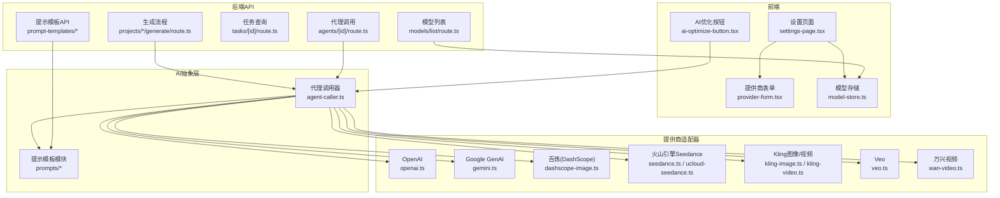
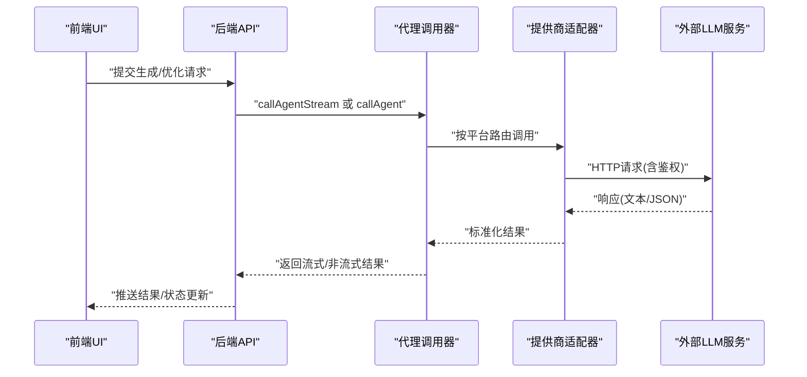
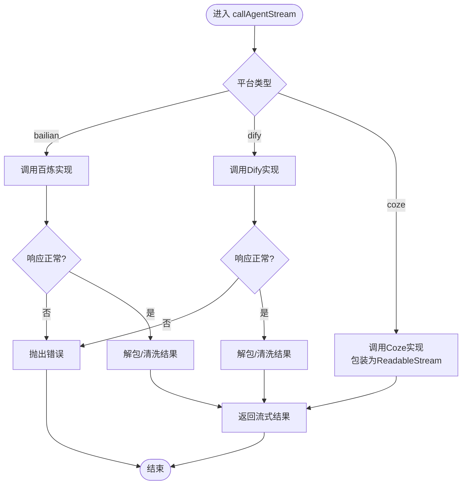
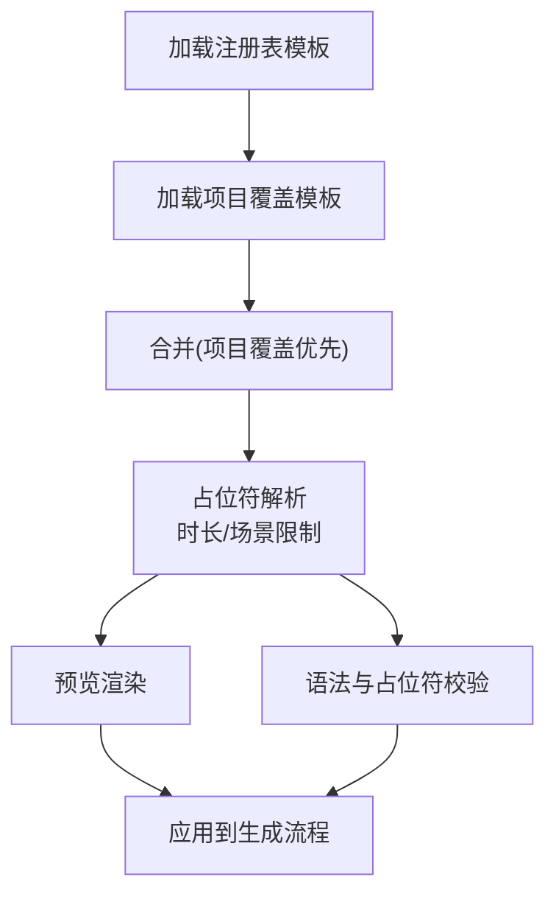
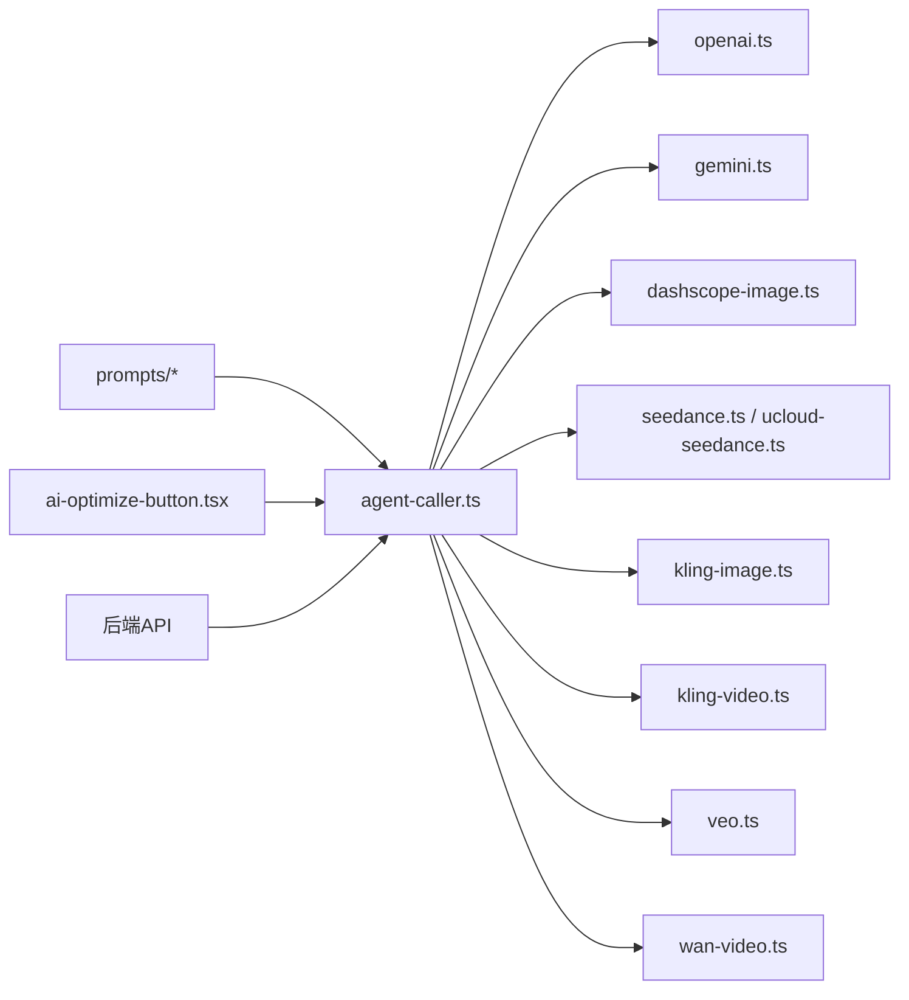

# AI服务集成

<cite>
**本文引用的文件**
- [agent-caller.ts](file://src/lib/ai/agent-caller.ts)
- [provider-form.tsx](file://src/components/settings/provider-form.tsx)
- [provider-section.tsx](file://src/components/settings/provider-section.tsx)
- [provider-card.tsx](file://src/components/settings/provider-card.tsx)
- [model-store.ts](file://src/stores/model-store.ts)
- [prompt-drawer.tsx](file://src/components/prompt-templates/prompt-drawer.tsx)
- [settings-page.tsx](file://src/app/[locale]/settings/page.tsx)
- [ai-optimize-button.tsx](file://src/components/editor/ai-optimize-button.tsx)
- [dashscope-image.ts](file://src/lib/ai/providers/dashscope-image.ts)
- [gemini.ts](file://src/lib/ai/providers/gemini.ts)
- [openai.ts](file://src/lib/ai/providers/openai.ts)
- [seedance.ts](file://src/lib/ai/providers/seedance.ts)
- [ucloud-seedance.ts](file://src/lib/ai/providers/ucloud-seedance.ts)
- [kling-image.ts](file://src/lib/ai/providers/kling-image.ts)
- [kling-video.ts](file://src/lib/ai/providers/kling-video.ts)
- [veo.ts](file://src/lib/ai/providers/veo.ts)
- [wan-video.ts](file://src/lib/ai/providers/wan-video.ts)
- [dify\*.dify.yml](file://agents/dify/*.dify.yml)
- [bailian\template.yml](file://agents/bailian/template.yml)
- [character-extract.ts](file://src/lib/ai/prompts/character-extract.ts)
- [character-image.ts](file://src/lib/ai/prompts/character-image.ts)
- [frame-generate.ts](file://src/lib/ai/prompts/frame-generate.ts)
- [import-character-extract.ts](file://src/lib/ai/prompts/import-character-extract.ts)
- [blocks.ts](file://src/lib/ai/prompts/blocks.ts)
- [model-limits.ts](file://src/lib/ai/model-limits.ts)
- [route.ts](file://src/app/api/models/list/route.ts)
- [route.ts](file://src/app/api/projects/[id]/generate/route.ts)
- [route.ts](file://src/app/api/projects/[id]/episodes/[episodeId]/route.ts)
- [route.ts](file://src/app/api/tasks/[id]/route.ts)
- [route.ts](file://src/app/api/agents/[id]/route.ts)
- [route.ts](file://src/app/api/prompt-templates/[promptKey]/route.ts)
- [route.ts](file://src/app/api/prompt-templates/registry/route.ts)
- [route.ts](file://src/app/api/prompt-templates/validate/route.ts)
- [route.ts](file://src/app/api/prompt-templates/preview/route.ts)
- [route.ts](file://src/app/api/prompt-templates/versions/[vid]/restore/route.ts)
- [route.ts](file://src/app/api/projects/[id]/prompt-templates/[promptKey]/route.ts)
- [route.ts](file://src/app/api/projects/[id]/prompt-templates/route.ts)
- [route.ts](file://src/app/api/projects/[id]/prompt-templates/validate/route.ts)
- [route.ts](file://src/app/api/projects/[id]/prompt-templates/preview/route.ts)
- [route.ts](file://src/app/api/projects/[id]/prompt-templates/versions/[vid]/restore/route.ts)
- [route.ts](file://src/app/api/projects/[id]/characters/[characterId]/upload/route.ts)
- [route.ts](file://src/app/api/projects/[id]/shots/[shotId]/assets/[assetId]/active/route.ts)
- [route.ts](file://src/app/api/projects/[id]/shots/[shotId]/assets/upload/route.ts)
- [route.ts](file://src/app/api/projects/[id]/shots/[shotId]/upload/route.ts)
- [route.ts](file://src/app/api/projects/[id]/mood-board/[imageId]/route.ts)
- [route.ts](file://src/app/api/projects/[id]/emotion-analysis/route.ts)
- [route.ts](file://src/app/api/projects/[id]/continuity-check/route.ts)
- [route.ts](file://src/app/api/projects/[id]/merge-episodes/route.ts)
- [route.ts](file://src/app/api/projects/[id]/episodes/[episodeId]/reorder/route.ts)
- [route.ts](file://src/app/api/projects/[id]/episodes/[episodeId]/split/route.ts)
- [route.ts](file://src/app/api/projects/[id]/episodes/[episodeId]/parse/route.ts)
- [route.ts](file://src/app/api/projects/[id]/episodes/[episodeId]/generate/route.ts)
- [route.ts](file://src/app/api/projects/[id]/episodes/[episodeId]/logs/route.ts)
- [route.ts](file://src/app/api/projects/[id]/episodes/[episodeId]/download/route.ts)
- [route.ts](file://src/app/api/projects/[id]/episodes/[episodeId]/import/characters/route.ts)
- [route.ts](file://src/app/api/projects/[id]/episodes/[episodeId]/import/generate/route.ts)
- [route.ts](file://src/app/api/projects/[id]/episodes/[episodeId]/import/logs/route.ts)
- [route.ts](file://src/app/api/projects/[id]/episodes/[episodeId]/import/parse/route.ts)
- [route.ts](file://src/app/api/projects/[id]/episodes/[episodeId]/import/split/route.ts)
- [route.ts](file://src/app/api/projects/[id]/episodes/[episodeId]/import/generate/route.ts)
- [route.ts](file://src/app/api/projects/[id]/episodes/[episodeId]/import/parse/route.ts)
- [route.ts](file://src/app/api/projects/[id]/episodes/[episodeId]/import/split/route.ts)
- [route.ts](file://src/app/api/projects/[id]/episodes/[episodeId]/import/logs/route.ts)
- [route.ts](file://src/app/api/projects/[id]/episodes/[episodeId]/import/characters/route.ts)
- [route.ts](file://src/app/api/projects/[id]/episodes/[episodeId]/import/generate/route.ts)
- [route.ts](file://src/app/api/projects/[id]/episodes/[episodeId]/import/parse/route.ts)
- [route.ts](file://src/app/api/projects/[id]/episodes/[episodeId]/import/split/route.ts)
- [route.ts](file://src/app/api/projects/[id]/episodes/[episodeId]/import/logs/route.ts)
- [route.ts](file://src/app/api/projects/[id]/episodes/[episodeId]/import/characters/route.ts)
- [route.ts](file://src/app/api/projects/[id]/episodes/[episodeId]/import/generate/route.ts)
- [route.ts](file://src/app/api/projects/[id]/episodes/[episodeId]/import/parse/route.ts)
- [route.ts](file://src/app/api/projects/[id]/episodes/[episodeId]/import/split/route.ts)
- [route.ts](file://src/app/api/projects/[id]/episodes/[episodeId]/import/logs/route.ts)
- [route.ts](file://src/app/api/projects/[id]/episodes/[episodeId]/import/characters/route.ts)
- [route.ts](file://src/app/api/projects/[id]/episodes/[episodeId]/import/generate/route.ts)
- [route.ts](file://src/app/api/projects/[id]/episodes/[episodeId]/import/parse/route.ts)
- [route.ts](file://src/app/api/projects/[id]/episodes/[episodeId]/import/split/route.ts)
- [route.ts](file://src/app/api/projects/[id]/episodes/[episodeId]/import/logs/route.ts)
- [route.ts](file://src/app/api/projects/[id]/episodes/[episodeId]/import/characters/route.ts)
- [route.ts](file://src/app/api/projects/[id]/episodes/[episodeId]/import/generate/route.ts)
- [route.ts](file://src/app/api/projects/[id]/episodes/[episodeId]/import/parse/route.ts)
- [route.ts](file://src/app/api/projects/[id]/episodes/[episodeId]/import/split/route.ts)
- [route.ts](file://src/app/api/projects/[id]/episodes/[episodeId]/import/logs/route.ts)
- [route.ts](file://src/app/api/projects/[id]/episodes/[episodeId]/import/characters/route.ts)
- [route.ts](file://src/app/api/projects/[id]/episodes/[episodeId]/import/generate/route.ts)
- [route.ts](file://src/app/api/projects/[id]/episodes/[episodeId]/import/parse/route.ts)
- [route.ts](file://src/app/api/projects/[id]/episodes/[episodeId]/import/split/route.ts)
- [route.ts](file://src/app/api/projects/[id]/episodes/[episodeId]/import/logs/route.ts)
- [route.ts](file://src/app/api/projects/[id]/episodes/[episodeId]/import/characters/route.ts)
- [route.ts](file://src/app/api/projects/[id]/episodes/[episodeId]/import/generate/route.ts)
- [route.ts](file://src/app/api/projects/[id]/episodes/[episodeId]/import/parse/route.ts)
- [route.ts](file://src/app/api/projects/[id]/episodes/[episodeId]/import/split/route.ts)
- [route.ts](file://src/app/api/projects/[id]/episodes/[episodeId]/import/logs/route.ts)
- [route.ts](file://src/app/api/projects/[id]/episodes/[episodeId]/import/characters/r......)
</cite>

## 目录
1. [简介](#简介)
2. [项目结构](#项目结构)
3. [核心组件](#核心组件)
4. [架构总览](#架构总览)
5. [详细组件分析](#详细组件分析)
6. [依赖关系分析](#依赖关系分析)
7. [性能考虑](#性能考虑)
8. [故障排查指南](#故障排查指南)
9. [结论](#结论)
10. [附录](#附录)

## 简介
本文件面向AIComicBuilder的AI服务集成，系统性阐述多提供商AI服务抽象层的设计与实现，覆盖OpenAI、Google GenAI、Dify、百炼（DashScope）、Coze等平台的统一接口；详述AI代理调用机制、提示模板系统与模型配置管理；解释异步任务处理、错误重试与负载均衡策略；并给出认证机制、API密钥管理与成本控制建议，以及监控、性能优化与故障恢复的技术实现路径。

## 项目结构
AI服务相关代码主要分布在以下区域：
- 统一代理调用层：src/lib/ai/agent-caller.ts
- 多提供商模型适配器：src/lib/ai/providers/*
- 提示模板与构建模块：src/lib/ai/prompts/*
- 设置界面与模型存储：src/components/settings/*, src/stores/model-store.ts
- 前端触发与编辑器集成：src/components/editor/*
- 后端API路由：src/app/api/*

图表来源
- [settings-page.tsx:1-65](file://src/app/[locale]/settings/page.tsx#L1-L65)
- [provider-form.tsx:1-24](file://src/components/settings/provider-form.tsx#L1-L24)
- [ai-optimize-button.tsx](file://src/components/editor/ai-optimize-button.tsx)
- [agent-caller.ts:1-38](file://src/lib/ai/agent-caller.ts#L1-L38)
- [openai.ts](file://src/lib/ai/providers/openai.ts)
- [gemini.ts](file://src/lib/ai/providers/gemini.ts)
- [dashscope-image.ts](file://src/lib/ai/providers/dashscope-image.ts)
- [seedance.ts](file://src/lib/ai/providers/seedance.ts)
- [ucloud-seedance.ts](file://src/lib/ai/providers/ucloud-seedance.ts)
- [kling-image.ts](file://src/lib/ai/providers/kling-image.ts)
- [kling-video.ts](file://src/lib/ai/providers/kling-video.ts)
- [veo.ts](file://src/lib/ai/providers/veo.ts)
- [wan-video.ts](file://src/lib/ai/providers/wan-video.ts)
- [route.ts](file://src/app/api/models/list/route.ts)
- [route.ts](file://src/app/api/projects/[id]/generate/route.ts)
- [route.ts](file://src/app/api/tasks/[id]/route.ts)
- [route.ts](file://src/app/api/agents/[id]/route.ts)
- [route.ts](file://src/app/api/prompt-templates/[promptKey]/route.ts)

章节来源
- [settings-page.tsx:1-65](file://src/app/[locale]/settings/page.tsx#L1-L65)
- [provider-form.tsx:1-24](file://src/components/settings/provider-form.tsx#L1-L24)
- [agent-caller.ts:1-38](file://src/lib/ai/agent-caller.ts#L1-L38)

## 核心组件
- 多提供商代理调用器：统一入口封装百炼、Dify、Coze的调用差异，支持流式与非流式两种输出，内部通过平台分支选择具体实现。
- 提示模板系统：以占位符解析为核心，结合项目上下文动态替换时长、动作/对白最大时长等参数，支持注册表与项目覆盖。
- 模型配置与存储：通过设置界面维护各提供商的基础URL、协议与能力标记，模型存储负责默认模型与能力映射。
- 编辑器集成：在脚本/分镜编辑场景中，提供一键AI优化按钮，触发统一调用器进行内容增强或改写。
- 后端API：围绕模型列表、生成流程、任务查询、代理调用与提示模板提供REST接口，支撑前端交互与异步任务编排。

章节来源
- [agent-caller.ts:1-38](file://src/lib/ai/agent-caller.ts#L1-L38)
- [prompt-drawer.tsx:70-100](file://src/components/prompt-templates/prompt-drawer.tsx#L70-L100)
- [provider-form.tsx:1-24](file://src/components/settings/provider-form.tsx#L1-L24)
- [ai-optimize-button.tsx](file://src/components/editor/ai-optimize-button.tsx)

## 架构总览
下图展示从前端到后端、再到多提供商AI服务的整体调用链路与数据流。

图表来源
- [agent-caller.ts:14-32](file://src/lib/ai/agent-caller.ts#L14-L32)
- [agent-caller.ts:170-181](file://src/lib/ai/agent-caller.ts#L170-L181)
- [openai.ts](file://src/lib/ai/providers/openai.ts)
- [gemini.ts](file://src/lib/ai/providers/gemini.ts)
- [dashscope-image.ts](file://src/lib/ai/providers/dashscope-image.ts)
- [seedance.ts](file://src/lib/ai/providers/seedance.ts)
- [ucloud-seedance.ts](file://src/lib/ai/providers/ucloud-seedance.ts)
- [kling-image.ts](file://src/lib/ai/providers/kling-image.ts)
- [kling-video.ts](file://src/lib/ai/providers/kling-video.ts)
- [veo.ts](file://src/lib/ai/providers/veo.ts)
- [wan-video.ts](file://src/lib/ai/providers/wan-video.ts)

## 详细组件分析

### 代理调用器（多提供商统一接口）
- 设计要点
  - 平台枚举与配置：支持百炼、Dify、Coze三类平台，统一传入appId与apiKey。
  - 流式与非流式双通道：流式用于实时渲染，非流式用于一次性结果。
  - 平台差异处理：针对不同平台的响应格式与鉴权方式做适配与解包。
- 关键行为
  - 路由分发：根据平台类型调用对应实现。
  - 错误处理：对HTTP错误与业务错误分别抛出，便于上层捕获与提示。
  - Coze回退：由于其工作流不支持原生SSE，采用全量文本包装为ReadableStream。
- 可扩展性
  - 新增平台只需在switch中添加分支，并实现对应调用函数，保持对外接口一致。

图表来源
- [agent-caller.ts:14-32](file://src/lib/ai/agent-caller.ts#L14-L32)
- [agent-caller.ts:193-239](file://src/lib/ai/agent-caller.ts#L193-L239)

章节来源
- [agent-caller.ts:1-38](file://src/lib/ai/agent-caller.ts#L1-L38)
- [agent-caller.ts:169-181](file://src/lib/ai/agent-caller.ts#L169-L181)
- [agent-caller.ts:193-239](file://src/lib/ai/agent-caller.ts#L193-L239)

### 提示模板系统
- 占位符解析
  - 动态时长范围：根据最小/最大时长生成区间字符串，替换模板中的占位符。
  - 场景限制：对话/动作/开场镜头的最大时长按规则上限截断。
- 加载与合并
  - 注册表加载：从全局注册表获取可用模板元数据。
  - 项目覆盖：按项目维度提供覆盖版本，优先级高于全局。
- 预览与校验
  - 预览接口：渲染最终模板文本供用户确认。
  - 校验接口：验证模板语法与占位符完整性。

图表来源
- [prompt-drawer.tsx:70-100](file://src/components/prompt-templates/prompt-drawer.tsx#L70-L100)

章节来源
- [prompt-drawer.tsx:70-100](file://src/components/prompt-templates/prompt-drawer.tsx#L70-L100)

### 模型配置与存储
- 设置界面
  - 提供商表单：维护OpenAI、Gemini、火山引擎、阿里云DashScope、Kling、万兴等基础URL与协议。
  - 默认模型选择：在设置页提供默认模型选择入口。
- 存储与能力
  - 模型存储：记录各提供商能力标记与默认模型，供前端与后端使用。
  - 能力映射：基于提供商能力决定可用模型集合与特性开关。

章节来源
- [provider-form.tsx:1-24](file://src/components/settings/provider-form.tsx#L1-L24)
- [provider-section.tsx](file://src/components/settings/provider-section.tsx)
- [provider-card.tsx](file://src/components/settings/provider-card.tsx)
- [model-store.ts](file://src/stores/model-store.ts)

### 编辑器集成与触发
- AI优化按钮：在脚本/分镜编辑器中提供一键优化，内部调用统一代理调用器，将优化后的文本回填至编辑器。
- 与提示模板联动：可直接使用模板生成的提示作为输入，提升一致性与质量。

章节来源
- [ai-optimize-button.tsx](file://src/components/editor/ai-optimize-button.tsx)

### 后端API与异步任务
- 模型列表：提供当前可用模型清单，供前端选择与展示。
- 生成流程：接收项目/剧集/分镜级别的生成请求，内部调度代理调用器与提供商适配器。
- 任务查询：支持按任务ID查询进度与结果，便于前端轮询与状态展示。
- 代理调用：封装代理平台的调用逻辑，统一返回格式。
- 提示模板API：提供注册表、项目覆盖、预览与校验等完整生命周期接口。

章节来源
- [route.ts](file://src/app/api/models/list/route.ts)
- [route.ts](file://src/app/api/projects/[id]/generate/route.ts)
- [route.ts](file://src/app/api/tasks/[id]/route.ts)
- [route.ts](file://src/app/api/agents/[id]/route.ts)
- [route.ts](file://src/app/api/prompt-templates/[promptKey]/route.ts)
- [route.ts](file://src/app/api/prompt-templates/registry/route.ts)
- [route.ts](file://src/app/api/prompt-templates/validate/route.ts)
- [route.ts](file://src/app/api/prompt-templates/preview/route.ts)
- [route.ts](file://src/app/api/prompt-templates/versions/[vid]/restore/route.ts)
- [route.ts](file://src/app/api/projects/[id]/prompt-templates/[promptKey]/route.ts)
- [route.ts](file://src/app/api/projects/[id]/prompt-templates/route.ts)
- [route.ts](file://src/app/api/projects/[id]/prompt-templates/validate/route.ts)
- [route.ts](file://src/app/api/projects/[id]/prompt-templates/preview/route.ts)
- [route.ts](file://src/app/api/projects/[id]/prompt-templates/versions/[vid]/restore/route.ts)

### 提示模板构建模块
- 角色提取：从输入文本中抽取角色信息，支持导入场景。
- 角色画像：生成角色视觉提示词，辅助图像生成。
- 分镜生成：基于剧本与场景信息生成分镜提示词。
- 导入场景：处理外部导入的角色信息提取与提示生成。

章节来源
- [character-extract.ts](file://src/lib/ai/prompts/character-extract.ts)
- [character-image.ts](file://src/lib/ai/prompts/character-image.ts)
- [frame-generate.ts](file://src/lib/ai/prompts/frame-generate.ts)
- [import-character-extract.ts](file://src/lib/ai/prompts/import-character-extract.ts)
- [blocks.ts](file://src/lib/ai/prompts/blocks.ts)

### 模型限额与成本控制
- 模型限额：定义各模型的输入/输出Token上限与价格策略，用于前端提示与后端计费估算。
- 成本控制建议
  - Token预算：在提示模板中控制上下文长度，避免冗余信息。
  - 模型选择：优先选择性价比高的模型完成草稿，再用高阶模型进行润色。
  - 批量限速：对高频调用增加节流与指数退避，降低突发成本。

章节来源
- [model-limits.ts](file://src/lib/ai/model-limits.ts)

## 依赖关系分析
- 组件耦合
  - 代理调用器对各提供商适配器存在直接依赖，但通过统一接口隔离了平台差异。
  - 提示模板系统与编辑器组件松耦合，通过API与存储间接交互。
- 外部依赖
  - 各提供商的HTTP API与鉴权方式（如Bearer Token）。
  - 前端Next.js路由与状态管理（store与hooks）。
- 循环依赖
  - 当前结构未见循环依赖，新增适配器需遵循“对内统一接口、对外只依赖HTTP”的原则。

图表来源
- [agent-caller.ts:1-38](file://src/lib/ai/agent-caller.ts#L1-L38)
- [openai.ts](file://src/lib/ai/providers/openai.ts)
- [gemini.ts](file://src/lib/ai/providers/gemini.ts)
- [dashscope-image.ts](file://src/lib/ai/providers/dashscope-image.ts)
- [seedance.ts](file://src/lib/ai/providers/seedance.ts)
- [ucloud-seedance.ts](file://src/lib/ai/providers/ucloud-seedance.ts)
- [kling-image.ts](file://src/lib/ai/providers/kling-image.ts)
- [kling-video.ts](file://src/lib/ai/providers/kling-video.ts)
- [veo.ts](file://src/lib/ai/providers/veo.ts)
- [wan-video.ts](file://src/lib/ai/providers/wan-video.ts)
- [ai-optimize-button.tsx](file://src/components/editor/ai-optimize-button.tsx)

## 性能考虑
- 流式传输：优先使用流式接口实现实时渲染，减少首字节延迟。
- 连接复用：对同一提供商建立持久连接池，降低握手开销。
- 预热与缓存：对常用提示模板与角色画像进行缓存，减少重复计算。
- 负载均衡：在多密钥或多实例场景下，按权重轮询或随机选择，避免单点过载。
- 超时与重试：为每个提供商设置合理超时与指数退避重试，避免雪崩效应。
- 监控指标：记录QPS、P95/P99延迟、错误率与成本消耗，持续优化阈值。

## 故障排查指南
- 常见问题
  - 平台不支持：检查平台枚举是否包含目标提供商。
  - 鉴权失败：核对apiKey与appId是否正确，检查Bearer头是否携带。
  - 响应为空：确认输入prompt是否有效，检查提供商返回的错误码与message。
  - Coze无SSE：确认使用非流式回退方案。
- 排查步骤
  - 查看后端日志与网络抓包，定位HTTP状态码与响应体。
  - 在设置页重新配置提供商基础URL与协议，确保可达性。
  - 使用提示模板校验接口检查占位符与语法。
  - 对高频调用增加限流与重试，观察是否缓解抖动。
- 自愈策略
  - 失败重试：指数退避+抖动，避免同时重试导致级联失败。
  - 降级策略：在上游不可用时切换到备用提供商或本地缓存。
  - 熔断保护：连续失败超过阈值时短路，等待健康探测恢复。

章节来源
- [agent-caller.ts:193-239](file://src/lib/ai/agent-caller.ts#L193-L239)
- [provider-form.tsx:1-24](file://src/components/settings/provider-form.tsx#L1-L24)

## 结论
AIComicBuilder通过统一代理调用器与提示模板系统，实现了对多家AI提供商的抽象与整合。配合完善的设置界面、模型存储与后端API，形成了从前端交互到异步任务执行的完整闭环。未来可在负载均衡、成本控制与监控告警方面进一步完善，以支撑更大规模的生产环境。

## 附录
- 认证机制与密钥管理
  - Bearer Token：多数提供商采用Authorization头携带apiKey。
  - 多密钥轮换：在设置页维护多个密钥，按权重轮询使用。
  - 安全存储：后端仅保存密钥摘要与必要元数据，避免明文泄露。
- 负载均衡策略
  - 权重轮询：按提供商SLA与成本分配权重。
  - 健康检查：定期探测上游可用性，剔除异常节点。
  - 本地缓存：热点提示与角色画像本地化，降低跨服务调用。
- 监控与可观测性
  - 指标采集：QPS、延迟、错误率、Token用量、成本。
  - 日志分级：Info/Debug/Warn/Error，结合追踪ID定位问题。
  - 告警阈值：针对延迟突增、错误率飙升与成本超支设置阈值。