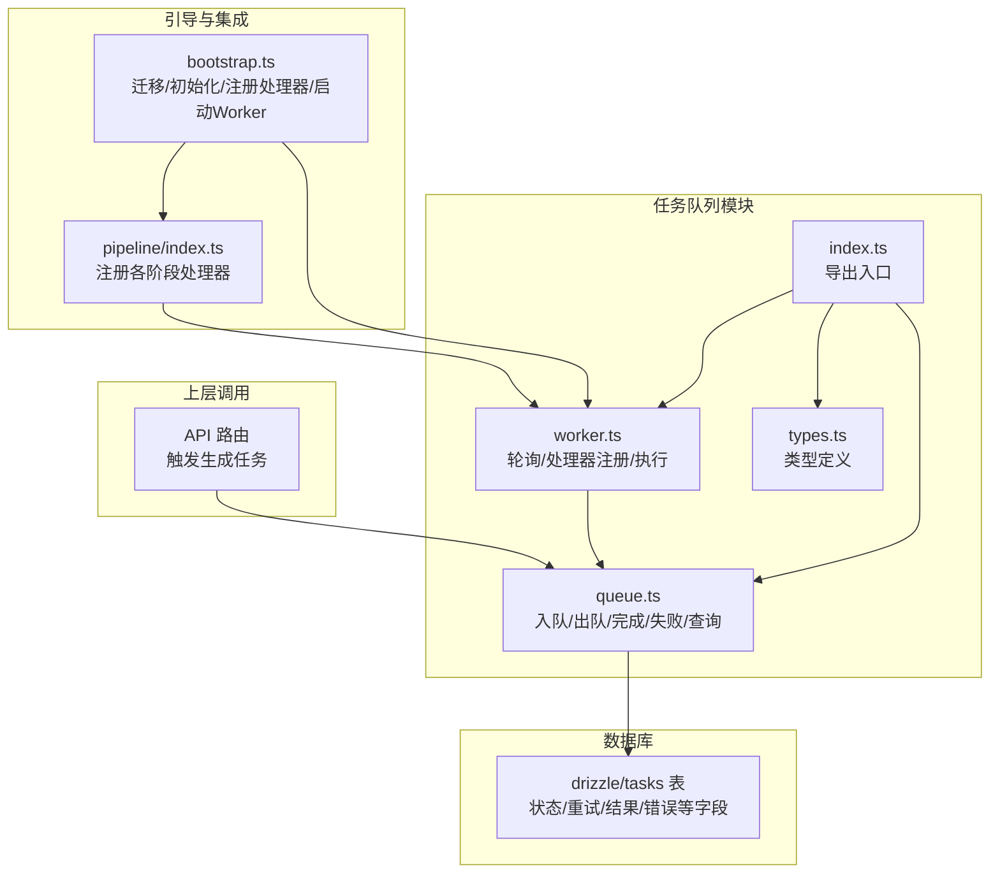
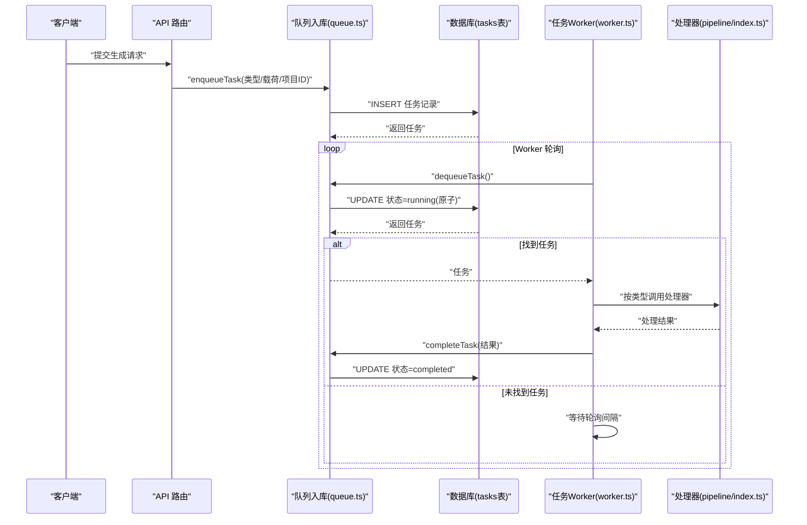
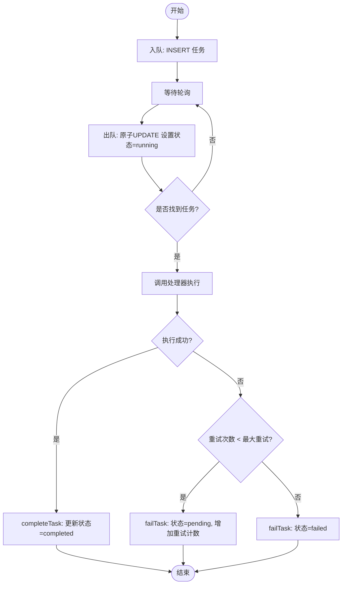
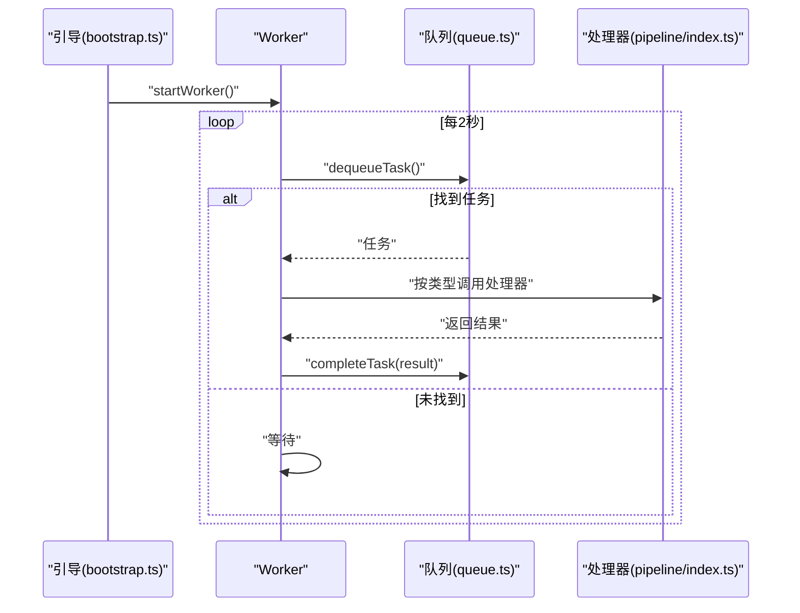
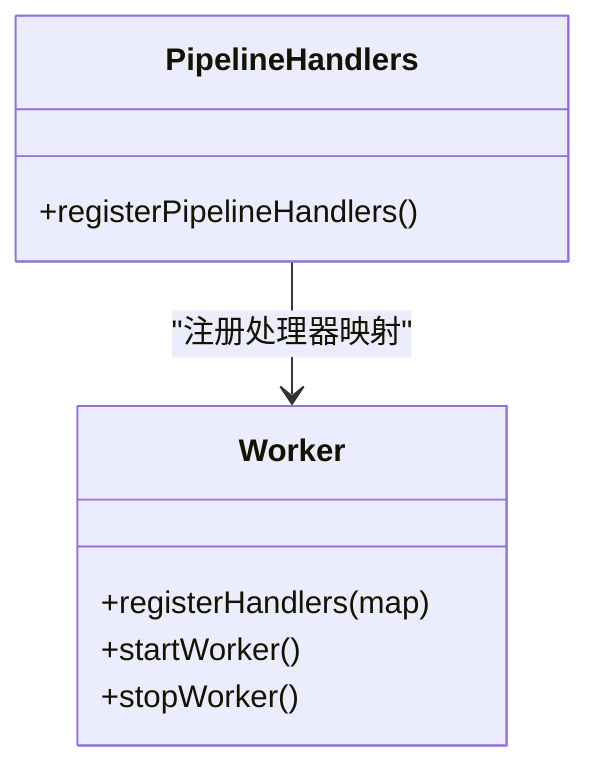
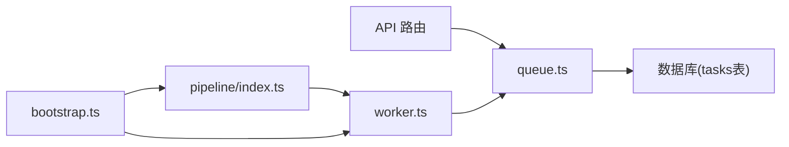

# 任务队列系统

<cite>
**本文引用的文件**
- [src/lib/task-queue/index.ts](file://src/lib/task-queue/index.ts)
- [src/lib/task-queue/queue.ts](file://src/lib/task-queue/queue.ts)
- [src/lib/task-queue/worker.ts](file://src/lib/task-queue/worker.ts)
- [src/lib/task-queue/types.ts](file://src/lib/task-queue/types.ts)
- [src/lib/bootstrap.ts](file://src/lib/bootstrap.ts)
- [src/lib/pipeline/index.ts](file://src/lib/pipeline/index.ts)
- [drizzle/meta/0000_snapshot.json](file://drizzle/meta/0000_snapshot.json)
- [src/app/api/projects/[id]/generate/route.ts](file://src/app/api/projects/[id]/generate/route.ts)
</cite>

## 目录
1. [简介](#简介)
2. [项目结构](#项目结构)
3. [核心组件](#核心组件)
4. [架构总览](#架构总览)
5. [详细组件分析](#详细组件分析)
6. [依赖关系分析](#依赖关系分析)
7. [性能考量](#性能考量)
8. [故障排查指南](#故障排查指南)
9. [结论](#结论)
10. [附录](#附录)

## 简介
本文件面向AIComicBuilder的任务队列系统，系统采用“数据库驱动”的轻量级异步任务架构：通过关系型数据库表存储任务状态与元数据，使用轮询式Worker从数据库中“认领”待执行任务，并在处理器中完成具体业务逻辑。该设计具备以下特点：
- 无外部消息中间件依赖，部署简单
- 基于数据库事务保证任务认领的原子性
- 支持任务重试、失败标记与结果回写
- 提供按项目维度的任务查询能力
- 通过引导流程自动注册处理器并启动Worker

## 项目结构
任务队列相关代码集中在src/lib/task-queue目录，配合引导流程与管道处理器共同构成完整的异步处理链路。

图表来源
- [src/lib/task-queue/index.ts:1-3](file://src/lib/task-queue/index.ts#L1-L3)
- [src/lib/task-queue/queue.ts:1-100](file://src/lib/task-queue/queue.ts#L1-L100)
- [src/lib/task-queue/worker.ts:1-56](file://src/lib/task-queue/worker.ts#L1-L56)
- [src/lib/task-queue/types.ts:1-10](file://src/lib/task-queue/types.ts#L1-L10)
- [src/lib/bootstrap.ts:1-25](file://src/lib/bootstrap.ts#L1-L25)
- [src/lib/pipeline/index.ts:1-22](file://src/lib/pipeline/index.ts#L1-L22)
- [drizzle/meta/0000_snapshot.json:344-398](file://drizzle/meta/0000_snapshot.json#L344-L398)

章节来源
- [src/lib/task-queue/index.ts:1-3](file://src/lib/task-queue/index.ts#L1-L3)
- [src/lib/task-queue/queue.ts:1-100](file://src/lib/task-queue/queue.ts#L1-L100)
- [src/lib/task-queue/worker.ts:1-56](file://src/lib/task-queue/worker.ts#L1-L56)
- [src/lib/task-queue/types.ts:1-10](file://src/lib/task-queue/types.ts#L1-L10)
- [src/lib/bootstrap.ts:1-25](file://src/lib/bootstrap.ts#L1-L25)
- [src/lib/pipeline/index.ts:1-22](file://src/lib/pipeline/index.ts#L1-L22)
- [drizzle/meta/0000_snapshot.json:344-398](file://drizzle/meta/0000_snapshot.json#L344-L398)

## 核心组件
- 入队/出队/完成/失败/查询
  - 入队：支持指定任务类型、项目ID、载荷、最大重试次数、定时执行时间、剧集ID等参数，返回插入后的任务记录。
  - 出队：原子性地将满足条件的“待处理”任务标记为“运行中”，按创建时间升序选择最早的任务。
  - 完成：将任务标记为“已完成”，并写入结果。
  - 失败：根据最大重试次数决定将任务重置为“待处理”或标记为“失败”，同时记录错误信息与重试计数。
  - 查询：按项目ID查询任务列表（按创建时间升序）。
- Worker
  - 注册处理器：建立“任务类型 → 处理器函数”的映射。
  - 轮询执行：固定间隔轮询数据库获取任务，执行后回写结果或失败信息。
  - 生命周期：启动/停止，避免重复启动。
- 类型定义
  - Task：数据库tasks表的行模型。
  - TaskType：任务类型枚举值（来自表字段）。
  - TaskHandler：单个任务类型的处理器签名。
  - TaskHandlerMap：任务类型到处理器的映射。
- 引导流程
  - 运行数据库迁移、初始化AI Provider、注册管道处理器、启动Worker。
- 管道处理器
  - 将多个任务类型与具体业务处理函数绑定，覆盖脚本大纲、解析、角色提取、分镜拆分、帧生成、视频生成、视频拼接等阶段。

章节来源
- [src/lib/task-queue/queue.ts:7-29](file://src/lib/task-queue/queue.ts#L7-L29)
- [src/lib/task-queue/queue.ts:31-50](file://src/lib/task-queue/queue.ts#L31-L50)
- [src/lib/task-queue/queue.ts:52-60](file://src/lib/task-queue/queue.ts#L52-L60)
- [src/lib/task-queue/queue.ts:62-92](file://src/lib/task-queue/queue.ts#L62-L92)
- [src/lib/task-queue/queue.ts:94-100](file://src/lib/task-queue/queue.ts#L94-L100)
- [src/lib/task-queue/worker.ts:9-11](file://src/lib/task-queue/worker.ts#L9-L11)
- [src/lib/task-queue/worker.ts:29-44](file://src/lib/task-queue/worker.ts#L29-L44)
- [src/lib/task-queue/worker.ts:46-56](file://src/lib/task-queue/worker.ts#L46-L56)
- [src/lib/task-queue/types.ts:4-10](file://src/lib/task-queue/types.ts#L4-L10)
- [src/lib/bootstrap.ts:8-25](file://src/lib/bootstrap.ts#L8-L25)
- [src/lib/pipeline/index.ts:11-22](file://src/lib/pipeline/index.ts#L11-L22)

## 架构总览
下图展示了从API触发到任务执行与结果回写的端到端流程。

图表来源
- [src/app/api/projects/[id]/generate/route.ts](file://src/app/api/projects/[id]/generate/route.ts#L2894-L2919)
- [src/lib/task-queue/queue.ts:7-29](file://src/lib/task-queue/queue.ts#L7-L29)
- [src/lib/task-queue/queue.ts:31-50](file://src/lib/task-queue/queue.ts#L31-L50)
- [src/lib/task-queue/worker.ts:29-44](file://src/lib/task-queue/worker.ts#L29-L44)
- [src/lib/pipeline/index.ts:11-22](file://src/lib/pipeline/index.ts#L11-L22)

## 详细组件分析

### 组件A：队列与持久化（queue.ts）
- 设计要点
  - 使用数据库事务与原子更新确保多实例或多线程下的任务认领一致性。
  - 通过“状态”字段与“重试计数”实现任务生命周期管理。
  - 支持“定时执行”字段，用于延迟任务。
- 数据流
  - 入队：生成唯一ID，写入类型、项目ID、载荷、最大重试、定时时间等。
  - 出队：按“待处理”且“未到定时时间或为空”筛选，按创建时间升序，原子更新状态为“运行中”。
  - 完成/失败：根据重试阈值决定“待处理”重试或“失败”终止。
- 错误处理
  - 出队异常会被捕获并记录日志，不影响Worker继续轮询。
  - 处理器抛错会触发failTask，记录错误信息与重试次数。
- 性能影响
  - 轮询间隔为固定毫秒数，可根据吞吐需求调整。
  - 出队SQL包含子查询与排序，建议在tasks表上维护合适的索引（状态、定时时间、创建时间）。

图表来源
- [src/lib/task-queue/queue.ts:7-29](file://src/lib/task-queue/queue.ts#L7-L29)
- [src/lib/task-queue/queue.ts:31-50](file://src/lib/task-queue/queue.ts#L31-L50)
- [src/lib/task-queue/queue.ts:52-60](file://src/lib/task-queue/queue.ts#L52-L60)
- [src/lib/task-queue/queue.ts:62-92](file://src/lib/task-queue/queue.ts#L62-L92)

章节来源
- [src/lib/task-queue/queue.ts:7-29](file://src/lib/task-queue/queue.ts#L7-L29)
- [src/lib/task-queue/queue.ts:31-50](file://src/lib/task-queue/queue.ts#L31-L50)
- [src/lib/task-queue/queue.ts:52-60](file://src/lib/task-queue/queue.ts#L52-L60)
- [src/lib/task-queue/queue.ts:62-92](file://src/lib/task-queue/queue.ts#L62-L92)
- [src/lib/task-queue/queue.ts:94-100](file://src/lib/task-queue/queue.ts#L94-L100)

### 组件B：Worker进程管理（worker.ts）
- 设计要点
  - 单例运行标志，防止重复启动。
  - 固定轮询间隔，避免忙等。
  - 处理器注册采用映射表，支持动态扩展。
- 执行流程
  - 启动：设置运行标志，开始轮询。
  - 轮询：尝试出队，若找到任务则调用对应处理器；异常被捕获并记录。
  - 停止：清空运行标志，后续轮询直接返回。
- 并发控制
  - 当前实现为单实例Worker串行执行；如需并发，可在多实例部署时共享数据库，利用原子认领实现天然去重。

图表来源
- [src/lib/bootstrap.ts:21-22](file://src/lib/bootstrap.ts#L21-L22)
- [src/lib/task-queue/worker.ts:29-44](file://src/lib/task-queue/worker.ts#L29-L44)
- [src/lib/pipeline/index.ts:11-22](file://src/lib/pipeline/index.ts#L11-L22)

章节来源
- [src/lib/task-queue/worker.ts:9-11](file://src/lib/task-queue/worker.ts#L9-L11)
- [src/lib/task-queue/worker.ts:29-44](file://src/lib/task-queue/worker.ts#L29-L44)
- [src/lib/task-queue/worker.ts:46-56](file://src/lib/task-queue/worker.ts#L46-L56)
- [src/lib/bootstrap.ts:21-22](file://src/lib/bootstrap.ts#L21-L22)

### 组件C：处理器注册与管道（pipeline/index.ts）
- 设计要点
  - 将任务类型与具体业务处理函数绑定，形成可扩展的流水线。
  - 在引导阶段统一注册，确保Worker启动后即可识别所有任务类型。
- 典型任务类型
  - 脚本大纲生成、脚本解析、角色提取、角色图像生成、分镜拆分、关键帧生成、视频生成、视频拼接等。

图表来源
- [src/lib/pipeline/index.ts:11-22](file://src/lib/pipeline/index.ts#L11-L22)
- [src/lib/task-queue/worker.ts:9-11](file://src/lib/task-queue/worker.ts#L9-L11)

章节来源
- [src/lib/pipeline/index.ts:11-22](file://src/lib/pipeline/index.ts#L11-L22)
- [src/lib/task-queue/worker.ts:9-11](file://src/lib/task-queue/worker.ts#L9-L11)

### 组件D：数据库模式与任务持久化（drizzle/meta/0000_snapshot.json）
- 关键字段
  - type：任务类型
  - status：任务状态（默认待处理）
  - payload/result/error：任务载荷、结果、错误信息
  - retries/max_retries：当前重试次数与最大重试
  - scheduledAt：定时执行时间
  - projectId/episodeId：关联上下文
- 设计意义
  - 以数据库作为单一事实源，便于审计、查询与恢复。
  - 通过状态机管理任务生命周期，简化上层逻辑。

章节来源
- [drizzle/meta/0000_snapshot.json:344-398](file://drizzle/meta/0000_snapshot.json#L344-L398)

### 组件E：API触发与任务入队（API 路由）
- 设计要点
  - API路由根据项目/剧集配置与用户输入构建任务载荷，调用入队接口将任务持久化。
  - 通过任务类型与处理器映射，实现不同阶段的异步处理。
- 典型场景
  - 批量视频提示词生成、角色图像生成、视频拼接等。

章节来源
- [src/app/api/projects/[id]/generate/route.ts:2894-L2919](file://src/app/api/projects/[id]/generate/route.ts#L2894-L2919)

## 依赖关系分析
- 模块内聚与耦合
  - queue.ts与数据库紧密耦合，承担持久化职责；对外暴露简洁的API。
  - worker.ts仅依赖queue.ts与处理器映射，职责清晰。
  - pipeline/index.ts负责处理器注册，与业务流程强相关但对队列实现透明。
  - bootstrap.ts协调初始化顺序，是系统启动的关键枢纽。
- 外部依赖
  - Drizzle ORM用于数据库访问。
  - Node.js定时器用于轮询控制。
- 循环依赖
  - 未发现循环导入；模块间为单向依赖。

图表来源
- [src/app/api/projects/[id]/generate/route.ts](file://src/app/api/projects/[id]/generate/route.ts#L2894-L2919)
- [src/lib/task-queue/queue.ts:1-100](file://src/lib/task-queue/queue.ts#L1-L100)
- [src/lib/task-queue/worker.ts:1-56](file://src/lib/task-queue/worker.ts#L1-L56)
- [src/lib/pipeline/index.ts:1-22](file://src/lib/pipeline/index.ts#L1-L22)
- [src/lib/bootstrap.ts:1-25](file://src/lib/bootstrap.ts#L1-L25)

章节来源
- [src/lib/task-queue/index.ts:1-3](file://src/lib/task-queue/index.ts#L1-L3)
- [src/lib/bootstrap.ts:8-25](file://src/lib/bootstrap.ts#L8-L25)
- [src/lib/pipeline/index.ts:1-22](file://src/lib/pipeline/index.ts#L1-L22)

## 性能考量
- 轮询间隔
  - 当前固定轮询间隔为毫秒级，适合低至中等吞吐场景；高并发时可考虑缩短间隔或引入更高效的事件通知机制（如数据库变更监听）。
- 数据库压力
  - 出队SQL包含子查询与排序，建议在tasks(status, scheduledAt, createdAt)上建立复合索引以提升查询效率。
- 并发扩展
  - 单实例串行执行，可通过水平扩展多个Worker实例共享数据库来提升吞吐；原子认领天然避免重复执行。
- 结果回写
  - 完成/失败操作为简单更新，建议在高并发下关注数据库连接池与事务隔离级别。

## 故障排查指南
- Worker未启动
  - 检查引导流程是否调用启动函数，确认处理器已注册。
- 任务长期处于“待处理”
  - 检查Worker日志是否存在轮询异常；确认数据库连接正常。
- 处理器未匹配
  - 确认任务类型与处理器映射一致；检查注册顺序。
- 重试过多仍失败
  - 查看任务记录中的错误信息与重试次数；核对业务处理器的异常处理逻辑。
- 数据库锁与竞争
  - 若出现大量竞争，建议增加Worker实例数量并优化数据库索引。

章节来源
- [src/lib/bootstrap.ts:21-22](file://src/lib/bootstrap.ts#L21-L22)
- [src/lib/task-queue/worker.ts:37-39](file://src/lib/task-queue/worker.ts#L37-L39)
- [src/lib/task-queue/queue.ts:62-92](file://src/lib/task-queue/queue.ts#L62-L92)

## 结论
该任务队列系统以“数据库即消息队列”的理念实现了轻量、可靠、易部署的异步处理框架。通过原子认领、状态机与重试机制，系统在无外部中间件的前提下提供了基本的可靠性保障。结合引导流程与管道处理器，能够快速扩展新的任务类型与业务流程。对于更高吞吐与更低延迟的需求，可考虑引入消息队列或数据库变更事件驱动的改进方案。

## 附录
- 任务类型建议
  - 可基于现有类型扩展：如“草稿生成”、“质量检测”、“资源清理”等。
- 监控与指标
  - 建议采集：队列长度、平均处理时长、失败率、重试次数分布、Worker存活状态等。
- 扩展性与容灾
  - 多实例Worker共享数据库；失败任务可迁移到死信队列或单独表进行人工干预。
- 负载均衡
  - 通过多实例Worker与数据库原子认领实现天然的负载均衡；必要时可按项目ID分片。