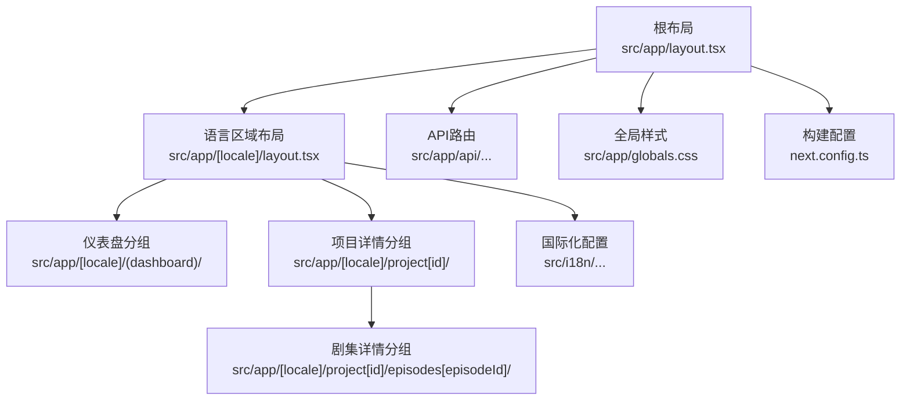
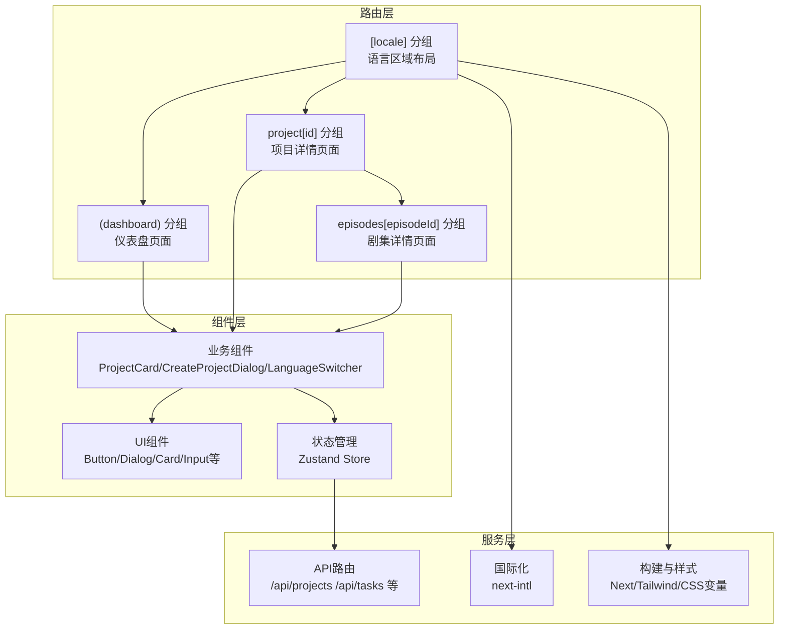
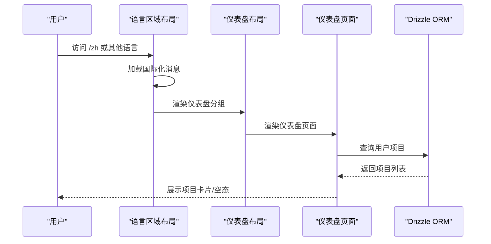
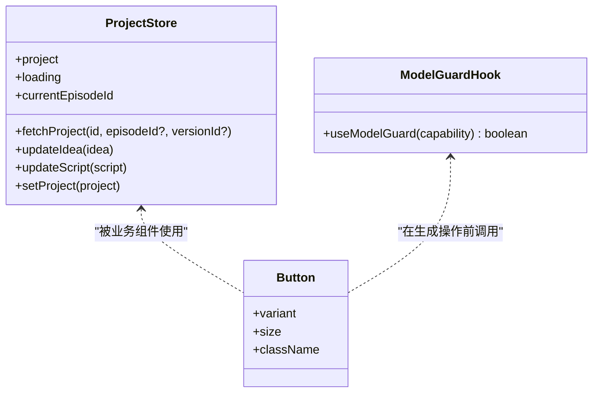
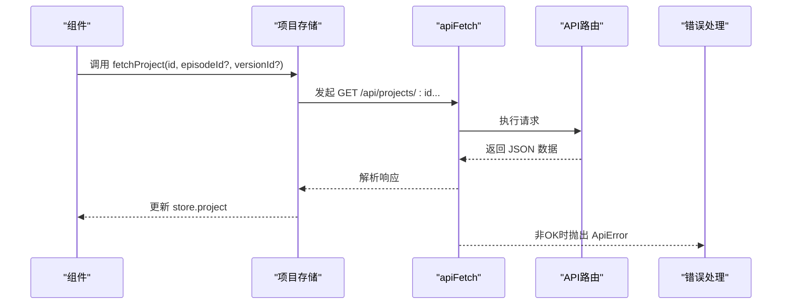
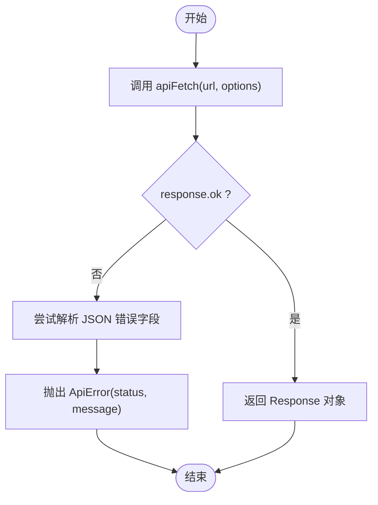
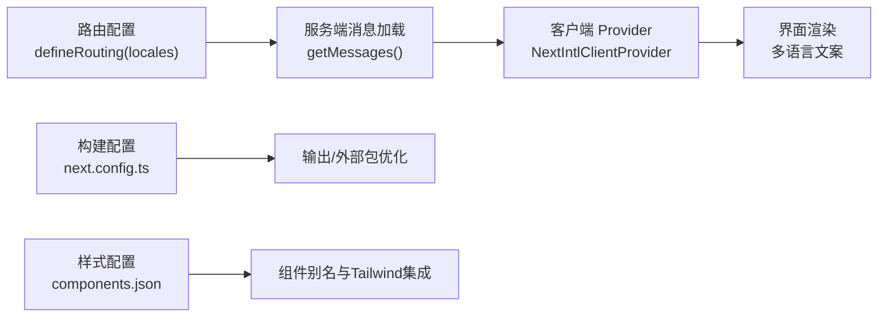
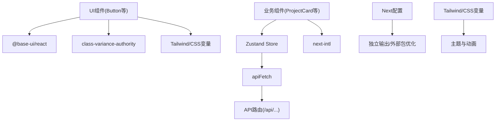

# 前端架构

<cite>
**本文引用的文件**
- [src/app/layout.tsx](file://src/app/layout.tsx)
- [src/app/[locale]/layout.tsx](file://src/app/[locale]/layout.tsx)
- [src/app/[locale]/(dashboard)/layout.tsx](file://src/app/[locale]/(dashboard)/layout.tsx)
- [src/app/[locale]/(dashboard)/page.tsx](file://src/app/[locale]/(dashboard)/page.tsx)
- [src/app/[locale]/project[id]/layout.tsx](file://src/app/[locale]/project[id]/layout.tsx)
- [src/app/[locale]/project[id]/episodes[episodeId]/layout.tsx](file://src/app/[locale]/project[id]/episodes[episodeId]/layout.tsx)
- [src/app/[locale]/project[id]/episodes[episodeId]/preview/page.tsx](file://src/app/[locale]/project[id]/episodes[episodeId]/preview/page.tsx)
- [src/app/[locale]/project[id]/episodes[episodeId]/script/page.tsx](file://src/app/[locale]/project[id]/episodes[episodeId]/script/page.tsx)
- [src/app/[locale]/project[id]/episodes[episodeId]/storyboard/page.tsx](file://src/app/[locale]/project[id]/episodes[episodeId]/storyboard/page.tsx)
- [src/app/[locale]/project[id]/characters/page.tsx](file://src/app/[locale]/project[id]/characters/page.tsx)
- [src/app/[locale]/settings/page.tsx](file://src/app/[locale]/settings/page.tsx)
- [src/app/[locale]/settings/prompts/page.tsx](file://src/app/[locale]/settings/prompts/page.tsx)
- [src/app/api/projects/[id]/route.ts](file://src/app/api/projects/[id]/route.ts)
- [src/app/api/projects/[id]/episodes/[episodeId]/route.ts](file://src/app/api/projects/[id]/episodes/[episodeId]/route.ts)
- [src/app/api/projects/[id]/generate/route.ts](file://src/app/api/projects/[id]/generate/route.ts)
- [src/app/api/tasks[id]/route.ts](file://src/app/api/tasks[id]/route.ts)
- [src/lib/api-fetch.ts](file://src/lib/api-fetch.ts)
- [src/stores/project-store.ts](file://src/stores/project-store.ts)
- [src/hooks/use-model-guard.ts](file://src/hooks/use-model-guard.ts)
- [src/components/ui/button.tsx](file://src/components/ui/button.tsx)
- [src/components/project-card.tsx](file://src/components/project-card.tsx)
- [src/components/create-project-dialog.tsx](file://src/components/create-project-dialog.tsx)
- [src/components/language-switcher.tsx](file://src/components/language-switcher.tsx)
- [src/components/fingerprint-provider.tsx](file://src/components/fingerprint-provider.tsx)
- [src/i18n/routing.ts](file://src/i18n/routing.ts)
- [src/i18n/request.ts](file://src/i18n/request.ts)
- [next.config.ts](file://next.config.ts)
- [package.json](file://package.json)
- [components.json](file://components.json)
- [src/app/globals.css](file://src/app/globals.css)
</cite>

## 目录
1. [引言](#引言)
2. [项目结构](#项目结构)
3. [核心组件](#核心组件)
4. [架构总览](#架构总览)
5. [详细组件分析](#详细组件分析)
6. [依赖关系分析](#依赖关系分析)
7. [性能考虑](#性能考虑)
8. [故障排查指南](#故障排查指南)
9. [结论](#结论)
10. [附录](#附录)

## 引言
本文件面向AIComicBuilder前端团队与技术读者，系统化梳理基于Next.js 16的应用层架构，覆盖App Router组织、页面路由与布局体系、React组件体系与UI库、状态管理、前后端交互与错误处理、性能优化、国际化与构建配置等主题。文档以“可读性优先”为原则，既提供高层概览，也给出代码级图示与定位路径，便于快速定位实现细节。

## 项目结构
- 应用入口与根布局：根目录下定义全局样式与最小化RootLayout，语言区域与国际化在子路由层组织。
- 路由组织：采用App Router的嵌套路由与分组（parentheses）组织页面，如仪表盘分组、项目详情分组等；多语言通过动态段[locale]实现。
- API路由：在src/app/api下集中定义REST接口，按资源与动作划分文件，便于统一治理与版本演进。
- 组件与UI：自研UI组件与业务组件分离，UI组件遵循Base Web理念，结合Tailwind与CSS变量实现主题化。
- 状态管理：以Zustand为核心，围绕项目、剧集、模型等维度建立独立store，配合本地持久化与选择器模式降低重渲染。
- 国际化：基于next-intl，路由层定义可用语言与默认语言，服务端加载消息，客户端提供Provider与切换器。
- 构建与样式：Next.js 16 + Tailwind V4，启用独立输出与外部依赖优化，CSS变量驱动深色/浅色主题与动画。

图表来源
- [src/app/layout.tsx:1-8](file://src/app/layout.tsx#L1-L8)
- [src/app/[locale]/layout.tsx:1-66](file://src/app/[locale]/layout.tsx#L1-L66)
- [src/app/[locale]/(dashboard)/layout.tsx:1-46](file://src/app/[locale]/(dashboard)/layout.tsx#L1-L46)
- [src/app/[locale]/project[id]/layout.tsx](file://src/app/[locale]/project[id]/layout.tsx)
- [src/app/[locale]/project[id]/episodes[episodeId]/layout.tsx](file://src/app/[locale]/project[id]/episodes[episodeId]/layout.tsx)
- [src/app/api/projects/[id]/route.ts](file://src/app/api/projects/[id]/route.ts)
- [src/i18n/routing.ts:1-7](file://src/i18n/routing.ts#L1-L7)
- [src/app/globals.css:1-248](file://src/app/globals.css#L1-L248)
- [next.config.ts:1-16](file://next.config.ts#L1-L16)

章节来源
- [src/app/layout.tsx:1-8](file://src/app/layout.tsx#L1-L8)
- [src/app/[locale]/layout.tsx:1-66](file://src/app/[locale]/layout.tsx#L1-L66)
- [src/app/[locale]/(dashboard)/layout.tsx:1-46](file://src/app/[locale]/(dashboard)/layout.tsx#L1-L46)
- [src/app/[locale]/project[id]/layout.tsx](file://src/app/[locale]/project[id]/layout.tsx)
- [src/app/[locale]/project[id]/episodes[episodeId]/layout.tsx](file://src/app/[locale]/project[id]/episodes[episodeId]/layout.tsx)
- [src/app/api/projects/[id]/route.ts](file://src/app/api/projects/[id]/route.ts)
- [src/i18n/routing.ts:1-7](file://src/i18n/routing.ts#L1-L7)
- [src/app/globals.css:1-248](file://src/app/globals.css#L1-L248)
- [next.config.ts:1-16](file://next.config.ts#L1-L16)

## 核心组件
- UI组件库
  - 按钮组件：基于Base Web按钮与CVA变体系统，支持多种尺寸与风格，结合CSS变量与Tailwind类名实现主题化外观与交互反馈。
  - 其他通用UI：卡片、输入框、对话框、标签、选择器、文本域等，均采用一致的视觉令牌与交互语义。
- 业务组件
  - 项目卡片：展示项目基础信息与状态，用于仪表盘列表。
  - 创建项目对话框：引导用户发起新项目流程。
  - 语言切换器：在多语言环境下切换当前语言。
  - 指纹提供者：为API请求注入用户指纹标识。
- 状态管理
  - 项目存储：封装项目数据获取、版本切换、脚本与创意文案更新等逻辑，统一通过apiFetch访问后端。
  - 模型守卫Hook：在执行AI生成前校验模型配置，未配置时提示并引导至设置页。
- 国际化
  - 路由配置：定义可用语言与默认语言。
  - 请求适配：国际化请求处理器与消息加载。
- 构建与样式
  - Next配置：启用独立输出、外部包优化、Turbopack根路径。
  - 组件别名：shadcn配置映射到源码路径，统一组件与工具函数引用。
  - 全局样式：Tailwind V4、CSS变量主题、暗色/亮色变体、动画与滚动条定制。

章节来源
- [src/components/ui/button.tsx:1-58](file://src/components/ui/button.tsx#L1-L58)
- [src/components/project-card.tsx](file://src/components/project-card.tsx)
- [src/components/create-project-dialog.tsx](file://src/components/create-project-dialog.tsx)
- [src/components/language-switcher.tsx](file://src/components/language-switcher.tsx)
- [src/components/fingerprint-provider.tsx](file://src/components/fingerprint-provider.tsx)
- [src/stores/project-store.ts:1-257](file://src/stores/project-store.ts#L1-L257)
- [src/hooks/use-model-guard.ts:1-51](file://src/hooks/use-model-guard.ts#L1-L51)
- [src/i18n/routing.ts:1-7](file://src/i18n/routing.ts#L1-L7)
- [src/i18n/request.ts](file://src/i18n/request.ts)
- [next.config.ts:1-16](file://next.config.ts#L1-L16)
- [components.json:1-26](file://components.json#L1-L26)
- [src/app/globals.css:1-248](file://src/app/globals.css#L1-L248)

## 架构总览
整体采用“路由即页面”的App Router模式，语言区域作为根级上下文，仪表盘与项目详情分别在不同分组内组织。UI组件与业务组件解耦，状态集中在Zustand store中，API访问通过统一的apiFetch封装，内置用户指纹注入与错误解析。国际化在服务端加载消息并在客户端提供Provider，语言切换器负责运行时切换。

图表来源
- [src/app/[locale]/layout.tsx:1-66](file://src/app/[locale]/layout.tsx#L1-L66)
- [src/app/[locale]/(dashboard)/layout.tsx:1-46](file://src/app/[locale]/(dashboard)/layout.tsx#L1-L46)
- [src/app/[locale]/project[id]/layout.tsx](file://src/app/[locale]/project[id]/layout.tsx)
- [src/app/[locale]/project[id]/episodes[episodeId]/layout.tsx](file://src/app/[locale]/project[id]/episodes[episodeId]/layout.tsx)
- [src/components/project-card.tsx](file://src/components/project-card.tsx)
- [src/components/create-project-dialog.tsx](file://src/components/create-project-dialog.tsx)
- [src/components/language-switcher.tsx](file://src/components/language-switcher.tsx)
- [src/stores/project-store.ts:1-257](file://src/stores/project-store.ts#L1-L257)
- [src/app/api/projects/[id]/route.ts](file://src/app/api/projects/[id]/route.ts)
- [src/app/api/tasks[id]/route.ts](file://src/app/api/tasks[id]/route.ts)
- [src/i18n/routing.ts:1-7](file://src/i18n/routing.ts#L1-L7)
- [next.config.ts:1-16](file://next.config.ts#L1-L16)
- [src/app/globals.css:1-248](file://src/app/globals.css#L1-L248)

## 详细组件分析

### 页面与路由结构
- 语言区域布局：在<html>上注入字体变量与深色类名，在<body>内提供国际化客户端Provider与指纹提供者，并挂载全局通知组件。
- 仪表盘布局：固定头部导航，包含应用Logo、设置与提示模板入口、语言切换器，主体区域承载仪表盘内容。
- 仪表盘页面：根据用户会话从数据库查询项目列表，渲染项目卡片或空态占位。
- 项目详情分组：承载角色、剧集、预览、脚本、故事板等页面，统一由项目布局包裹。
- 剧集详情分组：包含预览、脚本、故事板等子页面，统一由剧集布局包裹。
- 设置页面：提供全局设置入口与提示模板管理入口。

图表来源
- [src/app/[locale]/layout.tsx:1-66](file://src/app/[locale]/layout.tsx#L1-L66)
- [src/app/[locale]/(dashboard)/layout.tsx:1-46](file://src/app/[locale]/(dashboard)/layout.tsx#L1-L46)
- [src/app/[locale]/(dashboard)/page.tsx:1-77](file://src/app/[locale]/(dashboard)/page.tsx#L1-L77)
- [src/app/[locale]/project[id]/layout.tsx](file://src/app/[locale]/project[id]/layout.tsx)
- [src/app/[locale]/project[id]/episodes[episodeId]/layout.tsx](file://src/app/[locale]/project[id]/episodes[episodeId]/layout.tsx)

章节来源
- [src/app/[locale]/layout.tsx:1-66](file://src/app/[locale]/layout.tsx#L1-L66)
- [src/app/[locale]/(dashboard)/layout.tsx:1-46](file://src/app/[locale]/(dashboard)/layout.tsx#L1-L46)
- [src/app/[locale]/(dashboard)/page.tsx:1-77](file://src/app/[locale]/(dashboard)/page.tsx#L1-L77)
- [src/app/[locale]/project[id]/layout.tsx](file://src/app/[locale]/project[id]/layout.tsx)
- [src/app/[locale]/project[id]/episodes[episodeId]/layout.tsx](file://src/app/[locale]/project[id]/episodes[episodeId]/layout.tsx)

### UI组件体系与状态管理
- UI组件：按钮组件通过CVA定义变体与尺寸，结合CSS变量与Tailwind类名实现主题化与交互反馈；其他通用UI遵循相同设计系统。
- 业务组件：项目卡片、创建项目对话框、语言切换器、指纹提供者等，承担页面功能与交互。
- 状态管理：项目存储封装fetchProject、更新创意与脚本、设置项目对象；模型守卫Hook在AI生成前进行能力校验并提示用户前往设置。

图表来源
- [src/stores/project-store.ts:1-257](file://src/stores/project-store.ts#L1-L257)
- [src/hooks/use-model-guard.ts:1-51](file://src/hooks/use-model-guard.ts#L1-L51)
- [src/components/ui/button.tsx:1-58](file://src/components/ui/button.tsx#L1-L58)

章节来源
- [src/components/ui/button.tsx:1-58](file://src/components/ui/button.tsx#L1-L58)
- [src/stores/project-store.ts:1-257](file://src/stores/project-store.ts#L1-L257)
- [src/hooks/use-model-guard.ts:1-51](file://src/hooks/use-model-guard.ts#L1-L51)

### 前后端交互与错误处理
- 统一请求封装：apiFetch在请求头注入用户指纹，对非OK响应抛出ApiError，优先读取后端返回的错误信息。
- 项目数据流：项目存储在fetchProject中调用apiFetch，支持按剧集与版本号参数化查询，避免重复挂载子树。
- 任务与生成：API路由提供生成与任务查询接口，前端通过store触发并轮询任务状态。

图表来源
- [src/stores/project-store.ts:224-239](file://src/stores/project-store.ts#L224-L239)
- [src/lib/api-fetch.ts:10-24](file://src/lib/api-fetch.ts#L10-L24)
- [src/app/api/projects/[id]/route.ts](file://src/app/api/projects/[id]/route.ts)
- [src/app/api/projects/[id]/episodes/[episodeId]/route.ts](file://src/app/api/projects/[id]/episodes/[episodeId]/route.ts)

章节来源
- [src/lib/api-fetch.ts:1-25](file://src/lib/api-fetch.ts#L1-L25)
- [src/stores/project-store.ts:1-257](file://src/stores/project-store.ts#L1-L257)
- [src/app/api/projects/[id]/route.ts](file://src/app/api/projects/[id]/route.ts)
- [src/app/api/projects/[id]/episodes/[episodeId]/route.ts](file://src/app/api/projects/[id]/episodes/[episodeId]/route.ts)

### 错误处理流程
- 请求阶段：apiFetch在fetch后检查response.ok，若失败尝试解析JSON中的错误字段，构造ApiError并抛出。
- UI层面：模型守卫在检测到未配置能力时弹出警告提示，并提供跳转设置页的动作按钮。

图表来源
- [src/lib/api-fetch.ts:10-24](file://src/lib/api-fetch.ts#L10-L24)

章节来源
- [src/lib/api-fetch.ts:1-25](file://src/lib/api-fetch.ts#L1-L25)
- [src/hooks/use-model-guard.ts:29-49](file://src/hooks/use-model-guard.ts#L29-L49)

### 国际化与构建配置
- 国际化：路由层定义locales与默认语言；服务端加载消息；客户端提供Provider；语言切换器负责运行时切换。
- 构建：Next 16配置独立输出、外部包优化、Turbopack根路径；shadcn配置映射组件与工具函数路径；全局样式引入Tailwind与动画库。

图表来源
- [src/i18n/routing.ts:1-7](file://src/i18n/routing.ts#L1-L7)
- [src/app/[locale]/layout.tsx:46-61](file://src/app/[locale]/layout.tsx#L46-L61)
- [next.config.ts:1-16](file://next.config.ts#L1-L16)
- [components.json:1-26](file://components.json#L1-L26)

章节来源
- [src/i18n/routing.ts:1-7](file://src/i18n/routing.ts#L1-L7)
- [src/i18n/request.ts](file://src/i18n/request.ts)
- [src/app/[locale]/layout.tsx:1-66](file://src/app/[locale]/layout.tsx#L1-L66)
- [next.config.ts:1-16](file://next.config.ts#L1-L16)
- [components.json:1-26](file://components.json#L1-L26)
- [src/app/globals.css:1-248](file://src/app/globals.css#L1-L248)

## 依赖关系分析
- 组件与依赖
  - UI组件依赖Base Web与CVA，样式依赖Tailwind与CSS变量。
  - 业务组件依赖状态存储与国际化翻译。
- 状态与API
  - 项目存储依赖apiFetch与后端API路由；模型守卫依赖模型存储与通知组件。
- 构建与样式
  - Next配置影响打包与运行时行为；Tailwind与CSS变量决定主题与动画表现。

图表来源
- [src/components/ui/button.tsx:1-58](file://src/components/ui/button.tsx#L1-L58)
- [src/stores/project-store.ts:1-257](file://src/stores/project-store.ts#L1-L257)
- [src/lib/api-fetch.ts:1-25](file://src/lib/api-fetch.ts#L1-L25)
- [src/app/api/projects/[id]/route.ts](file://src/app/api/projects/[id]/route.ts)
- [next.config.ts:1-16](file://next.config.ts#L1-L16)
- [src/app/globals.css:1-248](file://src/app/globals.css#L1-L248)

章节来源
- [src/components/ui/button.tsx:1-58](file://src/components/ui/button.tsx#L1-L58)
- [src/stores/project-store.ts:1-257](file://src/stores/project-store.ts#L1-L257)
- [src/lib/api-fetch.ts:1-25](file://src/lib/api-fetch.ts#L1-L25)
- [src/app/api/projects/[id]/route.ts](file://src/app/api/projects/[id]/route.ts)
- [next.config.ts:1-16](file://next.config.ts#L1-L16)
- [src/app/globals.css:1-248](file://src/app/globals.css#L1-L248)

## 性能考虑
- 路由与渲染
  - 版本切换时避免卸载子树，仅后台刷新，减少重渲染与资源抖动。
  - 使用分组与嵌套路由，按需加载页面，降低首屏压力。
- 状态管理
  - Zustand选择器模式避免无关状态变更导致的重渲染。
  - 乐观更新与资产辅助函数确保部分数据缺失时的安全读取。
- 样式与动画
  - CSS变量主题与Tailwind原子类提升样式复用效率；动画采用轻量关键帧与延迟序列。
- 构建优化
  - 独立输出与外部包优化减少容器体积与启动时间。
  - Turbopack根路径加速开发体验。

## 故障排查指南
- API错误
  - 现象：请求失败且提示后端错误信息。
  - 排查：确认apiFetch是否正确注入用户指纹；检查后端返回的错误字段；定位具体API路由与参数。
- 模型未配置
  - 现象：执行AI生成前弹出警告并引导至设置页。
  - 排查：确认模型存储已持久化；检查模型守卫返回值；核对设置页配置。
- 国际化异常
  - 现象：语言切换无效或消息缺失。
  - 排查：确认路由定义的语言列表；检查服务端消息加载；验证客户端Provider包裹范围。

章节来源
- [src/lib/api-fetch.ts:1-25](file://src/lib/api-fetch.ts#L1-L25)
- [src/hooks/use-model-guard.ts:1-51](file://src/hooks/use-model-guard.ts#L1-L51)
- [src/i18n/routing.ts:1-7](file://src/i18n/routing.ts#L1-L7)
- [src/app/[locale]/layout.tsx:1-66](file://src/app/[locale]/layout.tsx#L1-L66)

## 结论
本前端架构以Next.js 16与App Router为核心，结合Zustand状态管理、统一API封装与国际化方案，形成清晰的路由、组件与数据流体系。通过CSS变量与Tailwind实现主题化与高性能渲染，借助构建配置优化产物与开发体验。建议在后续迭代中持续完善API路由的版本化与契约约束，强化组件测试与状态快照，以保障复杂场景下的稳定性与可维护性。

## 附录
- 关键实现路径参考
  - 仪表盘页面：[src/app/[locale]/(dashboard)/page.tsx](file://src/app/[locale]/(dashboard)/page.tsx#L1-L77)
  - 项目详情布局：[src/app/[locale]/project[id]/layout.tsx](file://src/app/[locale]/project[id]/layout.tsx)
  - 剧集详情布局：[src/app/[locale]/project[id]/episodes[episodeId]/layout.tsx](file://src/app/[locale]/project[id]/episodes[episodeId]/layout.tsx)
  - 预览页面：[src/app/[locale]/project[id]/episodes[episodeId]/preview/page.tsx](file://src/app/[locale]/project[id]/episodes[episodeId]/preview/page.tsx)
  - 脚本页面：[src/app/[locale]/project[id]/episodes[episodeId]/script/page.tsx](file://src/app/[locale]/project[id]/episodes[episodeId]/script/page.tsx)
  - 故事板页面：[src/app/[locale]/project[id]/episodes[episodeId]/storyboard/page.tsx](file://src/app/[locale]/project[id]/episodes[episodeId]/storyboard/page.tsx)
  - 角色页面：[src/app/[locale]/project[id]/characters/page.tsx](file://src/app/[locale]/project[id]/characters/page.tsx)
  - 设置页面：[src/app/[locale]/settings/page.tsx](file://src/app/[locale]/settings/page.tsx)
  - 提示模板设置：[src/app/[locale]/settings/prompts/page.tsx](file://src/app/[locale]/settings/prompts/page.tsx)
  - 项目API路由：[src/app/api/projects/[id]/route.ts](file://src/app/api/projects/[id]/route.ts)
  - 剧集API路由：[src/app/api/projects/[id]/episodes/[episodeId]/route.ts](file://src/app/api/projects/[id]/episodes/[episodeId]/route.ts)
  - 生成API路由：[src/app/api/projects/[id]/generate/route.ts](file://src/app/api/projects/[id]/generate/route.ts)
  - 任务API路由：[src/app/api/tasks[id]/route.ts](file://src/app/api/tasks[id]/route.ts)
  - 统一请求封装：[src/lib/api-fetch.ts:1-25](file://src/lib/api-fetch.ts#L1-L25)
  - 项目存储：[src/stores/project-store.ts:1-257](file://src/stores/project-store.ts#L1-L257)
  - 模型守卫Hook：[src/hooks/use-model-guard.ts:1-51](file://src/hooks/use-model-guard.ts#L1-L51)
  - UI按钮组件：[src/components/ui/button.tsx:1-58](file://src/components/ui/button.tsx#L1-L58)
  - 项目卡片组件：[src/components/project-card.tsx](file://src/components/project-card.tsx)
  - 创建项目对话框：[src/components/create-project-dialog.tsx](file://src/components/create-project-dialog.tsx)
  - 语言切换器：[src/components/language-switcher.tsx](file://src/components/language-switcher.tsx)
  - 指纹提供者：[src/components/fingerprint-provider.tsx](file://src/components/fingerprint-provider.tsx)
  - 国际化路由配置：[src/i18n/routing.ts:1-7](file://src/i18n/routing.ts#L1-L7)
  - 国际化请求适配：[src/i18n/request.ts](file://src/i18n/request.ts)
  - Next构建配置：[next.config.ts:1-16](file://next.config.ts#L1-L16)
  - 组件别名配置：[components.json:1-26](file://components.json#L1-L26)
  - 全局样式：[src/app/globals.css:1-248](file://src/app/globals.css#L1-L248)