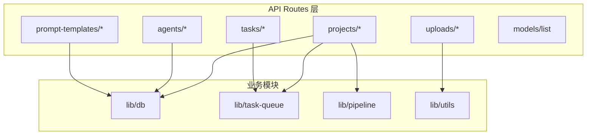
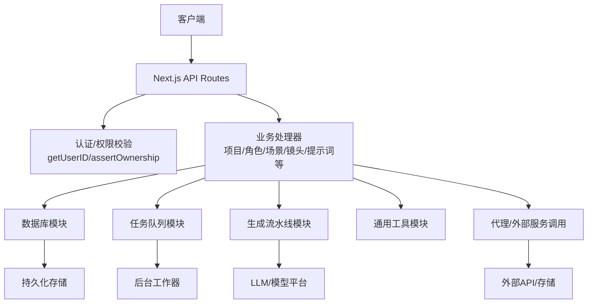
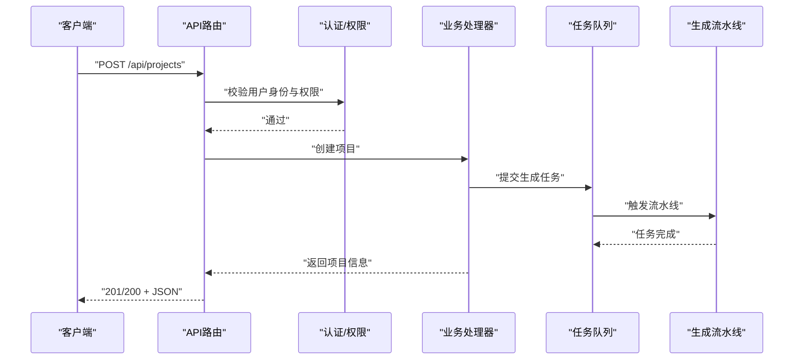
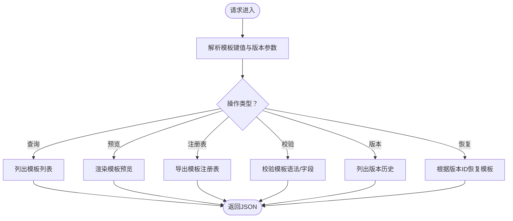
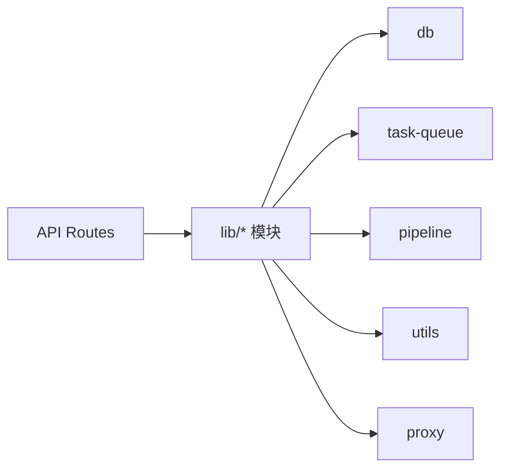

# 后端架构

<cite>
**本文档引用的文件**
- [src/app/api/projects/route.ts](file://src/app/api/projects/route.ts)
- [src/app/api/projects/[id]/route.ts](file://src/app/api/projects/[id]/route.ts)
- [src/app/api/projects/[id]/episodes/route.ts](file://src/app/api/projects/[id]/episodes/route.ts)
- [src/app/api/projects/[id]/shots/route.ts](file://src/app/api/projects/[id]/shots/route.ts)
- [src/app/api/projects/[id]/characters/route.ts](file://src/app/api/projects/[id]/characters/route.ts)
- [src/app/api/projects/[id]/generate/route.ts](file://src/app/api/projects/[id]/generate/route.ts)
- [src/app/api/projects/[id]/import/generate/route.ts](file://src/app/api/projects/[id]/import/generate/route.ts)
- [src/app/api/projects/[id]/prompt-templates/route.ts](file://src/app/api/projects/[id]/prompt-templates/route.ts)
- [src/app/api/projects/[id]/mood-board/route.ts](file://src/app/api/projects/[id]/mood-board/route.ts)
- [src/app/api/prompt-templates/route.ts](file://src/app/api/prompt-templates/route.ts)
- [src/app/api/prompt-templates/[promptKey]/route.ts](file://src/app/api/prompt-templates/[promptKey]/route.ts)
- [src/app/api/prompt-templates/[promptKey]/versions/route.ts](file://src/app/api/prompt-templates/[promptKey]/versions/route.ts)
- [src/app/api/prompt-templates/[promptKey]/versions/[vid]/restore/route.ts](file://src/app/api/prompt-templates/[promptKey]/versions/[vid]/restore/route.ts)
- [src/app/api/agents/route.ts](file://src/app/api/agents/route.ts)
- [src/app/api/agents/[id]/route.ts](file://src/app/api/agents/[id]/route.ts)
- [src/app/api/models/list/route.ts](file://src/app/api/models/list/route.ts)
- [src/app/api/tasks/[id]/route.ts](file://src/app/api/tasks/[id]/route.ts)
- [src/app/api/uploads/[...path]/route.ts](file://src/app/api/uploads/[...path]/route.ts)
- [src/lib/bootstrap.ts](file://src/lib/bootstrap.ts)
- [src/lib/get-user-id.ts](file://src/lib/get-user-id.ts)
- [src/lib/assert-project-ownership.ts](file://src/lib/assert-project-ownership.ts)
- [src/lib/api-fetch.ts](file://src/lib/api-fetch.ts)
- [src/lib/db/index.ts](file://src/lib/db/index.ts)
- [src/lib/task-queue/index.ts](file://src/lib/task-queue/index.ts)
- [src/lib/pipeline/index.ts](file://src/lib/pipeline/index.ts)
- [src/lib/utils.ts](file://src/lib/utils.ts)
- [src/instrumentation.ts](file://src/instrumentation.ts)
- [src/proxy.ts](file://src/proxy.ts)
- [package.json](file://package.json)
- [next.config.ts](file://next.config.ts)
</cite>

## 目录
1. [引言](#引言)
2. [项目结构](#项目结构)
3. [核心组件](#核心组件)
4. [架构总览](#架构总览)
5. [详细组件分析](#详细组件分析)
6. [依赖关系分析](#依赖关系分析)
7. [性能考虑](#性能考虑)
8. [故障排除指南](#故障排除指南)
9. [结论](#结论)

## 引言
本文件面向AIComicBuilder后端架构，聚焦于基于Next.js App Router的API Routes设计与实现。文档从系统架构、路由组织、请求处理流程、中间件与错误处理策略、服务职责分离与模块化设计、认证授权与安全防护、API版本管理与速率限制、到性能监控与可观测性等方面进行深入解析，并通过图示展示关键流程与依赖关系。

## 项目结构
后端采用Next.js App Router的API Routes组织方式，所有API端点位于`src/app/api`目录下，按资源域（projects、agents、prompt-templates等）分层组织，支持动态路由参数与嵌套路由，形成清晰的REST风格接口集合。同时，业务逻辑通过lib目录下的模块化组件（数据库、任务队列、流水线、工具函数等）实现解耦。

图表来源
- [src/app/api/projects/route.ts](file://src/app/api/projects/route.ts)
- [src/app/api/agents/route.ts](file://src/app/api/agents/route.ts)
- [src/app/api/prompt-templates/route.ts](file://src/app/api/prompt-templates/route.ts)
- [src/app/api/tasks/[id]/route.ts](file://src/app/api/tasks/[id]/route.ts)
- [src/app/api/uploads/[...path]/route.ts](file://src/app/api/uploads/[...path]/route.ts)
- [src/lib/db/index.ts](file://src/lib/db/index.ts)
- [src/lib/task-queue/index.ts](file://src/lib/task-queue/index.ts)
- [src/lib/pipeline/index.ts](file://src/lib/pipeline/index.ts)
- [src/lib/utils.ts](file://src/lib/utils.ts)

章节来源
- [src/app/api/projects/route.ts](file://src/app/api/projects/route.ts)
- [src/app/api/agents/route.ts](file://src/app/api/agents/route.ts)
- [src/app/api/prompt-templates/route.ts](file://src/app/api/prompt-templates/route.ts)
- [src/app/api/tasks/[id]/route.ts](file://src/app/api/tasks/[id]/route.ts)
- [src/app/api/uploads/[...path]/route.ts](file://src/app/api/uploads/[...path]/route.ts)

## 核心组件
- API路由系统：以App Router的API Routes为核心，按资源域划分，支持动态参数与嵌套路由，统一返回JSON响应与HTTP状态码。
- 中间件机制：通过Next.js中间件链路与自定义工具函数实现认证、权限校验与请求预处理。
- 错误处理策略：集中式错误捕获与标准化响应，结合HTTP状态码与错误上下文信息。
- 服务职责分离：数据库访问、任务调度、AI生成流水线、通用工具函数分别封装在独立模块中，降低耦合度。
- 模块化设计：lib目录下各模块通过明确接口协作，便于测试与替换。
- 依赖注入模式：通过构造函数或工厂函数注入依赖（如数据库连接、任务队列实例），提升可测试性与灵活性。

章节来源
- [src/lib/bootstrap.ts](file://src/lib/bootstrap.ts)
- [src/lib/get-user-id.ts](file://src/lib/get-user-id.ts)
- [src/lib/assert-project-ownership.ts](file://src/lib/assert-project-ownership.ts)
- [src/lib/api-fetch.ts](file://src/lib/api-fetch.ts)

## 架构总览
后端整体架构围绕“API Routes → 业务模块 → 外部服务”的层次展开。API Routes负责路由匹配与参数解析；业务模块封装领域逻辑；外部服务（如AI模型平台、存储服务）通过代理与工具函数对接。

图表来源
- [src/app/api/projects/[id]/route.ts](file://src/app/api/projects/[id]/route.ts)
- [src/lib/get-user-id.ts](file://src/lib/get-user-id.ts)
- [src/lib/assert-project-ownership.ts](file://src/lib/assert-project-ownership.ts)
- [src/lib/db/index.ts](file://src/lib/db/index.ts)
- [src/lib/task-queue/index.ts](file://src/lib/task-queue/index.ts)
- [src/lib/pipeline/index.ts](file://src/lib/pipeline/index.ts)
- [src/lib/utils.ts](file://src/lib/utils.ts)
- [src/proxy.ts](file://src/proxy.ts)

## 详细组件分析

### 项目资源API（projects）
- 资源域：projects，支持项目创建、查询、更新、删除以及子资源操作（剧集、镜头、角色、提示词模板、情绪分析、生成任务等）。
- 动态路由：支持`[id]`参数定位具体项目；子资源路由按功能细分（如`episodes`、`shots`、`characters`、`generate`等）。
- 认证与权限：通过用户标识与项目归属断言确保操作合法性。
- 典型流程：客户端发起请求 → API路由解析 → 认证/权限校验 → 业务处理器执行 → 数据库/队列/流水线交互 → 返回JSON响应。

图表来源
- [src/app/api/projects/route.ts](file://src/app/api/projects/route.ts)
- [src/app/api/projects/[id]/generate/route.ts](file://src/app/api/projects/[id]/generate/route.ts)
- [src/lib/get-user-id.ts](file://src/lib/get-user-id.ts)
- [src/lib/assert-project-ownership.ts](file://src/lib/assert-project-ownership.ts)
- [src/lib/task-queue/index.ts](file://src/lib/task-queue/index.ts)
- [src/lib/pipeline/index.ts](file://src/lib/pipeline/index.ts)

章节来源
- [src/app/api/projects/route.ts](file://src/app/api/projects/route.ts)
- [src/app/api/projects/[id]/route.ts](file://src/app/api/projects/[id]/route.ts)
- [src/app/api/projects/[id]/episodes/route.ts](file://src/app/api/projects/[id]/episodes/route.ts)
- [src/app/api/projects/[id]/shots/route.ts](file://src/app/api/projects/[id]/shots/route.ts)
- [src/app/api/projects/[id]/characters/route.ts](file://src/app/api/projects/[id]/characters/route.ts)
- [src/app/api/projects/[id]/generate/route.ts](file://src/app/api/projects/[id]/generate/route.ts)

### 提示词模板API（prompt-templates）
- 资源域：prompt-templates，支持模板查询、预览、注册表、校验、版本管理与恢复。
- 版本控制：通过`versions`与`[vid]/restore`实现模板历史版本管理与回滚。
- 预览与校验：提供模板内容预览与有效性校验端点，辅助前端编辑体验。

图表来源
- [src/app/api/prompt-templates/route.ts](file://src/app/api/prompt-templates/route.ts)
- [src/app/api/prompt-templates/[promptKey]/route.ts](file://src/app/api/prompt-templates/[promptKey]/route.ts)
- [src/app/api/prompt-templates/[promptKey]/versions/route.ts](file://src/app/api/prompt-templates/[promptKey]/versions/route.ts)
- [src/app/api/prompt-templates/[promptKey]/versions/[vid]/restore/route.ts](file://src/app/api/prompt-templates/[promptKey]/versions/[vid]/restore/route.ts)

章节来源
- [src/app/api/prompt-templates/route.ts](file://src/app/api/prompt-templates/route.ts)
- [src/app/api/prompt-templates/[promptKey]/route.ts](file://src/app/api/prompt-templates/[promptKey]/route.ts)
- [src/app/api/prompt-templates/[promptKey]/versions/route.ts](file://src/app/api/prompt-templates/[promptKey]/versions/route.ts)
- [src/app/api/prompt-templates/[promptKey]/versions/[vid]/restore/route.ts](file://src/app/api/prompt-templates/[promptKey]/versions/[vid]/restore/route.ts)

### 代理与模型列表API（agents, models/list）
- 代理API：支持代理查询与单个代理详情，用于前端选择与配置生成代理。
- 模型列表API：提供可用模型列表，供前端选择与切换。

章节来源
- [src/app/api/agents/route.ts](file://src/app/api/agents/route.ts)
- [src/app/api/agents/[id]/route.ts](file://src/app/api/agents/[id]/route.ts)
- [src/app/api/models/list/route.ts](file://src/app/api/models/list/route.ts)

### 任务与上传API（tasks, uploads）
- 任务API：根据任务ID查询任务状态与结果，支撑异步生成流程。
- 上传API：支持任意路径上传，适配图片、视频等资源的上传与归档。

章节来源
- [src/app/api/tasks/[id]/route.ts](file://src/app/api/tasks/[id]/route.ts)
- [src/app/api/uploads/[...path]/route.ts](file://src/app/api/uploads/[...path]/route.ts)

## 依赖关系分析
- 组件内聚与耦合：API Routes仅负责路由与参数传递，业务逻辑集中在lib模块；数据库、任务队列、流水线等模块通过明确接口被调用，内聚高、耦合低。
- 外部依赖：通过代理模块与工具函数对接外部服务，避免在路由层直接引入第三方SDK。
- 循环依赖：当前结构未见循环依赖迹象，模块边界清晰。

图表来源
- [src/app/api/projects/[id]/route.ts](file://src/app/api/projects/[id]/route.ts)
- [src/lib/db/index.ts](file://src/lib/db/index.ts)
- [src/lib/task-queue/index.ts](file://src/lib/task-queue/index.ts)
- [src/lib/pipeline/index.ts](file://src/lib/pipeline/index.ts)
- [src/lib/utils.ts](file://src/lib/utils.ts)
- [src/proxy.ts](file://src/proxy.ts)

章节来源
- [src/lib/db/index.ts](file://src/lib/db/index.ts)
- [src/lib/task-queue/index.ts](file://src/lib/task-queue/index.ts)
- [src/lib/pipeline/index.ts](file://src/lib/pipeline/index.ts)
- [src/lib/utils.ts](file://src/lib/utils.ts)
- [src/proxy.ts](file://src/proxy.ts)

## 性能考虑
- 异步任务与队列：通过任务队列模块承载耗时操作，API路由快速返回，提升吞吐量与用户体验。
- 缓存与预热：对热点数据与模板进行缓存，减少重复计算与I/O开销。
- 并发与限流：在网关或边缘层实施速率限制，防止突发流量冲击；在应用层对长耗时操作设置超时与重试策略。
- 监控与追踪：利用Next.js内置指标与自定义instrumentation记录关键指标，结合分布式追踪定位瓶颈。
- 存储优化：对大文件采用CDN与分片策略，减少网络抖动影响。

## 故障排除指南
- 常见错误类型
  - 认证失败：检查用户标识获取与会话状态。
  - 权限不足：确认项目归属断言是否通过。
  - 参数校验失败：核对动态路由参数与请求体格式。
  - 外部服务异常：检查代理配置与超时设置。
- 排查步骤
  - 查看API响应状态码与错误消息。
  - 检查任务队列与流水线日志。
  - 确认数据库事务与一致性。
  - 使用instrumentation输出关键指标与耗时。
- 安全加固
  - 对敏感参数进行脱敏输出。
  - 限制上传文件类型与大小。
  - 实施CORS与内容安全策略。

章节来源
- [src/lib/get-user-id.ts](file://src/lib/get-user-id.ts)
- [src/lib/assert-project-ownership.ts](file://src/lib/assert-project-ownership.ts)
- [src/lib/api-fetch.ts](file://src/lib/api-fetch.ts)
- [src/instrumentation.ts](file://src/instrumentation.ts)

## 结论
AIComicBuilder后端以Next.js API Routes为基础，结合lib模块化的数据库、任务队列、流水线与工具函数，实现了清晰的职责分离与良好的扩展性。通过统一的认证授权、参数校验与错误处理机制，保障了系统的安全性与稳定性。建议在现有基础上完善API版本管理策略、增强速率限制与性能监控能力，并持续优化外部服务集成与缓存策略，以进一步提升系统整体表现。