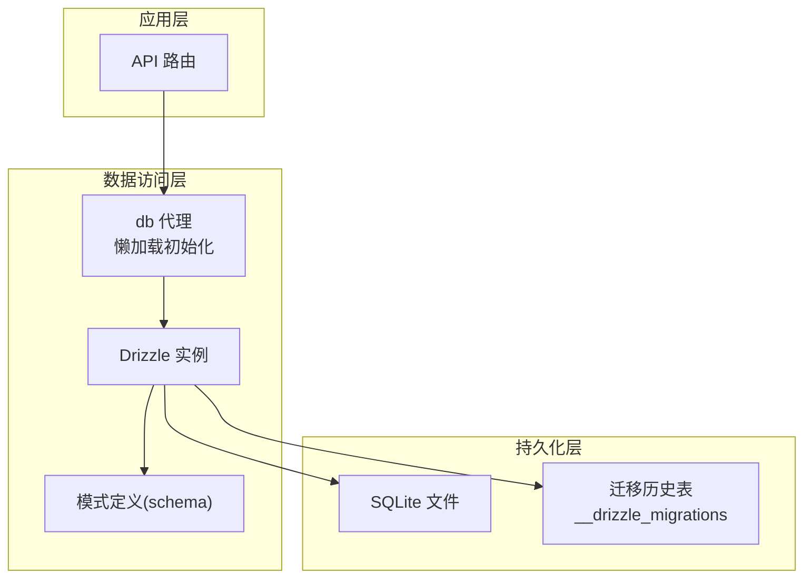
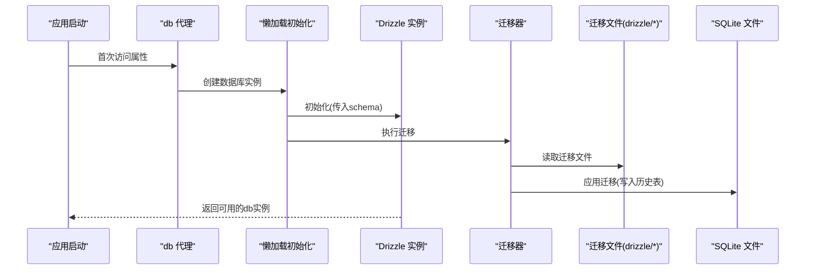
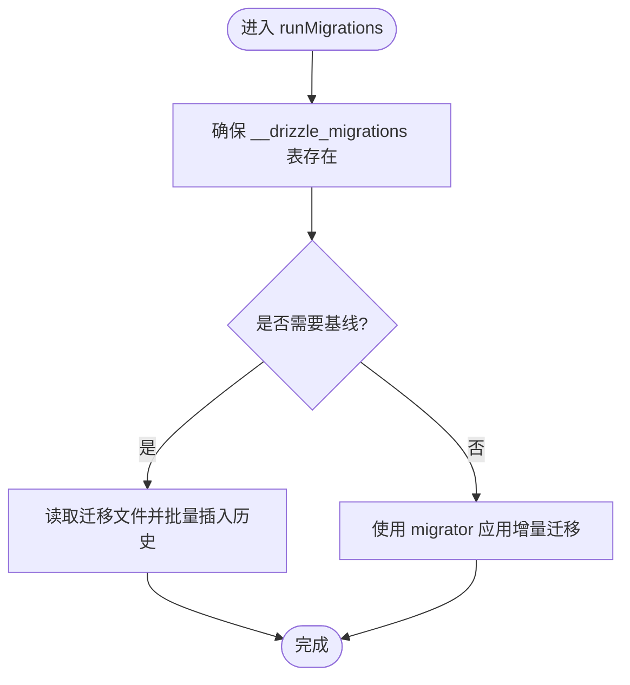
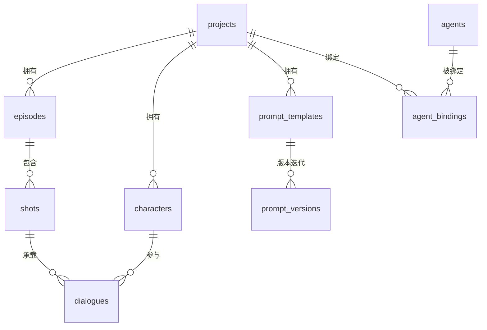
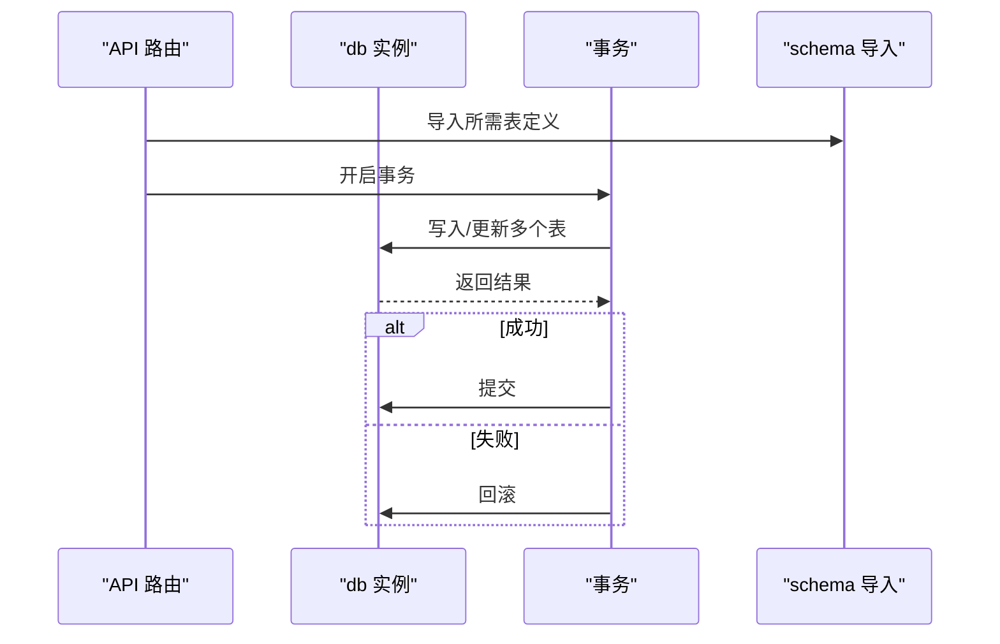
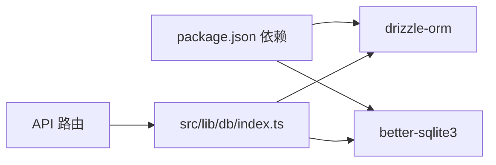

# 数据库层

<cite>
**本文引用的文件**
- [src/lib/db/index.ts](file://src/lib/db/index.ts)
- [drizzle.config.ts](file://drizzle.config.ts)
- [drizzle/meta/0000_snapshot.json](file://drizzle/meta/0000_snapshot.json)
- [drizzle/0000_chemical_tyrannus.sql](file://drizzle/0000_chemical_tyrannus.sql)
- [drizzle/0053_add_agent_platform.sql](file://drizzle/0053_add_agent_platform.sql)
- [src/app/api/projects/[id]/generate/route.ts](file://src/app/api/projects/[id]/generate/route.ts)
- [src/app/api/projects/[id]/episodes/[episodeId]/route.ts](file://src/app/api/projects/[id]/episodes/[episodeId]/route.ts)
- [src/app/api/projects/[id]/characters/[characterId]/route.ts](file://src/app/api/projects/[id]/characters/[characterId]/route.ts)
- [src/app/api/projects/[id]/shots/[shotId]/assets/[assetId]/route.ts](file://src/app/api/projects/[id]/shots/[shotId]/assets/[assetId]/route.ts)
- [src/app/api/projects/[id]/prompt-templates/[promptKey]/versions/[vid]/route.ts](file://src/app/api/projects/[id]/prompt-templates/[promptKey]/versions/[vid]/route.ts)
- [src/app/api/projects/[id]/prompt-templates/[promptKey]/versions/[vid]/restore/route.ts](file://src/app/api/projects/[id]/prompt-templates/[promptKey]/versions/[vid]/restore/route.ts)
- [src/app/api/projects/[id]/prompt-templates/[promptKey]/route.ts](file://src/app/api/projects/[id]/prompt-templates/[promptKey]/route.ts)
- [src/app/api/projects/[id]/mood-board/route.ts](file://src/app/api/projects/[id]/mood-board/route.ts)
- [src/app/api/projects/[id]/mood-board/[imageId]/route.ts](file://src/app/api/projects/[id]/mood-board/[imageId]/route.ts)
- [src/app/api/projects/[id]/episodes/reorder/route.ts](file://src/app/api/projects/[id]/episodes/reorder/route.ts)
- [src/app/api/projects/[id]/episodes/route.ts](file://src/app/api/projects/[id]/episodes/route.ts)
- [src/app/api/projects/[id]/download/route.ts](file://src/app/api/projects/[id]/download/route.ts)
- [src/app/api/projects/[id]/import/logs/route.ts](file://src/app/api/projects/[id]/import/logs/route.ts)
- [src/app/api/projects/[id]/import/generate/route.ts](file://src/app/api/projects/[id]/import/generate/route.ts)
- [src/app/api/projects/[id]/import/characters/route.ts](file://src/app/api/projects/[id]/import/characters/route.ts)
- [src/app/api/projects/[id]/import/split/route.ts](file://src/app/api/projects/[id]/import/split/route.ts)
- [src/app/api/projects/[id]/merge-episodes/route.ts](file://src/app/api/projects/[id]/merge-episodes/route.ts)
- [src/app/api/projects/[id]/prompt-templates/preview/route.ts](file://src/app/api/projects/[id]/prompt-templates/preview/route.ts)
- [src/app/api/projects/[id]/prompt-templates/registry/route.ts](file://src/app/api/projects/[id]/prompt-templates/registry/route.ts)
- [src/app/api/projects/[id]/prompt-templates/validate/route.ts](file://src/app/api/projects/[id]/prompt-templates/validate/route.ts)
- [src/app/api/projects/[id]/prompt-templates/preview/route.ts](file://src/app/api/projects/[id]/prompt-templates/preview/route.ts)
- [src/app/api/projects/[id]/prompt-templates/registry/route.ts](file://src/app/api/projects/[id]/prompt-templates/registry/route.ts)
- [src/app/api/projects/[id]/prompt-templates/validate/route.ts](file://src/app/api/projects/[id]/prompt-templates/validate/route.ts)
</cite>

## 目录
1. [简介](#简介)
2. [项目结构](#项目结构)
3. [核心组件](#核心组件)
4. [架构总览](#架构总览)
5. [详细组件分析](#详细组件分析)
6. [依赖分析](#依赖分析)
7. [性能考虑](#性能考虑)
8. [故障排查指南](#故障排查指南)
9. [结论](#结论)
10. [附录](#附录)

## 简介
本文件面向AIComicBuilder项目的数据库层，系统性阐述基于Drizzle ORM的SQLite数据访问层设计与实现，涵盖以下主题：
- 数据库连接管理与懒加载初始化
- 查询构建与事务处理
- 数据库模式设计、表关系与索引策略
- 数据迁移系统、版本控制与演进机制
- 数据模型映射与常用查询模式
- 查询优化与缓存策略建议
- 性能调优、备份恢复与监控告警实施方案

## 项目结构
数据库层主要由三部分组成：
- 运行时数据库访问入口：统一导出db实例，支持懒加载与代理转发
- 模式快照与迁移文件：通过快照与增量SQL迁移维护schema演进
- API路由中的数据访问：在各业务接口中按需使用db进行CRUD与联表查询

图表来源
- [src/lib/db/index.ts:46-186](file://src/lib/db/index.ts#L46-L186)
- [drizzle/config.ts](file://drizzle.config.ts)

章节来源
- [src/lib/db/index.ts:46-186](file://src/lib/db/index.ts#L46-L186)
- [drizzle.config.ts](file://drizzle.config.ts)

## 核心组件
- 数据库实例与懒加载
  - 通过全局缓存避免重复初始化
  - 使用Proxy在首次访问属性时才创建Drizzle实例
- 连接与适配器
  - 基于better-sqlite3驱动，面向本地开发与嵌入式部署
- 迁移系统
  - 自动检测现有schema并进行基线化
  - 使用Drizzle migrator执行增量迁移
- 模式快照
  - 以JSON形式记录初始schema，作为演进起点

章节来源
- [src/lib/db/index.ts:46-186](file://src/lib/db/index.ts#L46-L186)
- [drizzle/meta/0000_snapshot.json:1-152](file://drizzle/meta/0000_snapshot.json#L1-L152)

## 架构总览
数据库层采用“模式快照 + 增量迁移”的演进方式，配合Drizzle ORM提供的类型安全查询能力，实现从schema到查询的全链路可维护性。

图表来源
- [src/lib/db/index.ts:156-172](file://src/lib/db/index.ts#L156-L172)
- [drizzle/0000_chemical_tyrannus.sql](file://drizzle/0000_chemical_tyrannus.sql)

## 详细组件分析

### 组件A：数据库连接与迁移管理
- 功能要点
  - 懒加载：仅在首次访问db属性时创建实例，减少冷启动开销
  - 全局缓存：开发环境缓存实例，避免重复初始化
  - 迁移基线：对已有schema但无迁移历史的情况进行一次性基线
  - 增量迁移：使用Drizzle migrator按顺序执行未应用的迁移
- 关键流程
  - 确保迁移历史表存在
  - 判断是否需要基线
  - 加载迁移文件并应用

图表来源
- [src/lib/db/index.ts:81-172](file://src/lib/db/index.ts#L81-L172)

章节来源
- [src/lib/db/index.ts:81-172](file://src/lib/db/index.ts#L81-L172)

### 组件B：模式快照与表关系
- 快照来源
  - 通过drizzle-kit生成的初始快照，记录表、列、外键等元信息
- 关键表与关系（示例）
  - projects：项目主表
  - episodes：剧集，外键关联projects
  - shots：镜头，可关联episodes与场景等
  - characters：角色，外键关联projects
  - dialogues：对白，外键关联shots与characters
  - prompt_templates/prompt_versions：提示词模板及其版本
  - agent_bindings/agents：智能体绑定与平台信息
- 索引策略
  - 当前快照未包含显式索引定义，建议在高频查询字段上建立索引（如外键、过滤字段、排序字段）

图表来源
- [drizzle/meta/0000_snapshot.json:6-152](file://drizzle/meta/0000_snapshot.json#L6-L152)

章节来源
- [drizzle/meta/0000_snapshot.json:6-152](file://drizzle/meta/0000_snapshot.json#L6-L152)

### 组件C：查询构建与事务处理
- 查询构建
  - 在API路由中按需导入schema，使用Drizzle进行类型安全的查询
  - 支持联表查询、条件筛选、分页与聚合
- 事务处理
  - 对于多步写操作（如生成流程），建议使用事务保证一致性
  - 可参考生成流程中的批量写入模式

图表来源
- [src/app/api/projects/[id]/generate/route.ts](file://src/app/api/projects/[id]/generate/route.ts)
- [src/app/api/projects/[id]/episodes/[episodeId]/route.ts](file://src/app/api/projects/[id]/episodes/[episodeId]/route.ts)

章节来源
- [src/app/api/projects/[id]/generate/route.ts](file://src/app/api/projects/[id]/generate/route.ts)
- [src/app/api/projects/[id]/episodes/[episodeId]/route.ts](file://src/app/api/projects/[id]/episodes/[episodeId]/route.ts)

### 组件D：数据模型映射与常用查询模式
- 角色与角色关系
  - 通过characters与characterRelations实现角色画像与关系网络
- 镜头与资产
  - shots与shot_assets用于镜头级资源管理
- 提示词模板与版本
  - prompt_templates与prompt_versions支持版本对比与回滚
- 情绪曲线与动作
  - emotion-analysis与shot_actions用于镜头细节标注

章节来源
- [src/app/api/projects/[id]/characters/[characterId]/route.ts](file://src/app/api/projects/[id]/characters/[characterId]/route.ts)
- [src/app/api/projects/[id]/shots/[shotId]/assets/[assetId]/route.ts](file://src/app/api/projects/[id]/shots/[shotId]/assets/[assetId]/route.ts)
- [src/app/api/projects/[id]/prompt-templates/[promptKey]/route.ts](file://src/app/api/projects/[id]/prompt-templates/[promptKey]/route.ts)
- [src/app/api/projects/[id]/prompt-templates/[promptKey]/versions/[vid]/route.ts](file://src/app/api/projects/[id]/prompt-templates/[promptKey]/versions/[vid]/route.ts)
- [src/app/api/projects/[id]/prompt-templates/[promptKey]/versions/[vid]/restore/route.ts](file://src/app/api/projects/[id]/prompt-templates/[promptKey]/versions/[vid]/restore/route.ts)

## 依赖分析
- 外部依赖
  - drizzle-orm：ORM核心，支持SQLite与迁移器
  - better-sqlite3：SQLite驱动
- 内部依赖
  - db入口依赖schema定义
  - API路由依赖db入口进行数据访问

图表来源
- [src/lib/db/index.ts:46-186](file://src/lib/db/index.ts#L46-L186)

章节来源
- [src/lib/db/index.ts:46-186](file://src/lib/db/index.ts#L46-L186)

## 性能考虑
- 查询优化
  - 为高频过滤与排序字段建立索引（如外键、时间戳、状态字段）
  - 合理拆分复杂联表查询，必要时使用物化视图或派生表
  - 使用LIMIT与分页，避免一次性返回大量数据
- 缓存策略
  - 对只读或低频变更的数据使用进程内缓存
  - 对跨请求共享的配置类数据设置TTL
- 事务与并发
  - 将多步写操作放入单个事务，减少锁竞争
  - 控制事务粒度，避免长时间持有锁
- 存储与IO
  - SQLite适合中小规模数据；若数据增长显著，评估迁移到服务端数据库
  - 定期检查数据库文件大小与碎片，必要时进行VACUUM

## 故障排查指南
- 迁移失败
  - 确认迁移历史表存在且内容正确
  - 检查迁移文件顺序与冲突
  - 如遇基线场景，确认基线逻辑已执行
- 查询异常
  - 核对schema快照与实际表结构差异
  - 检查外键约束与数据完整性
- 连接问题
  - 确认db实例已正确初始化
  - 检查文件权限与路径

章节来源
- [src/lib/db/index.ts:81-172](file://src/lib/db/index.ts#L81-L172)
- [drizzle/meta/0000_snapshot.json:1-152](file://drizzle/meta/0000_snapshot.json#L1-L152)

## 结论
本数据库层以Drizzle ORM为核心，结合模式快照与增量迁移，提供了可演进、可维护的数据访问方案。通过懒加载初始化与事务封装，兼顾了易用性与可靠性。建议后续在高频字段上补充索引，并根据数据规模评估存储与查询优化策略。

## 附录
- 迁移文件示例
  - 初始迁移：[drizzle/0000_chemical_tyrannus.sql](file://drizzle/0000_chemical_tyrannus.sql)
  - 最新迁移：[drizzle/0053_add_agent_platform.sql](file://drizzle/0053_add_agent_platform.sql)
- 配置文件
  - Drizzle配置：[drizzle.config.ts](file://drizzle.config.ts)