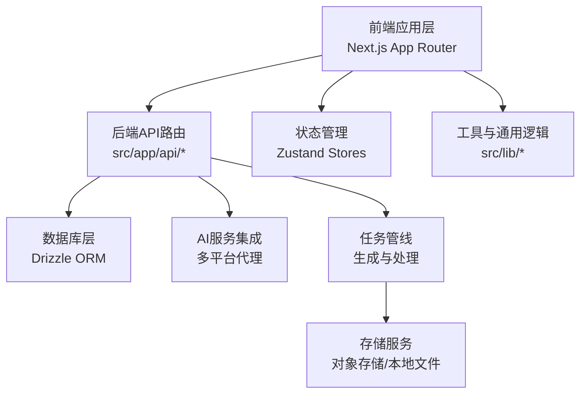
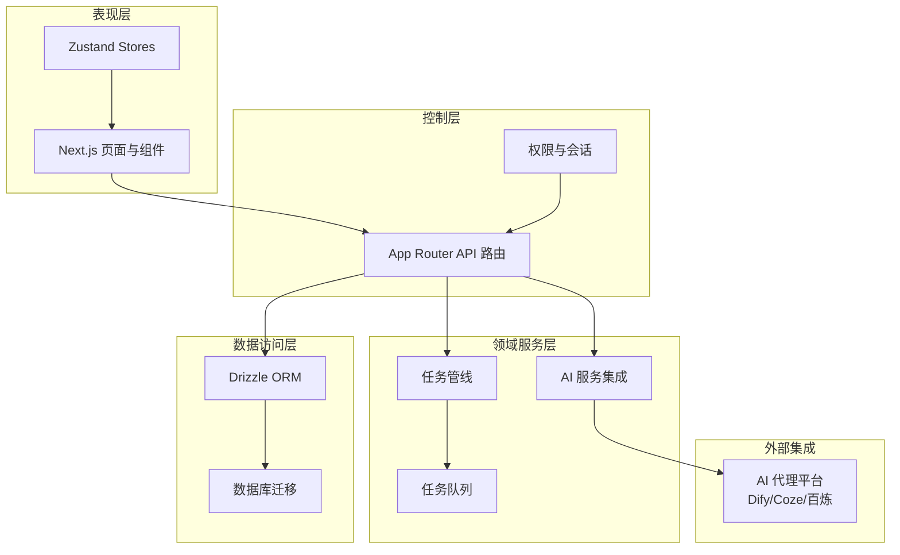
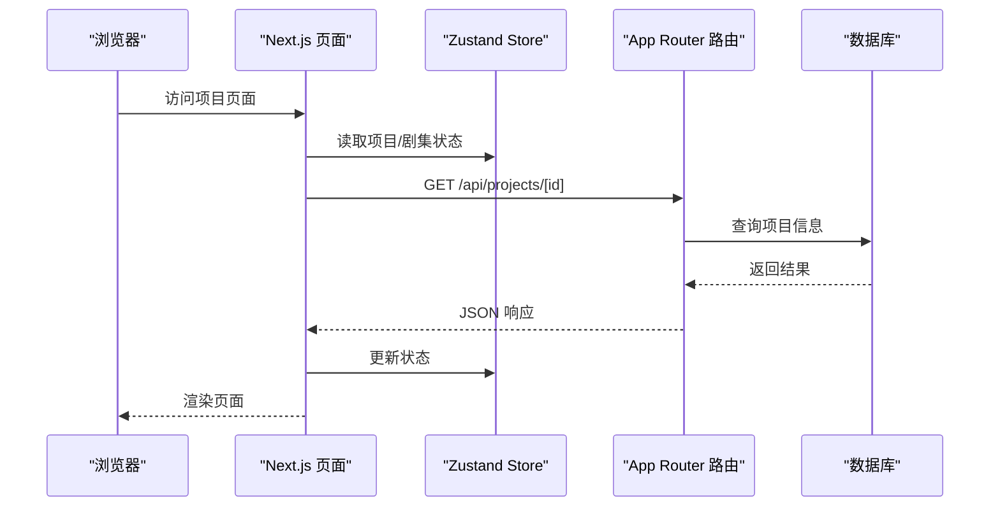
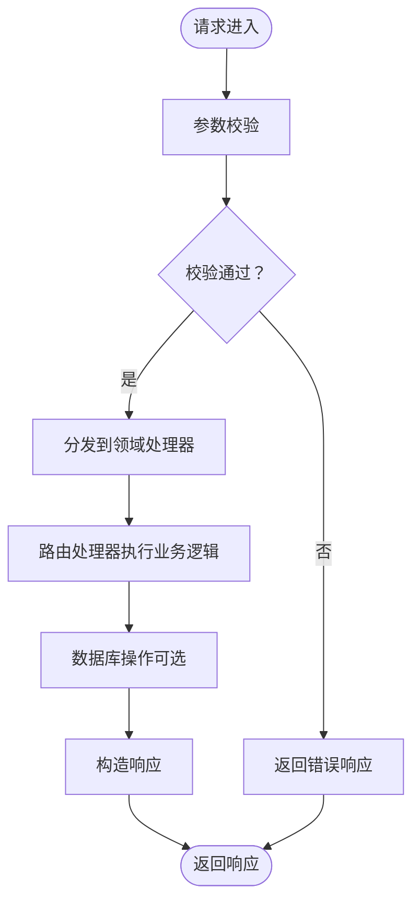
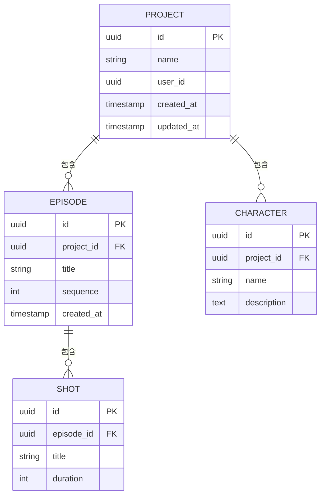
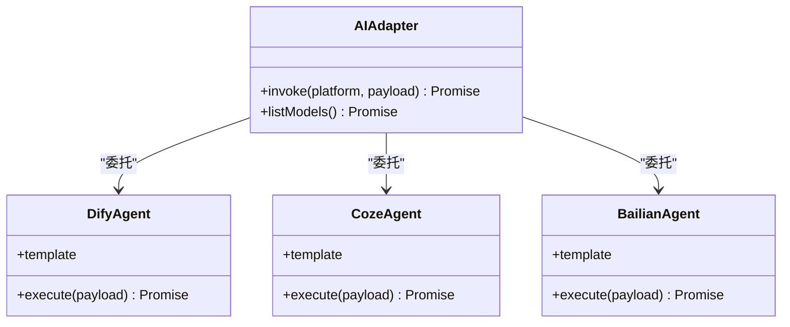
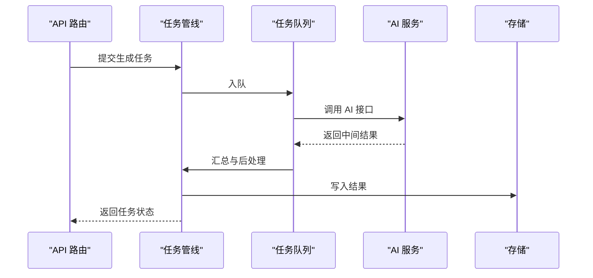
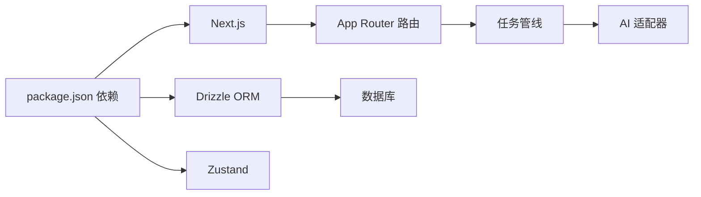

# 核心架构

<cite>
**本文档引用的文件**
- [package.json](file://package.json)
- [next.config.ts](file://next.config.ts)
- [drizzle.config.ts](file://drizzle.config.ts)
- [Dockerfile](file://Dockerfile)
- [.dockerignore](file://.dockerignore)
- [src/app/layout.tsx](file://src/app/layout.tsx)
- [src/app/[locale]/layout.tsx](file://src/app/[locale]/layout.tsx)
- [src/app/api/projects/route.ts](file://src/app/api/projects/route.ts)
- [src/app/api/agents/route.ts](file://src/app/api/agents/route.ts)
- [src/lib/bootstrap.ts](file://src/lib/bootstrap.ts)
- [src/lib/db/index.ts](file://src/lib/db/index.ts)
- [src/lib/pipeline/index.ts](file://src/lib/pipeline/index.ts)
- [src/lib/task-queue/index.ts](file://src/lib/task-queue/index.ts)
- [src/lib/ai/index.ts](file://src/lib/ai/index.ts)
- [src/lib/utils.ts](file://src/lib/utils.ts)
- [src/components/settings/provider-section.tsx](file://src/components/settings/provider-section.tsx)
- [src/components/settings/agent-section.tsx](file://src/components/settings/agent-section.tsx)
- [src/stores/project-store.ts](file://src/stores/project-store.ts)
- [src/stores/episode-store.ts](file://src/stores/episode-store.ts)
- [src/stores/agent-store.ts](file://src/stores/agent-store.ts)
- [src/hooks/use-model-guard.ts](file://src/hooks/use-model-guard.ts)
- [src/instrumentation.ts](file://src/instrumentation.ts)
- [scripts/kling_video.py](file://scripts/kling_video.py)
</cite>

## 目录
1. [引言](#引言)
2. [项目结构](#项目结构)
3. [核心组件](#核心组件)
4. [架构总览](#架构总览)
5. [详细组件分析](#详细组件分析)
6. [依赖分析](#依赖分析)
7. [性能考虑](#性能考虑)
8. [故障排除指南](#故障排除指南)
9. [结论](#结论)
10. [附录](#附录)

## 引言
本文件为 AIComicBuilder 的核心架构文档，聚焦于整体系统设计、架构模式与系统边界。系统采用前后端分离架构：前端基于 Next.js 应用层，后端通过 Next.js App Router 提供 API 路由，数据持久化采用 Drizzle ORM 驱动的关系型数据库，AI 服务通过多平台代理（如 Dify、Coze、百炼）进行集成。文档将详细说明各层之间的交互关系、技术决策与权衡、基础设施要求、可扩展性考虑、部署拓扑以及横切关注点（安全、监控、灾难恢复），并给出系统上下文图与组件分解图。

## 项目结构
项目采用模块化分层组织：
- 前端应用层：位于 src/app 下，使用 App Router 管理页面与 API 路由，支持国际化布局与权限控制。
- 后端 API 层：位于 src/app/api 下，按领域划分路由（如 projects、agents、prompt-templates 等）。
- 数据层：Drizzle ORM 配置与迁移脚本位于 drizzle 目录；数据库连接与查询封装在 src/lib/db。
- AI 服务集成：src/lib/ai 提供统一接口，对接不同平台（Dify、Coze、百炼等）。
- 状态管理：src/stores 提供项目、剧集、代理等状态存储。
- 工具与通用逻辑：src/lib 下的工具模块与管线处理。
- 部署与配置：Dockerfile、.dockerignore、next.config.ts、drizzle.config.ts 等。

**图表来源**
- [src/app/layout.tsx:1-200](file://src/app/layout.tsx#L1-L200)
- [src/app/api/projects/route.ts:1-200](file://src/app/api/projects/route.ts#L1-L200)
- [drizzle.config.ts:1-200](file://drizzle.config.ts#L1-L200)
- [src/lib/ai/index.ts:1-200](file://src/lib/ai/index.ts#L1-L200)
- [src/lib/pipeline/index.ts:1-200](file://src/lib/pipeline/index.ts#L1-L200)

**章节来源**
- [package.json:1-200](file://package.json#L1-L200)
- [next.config.ts:1-200](file://next.config.ts#L1-L200)
- [drizzle.config.ts:1-200](file://drizzle.config.ts#L1-L200)

## 核心组件
- 前端应用层
  - 国际化布局与页面组织，支撑项目管理、角色管理、脚本编辑、故事板预览等功能。
  - 关键入口：src/app/layout.tsx、src/app/[locale]/layout.tsx。
- 后端 API 路由
  - 按领域拆分的路由控制器，如项目管理、角色与剧集、提示模板、上传与下载、生成任务等。
  - 示例路径：src/app/api/projects/route.ts、src/app/api/agents/route.ts。
- 数据库层
  - Drizzle ORM 配置与迁移脚本，提供类型安全的数据访问。
  - 连接与查询封装：src/lib/db/index.ts。
- AI 服务集成
  - 统一的 AI 接口适配多平台（Dify、Coze、百炼），通过代理模板定义工作流。
  - 代理模板位于 agents/ 下，覆盖角色提取、分镜提示、视频提示、脚本生成等。
- 任务管线与队列
  - 生成与处理流程封装在 src/lib/pipeline/index.ts，任务调度在 src/lib/task-queue/index.ts。
- 状态管理
  - 项目、剧集、代理等状态通过 Zustand Store 管理，便于跨组件共享与更新。
- 工具与通用逻辑
  - src/lib/utils.ts 提供通用工具函数，src/lib/bootstrap.ts 初始化运行时环境。

**章节来源**
- [src/app/layout.tsx:1-200](file://src/app/layout.tsx#L1-L200)
- [src/app/[locale]/layout.tsx](file://src/app/[locale]/layout.tsx#L1-L200)
- [src/app/api/projects/route.ts:1-200](file://src/app/api/projects/route.ts#L1-L200)
- [src/app/api/agents/route.ts:1-200](file://src/app/api/agents/route.ts#L1-L200)
- [src/lib/db/index.ts:1-200](file://src/lib/db/index.ts#L1-L200)
- [src/lib/ai/index.ts:1-200](file://src/lib/ai/index.ts#L1-L200)
- [src/lib/pipeline/index.ts:1-200](file://src/lib/pipeline/index.ts#L1-L200)
- [src/lib/task-queue/index.ts:1-200](file://src/lib/task-queue/index.ts#L1-L200)
- [src/lib/utils.ts:1-200](file://src/lib/utils.ts#L1-L200)
- [src/lib/bootstrap.ts:1-200](file://src/lib/bootstrap.ts#L1-L200)

## 架构总览
系统采用分层架构与微服务风格的内部模块划分：
- 表现层：Next.js 应用，负责页面渲染、用户交互与状态管理。
- 控制层：App Router API 路由，处理业务请求、参数校验与响应格式化。
- 领域服务层：AI 服务集成与任务管线，协调生成与处理流程。
- 数据访问层：Drizzle ORM，提供类型安全的数据库操作。
- 外部集成：多平台 AI 代理（Dify、Coze、百炼），通过模板驱动的工作流实现功能扩展。

**图表来源**
- [src/app/layout.tsx:1-200](file://src/app/layout.tsx#L1-L200)
- [src/app/api/projects/route.ts:1-200](file://src/app/api/projects/route.ts#L1-L200)
- [src/lib/ai/index.ts:1-200](file://src/lib/ai/index.ts#L1-L200)
- [src/lib/pipeline/index.ts:1-200](file://src/lib/pipeline/index.ts#L1-L200)
- [src/lib/task-queue/index.ts:1-200](file://src/lib/task-queue/index.ts#L1-L200)
- [src/lib/db/index.ts:1-200](file://src/lib/db/index.ts#L1-L200)
- [drizzle.config.ts:1-200](file://drizzle.config.ts#L1-L200)

## 详细组件分析

### 前端应用层（Next.js）
- 组织方式：App Router 页面与布局，支持多语言与权限控制。
- 关键职责：页面渲染、表单交互、状态同步、国际化资源加载。
- 与后端交互：通过 fetch 或自定义 API 客户端调用 src/app/api 下的路由。
- 与状态管理：通过 src/stores 中的 Store 实例维护项目、剧集、代理等状态。

**图表来源**
- [src/app/layout.tsx:1-200](file://src/app/layout.tsx#L1-L200)
- [src/stores/project-store.ts:1-200](file://src/stores/project-store.ts#L1-L200)
- [src/app/api/projects/route.ts:1-200](file://src/app/api/projects/route.ts#L1-L200)
- [src/lib/db/index.ts:1-200](file://src/lib/db/index.ts#L1-L200)

**章节来源**
- [src/app/layout.tsx:1-200](file://src/app/layout.tsx#L1-L200)
- [src/app/[locale]/layout.tsx](file://src/app/[locale]/layout.tsx#L1-L200)
- [src/stores/project-store.ts:1-200](file://src/stores/project-store.ts#L1-L200)
- [src/stores/episode-store.ts:1-200](file://src/stores/episode-store.ts#L1-L200)

### 后端 API 路由（App Router）
- 设计原则：按领域划分路由，单一职责，清晰的请求/响应模型。
- 典型路由示例：
  - 项目管理：/api/projects/[id] 及其子资源（角色、剧集、生成、导入等）。
  - 代理管理：/api/agents 与 /api/agents/[id]。
  - 提示模板：/api/prompt-templates 与 /api/prompt-presets。
- 参数校验与错误处理：在路由中进行输入验证与异常捕获，返回标准化响应。

**图表来源**
- [src/app/api/projects/route.ts:1-200](file://src/app/api/projects/route.ts#L1-L200)
- [src/app/api/agents/route.ts:1-200](file://src/app/api/agents/route.ts#L1-L200)

**章节来源**
- [src/app/api/projects/route.ts:1-200](file://src/app/api/projects/route.ts#L1-L200)
- [src/app/api/agents/route.ts:1-200](file://src/app/api/agents/route.ts#L1-L200)

### 数据库层（Drizzle ORM）
- 配置与迁移：drizzle.config.ts 定义数据库连接与生成策略；迁移脚本位于 drizzle/00xx_*。
- 类型安全：通过 Drizzle 提供的类型推断保证查询与模型的一致性。
- 运行时初始化：src/lib/bootstrap.ts 在应用启动时完成数据库连接与基础设置。

**图表来源**
- [drizzle.config.ts:1-200](file://drizzle.config.ts#L1-L200)
- [drizzle/0010_add_episodes.sql:1-200](file://drizzle/0010_add_episodes.sql#L1-L200)
- [drizzle/0013_add_episode_characters.sql:1-200](file://drizzle/0013_add_episode_characters.sql#L1-L200)
- [drizzle/0026_add_scenes_table.sql:1-200](file://drizzle/0026_add_scenes_table.sql#L1-L200)

**章节来源**
- [drizzle.config.ts:1-200](file://drizzle.config.ts#L1-L200)
- [src/lib/bootstrap.ts:1-200](file://src/lib/bootstrap.ts#L1-L200)

### AI 服务集成
- 统一接口：src/lib/ai/index.ts 封装多平台适配器，屏蔽差异。
- 代理平台：agents/ 下的模板（Dify、Coze、百炼）定义工作流与提示词。
- 典型场景：角色提取、分镜提示生成、参考图像提示、视频提示、脚本生成与解析、分镜拆分等。

**图表来源**
- [src/lib/ai/index.ts:1-200](file://src/lib/ai/index.ts#L1-L200)
- [agents/dify/script-generate.dify.yml:1-200](file://agents/dify/script-generate.dify.yml#L1-L200)
- [agents/coze/:1-200](file://agents/coze/#L1-L200)
- [agents/bailian/template.yml:1-200](file://agents/bailian/template.yml#L1-L200)

**章节来源**
- [src/lib/ai/index.ts:1-200](file://src/lib/ai/index.ts#L1-L200)
- [agents/dify/:1-200](file://agents/dify/#L1-L200)
- [agents/coze/:1-200](file://agents/coze/#L1-L200)
- [agents/bailian/:1-200](file://agents/bailian/#L1-L200)

### 任务管线与队列
- 任务管线：src/lib/pipeline/index.ts 定义生成与处理步骤的编排。
- 任务队列：src/lib/task-queue/index.ts 提供异步任务调度与重试机制。
- 视频生成脚本：scripts/kling_video.py 作为外部工具参与视频生成流程。

**图表来源**
- [src/lib/pipeline/index.ts:1-200](file://src/lib/pipeline/index.ts#L1-L200)
- [src/lib/task-queue/index.ts:1-200](file://src/lib/task-queue/index.ts#L1-L200)
- [src/lib/ai/index.ts:1-200](file://src/lib/ai/index.ts#L1-L200)
- [scripts/kling_video.py:1-200](file://scripts/kling_video.py#L1-L200)

**章节来源**
- [src/lib/pipeline/index.ts:1-200](file://src/lib/pipeline/index.ts#L1-L200)
- [src/lib/task-queue/index.ts:1-200](file://src/lib/task-queue/index.ts#L1-L200)
- [scripts/kling_video.py:1-200](file://scripts/kling_video.py#L1-L200)

### 设置与权限控制
- Provider 与 Agent 设置：src/components/settings/provider-section.tsx 与 src/components/settings/agent-section.tsx 提供配置界面。
- 权限守卫：src/hooks/use-model-guard.ts 用于模型访问控制与权限检查。
- 用户标识：src/lib/get-user-id.ts 与 src/lib/fingerprint.ts 提供用户识别与设备指纹能力。

**章节来源**
- [src/components/settings/provider-section.tsx:1-200](file://src/components/settings/provider-section.tsx#L1-L200)
- [src/components/settings/agent-section.tsx:1-200](file://src/components/settings/agent-section.tsx#L1-L200)
- [src/hooks/use-model-guard.ts:1-200](file://src/hooks/use-model-guard.ts#L1-L200)
- [src/lib/get-user-id.ts:1-200](file://src/lib/get-user-id.ts#L1-L200)
- [src/lib/fingerprint.ts:1-200](file://src/lib/fingerprint.ts#L1-L200)

## 依赖分析
- 技术栈与版本
  - 前端：Next.js（App Router）、TypeScript、TailwindCSS。
  - 后端：Node.js（配合 Next.js）、Drizzle ORM。
  - AI 集成：多平台代理（Dify、Coze、百炼）。
  - 工具链：pnpm、Docker。
- 外部依赖与集成点
  - 数据库：PostgreSQL（由 Drizzle 驱动）。
  - 存储：对象存储或本地文件系统（用于媒体资产）。
  - 监控：src/instrumentation.ts 提供可观测性入口。
- 耦合与内聚
  - API 路由与领域服务解耦，通过统一接口与 DTO 交互。
  - AI 适配器与具体平台解耦，通过模板与配置驱动。

**图表来源**
- [package.json:1-200](file://package.json#L1-L200)
- [src/lib/pipeline/index.ts:1-200](file://src/lib/pipeline/index.ts#L1-L200)
- [src/lib/ai/index.ts:1-200](file://src/lib/ai/index.ts#L1-L200)

**章节来源**
- [package.json:1-200](file://package.json#L1-L200)

## 性能考虑
- 前端性能
  - 使用 App Router 的并行数据加载与缓存策略，减少重复请求。
  - 组件级懒加载与代码分割，优化首屏加载。
- 后端性能
  - API 路由中进行参数校验与早期失败，避免无效负载。
  - 任务队列异步化，降低请求延迟。
- 数据库性能
  - 使用 Drizzle 的类型安全查询，结合索引与分页，避免全表扫描。
- AI 服务性能
  - 批量请求与并发限制，避免触发平台速率限制。
  - 结果缓存与增量更新，减少重复计算。

## 故障排除指南
- 数据库连接问题
  - 检查 src/lib/bootstrap.ts 中的连接初始化与环境变量。
  - 查看 drizzle.config.ts 的数据库配置是否正确。
- API 路由错误
  - 在路由中添加日志与错误捕获，定位参数与业务逻辑问题。
  - 使用标准化错误响应格式，便于前端统一处理。
- AI 服务异常
  - 检查代理模板与平台密钥配置，确认网络连通性。
  - 在 src/lib/ai/index.ts 中增加重试与降级策略。
- 监控与诊断
  - 利用 src/instrumentation.ts 收集指标与追踪信息，定位性能瓶颈。

**章节来源**
- [src/lib/bootstrap.ts:1-200](file://src/lib/bootstrap.ts#L1-L200)
- [drizzle.config.ts:1-200](file://drizzle.config.ts#L1-L200)
- [src/app/api/projects/route.ts:1-200](file://src/app/api/projects/route.ts#L1-L200)
- [src/lib/ai/index.ts:1-200](file://src/lib/ai/index.ts#L1-L200)
- [src/instrumentation.ts:1-200](file://src/instrumentation.ts#L1-L200)

## 结论
AIComicBuilder 采用清晰的分层架构与模块化设计，前端 Next.js 应用与后端 API 路由协同工作，Drizzle ORM 提供类型安全的数据访问，AI 服务通过多平台代理实现灵活扩展。通过任务管线与队列提升异步处理能力，结合监控与错误处理保障系统稳定性。该架构具备良好的可扩展性与可维护性，适合持续演进与规模化部署。

## 附录
- 基础设施要求
  - 运行时：Node.js（与 Next.js 版本兼容）、PostgreSQL。
  - 构建与打包：pnpm。
  - 容器化：Dockerfile 与 .dockerignore 支持容器部署。
- 部署拓扑
  - 单体部署：前端静态构建 + 后端 API + 数据库。
  - 微服务化：将 AI 服务与存储独立部署，通过 API 网关接入。
- 安全性
  - 权限控制：use-model-guard.ts 与用户标识机制。
  - 数据加密：敏感配置通过环境变量管理。
- 监控与灾难恢复
  - 指标采集：src/instrumentation.ts。
  - 日志与告警：结合平台日志与错误上报。
  - 备份策略：数据库定期备份与版本化迁移脚本。

**章节来源**
- [Dockerfile:1-200](file://Dockerfile#L1-L200)
- [.dockerignore:1-200](file://.dockerignore#L1-L200)
- [src/hooks/use-model-guard.ts:1-200](file://src/hooks/use-model-guard.ts#L1-L200)
- [src/lib/fingerprint.ts:1-200](file://src/lib/fingerprint.ts#L1-L200)
- [src/instrumentation.ts:1-200](file://src/instrumentation.ts#L1-L200)