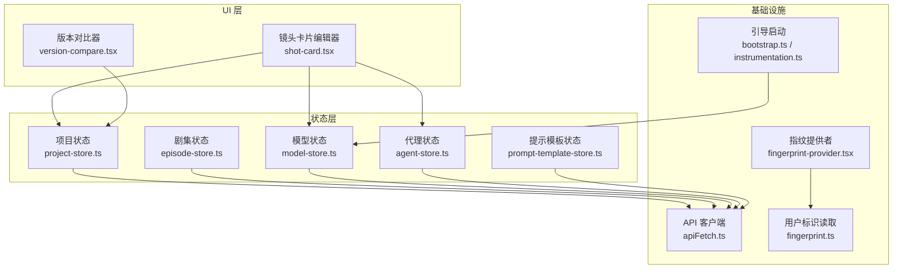
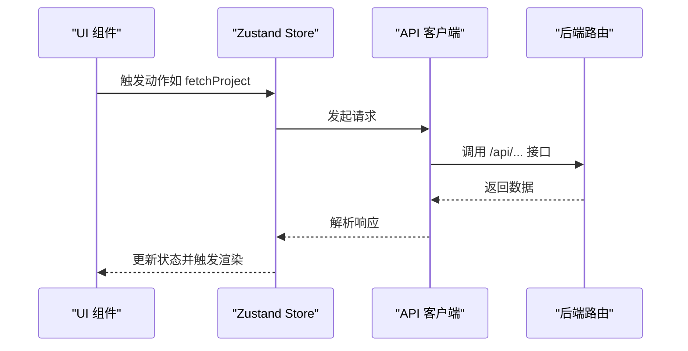
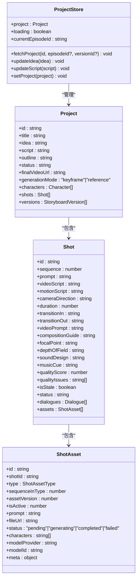
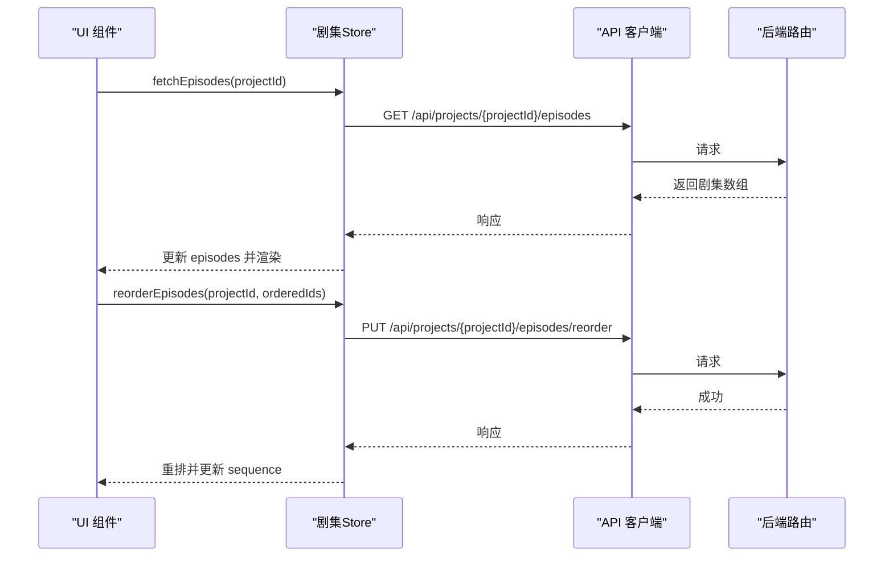
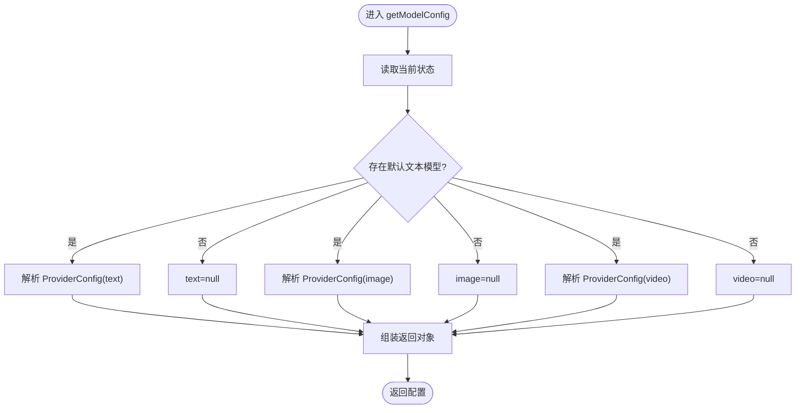
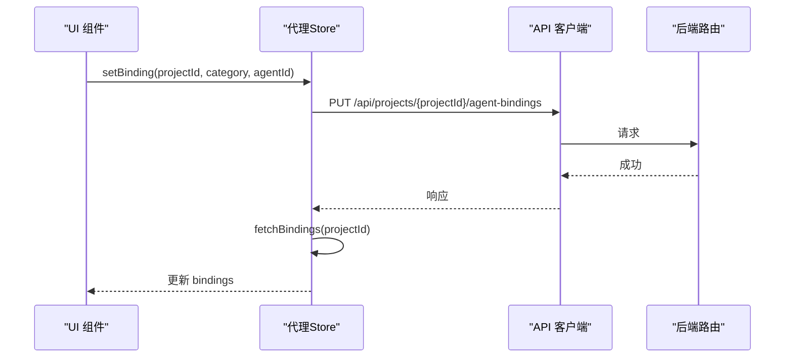
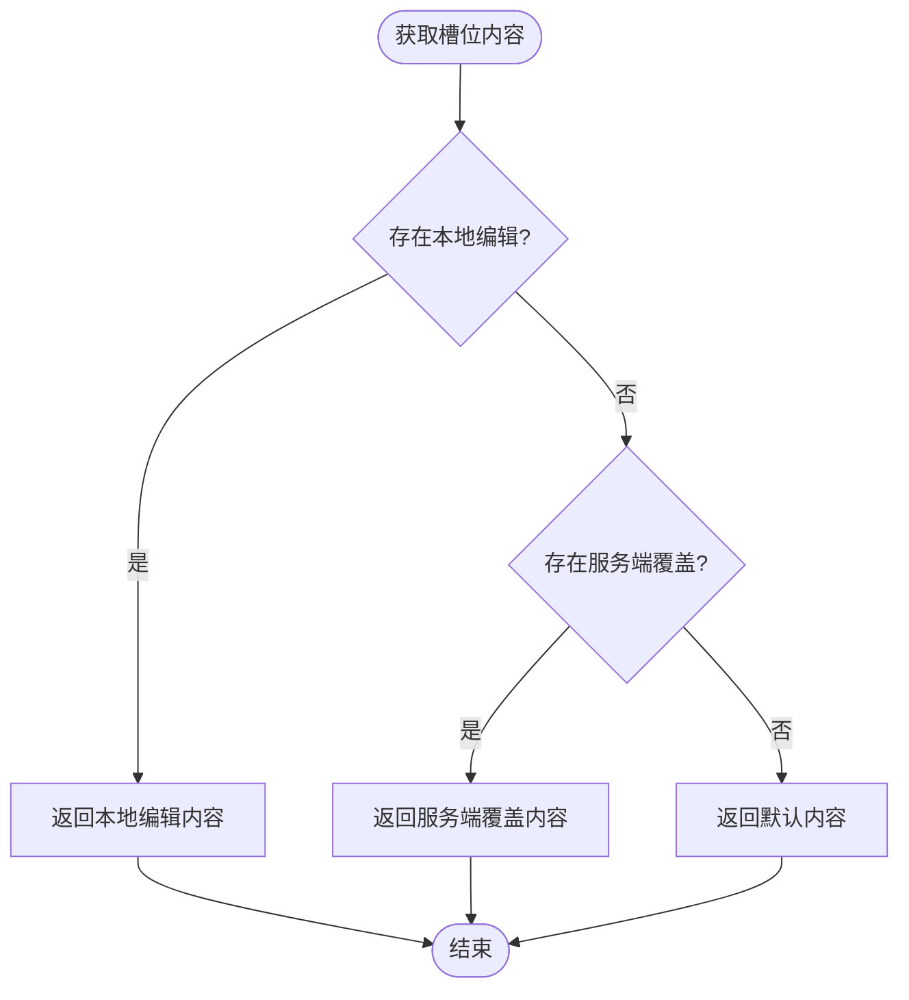
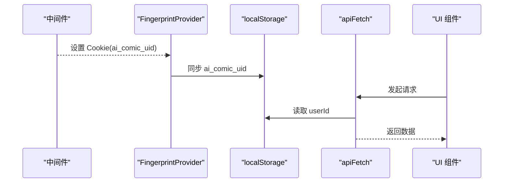
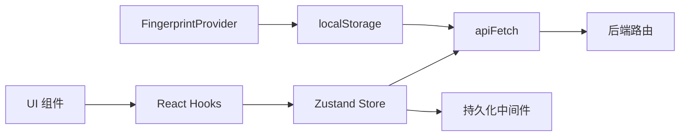

# 状态管理

<cite>
**本文引用的文件**
- [project-store.ts](file://src/stores/project-store.ts)
- [episode-store.ts](file://src/stores/episode-store.ts)
- [model-store.ts](file://src/stores/model-store.ts)
- [agent-store.ts](file://src/stores/agent-store.ts)
- [prompt-template-store.ts](file://src/stores/prompt-template-store.ts)
- [shot-card.tsx](file://src/components/editor/shot-card.tsx)
- [version-compare.tsx](file://src/components/editor/version-compare.tsx)
- [fingerprint-provider.tsx](file://src/components/fingerprint-provider.tsx)
- [fingerprint.ts](file://src/lib/fingerprint.ts)
- [apiFetch.ts](file://src/lib/api-fetch.ts)
- [shot-asset-utils.ts](file://src/lib/shot-asset-utils.ts)
- [ref-image-utils.ts](file://src/lib/ref-image-utils.ts)
- [route.ts](file://src/app/api/projects/[id]/generate/route.ts)
- [instrumentation.ts](file://src/instrumentation.ts)
- [bootstrap.ts](file://src/lib/bootstrap.ts)
</cite>

## 目录
1. [引言](#引言)
2. [项目结构](#项目结构)
3. [核心组件](#核心组件)
4. [架构总览](#架构总览)
5. [详细组件分析](#详细组件分析)
6. [依赖关系分析](#依赖关系分析)
7. [性能考量](#性能考量)
8. [故障排查指南](#故障排查指南)
9. [结论](#结论)
10. [附录](#附录)

## 引言
本文件系统性梳理 AIComicBuilder 基于 Zustand 的状态管理架构与实践，覆盖项目状态、剧集状态、模型状态、代理状态与提示模板状态的设计模式；详述状态持久化、跨组件同步与状态变更追踪机制；总结最佳实践、性能优化与内存管理策略，并给出状态快照、版本切换、撤销重做与调试工具的实现思路与测试维护建议。

## 项目结构
本项目采用“按领域分层”的状态组织方式：每个领域（项目、剧集、模型、代理、提示模板）拥有独立的 Zustand Store 模块，通过统一的 API 客户端进行后端交互，前端组件通过 Hook 访问状态并触发副作用。

图表来源
- [project-store.ts:1-257](file://src/stores/project-store.ts#L1-L257)
- [episode-store.ts:1-100](file://src/stores/episode-store.ts#L1-L100)
- [model-store.ts:1-198](file://src/stores/model-store.ts#L1-L198)
- [agent-store.ts:1-56](file://src/stores/agent-store.ts#L1-L56)
- [prompt-template-store.ts:1-152](file://src/stores/prompt-template-store.ts#L1-L152)
- [shot-card.tsx:465-608](file://src/components/editor/shot-card.tsx#L465-L608)
- [version-compare.tsx:51-84](file://src/components/editor/version-compare.tsx#L51-L84)
- [fingerprint-provider.tsx:1-31](file://src/components/fingerprint-provider.tsx#L1-L31)
- [fingerprint.ts:1-10](file://src/lib/fingerprint.ts#L1-L10)
- [apiFetch.ts](file://src/lib/api-fetch.ts)
- [bootstrap.ts:1-25](file://src/lib/bootstrap.ts#L1-L25)
- [instrumentation.ts:1-7](file://src/instrumentation.ts#L1-L7)

章节来源
- [project-store.ts:1-257](file://src/stores/project-store.ts#L1-L257)
- [episode-store.ts:1-100](file://src/stores/episode-store.ts#L1-L100)
- [model-store.ts:1-198](file://src/stores/model-store.ts#L1-L198)
- [agent-store.ts:1-56](file://src/stores/agent-store.ts#L1-L56)
- [prompt-template-store.ts:1-152](file://src/stores/prompt-template-store.ts#L1-L152)

## 核心组件
- 项目状态 Store：负责加载/更新项目级数据（含角色、镜头、版本等），支持按剧集或完整项目拉取，支持草稿更新与版本回溯。
- 剧集状态 Store：负责剧集列表、创建、删除、更新与排序，本地序列与后端一致化处理。
- 模型状态 Store：负责多提供商配置、默认模型选择、模型启用/禁用、增删手动模型，具备持久化与迁移能力。
- 代理状态 Store：负责可用代理列表与项目绑定映射，支持按分类设置代理。
- 提示模板状态 Store：负责模板注册表、当前选中模板/槽位、编辑态内容、服务端覆盖、脏检查与分类过滤。

章节来源
- [project-store.ts:209-256](file://src/stores/project-store.ts#L209-L256)
- [episode-store.ts:21-33](file://src/stores/episode-store.ts#L21-L33)
- [model-store.ts:36-53](file://src/stores/model-store.ts#L36-L53)
- [agent-store.ts:16-23](file://src/stores/agent-store.ts#L16-L23)
- [prompt-template-store.ts:19-61](file://src/stores/prompt-template-store.ts#L19-L61)

## 架构总览
Zustand Store 通过 create 包装状态逻辑，结合持久化中间件（模型状态）与 API 客户端（apiFetch）实现前后端联动。UI 组件通过自定义 Hook 访问状态，执行业务动作时调用后端接口并同步更新本地状态。

图表来源
- [project-store.ts:224-239](file://src/stores/project-store.ts#L224-L239)
- [episode-store.ts:39-44](file://src/stores/episode-store.ts#L39-L44)
- [agent-store.ts:30-35](file://src/stores/agent-store.ts#L30-L35)
- [apiFetch.ts](file://src/lib/api-fetch.ts)

## 详细组件分析

### 项目状态 Store（Project Store）
- 数据模型要点
  - 项目包含标题、创意、脚本、大纲、状态、最终视频链接、生成模式、角色、镜头与版本。
  - 镜头包含提示词、视频脚本、运动脚本、摄影机方向、时长、场景、转场、视频提示、构图/焦点/景深/音效/音乐等元信息，以及资产集合。
  - 资产类型区分关键帧首尾帧图像、参考图像、关键帧/参考视频输出，支持历史版本与激活标记。
- 关键函数
  - 加载项目：根据是否带剧集/版本参数构造 URL，首次加载显示加载态。
  - 更新草稿：对创意与脚本进行浅拷贝式更新，避免不必要的重渲染。
  - 设置项目：直接替换整个项目对象。
- 辅助函数
  - 安全访问资产：空值保护与仅取激活资产。
  - 获取各类资产 URL：首帧、尾帧、关键帧视频、参考视频。
  - 历史版本查询：按类型与序列聚合并按版本倒序。
  - 判定完成度：参考图齐全、关键帧成对存在等。

图表来源
- [project-store.ts:4-207](file://src/stores/project-store.ts#L4-L207)

章节来源
- [project-store.ts:209-256](file://src/stores/project-store.ts#L209-L256)
- [project-store.ts:80-187](file://src/stores/project-store.ts#L80-L187)

### 剧集状态 Store（Episode Store）
- 功能点
  - 拉取剧集列表、创建、删除、更新与重新排序。
  - 本地状态与后端顺序保持一致：根据服务端返回的新顺序重排本地序列。
- 交互流程
  - 每次操作均通过 apiFetch 调用对应路由，成功后在本地合并/替换/删除对应项。

图表来源
- [episode-store.ts:35-99](file://src/stores/episode-store.ts#L35-L99)

章节来源
- [episode-store.ts:21-33](file://src/stores/episode-store.ts#L21-L33)
- [episode-store.ts:35-99](file://src/stores/episode-store.ts#L35-L99)

### 模型状态 Store（Model Store）
- 设计要点
  - 多提供商配置：协议、能力、基础地址、密钥、模型列表。
  - 默认模型引用：分别记录文本/图像/视频默认模型。
  - 持久化与迁移：使用 persist 中间件，支持版本迁移与旧数据合并。
- 关键函数
  - 添加/更新/移除提供商，设置/切换/增删模型，设置默认模型。
  - 解析当前模型配置：根据默认引用解析出完整 ProviderConfig。
- 迁移策略
  - 新版迁移：从旧字段 capabilities 推导 capability。
  - 合并策略：兼容无版本字段的历史数据，统一 capability 字段。

图表来源
- [model-store.ts:144-163](file://src/stores/model-store.ts#L144-L163)

章节来源
- [model-store.ts:36-53](file://src/stores/model-store.ts#L36-L53)
- [model-store.ts:55-197](file://src/stores/model-store.ts#L55-L197)

### 代理状态 Store（Agent Store）
- 功能点
  - 拉取可用代理列表与项目绑定映射。
  - 支持按分类设置代理（可清空）。
- 同步策略
  - 设置代理后主动刷新绑定，保证 UI 与后端一致。

图表来源
- [agent-store.ts:47-54](file://src/stores/agent-store.ts#L47-L54)

章节来源
- [agent-store.ts:16-23](file://src/stores/agent-store.ts#L16-L23)
- [agent-store.ts:25-55](file://src/stores/agent-store.ts#L25-L55)

### 提示模板状态 Store（Prompt Template Store）
- 设计要点
  - 注册表：服务端下发的模板元数据（槽位、类别、默认内容）。
  - 当前选择：当前选中的模板与槽位，初始进入时自动定位首个可编辑槽位。
  - 编辑态：本地编辑内容优先于服务端覆盖，再回退到默认内容。
  - 脏检查：跟踪某模板是否有本地编辑未提交。
  - 分类过滤：支持按类别筛选模板。
- 内容优先级
  - 槽位内容 = 本地编辑 > 服务端覆盖 > 默认内容。

图表来源
- [prompt-template-store.ts:124-134](file://src/stores/prompt-template-store.ts#L124-L134)

章节来源
- [prompt-template-store.ts:19-61](file://src/stores/prompt-template-store.ts#L19-L61)
- [prompt-template-store.ts:63-151](file://src/stores/prompt-template-store.ts#L63-L151)

### 跨组件状态同步与持久化
- 用户标识同步
  - 服务端中间件设置 Cookie，前端通过 FingerprintProvider 将 Cookie 同步至 localStorage，供 apiFetch 读取。
- 状态持久化
  - 模型状态通过 persist 中间件持久化到浏览器存储，支持版本迁移与旧数据合并。
- 版本与快照
  - 项目支持按版本加载，UI 提供版本选择器用于对比不同版本。
  - 镜头资产支持历史版本激活，通过后端切换 is_active 实现“快照”切换。

图表来源
- [fingerprint-provider.tsx:12-28](file://src/components/fingerprint-provider.tsx#L12-L28)
- [fingerprint.ts:7-10](file://src/lib/fingerprint.ts#L7-L10)
- [apiFetch.ts](file://src/lib/api-fetch.ts)

章节来源
- [fingerprint-provider.tsx:1-31](file://src/components/fingerprint-provider.tsx#L1-L31)
- [fingerprint.ts:1-10](file://src/lib/fingerprint.ts#L1-L10)
- [model-store.ts:165-197](file://src/stores/model-store.ts#L165-L197)
- [version-compare.tsx:51-84](file://src/components/editor/version-compare.tsx#L51-L84)
- [shot-asset-utils.ts:249-285](file://src/lib/shot-asset-utils.ts#L249-L285)

### 状态变更追踪与调试
- 变更追踪
  - 提示模板脏检查：通过已编辑槽位集合判断模板是否被修改。
  - 本地编辑优先级：便于识别哪些内容来自本地编辑。
- 调试建议
  - 在开发环境打印 Store 状态变化（可通过中间件或日志包装）。
  - 使用浏览器扩展观察 Zustand 状态树与订阅变化。
  - 对关键异步流程（如 fetchProject、reorderEpisodes）增加错误边界与 Toast 提示。

章节来源
- [prompt-template-store.ts:136-143](file://src/stores/prompt-template-store.ts#L136-L143)
- [project-store.ts:224-239](file://src/stores/project-store.ts#L224-L239)
- [episode-store.ts:83-98](file://src/stores/episode-store.ts#L83-L98)

### 性能优化与内存管理
- 渲染优化
  - 使用局部状态拆分：将大型对象拆分为多个小 Store，减少无关重渲染。
  - 使用 selector 选择器：仅订阅所需字段，避免整块状态变化导致的全局重渲染。
- 数据结构优化
  - 镜头资产采用激活标记与历史版本分离，避免在 UI 中频繁重组大对象。
  - 通过辅助函数（安全访问、仅激活资产、历史查询）降低 UI 层复杂度。
- 异步与节流
  - 编辑器对引用图提示保存采用注册/去抖机制，批量提交以减少网络请求。
  - 全局“待保存任务”在页面卸载/隐藏时统一刷写，避免丢失。

章节来源
- [project-store.ts:80-187](file://src/stores/project-store.ts#L80-L187)
- [shot-card.tsx:525-556](file://src/components/editor/shot-card.tsx#L525-L556)
- [shot-card.tsx:578-594](file://src/components/editor/shot-card.tsx#L578-L594)

### 状态快照、撤销重做与调试工具
- 快照与版本切换
  - 项目版本：通过版本选择器加载指定版本，实现“快照”回放。
  - 资产历史：按类型与序列聚合历史版本，支持激活特定版本。
- 撤销重做
  - 当前未内置撤销重做队列；可在 Store 中引入基于时间戳的动作栈，记录关键变更并在 UI 中暴露按钮。
- 调试工具
  - 在开发环境为 Store 添加中间件记录 action 与 state diff。
  - 为关键 API 调用添加日志，标注请求/响应与耗时。

章节来源
- [version-compare.tsx:51-84](file://src/components/editor/version-compare.tsx#L51-L84)
- [shot-asset-utils.ts:249-285](file://src/lib/shot-asset-utils.ts#L249-L285)

### 测试策略与维护指南
- 单元测试
  - Store 行为：验证 fetch/update/set 等动作对状态的影响，模拟 apiFetch 返回值。
  - 辅助函数：对资产访问与历史查询函数进行边界条件测试（空资产、无激活项等）。
- 集成测试
  - 端到端：模拟用户操作（创建/更新/删除/排序/版本切换），断言 UI 与后端一致性。
- 维护指南
  - 迁移策略：新增字段时完善 persist migrate/merge，确保向后兼容。
  - 错误处理：统一捕获 API 错误并反馈给用户，避免状态不一致。
  - 文档化：为每个 Store 的 action 与数据结构补充注释，便于协作与演进。

## 依赖关系分析
- 组件与 Store 的耦合
  - UI 通过 Hook 访问 Store，Store 通过 apiFetch 与后端通信，解耦清晰。
- 外部依赖
  - 模型状态依赖持久化中间件与浏览器存储。
  - 用户标识依赖中间件与前端 Provider 同步。
- 潜在风险
  - 本地状态与后端状态不一致：需在每次关键操作后刷新或校验。
  - 大对象频繁更新：建议拆分 Store 或使用 selector 优化。

图表来源
- [model-store.ts:55-197](file://src/stores/model-store.ts#L55-L197)
- [fingerprint-provider.tsx:12-28](file://src/components/fingerprint-provider.tsx#L12-L28)
- [apiFetch.ts](file://src/lib/api-fetch.ts)

章节来源
- [model-store.ts:55-197](file://src/stores/model-store.ts#L55-L197)
- [fingerprint-provider.tsx:1-31](file://src/components/fingerprint-provider.tsx#L1-L31)

## 性能考量
- 渲染层面
  - 将大型对象拆分为多个 Store，避免单一 Store 过大导致全局重渲染。
  - 使用 selector 仅订阅必要字段。
- 网络层面
  - 对频繁变更的输入采用去抖/批处理，减少请求次数。
  - 对只读数据采用缓存策略，避免重复拉取。
- 存储层面
  - 模型状态持久化仅保留必要字段，避免存储膨胀。
  - 定期清理过期历史版本，控制资产数量。

## 故障排查指南
- 症状：页面加载长时间处于加载态
  - 排查：确认首次加载时是否正确设置 loading；检查 fetchProject 的 URL 参数与后端响应。
- 症状：编辑内容未保存或丢失
  - 排查：确认 pending saves 是否在 beforeunload/visibilitychange 事件中被刷写；检查去抖定时器是否被清理。
- 症状：版本切换后 UI 不更新
  - 排查：确认 fetchProject 是否携带 versionId；确认后端是否正确返回新激活资产。
- 症状：模型配置为空
  - 排查：确认持久化数据是否迁移成功；检查默认模型引用是否指向存在的 Provider。

章节来源
- [project-store.ts:224-239](file://src/stores/project-store.ts#L224-L239)
- [shot-card.tsx:525-556](file://src/components/editor/shot-card.tsx#L525-L556)
- [model-store.ts:165-197](file://src/stores/model-store.ts#L165-L197)

## 结论
本项目以 Zustand 为核心构建了清晰、可维护的状态管理方案：领域化 Store、持久化与迁移、前后端一致化同步、以及针对资产历史与版本的“快照”能力。配合去抖/批处理与选择器优化，能够在复杂编辑场景下保持良好的性能与用户体验。后续可在 Store 中引入撤销重做队列与更完善的调试工具，进一步提升可观测性与可维护性。

## 附录
- 启动与引导
  - 服务端注册引导程序，执行数据库迁移、AI 提供商初始化、流水线处理器注册与任务队列启动。
- 生成流程入口
  - 项目生成路由根据项目归属与绑定代理调用相应智能体，支持文本/图像/视频配置注入。

章节来源
- [instrumentation.ts:1-7](file://src/instrumentation.ts#L1-L7)
- [bootstrap.ts:1-25](file://src/lib/bootstrap.ts#L1-L25)
- [route.ts:172-193](file://src/app/api/projects/[id]/generate/route.ts#L172-L193)