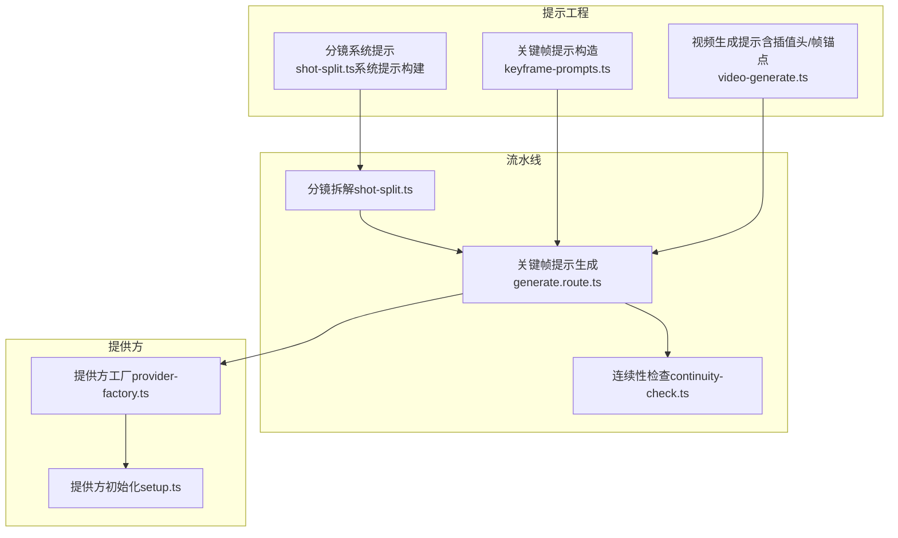
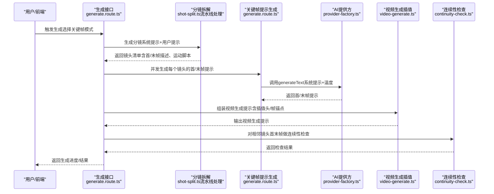
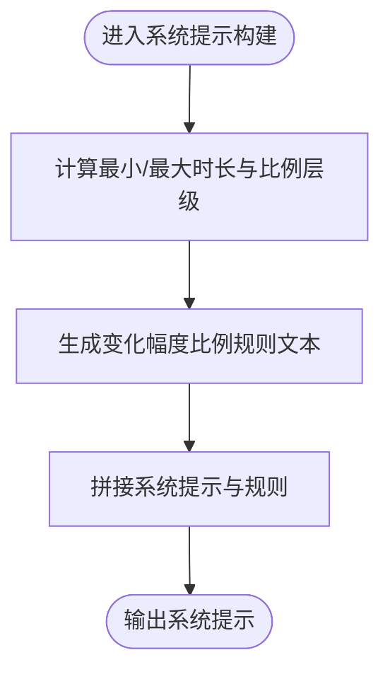
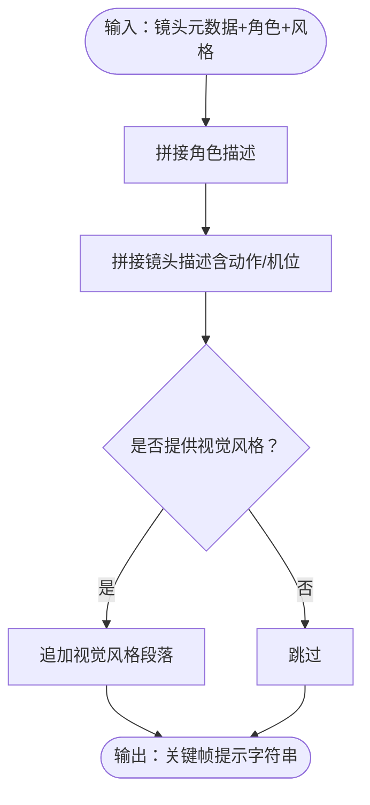
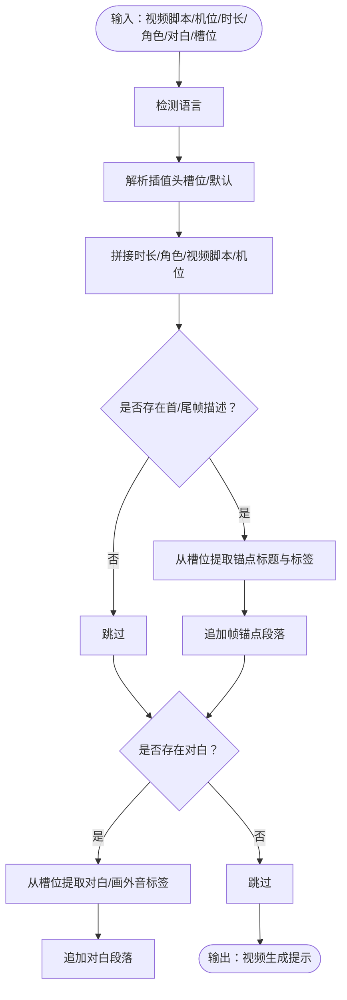
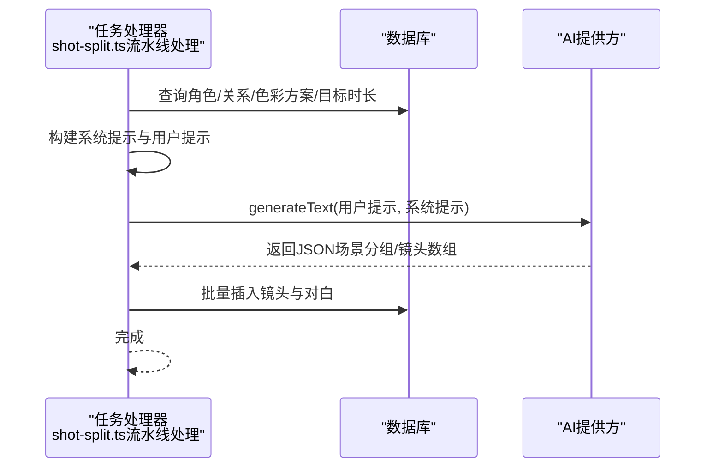
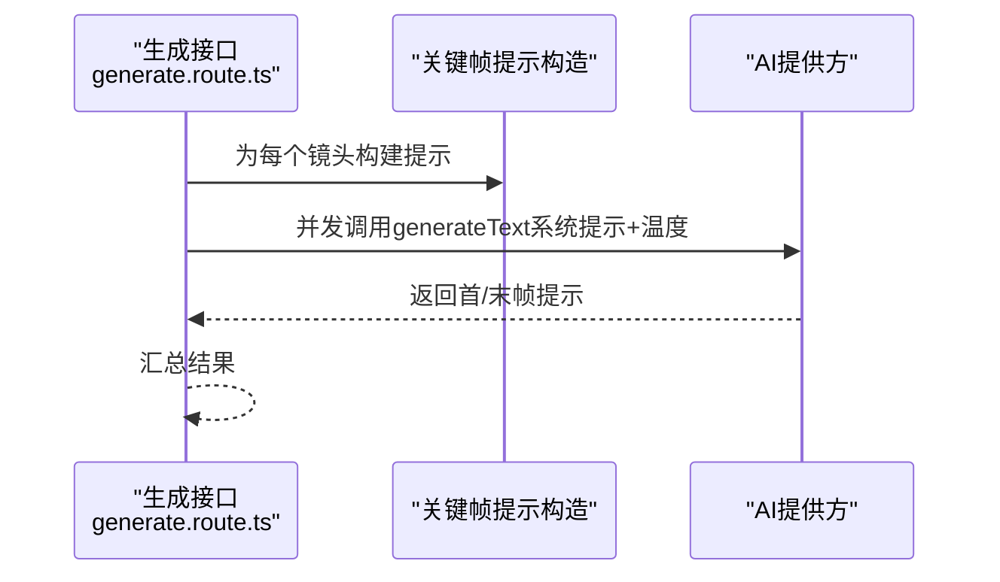
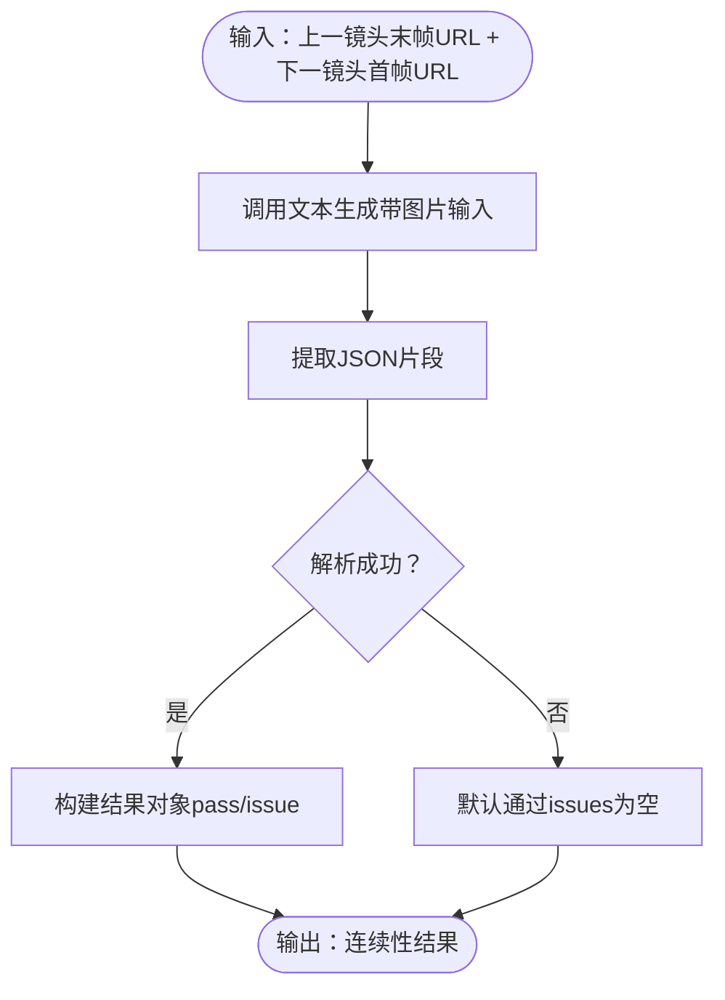
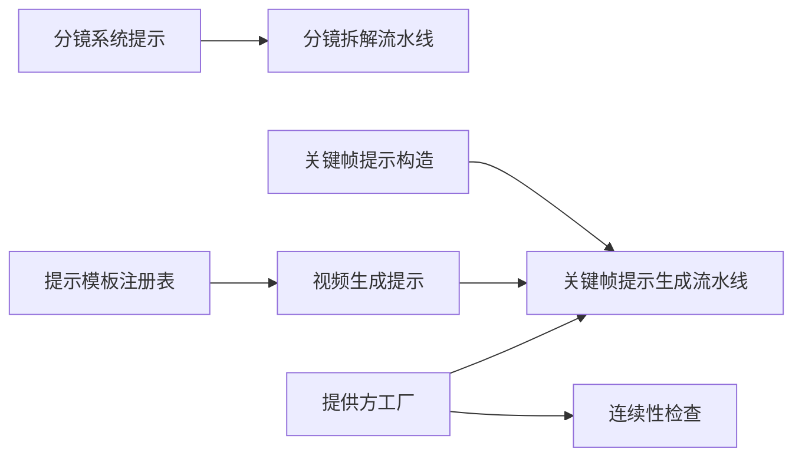

# 关键帧模式

<cite>
**本文档引用的文件**
- [keyframe-prompts.ts](file://src/lib/ai/prompts/keyframe-prompts.ts)
- [video-generate.ts](file://src/lib/ai/prompts/video-generate.ts)
- [shot-split.ts（系统提示构建）](file://src/lib/ai/prompts/shot-split.ts)
- [shot-split.ts（流水线处理）](file://src/lib/pipeline/shot-split.ts)
- [continuity-check.ts](file://src/lib/pipeline/continuity-check.ts)
- [generate.route.ts（关键帧提示生成入口）](file://src/app/api/projects/[id]/generate/route.ts)
- [registry.ts（提示模板注册表）](file://src/lib/ai/prompts/registry.ts)
- [provider-factory.ts](file://src/lib/ai/provider-factory.ts)
- [setup.ts（AI提供方初始化）](file://src/lib/ai/setup.ts)
- [emotion-curve.tsx](file://src/components/editor/emotion-curve.tsx)
</cite>

## 目录
1. [引言](#引言)
2. [项目结构](#项目结构)
3. [核心组件](#核心组件)
4. [架构总览](#架构总览)
5. [详细组件分析](#详细组件分析)
6. [依赖分析](#依赖分析)
7. [性能考量](#性能考量)
8. [故障排查指南](#故障排查指南)
9. [结论](#结论)
10. [附录](#附录)

## 引言
本文件面向“关键帧模式”的完整实现与使用，围绕帧间补间、运动估计与风格保持展开，系统阐述关键帧选择策略、时间轴分割、动画流畅度控制、质量评估与参数调优，并给出多AI提供商配置差异与性能建议、常见问题与最佳实践。

## 项目结构
关键帧模式贯穿“分镜拆解 → 关键帧提示生成 → 视频生成（插值）”的端到端流程。核心文件分布如下：
- 提示工程层：分镜系统提示、关键帧提示构造、视频生成提示（含插值头与帧锚点）
- 流水线层：分镜拆解（LLM）、关键帧提示生成（并发）、连续性检查
- 提供方层：AI/视频提供方解析与初始化
- 前端辅助：情感曲线可视化（用于节奏与情绪评估）

图表来源
- [shot-split.ts（系统提示构建）:1-238](file://src/lib/ai/prompts/shot-split.ts#L1-L238)
- [keyframe-prompts.ts:1-40](file://src/lib/ai/prompts/keyframe-prompts.ts#L1-L40)
- [video-generate.ts:133-228](file://src/lib/ai/prompts/video-generate.ts#L133-L228)
- [shot-split.ts（流水线处理）:1-185](file://src/lib/pipeline/shot-split.ts#L1-L185)
- [generate.route.ts（关键帧提示生成入口）:3806-3840](file://src/app/api/projects/[id]/generate/route.ts#L3806-L3840)
- [continuity-check.ts:1-47](file://src/lib/pipeline/continuity-check.ts#L1-L47)
- [provider-factory.ts:113-125](file://src/lib/ai/provider-factory.ts#L113-L125)
- [setup.ts:1-31](file://src/lib/ai/setup.ts#L1-L31)

章节来源
- [shot-split.ts（系统提示构建）:1-238](file://src/lib/ai/prompts/shot-split.ts#L1-L238)
- [shot-split.ts（流水线处理）:1-185](file://src/lib/pipeline/shot-split.ts#L1-L185)
- [keyframe-prompts.ts:1-40](file://src/lib/ai/prompts/keyframe-prompts.ts#L1-L40)
- [video-generate.ts:133-228](file://src/lib/ai/prompts/video-generate.ts#L133-L228)
- [generate.route.ts（关键帧提示生成入口）:3806-3840](file://src/app/api/projects/[id]/generate/route.ts#L3806-L3840)
- [continuity-check.ts:1-47](file://src/lib/pipeline/continuity-check.ts#L1-L47)
- [provider-factory.ts:113-125](file://src/lib/ai/provider-factory.ts#L113-L125)
- [setup.ts:1-31](file://src/lib/ai/setup.ts#L1-L31)

## 核心组件
- 分镜系统提示与规则
  - 依据目标时长动态生成“变化幅度比例规则”，指导镜头长度与变化强度匹配
  - 明确关键帧格式要求（权重标记+自然语言）、运动脚本分段与视频脚本风格
- 关键帧提示构造
  - 将角色、分镜与风格整合为用户侧提示，供LLM生成首/末帧图像提示
- 视频生成提示（含插值头与帧锚点）
  - 动态注入“关键帧插值”头与“帧锚点”标签，支持多语言与槽位覆盖
- 分镜拆解流水线
  - 并发调用LLM生成镜头清单，持久化镜头元数据与对白
- 关键帧提示生成流水线
  - 并发生成每个镜头的首/末帧提示，支持系统提示与温度控制
- 连续性检查
  - 对相邻镜头首末帧进行对比，输出通过与否及问题列表

章节来源
- [shot-split.ts（系统提示构建）:1-238](file://src/lib/ai/prompts/shot-split.ts#L1-L238)
- [keyframe-prompts.ts:1-40](file://src/lib/ai/prompts/keyframe-prompts.ts#L1-L40)
- [video-generate.ts:133-228](file://src/lib/ai/prompts/video-generate.ts#L133-L228)
- [shot-split.ts（流水线处理）:1-185](file://src/lib/pipeline/shot-split.ts#L1-L185)
- [generate.route.ts（关键帧提示生成入口）:3806-3840](file://src/app/api/projects/[id]/generate/route.ts#L3806-L3840)
- [continuity-check.ts:1-47](file://src/lib/pipeline/continuity-check.ts#L1-L47)

## 架构总览
关键帧模式的端到端流程如下：

图表来源
- [generate.route.ts（关键帧提示生成入口）:3806-3840](file://src/app/api/projects/[id]/generate/route.ts#L3806-L3840)
- [shot-split.ts（流水线处理）:1-185](file://src/lib/pipeline/shot-split.ts#L1-L185)
- [video-generate.ts:133-228](file://src/lib/ai/prompts/video-generate.ts#L133-L228)
- [continuity-check.ts:1-47](file://src/lib/pipeline/continuity-check.ts#L1-L47)
- [provider-factory.ts:113-125](file://src/lib/ai/provider-factory.ts#L113-L125)

## 详细组件分析

### 组件A：分镜系统提示与规则
- 功能要点
  - 动态比例层级：根据最大时长计算三档变化幅度区间，指导镜头长度与动作强度匹配
  - 关键帧格式规范：权重标记、核心场景描述、环境氛围细节
  - 运动脚本分段：每段不超过3秒，交织角色/环境/机位/物理细节
  - 视频脚本风格：自然散文、不含标签、不出现对白文字
  - 机位运动指令集：静态、推拉摇移、轨道、升降、环绕等
  - 连续性与覆盖性：相邻镜头endFrame需与下一镜头startFrame逻辑衔接；对白覆盖
- 复杂度与性能
  - 时间复杂度主要受LLM调用次数影响，与镜头数线性相关
  - 规则拼接为O(1)，但对后续图像/视频生成质量影响显著

图表来源
- [shot-split.ts（系统提示构建）:1-238](file://src/lib/ai/prompts/shot-split.ts#L1-L238)

章节来源
- [shot-split.ts（系统提示构建）:1-238](file://src/lib/ai/prompts/shot-split.ts#L1-L238)

### 组件B：关键帧提示构造
- 功能要点
  - 输入：单个镜头的序列、提示、动作脚本、机位方向；项目角色集合；可选视觉风格
  - 输出：用户侧提示字符串，包含角色与分镜描述
- 设计模式
  - 数据组装器：将多源信息拼接为统一提示
  - 可扩展性：通过系统提示键（如“shot_split_keyframe_assets”）由注册表提供系统提示

图表来源
- [keyframe-prompts.ts:1-40](file://src/lib/ai/prompts/keyframe-prompts.ts#L1-L40)

章节来源
- [keyframe-prompts.ts:1-40](file://src/lib/ai/prompts/keyframe-prompts.ts#L1-L40)

### 组件C：视频生成提示（插值头与帧锚点）
- 功能要点
  - 动态解析插值头：中文默认“从起始帧到结束帧进行平滑插值”，英文默认英文版本
  - 帧锚点标签：支持多语言与槽位覆盖，提取锚点标题与首/尾帧标签
  - 对白口型/画外音标签：从槽位格式中抽取，兼容中英双语
- 复杂度与性能
  - 解析与拼接为O(n)（n为提示行数），对生成质量影响大

图表来源
- [video-generate.ts:133-228](file://src/lib/ai/prompts/video-generate.ts#L133-L228)
- [registry.ts（提示模板注册表）:1554-1562](file://src/lib/ai/prompts/registry.ts#L1554-L1562)

章节来源
- [video-generate.ts:133-228](file://src/lib/ai/prompts/video-generate.ts#L133-L228)
- [registry.ts（提示模板注册表）:1554-1562](file://src/lib/ai/prompts/registry.ts#L1554-L1562)

### 组件D：分镜拆解流水线
- 功能要点
  - 加载角色、关系、色彩方案、目标时长
  - 生成系统提示与用户提示，调用LLM输出JSON
  - 支持场景分组与扁平镜头数组两种格式
  - 持久化镜头元数据与对白，生成对话项字符ID映射
- 性能与并发
  - 单次调用LLM生成整批镜头，避免重复往返

图表来源
- [shot-split.ts（流水线处理）:1-185](file://src/lib/pipeline/shot-split.ts#L1-L185)

章节来源
- [shot-split.ts（流水线处理）:1-185](file://src/lib/pipeline/shot-split.ts#L1-L185)

### 组件E：关键帧提示生成流水线
- 功能要点
  - 并发为每个镜头生成首/末帧提示
  - 使用系统提示键“shot_split_keyframe_assets”
  - 温度控制与并发执行，提升吞吐
- 并发与错误处理
  - Promise.allSettled保证部分失败不影响整体

图表来源
- [generate.route.ts（关键帧提示生成入口）:3806-3840](file://src/app/api/projects/[id]/generate/route.ts#L3806-L3840)
- [keyframe-prompts.ts:1-40](file://src/lib/ai/prompts/keyframe-prompts.ts#L1-L40)
- [provider-factory.ts:113-125](file://src/lib/ai/provider-factory.ts#L113-L125)

章节来源
- [generate.route.ts（关键帧提示生成入口）:3806-3840](file://src/app/api/projects/[id]/generate/route.ts#L3806-L3840)
- [keyframe-prompts.ts:1-40](file://src/lib/ai/prompts/keyframe-prompts.ts#L1-L40)
- [provider-factory.ts:113-125](file://src/lib/ai/provider-factory.ts#L113-L125)

### 组件F：连续性检查
- 功能要点
  - 对相邻镜头首末帧进行对比，检查角色服装、位置、光照、色调、背景连续性
  - 输出JSON：pass与问题列表；异常时默认通过
- 实现要点
  - 通过generateText传入两张帧图，解析其中的JSON片段

图表来源
- [continuity-check.ts:1-47](file://src/lib/pipeline/continuity-check.ts#L1-L47)

章节来源
- [continuity-check.ts:1-47](file://src/lib/pipeline/continuity-check.ts#L1-L47)

## 依赖分析
- 组件耦合
  - 分镜系统提示与规则被分镜拆解流水线直接消费
  - 关键帧提示构造依赖角色与镜头元数据
  - 视频生成提示依赖注册表槽位与语言检测
  - 连续性检查依赖AI提供方文本生成能力
- 外部依赖
  - 提供方工厂与初始化负责OpenAI/Gemini/Seedance等提供方的解析与实例化
- 循环依赖
  - 未见循环导入；模块职责清晰

图表来源
- [shot-split.ts（系统提示构建）:1-238](file://src/lib/ai/prompts/shot-split.ts#L1-L238)
- [shot-split.ts（流水线处理）:1-185](file://src/lib/pipeline/shot-split.ts#L1-L185)
- [keyframe-prompts.ts:1-40](file://src/lib/ai/prompts/keyframe-prompts.ts#L1-L40)
- [video-generate.ts:133-228](file://src/lib/ai/prompts/video-generate.ts#L133-L228)
- [registry.ts（提示模板注册表）:1554-1562](file://src/lib/ai/prompts/registry.ts#L1554-L1562)
- [provider-factory.ts:113-125](file://src/lib/ai/provider-factory.ts#L113-L125)
- [continuity-check.ts:1-47](file://src/lib/pipeline/continuity-check.ts#L1-L47)

章节来源
- [provider-factory.ts:113-125](file://src/lib/ai/provider-factory.ts#L113-L125)
- [setup.ts:1-31](file://src/lib/ai/setup.ts#L1-L31)

## 性能考量
- 并发策略
  - 关键帧提示生成采用Promise.allSettled并发，显著缩短总耗时
  - 分镜拆解单次LLM调用产出整批镜头，减少往返
- 温度与稳定性
  - 关键帧提示生成温度设为0.5，兼顾创意与稳定
- 提示长度与复杂度
  - 插值头与帧锚点解析为线性复杂度，建议控制提示行数与槽位大小
- 提供方选择
  - OpenAI/Gemini适合文本/图像生成；Seedance适合视频生成
  - 不同提供方在响应时间与质量上存在差异，建议结合预算与需求选择

## 故障排查指南
- 关键帧提示生成失败
  - 检查系统提示键“shot_split_keyframe_assets”是否正确解析
  - 确认提供方可用且API密钥配置正确
  - 适当提高温度或调整角色/镜头描述以提升可生成性
- 连续性检查异常
  - 若解析不到JSON片段，系统默认通过；可人工复核相邻帧
  - 检查两张帧图URL是否有效、网络可达
- 视频生成提示缺失插值头/帧锚点
  - 检查注册表槽位“video_generate.interpolation_header”与“video_generate.frame_anchors”
  - 确保语言检测与标签提取逻辑正常
- 分镜拆解输出不符合预期
  - 调整系统提示与用户提示，明确目标时长、色彩方案与世界设定
  - 检查角色视觉标识与表演风格是否正确传递

章节来源
- [generate.route.ts（关键帧提示生成入口）:3806-3840](file://src/app/api/projects/[id]/generate/route.ts#L3806-L3840)
- [continuity-check.ts:1-47](file://src/lib/pipeline/continuity-check.ts#L1-L47)
- [video-generate.ts:133-228](file://src/lib/ai/prompts/video-generate.ts#L133-L228)
- [registry.ts（提示模板注册表）:1554-1562](file://src/lib/ai/prompts/registry.ts#L1554-L1562)
- [shot-split.ts（系统提示构建）:1-238](file://src/lib/ai/prompts/shot-split.ts#L1-L238)

## 结论
关键帧模式通过“系统提示+规则约束+并发生成+连续性校验”的闭环，实现了从剧本到首/末帧再到插值视频的高效率生产。合理配置提供方、优化提示槽位与温度、严格遵循关键帧格式与运动脚本规范，是获得高质量动画的关键。

## 附录

### 关键帧选择策略与时间轴分割
- 镜头时长与变化幅度匹配：依据比例层级选择合适时长，避免动作不完整或节奏拖沓
- 运动估计与风格保持：首/末帧严格遵循格式规范，确保动作起止状态明确、风格一致
- 连续性控制：相邻镜头endFrame与startFrame在角色、环境、位置上自然衔接

章节来源
- [shot-split.ts（系统提示构建）:1-238](file://src/lib/ai/prompts/shot-split.ts#L1-L238)
- [continuity-check.ts:1-47](file://src/lib/pipeline/continuity-check.ts#L1-L47)

### 动画流畅度控制
- 机位运动与动作节奏：遵循机位指令集，避免频繁切换导致眩晕
- 帧锚点与插值头：明确首/尾帧描述，确保插值过程稳定
- 情绪曲线辅助：通过情感曲线可视化识别紧张度与情感波动，指导镜头节奏

章节来源
- [video-generate.ts:133-228](file://src/lib/ai/prompts/video-generate.ts#L133-L228)
- [emotion-curve.tsx:1-127](file://src/components/editor/emotion-curve.tsx#L1-L127)

### 不同AI提供商配置差异与性能表现
- OpenAI/Gemini
  - 文本/图像生成能力强，适合关键帧提示与分镜拆解
  - 响应时间与成本因地区与配额而异
- Seedance（视频生成）
  - 更贴近视频插值需求，适合最终视频生成阶段
  - 建议在关键帧提示生成后切换至视频提供方

章节来源
- [setup.ts:1-31](file://src/lib/ai/setup.ts#L1-L31)
- [provider-factory.ts:113-125](file://src/lib/ai/provider-factory.ts#L113-L125)

### 关键帧质量评估与参数调优
- 质量评估维度
  - 关键帧可生成性：首/末帧描述是否足够具体
  - 运动连贯性：动作起止状态与中间过渡是否自然
  - 风格一致性：服装、背景、色调是否与项目风格一致
- 参数调优建议
  - 关键帧提示生成温度：0.4~0.6（兼顾稳定与创意）
  - 插值头与帧锚点标签：通过注册表槽位统一管理
  - 并发度：根据提供方速率与配额调整并发数量

章节来源
- [generate.route.ts（关键帧提示生成入口）:3806-3840](file://src/app/api/projects/[id]/generate/route.ts#L3806-L3840)
- [video-generate.ts:133-228](file://src/lib/ai/prompts/video-generate.ts#L133-L228)

### 实际使用示例与最佳实践
- 示例步骤
  - 准备角色与世界设定，生成分镜
  - 并发生成每个镜头的首/末帧提示
  - 组装视频生成提示（含插值头/帧锚点）
  - 进行连续性检查，修正问题
  - 生成视频并导出
- 最佳实践
  - 明确角色视觉标识并在所有描述中复用
  - 严格遵循动作脚本分段与视频脚本风格
  - 控制镜头时长与变化幅度比例，避免信息过载
  - 使用情感曲线辅助节奏把控

章节来源
- [shot-split.ts（系统提示构建）:1-238](file://src/lib/ai/prompts/shot-split.ts#L1-L238)
- [keyframe-prompts.ts:1-40](file://src/lib/ai/prompts/keyframe-prompts.ts#L1-L40)
- [video-generate.ts:133-228](file://src/lib/ai/prompts/video-generate.ts#L133-L228)
- [continuity-check.ts:1-47](file://src/lib/pipeline/continuity-check.ts#L1-L47)
- [emotion-curve.tsx:1-127](file://src/components/editor/emotion-curve.tsx#L1-L127)