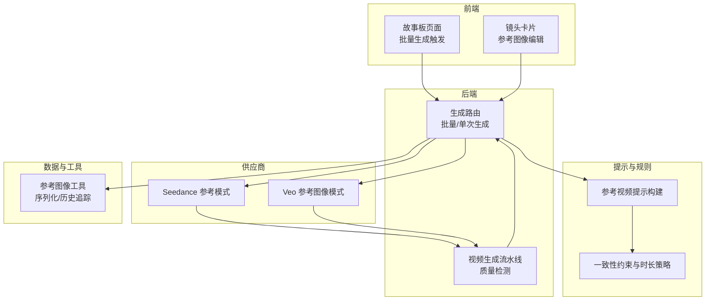
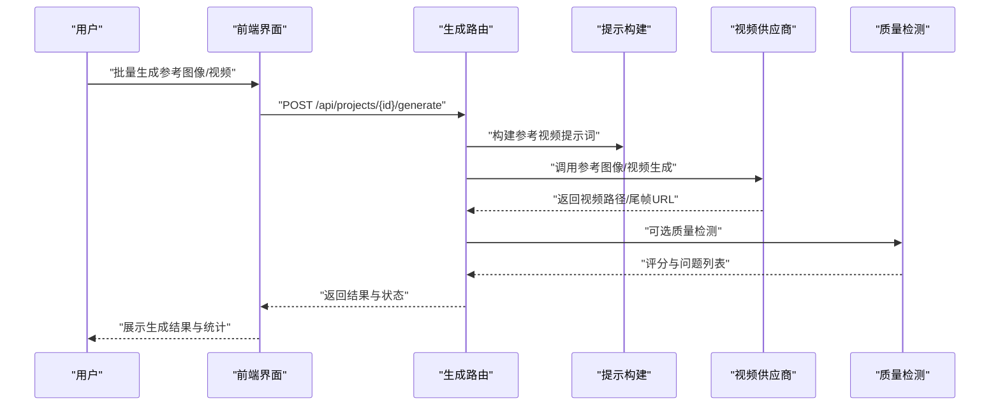
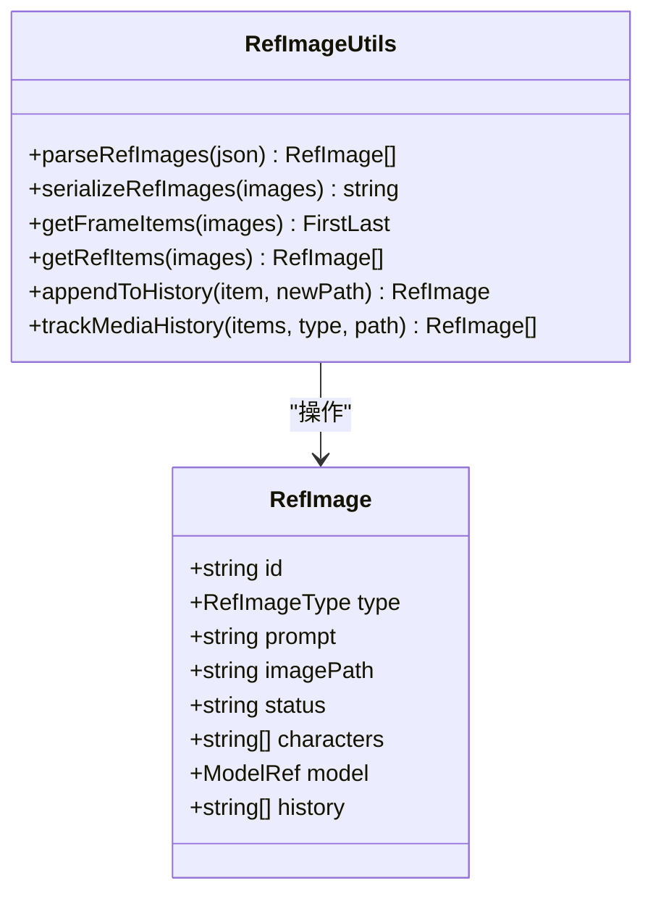
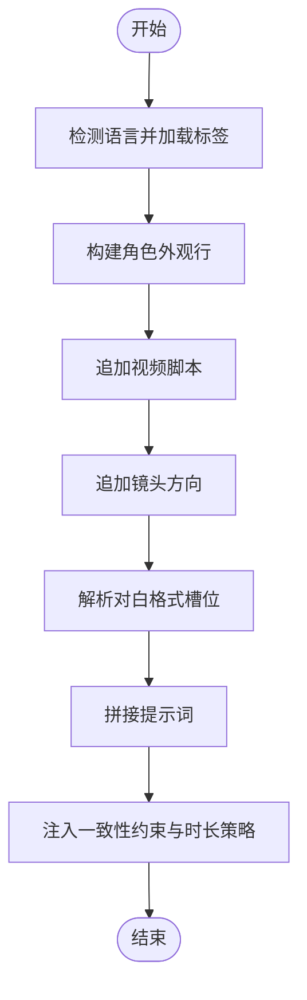
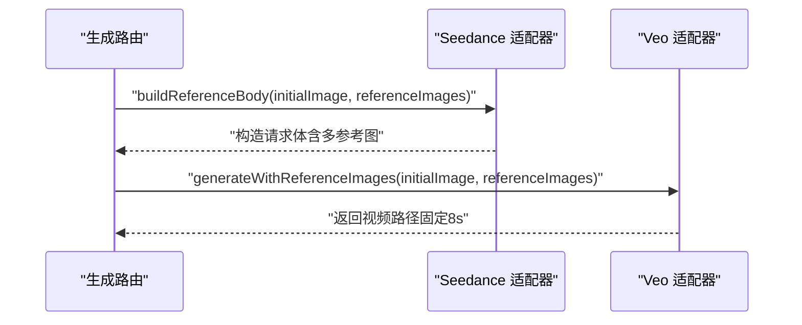
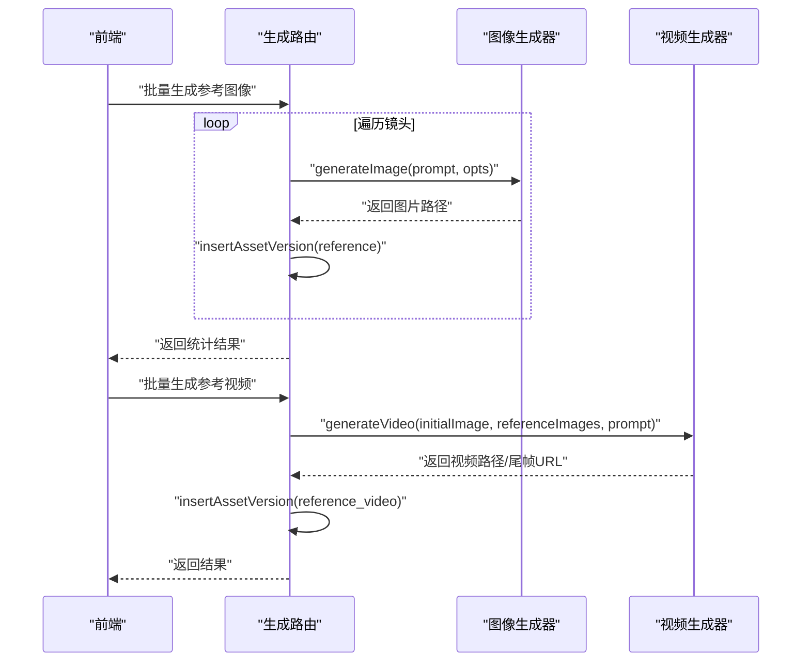
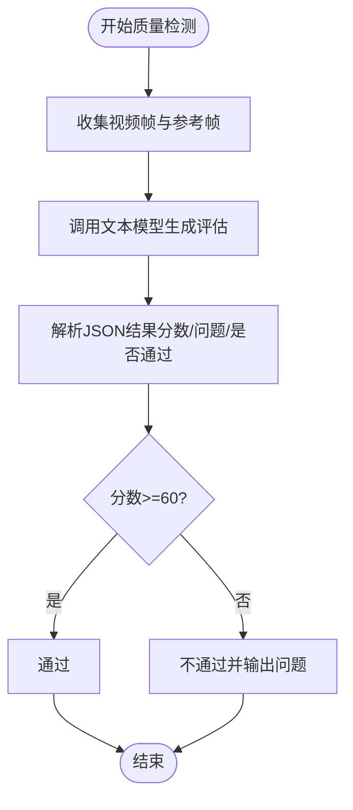
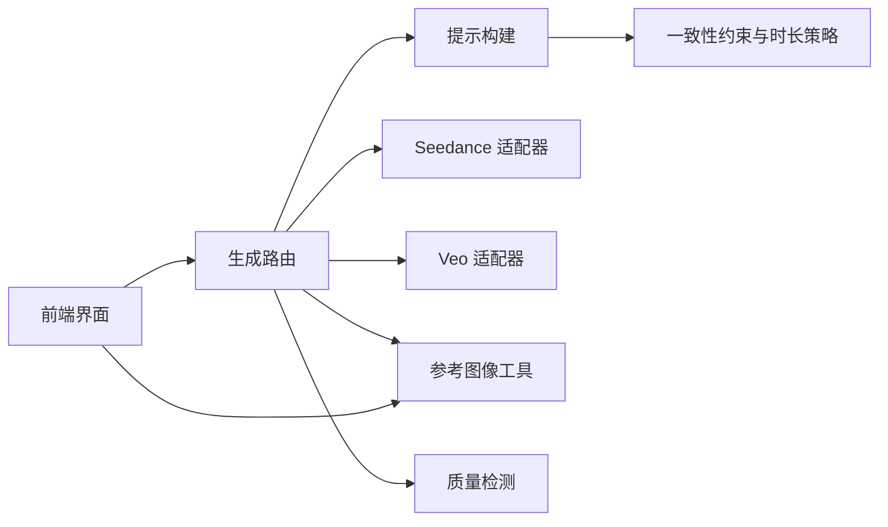

# 参考图像模式

<cite>
**本文引用的文件**
- [src/lib/ref-image-utils.ts](file://src/lib/ref-image-utils.ts)
- [src/app/api/projects/[id]/generate/route.ts](file://src/app/api/projects/[id]/generate/route.ts)
- [src/components/editor/shot-card.tsx](file://src/components/editor/shot-card.tsx)
- [src/app/[locale]/project/[id]/episodes/[episodeId]/storyboard/page.tsx](file://src/app/[locale]/project/[id]/episodes/[episodeId]/storyboard/page.tsx)
- [src/lib/ai/prompts/video-generate.ts](file://src/lib/ai/prompts/video-generate.ts)
- [src/lib/ai/prompts/registry.ts](file://src/lib/ai/prompts/registry.ts)
- [src/lib/ai/providers/seedance.ts](file://src/lib/ai/providers/seedance.ts)
- [src/lib/ai/providers/veo.ts](file://src/lib/ai/providers/veo.ts)
- [src/lib/pipeline/video-quality-check.ts](file://src/lib/pipeline/video-quality-check.ts)
- [src/lib/pipeline/video-generate.ts](file://src/lib/pipeline/video-generate.ts)
</cite>

## 目录
1. [简介](#简介)
2. [项目结构](#项目结构)
3. [核心组件](#核心组件)
4. [架构总览](#架构总览)
5. [详细组件分析](#详细组件分析)
6. [依赖关系分析](#依赖关系分析)
7. [性能考量](#性能考量)
8. [故障排除指南](#故障排除指南)
9. [结论](#结论)
10. [附录](#附录)

## 简介
本文件面向“参考图像模式”，系统性阐述基于参考图像的视频生成原理与实现，覆盖以下方面：
- 视频生成原理：图像对齐、风格迁移与动作合成的协同机制
- 参考图像的选择标准、预处理与质量要求
- 图像到视频的转换算法、时序一致性保障与视觉效果优化
- 参考图像管理、批量处理与性能监控
- 实际应用示例与常见问题排查

该模式以“参考图像”为核心视觉锚点，结合文本提示与可选的多参考图像，驱动视频生成器在保持角色外观与场景风格不变的前提下，仅在动态层面进行扩展，从而实现高保真、强一致的视频内容生产。

## 项目结构
围绕参考图像模式的关键模块分布如下：
- 提示工程与规则：构建参考视频提示词、一致性约束与时长策略
- 供应商适配：Seedance 与 Veo 的参考图像模式调用
- 数据模型与工具：参考图像数据结构、序列化/反序列化与历史追踪
- 后端流水线：批量生成参考图像、单镜头参考视频生成、质量检测
- 前端交互：参考图像卡片、批量生成触发与版本切换

图表来源
- [src/app/api/projects/[id]/generate/route.ts](file://src/app/api/projects/[id]/generate/route.ts)
- [src/lib/ai/prompts/video-generate.ts](file://src/lib/ai/prompts/video-generate.ts)
- [src/lib/ai/prompts/registry.ts](file://src/lib/ai/prompts/registry.ts)
- [src/lib/ai/providers/seedance.ts](file://src/lib/ai/providers/seedance.ts)
- [src/lib/ai/providers/veo.ts](file://src/lib/ai/providers/veo.ts)
- [src/lib/ref-image-utils.ts](file://src/lib/ref-image-utils.ts)
- [src/lib/pipeline/video-generate.ts](file://src/lib/pipeline/video-generate.ts)
- [src/lib/pipeline/video-quality-check.ts](file://src/lib/pipeline/video-quality-check.ts)

章节来源
- [src/app/api/projects/[id]/generate/route.ts](file://src/app/api/projects/[id]/generate/route.ts)
- [src/lib/ref-image-utils.ts](file://src/lib/ref-image-utils.ts)
- [src/lib/ai/prompts/video-generate.ts](file://src/lib/ai/prompts/video-generate.ts)
- [src/lib/ai/prompts/registry.ts](file://src/lib/ai/prompts/registry.ts)
- [src/lib/ai/providers/seedance.ts](file://src/lib/ai/providers/seedance.ts)
- [src/lib/ai/providers/veo.ts](file://src/lib/ai/providers/veo.ts)
- [src/lib/pipeline/video-generate.ts](file://src/lib/pipeline/video-generate.ts)
- [src/lib/pipeline/video-quality-check.ts](file://src/lib/pipeline/video-quality-check.ts)

## 核心组件
- 参考图像数据模型与工具
  - 类型定义与序列化/反序列化，支持历史追踪与状态管理
  - 支持多种类型：首帧、尾帧、参考图像、视频、参考视频、场景参考
- 提示构建与一致性约束
  - 构建参考视频提示词，注入角色、镜头与对白信息
  - 明确“禁止改变角色外观/环境风格”的一致性约束
  - 不同时长下的描述粒度策略
- 供应商适配
  - Seedance：支持单图与多参考图（最多9张），统一以“reference_image”角色传递
  - Veo：参考图像模式，场景帧+角色参考图像组合，固定8秒时长
- 批量与单次生成
  - 批量生成参考图像与参考视频，支持进度统计与错误聚合
  - 单次生成与重新生成，支持版本切换与历史回溯
- 质量检测
  - 对视频帧与可选参考帧进行质量评分与问题识别，确保一致性与连贯性

章节来源
- [src/lib/ref-image-utils.ts](file://src/lib/ref-image-utils.ts)
- [src/lib/ai/prompts/video-generate.ts](file://src/lib/ai/prompts/video-generate.ts)
- [src/lib/ai/prompts/registry.ts](file://src/lib/ai/prompts/registry.ts)
- [src/lib/ai/providers/seedance.ts](file://src/lib/ai/providers/seedance.ts)
- [src/lib/ai/providers/veo.ts](file://src/lib/ai/providers/veo.ts)
- [src/app/api/projects/[id]/generate/route.ts](file://src/app/api/projects/[id]/generate/route.ts)
- [src/lib/pipeline/video-quality-check.ts](file://src/lib/pipeline/video-quality-check.ts)

## 架构总览
参考图像模式的端到端流程如下：
- 用户在前端编辑参考图像与提示
- 后端根据生成模式（参考/关键帧）收集视觉帧
- 构建参考视频提示词并调用供应商
- 供应商返回视频与可选尾帧，后端写入资产并更新状态
- 可选执行质量检测，输出评分与问题清单

图表来源
- [src/app/api/projects/[id]/generate/route.ts](file://src/app/api/projects/[id]/generate/route.ts)
- [src/lib/ai/prompts/video-generate.ts](file://src/lib/ai/prompts/video-generate.ts)
- [src/lib/ai/providers/seedance.ts](file://src/lib/ai/providers/seedance.ts)
- [src/lib/ai/providers/veo.ts](file://src/lib/ai/providers/veo.ts)
- [src/lib/pipeline/video-generate.ts](file://src/lib/pipeline/video-generate.ts)
- [src/lib/pipeline/video-quality-check.ts](file://src/lib/pipeline/video-quality-check.ts)

## 详细组件分析

### 参考图像数据模型与工具
- 类型与字段
  - 类型枚举：首帧、尾帧、参考图像、视频、参考视频、场景参考
  - 关键字段：状态（待生成/已生成）、历史路径数组、关联角色、模型配置
- 序列化/反序列化
  - 兼容旧格式字符串数组与新格式对象数组
- 历史追踪
  - 追加新版本至历史并标记当前路径
  - 支持按类型插入/更新跟踪项

图表来源
- [src/lib/ref-image-utils.ts](file://src/lib/ref-image-utils.ts)

章节来源
- [src/lib/ref-image-utils.ts](file://src/lib/ref-image-utils.ts)

### 提示构建与一致性约束
- 参考视频提示构建
  - 组合时长、角色外观、脚本、镜头方向与对白格式槽位
  - 支持语言检测与标签本地化
- 一致性约束与时长策略
  - 严格禁止改变角色外观与环境风格
  - 允许的姿态、表情、动作与镜头运动变化
  - 不同时长下的描述颗粒度与分镜策略

图表来源
- [src/lib/ai/prompts/video-generate.ts](file://src/lib/ai/prompts/video-generate.ts)
- [src/lib/ai/prompts/registry.ts](file://src/lib/ai/prompts/registry.ts)

章节来源
- [src/lib/ai/prompts/video-generate.ts](file://src/lib/ai/prompts/video-generate.ts)
- [src/lib/ai/prompts/registry.ts](file://src/lib/ai/prompts/registry.ts)

### 供应商适配：Seedance 与 Veo
- Seedance 参考模式
  - 单图与多参考图（最多9张）统一以“reference_image”角色传递
  - 支持返回尾帧与可选音频（Seedance 2.0）
- Veo 参考图像模式
  - 固定8秒时长，场景帧+角色参考图像组合
  - 通过配置传入参考图像集合

图表来源
- [src/lib/ai/providers/seedance.ts](file://src/lib/ai/providers/seedance.ts)
- [src/lib/ai/providers/veo.ts](file://src/lib/ai/providers/veo.ts)

章节来源
- [src/lib/ai/providers/seedance.ts](file://src/lib/ai/providers/seedance.ts)
- [src/lib/ai/providers/veo.ts](file://src/lib/ai/providers/veo.ts)

### 批量与单次生成流程
- 批量生成参考图像
  - 遍历镜头，按提示生成高质量参考图像，并写入资产版本
  - 统计成功/失败数量并返回
- 单次生成与重新生成
  - 支持指定镜头与参考图像ID，调用图像生成器并写入资产
  - 支持版本切换与历史回溯
- 参考视频生成
  - 收集所有场景参考帧（有序），构建提示词并调用视频供应商
  - 写入参考视频资产并更新镜头状态

图表来源
- [src/app/api/projects/[id]/generate/route.ts](file://src/app/api/projects/[id]/generate/route.ts)
- [src/app/[locale]/project/[id]/episodes/[episodeId]/storyboard/page.tsx](file://src/app/[locale]/project/[id]/episodes/[episodeId]/storyboard/page.tsx)
- [src/components/editor/shot-card.tsx](file://src/components/editor/shot-card.tsx)

章节来源
- [src/app/api/projects/[id]/generate/route.ts](file://src/app/api/projects/[id]/generate/route.ts)
- [src/app/[locale]/project/[id]/episodes/[episodeId]/storyboard/page.tsx](file://src/app/[locale]/project/[id]/episodes/[episodeId]/storyboard/page.tsx)
- [src/components/editor/shot-card.tsx](file://src/components/editor/shot-card.tsx)

### 质量检测与视觉效果优化
- 质量检测
  - 对视频帧与可选参考帧进行评分（0-100），识别面部/肢体完整性、视觉连贯性与整体图像质量
  - 若评分低于阈值则判定不通过，输出问题清单
- 视觉效果优化
  - 通过一致性约束与提示词粒度控制，减少风格漂移与动作不连贯
  - 多参考图像增强空间上下文，提升复杂场景的稳定性

图表来源
- [src/lib/pipeline/video-quality-check.ts](file://src/lib/pipeline/video-quality-check.ts)
- [src/lib/pipeline/video-generate.ts](file://src/lib/pipeline/video-generate.ts)

章节来源
- [src/lib/pipeline/video-quality-check.ts](file://src/lib/pipeline/video-quality-check.ts)
- [src/lib/pipeline/video-generate.ts](file://src/lib/pipeline/video-generate.ts)

## 依赖关系分析
- 组件耦合
  - 生成路由依赖提示构建与供应商适配器；提示构建依赖语言标签与槽位解析
  - 参考图像工具被前端与后端广泛使用，承担数据标准化职责
  - 质量检测作为可选环节，与视频生成流水线解耦
- 外部依赖
  - Seedance 与 Veo 提供视频生成能力，接口参数与约束不同
  - 图像生成器用于生成参考图像，配合参考图像管理形成闭环

图表来源
- [src/app/api/projects/[id]/generate/route.ts](file://src/app/api/projects/[id]/generate/route.ts)
- [src/lib/ai/prompts/video-generate.ts](file://src/lib/ai/prompts/video-generate.ts)
- [src/lib/ai/prompts/registry.ts](file://src/lib/ai/prompts/registry.ts)
- [src/lib/ai/providers/seedance.ts](file://src/lib/ai/providers/seedance.ts)
- [src/lib/ai/providers/veo.ts](file://src/lib/ai/providers/veo.ts)
- [src/lib/ref-image-utils.ts](file://src/lib/ref-image-utils.ts)
- [src/lib/pipeline/video-quality-check.ts](file://src/lib/pipeline/video-quality-check.ts)

章节来源
- [src/app/api/projects/[id]/generate/route.ts](file://src/app/api/projects/[id]/generate/route.ts)
- [src/lib/ref-image-utils.ts](file://src/lib/ref-image-utils.ts)
- [src/lib/ai/prompts/video-generate.ts](file://src/lib/ai/prompts/video-generate.ts)
- [src/lib/ai/prompts/registry.ts](file://src/lib/ai/prompts/registry.ts)
- [src/lib/ai/providers/seedance.ts](file://src/lib/ai/providers/seedance.ts)
- [src/lib/ai/providers/veo.ts](file://src/lib/ai/providers/veo.ts)
- [src/lib/pipeline/video-quality-check.ts](file://src/lib/pipeline/video-quality-check.ts)

## 性能考量
- 并行化
  - 批量生成参考图像与视频采用并发处理，缩短总耗时
- 时长与粒度
  - 根据镜头时长选择合适的描述粒度，避免冗余信息导致生成延迟
- 供应商选择
  - Seedance 适合多参考图与较长时长；Veo 适合固定8秒且需要强视觉锚点的场景
- 资源限制
  - 控制参考图像数量与分辨率，平衡质量与成本
- 质量前置
  - 在生成前进行质量检测，降低失败重试成本

## 故障排除指南
- 常见问题
  - 无可用帧：当未生成首帧/尾帧/场景参考帧时，无法进入参考视频生成阶段
  - 提示为空：单次生成参考图像需提供有效提示词
  - 供应商参数不符：Veo 参考图像模式固定8秒，Seedance 多参考图需正确设置角色
- 排查步骤
  - 检查参考图像状态与历史版本，确认当前版本是否正确
  - 查看生成路由日志，定位失败镜头与错误原因
  - 使用质量检测接口验证视频帧与参考帧一致性
- 修复建议
  - 补充缺失的参考帧或重新生成
  - 调整提示词以满足一致性约束与时长策略
  - 切换供应商或调整参数（如时长、比例）

章节来源
- [src/app/api/projects/[id]/generate/route.ts](file://src/app/api/projects/[id]/generate/route.ts)
- [src/lib/pipeline/video-quality-check.ts](file://src/lib/pipeline/video-quality-check.ts)

## 结论
参考图像模式通过“视觉锚点+文本提示+可选多参考图”的组合，在保持角色外观与场景风格一致的前提下，高效生成高质量视频。其关键在于：
- 明确的一致性约束与时长策略
- 完备的参考图像管理与历史追踪
- 供应商适配与质量检测的协同
- 前后端联动的批量与单次生成能力

## 附录
- 实际应用示例
  - 场景：需要严格保持角色与场景风格的动画短片制作
  - 步骤：先生成高质量参考图像，再以参考图像为锚点生成参考视频，最后进行质量检测与微调
- 最佳实践
  - 优先使用多参考图像增强空间上下文
  - 依据镜头时长选择提示词粒度与时长策略
  - 定期回溯历史版本，确保一致性与可追溯性