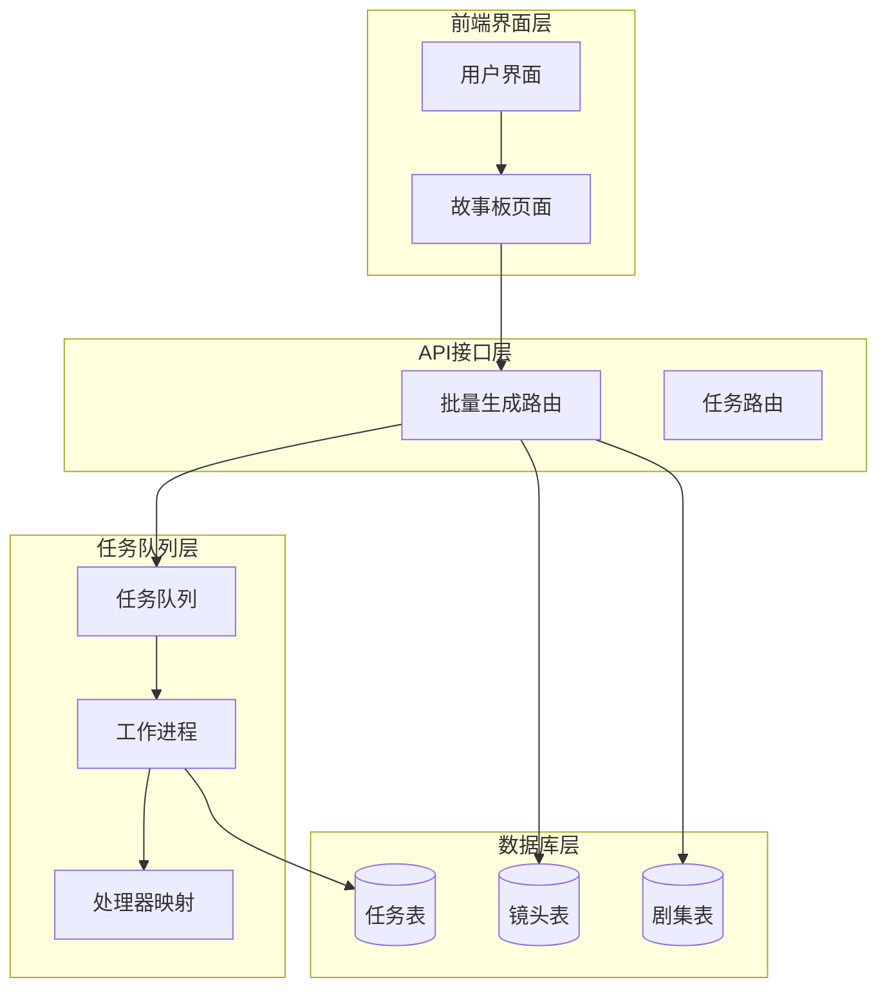
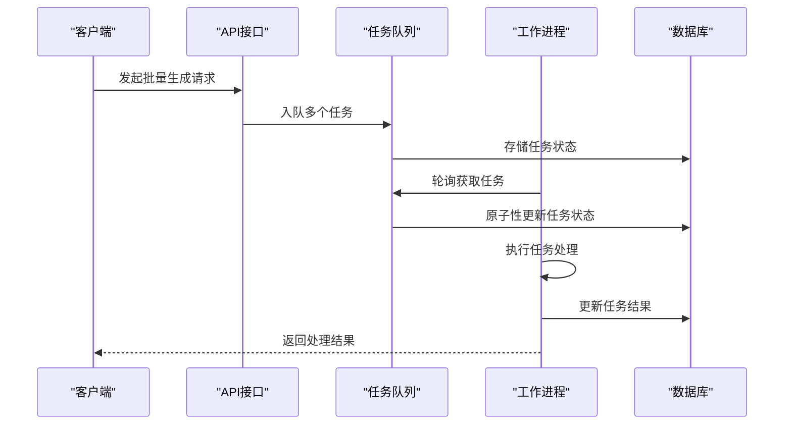
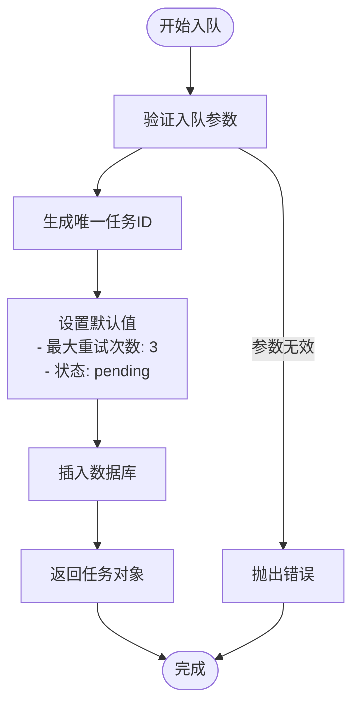
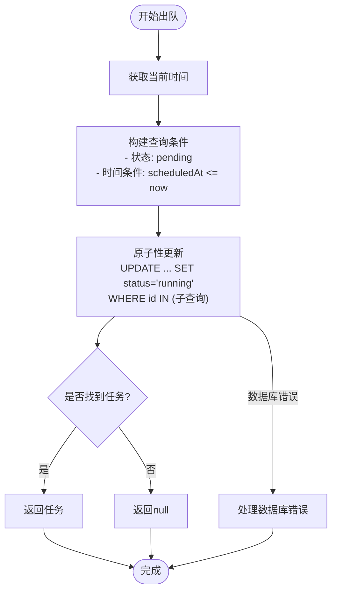
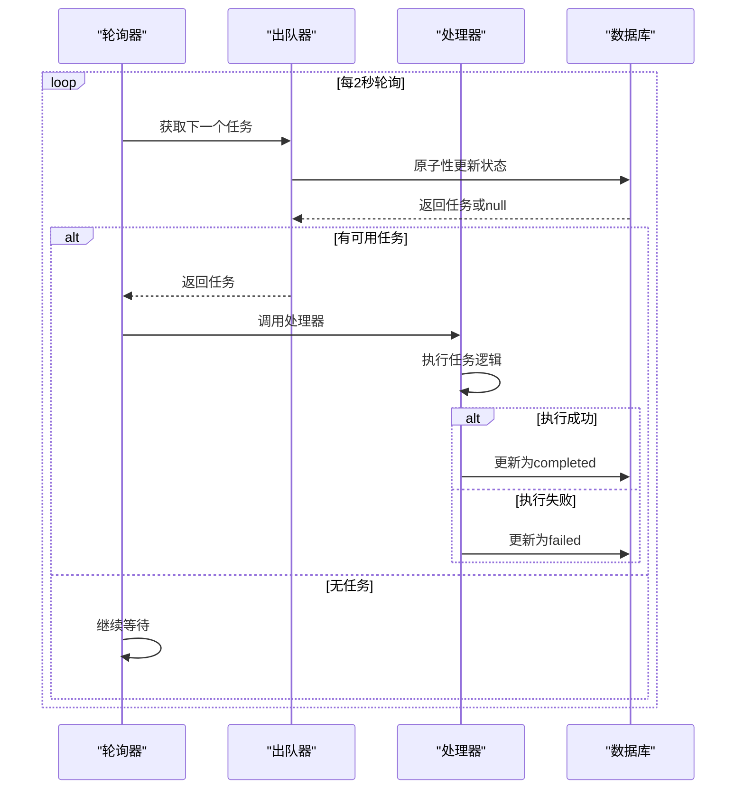
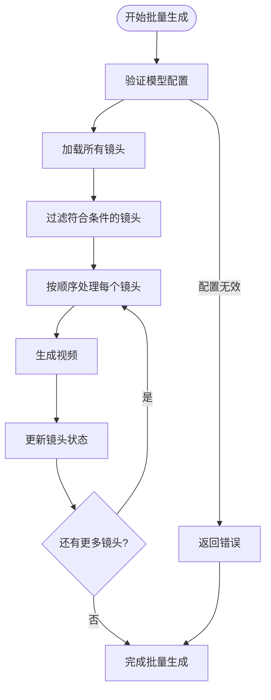
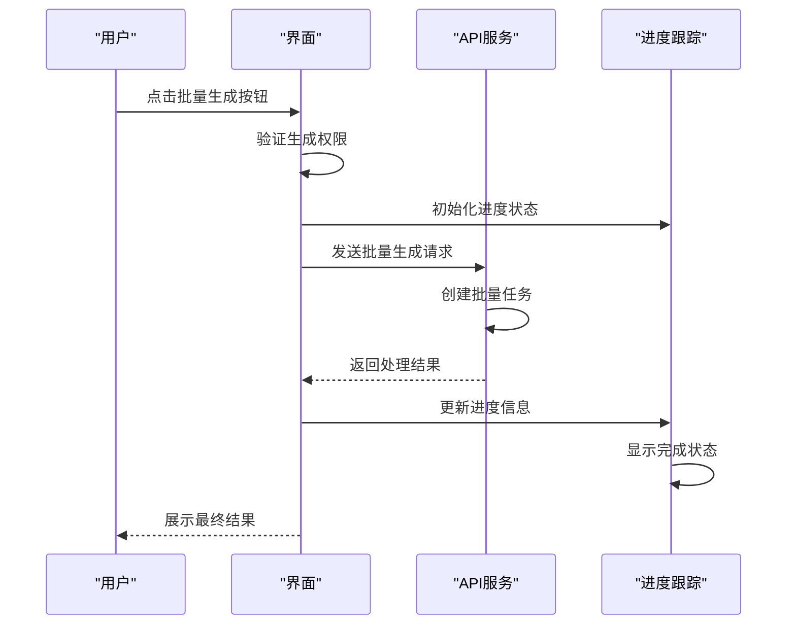
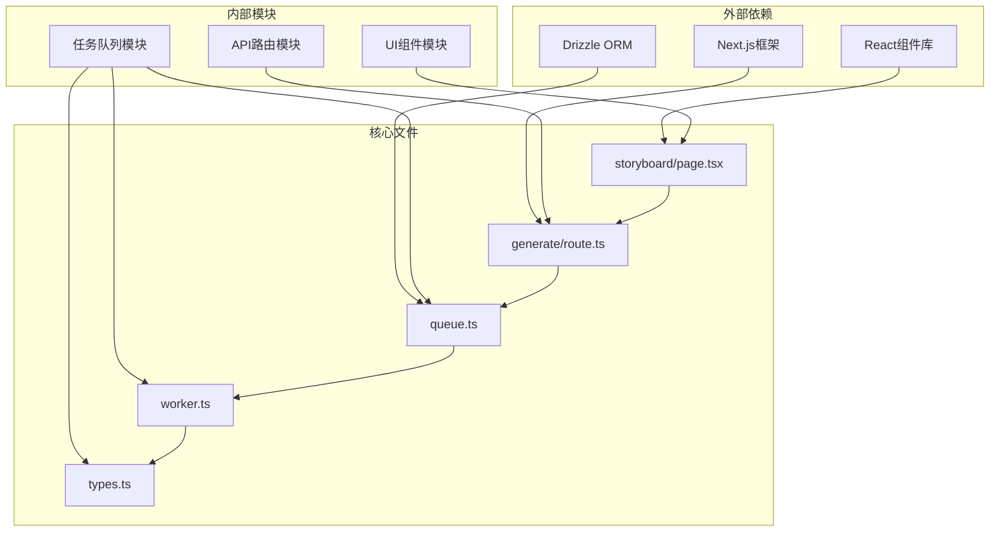

# 批量处理机制

<cite>
**本文档引用的文件**
- [src/lib/task-queue/index.ts](file://src/lib/task-queue/index.ts)
- [src/lib/task-queue/queue.ts](file://src/lib/task-queue/queue.ts)
- [src/lib/task-queue/worker.ts](file://src/lib/task-queue/worker.ts)
- [src/lib/task-queue/types.ts](file://src/lib/task-queue/types.ts)
- [src/app/api/projects/[id]/generate/route.ts](file://src/app/api/projects/[id]/generate/route.ts)
- [src/app/[locale]/project/[id]/episodes/[episodeId]/storyboard/page.tsx](file://src/app/[locale]/project/[id]/episodes/[episodeId]/storyboard/page.tsx)
- [src/app/api/tasks/[id]/route.ts](file://src/app/api/tasks/[id]/route.ts)
</cite>

## 目录
1. [简介](#简介)
2. [项目结构](#项目结构)
3. [核心组件](#核心组件)
4. [架构概览](#架构概览)
5. [详细组件分析](#详细组件分析)
6. [依赖关系分析](#依赖关系分析)
7. [性能考虑](#性能考虑)
8. [故障排除指南](#故障排除指南)
9. [结论](#结论)

## 简介

AIComicBuilder 的批量处理机制是一个基于异步任务队列的系统，专门用于处理大规模的视频生成任务。该系统通过任务队列实现了任务调度、并发控制和优先级管理，支持批量视频生成的完整工作流程，包括进度跟踪和错误恢复机制。

系统采用分层架构设计，核心由任务队列、工作进程和API接口组成，能够高效地处理来自用户界面的批量生成请求，并将其转换为可管理的任务序列。

## 项目结构

批量处理机制在项目中的组织结构如下：

**图表来源**
- [src/app/[locale]/project/[id]/episodes/[episodeId]/storyboard/page.tsx](file://src/app/[locale]/project/[id]/episodes/[episodeId]/storyboard/page.tsx#L273-L297)
- [src/app/api/projects/[id]/generate/route.ts](file://src/app/api/projects/[id]/generate/route.ts#L1914-L1934)
- [src/lib/task-queue/queue.ts:1-50](file://src/lib/task-queue/queue.ts#L1-L50)

**章节来源**
- [src/lib/task-queue/index.ts:1-3](file://src/lib/task-queue/index.ts#L1-L3)
- [src/lib/task-queue/queue.ts:1-50](file://src/lib/task-queue/queue.ts#L1-L50)
- [src/lib/task-queue/worker.ts:1-56](file://src/lib/task-queue/worker.ts#L1-L56)

## 核心组件

### 任务队列系统

任务队列系统是整个批量处理机制的核心，提供了以下关键功能：

- **任务入队**: 支持多种任务类型的入队操作
- **任务出队**: 实现原子性的任务获取和状态更新
- **任务状态管理**: 完整的任务生命周期管理
- **并发控制**: 基于工作进程数量的并发限制

### 工作进程

工作进程负责实际执行任务，具有以下特性：

- **轮询机制**: 每2秒检查一次是否有待处理任务
- **异常处理**: 完善的错误捕获和恢复机制
- **处理器注册**: 支持动态注册不同类型的任务处理器

### 类型定义

系统定义了完整的类型体系，确保类型安全：

- **Task**: 任务基础类型
- **TaskType**: 任务类型枚举
- **TaskHandler**: 任务处理器类型
- **TaskHandlerMap**: 处理器映射表

**章节来源**
- [src/lib/task-queue/types.ts:1-200](file://src/lib/task-queue/types.ts#L1-L200)
- [src/lib/task-queue/queue.ts:7-29](file://src/lib/task-queue/queue.ts#L7-L29)
- [src/lib/task-queue/worker.ts:9-27](file://src/lib/task-queue/worker.ts#L9-L27)

## 架构概览

批量处理系统的整体架构采用生产者-消费者模式：

**图表来源**
- [src/app/api/projects/[id]/generate/route.ts](file://src/app/api/projects/[id]/generate/route.ts#L1914-L1934)
- [src/lib/task-queue/queue.ts:31-49](file://src/lib/task-queue/queue.ts#L31-L49)
- [src/lib/task-queue/worker.ts:29-44](file://src/lib/task-queue/worker.ts#L29-L44)

## 详细组件分析

### 任务队列入队机制

任务入队过程实现了完整的数据验证和持久化：

**图表来源**
- [src/lib/task-queue/queue.ts:7-29](file://src/lib/task-queue/queue.ts#L7-L29)

**章节来源**
- [src/lib/task-queue/queue.ts:7-29](file://src/lib/task-queue/queue.ts#L7-L29)

### 任务出队与原子性保证

任务出队采用了原子性更新机制，避免了竞态条件：

**图表来源**
- [src/lib/task-queue/queue.ts:31-49](file://src/lib/task-queue/queue.ts#L31-L49)

**章节来源**
- [src/lib/task-queue/queue.ts:31-49](file://src/lib/task-queue/queue.ts#L31-L49)

### 工作进程执行流程

工作进程的执行流程确保了任务的可靠处理：

**图表来源**
- [src/lib/task-queue/worker.ts:29-44](file://src/lib/task-queue/worker.ts#L29-L44)
- [src/lib/task-queue/worker.ts:13-27](file://src/lib/task-queue/worker.ts#L13-L27)

**章节来源**
- [src/lib/task-queue/worker.ts:13-27](file://src/lib/task-queue/worker.ts#L13-L27)
- [src/lib/task-queue/worker.ts:29-44](file://src/lib/task-queue/worker.ts#L29-L44)

### 批量视频生成工作流程

批量视频生成是系统的核心功能，实现了完整的端到端处理流程：

**图表来源**
- [src/app/api/projects/[id]/generate/route.ts](file://src/app/api/projects/[id]/generate/route.ts#L1914-L1934)
- [src/app/api/projects/[id]/generate/route.ts](file://src/app/api/projects/[id]/generate/route.ts#L2968-L2982)

**章节来源**
- [src/app/api/projects/[id]/generate/route.ts](file://src/app/api/projects/[id]/generate/route.ts#L1914-L1934)
- [src/app/api/projects/[id]/generate/route.ts](file://src/app/api/projects/[id]/generate/route.ts#L2968-L2982)

### 前端批量处理交互

前端界面提供了直观的批量处理交互体验：

**图表来源**
- [src/app/[locale]/project/[id]/episodes/[episodeId]/storyboard/page.tsx](file://src/app/[locale]/project/[id]/episodes/[episodeId]/storyboard/page.tsx#L273-L297)

**章节来源**
- [src/app/[locale]/project/[id]/episodes/[episodeId]/storyboard/page.tsx](file://src/app/[locale]/project/[id]/episodes/[episodeId]/storyboard/page.tsx#L273-L297)

## 依赖关系分析

批量处理机制的依赖关系体现了清晰的分层架构：

**图表来源**
- [src/lib/task-queue/queue.ts:1-5](file://src/lib/task-queue/queue.ts#L1-L5)
- [src/lib/task-queue/worker.ts:1-2](file://src/lib/task-queue/worker.ts#L1-L2)
- [src/app/api/projects/[id]/generate/route.ts](file://src/app/api/projects/[id]/generate/route.ts#L1-L10)

**章节来源**
- [src/lib/task-queue/index.ts:1-3](file://src/lib/task-queue/index.ts#L1-L3)
- [src/lib/task-queue/queue.ts:1-5](file://src/lib/task-queue/queue.ts#L1-L5)
- [src/lib/task-queue/worker.ts:1-2](file://src/lib/task-queue/worker.ts#L1-L2)

## 性能考虑

### 并发控制策略

系统通过以下机制实现有效的并发控制：

- **工作进程数量**: 可根据系统资源动态调整
- **任务批处理**: 支持批量任务的有序处理
- **资源限制**: 通过数据库事务确保资源一致性

### 性能优化建议

1. **数据库优化**
   - 为任务表建立适当的索引
   - 使用连接池管理数据库连接
   - 实施查询优化策略

2. **内存管理**
   - 合理设置任务超时时间
   - 实施任务结果缓存机制
   - 监控内存使用情况

3. **网络优化**
   - 实施请求限流机制
   - 优化API响应时间
   - 使用CDN加速静态资源

## 故障排除指南

### 常见问题及解决方案

**任务无法出队**
- 检查数据库连接状态
- 验证任务表结构完整性
- 确认轮询间隔设置合理

**任务执行失败**
- 查看工作进程日志
- 验证处理器注册状态
- 检查任务依赖的服务可用性

**进度跟踪异常**
- 确认前端状态同步机制
- 验证API响应格式
- 检查WebSocket连接状态

**章节来源**
- [src/lib/task-queue/worker.ts:37-39](file://src/lib/task-queue/worker.ts#L37-L39)
- [src/lib/task-queue/queue.ts:38-47](file://src/lib/task-queue/queue.ts#L38-L47)

## 结论

AIComicBuilder 的批量处理机制通过精心设计的异步任务队列系统，实现了高效、可靠的批量视频生成功能。系统的关键优势包括：

- **原子性保证**: 通过数据库事务确保任务状态的一致性
- **灵活的并发控制**: 支持动态调整工作进程数量
- **完善的错误处理**: 提供多层次的错误捕获和恢复机制
- **直观的进度跟踪**: 用户友好的批量处理界面

该系统为大规模视频生成任务提供了坚实的技术基础，能够满足专业用户的批量处理需求。通过持续的优化和改进，系统将继续提升性能和可靠性，为用户提供更好的批量处理体验。