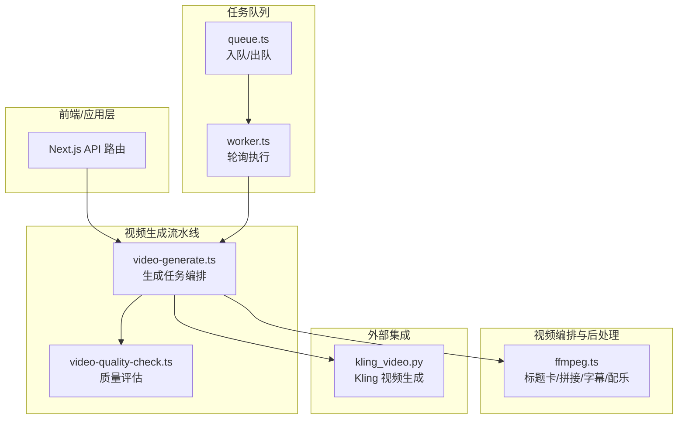
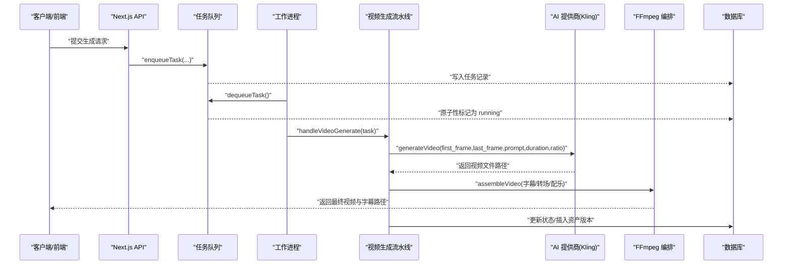
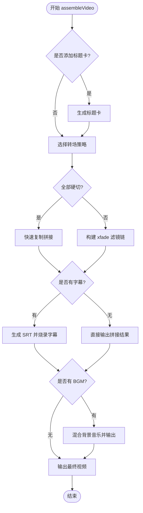
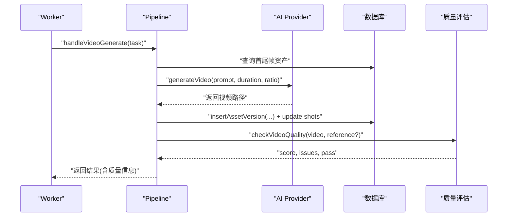
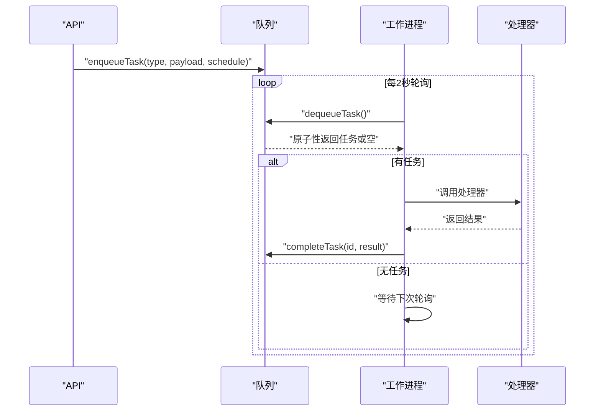
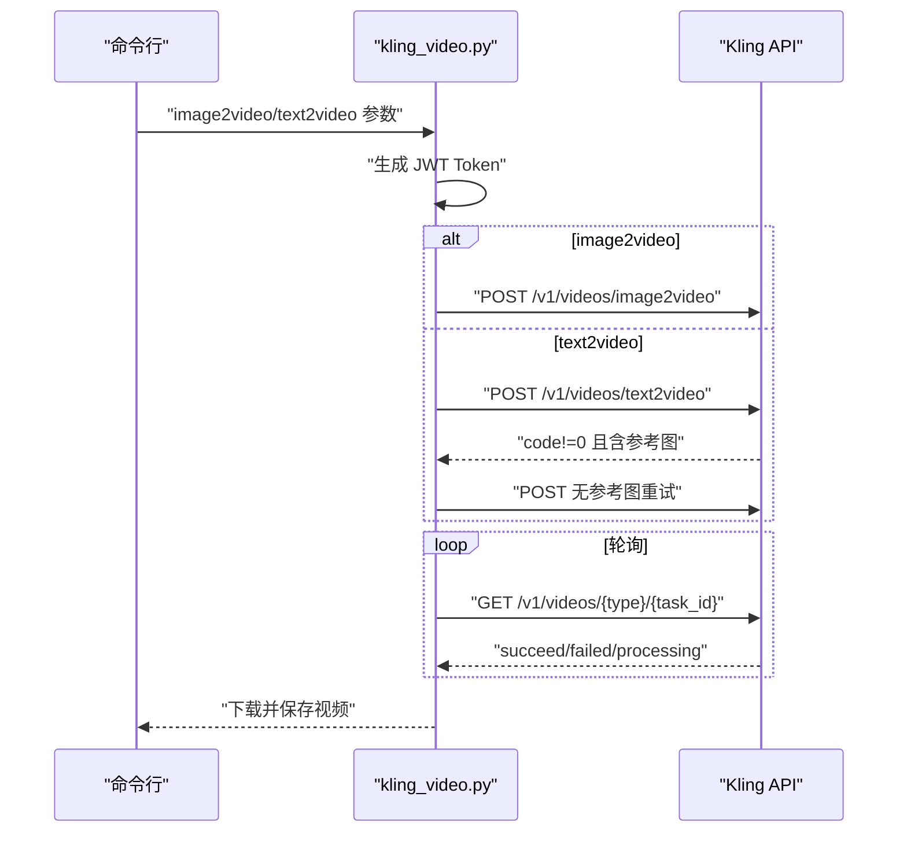
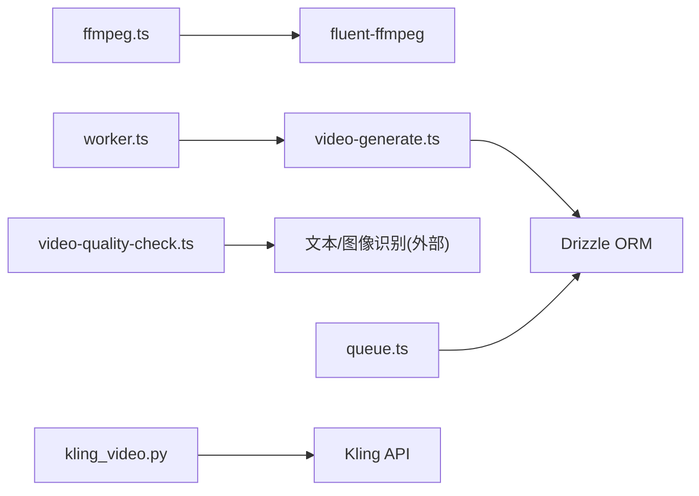

# 视频处理管道

<cite>
**本文引用的文件**
- [ffmpeg.ts](file://src/lib/video/ffmpeg.ts)
- [video-generate.ts](file://src/lib/pipeline/video-generate.ts)
- [video-quality-check.ts](file://src/lib/pipeline/video-quality-check.ts)
- [worker.ts](file://src/lib/task-queue/worker.ts)
- [queue.ts](file://src/lib/task-queue/queue.ts)
- [kling_video.py](file://scripts/kling_video.py)
- [package.json](file://package.json)
</cite>

## 目录
1. [简介](#简介)
2. [项目结构](#项目结构)
3. [核心组件](#核心组件)
4. [架构总览](#架构总览)
5. [详细组件分析](#详细组件分析)
6. [依赖关系分析](#依赖关系分析)
7. [性能考虑](#性能考虑)
8. [故障排查指南](#故障排查指南)
9. [结论](#结论)
10. [附录](#附录)

## 简介
本文件系统化梳理 AIComicBuilder 的视频处理管道，覆盖从 AI 视频生成、FFmpeg 编排、字幕与配乐集成、到质量评估与自动化流水线的全链路。重点包括：
- FFmpeg 集成：标题卡生成、片段拼接与转场、字幕烧录、背景音乐混合
- 视频后处理：色彩校正、分辨率调整、压缩优化
- Python 脚本集成：Kling 文本/图像驱动视频生成
- 任务队列与自动化：基于数据库的任务调度与工作进程轮询
- 性能调优与错误处理：参数配置、资源管理与容错策略

## 项目结构
围绕视频处理的关键模块分布如下：
- 视频编排与后处理：src/lib/video/ffmpeg.ts
- 视频生成流水线：src/lib/pipeline/video-generate.ts
- 质量评估：src/lib/pipeline/video-quality-check.ts
- 任务队列：src/lib/task-queue/queue.ts、worker.ts
- 外部脚本：scripts/kling_video.py
- 依赖声明：package.json（含 ffmpeg 客户端）

图表来源
- [ffmpeg.ts:1-353](file://src/lib/video/ffmpeg.ts#L1-L353)
- [video-generate.ts:1-130](file://src/lib/pipeline/video-generate.ts#L1-L130)
- [video-quality-check.ts:1-53](file://src/lib/pipeline/video-quality-check.ts#L1-L53)
- [queue.ts:1-50](file://src/lib/task-queue/queue.ts#L1-L50)
- [worker.ts:1-56](file://src/lib/task-queue/worker.ts#L1-L56)
- [kling_video.py:1-207](file://scripts/kling_video.py#L1-L207)

章节来源
- [ffmpeg.ts:1-353](file://src/lib/video/ffmpeg.ts#L1-L353)
- [video-generate.ts:1-130](file://src/lib/pipeline/video-generate.ts#L1-L130)
- [video-quality-check.ts:1-53](file://src/lib/pipeline/video-quality-check.ts#L1-L53)
- [queue.ts:1-50](file://src/lib/task-queue/queue.ts#L1-L50)
- [worker.ts:1-56](file://src/lib/task-queue/worker.ts#L1-L56)
- [kling_video.py:1-207](file://scripts/kling_video.py#L1-L207)
- [package.json](file://package.json)

## 核心组件
- FFmpeg 编排器：负责标题卡生成、多片段拼接与转场、字幕烧录、背景音乐混合等
- 视频生成流水线：封装 AI 提供商调用、参数构建、资产版本化与状态更新
- 质量评估：对生成视频抽帧进行质量打分与问题检测
- 任务队列：数据库驱动的任务入队、原子性出队与工作进程轮询执行
- Python 脚本：对接第三方视频生成服务（如 Kling），支持首尾帧与参考图模式

章节来源
- [ffmpeg.ts:1-353](file://src/lib/video/ffmpeg.ts#L1-L353)
- [video-generate.ts:1-130](file://src/lib/pipeline/video-generate.ts#L1-L130)
- [video-quality-check.ts:1-53](file://src/lib/pipeline/video-quality-check.ts#L1-L53)
- [queue.ts:1-50](file://src/lib/task-queue/queue.ts#L1-L50)
- [worker.ts:1-56](file://src/lib/task-queue/worker.ts#L1-L56)
- [kling_video.py:1-207](file://scripts/kling_video.py#L1-L207)

## 架构总览
下图展示从任务触发到最终产出的端到端流程。

图表来源
- [video-generate.ts:24-129](file://src/lib/pipeline/video-generate.ts#L24-L129)
- [ffmpeg.ts:237-352](file://src/lib/video/ffmpeg.ts#L237-L352)
- [queue.ts:31-49](file://src/lib/task-queue/queue.ts#L31-L49)
- [worker.ts:29-44](file://src/lib/task-queue/worker.ts#L29-L44)
- [kling_video.py:77-203](file://scripts/kling_video.py#L77-L203)

## 详细组件分析

### 组件A：FFmpeg 编排器（标题卡、拼接、转场、字幕、配乐）
- 功能要点
  - 标题卡生成：基于纯色背景与 drawtext 字幕滤镜生成片头/片尾
  - 片段拼接与转场：支持硬切与多种过渡（xfade），自动选择快速复制或滤镜链
  - 字幕烧录：生成 SRT 并通过 subtitles 滤镜烧录，失败时回退到跳过字幕
  - 背景音乐混合：按音量衰减叠加音频，以最短时长为准
- 关键数据结构
  - SubtitleEntry：包含文本、镜头序号、对话序号、对话总数及起止时间比
  - AssembleParams/AssembleResult：输入视频列表、转场类型、字幕、BGM 等与输出路径
- 参数与优化
  - 编码器与预设：libx264 + fast；CRF 23；像素格式 yuv420p
  - 转场时长默认 0.5 秒；硬切通过 duration=0 实现
  - 字幕路径转义避免特殊字符导致的滤镜解析错误
- 错误处理
  - 拼接失败抛出明确错误信息
  - 字幕烧录失败回退至直接输出拼接结果
  - BGM 混合失败记录警告并继续

图表来源
- [ffmpeg.ts:237-352](file://src/lib/video/ffmpeg.ts#L237-L352)

章节来源
- [ffmpeg.ts:12-36](file://src/lib/video/ffmpeg.ts#L12-L36)
- [ffmpeg.ts:38-67](file://src/lib/video/ffmpeg.ts#L38-L67)
- [ffmpeg.ts:69-123](file://src/lib/video/ffmpeg.ts#L69-L123)
- [ffmpeg.ts:140-235](file://src/lib/video/ffmpeg.ts#L140-L235)
- [ffmpeg.ts:237-352](file://src/lib/video/ffmpeg.ts#L237-L352)

### 组件B：视频生成流水线（AI 生成 + 资产版本化 + 质量评估）
- 流程概览
  - 解析任务载荷，查询首尾帧资产，构建视频提示词
  - 调用 AI 提供商生成视频，插入版本化资产记录
  - 更新镜头状态为“生成中”→“完成”
  - 异步进行质量评估（不阻塞主流程）
- 关键点
  - 上传目录按版本化路径组织，便于归档与回溯
  - 依据模型最大时长裁剪有效时长，避免超限
  - 质量评估采用 JSON 结果解析，评分阈值≥60 为通过
- 错误处理
  - 未找到镜头或帧资产时立即报错
  - 质量检查异常时记录警告并跳过，不影响生成完成态

图表来源
- [video-generate.ts:24-129](file://src/lib/pipeline/video-generate.ts#L24-L129)
- [video-quality-check.ts:25-52](file://src/lib/pipeline/video-quality-check.ts#L25-L52)

章节来源
- [video-generate.ts:14-22](file://src/lib/pipeline/video-generate.ts#L14-L22)
- [video-generate.ts:24-99](file://src/lib/pipeline/video-generate.ts#L24-L99)
- [video-generate.ts:100-129](file://src/lib/pipeline/video-generate.ts#L100-L129)
- [video-quality-check.ts:1-53](file://src/lib/pipeline/video-quality-check.ts#L1-L53)

### 组件C：任务队列（入队/出队/轮询）
- 入队：写入任务记录，支持项目/剧集维度、重试次数、定时执行
- 出队：原子性选取最早待处理且未超时的任务，标记为运行中
- 工作进程：固定间隔轮询，按任务类型路由到对应处理器，成功完成或失败回滚

图表来源
- [queue.ts:7-49](file://src/lib/task-queue/queue.ts#L7-L49)
- [worker.ts:13-44](file://src/lib/task-queue/worker.ts#L13-L44)

章节来源
- [queue.ts:1-50](file://src/lib/task-queue/queue.ts#L1-L50)
- [worker.ts:1-56](file://src/lib/task-queue/worker.ts#L1-L56)

### 组件D：Python 脚本集成（Kling 视频生成）
- 支持模式
  - image2video：首尾帧驱动，适合动作/运动生成
  - text2video：参考图驱动，支持可选初始图
- 关键流程
  - 生成 JWT Token
  - 提交任务并轮询状态，成功后下载视频
  - 若参考图被拒绝则自动降级重试
- 环境变量
  - KLING_ACCESS_KEY、KLING_SECRET_KEY、KLING_BASE_URL、KLING_MODEL

图表来源
- [kling_video.py:39-46](file://scripts/kling_video.py#L39-L46)
- [kling_video.py:77-203](file://scripts/kling_video.py#L77-L203)

章节来源
- [kling_video.py:1-207](file://scripts/kling_video.py#L1-L207)

### 组件E：质量评估（JSON 解析与阈值判定）
- 输入：生成视频帧与可选参考帧
- 输出：分数、问题列表、是否通过
- 容错：解析失败默认通过，避免阻断生成

章节来源
- [video-quality-check.ts:1-53](file://src/lib/pipeline/video-quality-check.ts#L1-L53)

## 依赖关系分析
- FFmpeg 客户端：通过 fluent-ffmpeg 封装命令行调用，实现滤镜链与多输入处理
- 数据库：Drizzle ORM 访问任务表与项目/剧集/镜头等元数据
- 任务队列：基于数据库的原子性出队与幂等处理
- Python 脚本：独立进程调用第三方视频生成服务

图表来源
- [ffmpeg.ts:1-10](file://src/lib/video/ffmpeg.ts#L1-L10)
- [video-generate.ts:1-12](file://src/lib/pipeline/video-generate.ts#L1-L12)
- [video-quality-check.ts:1-7](file://src/lib/pipeline/video-quality-check.ts#L1-L7)
- [queue.ts:1-6](file://src/lib/task-queue/queue.ts#L1-L6)
- [worker.ts:1-2](file://src/lib/task-queue/worker.ts#L1-L2)
- [kling_video.py:1-34](file://scripts/kling_video.py#L1-L34)

章节来源
- [ffmpeg.ts:1-10](file://src/lib/video/ffmpeg.ts#L1-L10)
- [video-generate.ts:1-12](file://src/lib/pipeline/video-generate.ts#L1-L12)
- [video-quality-check.ts:1-7](file://src/lib/pipeline/video-quality-check.ts#L1-L7)
- [queue.ts:1-6](file://src/lib/task-queue/queue.ts#L1-L6)
- [worker.ts:1-2](file://src/lib/task-queue/worker.ts#L1-L2)
- [kling_video.py:1-34](file://scripts/kling_video.py#L1-L34)

## 性能考虑
- 编码参数
  - 使用 libx264 + fast 预设平衡速度与质量
  - CRF 23 作为默认质量目标，可在更高画质需求时降低数值
  - 像素格式 yuv420p 提升兼容性
- 拼接策略
  - 全硬切场景优先使用快速复制（-c copy），避免重编码开销
  - 混合转场场景使用滤镜链，注意 CPU 占用与内存峰值
- 字幕与配乐
  - 字幕烧录失败回退策略减少失败影响
  - 音频混合使用 -shortest，避免资源泄漏
- 任务并发
  - 工作进程轮询间隔 2 秒，可根据吞吐调优
  - 合理设置最大重试次数与定时执行，避免积压
- 内存管理
  - 大时长视频建议分段处理或降低分辨率
  - 临时文件及时清理（拼接中间文件、SRT 文件）

## 故障排查指南
- FFmpeg 相关
  - 拼接失败：检查输入路径与权限，确认所有视频时长与分辨率一致
  - 字幕烧录失败：确认 SRT 时间轴与视频时长匹配，路径转义正确
  - 配乐混合失败：确认 BGM 存在且时长合理，音量系数在 0~1 范围内
- 任务队列
  - 任务长时间处于 pending：检查 scheduledAt 是否早于当前时间
  - 出队冲突：确认原子性更新是否成功，避免重复消费
- 质量评估
  - JSON 解析失败：检查外部文本模型返回格式，必要时放宽容错
- Python 脚本
  - Token 生成失败：核对密钥与过期时间
  - 轮询超时：增大轮询次数与间隔，检查网络与服务可用性

章节来源
- [ffmpeg.ts:163-176](file://src/lib/video/ffmpeg.ts#L163-L176)
- [ffmpeg.ts:282-304](file://src/lib/video/ffmpeg.ts#L282-L304)
- [ffmpeg.ts:319-341](file://src/lib/video/ffmpeg.ts#L319-L341)
- [queue.ts:36-47](file://src/lib/task-queue/queue.ts#L36-L47)
- [worker.ts:29-44](file://src/lib/task-queue/worker.ts#L29-L44)
- [video-quality-check.ts:38-51](file://src/lib/pipeline/video-quality-check.ts#L38-L51)
- [kling_video.py:124-145](file://scripts/kling_video.py#L124-L145)

## 结论
该视频处理管道以任务队列为中枢，结合 FFmpeg 的灵活滤镜链与外部 AI 生成能力，实现了从参数构建、视频生成、字幕与配乐集成到质量评估的完整流水线。通过合理的参数配置、错误回退与任务并发控制，能够在保证质量的同时提升吞吐与稳定性。后续可进一步引入分辨率自适应、动态 CRF 控制与缓存策略以优化性能与成本。

## 附录
- 环境变量与配置项
  - UPLOAD_DIR：上传根目录
  - KLING_ACCESS_KEY/SECRET_KEY：第三方视频服务鉴权
  - KLING_BASE_URL/KLING_MODEL：服务地址与模型标识
- 常用命令与参数
  - FFmpeg 编码：libx264 + fast + CRF 23 + yuv420p
  - 转场：xfade 支持 fade/dissolve/wipe/circleopen 等
  - 字幕：SRT 时间轴按镜头起止时间映射
  - 音频：-map 0:v + -map 1:a + volume + -shortest