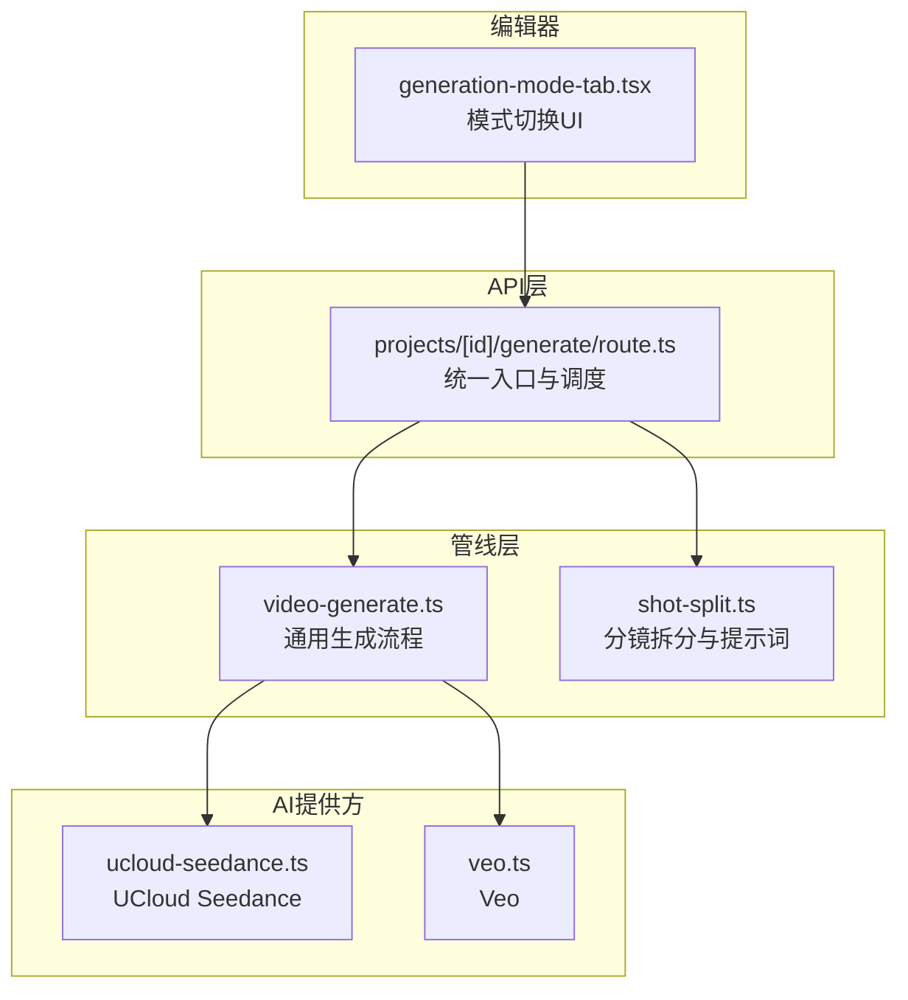
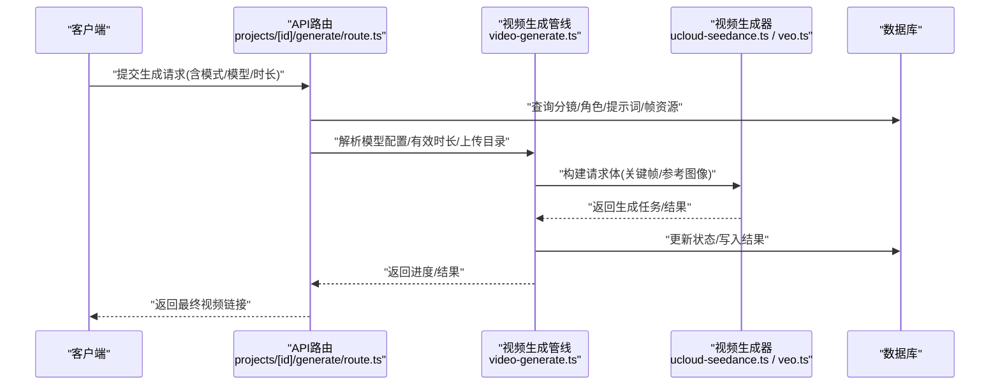
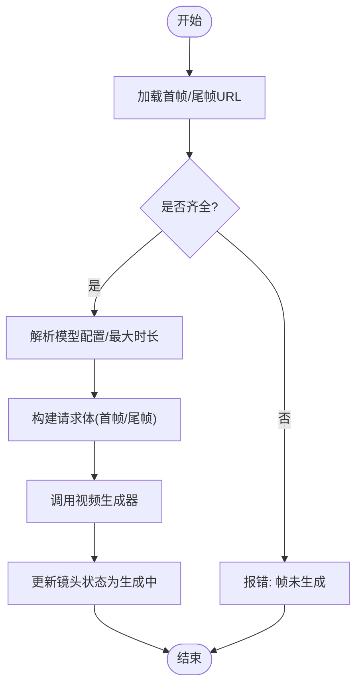
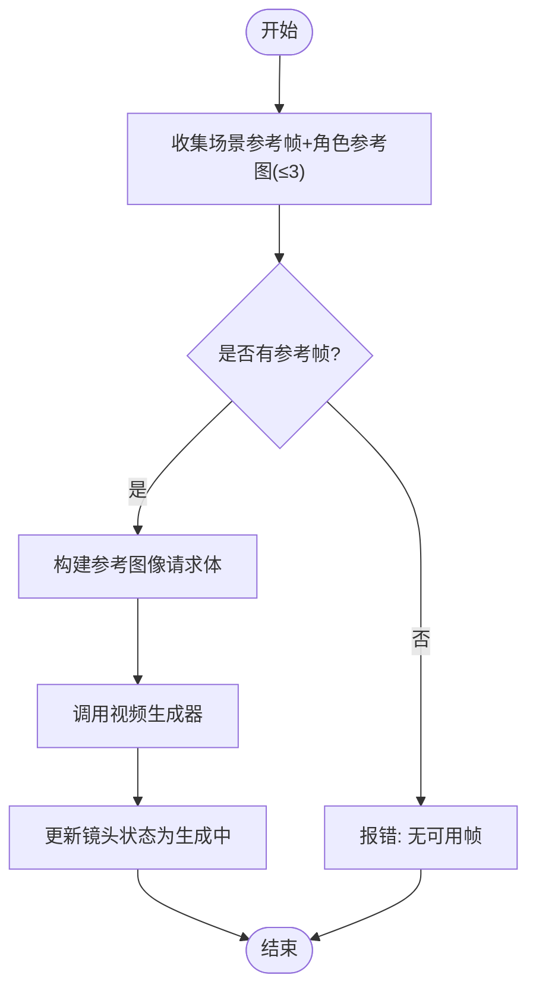
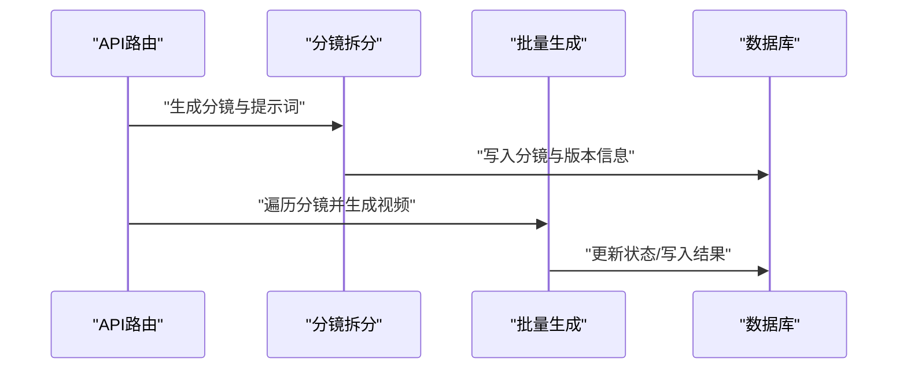
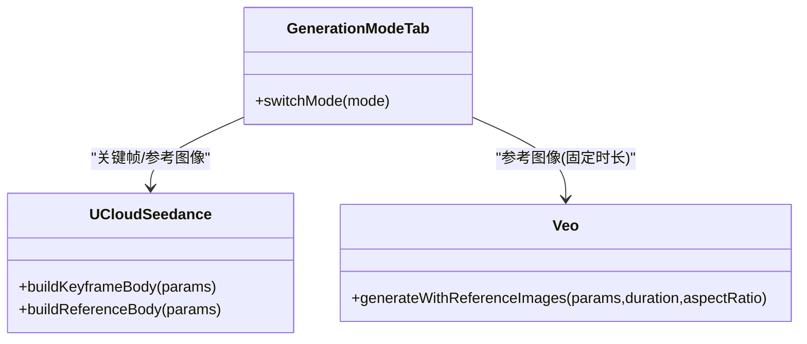
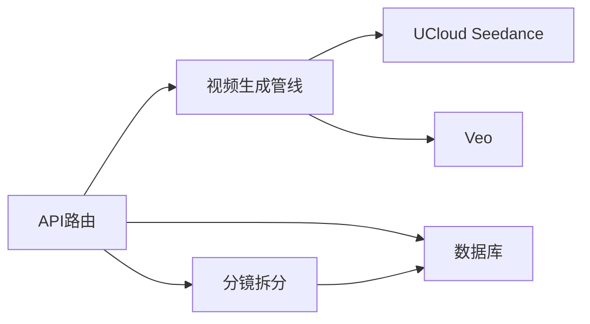

# 视频生成流程

<cite>
**本文引用的文件**
- [src/app/api/projects/[id]/generate/route.ts](file://src/app/api/projects/[id]/generate/route.ts)
- [src/lib/pipeline/video-generate.ts](file://src/lib/pipeline/video-generate.ts)
- [src/lib/ai/providers/ucloud-seedance.ts](file://src/lib/ai/providers/ucloud-seedance.ts)
- [src/lib/ai/providers/veo.ts](file://src/lib/ai/providers/veo.ts)
- [src/components/editor/generation-mode-tab.tsx](file://src/components/editor/generation-mode-tab.tsx)
- [src/lib/pipeline/shot-split.ts](file://src/lib/pipeline/shot-split.ts)
- [src/lib/ai/prompts/shot-split.ts](file://src/lib/ai/prompts/shot-split.ts)
</cite>

## 目录
1. [简介](#简介)
2. [项目结构](#项目结构)
3. [核心组件](#核心组件)
4. [架构总览](#架构总览)
5. [详细组件分析](#详细组件分析)
6. [依赖关系分析](#依赖关系分析)
7. [性能考虑](#性能考虑)
8. [故障排查指南](#故障排查指南)
9. [结论](#结论)
10. [附录](#附录)

## 简介
本文件面向AIComicBuilder的视频生成流程，系统性阐述从脚本到成品视频的完整管线：预处理（分镜拆分与提示词生成）、AI生成（关键帧/参考图像/混合模式）、后处理（结果写入与状态管理）。重点说明三种生成模式的工作原理与适用场景，梳理参数配置、质量控制与性能优化策略，并提供多平台视频生成器的集成与切换机制说明。

## 项目结构
视频生成相关代码主要分布在以下模块：
- API层：负责接收请求、调度任务、聚合结果
- 管线层：封装视频生成的通用逻辑（分辨率、时长、状态更新等）
- AI提供方：封装不同平台的视频生成接口（如UCloud Seedance、Veo）
- 编辑器UI：提供关键帧/参考模式切换入口
- 预处理：分镜拆分与提示词构建

图表来源
- [src/app/api/projects/[id]/generate/route.ts](file://src/app/api/projects/[id]/generate/route.ts#L1687-L3017)
- [src/lib/pipeline/video-generate.ts:27-64](file://src/lib/pipeline/video-generate.ts#L27-L64)
- [src/lib/ai/providers/ucloud-seedance.ts:99-140](file://src/lib/ai/providers/ucloud-seedance.ts#L99-L140)
- [src/lib/ai/providers/veo.ts:98-138](file://src/lib/ai/providers/veo.ts#L98-L138)
- [src/components/editor/generation-mode-tab.tsx:41-67](file://src/components/editor/generation-mode-tab.tsx#L41-L67)
- [src/lib/pipeline/shot-split.ts:40-71](file://src/lib/pipeline/shot-split.ts#L40-L71)

章节来源
- [src/app/api/projects/[id]/generate/route.ts](file://src/app/api/projects/[id]/generate/route.ts#L1687-L3017)
- [src/lib/pipeline/video-generate.ts:27-64](file://src/lib/pipeline/video-generate.ts#L27-L64)
- [src/lib/pipeline/shot-split.ts:40-71](file://src/lib/pipeline/shot-split.ts#L40-L71)

## 核心组件
- 统一生成入口与批处理调度：在API路由中实现单镜头同步生成、批量生成与分镜拆分流程，支持按项目/剧集维度进行版本化管理与状态更新。
- 通用视频生成管线：解析模型配置、计算有效时长、解析可用帧资源、选择视频提供方并执行生成，最后回写状态。
- 多平台视频生成器适配：分别封装UCloud Seedance与Veo的请求体构建与参数约束，屏蔽平台差异。
- 模式切换UI：提供关键帧与参考图像两种模式的可视化切换入口。
- 分镜拆分与提示词：基于项目/剧集元数据、角色关系、色彩板与目标时长，生成结构化的分镜列表与提示词模板。

章节来源
- [src/app/api/projects/[id]/generate/route.ts](file://src/app/api/projects/[id]/generate/route.ts#L1687-L3017)
- [src/lib/pipeline/video-generate.ts:27-64](file://src/lib/pipeline/video-generate.ts#L27-L64)
- [src/lib/ai/providers/ucloud-seedance.ts:99-140](file://src/lib/ai/providers/ucloud-seedance.ts#L99-L140)
- [src/lib/ai/providers/veo.ts:98-138](file://src/lib/ai/providers/veo.ts#L98-L138)
- [src/components/editor/generation-mode-tab.tsx:41-67](file://src/components/editor/generation-mode-tab.tsx#L41-L67)
- [src/lib/pipeline/shot-split.ts:40-71](file://src/lib/pipeline/shot-split.ts#L40-L71)

## 架构总览
下图展示从API到具体生成器的端到端调用链路，以及关键帧/参考图像两种模式的数据流差异。

图表来源
- [src/app/api/projects/[id]/generate/route.ts](file://src/app/api/projects/[id]/generate/route.ts#L1687-L3017)
- [src/lib/pipeline/video-generate.ts:27-64](file://src/lib/pipeline/video-generate.ts#L27-L64)
- [src/lib/ai/providers/ucloud-seedance.ts:99-140](file://src/lib/ai/providers/ucloud-seedance.ts#L99-L140)
- [src/lib/ai/providers/veo.ts:98-138](file://src/lib/ai/providers/veo.ts#L98-L138)

## 详细组件分析

### 生成模式与适用场景
- 关键帧模式（Keyframe）
  - 数据输入：首帧与尾帧图像（或场景参考帧）
  - 适用场景：强调动作过渡、时间连续性的片段；对时长要求灵活
  - 参数要点：首帧/尾帧提示词来自独立生成步骤；时长由模型最大时长与镜头时长共同决定
- 参考图像模式（Reference）
  - 数据输入：场景参考帧+角色参考图（最多3张），顺序有序以保证空间上下文
  - 适用场景：需要稳定构图与空间一致性、跨场景拼接（地面→天空）等复杂场景
  - 参数要点：Veo要求固定时长；Seedance在该模式下通过content数组携带多张图片
- 混合模式（Mixed）
  - 说明：当前代码未直接体现“混合模式”的专用分支，但可通过批处理时对不同镜头选择不同模式实现混合效果

章节来源
- [src/app/api/projects/[id]/generate/route.ts](file://src/app/api/projects/[id]/generate/route.ts#L2794-L2818)
- [src/app/api/projects/[id]/generate/route.ts](file://src/app/api/projects/[id]/generate/route.ts#L2991-L3017)
- [src/lib/ai/providers/veo.ts:101-138](file://src/lib/ai/providers/veo.ts#L101-L138)
- [src/lib/ai/providers/ucloud-seedance.ts:102-140](file://src/lib/ai/providers/ucloud-seedance.ts#L102-L140)

### 关键帧模式工作流
关键帧模式以首尾帧作为视觉锚点，结合提示词描述过渡过程。流程要点：
- 从资产表读取首帧/尾帧URL，若缺失则报错
- 解析模型最大时长与镜头时长，取较小值作为有效时长
- 构建请求体时，将首帧与尾帧以特定role注入（Seedance）
- 调用对应生成器完成异步任务并回写状态

图表来源
- [src/lib/pipeline/video-generate.ts:27-64](file://src/lib/pipeline/video-generate.ts#L27-L64)
- [src/lib/ai/providers/ucloud-seedance.ts:102-131](file://src/lib/ai/providers/ucloud-seedance.ts#L102-L131)

章节来源
- [src/lib/pipeline/video-generate.ts:27-64](file://src/lib/pipeline/video-generate.ts#L27-L64)
- [src/lib/ai/providers/ucloud-seedance.ts:102-131](file://src/lib/ai/providers/ucloud-seedance.ts#L102-L131)

### 参考图像模式工作流
参考图像模式以场景参考帧与角色参考图为输入，强调空间一致性与风格稳定性：
- 收集场景参考帧与角色参考图（最多3张），按序列排序
- Veo模式下强制固定时长；Seedance模式下将多张图片打包进content数组
- 调用生成器并回写结果

图表来源
- [src/app/api/projects/[id]/generate/route.ts](file://src/app/api/projects/[id]/generate/route.ts#L2794-L2818)
- [src/lib/ai/providers/veo.ts:101-138](file://src/lib/ai/providers/veo.ts#L101-L138)
- [src/lib/ai/providers/ucloud-seedance.ts:133-140](file://src/lib/ai/providers/ucloud-seedance.ts#L133-L140)

章节来源
- [src/app/api/projects/[id]/generate/route.ts](file://src/app/api/projects/[id]/generate/route.ts#L2794-L2818)
- [src/lib/ai/providers/veo.ts:101-138](file://src/lib/ai/providers/veo.ts#L101-L138)
- [src/lib/ai/providers/ucloud-seedance.ts:133-140](file://src/lib/ai/providers/ucloud-seedance.ts#L133-L140)

### 批量生成与分镜拆分
- 分镜拆分：根据项目/剧集元数据、角色关系、色彩板与目标时长，生成结构化分镜列表与提示词模板
- 批量生成：对每个镜头选择模式（关键帧/参考图像），并行或串行执行生成
- 版本化：为每次生成创建版本记录，便于回溯与对比

图表来源
- [src/lib/pipeline/shot-split.ts:40-71](file://src/lib/pipeline/shot-split.ts#L40-L71)
- [src/app/api/projects/[id]/generate/route.ts](file://src/app/api/projects/[id]/generate/route.ts#L1233-L1279)
- [src/app/api/projects/[id]/generate/route.ts](file://src/app/api/projects/[id]/generate/route.ts#L2991-L3017)

章节来源
- [src/lib/pipeline/shot-split.ts:40-71](file://src/lib/pipeline/shot-split.ts#L40-L71)
- [src/app/api/projects/[id]/generate/route.ts](file://src/app/api/projects/[id]/generate/route.ts#L1233-L1279)
- [src/app/api/projects/[id]/generate/route.ts](file://src/app/api/projects/[id]/generate/route.ts#L2991-L3017)

### 多平台视频生成器集成与切换
- 切换入口：编辑器提供关键帧/参考图像模式按钮，用户可直观切换
- 平台适配：不同生成器对参数有差异化约束（如Veo的固定时长、Seedance的content结构）
- 上传目录：根据版本化上传目录动态解析生成器的存储位置

图表来源
- [src/components/editor/generation-mode-tab.tsx:41-67](file://src/components/editor/generation-mode-tab.tsx#L41-L67)
- [src/lib/ai/providers/ucloud-seedance.ts:99-140](file://src/lib/ai/providers/ucloud-seedance.ts#L99-L140)
- [src/lib/ai/providers/veo.ts:98-138](file://src/lib/ai/providers/veo.ts#L98-L138)

章节来源
- [src/components/editor/generation-mode-tab.tsx:41-67](file://src/components/editor/generation-mode-tab.tsx#L41-L67)
- [src/lib/ai/providers/ucloud-seedance.ts:99-140](file://src/lib/ai/providers/ucloud-seedance.ts#L99-L140)
- [src/lib/ai/providers/veo.ts:98-138](file://src/lib/ai/providers/veo.ts#L98-L138)

## 依赖关系分析
- API路由依赖管线层与AI提供方实现，同时与数据库交互以读取/写入状态
- 管线层依赖模型配置解析与上传目录解析，确保生成器调用正确
- AI提供方内部封装平台差异，对外暴露统一的生成接口
- 编辑器UI仅负责模式切换，不直接参与生成逻辑

图表来源
- [src/app/api/projects/[id]/generate/route.ts](file://src/app/api/projects/[id]/generate/route.ts#L1687-L3017)
- [src/lib/pipeline/video-generate.ts:27-64](file://src/lib/pipeline/video-generate.ts#L27-L64)
- [src/lib/pipeline/shot-split.ts:40-71](file://src/lib/pipeline/shot-split.ts#L40-L71)
- [src/lib/ai/providers/ucloud-seedance.ts:99-140](file://src/lib/ai/providers/ucloud-seedance.ts#L99-L140)
- [src/lib/ai/providers/veo.ts:98-138](file://src/lib/ai/providers/veo.ts#L98-L138)

章节来源
- [src/app/api/projects/[id]/generate/route.ts](file://src/app/api/projects/[id]/generate/route.ts#L1687-L3017)
- [src/lib/pipeline/video-generate.ts:27-64](file://src/lib/pipeline/video-generate.ts#L27-L64)
- [src/lib/pipeline/shot-split.ts:40-71](file://src/lib/pipeline/shot-split.ts#L40-L71)

## 性能考虑
- 时长控制：以镜头时长与模型最大时长的最小值作为有效时长，避免超时或截断
- 并发与批处理：批量生成时可并行处理多个镜头，提升吞吐
- 资源复用：优先使用已生成的首帧/尾帧/参考帧，减少重复计算
- 存储与版本：版本化上传目录便于缓存命中与回滚

章节来源
- [src/lib/pipeline/video-generate.ts:53-55](file://src/lib/pipeline/video-generate.ts#L53-L55)
- [src/app/api/projects/[id]/generate/route.ts](file://src/app/api/projects/[id]/generate/route.ts#L2991-L3017)

## 故障排查指南
- 帧资源缺失：若首帧/尾帧或场景参考帧为空，将直接报错提示先生成帧资源
- 模型不支持：检查模型最大时长与请求时长是否匹配；Veo参考图像模式需遵循固定时长
- 提示词问题：确认分镜拆分阶段生成的提示词是否正确写入资产表
- 权限与目录：确保版本化上传目录存在且具备写权限

章节来源
- [src/lib/pipeline/video-generate.ts:38-43](file://src/lib/pipeline/video-generate.ts#L38-L43)
- [src/lib/ai/providers/veo.ts:101-138](file://src/lib/ai/providers/veo.ts#L101-L138)
- [src/lib/pipeline/shot-split.ts:40-71](file://src/lib/pipeline/shot-split.ts#L40-L71)

## 结论
AIComicBuilder的视频生成流程以API路由为核心，串联起分镜拆分、关键帧/参考图像模式的AI生成与状态管理。通过多平台生成器的抽象与模式切换UI，用户可在不同场景下灵活选择最优生成策略。建议在生产环境中结合时长控制、并发批处理与版本化存储，持续优化生成效率与质量。

## 附录

### 参数配置清单（摘要）
- 模式：关键帧/参考图像
- 模型：视频模型ID、分辨率、时长、宽高比
- 资源：首帧/尾帧URL、场景参考帧、角色参考图
- 其他：水印开关、音频生成开关（Seedance-2）

章节来源
- [src/lib/ai/providers/ucloud-seedance.ts:102-140](file://src/lib/ai/providers/ucloud-seedance.ts#L102-L140)
- [src/lib/ai/providers/veo.ts:101-138](file://src/lib/ai/providers/veo.ts#L101-L138)

### 实际生成示例与参数调优建议
- 示例A：关键帧模式（短时长过渡）
  - 输入：首帧/尾帧图像 + 动作描述提示词
  - 时长：根据镜头内容设置，不超过模型最大时长
  - 输出：连贯的动作过渡视频
- 示例B：参考图像模式（复杂场景）
  - 输入：场景参考帧 + 角色参考图（≤3张）
  - 时长：Veo固定8秒；Seedance按模型支持设置
  - 输出：构图稳定、风格一致的视频
- 调优建议：
  - 关键帧模式：优先保证首尾帧语义清晰；时长越短越利于细节保留
  - 参考图像模式：角色参考图数量不宜过多，避免干扰场景主导元素

章节来源
- [src/app/api/projects/[id]/generate/route.ts](file://src/app/api/projects/[id]/generate/route.ts#L2794-L2818)
- [src/lib/ai/providers/veo.ts:101-138](file://src/lib/ai/providers/veo.ts#L101-L138)
- [src/lib/ai/providers/ucloud-seedance.ts:102-140](file://src/lib/ai/providers/ucloud-seedance.ts#L102-L140)