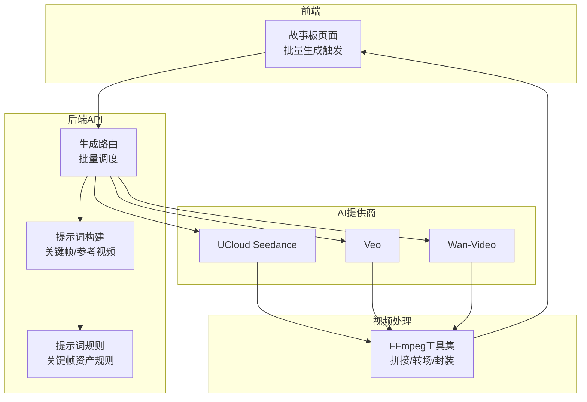
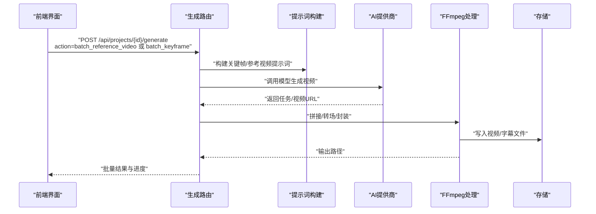
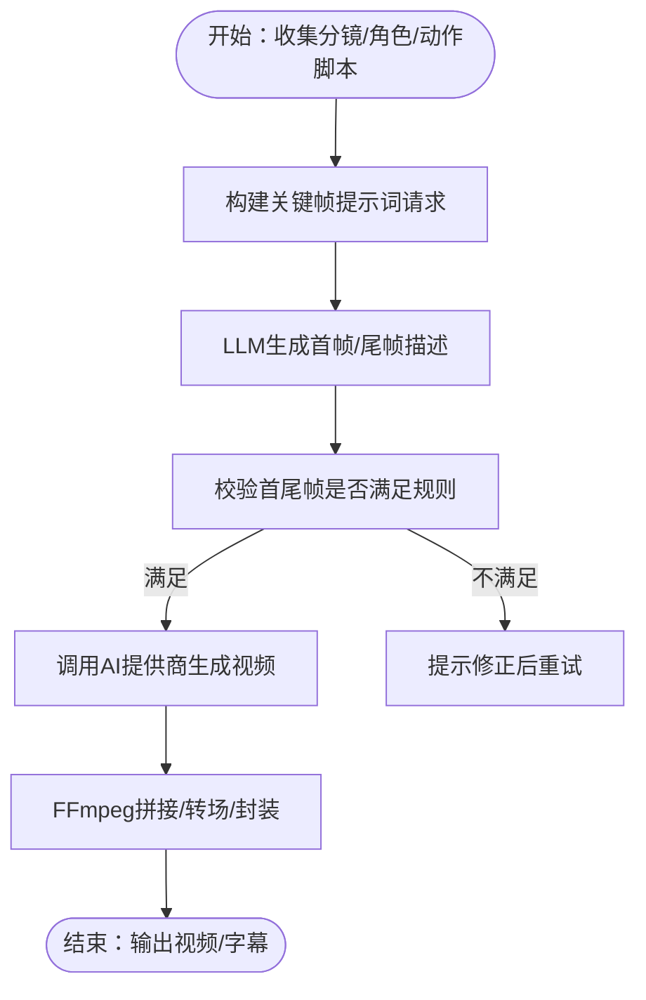
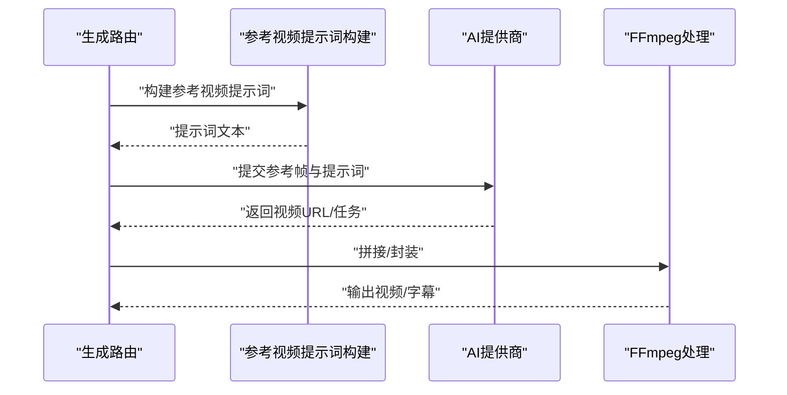
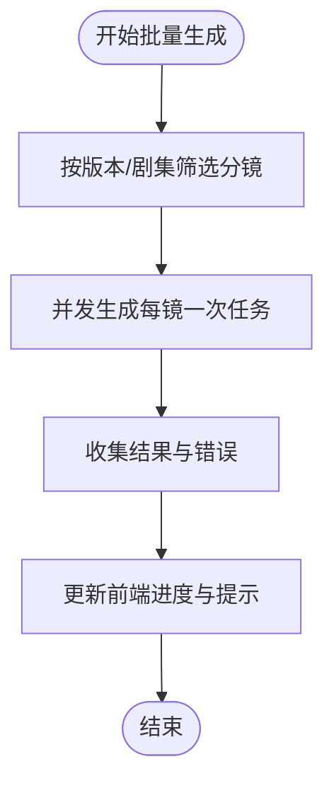
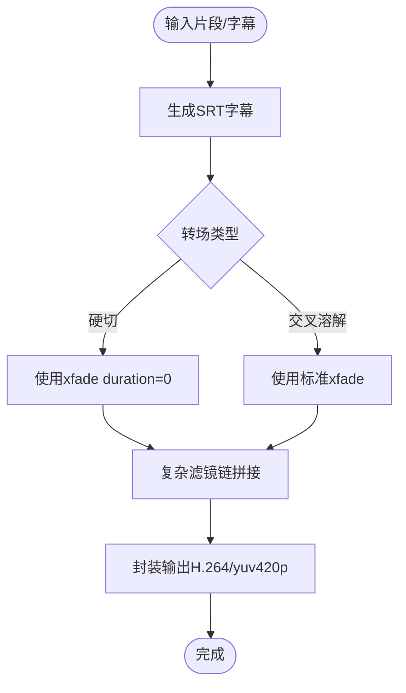
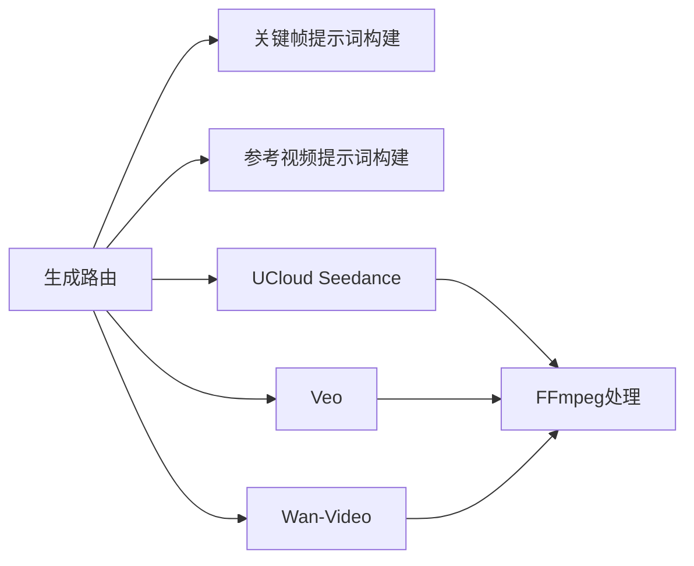

# 视频生成系统

<cite>
**本文引用的文件**
- [ffmpeg.ts](file://src/lib/video/ffmpeg.ts)
- [ucloud-seedance.ts](file://src/lib/ai/providers/ucloud-seedance.ts)
- [veo.ts](file://src/lib/ai/providers/veo.ts)
- [wan-video.ts](file://src/lib/ai/providers/wan-video.ts)
- [registry.ts](file://src/lib/ai/prompts/registry.ts)
- [keyframe-prompts.ts](file://src/lib/ai/prompts/keyframe-prompts.ts)
- [route.ts](file://src/app/api/projects/[id]/generate/route.ts)
- [page.tsx](file://src/app/[locale]/project/[id]/episodes/[episodeId]/storyboard/page.tsx)
- [ai-optimize-button.tsx](file://src/components/editor/ai-optimize-button.tsx)
- [kling_video.py](file://scripts/kling_video.py)
</cite>

## 目录
1. [简介](#简介)
2. [项目结构](#项目结构)
3. [核心组件](#核心组件)
4. [架构总览](#架构总览)
5. [详细组件分析](#详细组件分析)
6. [依赖关系分析](#依赖关系分析)
7. [性能考虑](#性能考虑)
8. [故障排除指南](#故障排除指南)
9. [结论](#结论)
10. [附录](#附录)

## 简介
本文件面向AIComicBuilder的视频生成系统，系统支持多种视频生成模式：关键帧模式（首尾帧驱动）、参考图像模式（场景参考帧集合）以及批量处理机制。系统通过统一的生成调度接口协调AI模型提供商（如UCloud Seedance、Veo、Wan-Video等）与本地FFmpeg处理管线，完成从提示词到最终视频的完整流水线。本文档覆盖视频生成流程、关键帧插值与动作合成、风格迁移与参考图像融合、视频处理管道与格式转换、FFmpeg集成与编解码优化、多平台AI模型适配与使用建议、实际使用示例与故障排除。

## 项目结构
视频生成相关代码主要分布在以下模块：
- AI模型提供商层：封装不同平台的视频生成API请求与参数构建逻辑
- 提示词与规则层：定义关键帧与参考视频的提示词模板与约束规则
- 生成调度层：统一的API路由，负责批量生成、并发控制与结果汇总
- 视频处理层：基于FFmpeg的拼接、转场、字幕与封装流程
- 前端交互层：批量生成按钮与进度反馈

图表来源
- [route.ts](file://src/app/api/projects/[id]/generate/route.ts)
- [keyframe-prompts.ts](file://src/lib/ai/prompts/keyframe-prompts.ts)
- [registry.ts](file://src/lib/ai/prompts/registry.ts)
- [ucloud-seedance.ts](file://src/lib/ai/providers/ucloud-seedance.ts)
- [veo.ts](file://src/lib/ai/providers/veo.ts)
- [wan-video.ts](file://src/lib/ai/providers/wan-video.ts)
- [ffmpeg.ts](file://src/lib/video/ffmpeg.ts)

章节来源
- [route.ts](file://src/app/api/projects/[id]/generate/route.ts)
- [ffmpeg.ts](file://src/lib/video/ffmpeg.ts)

## 核心组件
- 关键帧模式（首尾帧驱动）
  - 使用首帧与尾帧作为动作起止状态，结合动作脚本与镜头运动描述，由AI模型进行中间帧插值与动作合成。
  - 关键帧资产规则明确首尾帧需共享同一场景环境、避免运动模糊态，并与后续镜头衔接。
- 参考图像模式（场景参考帧集合）
  - 使用一组场景参考帧（可含场景锚定帧）作为风格与构图参考，由AI模型在提示词引导下进行风格迁移与动作合成。
- 批量处理机制
  - 后端API支持按版本或剧集批量生成，采用并发策略提升吞吐，失败项单独统计与反馈。
- FFmpeg处理管线
  - 支持标题卡生成、字幕SRT生成、多片段拼接、硬切与交叉溶解等转场、最终封装输出。

章节来源
- [keyframe-prompts.ts](file://src/lib/ai/prompts/keyframe-prompts.ts)
- [registry.ts](file://src/lib/ai/prompts/registry.ts)
- [route.ts](file://src/app/api/projects/[id]/generate/route.ts)
- [ffmpeg.ts](file://src/lib/video/ffmpeg.ts)

## 架构总览
整体流程从UI触发批量生成开始，后端API根据生成模式选择提示词构建策略，调用对应AI提供商接口生成视频，随后进入FFmpeg处理阶段完成拼接与封装。

图表来源
- [route.ts](file://src/app/api/projects/[id]/generate/route.ts)
- [keyframe-prompts.ts](file://src/lib/ai/prompts/keyframe-prompts.ts)
- [ucloud-seedance.ts](file://src/lib/ai/providers/ucloud-seedance.ts)
- [veo.ts](file://src/lib/ai/providers/veo.ts)
- [wan-video.ts](file://src/lib/ai/providers/wan-video.ts)
- [ffmpeg.ts](file://src/lib/video/ffmpeg.ts)

## 详细组件分析

### 关键帧模式实现
- 提示词构建
  - 基于分镜序列、角色信息与动作脚本，生成面向关键帧资产的提示词请求，供LLM生成首帧与尾帧描述。
- 资产规则
  - 明确首尾帧需描述稳定的起止时刻、共享场景环境、避免运动模糊态，并与后续镜头衔接。
- AI提供商适配
  - 不同提供商对首尾帧的支持程度不同，系统在调用前进行能力判断与参数构建（例如某些模型仅支持首帧或首尾帧）。

图表来源
- [keyframe-prompts.ts](file://src/lib/ai/prompts/keyframe-prompts.ts)
- [registry.ts](file://src/lib/ai/prompts/registry.ts)
- [route.ts](file://src/app/api/projects/[id]/generate/route.ts)
- [ucloud-seedance.ts](file://src/lib/ai/providers/ucloud-seedance.ts)
- [veo.ts](file://src/lib/ai/providers/veo.ts)
- [wan-video.ts](file://src/lib/ai/providers/wan-video.ts)
- [ffmpeg.ts](file://src/lib/video/ffmpeg.ts)

章节来源
- [keyframe-prompts.ts](file://src/lib/ai/prompts/keyframe-prompts.ts)
- [registry.ts](file://src/lib/ai/prompts/registry.ts)
- [route.ts](file://src/app/api/projects/[id]/generate/route.ts)

### 参考图像模式
- 场景参考帧集合
  - 以一组有序的场景参考帧作为风格与构图参考，必要时可加入场景锚定帧。
- 提示词生成
  - 结合动作脚本、镜头运动、角色与对话信息，生成参考视频提示词；若视觉提示失败则回退到静态提示词模板。
- AI提供商适配
  - 部分模型支持“参考图像”专用接口，另一些模型需要将参考图像作为首帧输入进行图像到视频生成。

图表来源
- [route.ts](file://src/app/api/projects/[id]/generate/route.ts)
- [ucloud-seedance.ts](file://src/lib/ai/providers/ucloud-seedance.ts)
- [veo.ts](file://src/lib/ai/providers/veo.ts)
- [wan-video.ts](file://src/lib/ai/providers/wan-video.ts)
- [ffmpeg.ts](file://src/lib/video/ffmpeg.ts)

章节来源
- [route.ts](file://src/app/api/projects/[id]/generate/route.ts)

### 批量处理机制
- 并发策略
  - 对每个分镜发起一次LLM调用或视频生成任务，全部并发执行，完成后汇总结果与失败项。
- 进度与反馈
  - 前端通过批量生成按钮触发，接收结果数组，统计成功/失败数量并给出Toast提示。
- 版本与剧集维度
  - 支持按版本或剧集筛选目标分镜，确保批量范围可控。

图表来源
- [page.tsx](file://src/app/[locale]/project/[id]/episodes/[episodeId]/storyboard/page.tsx)
- [route.ts](file://src/app/api/projects/[id]/generate/route.ts)

章节来源
- [page.tsx](file://src/app/[locale]/project/[id]/episodes/[episodeId]/storyboard/page.tsx)
- [route.ts](file://src/app/api/projects/[id]/generate/route.ts)

### FFmpeg处理与质量优化
- 标题卡生成
  - 使用纯色背景与drawtext滤镜生成标题视频，支持字体大小、背景色与文字颜色配置。
- 字幕SRT生成
  - 根据分镜时长计算起始时间，生成SRT字幕文件，便于后续封装。
- 多片段拼接
  - 支持硬切与交叉溶解（xfade）混合转场，自动构建复杂滤镜链。
- 封装与编码
  - 默认使用H.264编码、libx264预设与CRF质量控制，像素格式统一为yuv420p，音频可选关闭。

图表来源
- [ffmpeg.ts](file://src/lib/video/ffmpeg.ts)

章节来源
- [ffmpeg.ts](file://src/lib/video/ffmpeg.ts)

### 多平台AI模型适配
- UCloud Seedance
  - 支持首帧与尾帧输入，参数包含分辨率、宽高比、时长与水印开关；部分版本支持自动生成音频。
- Veo
  - 支持参考图像与图像到视频两种模式；对3.0版本不支持尾帧输入；根据模型版本选择参考图像API或首帧输入。
- Wan-Video
  - 2.7版本支持媒体数组输入（首帧/尾帧/参考图像），其他版本使用首帧URL输入；参数包含分辨率、宽高比与时长。

章节来源
- [ucloud-seedance.ts](file://src/lib/ai/providers/ucloud-seedance.ts)
- [veo.ts](file://src/lib/ai/providers/veo.ts)
- [wan-video.ts](file://src/lib/ai/providers/wan-video.ts)

### 实际使用示例
- 关键帧模式
  - 在分镜中设置动作脚本与镜头运动描述，系统生成首帧与尾帧提示词，提交至AI提供商进行插值生成。
- 参考图像模式
  - 准备场景参考帧集合，系统生成参考视频提示词并提交至AI提供商，得到风格迁移与动作合成后的视频。
- 批量生成
  - 在故事板页面点击批量生成按钮，选择比例与覆盖选项，系统并发生成所有分镜并反馈结果。

章节来源
- [page.tsx](file://src/app/[locale]/project/[id]/episodes/[episodeId]/storyboard/page.tsx)
- [route.ts](file://src/app/api/projects/[id]/generate/route.ts)

## 依赖关系分析
- 组件耦合
  - 生成路由依赖提示词构建与AI提供商；AI提供商与FFmpeg处理相互独立但共同被生成路由调度。
- 外部依赖
  - FFmpeg用于视频处理；各AI提供商SDK用于视频生成；数据库与存储用于持久化中间产物与元数据。
- 并发与稳定性
  - 批量生成采用Promise.allSettled保证部分失败不影响整体流程；错误项单独统计与上报。

图表来源
- [route.ts](file://src/app/api/projects/[id]/generate/route.ts)
- [keyframe-prompts.ts](file://src/lib/ai/prompts/keyframe-prompts.ts)
- [ucloud-seedance.ts](file://src/lib/ai/providers/ucloud-seedance.ts)
- [veo.ts](file://src/lib/ai/providers/veo.ts)
- [wan-video.ts](file://src/lib/ai/providers/wan-video.ts)
- [ffmpeg.ts](file://src/lib/video/ffmpeg.ts)

章节来源
- [route.ts](file://src/app/api/projects/[id]/generate/route.ts)

## 性能考虑
- 并发策略
  - 分镜级并发生成可显著缩短总耗时，但需注意AI提供商速率限制与资源占用上限。
- 编码参数
  - H.264 + yuv420p具有良好的兼容性；CRF质量控制可在体积与画质间取得平衡；必要时可调整预设与码率。
- 转场开销
  - xfade滤镜链会增加处理时间，建议在批量生成时合理选择转场类型与时长。
- 存储与I/O
  - 批量生成会产生大量中间视频与字幕文件，建议使用SSD与合适的临时目录以减少I/O瓶颈。

## 故障排除指南
- 关键帧提示词不符合规则
  - 现象：首尾帧无法作为下一镜头起始参考或场景不一致。
  - 处理：依据关键帧资产规则修正首尾帧描述与动作脚本，确保场景环境一致且无运动模糊。
- AI提供商报错
  - Veo：3.0版本不支持尾帧输入；请确认模型版本或改为仅使用首帧。
  - Wan-Video：非2.7版本需使用首帧URL输入；检查模型与参数。
- 批量生成失败
  - 现象：部分分镜生成失败。
  - 处理：查看失败分镜ID并重试；检查网络与模型可用性；适当降低并发度。
- FFmpeg拼接失败
  - 现象：转场或封装阶段报错。
  - 处理：确认输入片段时长与格式一致；检查滤镜链拼接参数；验证输出路径权限。

章节来源
- [registry.ts](file://src/lib/ai/prompts/registry.ts)
- [veo.ts](file://src/lib/ai/providers/veo.ts)
- [wan-video.ts](file://src/lib/ai/providers/wan-video.ts)
- [route.ts](file://src/app/api/projects/[id]/generate/route.ts)
- [ffmpeg.ts](file://src/lib/video/ffmpeg.ts)

## 结论
AIComicBuilder的视频生成系统通过统一的生成调度与提示词规则，实现了关键帧插值、风格迁移与动作合成的多样化输出。配合FFmpeg的高效处理与多平台AI提供商适配，系统在易用性与扩展性上具备良好表现。建议在生产环境中结合并发策略、编码参数与存储规划进行持续优化，并建立完善的监控与重试机制以提升稳定性。

## 附录
- 多平台脚本参考
  - 项目包含Kling视频生成脚本，可用于特定平台的视频生成流程补充与自动化集成。

章节来源
- [kling_video.py](file://scripts/kling_video.py)