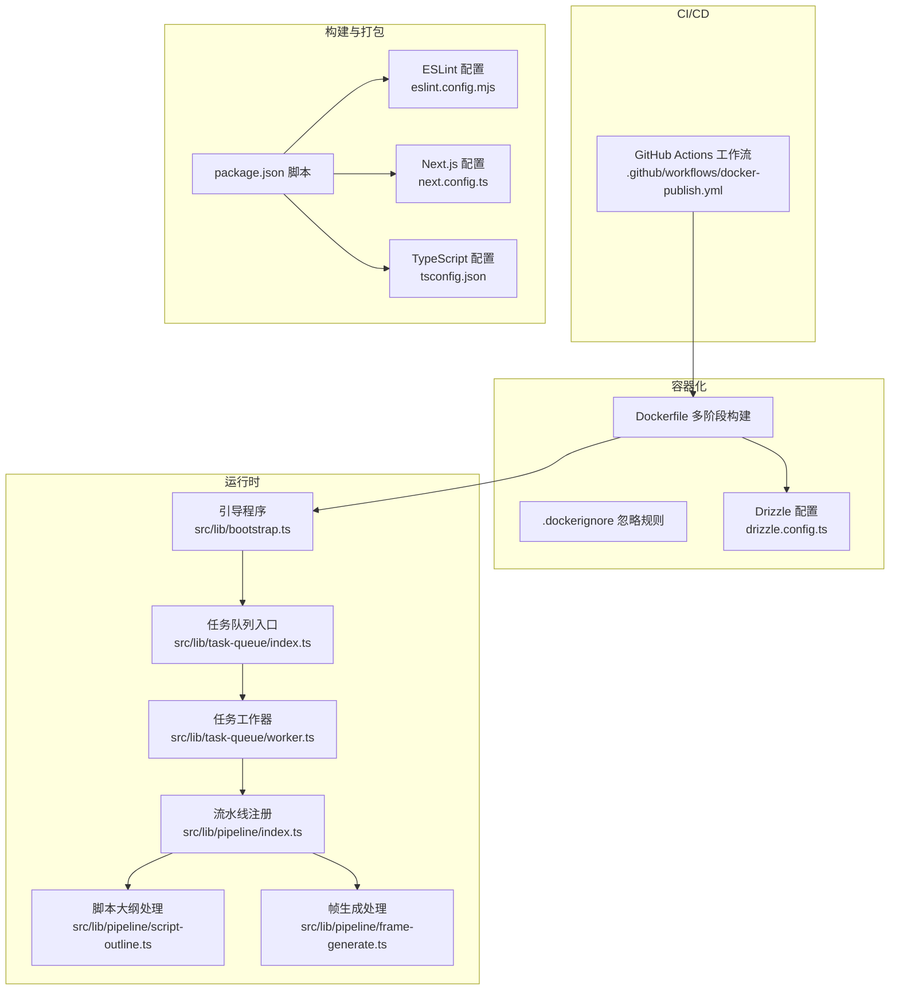
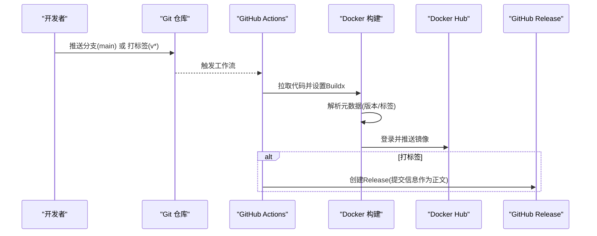
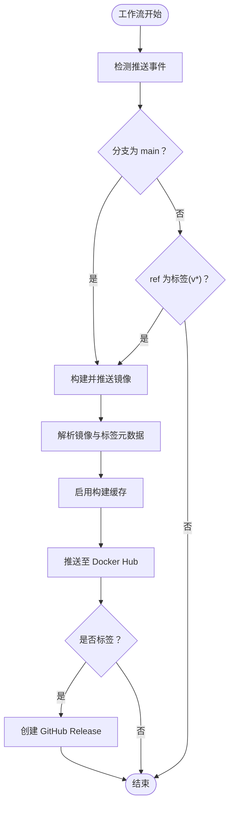
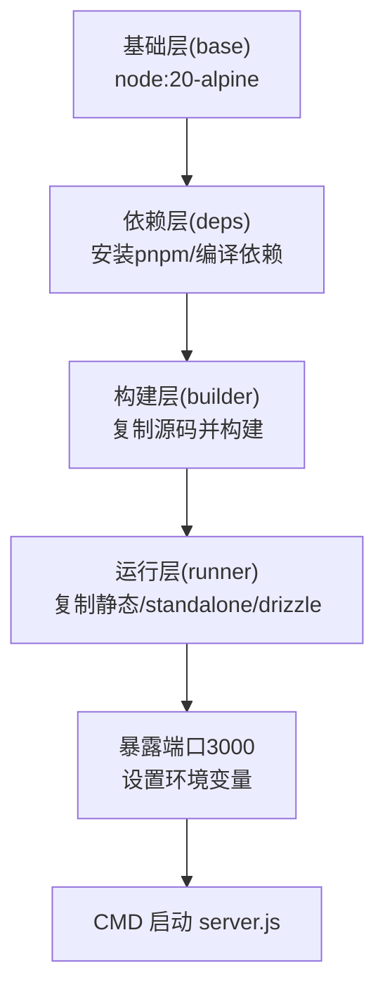
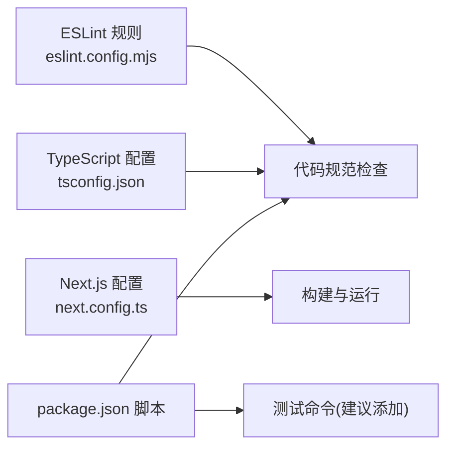
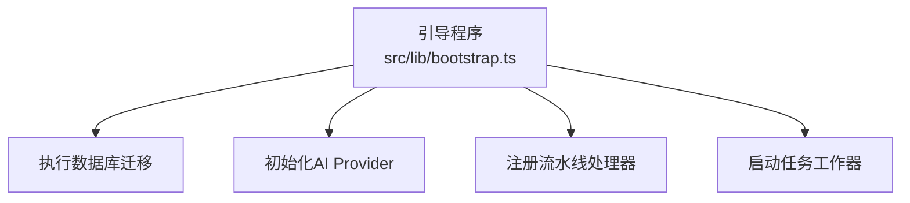
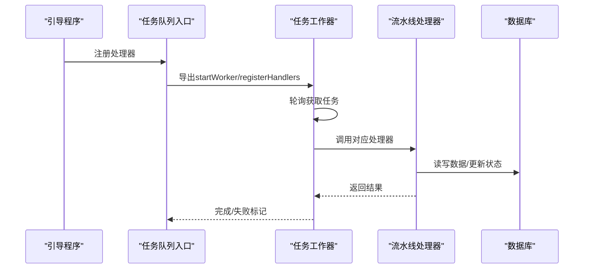
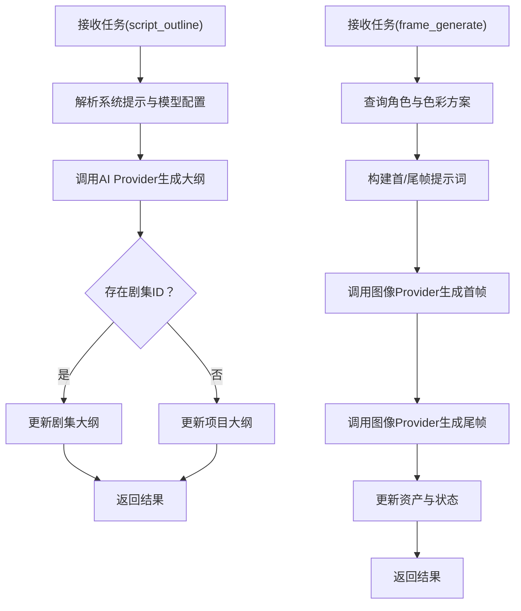
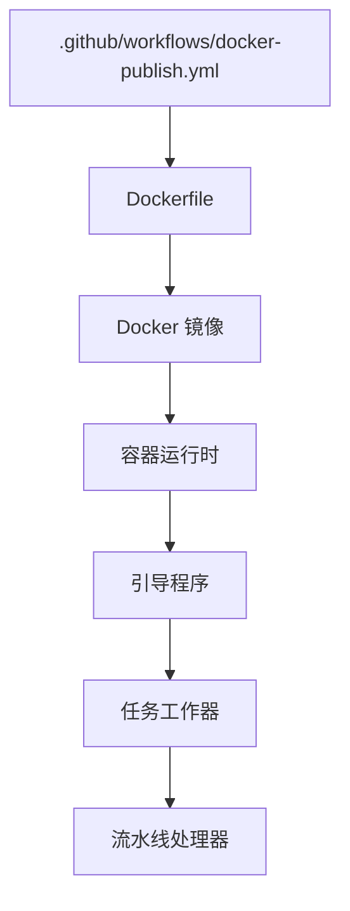

# CI/CD流水线

<cite>
**本文档引用的文件**
- [.github/workflows/docker-publish.yml](file://.github/workflows/docker-publish.yml)
- [Dockerfile](file://Dockerfile)
- [.dockerignore](file://.dockerignore)
- [package.json](file://package.json)
- [eslint.config.mjs](file://eslint.config.mjs)
- [next.config.ts](file://next.config.ts)
- [tsconfig.json](file://tsconfig.json)
- [drizzle.config.ts](file://drizzle.config.ts)
- [src/lib/bootstrap.ts](file://src/lib/bootstrap.ts)
- [src/lib/task-queue/index.ts](file://src/lib/task-queue/index.ts)
- [src/lib/task-queue/worker.ts](file://src/lib/task-queue/worker.ts)
- [src/lib/pipeline/index.ts](file://src/lib/pipeline/index.ts)
- [src/lib/pipeline/script-outline.ts](file://src/lib/pipeline/script-outline.ts)
- [src/lib/pipeline/frame-generate.ts](file://src/lib/pipeline/frame-generate.ts)
</cite>

## 目录
1. [简介](#简介)
2. [项目结构](#项目结构)
3. [核心组件](#核心组件)
4. [架构总览](#架构总览)
5. [详细组件分析](#详细组件分析)
6. [依赖关系分析](#依赖关系分析)
7. [性能考虑](#性能考虑)
8. [故障排查指南](#故障排查指南)
9. [结论](#结论)
10. [附录](#附录)

## 简介
本指南面向AIComicBuilder项目的持续集成与持续部署（CI/CD），围绕GitHub Actions工作流、构建触发条件与分支策略、自动化测试与代码质量检查、安全扫描、镜像构建与推送、版本标签管理、发布流程与回滚策略、以及流水线监控与日志分析进行系统化说明。文档同时结合仓库现有配置文件与核心业务逻辑，给出可操作的实施建议与最佳实践。

## 项目结构
AIComicBuilder采用前后端一体化的Next.js应用，配合任务队列与多阶段Docker构建，支持容器化部署与自动化发布。关键目录与文件如下：
- GitHub Actions工作流：用于自动化构建与发布
- Docker相关：Dockerfile、.dockerignore定义镜像构建与忽略规则
- 构建与质量：package.json脚本、ESLint配置、Next.js与TypeScript配置
- 数据库：Drizzle配置与迁移目录
- 核心运行时：引导程序、任务队列与视频生成流水线

图表来源
- [.github/workflows/docker-publish.yml:1-54](file://.github/workflows/docker-publish.yml#L1-L54)
- [Dockerfile:1-41](file://Dockerfile#L1-L41)
- [package.json:1-60](file://package.json#L1-L60)
- [eslint.config.mjs:1-19](file://eslint.config.mjs#L1-L19)
- [next.config.ts:1-16](file://next.config.ts#L1-L16)
- [tsconfig.json:1-35](file://tsconfig.json#L1-L35)
- [drizzle.config.ts:1-11](file://drizzle.config.ts#L1-L11)
- [src/lib/bootstrap.ts:1-26](file://src/lib/bootstrap.ts#L1-L26)
- [src/lib/task-queue/index.ts:1-4](file://src/lib/task-queue/index.ts#L1-L4)
- [src/lib/task-queue/worker.ts:1-57](file://src/lib/task-queue/worker.ts#L1-L57)
- [src/lib/pipeline/index.ts:1-23](file://src/lib/pipeline/index.ts#L1-L23)
- [src/lib/pipeline/script-outline.ts:1-48](file://src/lib/pipeline/script-outline.ts#L1-L48)
- [src/lib/pipeline/frame-generate.ts:1-233](file://src/lib/pipeline/frame-generate.ts#L1-L233)

章节来源
- [.github/workflows/docker-publish.yml:1-54](file://.github/workflows/docker-publish.yml#L1-L54)
- [Dockerfile:1-41](file://Dockerfile#L1-L41)
- [package.json:1-60](file://package.json#L1-L60)

## 核心组件
- GitHub Actions工作流：定义在push到main分支或打标签（v*）时触发，执行Docker镜像构建、推送与发布创建。
- Docker镜像：基于多阶段构建，安装ffmpeg与中文字体，使用pnpm安装依赖并构建Next.js应用，最终以standalone输出。
- 引导程序与任务队列：启动时执行数据库迁移、初始化AI Provider、注册流水线处理器，并启动任务工作器轮询执行。
- 流水线处理：注册脚本大纲、解析、角色提取、角色图像、分镜拆分、帧生成、视频生成与拼接等处理函数。

章节来源
- [.github/workflows/docker-publish.yml:1-54](file://.github/workflows/docker-publish.yml#L1-L54)
- [Dockerfile:1-41](file://Dockerfile#L1-L41)
- [src/lib/bootstrap.ts:1-26](file://src/lib/bootstrap.ts#L1-L26)
- [src/lib/task-queue/index.ts:1-4](file://src/lib/task-queue/index.ts#L1-L4)
- [src/lib/pipeline/index.ts:1-23](file://src/lib/pipeline/index.ts#L1-L23)

## 架构总览
下图展示从代码提交到镜像发布与版本标签的端到端流程，映射到实际工作流与构建配置：

图表来源
- [.github/workflows/docker-publish.yml:3-54](file://.github/workflows/docker-publish.yml#L3-L54)
- [Dockerfile:1-41](file://Dockerfile#L1-L41)

## 详细组件分析

### GitHub Actions工作流
- 触发条件
  - 分支：main
  - 标签：以v开头的语义化版本标签
- 权限：写入内容与包权限
- 步骤概览
  - 检出代码
  - 设置Docker Buildx
  - 登录Docker Hub（凭据来自secrets）
  - 元数据解析：镜像名、标签（latest、语义化版本、主次版本）
  - 构建并推送：启用缓存（gha）
  - 发布：当为标签时创建Release，正文为提交信息

图表来源
- [.github/workflows/docker-publish.yml:3-54](file://.github/workflows/docker-publish.yml#L3-L54)

章节来源
- [.github/workflows/docker-publish.yml:1-54](file://.github/workflows/docker-publish.yml#L1-L54)

### Docker镜像构建与推送
- 基础镜像：node:20-alpine
- 依赖安装：启用Corepack与pnpm；安装python3/make/g++与ffmpeg、CJK字体
- 多阶段构建：deps（安装锁定依赖）、builder（复制源码并构建）、runner（复制构建产物与drizzle迁移）
- 运行环境：NODE_ENV=production、NEXT_TELEMETRY_DISABLED=1、端口3000、HOSTNAME、DATABASE_URL、UPLOAD_DIR
- CMD：node server.js
- 缓存：使用GitHub Actions缓存（cache-from/cache-to）

图表来源
- [Dockerfile:1-41](file://Dockerfile#L1-L41)
- [.dockerignore:1-8](file://.dockerignore#L1-L8)

章节来源
- [Dockerfile:1-41](file://Dockerfile#L1-L41)
- [.dockerignore:1-8](file://.dockerignore#L1-L8)

### 代码质量与测试
- ESLint配置：基于eslint-config-next的core-web-vitals与typescript规则，并覆盖默认忽略列表
- Next.js配置：输出模式为standalone，外部化better-sqlite3，启用国际化插件
- TypeScript配置：严格模式、增量编译、路径别名、模块解析bundler
- 测试脚本：package.json中提供lint脚本，建议补充test脚本与测试命令

图表来源
- [eslint.config.mjs:1-19](file://eslint.config.mjs#L1-L19)
- [next.config.ts:1-16](file://next.config.ts#L1-L16)
- [tsconfig.json:1-35](file://tsconfig.json#L1-L35)
- [package.json:1-60](file://package.json#L1-L60)

章节来源
- [eslint.config.mjs:1-19](file://eslint.config.mjs#L1-L19)
- [next.config.ts:1-16](file://next.config.ts#L1-L16)
- [tsconfig.json:1-35](file://tsconfig.json#L1-L35)
- [package.json:1-60](file://package.json#L1-L60)

### 数据库与Drizzle
- Drizzle配置：schema路径、输出目录、sqlite方言与DATABASE_URL
- 运行时迁移：引导程序中调用runMigrations执行数据库迁移

图表来源
- [drizzle.config.ts:1-11](file://drizzle.config.ts#L1-L11)
- [src/lib/bootstrap.ts:1-26](file://src/lib/bootstrap.ts#L1-L26)

章节来源
- [drizzle.config.ts:1-11](file://drizzle.config.ts#L1-L11)
- [src/lib/bootstrap.ts:1-26](file://src/lib/bootstrap.ts#L1-L26)

### 任务队列与流水线处理
- 任务队列入口：导出enqueueTask、completeTask、failTask、getTasksByProject与registerHandlers、startWorker、stopWorker
- 工作器：每2秒轮询一次，根据任务类型路由到对应处理器，成功完成或失败标记
- 流水线注册：集中注册脚本大纲、解析、角色提取、角色图像、分镜拆分、帧生成、视频生成与拼接等处理器

图表来源
- [src/lib/task-queue/index.ts:1-4](file://src/lib/task-queue/index.ts#L1-L4)
- [src/lib/task-queue/worker.ts:1-57](file://src/lib/task-queue/worker.ts#L1-L57)
- [src/lib/pipeline/index.ts:1-23](file://src/lib/pipeline/index.ts#L1-L23)

章节来源
- [src/lib/task-queue/index.ts:1-4](file://src/lib/task-queue/index.ts#L1-L4)
- [src/lib/task-queue/worker.ts:1-57](file://src/lib/task-queue/worker.ts#L1-L57)
- [src/lib/pipeline/index.ts:1-23](file://src/lib/pipeline/index.ts#L1-L23)

### 关键处理函数示例
- 脚本大纲处理：解析用户输入与系统提示，调用AI Provider生成大纲并持久化到项目或剧集
- 帧生成处理：整合角色描述、色彩方案、构图指导与参考图像，生成首尾帧并更新资产状态

图表来源
- [src/lib/pipeline/script-outline.ts:1-48](file://src/lib/pipeline/script-outline.ts#L1-L48)
- [src/lib/pipeline/frame-generate.ts:1-233](file://src/lib/pipeline/frame-generate.ts#L1-L233)

章节来源
- [src/lib/pipeline/script-outline.ts:1-48](file://src/lib/pipeline/script-outline.ts#L1-L48)
- [src/lib/pipeline/frame-generate.ts:1-233](file://src/lib/pipeline/frame-generate.ts#L1-L233)

## 依赖关系分析
- 工作流对构建与镜像的直接依赖：Dockerfile、Docker元数据解析、Docker Hub登录
- 构建对运行时的间接依赖：Next.js构建产物、drizzle迁移、数据库URL
- 运行时对任务与流水线的依赖：引导程序顺序、任务工作器轮询、处理器注册

图表来源
- [.github/workflows/docker-publish.yml:1-54](file://.github/workflows/docker-publish.yml#L1-L54)
- [Dockerfile:1-41](file://Dockerfile#L1-L41)
- [src/lib/bootstrap.ts:1-26](file://src/lib/bootstrap.ts#L1-L26)
- [src/lib/task-queue/worker.ts:1-57](file://src/lib/task-queue/worker.ts#L1-L57)
- [src/lib/pipeline/index.ts:1-23](file://src/lib/pipeline/index.ts#L1-L23)

章节来源
- [.github/workflows/docker-publish.yml:1-54](file://.github/workflows/docker-publish.yml#L1-L54)
- [Dockerfile:1-41](file://Dockerfile#L1-L41)

## 性能考虑
- 构建缓存：工作流已启用GitHub Actions缓存，建议保持一致的依赖锁定文件以最大化命中率
- 多阶段构建：分离依赖安装与构建步骤，减少最终镜像体积并提升复用性
- 运行时优化：Next.js输出为standalone，避免运行时安装依赖；外部化better-sqlite3以适配容器环境
- 任务轮询：工作器2秒轮询间隔较为保守，可根据任务积压情况调整（需评估CPU与数据库压力）

## 故障排查指南
- 构建失败
  - 检查Dockerfile依赖安装与多阶段命名是否正确
  - 确认.pnpm-lock.yaml与Dockerfile中的依赖安装步骤一致
  - 查看工作流日志中“Docker meta”与“Build and push”的错误信息
- 镜像推送失败
  - 确认Docker Hub登录凭据（DOCKERHUB_USERNAME/DOCKERHUB_TOKEN）有效
  - 检查镜像名称与标签规则是否符合预期
- 运行时异常
  - 引导程序会先执行数据库迁移，若迁移失败请检查DATABASE_URL与drizzle配置
  - 任务工作器未启动：确认引导程序已调用startWorker且无重复启动
- 流水线处理错误
  - 处理器抛错会被标记为失败，检查对应处理器的日志与参数
  - 对于帧生成，若角色或色彩方案缺失可能影响提示词构建，需在前端补齐

章节来源
- [.github/workflows/docker-publish.yml:22-26](file://.github/workflows/docker-publish.yml#L22-L26)
- [Dockerfile:1-41](file://Dockerfile#L1-L41)
- [src/lib/bootstrap.ts:1-26](file://src/lib/bootstrap.ts#L1-L26)
- [src/lib/task-queue/worker.ts:13-27](file://src/lib/task-queue/worker.ts#L13-L27)

## 结论
本指南基于仓库现有配置，梳理了AIComicBuilder的CI/CD现状与可扩展点。当前工作流聚焦于Docker镜像构建与推送，并通过引导程序与任务队列支撑应用运行。建议后续补充自动化测试、代码质量检查与安全扫描，完善发布与回滚策略，并建立更完善的监控与日志分析体系。

## 附录
- 版本标签管理
  - 使用以v开头的语义化版本标签触发发布流程
  - 标签同时生成latest、语义化版本与主次版本标签
- 发布流程
  - 标签触发后自动创建GitHub Release，正文为提交信息
- 回滚策略
  - 建议保留最近N个版本镜像与Release，按需回滚到上一个稳定标签
- 监控与日志
  - 建议在容器内输出结构化日志，结合作业日志与流水线指标进行监控